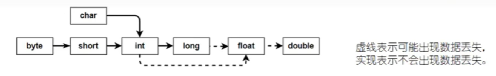

# 常识

## i++与++i

i++ 与 ++i 的**区别**

-   i++：后置递增，先返回当前值，再自增
-   ++i：前置递增，先自增，再返回新值

**示例：**

```java
public static void main(String[] args){
    int i = 1;

    System.out.println("i: "  +   i);	// 1
    System.out.println("++i: "+   ++i); // 2
    System.out.println("i++: "+   i++); // 2
    System.out.println("i: "  +     i); // 3
    System.out.println("--i: "+   --i); // 2
    System.out.println("i--: "+   i--); // 2
    System.out.println("i: "  +   i);   // 1
}
```

## 服务可用性几个9的含义

服务可用性用“几个9”来表示是一种常见的衡量标准，用来描述系统在一定时间内的可靠性。每个“9”代表系统不可用时间的比例减少了一个数量级。下面是不同数量的“9”所代表的服务可用性水平：

|                                  | **通俗叫法** | **可用性级别** | **年度宕机时间** |
| -------------------------------- | ------------ | -------------- | ---------------- |
| **基本可用**                     | **2个9**     | **99%**        | **87.6小时**     |
| **较高可用**                     | **3个9**     | **99.9%**      | **8.8小时**      |
| **具有故障自动恢复能力的可用性** | 4个9         | 99.99%         | 53分钟           |
| **极高可用性**                   | 5个9         | 99.999%        | 5分钟            |
| **容错可用性**                   | 6个9         | 99.9999%       | 31秒             |

```
1年 = 365天 = 8760小时
99.9 = 8760*0.1%= 8760*0.001 = 8.76小时
99.99 = 8760*0.01%= 8760*0.0001 = 0.876小时 = 0.876*60 = 52.6分钟
99.999 = 8760*0.001%= 8760*0.00001 = 0.0876小时 = 0.0876*60 = 5.26分钟
```

-   较高可用：通常被认为是基本的商业级可用性标准
-   具有故障自动恢复能力的可用性：这通常被认为是较高的可用性标准，适用于大多数企业级应用
-   在设计高可用系统时，通常会采取多种措施来提高服务的可用性，如负载均衡、冗余架构、故障切换等

## JDK、JRE、JVM的关系？

- JDK（Java Development Kit）：Java开发工具包，它包含了JRE和一系列Java开发工具。
- JRE（Java Runtime Environment）：JRE是运行Java应用程序所需的环境，它包含了JVM和Java核心类库。JRE只能用来运行Java应用程序，不能用来开发编译，它是JDK的子集。
- JVM（Java Virtual Machine）：Java虚拟机。Java程序必须在JVM中。


## Java中能不能使用中文当作标识符？

可以，因为Java支持Unicode字符集，而Unicode包括了中文。但是，为了代码的可读性和维护性，通常建议使用英文作为标识符。

```java
public class 测试 {
    public static void main(String[] arags) {
        String 姓名 = "张三";
        System.out.println("姓名：" + 姓名);
    }
}
```

## 简述Java标识符的命名规则？

- 标识符可以包含字母、数字、下划线（_）和美元符号（$）
- 标识符不能以数字开头
- 标识符不能使用关键字、保留字（goto、const、_）、特殊值（true、false、null）
- 标识符区分大小写
- 标识符不能包含空格，否则会被识别为是两个标识符


## 为什么在编写Java代码会遇到乱码问题？

## Java中的常量与变量

- 有什么区别？
  - 常量，final修饰的变量，一旦赋值后，就不能被修改
  - 变量，可以重新赋值
- Java中的常量有几种？
  - 局部变量 + final，一般直接初始化
  - 实例变量 + final，一般通过构造器初始化
  - 静态变量 + final，建议大写，一般直接初始化
```java
class Test {
    static final int MAX_COUNT = 10; // 静态常量
    private final int a = 1; // 实例变量
    private final int b;
    private final int c;

    public Test(int b, int c) {
        this.b = b;
        this.c = c;
    }

    public static void main(String[] args) {
        final int d = 10; // 局部变量

    }

}
```


## Java中的基本数据类型有那些？
Java中的基本数据类型包括8种，分别是：

| 数据类型               | 字节 | 值范围                       | 默认值    | 对应包装类 |
| ---------------------- | ---- | ---------------------------- | --------- | ---------- |
| byte                   | 1    | -128 ~ 127                   | 0         | Byte       |
| short（短整型）        | 2    | -32768 ~ 32767               | 0         | Short      |
| int                    | 4    | -2^31 ~ 2^31-1               | 0         | Integer    |
| long                   | 8    | -2^63 ~ 2^63-1               | 0         | Long       |
| double（单精度浮点型） | 4    |                              | 0.0F      | Double     |
| float（双精度浮点型）  | 8    |                              | 0.0D      | Float      |
| char                   | 2    | 0 ~ 65535，采用Unicode字符集 | \`\u0000` | Character  |
| boolean                | 1bit | true 与 false                | false     | Boolean    |

>   问：boolean类型的字节宽度是多少？
>
>   答：boolean类型的变量用于存储真（true）或假（false）的值。JVM规范中并没有规定boolean类型的具体位数，这取决于JVM的实现。通常情况下，为了考虑效率，boolean很可能会被实现为8位（1字节），但这不是固定的，也可能占用更少或更多位。


## char能存储中文吗？

在 Java 中，`char` 类型用于表示单个字符。它使用的是 Unicode 编码，理论上可以存储任何 Unicode 字符，包括中文字符。然而，`char` 类型的大小是固定的 16 位（2 字节），这意味着它可以表示的最大 Unicode 码点是 `0xFFFF`，即基本多文种平面（BMP）中的字符。

示例：

```java
char ch = '龗';
System.out.println(ch); // 输出：龗
```

**关键点**

1.  **Unicode 编码**：
    -   Java 的 `char` 类型基于 Unicode 编码，支持 BMP 中的所有字符。
    -   BMP 包含了大部分常用的字符，包括常见的中日韩（CJK）字符。
2.  **BMP 和 补充平面**：
    -   BMP（Basic Multilingual Plane）：包含码点从 `U+0000` 到 `U+FFFF` 的字符。
    -   补充平面（Supplementary Planes）：包含码点从 `U+10000` 到 `U+10FFFF` 的字符，例如一些不常用的汉字、表情符号等。
3.  **char 和 补充字符**：
    -   `char` 类型只能表示 BMP 中的字符。
    -   对于补充字符（如某些罕见的汉字或表情符号），Java 使用两个 `char` 来表示一个字符，称为代理对（surrogate pair）

**处理补充字符**

对于不在 BMP 中的字符（如某些罕见的汉字或表情符号），需要使用 `String` 或 `Character.toCodePoint` 方法来处理：

```java
public class Main {
    public static void main(String[] args) {
        String emoji = "\ud83d\ude00"; // 表情符号 😊
        System.out.println("字符串: " + emoji);
        int codePoint = emoji.codePointAt(0);
        System.out.println("字符的 Unicode 码点: " + codePoint); // 输出 Unicode 码点
    }
}


字符串: 😊
字符的 Unicode 码点: 128512
```

在这个例子中，表情符号 `😊` 不在 BMP 中，因此使用了两个 `char` 来表示它。通过 `codePointAt` 方法可以获取完整的 Unicode 码点

**总结**

-   **char 可以存储中文字符**，因为这些字符大多位于 BMP 中。
-   **对于补充字符**（如某些罕见的汉字或表情符号），`char` 无法直接表示，需要使用 `String` 或其他方法来处理。
-   **最佳实践**：如果你需要处理所有 Unicode 字符（包括补充字符），建议使用 `String` 类型，因为它可以正确处理代理对和补充字符


## 如何理解自动类型提升？

自动类型提升是指当我们在**计算时**，将`取值范围小的类型`自动提升为`取值范围大的类型`。自动类型提升规则如图所示：



（1）当把存储范围**小**的值（字面量、变量值、表达式计算的结果值）赋值给存储范围**大**的变量时

（2）当存储范围小的数据类型与存储范围大的数据类型一起**混合**运算时，会按照大的类型运算

（3）当**btye、short、char**数据类型进行**算术**或**位**运算时，按照**int**类型处理

>   问：自动类型提升就一定是安全的吗？
>
>   答：不是，也可能存在精度丢失

```java
int i = 'A'; // char自动升级为int
double j = 19; // int自动升级为double
System.out.println(i); // 65
System.out.println(i); // 19.0

int a = 1;
char b = 'A';
long c = 1L;
flaot d = 1.0F;
System.out.println(a + b + c + d); // 升级为float  68.0
```


## 如何理解强制类型转换？

强制类型转换是指，将`取值范围大的类型`强制转换为`取值范围小的类型`。或有时候也可以将`取值范围小的类型`强制提升为`取值范围大的类型`


（1）当把存储范围**大**的值（字面量、变量值、表达式计算的结果值）赋值给存储范围**小**的变量时，需要强制转换，提示：有风险，可能会损失精度

```java
int i = 200;
byte b = (byte)i; // 溢出

double a = 1.2;
int j = (int)a; // 损失精度
```

（2）当某个值想要提升数据类型时，也可以使用强制类型转换

```java
int x = 1;
int y = 2;
double z = (double)x/y;
```


## short s1 = 1; s1 = s1 + 1;有错吗?short s1 = 1; s1 += 1;有错吗？

本题考点为：自动类型提升、隐式转换

```java
short s1 = 1;
s1 = s1 + 1;
```

在这个代码片段中，s1 = s1 + 1;会产生编译错误。s1是short类型的变量，1是int类型的变量。其中short、byte、char类型在进行位运算、算术运算时，会**自动提升**为int类型，因此 s1 + 1 的结果是int类型的值，尝试将int类型的结果赋值给short类型的变量s1时，编译器会报错，因为这是一个潜在的精度丢失，需要显式的类型转换。

```
Type mismatch: cannot convert from int to short
```

要修复这个错误，可以进行显式的类型转换：

```java
short s1 = 1;
s1 = (short) (s1 + 1);
```


```java
short s1 = 1;
s1 += 1;
```

这个代码片段是正确的。因为s1 += 1是一个复合赋值运算符，等价于 s1 = (short) (s1 + 1)。在复合赋值运算符中，存在**隐式类型转换**，所以不会出现类型不匹配的问题。


## Java中有哪些访问修饰符？


## private、public、protected以及不写的区别？

在Java中，访问修饰符（access modifiers）用于控制类、方法和变量的访问级别。主要有四种访问修饰符：private、public、protected和 默认（不写）。

它们的区别如下：

**private**

-   **访问范围**：仅在同一个类内可访问。

-   **使用场景**：用于隐藏类的实现细节，保护类的成员变量和方法不被外部类访问和修改

**public**

-   **访问范围**：在任何地方都可以访问。

-   **使用场景**：用于类、方法或变量需要被其他类访问的情况

**protected**

-   **访问范围**：在同一个包内，以及在不同包中的子类中可访问。

-   **使用场景**：用于希望在同一个包内或子类中访问，但不希望在包外的非子类中访问的情况

**默认（不写）**

-   **访问范围**：仅在同一个包内可访问。

-   **使用场景**：用于包级访问控制，不希望类、方法或变量被包外的类访问

| 修饰符       | 同一个类 | 同一个包 | 子类（不同包） | 其他包 |
| ------------ | -------- | -------- | -------------- | ------ |
| private      | 是       | 否       | 否             | 否     |
| 默认（不写） | 是       | 是       | 否             | 否     |
| protected    | 是       | 是       | 是             | 否     |
| public       | 是       | 是       | 是             | 是     |

```java
package package1;

public class PublicClass {
    private int privateVar;
    int defaultVar;
    protected int protectedVar;
    public int publicVar;

    private void privateMethod() {}
    void defaultMethod() {}
    protected void protectedMethod() {}
    public void publicMethod() {}
}

package package2;

import package1.PublicClass;

public class SubClass extends PublicClass {
    public void accessMethods() {
        // privateMethod(); // 错误，无法访问
        // defaultMethod(); // 错误，无法访问
        protectedMethod(); // 正确，可以访问
        publicMethod(); // 正确，可以访问
    }
}

package package1;

public class SamePackageClass {
    public void accessMethods() {
        PublicClass obj = new PublicClass();
        // obj.privateMethod(); // 错误，无法访问
        obj.defaultMethod(); // 正确，可以访问
        obj.protectedMethod(); // 正确，可以访问
        obj.publicMethod(); // 正确，可以访问
    }
}
```


## final关键字有什么用？

final 关键字可用修饰类、成员变量、方法、局部变量

-   final修饰类：被 final 修饰的类**不能被继承**，即该类为**最终类**。
-   final修饰方法：被 final 修饰的方法**不能被子类重写**，即该方法为最终方法。
-   final修饰变量：被 final 修饰的变量为**常量**，**一旦被赋值后就不能再次修改**。
    -   修饰静态变量：常量
    -   修饰实例变量：很少使用
    -   变量类型为基本类型：被final修饰后**数据值不能发生改变**。
    -   变量类型为引用类型：被final修饰后**地址值不能改变，但地址里的内容可以改变**。
    -   需要注意的是，**final修饰的变量必须在声明时或者构造函数中初始化，否则会编译错误**。
-   final 修饰 局部变量
    -   变量类型为基本类型：被final修饰后**数据值不能发生改变**。
    -   变量类型为引用类型：被final修饰后**地址值不能改变，但地址里的内容可以改变**。

**fianl修饰类**

当一个类被声明为final时，它**不能被继承**。这对于创建不可变类（immutable class）或确保类的实现不被改变是非常有用的。

例如，String类就是一个不可变类

**final修饰变量**

当一个变量被声明为final时，它的值在初始化之后就不能被改变。final变量必须在声明时或通过构造函数进行初始化

-   变量是**基本类型**：final修饰指的是基本类型的**数据值不能发生改变**。

-   变量是**引用类型**：final修饰指的是引用类型的**地址值不能改变，但地址里的内容可以改变**。

```java
public class Example {
    final int finalVar = 10; // 声明时初始化

    final int anotherFinalVar;

    public Example(int value) {
        anotherFinalVar = value; // 通过构造函数初始化
    }

    public void changeValue() {
        // finalVar = 20; // 编译错误，final变量的值不能被改变
    }
}
```

**final修饰方法**

当一个方法被声明为final时，它不能被子类重写（override）。这可以用来防止子类改变父类中关键的方法实现。

**fianl修饰局部变量**

final也可以用于局部变量，尤其是在匿名类或lambda表达式中使用时。被声明为final的局部变量在方法执行期间不能被修改。

-   变量是**基本类型**：final修饰指的是基本类型的**数据值不能发生改变**。

-   变量是**引用类型**：final修饰指的是引用类型的**地址值不能改变，但地址里的内容可以改变**。

```java
public class Example {
    public void method() {
        final int localVar = 10;

        // localVar = 20; // 编译错误，无法修改final局部变量

        Runnable runnable = new Runnable() {
            @Override
            public void run() {
                System.out.println(localVar); // 可以在匿名类中访问final局部变量
            }
        };

        runnable.run();
    }
}
```

**final和不可变对象**

final关键字在创建不可变对象时非常有用。不可变对象的状态在创建之后不能被改变，这在多线程环境中尤其重要，因为它们是线程安全的

```java
public final class ImmutableClass {
    private final int value;

    public ImmutableClass(int value) {
        this.value = value;
    }

    public int getValue() {
        return value;
    }
}
```


## final、finally、finalize的区别？

**final**

final 是一个修饰符，可以用于类、方法和变量。

-   修饰类：被 final 修饰的类不能被继承。

-   修饰方法：被 final 修饰的方法不能被子类重写（override）。

-   修饰变量：被 final 修饰的变量只能赋值一次，一旦赋值后就不能再修改。对于基本数据类型，这意味着它的值不能改变；对于引用类型，这意味着引用不能指向其他对象，但对象本身的内容可以修改。

**finally**

finally 是一个块，通常与 try-catch 结构一起使用。

finally 块中的代码无论是否发生异常都会执行。它通常用于确保某些关键操作（如资源释放）总是被执行

**finalize**

finalize 是 Object 类中的一个方法，可以在对象被垃圾回收之前调用。

finalize 方法允许对象在被垃圾回收之前执行一些清理工作。然而，**由于其不可预测的行为和性能问题**，现代 Java 编程中已经**很少使用 finalize**，取而代之的是更可靠的资源管理方式，如 try-with-resources 或显式的关闭方法。

注意，从 Java 9 开始，finalize 方法已经被标记为不推荐使用（deprecated），并且在未来的版本中可能会被移除。

| 特性     | final                                     | finally              | finalize                            |
| -------- | ----------------------------------------- | -------------------- | ----------------------------------- |
| 定义     | 修饰符                                    | 异常处理块           | Object 类中的方法                   |
| 作用     | 防止继承、重写或重新赋值                  | 确保关键代码总是执行 | 对象被垃圾回收前执行清理操作        |
| 使用场景 | 类、方法、变量                            | 资源释放等关键操作   | 不推荐使用，已废弃                  |
| 示例     | final class、final method、final variable | try-catch-finally    | @Override protected void finalize() |

 

## 什么是Java中的网络编程？


## &和&&、|和||的区别？


## >>、>>>与<<的区别？


## Java的运算符可以重载吗？


## if-else和switch-case的区别？

-   适用性：

    -   if语句的条件是一个布尔类型值，可用于范围的判断，也可以用于等值的判断，适用范围更广。

    -   switch语句的条件是一个常量值（byte、short、int、char及它们的包装类），只能判断某个变量或表达式的结果是否等于某个常量，使用范围较窄。

-   效率：当条件是判断某个变量或表达式的结果是否等于某个固定的常量值时，使用switch效率更高

-   穿透性：使用switch可以利用穿透性，同时执行多个分支，而if-else没有穿透性


OOP

## Java三大特性是什么？


## **什么是封装？**

## 什么是继承？

## **什么是多态？**

## 什么是Java的封装特性？

## **重载和重写的区别？**

## **构造器是否可被重写？**


## 父类的静态方法能否被子类重写?

静态方法即被static所修饰的成员方法。被static修饰的方法或属性只于类本身有关，被类的所有对象所共享。

静态方法是通过类名调用的，而不是通过实例调用的，所以它们不能表现出多态性。

因此父类的静态方法**不能**被子类重写（override）。

不过，子类可以定义一个与父类静态方法同名的方法，这种情况称为方法隐藏（method hiding），而不是方法重写。


## Java中一个类可以继承多个类吗？


## Java为什么不支持多继承？


## **深拷贝和浅拷贝的区别是什么?**

深拷贝（Deep Copy）和浅拷贝（Shallow Copy）是对象复制的两种方式，它们在复制对象时的行为有所不同，特别是在处理包含引用类型的对象时

-   浅拷贝

浅拷贝创建一个新对象，然后将原始对象的所有非静态字段复制到该新对象。如果字段是基本数据类型，则直接复制其值；如果是引用数据类型，则复制的是引用地址，这意味着新对象和原对象共享这些引用类型的实例。

-   深拷贝

深拷贝不仅创建一个新的对象，还会递归地复制所有引用类型的字段，确保新对象与其副本之间没有任何共享的引用。

**浅拷贝（Shallow Copy）**

```java
class Person {
    String name;
    int age;

    Person(String name, int age) {
        this.name = name;
        this.age = age;
    }
}

class Employee implements Cloneable {
    String position;
    Person person;

    Employee(String position, Person person) {
        this.position = position;
        this.person = person;
    }

    @Override
    protected Object clone() throws CloneNotSupportedException {
        return super.clone(); // 浅拷贝
    }
}

public class ShallowCopyExample {
    public static void main(String[] args) throws CloneNotSupportedException {
        Person person = new Person("John", 30);
        Employee original = new Employee("Manager", person);
        Employee copy = (Employee) original.clone();

        System.out.println(original.person == copy.person); // true，引用相同
        copy.person.name = "Jane";
        System.out.println(original.person.name); // "Jane"，原对象也被修改
    }
}
```

**深拷贝（Deep Copy）**

```java
class Person implements Cloneable {
    String name;
    int age;

    Person(String name, int age) {
        this.name = name;
        this.age = age;
    }

    @Override
    protected Object clone() throws CloneNotSupportedException {
        return super.clone();
    }
}

class Employee implements Cloneable {
    String position;
    Person person;

    Employee(String position, Person person) {
        this.position = position;
        this.person = person;
    }

    @Override
    protected Object clone() throws CloneNotSupportedException {
        Employee cloned = (Employee) super.clone();
        cloned.person = (Person) person.clone(); // 深拷贝
        return cloned;
    }
}

public class DeepCopyExample {
    public static void main(String[] args) throws CloneNotSupportedException {
        Person person = new Person("John", 30);
        Employee original = new Employee("Manager", person);
        Employee copy = (Employee) original.clone();

        System.out.println(original.person == copy.person); // false，引用不同
        copy.person.name = "Jane";
        System.out.println(original.person.name); // "John"，原对象未被修改
    }
}
```


## 为什么要使用深拷贝？

**避免共享引用**

当你复制一个对象时，如果不使用深拷贝，那么复制的实际上是原对象的引用，而不是真正的副本。这意味着对新对象的任何修改都会影响到原对象。深拷贝则能确保复制的对象是真正的副本，与原对象没有引用关系

**线程安全**

在多线程环境中，如果多个线程同时访问很修改同一个对象，可能会导致数据不一致或竟态条件。通过深拷贝创建对象的副本，每个线程都可以在自己的副本上进行操作，从而避免了线程安全问题。


## 静态（类）变量和实例变量的区别？


## 静态（类）方法和实例方法的区别？


## 什么是Java的迭代器？


## compare与


## 怎么判断一个链条是不是环形链表？


## 什么是接口？


## 什么是抽象类？


## 接口和抽象类有什么区别？


## Java中的参数传递是按值还是按引用？


## 可变类与不可变类？


## 什么是Java中的不可变类？


## 简述Java异常的体系结构？

Java 的异常体系是基于类层次结构的，所有的异常和错误都继承自 `Throwable `类。Throwable 类有两个主要的子类：`Error` 和 `Exception`。

`Throwable`类

-   定义：所有异常和错误的超类（基类）

-   作用：表示程序中发生的一些严重问题，这些问题是程序本身无法处理的

`Throwable`类有两个主要的子类：

-   `Error`类： 表示严重的系统级错误或资源耗尽等问题    表示严重的错误，通常是由于系统级问题导致的，例如`OutOfMemoryError`、`StackOverflowError`等。`Error`通常是不可恢复的，程序无法处理它们
    -   特点：通常是由 JVM 抛出，表示程序无法继续执行
    -   程序员通常不需要捕获或处理 Error，因为它们通常是不可恢复的。
    -   常见类型：`OutOfMemoryError`、`StackOverflowError`、`NoClassDefFoundError`等
-   `Exception` 类：表示程序运行时可以被捕获和处理的异常。
    -   特点：可以通过 try-catch 块捕获并处理或通过 throws 声明
    -   分为编译时异常（Checked Exceptions）和运行时异常（Unchecked Exceptions）。
        -   编译时异常（Checked Exceptions）
            -   定义：必须在编译时处理的异常。
            -   特点：编译器强制要求程序员处理这些异常。
            -   如果方法中抛出了编译时异常，调用者必须通过 **try-catch 捕获**异常或通过 **throws 声明**该方法可能抛出此异常。
            -   常见类型：`IOException`、`SQLException`、`ClassNotFoundException`
        -   运行时异常（Unchecked Exceptions）
            -   定义：不必在编译时处理的异常。
            -   特点：编译器不要求必须捕获或声明这些异常，但可以选择性地处理。通常由程序逻辑错误引起。
            -   常见类型：`NullPointerException`、`ArrayIndexOutOfBoundsException`、`IllegalArgumentException`、`ArithmeticException` 、`ClassCastException`

异常体系图

```java
java.lang.Throwable:异常体系的根父类
	|---java.lang.Error:错误。Java虚拟机无法解决的严重问题。如JVM系统内部错误，资源耗尽等严重情况
							一般不编写针对性代码进行处理
		|----StackOverflowError、OutOfMemroyError
	
	// 常见异常
	|---java.lang.Exception:异常。我们可以编写针对性代码进行处理。
		|----编译时异常：（受检异常、checked异常）在执行javac.exe命令时，出现的异常
			|----ClassNotFoundException
			|----FileNotFoundException
			|----IOException
			|---- ParseException（解析异常）
		|----运行时异常：（非受检异常、unchecked异常）在执行java.exe命令时，出现的异常
			|----ArrayIndexOutOfBoundsException（数组索引越界）
			|----NullPointerException（空指针异常）
			|----ClassCastException（类型转换异常）
			|----NumberFormatException（数字格式化异常）
			|----InputMismatchException
			|----ArithmeticException（算数异常）
			|----IllegalArgumentException（参数错误，比如方法入参类型错误）
```


## Java中Exception和Error有什么区别？

`Error` 和 `Exception` 都是`Throwable` 类的子类

在Java中，只有继承了Throwable类的实例，才可以被throws抛出或catch捕获

总的来说，`Error`  通常表示系统级的错误，是不可恢复的，程序无法处理它们 ；`Exception` 表示程序运行时可以被捕获和处理的异常

`Exception` 可以分为 **编译时异常（Checked Exceptions）**和**运行时异常（Unchecked Exceptions）**

-   编译时异常（Checked Exceptions）：必须在编译时**显式处理**的异常，必须通过 **try-catch 捕获**异常或通过 **throws 声明**
    -   常见类型：`IOException`、`SQLException`、`ClassNotFoundException`
-   运行时异常（Unchecked Exceptions）：不必在编译时显式处理的异常。
    -   常见类型：`NullPointerException`、`ArrayIndexOutOfBoundsException`、`IllegalArgumentException`、`ArithmeticException` 、`ClassCastException`

`Error`类： 表示严重的系统级错误或资源耗尽等问题    表示严重的错误，通常是由于系统级问题导致的，例如`OutOfMemoryError`、`StackOverflowError`等。

-   特点：通常是由 JVM 抛出，表示程序无法继续执行
-   程序员通常不需要捕获或处理 Error，因为它们通常是不可恢复的。
-   常见类型：`OutOfMemoryError`、`StackOverflowError`、`NoClassDefFoundError`等


## 常见的Error？

最常见的就是 `VirtualMachineError`，它有两个经典的子类：`StackOverflowError`、`OutOfMemoryError`

```java
public class ErrorTest {

    @Test
    public void testStackOverError() {
        recursion();  // StackOverflowError（栈内存溢出）
    }

    // 没有出口的递归
    public void recursion() {
        recursion();
    }

    
    @Test
    public void testOutOfMemoryError01() {
        // OutOfMemoryError
        // 方式一  
        int[] arr = new int[Integer.MAX_VALUE];
    }

    @Test
    public void testOutOfMemoryError02() {
        // 方式一
        StringBuilder s = new StringBuilder();
        while (true) {
            s.append("hello");
        }
    }
}
```


## Java运行时异常和编译时异常的区别是什么？

>   首先明确
>
>   ​	运行时异常 == 非受检异常 
>
>   ​	非运行异常 == 受检异常 == 编译时异常

在 Java 中，异常分为两大类：受检异常（Checked Exceptions） 和 非受检异常（Unchecked Exceptions）
-   **受检异常（Checked Exception）**：这些异常在**编译时必须被捕获或声明抛出，否则编译器会报错**。例如`IOException`、`SQLException`等。
-   **非受检异常（Unchecked Exception）**：这些异常不需要在编译时捕获或声明抛出，编译器不会强制要求处理它们。通常是由于编程错误导致的，例如`NullPointerException`、`ArrayIndexOutOfBoundsException`等。

**受检异常（Checked Exception）**

受检异常是指那些在**编译阶段**就必须处理的异常。编译器会强制要求程序员处理这些异常，否则代码无法通过编译。

特点

-   必须处理：如果方法中抛出了编译时异常，调用者**必须通过 try-catch 块捕获异常或通过 throws 关键字声明**该方法可能抛出此异常。
-   常见类型：`IOException`、`SQLException`、`ClassNotFoundException` 、`FileNotFoundException`等。

**非受检异常（Unchecked Exception）**

非受检异常是指那些在**运行时**才发生的异常，编译器不会强制要求程序员处理这些异常。它们**通常是由于程序中的逻辑错误引起的**。

特点

-   无需处理：编译器不要求必须捕获或声明这些异常，但可以选择性地处理。

-   常见类型：`NullPointerException`、`ArrayIndexOutOfBoundsException`、`IllegalArgumentException`、`ArithmeticException` 、`ClassCastException`等。
-   继承自 RuntimeException：所有运行时异常都是 RuntimeException 类及其子类的实例。

| 特性       | 受检异常（Checked Exceptions）                    | 非受检异常（Unchecked Exceptions）                           |
| ---------- | ------------------------------------------------- | ------------------------------------------------------------ |
| 别名       | 编译时异常、非运行时异常                          | 运行时异常                                                   |
| 定义       | 必须在编译时处理的异常                            | 运行时才发生的异常                                           |
| 编译器要求 | 必须捕获或声明                                    | 不需要捕获或声明                                             |
| 常见类型   | IOException, SQLException, ClassNotFoundException | NullPointerException, ArrayIndexOutOfBoundsException, IllegalArgumentException |
| 继承自     | Exception 类及其子类                              | RuntimeException 类及其子类                                  |
| 使用场景   | 外部环境导致的异常，如文件读写、网络连接等        | 程序逻辑错误，如空指针、数组越界、类转换异常等               |
| 处理方式   | 使用 try-catch 或 throws                          | 可以选择性地使用 try-catch                                   |


## 常见的编译时异常（非运行时异常）Checked Exceptions？

编译时异常（受检异常）是指那些在**编译阶段**就必须处理的异常。编译器会强制要求程序员处理这些异常，否则代码无法通过编译。

调用者**必须通过 try-catch 块捕获异常或通过 throws 关键字声明**该方法可能抛出此异常。

常见类型：`IOException`、`SQLException`、`ClassNotFoundException` 、`FileNotFoundException`等。

`ParseException`

```java
public static void main(String[] args) throws ParseException {
    String data = " 2020-04-10 14:25:25";
    SimpleDateFormat simpleDateFormat = new SimpleDateFormat("yyyy-MM-dd HH:mm:ss");
    Date d = simpleDateFormat.parse(data);  // 抛出编译时异常
    System.out.println(d);
}
```

`InterruptedException`

```java
@Test
public void test1() {
    try {
        Thread.sleep(1000);  // InterruptedException
    } catch (InterruptedException e) {
        e.printStackTrace();
    }
}
```

`ClassNotFoundException`

```java
@Test
public void test2() {
    try {
        Class.forName("java.lang.String");  // ClassNotFoundException
    } catch (ClassNotFoundException e) {
        e.printStackTrace();
    }
}
```

`FileNotFoundException`

```java
@Test
    public void test3() {
        try {
            // FileNotFoundException
            FileInputStream fis = new FileInputStream("hello.txt");
        } catch (FileNotFoundException e) {
            e.printStackTrace();
        }
    }
```

`SQLException`

```java
@Test
public void test4() {
    try {
        DriverManager.getConnection("...");  // SQLException
    } catch (SQLException throwables) {
        throwables.printStackTrace();
    }
}
```

`IOException`

```java
@Test
public void test5() {
    try {
        FileInputStream fis = new FileInputStream("hello.txt");  // FileNotFoundException
        fis.read();  // IOException
    } catch (IOException e) {
        e.printStackTrace();
    }
}
```


## 常见的运行时异常（非受检异常）UnChecked Exceptions？

非受检异常是指那些在**运行时**才发生的异常，编译器不会强制要求程序员处理这些异常。它们**通常是由于程序中的逻辑错误引起的**。

特点

-   无需处理：编译器不要求必须捕获或声明这些异常，但可以选择性地处理。

-   常见类型：`NullPointerException`、`ArrayIndexOutOfBoundsException`、`IllegalArgumentException`、`ArithmeticException` 、`ClassCastException`等。

`ArrayIndexOutOfBoundsException`

```java
    @Test
    public void test1() {
        int[] arr = {1, 2, 3};
        System.out.println(arr[3]);  // ArrayIndexOutOfBoundsException 数组角标越界异常
        // 在开发中，数组的越界异常是不能出现的，一旦出现了，就必须要修改我们编写的代码
    }
```

`NullPointerException`

```java
@Test
public void test2() {
    String srt = null;
    System.out.println(srt.equals("hello"));  // NullPointerException 空指针异常
}
```

`ClassCastException`

```java
@Test
public void test3() {
    Object n = 15;
    String str = (String) n;  // ClassCastException
}
```

`NumberFormatException`

```java
@Test
public void test4() {
    String s = "12ab";
    Integer.parseInt(s);  // NumberFormatException
}
```

`InputMismatchException`

```java
@Test
public void test5() {
    Scanner sc = new Scanner(System.in);
    System.out.print("请输入一个整数:");
    int n = sc.nextInt();// 我们输入一个非整数，让程序报错 InputMismatchException
    sc.close();
}
```

`ArithmeticException`算术异常

```java
@Test
public void test6() {
    System.out.println(10 / 0);  // ArithmeticException
}
```


## throw和throws的区别？

-   throws使用于方法声明（方法签名）处，指明将产生的异常向上一层抛出（抛给方法调用者）。
-   trhow使用于方法内部，后面紧跟着的是异常类对象，表示手动抛出指定的异常类对象。
    -   例如：`throw new Exception("输入的id非法");`
-   throws是用来处理异常对象的
-   throw是用来产生异常对象的


## 异常处理时需要注意哪些？

异常处理时需要注意以下六点：

**（1）尽量不要捕获类似于Exception这样的通用异常，而应该捕获特定的异常**

**（2）不要”吞“了异常**

如果我们捕获了异常，却不把异常抛出，也没有写入到日志里，那么会发生什么情况？

线上除了bug莫名其妙的任何的信息，你都不知道哪里出错，出错的原因是什么，这会导致一个简单的bug难以排查。

还有就是如果你的项目中使用了spring的声明式事务，那么事务也不会回滚。

还有些人，喜欢在使用了catch之后用`e.printStackTrace`，在开发中，通常是不推荐这种做法的，一般情况下这样子做没有问题，这个方法输出的是一个标准错误流。

比如在分布式系统中，发生异常但找不到stackTrace。

所以最好是输入到日志中，定义自己公司的格式，将详细的信息输入到日志系统中，适合清晰高效的排查错误。

**（3）不要延迟处理异常**

比如你有一个方法，参数是name，函数内部调了别的好几个方法，其实你的name传递的是null值，但是你没有在进入这个方法或一开始就处理这个情况，而是在你调用了好几个别的方法后爆出了这个空指针。

**（4）只在需要try-catch的地方try-catch，try-catch的范围能小则小**

只在需要try-catch的地方使用，不要滥用，因为try-catch中的代码会影响JVM对代码的优化，例如重排序。

**（5）不要通过异常来控制程序流程**

一些可以使用if/else的条件语句来判断的，例如null值等，就不要使用异常，异常肯定是比一些条件语句低效的，有CPU分支预测的优化等。

而且每次实例化一个异常都会对栈进行快照，相对而言这是一个比较重的操作，如果数量过多开销就不能被忽略了

**（6）不要在finally代码块中处理返回值或直接return**

在finally中处理返回值或直接return会发生很诡异的事情，比如覆盖了try中的return，或者屏蔽了异常


## try-catch-finally都是干啥的？try中有return时的执行流程？

`try`：用来捕获异常
`catch`：用于处理try中捕获的异常
`finally`：无论是否捕获或处理异常，fianlly块中的代码都会被执行。

**基本结构**

```java
try {
	// 可能产生异常的代码
} catch (异常类型1 e) {s
     //当产生异常类型1 型异常时的处置措施
} catch (异常类型2 e) {
     //当产生异常类型2 型异常时的处置措施
} finally{
	//无论是否发生异常，都无条件执行的语句
}
```

**语法规则**

-   try必须有
-   finally可以无
-   try后面必须跟catch 或者 finally 其中之一
-   try后面可以有0个或者多个catch，只能有0个或者1个finally。
-   若try后面没有catch，则必须有一个finally
-   只要try里面出现异常，无论try里是否含return，出现异常下面的程序都不会再执行了

**使用细节**

-   将可能出现异常的代码声明在try语句中，一旦代码发现异常，就会自动生成对应的异常类对象，并将此对象抛出
-   针对try语句抛出的异常类对象，使用catch语句进行匹配。
    -   一旦匹配上，就进入catch语句块进行处理（即捕获）， 一旦处理结束，代码就可继续往下执行。
    -   如果匹配不上，那么JVM 将会终止当前方法的执行，并把异常对象“抛”给调用者。如果调用者不处理，程序就挂了。
-   如果声明了多个catch结构，不同的异常类型在不存在子父类关系的情况下，谁声明在上面，谁声明在下面都可以
    -   如果多个异常类型满足子父类关系，则必须将子类声明在父类结构的上面。否则，报错。
-   catch中异常处理的方式：
    -   1）自己编写输出的语句
    -   2） printStackTrace()：打印异常的详细信息。
    -   3）getMessage()：获取发生异常的原因
-   try中声明的变量，作用域只在try结构内部局部有效
-   try-catch结构是可以嵌套使用的


**情况1：try{} catch(){}finally{} return;**

```java
try{
    
} catch () {
    
} finally {
    
}
return;
```

程序按顺序执行。

**情况2：try{ return; }catch(){} finally{} return;**

```java
try{
    return;
} catch () {
    
} finally {
    
}
return;
```

程序执行try块中return之前（包括return语句中的表达式运算）代码；再执行finally块，最后执行try中return;

finally块之后的语句return，因为程序在try中已经return所以不再执行。

**情况3：try{ } catch(){return;} finally{} return;**

```java
try{
    
} catch () {
    return;
} finally {
    
}
return;
```

程序先执行try，如果遇到异常执行catch块， 有异常：则执行catch中return之前（包括return语句中的表达式运算）代码，再执行finally语句中全部代码，最后执行catch块中return

finally块之后的语句return不再执行。

无异常：执行完try再finally再return

**情况4：try{ return; }catch(){} finally{return;}**

```java
try{
   	return;
} catch () {
    
} finally {
    return;
}
```

程序执行try块中return之前（包括return语句中的表达式运算）代码；再执行finally块，因为finally块中有return所以**提前退出**。

**！！！因此，开发中，禁止在finally块在使用return，因为它会覆盖try块中正常的reuturn**

**情况5：try{} catch(){return;}finally{return;}**

```java
try{
   	
} catch () {
    return;
} finally {
    return;
}
```

程序执行catch块中return之前（包括return语句中的表达式运算）代码；再执行finally块，因为finally块中有return所以**提前退出**。

**情况6：try{ return;}catch(){return;} finally{return;}**

```java
try{
   return;
} catch () {
    return;
} finally {
    return;
}
```

程序执行try块中return之前（包括return语句中的表达式运算）代码；有异常：执行catch块中return之前（包括return语句中的表达式运算）代码；则再执行finally块，因为finally块中有return所以提前退出。无异常：则再执行finally块，因为finally块中有return所以提前退出。

**结论：**

​    任何执行try 或者catch中的return语句之前，都会先执行finally语句，如果finally存在的话。如果finally中有return语句，那么程序就return了，所以finally中的return是一定会被return的

**！！！因此，开发中，禁止在finally块在使用return，因为它会覆盖try块中正常的reuturn**


## finally块一定会执行吗？

正常情况下，任何执行try 或者 catch 中的return语句之前，都会先执行finally语句，因此我们通常会将资源释放操作、业务日志的对应等操作放在finally块中。

但是，在以下两种情况下不会执行

1、程序还没有进入到try语句块就因为异常导致程序终止，这个问题主要是开发者在编写代码的时候，异常捕获的范围不够

2、极端情况下，在 try 或者 catch 语句块中执行了System.exit(0)语句，导致JVM直接退出， finally块不会执行


## 什么是内部类？与普通的区别？有什么用？


## JDK8的新特性？

### Java8新增了哪些新特性？

-   接口的默认方法和静态方法
    -   默认方法：接口中可以定义默认方法，子类可以选择性地重写这些方法。
    -   静态方法：接口中可以定义静态方法，可以直接通过接口调用。
-   新的日期和时间API：java8引入了`java.time`包，提供了更丰富的日期和时间处理功能。
-   Option类：Option类用于表示可能为null的值，避免空指针异常。
-   函数式接口：函数式接口是只有一个抽象方法的接口，可以用`@FunctionalInterface`注解标记。函数式接口的变量可以采用Lambda表达式进行赋值。
-   Lambda表达式：Lambda表达式允许你将函数作为参数传递。
-   方法引用：方法引用允许你直接引用已有的方法或构造器，而无需显式地创建Lambda表达式。
-   移除PermGen空间：Java8移除了PermGen（永久代）空间，取而代之的是Metaspace（元空间）

### 接口中的默认方法和静态方法

在jdk8之前，interface之中可以定义变量和方法，**变量必须是`public`、`static`、`final`的**，**方法必须是`public`、`abstract`的**，由于这些修饰符都是默认的，所以在书写的时候可以省略不写。

-   接口定义方法：public  abstract —— 需要子类实现

-   接口定义变量：public、static、final （记住，接口中的变量必须初始化）

在JDK 1.8开始 支持使用`static`和`default` 修饰 可以写方法体，不需要子类重写（可以选择性的重写）。

```java
public interface MyInterface {
    // public final static int age=18;
    int age = 18;  // 接口中的变量 必须初始化

    //public abstract void doSomething(String input);
    void doSomething(String input);  // 接口中的抽象方法 不必声明方法体

    /**
     * 默认方法 可以写方法体
     */
    default void getDefaultOrder() {
        System.out.println("我是默认方法 我可以写方法体");
    }

    /**
     * 静态方法 可以写方法体
     */
    static void getStaticOrder() {
        System.out.println("我是静态的方法 可以写方法体");
    }
}


public class MyInterfaceImpl implements MyInterface{

    // 接口中的抽象方法 必须重写
    @Override
    public void doSomething(String input) {

    }

    // 默认方法可以重写，但没必要
    @Override
    public void getDefaultOrder() {

    }
}
```


### Option


### HashMap底层数据结构的改变


### 日期类


### CompletableFuture


### Lambda

Java中使用Lambda表达式（Lambda expression）是为了**简化匿名内部类的代码形式**

Lambda表达式**适用于单接口匿名类**(**接口中只有一个抽象方法的匿名内部类**)

以下是Lambda表达式简化匿名内部类的格式

```java
(匿名内部类被重写方法的形参列表) -> {
    被重写方法的方法体（Lambda体）
}

lambda形参列表 -> lambda体
 
// -> 是语法形式，无实际意义
```

注意：

​	Lamdba表达式只能简化**函数式接口的匿名内部类**的写法形式（换句话说，Lambda是实现函数式接口的一种语法糖）

**函数式接口**（jdk8新特性）

-   必须是接口
-   接口中只有一个抽象方法（接口中可以有多个static方法、default方法，但只能有一个抽象方法）
-   一般可以加上**@FunctionalInterface**注解，来声明这是函数式接口

>   Lambda表达式基本作用？
>
>   -   简化函数式接口的匿名内部类的写法
>
>   Lambda表达式使用要注意什么？
>
>   -   必须是接口的单接口匿名内部类
>
>   Lambda表达式该何时使用？
>
>   -   需要作为接口的实现类对象时使用
>
>   Lambda表达式的好处
>
>   -   Lambda是一个匿名函数，我们可以把Lambda表达式理解为是一段可以传递的代码（即，**Lambda表达式可以被用作参数传递或返回值**），它可以写出更简洁、更灵活的代码，同时使代码风格更加紧凑，**使Java语言表达能力得到了提升**
>
>   **Lambda表达式的本质：**
>
>   -   一方面，Lambda表达式作为接口的实现类对象。
>   -   另一方面，Lambda表达式是一个匿名函数


### 函数式接口

**什么是函数式接口**

-   **接口中只声明一个抽象方法**（Single Abstract Method，简称 SAM）的接口，称为函数式接口。
    -   当然该接口可以包含其他非抽象方法（例如，可以有static方法、default方法）。 
-   你**可以通过 Lambda 表达式来创建该接口的对象**。（若 Lambda 表达式抛出一个受检异常(即非运行时异常)，那么该异常需要在目标接口的抽象方法上进行声明）。  
-   我们**可以在一个接口上使用 `@FunctionalInterface` 注解**，这样做**可以检查它是否是一个函数式接口**。同时 javadoc 也会包含一条声明，说明这个接口是一个函数式接口。  
-   在 `java.util.function` 包下定义了 Java 8 的丰富的函数式接口

**对函数式接口的理解**

-   Java 从诞生日起就是一直倡导**一切皆对象**，在 Java 里面面向对象(OOP)编程是一切。但是随着 python、scala 等语言的兴起和新技术的挑战，Java 不得不做出调整以便支持更加广泛的技术要求，即 Java 不但可以支持 OOP 还可以支持 OOF（面向函数编程）
    -   Java8 引入了 Lambda 表达式之后，Java 也开始支持函数式编程。
    -   Lambda 表达式不是 Java 最早使用的。目前 C++，C#，Python，Scala 等
        均支持 Lambda 表达式。
-   面向对象的思想：
    -   做一件事情，找一个能解决这个事情的对象，调用对象的方法，完成事情。
-   函数式编程思想：
    -   只要能获取到结果，谁去做的，怎么做的都不重要，重视的是结果，不重视过程。
-   在函数式编程语言当中，函数被当做一等公民对待。在将函数作为一等公民的编程语言中，Lambda 表达式的类型是函数。但是在 Java8 中，有所不同。在 Java8 中，Lambda 表达式是对象，而不是函数，它们必须依附于一类特别的对象类型——函数式接口。
-   简单的说，**在 Java8 中，Lambda 表达式就是一个函数式接口的实例。**这就是 Lambda表达式和函数式接口的关系。也就是说，**只要一个对象是函数式接口的实例，那么该对象就可以用 Lambda 表达式来表示。**

**核心函数式接口**

| 称谓       | 函数式接口      | 抽象方法                | 抽象方法特点          |
| ---------- | --------------- | ----------------------- | --------------------- |
| 任务型接口 | Runable         | void run()              | 无参无返回值          |
| 消费型接口 | Consumer\<T>    | void accept(T t)        | 有参无返回值          |
| 供给型接口 | Supplier\<T>    | T get()                 | 无参有返回值          |
| 函数型接口 | Function\<T, R> | R apply(T t)            | 有参有返回值          |
| 判断型接口 | Predicate\<T>   | boolean test(T t)       | 有参有返回值，boolean |
| 比较型接口 | Comparator\<T>  | int compare(T t1, T t2) | 有参有返回值，int     |


### 方法引用

方法引用是 Java 8 引入的一种简洁语法，用于直接引用已有方法或构造函数，而无需显式地使用 Lambda 表达式。它使得代码更加简洁和易读。

简单来说：

-   方法引用，可以看做是基于Lambda表达式的进一步刻画。
-   当需要提供一个函数式接口的实例时，我们可以使用lambda表达式提供此实例。
-   **当满足一定的条件的情况下，我们还可以使用方法引用或构造器引用替换lambda表达式**

方法引用的本质：

​	**方法引用作为了函数式接口的实例。** ===> 体现了 ”万物皆对象“


方法引用主要有以下几类：

-   静态方法引用
    -   引用类的静态方法。
    -   格式：ClassName::staticMethodName

-   实例方法引用
    -   引用某个对象的实例方法。
    -   格式：objectReference::instanceMethodName

-   特定类型的任意对象的实例方法引用（类::实例方法）
    -   引用某个类型的所有实例共有的方法（即该类型所有对象都可以调用的方法）。
    -   格式：ClassName::instanceMethodName
-   构造器引用
    -   引用类的构造方法来创建新对象。
    -   格式：ClassName::new


**静态方法引用**

**要求**

-   函数式接口中的**抽象方法a与其内部实现时调用的对象的某个静态方法b的形参列表和返回值类型都相同（一致）**
-   此时，可以**考虑使用方法b对方法a的替换、覆盖**。此替换或覆盖即为**方法引用**

**注意**

-   此方法b是静态（static修饰）方法，需要类调用

**使用场景**

-   如果某个Lambda表达式里只是调用一个静态方法，并且前后参数的形式一致，就可以使用静态方法引用

```java
public class MethodRefTest {

    /**
     * 类 :: 静态方法（静态方法引用）
     * Comparator中的 int compare(T o1, T o2)
     * Integer中的 int compare(int x, int y)
     */
    @Test
    public void test1() {
        // 1.匿名内部类
        Comparator<Integer> com1 = new Comparator<Integer>() {
            @Override
            public int compare(Integer o1, Integer o2) {
                return Integer.compare(o1, o2);
            }
        };
        System.out.println(com1.compare(12, 21));

        System.out.println("--------------");
        // 2.Lambda表达式简化
        Comparator<Integer> com2 = (o1, o2) -> Integer.compare(o1, o2);
        System.out.println(com2.compare(12, 21))
        ;
        System.out.println("--------------");
        // 3.方法引用简化
        Comparator<Integer> com3 = Integer::compare;  // 类::静态方法
        System.out.println(com3.compare(34, 34));
    }

    /**
     * Function中的 R apply(T t)
     * Math在的 long round(double a)
     */
    @Test
    public void test2() {
        // 1.匿名内部类
        Function<Double, Long> fun1 = new Function<Double, Long>() {
            @Override
            public Long apply(Double aDouble) {
                return Math.round(aDouble);
            }
        };
        System.out.println(fun1.apply(2.0));

        System.out.println("--------------");
        // 2.Lambda表达式
        Function<Double, Long> fun2 = (aDouble) -> Math.round(aDouble);

        System.out.println("--------------");
        // 3.方法引用
        // Function的抽象方法apply与Math类的静态方法round的形参列表与返回值类型一致
        // 因此使用round方法替换apply
        Function<Double, Long> fun3 = Math::round;  // 类::静态方法
    }
}
```


**实例方法引用**

**要求**

-   函数式接口中的**抽象方法a与其内部实现时调用的对象的某个方法b的形参列表和返回值类型都相同（一致）**
-   此时，可以**考虑使用方法b对方法a的替换、覆盖**。此替换或覆盖即为**方法引用**

**注意**

-   此方法b是非静态（不含static修饰）方法，需要对象调用

**使用场景**

如果某个Lambda表达式只是想调用一个实例方法，并且前后参数的形式一致，就可以使用实例方法引用

```java
public class MethodRefTest {

    /**
     * 对象 :: 实例方法（实例方法引用）
     */
    @Test
    public void test1() {
        // 1.匿名内部类
        Consumer<String> con = new Consumer<String>() {
            @Override
            public void accept(String s) {
                System.out.println(s);
            }
        };
        con.accept("hello world");

        System.out.println("--------------");
        // 2.Lambda表达式
        Consumer<String> con2 = s -> System.out.println(s);
        con2.accept("hello world");

        System.out.println("--------------");
        // 3.方法引用
        Consumer<String> con3 = System.out::println;  // 对象名::实例方法
        con3.accept("hello world");
    }

    /**
     * Supplier中的get方法
     * Employee中的String getName方法
     */
    @Test
    public void test2() {
        Employee emp = new Employee(1001, "马化腾", 34, 6000.38);
        // 1.匿名内部类
        Supplier<String> sup1 = new Supplier<String>() {
            @Override
            public String get() {
                return emp.getName();
            }
        };
        System.out.println(sup1.get());

        System.out.println("--------------");
        // 2.Lambda表达式
        Supplier<String> sup2 = ()->emp.getName();
        System.out.println(sup2.get());

        System.out.println("--------------");
        // 3.方法引用
        // Supplier的抽象方法get与emp对象的getName方法的形参列表与返回值类型一致
        // 因此使用getName方法替换get
        Supplier<String> sup3 = emp::getName;
        System.out.println(sup3.get());
    }
}
```


**类 :: 实例方法** （难点）

**要求**

-   函数式接口中的**抽象方法a与其内部实现时调用的对象的某个方法b的形参列表和返回值类型都相同（一致）**
-   同时，抽象方法a中有n个参数，方法b有n-1个参数，且**抽象方法a**的**第一个参数作为方法b的调用者**，且**抽象方法a的后n-1个参数与方法b的n-1个参数的类型相同（一致）**。
-   则此时，可以**考虑使用方法b对方法a的替换、覆盖**。此替换或覆盖即为**方法引用**

**注意**

-   此**方法b是非静态（不含static修饰）方法**，需要对象调用，但**形式上，写成对象a所属的类来调用**

**使用场景**

-   如果某个Lambda表达式里只是想调用一个实例方法，并且前面参数列表的**第一个参数作为方法的主调**，**后面所有的参数都是作为改实例方法的入参**，则就可以使用特定类型的方法引用。

```java
public class MethodRefTest3 {

    /**
     * 类 :: 实例方法（难点）
     *      todo 本质上依然是对象来调用实例方法
     * Comparator中的int compare(T o1, T o2)
     * String中的int t1.compareTo(t2)
     */
    @Test
    public void test1() {
        // 1.匿名内部类
        Comparator<String> com1 = new Comparator<String>() {
            @Override
            public int compare(String o1, String o2) {
                return o1.compareTo(o2);
            }
        };
        System.out.println(com1.compare("abc","abd"));
        System.out.println("--------------");

        // 2.Lambda表达式
        Comparator<String> com2 = (o1,o2)->o1.compareTo(o2);
        System.out.println(com2.compare("abc","abd"));
        System.out.println("--------------");

        // 3.方法引用
        Comparator<String> com3 = String::compareTo;  // 类（特定类型）::实例方法
        System.out.println(com3.compare("abc","abd"));
    }

    /**
     * BiPredicate中的boolean test(T t, U u)
     * String中的boolean s1.equals(s2)
     */
    @Test
    public void test2() {
        // 1.匿名内部类
        BiPredicate<String,String> biPre1 = new BiPredicate<String, String>() {
            @Override
            public boolean test(String s1, String s2) {
                return s1.equals(s2);
            }
        };
        System.out.println("--------------");

        // 2.Lambda表达式
        BiPredicate<String,String> biPre2 = (S1,S2)->S1.equals(S2);
        System.out.println("--------------");

        // 3.方法引用
        // BiPredicate的抽象方法test与String类的实例方法equals的形参列表与返回值类型一致
        // 且抽象方法test第一个参数作为实例方法equals的调用者
        // 因此使用equals方法替换test
        BiPredicate<String,String> biPre3 = String::equals;
        System.out.println(biPre3.test("abc","abd"));
    }


    /**
     * Function中的R apply(T t)
     * Employee中的String getName方法
     */
    @Test
    public void test3() {
        Employee emp = new Employee(1001, "马化腾", 34, 6000.38);
        // 1.匿名内部类
        Function<Employee,String> fun1 = new Function<Employee, String>() {
            @Override
            public String apply(Employee employee) {
                return employee.getName();
            }
        };
        System.out.println(fun1.apply(emp));
        System.out.println("--------------");

        // 2.Lambda表达式
        Function<Employee,String> fun2 = employee-> employee.getName();
        System.out.println("--------------");

        // 3.方法引用
        // Function的抽象方法apply与Employee类的实例方法getName的形参列表与返回值类型一致
        // 且抽象方法apply第一个参数作为实例方法getName的调用者
        // 因此使用getName方法替换apply
        Function<Employee,String> fun3 = Employee::getName;
        System.out.println(fun3.apply(emp));
    }
}
```


**构造器引用**

当 Lambda 表达式是创建一个对象，并且满足 Lambda 表达式形参，正好是给创建这个对象的构造器的实参列表，就可以使用构造器引用

**说明**

-   调用了类名对应的类中的某一个确定的构造器
-   **具体调用的是类中的哪一个构造器这取决于函数式接口的抽象方法的形参列表**

**使用场景**

-   如果某个Lambda表达式里只是在创建对象，并且前后参数情况一致，就可以使用构造器引用。

```java
public class ConstructorRefTest {
    /**
     * 构造器引用
     * Supplier中的T get()
     */
    @Test
    public void test1(){
        // 1.匿名内部类
        Supplier<Employee> sup1 = new Supplier<Employee>() {
            @Override
            public Employee get() {
                return new Employee();
            }
        };
        System.out.println(sup1.get());
        System.out.println("--------------");

        // 2.构造器引用
        Supplier<Employee> sup2 = Employee::new;   // 调用的是Employee类中空参的构造器
        System.out.println(sup2.get());
    }

    /**
     * Function中的R apply(T t)
     */
    @Test
    public void test2(){
        // 1.匿名内部类
        Function<Integer,Employee> fun1 = new Function<Integer, Employee>() {
            @Override
            public Employee apply(Integer id) {
                return new Employee(id);
            }
        };
        System.out.println(fun1.apply(18));
        System.out.println("--------------");

        // 2.构造器引用
        Function<Integer,Employee> fun2 = Employee::new;  // 调用的是Employee类中参数是Integer/int类型的构造器
        System.out.println(fun2.apply(18));
    }

    /**
     * BiFunction中的R apply(T t, U u);
     */
    @Test
    public void test3(){
        // 1.匿名内部类
        BiFunction<Integer,String,Employee> fun1 = new BiFunction<Integer, String, Employee>() {
            @Override
            public Employee apply(Integer id, String name) {
                return new Employee(id,name);
            }
        };
        System.out.println(fun1.apply(18,"kk"));
        System.out.println("--------------");

        // 2.构造器引用
        BiFunction<Integer,String,Employee> fun2 = Employee::new;  // 调用的是Employee类中参数是Integer/int、String类型的构造器
        System.out.println(fun2.apply(18,"kk"));
    }
}
```

-   当 Lambda 表达式是创建一个数组对象，并且满足 Lambda 表达式形参，正好是给创建这个数组对象的长度，就可以**数组构造引用**

```java
/**
     * 数组引用
     * Function中的R apply(T t)
     */
    @Test
    public void test1(){
        // 1.匿名内部类
       Function<Integer,Employee[]> fun1 = new Function<Integer, Employee[]>() {
           @Override
           public Employee[] apply(Integer length) {
               return new Employee[length];
           }
       };
        System.out.println(fun1.apply(10));
        System.out.println("--------------");

        // 2.数组引用
        Function<Integer,Employee[]> fun2 = Employee[]::new;
        System.out.println(fun2.apply(10));

    }
```


### Stream

**Stream流是什么？**

Stream流是Java8引入的一个强大功能，用于处理数据集合（如集合、数组）。Stream提供了一种高效且易于使用的处理数据的方式，支持顺序和并行处理。Stream不存储数据，而是通过管道操作（如过滤、映射、规约等）对数据进行处理。

Stream的主要特点

-   **懒加载**：Stream的许多操作都是懒加载的，这意味着它们不会立即执行，而是在终止操作（如collect、forEach等）时才会执行。
-   **链式调用**：Stream支持链式调用，可以将多个操作串联起来，形成一个流水线。
-   **函数式编程**：Stream支持函数式编程风格，可以使用Lambda表达式和方法引用来简化代码。
-   **并行处理**：Stream可以很容易地转换为并行流，利用多核处理器进行并行处理，提高性能。


**Stream 和 Collection 集合的区别**

**Collection 是一种静态的内存数据结构， 讲的是数据，而 Stream 是有关计算的，讲的是计算。**前者是主要面向内存，存储在内存中，后者主要是面向 CPU，通过 CPU 实现计算

流表面上看来去和集合很类似，都可以让我们转换和获取数据。但是他们之间存在着显著的差距：

-   **Stream 流并不存储数据。**这些元素可能存储在底层的集合中，或者是按需生成的。
-   **Stream 流操作不会修改其数据源。**例如，filter方法不会从流中移除元素，**而是会生成一个新的流**，其中不包含过滤掉的元素。
-   **流的操作是尽可能的惰性执行的。**这意味着直至需要其结果时，操作才会执行（即 一旦执行终止操作，就执行中间操作链，并产生结果。）。例如，如果我们只想查找前5个长单词而不是所以长单词，那么filter方法就会在匹配第5个单词后停止过滤。由此，我们甚至可以操作无限流。
-   Stream 流一旦执行了终止操作，就不能调用其他中间操作或终止操作了


**操作流的典型流程**

1.  **创建一个流** 一个数据源（如：集合、数组），获取一个流

2.  **中间操作**（指定将初始流转换为其他流，可能包含很多步骤，即中间操作的方法 

    返回值仍然是 Stream 类型的对象。因此中间操作可以是个**操作链**，可对数据源 

    的数据进行 n 次处理，但是在终结操作前，并不会真正执行）

3.  **终止操作**。（这个操作会强制执行之前的惰性操作，之后这个流就不能再用了）


**Stream流分为哪几类？怎么创建？**

​	Stream流在Java8中主要分为两类：顺序流（Sequential Stream）和并行流（Perallel Stream）。这两类流的主要区别在于处理数据的方式和性能表现。

**顺序流（Sequential Stream）**

顺序流按顺序处理数据，每次只处理一个元素。单线程执行。适用于数据量较小或对顺序有要求的场景。代码容易理解和调式

创建方式：

-   使用`Collection`接口的stream()方法

-   使用`Arrays`类的stream()方法

-   使用`Stream`类的静态方法of()、iterate()、generate()等

**并行流（Perallel Stream）**

并行流可以同时处理多个元素，利用多核处理器的并行计算能力。多线程执行。适用于数据量较大且对顺序无严格要求的场景。性能提升明显，但可能会增加代码复杂性和调式难度。

创建方式：

-   使用`Collection`接口的parallerStream()方法

-   使用`Stream`类的parallel()方法将顺序流转化为并行流


## Stream流中的map和flatMap方法的区别？

map方法不会影响流中元素的个数，但是流中元素的类型、元素值可能发生变化。它的原理是按照统一的规则将现在的流中每一个元素改造为另一个对象。

map方法会影响流中元素的个数，同时流中元素的类型、元素值可能发生变化。它的原理是按照某个规则将现在的流中每一个元素计算为一个新的Stream，然后最后将所有Stream合并为一个大的Stream

`map` 方法

-   **作用**：将每个元素通过给定的函数进行转换，并生成一个新的流。
-   **返回值**：返回一个与原始流大小相同的新流，其中每个元素都是经过转换后的结果。
-   **适用场景**：当你需要对每个元素进行一对一的转换时使用

```java
List<String> words = Arrays.asList("hello", "world");

List<Integer> wordLengths = words.stream()
    .map(String::length)
    .collect(Collectors.toList());

System.out.println(wordLengths); // 输出: [5, 5]
```

`flatMap` 方法

-   **作用**：将每个元素通过给定的函数进行转换，并将结果流展平（flatten）为一个单一的流。
-   **返回值**：返回一个包含所有转换后元素的新流，可能会比原始流更长或更短，具体取决于转换函数的输出。
-   **适用场景**：当你需要对每个元素进行一对多的转换，或者将嵌套的流展平为一个单一的流时使用。

```java
List<List<Integer>> nestedLists = Arrays.asList(
    Arrays.asList(1, 2),
    Arrays.asList(3, 4)
);

List<Integer> flatList = nestedLists.stream()
    .flatMap(List::stream)
    .collect(Collectors.toList());

System.out.println(flatList); // 输出: [1, 2, 3, 4]
```

**关键区别**

| 特性         | `map`                    | `flatMap`                            |
| :----------- | :----------------------- | :----------------------------------- |
| **转换方式** | 一对一转换               | 一对多转换或展平嵌套流               |
| **返回结果** | 每个元素转换为一个新元素 | 每个元素转换为多个元素或展平为单一流 |
| **流的结构** | 维持原有的流结构         | 展平嵌套的流结构                     |


## Stream中map、peek、forEach方法的区别？

`map`

-   **作用**：将每个元素通过给定的函数进行转换，并生成一个新的流。
-   **返回值**：返回一个与原始流大小相同的新流，其中每个元素都是经过转换后的结果。
-   **适用场景**：当你需要对每个元素进行一对一的转换时使用。
-   **是否终止操作**：不是终止操作（中间操作），可以链式调用其他流操作。

```java
List<String> words = Arrays.asList("hello", "world");

List<Integer> wordLengths = words.stream()
    .map(String::length)
    .collect(Collectors.toList());

System.out.println(wordLengths); // 输出: [5, 5]
```

`peek`

-   **作用**：用于调试目的，在不改变流中元素的情况下对每个元素执行操作（如打印日志）。
-   **返回值**：返回包含相同元素的新流，流的结构保持不变。
-   **适用场景**：主要用于调试，查看流中元素的状态，而不影响后续操作。
-   **是否终止操作**：不是终止操作（中间操作），可以链式调用其他流操作。

```java
List<String> words = Arrays.asList("hello", "world");

List<String> result = words.stream()
    .peek(System.out::println) // 打印每个元素
    .map(String::toUpperCase)
    .collect(Collectors.toList());

System.out.println(result); // 输出: [HELLO, WORLD]
```

`forEach`

-   **作用**：对流中的每个元素执行给定的操作。
-   **返回值**：无返回值（`void`），操作完成后流结束。
-   **适用场景**：当你需要对每个元素执行某些副作用操作（如打印、更新状态等）时使用。
-   **是否终止操作**：是终止操作（终端操作），执行后流结束，不能再链式调用其他流操作。

```java
List<String> words = Arrays.asList("hello", "world");

words.stream()
    .forEach(System.out::println); // 输出: hello world

// 注意：forEach之后不能再调用其他流操作
```

**关键区别**

| 特性             | `map`                    | `peek`                   | `forEach`                            |
| :--------------- | :----------------------- | :----------------------- | :----------------------------------- |
| **作用**         | 转换元素                 | 调试/查看元素            | 执行副作用操作                       |
| **返回值**       | 新流（转换后的元素）     | 新流（原样元素）         | 无返回值（`void`）                   |
| **是否终止操作** | 不是终止操作（中间操作） | 不是终止操作（中间操作） | 是终止操作（终端操作）               |
| **适用场景**     | 元素转换                 | 调试、日志记录           | 执行副作用操作（如打印、更新状态等） |

**使用注意事项**

-   **性能考虑**：`peek` 主要用于调试，不应在生产代码中滥用，因为它可能会引入不必要的性能开销。
-   **副作用**：`forEach` 适用于有副作用的操作（如打印、更新状态等），但它会终止流，因此不能与其他流操作链式调用。
-   **不可变性**：`map` 和 `peek` 都是中间操作，不会改变原始流的内容，而是返回新的流，这使得流操作更加安全和可预测。

**总结**

-   **map**：用于转换流中的元素，生成新流。
-   **peek**：用于调试或查看流中元素的状态，不影响流的结构。
-   **forEach**：用于对每个元素执行副作用操作，终止流


## Java中包装类与基础类型的区别？


## 什么是自动装箱和拆箱？


## int和Interger装箱是怎么实现的？


## Integer的构造器在Java8后有变动？

```java
public Integer(int value) {
    this.value = value;
} // 从jdk9开始，此构造器被标记为 @Deprecated ，而推荐使用valueOf方法
```


## Integer类型的数值比较？

在 Java 中，Integer 是一个包装类（wrapper class），用于将基本数据类型 int 封装为对象。由于 Integer 是引用类型，因此在进行数值比较时需要注意一些细节，尤其是自动装箱（autoboxing）和缓存机制的影响

先看一个例子：

```java
Integer a = Integer.valueOf(600);
Integer b = Integer.valueOf(600);
int c = 600;
System.out.println(a == b); 			// false
System.out.println(a.equals(b)); 		// true，因为Integer重写了equals方法
System.out.println(a == c); 			// true，==运算符，对于基本类型，比较的是值


Integer x = Integer.valueOf(99);
Integer y = Integer.valueOf(99);
System.out.println(x == y); 			// true，因为存在缓存机制
System.out.println(x.equals(y)); 		// true
```

**基本数值比较**

1）使用 == 比较 Integer 对象

-   == 比较的是引用：当使用 == 比较两个 Integer 对象时
    -   对于引用类型，== 实际上比较的是它们的引用（即内存地址），而不是它们封装的数值。

例如：即使两个 Integer 对象封装相同的数值，如果它们是不同的对象实例，== 会返回 false。

```java
Integer a = new Integer(100);
Integer b = new Integer(100);
System.out.println(a == b); // 输出: false
```

2）使用 .equals() 方法

-   .equals() 比较的是值（前提是需要equals方法被正确的重写）：Integer 类重写了 Object 类的 equals() 方法，确保它比较的是两个 Integer 对象封装的数值，而不是引用。
-   为了确保正确性，应该使用 equals() 方法来比较 Integer 对象的值。

```java
Integer a = new Integer(100);
Integer b = new Integer(100);
System.out.println(a.equals(b)); // 输出: true
```

小结

​	**推荐使用equals方法来比较两个Integer对象**

**自动装箱与缓存机制**

Java 为了优化性能，在 -128 到 127 之间的 Integer 对象会被缓存（通过 Integer.valueOf() 实现）。

这意味着在这个范围内的 Integer 对象可能会共享同一个实例，因此使用 == 比较时可能会得到 true 的结果。

```java
Integer x = 100; // 自动装箱
Integer y = 100; // 自动装箱
System.out.println(x == y); // 输出: true (因为 100 在缓存范围内，所以指向同一个引用)

Integer m = 150; // 自动装箱
Integer n = 150; // 自动装箱
System.out.println(m == n); // 输出: false (因为 150 不在缓存范围内)
```

**总结**

​	为了避免因自动装箱和缓存机制导致的意外行为，==始终使用 .equals() 方法 来比较 Integer 对象的值==。

**阿里规约**


## 什么是Java中的Integer缓存池？

Java的Integer缓存池是为了提升性能和节省内存。根据实战发现大部分的数据操作都集中在值比较小的范围，因此缓存这些对象可以减少内存分配和垃圾回收的负担，提升性能。

**原理**：

-   Java中自动装箱时，对于`-128` 到 `127` 直接的 `int` 类型，会直接返回一个已缓存的`Integer`对象，而不是创建新的对象。（**通过 Integer.valueOf() 实现**）
-   实现原理是int类型在自动装箱时会调用`Integer.valueOf()`，进而用到了IntegerCache
-   IntegerCache中的数据是在static静态块中通过遍历的方式生成的

**缓存池的使用场景**

-   **自动装箱**：当基本类型int转换为包装类Integer时，若数值在缓存范围内，返回缓存对象
-   **值比较**：由于相同范围内的整数使用同一个缓存对象，使用`==`可以正确比较它们的引用，而不需要使用`equals`。但是超过缓存池范围内的Integer对象，`==`比较的是对象引用，而不是数值。要比较数值，应使用`equals`方法
    -   因此，**阿里规约强制包装类之间的比较应使用`equals`方法**


**扩展**

在Java8及之后，可以通过JVM参数`-xx:AutoBoxCacheMax=size`来调整缓存池上限

```java
java --xx:AutoBoxCacheMax=500 // 表示将缓存池扩展到 -128到500
```

其他包装类的缓存机制

-   Long、Short、Byte包装类的缓存池范围是 -128到127
-   Flaot 和 Double 没有缓存池，因为是小数，太多了
-   Character缓存池范围是`\u0000`到`\u007F`（即0到127，代表ASCII字符集）
-   Boolean只有两个缓存值，true和false


## hashCode和equal方法是什么？

equals方法用于比较两个对象是否相等，hashCode方法用于返回对象的哈希值，这两个方法必须一起重写，而且选择的属性必须一致，因为：

hashCode方法必须遵循：

（1）如果进行equals比较时所用的信息没有被修改，那么同一个对象多次调用hashCode方法时，必须结果一致

（2）如果两个对象equals为true，那么它们的hashCode值也必须相同

（3）如果两个对象equals为false，那么它们的hashCode值相同或不同都可以。当然不同可以提升哈希表的性能

另外，equals方法必须遵循：

（1）自反性：x不为null，那么x.equals(x)必须为true

（2）对称性：x、y不为null，那么x.equals(y)与y.equals(x)结果必须相同

（3）传递性：x、y、z不为null，如果x.equals(y)为true，y.equals(z)为true，那么x.equals(z)结果必须一致

（4）一致性：x、y不为null，且x和y用于equals比较的属性值也没有修改，那么多次调用x.equals(y)结果必须一致

（5）如果x不为null，x.eqauls(null)必须返回false

>   问：两个对象的equals方法相等，hashCode方法也会相等吗？
>
>   答：对
>
>   问：两个对象的hashCode方法相等，equals方法也会相等吗？
>
>   答：不对
>
>   问：为什么重写equals就要重写hashCode？
>
>   答：因为hashCode必须遵循上述3条常规协定，这些规定是为`HashMap`、`HashSet`等基于哈希的集合类型提供正确行为的基础。如果不遵守这个约定，对象在使用这些集合类型时可能会表现出不可预测的行为


## 重写 hashCode() 方法的基本原则？

-   在程序运行时，同一个对象多次调用 hashCode() 方法应该返回相同的值。 
-   当两个对象的 equals() 方法比较返回 true 时，这两个对象的 hashCode() 方法的返回值也应相等。 
-   对象中用作 equals() 方法比较的 Field，都应该用来计算 hashCode 值。

## 重写 equals()方法的基本原则？

-   重写 equals 方法的时候一般都需要同时复写 hashCode 方法。通常参与计算hashCode 的对象的属性也应该参与到 equals()中进行计算。 
-   推荐：开发中直接调用 Eclipse/IDEA 里的快捷键自动重写 equals()和 hashCode()方法即可。 

为什么用 Eclipse/IDEA 复写 hashCode 方法，有 31 这个数字？ 

首先，选择系数的时候要选择尽量大的系数。因为如果计算出来的 hash 地址越大，所谓的“冲突”就越少，查找起来效率也会提高。（减少冲突） 

其次，31 只占用 5bits,相乘造成数据溢出的概率较小。 

再次，31 可以 由 i*31== (i<<5)-1 来表示,现在很多虚拟机里面都有做相关优化。（提高算法效率） 

最后，31 是一个素数，素数作用就是如果我用一个数字来乘以这个素数，那么最终出来的结果只能被素数本身和被乘数还有 1 来整除！(减少冲突) 


## 为什么重写equals时也需要重写hashCode？


## equal 与 == 的区别？

-   == 运算符
    -   基本数据类型：比较两个值是否相等。
    -   引用类型（对象）：比较两个引用是否指向同一个对象（即内存地址是否相同）。

-   equals() 方法
    -   **默认**行为：对于所有对象，默认实现是继承自 Object 类的 equals() 方法，它**实际上与 == 相同**，即**比较的是引用**。
    -   **重写后**的行为：许多类（如 String、Integer 等）重写了 equals() 方法以提供更有意义的比较逻辑。例如，String 的 equals() 比较的是字符串**内容**是否相同，而不是引用。

**注意事项**

-   **自动装箱和缓存**：对于基本类型的包装类（如 Integer），当数值在 -128 到 127 之间时，Java会进行缓存，因此在这个范围内使用 == 比较可能会得到 true，但这不是推荐的做法。

```java
Integer i1 = 100;
Integer i2 = 100;
System.out.println(i1 == i2); // true (因为缓存)
```

-   **null 检查**：使用 equals() 时需要注意避免 NullPointerException。可以使用 Objects.equals() 来安全地比较可能为 null 的对象。

总结：

​	== 用于比较基本数据类型或引用是否相同，而 equals() 用于比较对象的内容是否相同（前提是该方法被正确重写）

**equal 与 == 的区别**

|          | ==                                                       | equals                                                 |
| -------- | -------------------------------------------------------- | ------------------------------------------------------ |
| 比较范围 | 可以比较基本类型、引用类型                               | 只能比较引用类型                                       |
| 比较规则 | 基本类型：比较数据值<br>引用类型：比较引用值（内存地址） | 默认：与 == 一致<br>重写后：比较内容（具体看实现方法） |

示例

```java
public class Main {
    public static void main(String[] args) {
        String s1 = new String("abc");
        String s2 = new String("abc");
        System.out.println(s1 == s2);      // false
        System.out.println(s1.equals(s2)); // true 因为String类重写了equals
        Set<String> set1 = new HashSet<>();
        Collections.addAll(set1, s1, s2); 
        System.out.println(set1.size());   // 1 因为String重写了hashCode，内容一致hash值也一致
        System.out.println("===================");

        Person p1 = new Person("abc");
        Person p2 = new Person("abc");
        System.out.println(p1 == p2);     // false
        System.out.println(p1.equals(p2));// false 因为Person类没有重写equals，实际使用的是Object中的equals方法，比较的是引用
        Set<Person> set2 = new HashSet<>();
        Collections.addAll(set2, p1, p2);
        System.out.println(set2.size());  // 2 因为Person类没有重写hashCode，实际使用的是Object中的hashCode方法 
    }
}

// ！！！注意，此类没有重写hashCode和equals方法
class Person {
    private Integer id;
    private String personName;

    public Person(String personName) {
        this.personName = personName;
    }

    // getter、setter
} 
```


## Java中方法参数传值还是传引用？

>   Java语言总是按值传递的。参考：Java核心技术 4.5方法参数

先总结一下

-   基本数据类型参数的传值：传递数据值

-   引用类型参数的传值：传递地址值

在Java中，参数传递机制可以概括为**传值调用（Pass by Value）**，但其具体表现因传递的是基本数据类型还是引用数据类型而有所不同。

-   **基本数据类型**

当传递基本数据类型（如 int, float, char 等）时，方法接收的是该值的一份拷贝。因此，在方法内部对参数的修改不会影响到原始变量。

概述：传递的是数据值的拷贝

-   **引用数据类型**

对于引用数据类型（如对象、数组等），**传递的是引用的拷贝**（即内存地址的拷贝）。这意味着方法内部和外部共享**同一个对象实例**，因此如果在方法内改变对象的状态（例如修改对象的属性），这种改变会影响到原始对象。

然而，如果在方法内部重新给这个引用赋值（指向一个新的对象），这并不会影响到原始对象，因为这只是改变了该引用拷贝所指向的位置。

```java
public static void main(String[] args) {
    StringBuilder sb = new StringBuilder("Hello");
    reassignReference(sb);
    System.out.println(sb.toString()); // 输出"Hello"
}

public static void reassignReference(StringBuilder str) {
    str = new StringBuilder("World");
}
```

所以，Java中的参数传递是传值调用，但对于引用数据类型，传递的是引用的值（即内存地址），这使得方法可以操作原始对象的内容，但不能更改原始引用本身指向的对象。


demo

```java
public static void changeValue1(int age) {
    age = 10;
}
public static void changeValue2(Person person) {
    person.setPersonName("xxx");
}
public static void changeValue3(String str) {
    str = "xxx";
}

public static void main(String[] args) {
    int age = 20;
    changeValue1(age);
    System.out.println(age); // 20 因为基本类型，传值拷贝，方法内部对参数的修改不会影响到原始变量

    Person person = new Person("abc");
    changeValue2(person);
    System.out.println(person.getPersonName()); // xxx 引用类型，传递引用拷贝，方法内改变对象的状态，会影响到原始对象。

    String str = "abc";
    changeValue3(str);
    System.out.println(str); // abc 因为方法内部重新给这个引用赋值（指向一个新的对象），这并不会影响到原始对象，因为这只是改变了该引用拷贝所指向的位置
}

class Person {
    private Integer id;
    private String personName;

    public Person(String personName) {
        this.personName = personName;
    }

    // getter、setter
} 
```


## for循环与foreach循环的区别？

语法结构

-   for循环：需要初始化计数器、设置终止条件以及定义计数器的增量

-   foreach循环：语法更简洁，直接遍历数组或集合中的元素，无需关心索引

作用于使用场景

-   普通for循环，可以用于所有需要重复执行某些语句的场景。也可以用于遍历数组于支持索引访问的List集合。
-   增强for循环，只能用于遍历数组与Collection集合

使用区别

-   如果使用普通for遍历数组，需要指定下标值，可以修改数组的元素
-   如果使用增强for遍历数组，不需要指定下标，但无法修改数组的元素，可能会抛出`ConcurrentModificationException`异常

增强for循环只是一种语法糖

-   增强for循环遍历数组时，编译器仍然会将对应代码转化为普通for循环
-   增强for循环遍历Collection集合时，编译器会将对应代码转化为Iterator迭代器遍历集合的代码


## 为什么是动态代理？


## JDK动态代理与CGLib动态代理的区别？


## 什么是Java中的注解？


## 什么是Java的反射？

Java 反射（Reflection） 是一种强大的机制，允许程序在运行时动态地获取类的信息，并且可以操作类的字段、方法和构造函数。通过反射，程序可以在运行时检查或“内省”类的能力，甚至可以在运行时修改类的行为。

反射的**主要功能**包括：

-   获取类信息：可以获取类的名称、父类、实现的接口等。

-   创建对象实例：可以在运行时创建类的实例，而不需要在编译时知道具体的类名。

-   访问和修改字段：可以读取或修改类的私有字段。

-   调用方法：可以调用类的方法，即使这些方法是私有的。

-   获取和设置构造函数：可以调用类的构造函数来创建对象。

Java反射机制提供的功能：

-   在运行时判断任意一个对象所属的类
-   在运行时构造任意一个类的对象
-   在运行时判断任意一个类所具有的成员变量和方法
-   在运行时获取泛型信息
-   在运行时调用任意一个对象的成员变量和方法
-   在运行时处理注解
-   生成动态代理

**应用场景**

-   框架开发：许多框架（如 Spring、Hibernate）大量使用反射来实现依赖注入、动态代理等功能。
-   动态加载类：可以在运行时根据配置文件或其他条件动态加载类，而不需要在编译时确定具体的类名。
-   调试工具：反射可以用于编写调试工具，动态查看和修改对象的状态。
-   序列化和反序列化：反射可以用于实现自定义的序列化和反序列化逻辑。
-   测试工具：单元测试框架（如 JUnit）使用反射来动态调用测试方法。

**反射相关的主要API**

-   **java.lang.Class**：代表一个类

-   java.lang.reflect.Method：代表类的方法 

-   java.lang.reflect.Field：代表类的成员变量

-   java.lang.reflect.Constructor：代表类的构造器 

-   ....

**反射的优缺点**

**优点：**

-   提高了Java程序的灵活性和扩展性，**降低了耦合性**，提高**自适应**能力
-   允许程序创建和控制任何类的对象，无需提前**硬编码**目标类

**缺点：**

-   反射的**性能较低**。
    -   反射机制主要应用在对灵活性和扩展性要求很高的系统框架上
-   反射会**模糊程序内部逻辑，可读性较差**。

反射在平时的开发中，使用并不多。主要是在框架的底层使用（例如：Spring）

**反射的源头 Class**	

要想解剖一个类，必须先要获取到该类的 Class 对象。而剖析一个类或用反射解决具体的问题就是使用相关 API: 

-   java.lang.Class 
-   java.lang.reflect.* 

 所以，Class 对象是反射的根源。 

​	在 Java 中，`Class` 类是一个特殊的类，用于表示其他类的元数据。它提供了一种在运行时获取和操作类的方法和属性的机制。**每个类在Java虚拟机中都有一个对应的Class对象**，可以通过该对象获取类的信息。

**理解Class类**

以Java类的加载为说明：

​	针对编写好的 .java 源文件，使用 javac.exe 进行编译，生成一个或多个 .class 字节码文件。接着，使用 java.exe 命令对指定的 .class 文件进行解释执行。在这个过程中，我们需要将  .class 字节码文件加载（使用类加载器）到内存中（存放到方法区）。**加载到内存中的  .class 文件对应的结构即为 Class的一个实例。**


## Java反射机制如何获取Class类的实例，Class类有哪些常用方法？

**获取Class类的实例的四种方式**

-   类型名.class
-   Java对象.getClass()
-   Class.forName("类型全名称")
-   ClassLoader类加载对象.loadClass("类型全名称")

**方式 1：类型名.class**

​	**要求编译期间已知类型前提**：若已知具体的类，**通过类的 class 属性（静态属性）获取**，**该方法最为安全可靠，程序性能最高** 

```java
Class clazz = String.class; 	// 类调用静态属性
```

**方式 2：Java对象.getClass()**

```java
Class clazz = "hello".getClass(); // 对象.getClass()，因为在方法定义在Object在，任意内都可以使方法
```

 **方式 3：Class.forName("类型全名称")**

​	**可以获取编译期间未知的类型** 

**前提：已知一个类的全类名**，且该类在类路径下，可通过 Class 类的静态方法forName()获取，可能抛出 `ClassNotFoundException`

```java
Class clazz = Class.forName("java.lang.String"); // Class的静态方法，forName(String className) 推荐使用
```

**方式 4：ClassLoader类加载对象.loadClass("类型全名称")**

​	**使用类的加载器方式**（其实我们知道了类的全限名，完成可以使用第三种方式）

前提：可以**用系统类加载对象或自定义加载器对象加载指定路径下的类型** 

例如：

```java
ClassLoader cl = this.getClass().getClassLoader(); 
Class clazz4 = cl.loadClass("类的全类名")
```


**哪些类型可以有 Class 对象**

Class的实例都可以指向哪些结构呢？

简言之，所有 Java 类型！ 

（1）class：外部类，成员(成员内部类，静态内部类)，局部内部类，匿名内部类

（2）interface：接口 

（3）[]：数组 

（4）enum：枚举 

（5）annotation： 注解@interface

（6）primitive type：基本数据类型

（7）void


**Class类的常用方法**

（1）获取类信息

-   getName()  获取类的完全限定名
-    getSimpleName()  获取类的简单名称
-   getPackage()  获取类所在的包
-   isInterface()  判断该类是否是一个接口
-   isEnum()  判断该类是否是一个枚举
-   isAnnotation()  判断该类是否是一个注解  

（2）获取构造器

-   getConstructor(Class<?>... parameterTypes)  获取类的某个构造器：只能拿public修饰的某个构造器对象
-   getConstructors()  获取类的所有构造方法，只能获取public修饰的构造器  
-   getDeclaredConstructor(Class<?>... parameterTypes)  获取某个构造器：只要你敢写，就能拿到，无所谓权限是否可及（包括私有）
-   getDeclaredConstructors()  获取全部的构造器：只要你敢写，无所谓权限是否可及

-   setAccessible(boolean flag) 暴力反射(反射会破坏封装性)

（3）获取方法

-   getMethod(String name, Class<?>... parameterTypes)  获取类中的某个成员方法，只能获取public修饰的
-   getMethods()  获取类中的所有成员方法，只能获取public修饰的 
-    getDeclaredMethod(String name, Class<?>... parameterTypes)  获取类中某个成员方法
-   getDeclaredMethods()  获取类声明的所有方法

（4）获取字段

-   getField(String name)  获取类的某个成员变量，只能获取public修饰的
-   getFields() 获取类的所有成员变量，只能获取public修饰的
-   获取类的某个成员变量 getDeclaredField(String name)
-   getDeclaredFields()  获取类声明的所有字段

（5）创建实例

-   newInstance()  创建类的实例
    -   注意：要想对象创建成功，需满足以下条件
        -   1、要求运行时类中必须提供空参构造器
        -   2、要求提供的空参构造器的权限要足够，否则报错 IllegalAccessException
    -   从JDK9开始，此方法被标记为 `@Deprecated(since="9") `已过时   
    -   JDK9之后，我们会使用 Constructor 类的 newInstance方法 创建类的实例

-   Constructor\<T>.newInstance(Object... initargs)  使用指定的构造器创建一个实例

（6）获取父类和接口

-   getSuperclass()  获取类的父类
-   getInterfaces()  获取类实现的接口

（7）获取注解

-   getAnnotation(Class\<T> annotationClass)  获取该类上的指定注解
-   getAnnotations()  获取该类上的所有注解
-   getDeclaredAnnotation(Class\<T> annotationClass)  获取该类上的指定注解（包括私有）
-   getDeclaredAnnotations()  获取该类上的所有注解


## Java反射机制可以访问父类的私有方法吗？

可以，但是需要进行一个额外的操作来绕过Java的访问限制控制。步骤如下：

-   1、获取父类的 Class 对象
-   2、使用 getDeclaredMethod 方法获取私有方法
-   3、使用 setAccessible 方法解除访问限制（暴力反射）

-   4、使用 invoke 方法调用父类私有方法


## Java反射有没有性能影响|反射到底慢在哪里？

Java反射会对性能产生影响，主要体现在以下方面

1、初始化开销

-   类加载：使用反射时，如果类还没有被加载到JVM中，反射会触发类的加载过程。类加载本身就是一个相对耗时的操作，因为它涉及到类文件的读取、解析和验证

-   对象创建：通过反射创建对象时，需要查找和解析类的构造器，这比直接使用 new 关键字创建对象要慢

2、方法调用开销

-   动态绑定：反射调用方法时，需要在运行时动态查找和绑定方法，这比编译时静态绑定的方法调用慢得多。每次调用反射方法时，都需要进行方法查找和权限检查

-   缓存机制：虽然现代JVM对反射方法调用进行了优化，例如缓存方法查找结果，但仍然无法完全消除性能差距

3、安全检查

-   访问控制：使用 setAccessible方法来访问私有成员时，JVM需要进行额外的安全检查，以确保这种操作是允许的，这些安全检查会增加额外的开销

4、字符串操作

-   方法和字段名称：反射通常需要使用字符串来指定方法和字段名称，这会导致额外的字符串处理和比较操作。

5、内存开销

-   元数据：反射操作需要维护大量的元数据信息，这些信息会占用额外的内存


## Java为什么要引入模块化？（JDK9）

Java模块化是指Java9及其之后引入的一种新的组织和管理代码的方式，旨在解决传统Java应用的类路径问题和依赖管理问题。

好处：

-   更好的封装：模块化系统提供了强封装机制，只有显式导出的包才能被其他模块访问，提高了代码的安全性和可维护性
-   清晰的依赖管理：模块描述符（module-info.java）明确声明了模块的依赖关系，避免了类路径污染和依赖冲突问题
-   更好的性能：模块化系统可以优化类加载过程，减少不必要的类加载，提高应用的启动速度和运行效率
-   更好的可维护性：模块化系统鼓励将diamond组织成独立的模块，每个模块负责一个特定的功能。提高了代码的可维护性和可测试性


## 什么是Java中的SPI（service provide interface）机制？


## 什么是泛型？泛型有什么用？

 在Java中，泛型（Generics）是提供类型安全的机制，它允许在定义类、接口和方法是使用**类型参数**。通过使用泛型，可以**重用**相同的代码来处理不同类型的对象，同时保持**类型的安全性**，避免了运行时类型错误。


## 集合使用泛型有什么优点？

-   强制集合只容纳指定类型的对象，避免了运行时出现`ClassCastExceotion`类型转换异常，把元素类型的检查从运行时提前到了编译时。
-   代码更整洁，使用时不需要instanceof判断和显式转换。
-   优化了JVM运行时环境，因为它不会产生类型检查的字节码指令，类型检查在编译时就完成了。


## Java中泛型的T、R、K、V、E是什么？

在Java中，泛型使用类型参数来表示不确定的类型。常见的类型参数有以下几个，它们通常代表特定的含义，但这些只是**约定俗成**的命名习惯，并不是强制性的。

| 字母 | 含义                    | 应用场景                                                     | 示例                                                |
| ---- | ----------------------- | ------------------------------------------------------------ | --------------------------------------------------- |
| T    | 表示任意类型Type        | 常用于表示泛型类或泛型方法中的某个类型                       | `Comparable<T>`，表示T类型的比较器接口              |
| R    | 表示返回（Return）类型  | 常用于泛型方法中，表示方法的返回值类型                       | 函数式接口`Function<T,R>`<br>抽象方法`R apply(T t)` |
| K    | 表示键（Key）类型       | 常用于表示键值对中的键类型，尤其是在与`Map`相关的类或接口中  | `Map<K,V>`，表示一个键值对                          |
| V    | 表示值（Value）类型     | 常用于表示键值对中的值类型，尤其是在与`Map`相关的类或接口中  | `Map<K,V>`，表示一个键值对                          |
| E    | 表示元素（Element）类型 | 常用于表示集合中的元素类型，尤其是在与`List`、`Set`等集合相关的类或接口中 | `List<E>`，表示一个可以存储任意类型元素的列表       |


## 泛型中的<? extends T>和<? super T>有什么区别？

在Java泛型中，`<? extends T>`和`<? super T>`是两种通配符限制，用于更灵活的处理泛型类型。它们分别表示上界通配符和下界通配符。

**上界通配符`<? extends T>`**

-   含义：表示未知类型，但该类型是`T`或者`T`的子类型。
-   用途：主要用于**读取数据**，让编译器知道该类型是`T`或者`T`的子类型。所以可以从该类型中安全的读取T类型的数据，但不能写入（除了`null`）

示例：假设有一个方法需要从一个列表在读取`Number`类型的数据：

```java
public void readNumbers(List<? extends Number> list) {
    for (Number number : list) {
        // 可以安全的读取数据
        System.out.println(number); 
    }
    
    // 不能写入数据，除非写入null
    // list.add(1); // 编译报错
    list.add(null);
}
```

在这个例子中，`List<? extends Number>`可以接受`List<Number>`、`List<Integer>`、`List<Double>`等类型，但不能向列表中添加新的元素（除了null），因为编译器无法确定具体的类型。


**下界通配符`<? super T>`**

-   含义：表示未知类型，但该类型是`T`或者`T`的父类型。
-   用途：主要用于**写入数据**，让编译器知道该类型是`T`或者`T`的父类型。所以可以安全地向该类型中写入数据，但不能读取（除非读取为`Object`类型）

示例：假设有一个方法需要向一个列表在写入`Integer`类型的数据：

```java
public void writeInteger(List<? extends Integer> list) { 
	// 可以安全的写入数据     注意：只能写入Integer或其子类型数据
    list.add(1); 
    
    // 不能读取数据，除非读取为Object类型
    // Integer number = list.get(1); // 编译报错
    Object number = list.get(1);
}
```

在这个例子中，`List<? super Integer>`可以接受`List<Integer>`、`List<Number>`、`List<Object>`等类型，可以向列表中添加`Integer`类型及其子类型的数据，但不能从列表中读取数据（除非读取为Object类型）

**生产者与消费者的记忆法则**

为了更好地记住 `<? extends T>` 和 `<? super T>` 的使用场景，可以使用以下记忆法则：

-   **PECS**：**P**roducer **E**xtends, **C**onsumer **S**uper

    -   **生产者（Producer）** 使用 `<? extends T>`：当你需要从集合中读取数据时。

    -   ```java
        // 集合工具类Collections
        public static <T extends Object & Comparable<? super T>> T max(Collection<? extends T> coll) 
        ```

    -   **消费者（Consumer）** 使用 `<? super T>`：当你需要向集合中写入数据时。

    -   ```java
        // 集合工具类Collections
        public static <T> boolean addAll(Collection<? super T> c, T... elements)
        public static <T> void copy(List<? super T> dest, List<? extends T> src)    
        public static <T> void fill(List<? super T> list, T obj)
        ```

**总结**

| 通配符          | 含义           | 特点                     | 使用场景             |
| :-------------- | :------------- | :----------------------- | :------------------- |
| `<? extends T>` | 未知类型的上界 | 协变，只能读取，不能写入 | 作为生产者，读取数据 |
| `<? super T>`   | 未知类型的下界 | 逆变，只能写入，不能读取 | 作为消费者，写入数据 |

```java
<? extends Number>  // (无穷小 , Number]
// 只允许泛型为 Number 及 Number 子类的引用调用
    
<? super Number>  // [Number , 无穷大)
// 只允许泛型为 Number 及 Number 父类的引用调用
    
<? extends Comparable>
// 只允许泛型为实现 Comparable 接口的实现类的引用调用
```

通过合理使用 `<? extends T>` 和 `<? super T>`，你可以编写更加灵活和安全的泛型代码，同时确保类型安全性和代码的可维护性


## 泛型的实现原理是什么？


## 泛型擦除？会带来什么问题？ 

泛型擦除是Java编译器在编译泛型代码时的一种机制。它的目的是确保泛型能够与Java的旧版本（即不支持泛型的版本）兼容。

在Java中，泛型信息只存在于源代码和编译时。在运行时，所有的泛型类型信息都会被擦除。这意味着在运行时，所有的泛型类型都被替换为它们的上限类型（如果没有显式指定上限，则默认为Object）


考虑一个简单的泛型类：

```java
public class Box<T> {
    private T value;

    public void setValue(T value) {
        this.value = value;
    }

    public T getValue() {
        return value;
    }
}
```

在编译时，泛型类型T会被擦除，并替换为它的上限类型。在这个例子中，因为没有指定上限类型，T会被替换为Object。编译后的代码大致如下：

```java
public class Box {
    private Object value;

    public void setValue(Object value) {
        this.value = value;
    }

    public Object getValue() {
        return value;
    }
}
```

**类型擦除的影响**

-   **运行时类型检查**：由于泛型类型信息在运行时被擦除，无法在运行时获取泛型类型的信息。例如，不能使用instanceof操作符检查泛型类型。

```java
Box<String> stringBox = new Box<>();
if (stringBox instanceof Box<String>) { // 编译错误
    // ...
}
```

-   **泛型数组**：不能创建泛型类型的数组，因为在运行时无法确定泛型类型

```java
List<String>[] stringLists = new List<String>[10]; // 编译错误
```

-   **类型安全**：在编译时进行类型检查，确保类型安全。然而，由于类型擦除，在某些情况下仍可能出现类型转换异常。

```java
List<String> stringList = new ArrayList<>();
List rawList = stringList; // 允许，但不安全
rawList.add(123); // 编译时不报错，但运行时可能导致问题
String str = stringList.get(0); // 运行时抛出ClassCastException
```

**使用限制**

-   **静态上下文中使用泛型**：不能在静态字段或静态方法中使用类型参数，因为类型参数是在实例化时才指定的，而静态成员与具体实例无关

```java
public class GenericClass<T> {
    private static T value; // 编译错误
    
    public static T staticMethod(T param) { // 编译错误
        return param;
    }
}
```

-   **泛型实例化**：不能直接实例化泛型类型，因为在运行时泛型类型信息已经被擦除

```java
public class GenericClass<T> {
    public void createInstance() {
        T obj = new T(); // 编译错误
    }
}
```


## Java中深拷贝和浅拷贝的区别？


## 简述Java的类加载过程？


## 什么是BigDecimal？何时使用？

Java中`java.math`包中提供的API类BigDecimal，用来对超过16位有效位的数进行精确的运算。

双精度浮点型变量**double可以处理16位有效数**，但实际应用中，可能需要对更大或更小的数进行运算和处理。

一般情况下，对于哪些不需要准确计算精度的数字，可以直接使用Float和Double处理，但是**Double.valueOf()**

**和Float.valueOf()会丢失精度**。所以开发中，如果需要精确计算的结果，则必须使用BigDecimal类来操作。

BigDecimal所创建的是对象，因此不能使用传统的 + - * / 等算术运算符直接对其对象进行数学运算。

 

**何时使用 BigDecimal？**

 **1、需要高精度计算的场景**

金融计算：在涉及货币、税率、利息等计算时，精度要求非常高，任何微小的误差都可能导致严重的后果。例如：

```java
BigDecimal price = new BigDecimal("19.99");
BigDecimal taxRate = new BigDecimal("0.07");
BigDecimal tax = price.multiply(taxRate); // 精确计算税额
```

科学计算：在需要高精度的科学或工程计算中，BigDecimal 可以确保结果的准确性。

**2、避免浮点数精度问题**

浮点数（float 和 double）在存储和计算时可能会出现精度丢失的问题。例如：

```java
double a = 0.1;
double b = 0.2;
System.out.println(a + b); // 输出: 0.30000000000000004
```

**3、需要控制舍入行为**

在某些场景下，需要对结果进行精确的舍入操作（如四舍五入、向上取整、向下取整等）。BigDecimal 提供了灵活的舍入模式，可以通过 setScale() 方法实现。

```java
BigDecimal value = new BigDecimal("10.567");
BigDecimal rounded = value.setScale(2, RoundingMode.HALF_UP); // 四舍五入保留两位小数
System.out.println(rounded); // 输出: 10.57
```

**4、处理大范围数值**

BigDecimal 支持任意精度的数值表示，可以处理超出 long 或 double 范围的数值。例如：

```java
BigDecimal bigValue = new BigDecimal("123456789012345678901234567890");
System.out.println(bigValue); // 输出: 123456789012345678901234567890
```


**开发经验**

-   Java实体类中使用BigDecimal，对应SQL中应该使用DECIMAL

-   创建BigDecimal对象时，优先推荐入参为String类型的构造器 或 使用valueOf方法

-   BigDecimal的等值比较应该使用compareTo方法，而不是equals方法
-   BigDecimal对象进行除法操作时，注意指定精度
-   当不想输出科学计数法时，使用toPlainString方法

**阿里规约**


## BigDecimal最佳实践

```java
import java.math.BigDecimal;

public class ArithmeticUtils
{
    //默认除法运算精度
    private static final int DEF_DIV_SCALE = 10;

    /**
     * 提供精确的加法运算
     *
     * @param v1 被加数
     * @param v2 加数
     * @return 两个参数的和
     */

    public static double add(double v1, double v2) {
        BigDecimal b1 = new BigDecimal(Double.toString(v1));
        BigDecimal b2 = new BigDecimal(Double.toString(v2));
        return b1.add(b2).doubleValue();
    }

    /**
     * 提供精确的加法运算
     *
     * @param v1 被加数
     * @param v2 加数
     * @return 两个参数的和
     */
    public static BigDecimal add(String v1, String v2) {
        BigDecimal b1 = new BigDecimal(v1);
        BigDecimal b2 = new BigDecimal(v2);
        return b1.add(b2);
    }

    /**
     * 提供精确的加法运算
     *
     * @param v1    被加数
     * @param v2    加数
     * @param scale 保留scale 位小数
     * @return 两个参数的和
     */
    public static String add(String v1, String v2, int scale) {
        if (scale < 0) {
            throw new IllegalArgumentException(
                    "The scale must be a positive integer or zero");
        }
        BigDecimal b1 = new BigDecimal(v1);
        BigDecimal b2 = new BigDecimal(v2);
        return b1.add(b2).setScale(scale, BigDecimal.ROUND_HALF_UP).toString();
    }

    /**
     * 提供精确的减法运算
     *
     * @param v1 被减数
     * @param v2 减数
     * @return 两个参数的差
     */
    public static double sub(double v1, double v2) {
        BigDecimal b1 = new BigDecimal(Double.toString(v1));
        BigDecimal b2 = new BigDecimal(Double.toString(v2));
        return b1.subtract(b2).doubleValue();
    }

    /**
     * 提供精确的减法运算。
     *
     * @param v1 被减数
     * @param v2 减数
     * @return 两个参数的差
     */
    public static BigDecimal sub(String v1, String v2) {
        BigDecimal b1 = new BigDecimal(v1);
        BigDecimal b2 = new BigDecimal(v2);
        return b1.subtract(b2);
    }

    /**
     * 提供精确的减法运算
     *
     * @param v1    被减数
     * @param v2    减数
     * @param scale 保留scale 位小数
     * @return 两个参数的差
     */
    public static String sub(String v1, String v2, int scale) {
        if (scale < 0) {
            throw new IllegalArgumentException(
                    "The scale must be a positive integer or zero");
        }
        BigDecimal b1 = new BigDecimal(v1);
        BigDecimal b2 = new BigDecimal(v2);
        return b1.subtract(b2).setScale(scale, BigDecimal.ROUND_HALF_UP).toString();
    }

    /**
     * 提供精确的乘法运算
     *
     * @param v1 被乘数
     * @param v2 乘数
     * @return 两个参数的积
     */
    public static double mul(double v1, double v2) {
        BigDecimal b1 = new BigDecimal(Double.toString(v1));
        BigDecimal b2 = new BigDecimal(Double.toString(v2));
        return b1.multiply(b2).doubleValue();
    }

    /**
     * 提供精确的乘法运算
     *
     * @param v1 被乘数
     * @param v2 乘数
     * @return 两个参数的积
     */
    public static BigDecimal mul(String v1, String v2) {
        BigDecimal b1 = new BigDecimal(v1);
        BigDecimal b2 = new BigDecimal(v2);
        return b1.multiply(b2);
    }

    /**
     * 提供精确的乘法运算
     *
     * @param v1    被乘数
     * @param v2    乘数
     * @param scale 保留scale 位小数
     * @return 两个参数的积
     */
    public static double mul(double v1, double v2, int scale) {
        BigDecimal b1 = new BigDecimal(Double.toString(v1));
        BigDecimal b2 = new BigDecimal(Double.toString(v2));
        return round(b1.multiply(b2).doubleValue(), scale);
    }

    /**
     * 提供精确的乘法运算
     *
     * @param v1    被乘数
     * @param v2    乘数
     * @param scale 保留scale 位小数
     * @return 两个参数的积
     */
    public static String mul(String v1, String v2, int scale) {
        if (scale < 0) {
            throw new IllegalArgumentException(
                    "The scale must be a positive integer or zero");
        }
        BigDecimal b1 = new BigDecimal(v1);
        BigDecimal b2 = new BigDecimal(v2);
        return b1.multiply(b2).setScale(scale, BigDecimal.ROUND_HALF_UP).toString();
    }

    /**
     * 提供（相对）精确的除法运算，当发生除不尽的情况时，精确到
     * 小数点以后10位，以后的数字四舍五入
     *
     * @param v1 被除数
     * @param v2 除数
     * @return 两个参数的商
     */

    public static double div(double v1, double v2) {
        return div(v1, v2, DEF_DIV_SCALE);
}

    /**
     * 提供（相对）精确的除法运算。当发生除不尽的情况时，由scale参数指
     * 定精度，以后的数字四舍五入
     *
     * @param v1    被除数
     * @param v2    除数
     * @param scale 表示表示需要精确到小数点以后几位。
     * @return 两个参数的商
     */
    public static double div(double v1, double v2, int scale) {
        if (scale < 0) {
            throw new IllegalArgumentException("The scale must be a positive integer or zero");
        }
        BigDecimal b1 = new BigDecimal(Double.toString(v1));
        BigDecimal b2 = new BigDecimal(Double.toString(v2));
        return b1.divide(b2, scale, BigDecimal.ROUND_HALF_UP).doubleValue();
    }

    /**
     * 提供（相对）精确的除法运算。当发生除不尽的情况时，由scale参数指
     * 定精度，以后的数字四舍五入
     *
     * @param v1    被除数
     * @param v2    除数
     * @param scale 表示需要精确到小数点以后几位
     * @return 两个参数的商
     */
    public static String div(String v1, String v2, int scale) {
        if (scale < 0) {
            throw new IllegalArgumentException("The scale must be a positive integer or zero");
        }
        BigDecimal b1 = new BigDecimal(v1);
        BigDecimal b2 = new BigDecimal(v1);
        return b1.divide(b2, scale, BigDecimal.ROUND_HALF_UP).toString();
    }

    /**
     * 提供精确的小数位四舍五入处理
     *
     * @param v     需要四舍五入的数字
     * @param scale 小数点后保留几位
     * @return 四舍五入后的结果
     */
    public static double round(double v, int scale) {
        if (scale < 0) {
            throw new IllegalArgumentException("The scale must be a positive integer or zero");
        }
        BigDecimal b = new BigDecimal(Double.toString(v));
        return b.setScale(scale, BigDecimal.ROUND_HALF_UP).doubleValue();
    }

    /**
     * 提供精确的小数位四舍五入处理
     *
     * @param v     需要四舍五入的数字
     * @param scale 小数点后保留几位
     * @return 四舍五入后的结果
     */
    public static String round(String v, int scale) {
        if (scale < 0)
        {
            throw new IllegalArgumentException("The scale must be a positive integer or zero");
        }
        BigDecimal b = new BigDecimal(v);
        return b.setScale(scale, BigDecimal.ROUND_HALF_UP).toString();
    }

    /**
     * 取余数
     *
     * @param v1    被除数
     * @param v2    除数
     * @param scale 小数点后保留几位
     * @return 余数
     */
    public static String remainder(String v1, String v2, int scale) {
        if (scale < 0) {
            throw new IllegalArgumentException(
                    "The scale must be a positive integer or zero");
        }
        BigDecimal b1 = new BigDecimal(v1);
        BigDecimal b2 = new BigDecimal(v2);
        return b1.remainder(b2).setScale(scale, BigDecimal.ROUND_HALF_UP).toString();
    }

    /**
     * 取余数  BigDecimal
     *
     * @param v1    被除数
     * @param v2    除数
     * @param scale 小数点后保留几位
     * @return 余数
     */
    public static BigDecimal remainder(BigDecimal v1, BigDecimal v2, int scale) {
        if (scale < 0)
        {
            throw new IllegalArgumentException("The scale must be a positive integer or zero");
        }
        return v1.remainder(v2).setScale(scale, BigDecimal.ROUND_HALF_UP);
    }

    /**
     * 比较大小
     *
     * @param v1 被比较数
     * @param v2 比较数
     * @return 如果v1 大于v2 则 返回true 否则false
     */
    public static boolean compare(String v1, String v2) {
        BigDecimal b1 = new BigDecimal(v1);
        BigDecimal b2 = new BigDecimal(v2);
        int bj = b1.compareTo(b2);
        boolean res;
        if (bj > 0)
            res = true;
        else
            res = false;
        return res;
    }
}
```


## Java中final、finally、finalize的区别？


## 栈和队列在Java中的区别？


## Java的Optional类是什么？有什么用？


## 


# 字符串

## String类可以被继承吗？

-   **String 类是 final 修饰的**，不能被继承，这是为了确保其不可变性和安全性。
-   **替代方案**：可以通过组合、静态工具类或包装类的方式来扩展 `String` 类的功能，而不破坏其设计初衷。

>   问：你还知道其他final修饰的类吗？
>
>   答：System、Math、包装类等
>
>   问：它们为什么是final修饰的？
>
>   答：因为它们非常的重要，太基础了，是整个Java的基石，所有设计者将它们设计为不可变的


## String、StringBuffer、StringBuilder、StringJoiner的区别？

String、StringBuffer、StringBuilder是用于表示一串字符，即字符序列。StringJoiner是JDK8引入的一个String拼接工具。

**String**

-   引入版本：JDK1.0

-   不可变的字符序列；底层使用 char[]（JDK8之前），底层使用byte[]（JDK9及其之后）
-   线程安全
-   拼接方式：使用 + 或 concat

**StringBuffer**

-   引入版本：JDK1.0

-   可变的字符序列，默认缓冲区大小16；**JDK1.0声明，线程安全的，效率低；**

-   底层使用 char[]（JDK8之前），底层使用byte[]（JDK9及其之后）
-   拼接方式：append

**StringBuilder**

-   引入版本：JDK1.5

-   可变的字符序列，默认缓冲区大小16；**JDK5.0声明，线程不安全的，效率高；**

-   底层使用 char[]（JDK8之前），底层使用byte[]（JDK9及其之后）
-   拼接方式：append

**源码启示**

-   如果开发中需要频繁的针对字符串进行增、删、改操作，建议使用StringBuilder或StringBuffer替换String，因为String效率低
-   如果开发中，不涉及线程安全问题，建议使用StringBuilder替换StringBuffer。因为使用StringBuilder效率高。
-   如果开发中，大体知道确定要操作的字符的个数，建议使用带int capacity 的构造器。可以避免因为底层频繁扩容导致的性能下降

>   String和StringBuffer为什么是线程安全的？
>
>   String对象是不可变对象。凡是修改都会得到新对象，不同线程的修改会各自得到一个新对象
>
>   StringBuffer的操作方法是同步方法，所以是线程安全的。


## String对象真的不可变吗？

除非利用**反射**操作获取字符串对象内部的**字符数组的引用**，然后修改数组元素，否则字符串对象不可变。

```java
String s1 = "helloworld";
Class<? extends String> clazz = s1.getClass();
Field valueField = clazz.getDeclaredField("value"); // 获取字符数组
valueField.setAccessible(true);
char[] value = (char[]) valueField.get(s1);
value[0] = 'H';
System.out.println(s1);
```


## String有没有长度限制？

有限制。因为字符串内部是字符数组（JDK9 字节），而数组长度是int类型，有大小约束。

Java中数组的最大长度是`Integer.MAX_VALUE - 8`


## String底层实现是怎么样的？

-   JDK9之前，String底层是**char[]**，每个字符占用**2个字节**，采用**UTF16**编码方式。
-   JDK9开始，String底层是**byte[]**，每个字符可能**占用1个或2个字节**。
    -   如果当前字符串所有字符都是Latin1字符集的字符，那么当前字符串每个字符占用1个字节，采用Latin1编码方式。（**节省内存**）
    -   如果当前字符串有任意一个字符不是Latin1字符集的字符，例如中文、韩文、日文等，那么当前字符串每个字符占用2个字节，采用UTF16编码方式

>   补充：
>
>   ​	Latin1 是 ISO-8859-1 的别名，有些环境下写作Latin-1。
>
>   ​	Latin1编码是单字节编码，向下兼容ASCII
>
>   ​	ASCII编码是采用7为二进制数表示，ISO-8859-1（Latin1）编码采用8为二进制数表示
>
>   ​	ASCII编码范围是 0x00-0x7F，Latin1编码范围是  0x00-0xFF
>
>   ​	Latin1字符集，这些字符覆盖了大多数西欧语言，如英语、法语、德语、西班牙语等所需的字母和符号，编码值范围是[0-255]
>
>   ​	所以，Latin1 编码是一种扩展的 ASCII 编码，前128个字符与ASCII码完全兼容，后128个字符用于表示西欧语言中的特殊字符（如 `á`, `ü`, `ñ` 等）
>
>   ​	但是，Latin1相对ASCII而言，极少被提及，但Latin1使用的还是比较广泛的，例如MySQL8.0之前的数据表默认编码就是Latin1


>   问：Java中一个字符占用几个字节？
>
>   答：如果是char类型的一个字符，无论是什么字符，都是占用2个字节。
>
>   ​		如果是字符串中的一个字符，JDK9之前，每个字符占用1个字节，采用UTF16编码；JDK9之后，每个字符可能占用1个或2个字节，采用Latin1或UTF16编码。
>
>   问：Java中一个汉字占用几个字节？
>
>   答：2个字节


## 为什么JDK9中将String的char数组改为了byte数组?

主要是为了**节省内存空间，提升内存利用率**

JDK9之前，String底层是**char[]**，每个字符占用**2个字节**，采用**UTF16**编码方式。如果当前字符串所有字符都是Latin1字符集的字符，那么当前字符串每个字符占用1个字节，就造成了浪费

因此JDK做了优化，String底层是**byte[]**，每个字符可能**占用1个或2个字节**。

并引入了**coder**变量来标识编码方式（Latin1 或 UTF-16）。如果当前字符串有任意一个字符不是Latin1字符集的字符，例如中文、韩文、日文等，那么当前字符串每个字符占用2个字节，采用UTF16编码方式

这种机制在保持了兼容性的同时，又减少了内存占用。


## String如何实现编码和解码？

编码（将字符串转换为字节数组）

1.  **选择字符集**：确定要使用的字符集，例如 UTF-8、ISO-8859-1 等。
2.  **使用 getBytes() 方法**：通过指定字符集将字符串转换为字节数组

```java
import java.nio.charset.StandardCharsets;

public class StringEncodingExample {
    public static void main(String[] args) {
        String originalString = "Hello, World!";
        byte[] encodedBytes = originalString.getBytes(StandardCharsets.UTF_8);
        System.out.println("Encoded bytes: " + new String(encodedBytes));
    }
}
```

解码（将字节数组转换为字符串）

1.  **选择字符集**：确保使用与编码时相同的字符集。
2.  **使用 String(byte[] bytes, Charset charset) 构造函数**：将字节数组转换回字符串。

```java
import java.nio.charset.StandardCharsets;

public class StringDecodingExample {
    public static void main(String[] args) {
        byte[] encodedBytes = "Hello, World!".getBytes(StandardCharsets.UTF_8);
        String decodedString = new String(encodedBytes, StandardCharsets.UTF_8);
        System.out.println("Decoded string: " + decodedString);
    }
}
```

注意：

-   **字符集一致性**：编码和解码时必须使用相同的字符集，否则可能会导致乱码问题。


## String字符串如何进行反转？

方式一：使用 `StringBuilder` 和 `StringBuffer` 提供的**reverse**方法

```java
String original = "Hello, World!";

// 使用 StringBuilder 反转
String reversed = new StringBuilder(original).reverse().toString();

// 使用 StringBuffer 反转
String reversed2 = new StringBuffer(original).reverse().toString();
```

方式二：将字符串转换为**字符数组**，然后通过交换字符位置来实现反转。

```java
String original = "Hello, World!";
char[] charArray = original.toCharArray();

// 数组反转
for(int left=0, right=charArray.length-1; left<right; left++, right--) {
    char temp = charArray[left];
    original[left] = original[right];
    original[right] = temp;
}
String reversed = new String(charArray);
```

方式三：通过递归的方式逐个字符反转字符串

```java
public class StringReverseRecursive {
    public static String reverse(String str) {
        if (str == null || str.isEmpty()) {
            return str;
        }
        return reverse(str.substring(1)) + str.charAt(0);
    }

    public static void main(String[] args) {
        String original = "Hello, World!";
        String reversed = reverse(original);
        System.out.println("Reversed string: " + reversed);
    }
}
```

 方式四：使用流（Java 8+）

```java
import java.util.stream.Collectors;

public class StringReverseStream {
    public static void main(String[] args) {
        String original = "Hello, World!";
        String reversed = new StringBuilder(original)
                .chars()
                .mapToObj(c -> String.valueOf((char) c))
                .collect(Collectors.joining())
                .chars()
                .mapToObj(c -> String.valueOf((char) c))
                .collect(Collectors.joining());
        System.out.println("Reversed string: " + reversed);
    }
}
```

## String类的isEmpty和isBlank的区别？

`String` 类提供了两个方法来检查字符串是否为空或空白：`isEmpty()` 和 `isBlank()`。这两个方法的主要区别在于它们对“空白”的定义不同。

-   `isEmpty()`：检查字符串的长度是否为 0。如果**字符串长度为 0**（即没有任何字符），则返回 `true`；否则返回 `false`。

```java
String str1 = "";
String str2 = "   ";
String str3 = "Hello";

System.out.println(str1.isEmpty()); // true
System.out.println(str2.isEmpty()); // false
System.out.println(str3.isEmpty()); // false
```

-   `isBlank()`：检查字符串是否为空白字符串。空白字符串是指只包含空白字符（如空格、制表符、换行符等）或长度为 0 的字符串。如果**字符串为空或仅包含空白字符**，则返回 `true`；否则返回 `false`。

注意！！！`isBlank()` 方法是在 Java 11 中引入的

```java
String str1 = "";
String str2 = "   ";
String str3 = "Hello";
String str4 = "\t\n"; // 包含制表符和换行符

System.out.println(str1.isBlank()); // true
System.out.println(str2.isBlank()); // true
System.out.println(str3.isBlank()); // false
System.out.println(str4.isBlank()); // true
```

## String类中的concat和+有什么区别？

如果是两个""字符串（字面量字符串）拼接，concat会产生新对象，而+操作符会在编译时直接合并为一个字符串

```java
String s1 = "helloworld";
String s2 = "hello" + "world";			// 存在编译器优化
System.out.println(s1 == s2); // true

String s1 = "helloworld";
String s2 = "hello".concat("world");
System.out.println(s1 == s2); // false
```

**实现方式不同**

-   concat方法
    -   是String类中的实例方法，用于将一个字符串追加到当前字符串的末尾。
    -   返回一个新的 `String` 对象，包含连接后的结果
    -   不会修改原始字符串（因为 `String` 是不可变的）
-   **+ 操作符**
    -   在编译时会被转换为 `StringBuilder` 或 `StringBuffer` 的 `append()` 方法调用。
    -   同样返回一个新的 `String` 对象，包含连接后的结果。
    -   适用于多个字符串连接操作，特别是在循环中更高效（通过 `StringBuilder` 优化）。

**性能**

-   concat方法
    -   每次调用都会创建一个新的`String`对象，适合少量字符串连接。
    -   如果频繁调用，可能会导致大量的临时对象创建，影响性能。

-   **+ 操作符**
    -   在编译时会优化为 `StringBuilder` 或 `StringBuffer` 的 `append()` 方法调用。
    -   对于多个字符串连接或在循环中连接字符串时，性能更好，因为它避免了频繁创建新的 `String` 对象

**灵活性**

-   concat方法：只能连接两个字符串，不能直接连接其他类型的数据（如数字、布尔值等），需要先将它们转换为字符串。

```java
String result = "Value is: ".concat(Integer.toString(42)); // 需要显式转换
```

-   **+ 操作符**：更灵活，可以直接连接不同类型的对象。Java 会**自动调用**这些对象的 `toString()` 方法进行转换

```java
String result = "Value is: " + 42; // 自动转换为字符串
```

**空字符串处理**

-   concat方法：如果传入`null`，会抛出`NullPointerException`

```java
String result = "Hello".concat(null);
```

-   **+ 操作符**：如果传入 `null`，会将其视为字符串 `"null"`

```java
String result = "Hello" + null; // "Hellonull"
```

**总结**

-   **concat() 方法**：适合简单的字符串连接操作，特别是当你只需要连接两个字符串且不需要处理 `null` 值时。
-   **+ 操作符**：更灵活，适合多种数据类型的连接，并且在编译时会被优化为更高效的代码，特别是在循环中连接多个字符串时表现更好。


## 字符串拼接什么时候用+，什么时候不推荐用+？

推荐使用+的场景

-   少量字符串拼接

```java
String result = "Hello" + " " + "World";
```

-   编译时常量字符串：如果所有参与拼接的字符串都是编译时常量（即在编译时已知的字符串），Java 编译器会将它们合并为一个常量字符串，不会创建额外的对象。

-   简单表达式：在简单的表达式中，`+` 操作符可以使代码更易读。

```java
String message = "User ID: " + userId;
```

不推荐使用 `+` 的场景

-   **频繁或大量字符串连接**：如果需要频繁或大量连接字符串，特别是在循环中，使用 `+` 会导致大量的临时 `String` 对象被创建，增加垃圾回收的压力，影响性能。

```java
// 不推荐
String result = "";
for (int i = 0; i < 1000; i++) {
    result += "a"; // 每次都会创建新的 String 对象
}

推荐使用StringBuilder 或 StringBuffer：这些类提供了可变的字符序列，避免了频繁创建新对象

// 推荐
StringBuilder sb = new StringBuilder();
for (int i = 0; i < 1000; i++) {
    sb.append("a");
}
String result = sb.toString();
```


## :star:String str = new String("hello")创建了几个对象？

一个/两个

1、**如果字符串常量池中有hello这个对象，那么就只创建一个对象**。

原因：因为字符串常量池中有hello对象，直接复用，只会创建一个new String对象

2、**如果字符串常量池中没有hello这个对象，那么就只创建两个对象**。

原因：每次new，必然都会在堆空间上创建一个对象，这里就有一个对象了。字符串常量中没有hello对象，所有会在字符串常量池中创建一个hello对象，这是第二个对象。

```
堆内存:
+-------------------+
|   "hello" (new)   | <- str
+-------------------+
          |
          v
字符串常量池:
+-------------------+
|    "hello"        |
+-------------------+
```


## String类的intern方法有什么用？

1、**查找字符串常量池**

-   `intern()` 方法首先会在字符串常量池中查找是否存在与调用对象内容相同的字符串。
-   如果存在，则返回常量池中该字符串的引用。
-   如果不存在，则将该字符串添加到常量池中，并返回其引用。

2、**确保唯一性**

-   通过 `intern()` 方法，可以确保相同内容的字符串在 JVM 中只有一个副本，从而节省内存并提高比较操作的效率。

```java
String str1 = new String("hello");
String str2 = new String("hello");
String str3 = str1.intern();
String str4 = "hello";

System.out.println(str1 == str2); // false (不同的堆对象)
System.out.println(str1 == str3); // true (str3 引用的是常量池中的 "hello")
System.out.println(str1 == str4); // false (str1 是堆对象，str4 是常量池对象)
System.out.println(str3 == str4); // true (都是常量池中的 "hello")
```

**使用场景**

-   **节省内存**：当应用程序中存在大量重复的字符串时，使用 `intern()` 可以减少内存占用，因为每个唯一的字符串只存储一次
-   **提高字符串比较效率**：使用 `==` 比较两个字符串的引用是否相等比使用 `equals()` 比较内容更高效。如果确保所有字符串都经过 `intern()` 处理，可以使用 `==` 来进行快速比较。

```java
String a = "hello".intern();
String b = "hello".intern();
if (a == b) {
    // 快速比较
}
```

-   **处理用户输入或配置文件**：对于从外部（如用户输入、配置文件）读取的字符串，可以通过 `intern()` 确保它们与程序内部使用的字符串一致，从而避免不必要的重复

注意

1.  **性能开销**：
    -   `intern()` 方法会检查字符串常量池，这可能会带来一定的性能开销，尤其是在处理大量字符串时。因此，应谨慎使用，特别是在性能敏感的应用中。
2.  **JDK 版本差异**：
    -   在 JDK 6 及之前版本中，字符串常量池位于永久代（PermGen），而在 JDK 7 及之后版本中，字符串常量池被移到了堆内存中。这意味着在不同版本的 JDK 中，`intern()` 的行为和性能可能有所不同。
3.  **自动 intern**：
    -   字符串字面量（如 `"hello"`）在编译时会自动被放入字符串常量池，因此不需要显式调用 `intern()`。


## Java中的I/O流是什么？

ava 中的 I/O 流（Input/Output Streams）是用于处理输入和输出操作的抽象概念。它们提供了读取和写入数据的功能，可以与文件、网络连接、内存缓冲区等进行交互。

Java 的 I/O 流主要分为两大类：**字节流（Byte Streams）和字符流（Character Streams）。**

此外，还有专门用于对象序列化的**对象流**。

**字节流（Byte Streams）**

-   定义：处理原始的二进制数据，以字节为单位进行读写。
-   常用类
    -   `InputStream `和 `OutputStream` 是所有字节流的顶级抽象类。
    -   `FileInputStream` 和 `FileOutputStream`：用于文件的读写。
    -   `ByteArrayInputStream` 和 `ByteArrayOutputStream`：用于内存中的字节数组读写
    -   `BufferedInputStream` 和 `BufferedOutputStream`：带缓冲功能的字节流，提高读写效率
    -   `DataInputStream` 和 `DataOutputStream`：支持基本数据类型的读写。

**字符流（Character Streams）**

-   定义：处理字符数据，以字符为单位进行读写，通常用于文本文件的处理。

-   常用类
    -   `Reader` 和 `Writer` 是所有字符流的顶级抽象类。
    -   `FileReader` 和 `FileWriter`：用于文件的字符读写。
    -   `StringReader` 和 `StringWriter`：用于字符串的读写。
    -   `BufferedReader` 和 `BufferedWriter`：带缓冲功能的字符流，提高读写效率。
    -   `PrintWriter`：提供格式化输出功能。

**对象流（Object Streams）**

-   定义：用于序列化和反序列化 Java 对象，将对象保存到文件或从文件中恢复对象。

-   常用类
    -   `ObjectInputStream` 和 `ObjectOutputStream`：用于对象的序列化和反序列化


## IO中的输入流和输出流有什么区别？

在 Java 的 I/O 流中，输入流（InputStream/Reader）和输出流（OutputStream/Writer）有明确的区别，主要体现在它们的**功能**和**数据流向**。

**数据流向**

-   输入流：从外部源读取数据到程序内部。

-   输出流：从程序内部写入数据到外部目标。

**操作类型**

-   输入流：用于读取数据。

-   输出流：用于写入数据。

**使用场景**

-   输入流：当你需要从文件、网络或其他资源读取数据时使用。

-   输出流：当你需要将数据保存到文件、发送到网络或其他目标时使用。

**异常处理**

-   输入流：通常会抛出 IOException，例如文件不存在或读取错误。

-   输出流：也会抛出 IOException，例如磁盘空间不足或写入错误。

**关闭流**

-   输入流 和 输出流 都需要在使用完毕后关闭以释放资源。推荐使用 try-with-resources 语法来自动管理资源。


## 字节流和字符流的区别？

字节流（Byte Streams）和字符流（Character Streams）是 Java I/O 系统中的两种主要流类型，它们在处理数据的方式上有显著的区别

**字节流（Byte Streams）**

-   定义：处理原始的二进制数据，以字节为单位进行读写。
-   适用场景
    -   适合处理所有类型的文件，包括但不限于文本文件、图片、音频、视频等。
    -   当需要直接处理二进制数据时使用。
-   顶级抽象类
    -   `InputStream`：用于输入操作。
    -   `OutputStream`：用于输出操作

-   常用子类
    -   输入：
        -   `FileInputStream`：从文件读取字节。
        -   `BufferedInputStream`：带缓冲功能的字节输入流。
        -   `DataInputStream`：支持基本数据类型的读取。
    -   输出：
        -   `FileOutputStream`：向文件写入字节。
        -   `BufferedOutputStream`：带缓冲功能的字节输出流。
        -   `DataOutputStream`：支持基本数据类型的写入

```java
import java.io.*;

public class ByteStreamExample {
    public static void main(String[] args) {
        try (FileOutputStream fos = new FileOutputStream("example.bin");
             BufferedOutputStream bos = new BufferedOutputStream(fos)) {

            String data = "Hello, World!";
            byte[] bytes = data.getBytes();
            bos.write(bytes);
            System.out.println("Data written to file.");

        } catch (IOException e) {
            e.printStackTrace();
        }
    }
}
```

**字符流（Character Streams）**

-   定义
    -   处理字符数据，以字符为单位进行读写，通常用于文本文件的处理。
    -   **自动处理字符编码转换**，使得处理文本更加方便。
-   适用场景
    -   适合处理**纯文本**文件，如 .txt、.csv、.xml 等。
    -   当需要处理字符数据并且希望自动处理字符编码时使用。

-   顶级抽象类
    -   `Reader`：用于输入操作。
    -   `Writer`：用于输出操作。

-   常用子类

    -   输入：
        -   `FileReader`：从文件读取字符。
        -   `BufferedReader`：带缓冲功能的字符输入流。
        -   `StringReader`：从字符串读取字符。

    -   输出：
        -   `FileWriter`：向文件写入字符。
        -   `BufferedWriter`：带缓冲功能的字符输出流。
        -   `PrintWriter`：提供格式化输出功能。

```java
import java.io.*;

public class CharacterStreamExample {
    public static void main(String[] args) {
        try (FileWriter fw = new FileWriter("example.txt");
             BufferedWriter bw = new BufferedWriter(fw)) {

            String data = "Hello, World!";
            bw.write(data);
            System.out.println("Data written to file.");

        } catch (IOException e) {
            e.printStackTrace();
        }
    }
}
```

**关键区别**

-   数据单位
    -   字节流：以**字节**（8位）为单位处理数据。
    -   字符流：以**字符**（通常是16位的Unicode字符）为单位处理数据。

-   编码处理
    -   字节流：不处理字符编码，直接处理二进制数据。
    -   字符流：**自动处理字符编码转换**，简化了文本处理。

-   适用范围

    -   字节流：适用于所有类型的文件，特别是二进制文件。

    -   字符流：主要用于处理纯文本文件，更适合文本处理。

-   性能
    -   字节流：通常比字符流更高效，因为不需要额外的编码转换。
    -   字符流：由于涉及编码转换，可能会稍微慢一些，但在处理文本时更加方便。

-   灵活性
    -   字节流：更灵活，可以处理任何类型的文件。
    -   字符流：专门针对文本文件，提供了更高级的功能，如自动编码转换和格式化输出。


## 缓冲区和缓存的区别？

缓冲区和缓存是两个常见的概念，虽然它们都用于临时存储数据，但它们的用途和工作场景不同。以下是它们的主要区别：

-   在数据从一个地方传输到另一个地方的过程中，缓冲区可以暂时存储数据，以减少频繁的IO操作，提高效率。缓冲区中的数据通常是临时的，一旦数据被处理完毕，缓冲区的内容就会被清理或覆盖。缓冲区通常有固定的大小，超出缓冲区大小的数据需要分批处理。数据通常按照先进先出（FIFO）的方式处理。
-   缓存是一种高速存储区域，用于存储经常访问的数据，以减少访问低速存储设备的次数，提高数据访问速度。缓存中的数据可以长时间保存，直到被显式清除或替换。缓存的内容通常是动态变化的，根据数据的访问频率和重要性进行更新。缓存通常有特定的替换策略，如LRU（最近最少使用）、LFU（最不经常使用）等，以决定哪些数据应该保留在缓存中。


## 字节流怎么转化为字符流？

在Java中，字节流和字符流之间可以通过一些适配器类进行转换。具体来说，可以使用`InputStreamReader`和`OutputStreamWriter`来实现字节流和字符流之间的转换。

>   本题是关键：因为早期字符流不能手动处理字符编码，所有如果数据的编码与运行环境不一致，需要使用字节流转化为字符流以达到手动处理编码的目的

**字节输入流转字符输入流**

-   使用 `InputStreamReader`：将 InputStream 转换为 Reader。

-   指定字符编码（可选）：可以指定字符编码（如 UTF-8），如果不指定，默认使用平台默认编码。

```java
import java.io.*;

public class ByteToCharInputStreamExample {
    public static void main(String[] args) {
        try (FileInputStream fis = new FileInputStream("example.bin");
             InputStreamReader isr = new InputStreamReader(fis, "UTF-8"); // 指定字符编码
             BufferedReader br = new BufferedReader(isr)) {

            String line;
            while ((line = br.readLine()) != null) {
                System.out.println(line);
            }

        } catch (IOException e) {
            e.printStackTrace();
        }
    }
}
```

**字节输出流转字符输出流**

-   使用 `OutputStreamWriter`：将 OutputStream 转换为 Writer。

-   指定字符编码（可选）：可以指定字符编码（如 UTF-8），如果不指定，默认使用平台默认编码。

```java
import java.io.*;

public class ByteToCharOutputStreamExample {
    public static void main(String[] args) {
        try (FileOutputStream fos = new FileOutputStream("example.txt");
             OutputStreamWriter osw = new OutputStreamWriter(fos, "UTF-8"); // 指定字符编码
             BufferedWriter bw = new BufferedWriter(osw)) {

            String data = "Hello, World!";
            bw.write(data);
            System.out.println("Data written to file.");

        } catch (IOException e) {
            e.printStackTrace();
        }
    }
}
```


## 读写文本文件时如何处理字符编码？

 `FileReader`和`FileWriter`在读写文本文件时，可以直接指定文件的字符编码。

注意！！！在**JDK11**中才可以直接指定字符编码

```java
import java.io.*;

public class Utf8ToGbkConverter {
    public static void main(String[] args) {
        String inputFilePath = "input_utf8.txt";  // 输入文件路径（UTF-8 编码）
        String outputFilePath = "output_gbk.txt"; // 输出文件路径（GBK 编码）

        try (
            // 从UTF8的文件中读取内容
            FileReader fr = new FileReader(inputFilePath, Charset.forName("UTF-8"));
            
            // 写内容到GBK的文件中
            FileWriter fw = new FileWriter(outputFilePath, Charset.forName("GBK"));
        
        ) {

            int len;
            char[] data = new char[10];
            while ((len = fr.read()) != -1) {
                fw.wrire(data, 0, len);
            }
            System.out.println("Conversion from UTF-8 to GBK completed successfully.");

        } catch (IOException e) {
            e.printStackTrace();
        }
    }
}
```


## Java序列化是什么？

Java 序列化（Serialization）是将对象的状态转换为字节流的过程，以便将其保存到文件、内存或通过网络传输。反序列化（Deserialization）则是将字节流恢复为对象的过程。序列化和反序列化是 Java 中实现对象持久化和远程通信的重要机制。

**主要用途**

-   **对象持久化**：将对象状态保存到磁盘，以便稍后可以恢复。

-   **网络传输**：通过网络发送对象时，需要将其转换为字节流进行传输。

-   **分布式系统**：在分布式系统中，对象可以在不同的 JVM 之间传递。

**实现序列化的步骤**

要使一个类的对象可序列化，该类必须实现 `java.io.Serializable` 接口。Serializable 是一个**标记接口**，它不包含任何方法，只是用来标识该类的对象可以被序列化。

如果不实现此接口的类将不会使任何状态序列化或反序列化，会抛出 `NotSerializableException` 。 

-   如果对象的某个属性也是引用数据类型，那么如果该属性也要序列化的话，也要实现`Serializable` 接口 
-   该类的所有属性必须是可序列化的。如果有一个属性不需要可序列化的，则该属性必须注明是**瞬态的**，使用 `transient `关键字修饰。 
-   静态（**static**）变量的值不会序列化。因为静态变量的值不属于某个对象

```java
import java.io.Serializable;

public class Person implements Serializable {
    private static final long serialVersionUID = 1L; // 建议显式指定版本号

    private String name;
    private int age;

    public Person(String name, int age) {
        this.name = name;
        this.age = age;
    }

    @Override
    public String toString() {
        return "Person{name='" + name + "', age=" + age + "}";
    }
}
```

**序列化对象**

使用 `ObjectOutputStream` 将对象写入文件或输出流。

```java
import java.io.*;

public class SerializeExample {
    public static void main(String[] args) {
        Person person = new Person("Alice", 30);
        String filePath = "person.ser";

        try (ObjectOutputStream oos = new ObjectOutputStream(new FileOutputStream(filePath))) {
            oos.writeObject(person);
            System.out.println("Object serialized and saved to " + filePath);
        } catch (IOException e) {
            e.printStackTrace();
        }
    }
}
```

**反序列化对象**

使用 `ObjectInputStream` 从文件或输入流读取对象。

```java
import java.io.*;

public class DeserializeExample {
    public static void main(String[] args) {
        String filePath = "person.ser";
        Person person = null;

        try (ObjectInputStream ois = new ObjectInputStream(new FileInputStream(filePath))) {
            person = (Person) ois.readObject();
            System.out.println("Object deserialized: " + person);
        } catch (IOException | ClassNotFoundException e) {
            e.printStackTrace();
        }
    }
}
```


**反序列化失败问题**

**问题1：**

对于 JVM 可以反序列化对象，它必须是能够找到 class 文件的类。如果找不到该类的 class 文件，则抛出一个 `ClassNotFoundException` 异常

**问题2：**

当 JVM 反序列化对象时，能找到 class 文件，但是 class 文件在序列化对象之后发生了修改，那么反序列化操作也会失败，抛出一个 `InvalidClassException`异常。发生这个异常的原因如下： 

-   该类的序列版本号与从流中读取的类描述符的版本号不匹配 
-   该类包含未知数据类型 

**解决方法：**

`Serializable` 接口给需要序列化的类，提供了一个序列版本号： `serialVersionUID` 。凡是实现 Serializable 接口的类都应该有一个表示序列化版本标识符的静态变量： 

```JAVA
static final long serialVersionUID = 234242343243L;  // 它的值由程序员随意指定即可
```

-   serialVersionUID 用来表明类的不同版本间的兼容性。简单来说，Java 的序列化机制是通过在运行时判断类的 serialVersionUID 来验证版本一致性的。在进行反序列化时，JVM 会把传来的字节流中的 serialVersionUID 与本地相应实体类的 serialVersionUID 进行比较，如果相同就认为是一致的，可以进行反序列化，否则就会出现序列化版本不一致的异常(InvalidCastException)。 

-   如果类没有显示定义这个静态常量，它的值是 Java 运行时环境根据类的内部细节（包括类名、接口名、成员方法和属性等）自动生成的。若类的实例变量做了修改，serialVersionUID 可能发生变化。因此，建议显式声明。 

-   如果声明了 serialVersionUID，即使在序列化完成之后修改了类导致类重新编译，则原来的数据也能正常反序列化，只是新增的字段值是默认值而已。


## 序列化ID（seriaVersionUID）的作用是什么？

在Java中，`serialVersionUID`是一个`private static final long`修饰的长整型变量，用于唯一标识一个可序列化的类。它的主要作用是在序列化和反序列化过程中确保类的版本一致性。当类的结构发生变化时（如添加、删除或修改字段），**serialVersionUID可以帮助确保旧版本的序列化数据能够与新版本的类兼容**。

>   相关面试题
>
>   问： 序列化ID（seriaVersionUID）的格式是怎么样的？
>
>   答：`private static final long seriaVersionUID = 值;`
>
>   
>
>   问：序列化ID（seriaVersionUID）一定要显式声明吗？
>
>   答：如果**没有显式声明**， Java 运行时环境根据类的内部细节（包括类名、接口名、成员方法和属性等）自动生成seriaVersionUID。自动生成的seriaVersionUID是基于类的结构计算出来的哈希值。如果**类的结构发生变化**（如添加、删除或修改字段），**生成的seriaVersionUID也会发生变化**。如果序列化数据的seriaVersionUID与类的seriaVersionUID不匹配，Java运行时环境会抛出`InvalidCastException`。
>
>   所有，如果声明了 serialVersionUID，即使在序列化完成之后修改了类导致类重新编译，则原来的数据也能正常反序列化，只是新增的字段值是默认值而已。
>
>   
>
>   问：序列化ID（seriaVersionUID）一定是唯一的吗？
>
>   答：**序列化ID（seriaVersionUID）并不一定需要是全局唯一的**，但它必须在**同一个类的不同版本直接保持一致**，以确保序列化和反序列化过程的兼容性。不同类之间的序列化ID（seriaVersionUID）可以相同，因为序列化ID（seriaVersionUID）是**类级别的标识符，而不是全局唯一的标识符**。
>
>   
>
>   问：同一个类的不同对象可以有不同的序列化ID（seriaVersionUID）吗？
>
>   答：不可以。序列化ID（seriaVersionUID）是一个静态的、最终的长整型变量（`static final long`），它属于类级别，而不是实例级别。这意味着序列化ID（seriaVersionUID）是在整个类的所有对象之间共享的，同一类的所有对象都具有相同的序列化ID（seriaVersionUID）。
>
>   
>
>   问：序列化ID（seriaVersionUID）可以修改吗？什么情况下可以修改？
>
>   答：序列化ID（seriaVersionUID）是一个静态的、最终的长整型变量（`static final long`），不能在运行时修改，但在开发过程中，你可以根据需要修改其值。当你对类的结构进行了重大修改，如添加、删除或修改字段，这些修改可能会影响序列化数据的兼容性。在这种情况下，修改序列化ID（seriaVersionUID）可以确保旧版本的序列化数据无法被新版本的类反序列化，从而避免潜在的数据损坏或错误。 


## 静态变量能不能被序列化？

在Java中，静态变量（static 变量）不会被序列化。

这是因为序列化的目的主要是为了保存和恢复对象的状态，而**静态变量属于类级别，而不是某个对象**。

因此，序列化机制不会保存静态变量的值。

>   番外：正常情况下，不会也不应该序列化静态变量，但是你非要这么做的话，只能通过writeObject方法手动定义序列化规则。
>
>   ```java
>   // 在序列化和反序列化过程中需要特殊处理的类必须次啊用具有这些精准签名的特殊方法
>   private void readObject(java.io.ObjectInputStream s)
>           throws java.io.IOException, ClassNotFoundException 
>           
>   private void writeObject(java.io.ObjectOutputStream s)
>           throws java.io.IOException
>   ```
>
>   比如说：ArrayList类就手动定制了序列化与反序列化的规则


## transient关键字有什么作用？

在Java中，`transient`关键字用于标记类的成员变量，使其在序列化的过程中被忽略。

`transient`关键字的主要用途：

-   **排除敏感数据**：某些数据可能是敏感的，如密码、密钥等，这些数据不应该被序列化并存储在文件或传输在网络中。

-   **优化序列化性能**：某些数据量较大的字段，例如大对象、大数组等，如果不需要在序列化过程中保存，可以使用该关键字来排除这些字段，从而减少序列化数据的大小，提高性能。减少不必要的数据序列化可以节省磁盘空间和网络带宽。
-   **动态计算的字段**：某些字段可能是在运行时动态计算的，这些字段的值可以在需要时重新计算，不需要保存在序列化数据中。


## ArrayList集合中的elementData数组为什么要加transient修饰？

elementData数组中可能有很多`null`值，通常情况下`size` < `elementData.length`，因此序列化时，只需要序列化size个对象即可，而不是整个数组。

因此ArrayList类中手动实现了`writeObject`和`readObject`方法定制了特殊的序列化过程。


## 序列化一个对象时，有哪些需要注意的？

在进行序列化和反序列化时，需要注意以下几个方面：

-   如果一个类的对象需要序列化，该类**必须实现`Serializable`接口**
-   建议**显式定义`serialVersionUID`**，以避免因编译器自动生成的serialVersionUID不一致而导致的问题。
-   明确哪些变量不序列化：`static`和`transient`标识的变量不会被序列化。
-   尽量避免复杂的对象图，或者使用`transient`关键字来排除不必要的引用。如果对象图中有循环引用（即对象A引用对象B，对象B又引用对象A），序列化机制会自动处理这种情况，但可能会导致性能问题。
-   如果需要对序列化和反序列化过程进行更细粒度的控制，可以在类中实现 writeObject 和 readObject方法


## Java有哪两种序列化方式？

-   实现`Serializable`接口。该接口不包含任何抽象方法。如果需要更细粒度的控制，可以在类中手动实现 writeObject 和 readObject方法
-   实现`Externalizable`接口。该接口包含writeExternal 和 readExternal 方法


## 序列化中@Serial注解的作用？（JDK16）

在Java16及以上版本中，引入了一个新注解`@Serial`，用于在序列化相关的代码中提供更好的文档化和维护性。`@Serial`注解主要用于标记哪些与序列化相关的特殊方法和字段。使得这些方法和字段在代码审查和维护时更加清晰。

具体来说，`@Serial`注解可以用于以下几种情况：

-   标记SerialVersionUID字段
-   标记  writeObject 和 readObject方法
-   标记 readResolve 和 writeReplace方法

>   个人理解：`@Serial`注解就类似于`        @Override`注解，后者是用于标记哪些方法是重写的方法


## Java序列化中如果有些字段不想进行序列化如何处理？

两种方案：

-   使用transient关键字来标记这些字段
-   自定义序列化方法

**使用transient关键字**

如果有些字段不想进行序列化，可以使用transient关键字来标记这些字段。被标记为transient的字段在序列化过程中会被忽略，不会被写入到序列化流中。

**自定义序列化方法**

除了使用transient关键字，还可以通过手动实现`writeObject`和`readObject`方法定制了特殊的序列化过程

```java
import java.io.*;

class User implements Serializable {

    private static final long serialVersionUID = 1L;
    
    private String username;
    private transient String password; // 不想序列化的字段

    public User(String username, String password) {
        this.username = username;
        this.password = password;
    }

    private void writeObject(ObjectOutputStream oos) throws IOException {
        oos.defaultWriteObject(); // 序列化非transient字段
        oos.writeObject(encryptPassword(password)); // 自定义序列化password
    }

    private void readObject(ObjectInputStream ois) throws IOException, ClassNotFoundException {
        ois.defaultReadObject(); // 反序列化非transient字段
        this.password = decryptPassword((String) ois.readObject()); // 自定义反序列化password
    }

    private String encryptPassword(String password) {
        // 简单加密示例（实际使用中请使用更安全的加密方法）
        return "encrypted_" + password;
    }

    private String decryptPassword(String encryptedPassword) {
        // 简单解密示例（实际使用中请使用更安全的解密方法）
        return encryptedPassword.replace("encrypted_", "");
    }

    @Override
    public String toString() {
        return "User{username='" + username + "', password='" + password + "'}";
    }
}

public class CustomSerializationExample {
    public static void main(String[] args) {
        User user = new User("john_doe", "secret_password");

        // 序列化
        try (ObjectOutputStream oos = new ObjectOutputStream(new FileOutputStream("user.ser"))) {
            oos.writeObject(user);
        } catch (IOException e) {
            e.printStackTrace();
        }

        // 反序列化
        User deserializedUser = null;
        try (ObjectInputStream ois = new ObjectInputStream(new FileInputStream("user.ser"))) {
            deserializedUser = (User) ois.readObject();
        } catch (IOException | ClassNotFoundException e) {
            e.printStackTrace();
        }

        // 打印反序列化后的对象
        System.out.println(deserializedUser);
    }
}
```


## 什么是BIO、NIO、AIO？ 

BIO、NIO 和 AIO 是 Java 中用于处理输入输出（I/O）操作的三种不同模型。它们分别代表阻塞 I/O、非阻塞 I/O 和异步 I/O

|          | BIO                                                          | NIO                                                          | AIO                                                          |
| -------- | ------------------------------------------------------------ | ------------------------------------------------------------ | ------------------------------------------------------------ |
| 概念     | Blocking I/O（阻塞式I/O），它就是传统的IO                    | Non-blocking I/O（非阻塞式I/O），也成为New I/O               | Asynchronous I/O（异步I/O）                                  |
| 技术     | 基于流模型                                                   | 基于缓冲区和通道                                             | 基于事件回调机制                                             |
| 应用场景 | 适用于连接数较少且每个连接的数据量较大的场景                 | 适用于连接数较多且每个连接的数据量较小的场景                 | 适用于高并发、低延迟的场景，如高性能服务器                   |
| 特点     | 1）当客户端发起一个I/O操作请求时，服务器端会阻塞，知道I/O操作完成<br>2）仅支持从输入流中读取数据，将数据写入输出流<br>3）每个连接都需要一个独立的线程来处理 | 1）客户端发起I/O操作请求后，服务器端不会阻塞，可以继续处理其他任务<br/>2）使用通道（Channel）和缓冲区（Buffer）进行数据读写<br/>3）支持选择器（Selector），可以监听多个通道的事件 | 1）客户端发起I/O操作请求后，服务器端立即返回，继续处理其他任务<br/>2）I/O操作完成后，操作系统会通知服务器端程序<br/>3）AIO的工作机制基于事件和回调机制，这种机制使得线程可以在I/O操作完成时通过回调机制继续执行其他任务，不需要轮询检查I/O操作的状态 |

**BIO（Blocking I/O）**

**特点**

-   **阻塞**：每个 I/O 操作都会阻塞当前线程，直到操作完成。
-   **一对一连接**：每个连接都需要一个独立的线程来处理请求。
-   **简单易用**：代码编写简单直观，适合小规模并发场景。

**工作原理**

当客户端发起请求时，服务器会为每个请求分配一个线程，并且该线程会一直阻塞，直到数据读取或写入完成。这种方式在高并发场景下会导致大量线程占用资源，从而影响性能

```java
ServerSocket serverSocket = new ServerSocket(8080);
while (true) {
    Socket socket = serverSocket.accept(); // 阻塞等待连接
    new Thread(() -> {
        try (BufferedReader in = new BufferedReader(new InputStreamReader(socket.getInputStream()));
             PrintWriter out = new PrintWriter(socket.getOutputStream(), true)) {
            String inputLine;
            while ((inputLine = in.readLine()) != null) {
                if ("bye".equals(inputLine)) break;
                out.println("Echo: " + inputLine);
            }
        } catch (IOException e) {
            e.printStackTrace();
        }
    }).start();
}
```

**NIO（Non-blocking I/O）**

**特点**

-   **非阻塞**：I/O 操作不会阻塞线程，可以立即返回结果或状态。
-   **多路复用**：通过选择器（Selector）管理多个通道（Channel），一个线程可以处理多个连接。
-   **高性能**：适合高并发场景，减少线程数量，提高系统吞吐量。

**工作原理**

NIO 使用选择器（Selector）来监听多个通道的状态变化（如可读、可写）。当某个通道准备好进行 I/O 操作时，选择器会通知相应的线程进行处理。这种方式避免了为每个连接创建独立线程，从而提高了系统的并发处理能力。

```java
Selector selector = Selector.open();
ServerSocketChannel serverChannel = ServerSocketChannel.open();
serverChannel.configureBlocking(false);
serverChannel.socket().bind(new InetSocketAddress(8080));
serverChannel.register(selector, SelectionKey.OP_ACCEPT);

while (true) {
    selector.select();
    Set<SelectionKey> selectedKeys = selector.selectedKeys();
    Iterator<SelectionKey> iterator = selectedKeys.iterator();

    while (iterator.hasNext()) {
        SelectionKey key = iterator.next();
        iterator.remove();

        if (key.isAcceptable()) {
            // 处理新连接
            ServerSocketChannel serverChannel = (ServerSocketChannel) key.channel();
            SocketChannel clientChannel = serverChannel.accept();
            clientChannel.configureBlocking(false);
            clientChannel.register(selector, SelectionKey.OP_READ);
        } else if (key.isReadable()) {
            // 处理读操作
            SocketChannel clientChannel = (SocketChannel) key.channel();
            ByteBuffer buffer = ByteBuffer.allocate(1024);
            int bytesRead = clientChannel.read(buffer);
            if (bytesRead == -1) {
                clientChannel.close();
            } else {
                buffer.flip();
                System.out.println("Received: " + new String(buffer.array(), 0, bytesRead));
                buffer.clear();
            }
        }
    }
}
```

**AIO（Asynchronous I/O）**

**特点**

-   **异步**：I/O 操作是完全异步的，调用方法后立即返回，实际的 I/O 操作由操作系统完成。
-   **事件驱动**：通过回调函数或 Future 对象获取操作结果。
-   **高效**：适合高并发场景，进一步减少了线程的使用，提高了响应速度。

**工作原理**

AIO 使用异步通道（AsynchronousChannel），当发起 I/O 操作时，线程不会被阻塞，而是继续执行其他任务。当 I/O 操作完成时，操作系统会通知应用程序，应用程序可以通过回调函数或 Future 对象获取结果。

```java
AsynchronousServerSocketChannel serverChannel = AsynchronousServerSocketChannel.open();
serverChannel.bind(new InetSocketAddress(8080));

serverChannel.accept(null, new CompletionHandler<AsynchronousSocketChannel, Void>() {
    @Override
    public void completed(AsynchronousSocketChannel clientChannel, Void attachment) {
        // 处理新连接
        serverChannel.accept(null, this); // 继续接受新的连接
        ByteBuffer buffer = ByteBuffer.allocate(1024);
        clientChannel.read(buffer, buffer, new CompletionHandler<Integer, ByteBuffer>() {
            @Override
            public void completed(Integer result, ByteBuffer attachment) {
                if (result == -1) {
                    clientChannel.close();
                } else {
                    attachment.flip();
                    System.out.println("Received: " + new String(attachment.array(), 0, result));
                    attachment.clear();
                }
            }

            @Override
            public void failed(Throwable exc, ByteBuffer attachment) {
                exc.printStackTrace();
            }
        });
    }

    @Override
    public void failed(Throwable exc, Void attachment) {
        exc.printStackTrace();
    }
});
```


## Java如何高效率读写大文件？

-   **使用缓冲流和文件流**：简单易用，适合大多数常规文件操作，特别是当需要逐行处理时
-   **使用Files工具类的方法**：提供了便捷的 API，代码简洁，适用于不需要复杂逻辑的文件操作。
-   **使用NIO的FileChannel和Buffer**：性能最优，适合处理非常大的文件或需要更高性能的场景，特别是在多线程环境下。

**使用缓冲流和文件流**

通过使用 BufferedInputStream 和 BufferedOutputStream 来提高读写效率。这些缓冲流可以在底层文件流上添加一层缓冲区，**减少 I/O 操作的次数**，从而提高性能。

关键点：

-   **缓冲区大小**：可以根据实际需求调整缓冲区大小（如 8KB 或更大），以平衡内存占用和 I/O 性能。
-   **自动关闭资源**：使用 try-with-resources 语法确保资源被正确关闭。

```java
import java.io.*;

public class BufferedStreamExample {
    public static void main(String[] args) {
        String inputFilePath = "large_input.txt";
        String outputFilePath = "large_output.txt";

        try (BufferedInputStream bis = new BufferedInputStream(new FileInputStream(inputFilePath));
             BufferedOutputStream bos = new BufferedOutputStream(new FileOutputStream(outputFilePath))) {

            byte[] buffer = new byte[8192]; // 8KB 缓冲区
            int bytesRead;

            while ((bytesRead = bis.read(buffer)) != -1) {
                bos.write(buffer, 0, bytesRead);
            }

            System.out.println("File copied successfully using buffered streams.");

        } catch (IOException e) {
            e.printStackTrace();
        }
    }
}
```

**使用 Files 工具类的方法**

Java 7 引入了 `java.nio.file.Files` 类，提供了许多便捷的方法来处理文件操作，包括读取和写入大文件。这些方法通常更简洁，并且内部已经优化了性能

关键点：

-   **批量操作**：Files.copy 方法可以一次性复制整个文件，适用于不需要逐行处理的情况。

-   **逐行处理**：如果需要逐行处理文件内容，可以使用 `Files.newBufferedReader `和 `Files.newBufferedWriter`，结合 `BufferedReader `和 `BufferedWriter` 提高效率。

```java
import java.nio.file.*;
import java.io.IOException;

public class FilesExample {
    public static void main(String[] args) {
        Path inputPath = Paths.get("large_input.txt");
        Path outputPath = Paths.get("large_output.txt");

        try {
            // 复制文件内容
            Files.copy(inputPath, outputPath, StandardCopyOption.REPLACE_EXISTING);

            System.out.println("File copied successfully using Files.copy.");

        } catch (IOException e) {
            e.printStackTrace();
        }
    }
}

// 或者逐行读取并写入
public class FilesLineByLineExample {
    public static void main(String[] args) {
        Path inputPath = Paths.get("large_input.txt");
        Path outputPath = Paths.get("large_output.txt");

        try (BufferedReader reader = Files.newBufferedReader(inputPath);
             BufferedWriter writer = Files.newBufferedWriter(outputPath)) {

            String line;
            while ((line = reader.readLine()) != null) {
                writer.write(line);
                writer.newLine();
            }

            System.out.println("File processed line by line successfully.");

        } catch (IOException e) {
            e.printStackTrace();
        }
    }
}
```

**使用 NIO 的 FileChannel 和 Buffer**

NIO（New Input/Output）提供了非阻塞 I/O 操作和更高效的缓冲机制，特别适合处理大文件。FileChannel 可以直接与操作系统交互，提供更高的性能。

关键点：

-   直接缓冲区：使用 ByteBuffer.allocateDirect 创建直接缓冲区，可以直接映射到本地内存，减少数据拷贝次-数。

-   非阻塞 I/O：FileChannel 支持非阻塞操作，适合多线程环境下的高性能 I/O。

-   批量传输：通过 transferTo 和 transferFrom 方法可以更高效地传输大文件，减少手动管理缓冲区的需求。

```java
import java.nio.file.*;
import java.nio.channels.*;
import java.nio.ByteBuffer;

public class FileChannelExample {
    public static void main(String[] args) {
        Path inputPath = Paths.get("large_input.txt");
        Path outputPath = Paths.get("large_output.txt");

        try (FileChannel sourceChannel = FileChannel.open(inputPath, StandardOpenOption.READ);
             FileChannel destChannel = FileChannel.open(outputPath, StandardOpenOption.CREATE, StandardOpenOption.WRITE, StandardOpenOption.TRUNCATE_EXISTING)) {

            ByteBuffer buffer = ByteBuffer.allocateDirect(8192); // 直接缓冲区
            long bytesTransferred = 0;
            long fileSize = sourceChannel.size();

            while (bytesTransferred < fileSize) {
                buffer.clear(); // 清空缓冲区准备读取
                int bytesRead = sourceChannel.read(buffer);

                if (bytesRead == -1) break; // 文件结束

                buffer.flip(); // 切换为写模式
                destChannel.write(buffer);
                bytesTransferred += bytesRead;
            }

            System.out.println("File copied successfully using FileChannel.");

        } catch (IOException e) {
            e.printStackTrace();
        }
    }
}
```


## 如何比较两个文件的内容是否相等？

选择哪种方式取决于文件的大小和类型。

1、查看两个路径是不是指向同一个文件

-   使用Files类的 isSameFile 方法：检查两个文件路径是否指向同一个文件。不适用于内容相同，但路径不同的文件

2、查看两个文件大小是不是一致

-   获取两个文件大小，然后比较大小

3

-   如果文件不大，使用Files类的 readAllBytes 方法一次性读取文件的所有字节，然后用 Arrays.equals(byte[] a, byte[] b) 方法对字节数组进行比较。适用于较小的文件

-   对于较大的文件，建议使用逐行比较或逐字节比较，以避免内存溢出
    -   任意类型文件：使用字节流一次读取多个字节，然后用  Arrays.equals(byte[] a, byte[] b) 方法对字节数组进行比较
    -   纯文本文件：使用 BufferedReader 或 Scanner 逐行读取，然后用 Object.equals(Object s1, Object s2) 方法比较行文本。


# 番外

## 如何在Java中调用外部可执行程序或系统命令？