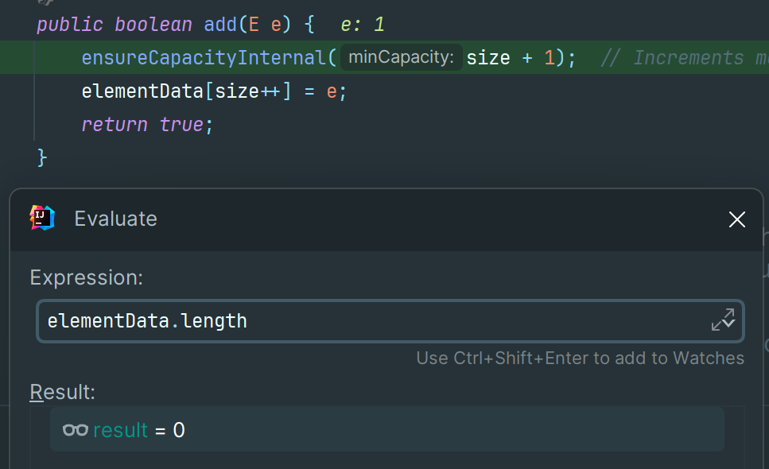
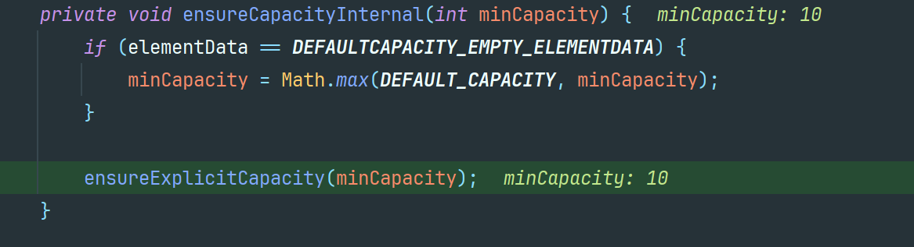
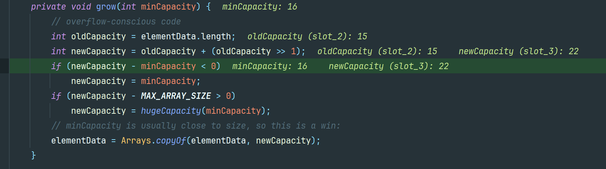
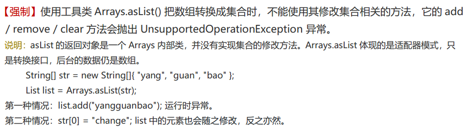
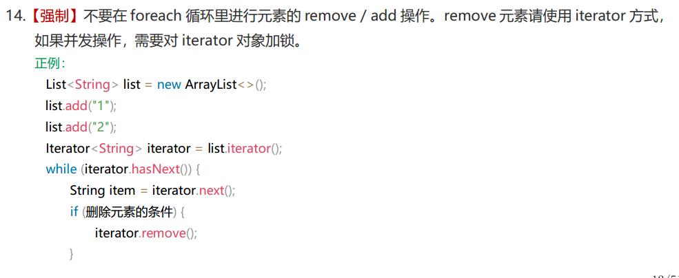

## 请你介绍以下常见的List实现类？

首先，List是一个接口，它属于Collection的一部分。`List`接口有几个常用的实现类有：

-   ArrayList
-   LinkedList
-   Vector（古老的遗留类）

### **ArrayList**

ArrayList 是 List 接口的主要实现类。线程不安全，内部是通过**数组**实现的，继承了AbstractList，实现了List。

优点：它允许对元素进行快速随机访问。

缺点：每个元素之间不能有间隔，当数组大小不足时，会触发扩容操作（开销较大）

从 ArrayList 的中间位置插入或者删除元素时，需要对数组进行复制、移动、代价比较高。

因此，它适合随机查找和遍历，不适合插入和删除。

本质上，ArrayList 是对象引用的一个**”变长”数组** 

ArrayList扩容公式：newCapacity = oldCapacity + (oldCapacity >> 1)，这实际上是将原容量增加50%（即乘以1.5）

```java
private void grow(int minCapacity) {
   	// 。。。
    int newCapacity = oldCapacity + (oldCapacity >> 1);  // 新数组的容量
 	// 。。
    elementData = Arrays.copyOf(elementData, newCapacity);  // 将旧数组中的数据进行copy
}
```

ArrayList实现了RandomAccess接口，即提供了随机访问功能。RandomAccess是java中用来被List实现，为List提供快速访问功能的。在ArrayList中，我们即可以通过元素的序号快速获取元素对象，这就是快速随机访问。

ArrayList实现java.io.Serializable接口，这意味着ArrayList支持序列化，能通过序列化去传输。

### LinkedList（链表）

LinkedList 是用链表结构存储数据的（基于双向链表实现），它实现了 List 接口和 Deque 接口，存储**有序**的、**可重复**的数据，**线程不安全。**

LinkedList 的特点包括：

-   **链表结构**：LinkedList 内部使用双向链表来存储元素，每个节点包含一个指向前一个节点和后一个节点的引用。这使得在插入和删除元素时具有较好的性能，但在**随机访问元素时性能较差**。
-   **可以在任意位置插入和删除元素**：由于 LinkedList 是基于链表实现的，因此可以在任意位置插入和删除元素，而不需要像数组那样进行元素的移动。（增删性能高）
-   **不支持随机访问**：由于 LinkedList 不是基于数组实现的，因此无法通过索引直接访问元素，而是需要从头节点或尾节点开始遍历链表来查找元素。
-   **支持双向遍历**：LinkedList 实现了**双向链表**，可以从头到尾或从尾到头遍历链表

LinkedList是一个继承于AbstractSequentialList的双向链表。**它也可以被当作堆栈、队列或双端队列进行操作。**

### Vector（数组实现、线程同步）

Vector 是一个古老的集合，JDK1.0 就有了。Vector 是 Java 中的一个动态数组实现的数据结构，它实现了 List 接口，存储**有序**的、**可重复**的数据。**与 ArrayList 类似**，Vector 也是**基于数组**实现的，用法上几乎相同，但它是**线程安全**的，效率低，支持同步访问。

Vector 的特点包括：

-   **动态数组**：Vector 内部使用数组来存储元素，可以根据需要自动调整数组的大小。当元素数量超过当前数组容量时，Vector 会自动增加数组的大小。
-   **线程安全**：Vector 是线程安全的，支持多线程环境下的并发访问。它的方法都使用了 synchronized 关键字来保证线程安全，但这也导致了一定的性能损失。
-   **支持随机访问**：由于 Vector 是基于数组实现的，因此可以通过索引直接访问元素，具有较好的随机访问性能。
-   **可以在任意位置插入和删除元素**：与 ArrayList 类似，Vector 也可以在任意位置插入和删除元素。但由于需要调整数组的大小，插入和删除元素的性能较差。

扩容时，默认扩展一倍容量。

建议：在各种 List 中，最好把 ArrayList 作为默认选择。当插入、删除频繁时，使用LinkedList；Vector 总是比ArrayList 慢，所以尽量避免使用。 


## ArrayList 与 Vector 的区别

-   **数据结构相同**ArrayList 和 Vector它们的底层物理结构都是数组，我们称为**动态数组**。

-   **线程安全不同**
    -   ArrayList 是新版的动态数组，**线程不安全**，效率高
    -   Vector 是旧版的动态数组，**线程安全**，效率低。 
-   **动态数组的扩容机制不同**
    -   ArrayList 默认扩容为原来的 1.5 倍
    -   Vector 默认扩容增加为原来的 2 倍。
-   **数组的初始化容量不同**
    -   如果在构建 ArrayList 与 Vector 的集合对象时，没有显式指定初始化容量，那么 Vector 的内部数组的初始容量默认为 10，而 ArrayList 在 JDK 6.0 及之前的版本也是 10，JDK8.0 之后的版本 ArrayList 初始化为长度为 0 的空数组，之后在添加第一个元素时，再创建长度为 10 的数组。
    -   原因： 用的时候，再创建数组，避免浪费。因为很多方法的返回值是 ArrayList 类型，需要返回一个 ArrayList 的对象，例如：后期从数据库查询对象的方法，返回值很多就是 ArrayList。有可能你要查询的数据不存在，要么返回null，要么返回一个没有元素的 ArrayList 对象。 


## ArrayList初始容量是多少？

ArrayList 有一个默认的初始容量，这个容量是在你创建 ArrayList 实例时如果没有明确指定容量参数时所使用的。

在 Java 的 ArrayList 实现中，默认的初始容量是 10。这意味着当你创建一个新的 ArrayList 而不指定其容量时，它会以一个内部数组长度为 10 的数组来开始。当添加的元素数量超过这个初始容量时，ArrayList 的内部数组会进行扩容，通常是增长为原来的 1.5 倍。

例如：

```java
ArrayList<String> list = new ArrayList<>(); // 默认的初始容量是 10
```

但是，如果你可以预算到将要在 ArrayList 中存储多少元素，那么最好在创建时指定一个初始容量，这样可以减少由于扩容而导致的重新分配数组和复制元素的操作，从而提高性能。

```java
ArrayList<String> list = new ArrayList<>(50); // 初始容量设置为 50
```

自从JDK1.7之后，Arraylist初始化的时候为一个空数组。

```java
private static final Object[] DEFAULTCAPACITY_EMPTY_ELEMENTDATA = {};

// 这是new一个ArrayList时，不指定初始容量的构造器
public ArrayList() {
    this.elementData = DEFAULTCAPACITY_EMPTY_ELEMENTDATA;
}
```

但是当你去放入第一个元素的时候，会触发他的懒加载机制（在懒加载之前是0），使得数量变为10。

```java
private static int calculateCapacity(Object[] elementData, int minCapacity) {
    if (elementData == DEFAULTCAPACITY_EMPTY_ELEMENTDATA) {
        return Math.max(DEFAULT_CAPACITY, minCapacity);        
    }        
    return minCapacity;    
}
```

所以我们的Arraylist初始容量的确是10。只不过jdk8变为懒加载来节省内存。进行了一点优化

总结：

​	在JDK7后，对于无参数构造函数创建的 `ArrayList`，初始容量默认为0，但在首次添加元素时会扩展到至少10个元素的容量。对于带有初始容量参数的构造函数，初始容量就是你指定的值。

## ArrayList是如何扩容的？

1.  **初始容量和扩容因子**:

    当创建一个新的ArrayList对象时，它通常会分配一个初始容量，这个初始容量默认为10。

    -   当使用无参数构造函数创建 `ArrayList` 时，其内部使用的数组 `elementData` 会被初始为空数组 `DEFAULTCAPACITY_EMPTY_ELEMENTDATA`。
    -   第一次添加元素时，`ArrayList` 会将其容量扩展至默认容量 `DEFAULT_CAPACITY`，这个值通常是10

    ```java
    /**
     * Default initial capacity.
     */
    private static final int DEFAULT_CAPACITY = 10;
    ```

2.  **扩容规则**:

    -   当 `ArrayList` 的实际元素数量超过其当前容量时，`ArrayList` 会自动进行扩容。

    -   扩容时，新的容量通常是当前容量的1.5倍。

        ```java
        newCapacity = oldCapacity + (oldCapacity >> 1)
        ```

    -   例如，如果当前容量为10，那么扩容后的容量将是15；如果当前容量为15，则扩容后的容量将是22

3.  **扩容过程**:

    -   扩容时，`ArrayList` 会创建一个新的数组，并将原有数组中的元素复制到新数组中。
    -   新数组的大小是原数组大小的1.5倍，向上取整得到一个整数。
    -   原有数组会被释放，从而减少内存占用。

4.  **扩容示例**:

    -   假设 `ArrayList` 的当前容量为10，且已经满了。
    -   当尝试添加第11个元素时，`ArrayList` 会创建一个新的数组，大小为15（10 * 1.5 = 15）。
    -   然后将旧数组中的所有元素复制到新数组中，并将新元素添加到新数组的末尾。
    -   最后，旧数组被垃圾回收机制回收。

5.  **扩容阈值**:

    -   `ArrayList` 在每次添加元素前都会检查是否需要扩容。这个检查是通过比较元素的数量（`size`）与当前容量（`elementData.length`）来完成的。
    -   如果 `size` 大于等于 `elementData.length`，则触发扩容操作。

6.  **扩容方法、源码**:

    -   扩容的具体逻辑通常封装在 `ensureCapacityInternal` 或者 `grow` 方法中。

    ```java
    private void grow(int minCapacity) {
        // overflow-conscious code
        int oldCapacity = elementData.length;
        int newCapacity = oldCapacity + (oldCapacity >> 1);	// 位运算指定新数组的容量
        if (newCapacity - minCapacity < 0)
            newCapacity = minCapacity;
        if (newCapacity - MAX_ARRAY_SIZE > 0)
            newCapacity = hugeCapacity(minCapacity);
        // minCapacity is usually close to size, so this is a win:
        elementData = Arrays.copyOf(elementData, newCapacity);
    }
    ```

7.  **注意事项**:

    -   `ArrayList` 没有缩容机制。即使删除了大量元素，`ArrayList` 的容量也不会减小，除非显式调用 `trimToSize` 方法。
    -   `trimToSize` 方法会将 `ArrayList` 的容量调整为其实际大小，从而避免不必要的内存浪费。

## ArrayList第二次扩容时容量大小？

ArrayList扩容规则：

```java
newCapacity = oldCapacity + (oldCapacity >> 1)
```

先说结论：

​	**在JDK8中，ArrayList第二次扩容时容量为22**

代码如下：

```java
public class ArrayListDemo {
    public static void main(String[] args) {
        List<Integer> list = new ArrayList<>();

        for (int i = 1; i < 17; i++) {
            list.add(i);
        }

        list.forEach(e -> System.out.print(e + " "));
    }
}
```

ArrayList第一次添加元素时，首次进入add方法，可以发现，此时为动态数组容量为0



ArrayList第一次添加元素时，进入了ensureCapacityInternal方法，会将动态数组容量初始化为10



ArrayList第一次扩容时


ArrayList第二次扩容时




## ArrayList的添加与删除元素为什么慢？

主要原因是由于其内部实现基于数组的特性所导致的。

ArrayList的添加与删除操作慢，主要是因为其内部实现基于数组，而数组在插入和删除元素时需要移动其他元素来保证连续性和顺序性，这个过程需要耗费较多的时间。

相对于基于链表的数据结构（如LinkedList），ArrayList的插入和删除操作的时间复杂度是O(n)级别的，而链表的时间复杂度为O(1)。

**添加元素**

1.  **尾部添加**：

-   -   当在ArrayList的尾部添加元素时，如果当前数组的容量还未达到最大值，只需要将新元素添加到数组的末尾即可，此时时间复杂度为**O(1)**。
    -   但是，当数组容量已满时，会触发**扩容**操作。扩容操作通常会将数组的容量增加到当前容量的1.5倍或2倍，并将原数组中的所有元素复制到新的更大的数组中。这一过程的时间复杂度为**O(n)**，其中n为当前数组中的元素数量。

1.  **指定位置插入**：

-   -   当在ArrayList的指定位置（非尾部）插入元素时，需要将目标位置之后的所有元素向后移动一个位置，然后将新元素插入到指定位置。这个过程涉及到移动元素的操作，时间复杂度为**O(n)**，在最坏情况下，如头部插入，需要移动所有的元素。

**删除元素**

1.  **尾部删除**：

-   -   当删除的元素位于列表末尾时，只需要将末尾元素移除即可，时间复杂度为**O(1)**。

1.  **指定位置删除**：

-   -   当在ArrayList的指定位置（非尾部）删除元素时，需要将删除点之后的所有元素向前移动一个位置，以填补被删除元素的位置。这个过程同样涉及到移动元素的操作，时间复杂度为**O(n)**，在最坏情况下，如头部删除，需要移动除了被删除元素之外的所有元素。


## ArrayList是线程安全的吗？

ArrayList是**线程不安全**的。在多线程环境下，如果多个线程同时对ArrayList进行操作，可能会出现数据不一致的情况。

当多个线程同时对ArrayList进行添加、删除等操作时，可能会导致数组大小的变化，从而引发数据不一致的问题。例如，当一个线程在对ArrayList进行添加元素的操作时（这通常分为两步：先在指定位置存放元素，然后增加size的值），另一个线程可能同时进行删除或其他操作，导致数据的不一致或错误。


比如下面的这个代码，就是实际上ArrayList 放入元素的代码：

```java
elementData[size] = e;
size = size + 1;
```

1.  elementData[size] = e; 这一行代码是将新的元素 e 放置在 ArrayList 的内部数组 elementData 的当前大小 size 的位置上。这里假设 elementData 数组已经足够大，可以容纳新添加的元素（实际上 ArrayList 在必要时会增长数组的大小）。
2.  size = size + 1; 这一行代码是更新 ArrayList 的大小，使其包含新添加的元素。

如果两个线程同时尝试向同一个 ArrayList 实例中添加元素，那么可能会发生以下情况：

-   线程 A 执行 elementData[size] = eA;（假设当前 size 是 0）
-   线程 B 执行 elementData[size] = eB;（由于线程 A 尚未更新 size，线程 B 看到的 size 仍然是 0）
-   此时，elementData[0] 被线程 B 的 eB 覆盖，线程 A 的 eA 丢失
-   线程 A 更新 size = 1;
-   线程 B 更新 size = 1;（现在 size 仍然是 1，但是应该是 2，因为有两个元素被添加）


为了解决ArrayList的线程安全问题，可以采取以下几种方式：

-   1、使用Collections类的synchronizedList方法：**将ArrayList转换为线程安全的List**。这种方式通过在对ArrayList进行操作时加锁来保证线程安全，但可能会带来一定的性能损耗。
-   2、使用**CopyOnWriteArrayList**类：它是Java并发包中提供的线程安全的List实现。CopyOnWriteArrayList在对集合进行修改时，会创建一个新的数组来保存修改后的数据，这样就不会影响到其他线程对原数组的访问。因此，它**适合在读操作远远多于写操作的场景**下使用。
-   3、使用并发包中的锁机制：如Lock或Semaphore等，显式地使用锁来保护对ArrayList的操作，可以确保在多线程环境下数据的一致性。但这种方式需要开发人员自行管理锁的获取和释放，容易出现死锁等问题。
-   还可以考虑使用其他线程安全的集合类，如Vector或ConcurrentLinkedQueue等，它们本身就是线程安全的，可以直接在多线程环境下使用。


## ArrayList如何保证线程安全？

为了保证 ArrayList 的线程安全，一般有以下几种方式：

-   1、借助**锁**、手动同步

可以通过在访问 ArrayList 的代码块上使用 synchronized 关键字来手动同步对 ArrayList 的访问。这要求所有访问 ArrayList 的代码都知道并使用相同的锁。

```java
List<String> list = new ArrayList<>();
// ... 填充列表 ...

synchronized(list) {
    Iterator<String> it = list.iterator();
    while (it.hasNext()) {
        String element = it.next();
        // 处理元素...
    }
}
```

-   2、使用 **Collections.synchronizedList**

Collections.synchronizedList 方法返回一个线程安全的列表，该列表是通过在每个公共方法（如 add(), get(), iterator() 等）上添加同步来实现的，其中同步是基于里面的同步代码块实现。

但是，和手动同步一样，它也**不能解决在迭代过程中进行结构修改导致的问题**。

```java
List<String> list = Collections.synchronizedList(new ArrayList<>());
```

-   **4、 使用并发集合**：

Java 并发包 java.util.concurrent 提供了一些线程安全的集合类，如 **CopyOnWriteArrayList**。这些类提供了不同的线程安全保证和性能特性。

CopyOnWriteArrayList是一个线程安全的变体，其中所有可变操作（add、set 等等）都是通过对底层数组进行新的复制来实现的。因此，迭代器不会受到并发修改的影响，并且遍历期间不需要额外的同步。但是，当有很多**写操作**时，这种方法可能会**很昂贵**，因为它需要在每次修改时复制整个底层数组。

```java
List<String> list = new CopyOnWriteArrayList<>();List<String> list = new CopyOnWriteArrayList<>();
```

选择解决方案时，需要考虑并发模式、读写比例以及性能需求。如果你的应用主要是读操作并且偶尔有写操作，CopyOnWriteArrayList是一个好选择。如果你的应用有大量的写操作，那么可能需要使用其他并发集合或手动同步策略。


## Arrays.asList() 方法把数组转换成集合

**说明：**

​	使用Arrays.asList() 方法把数组转换成集合后，该集合不能添加、删除元素

**原因：**

​	Arrays.ArrayList类继承自**AbstractList**，实现了List接口。它**重写了add()、remove()**等修改List结构的方法，并将它们**直接抛出UnsupportedOperationException异常**，从而禁止了对List结构的修改。具体来说，Arrays.asList()方法返回的是Arrays类中的一个私有静态内部类ArrayList，它继承自AbstractList类，实现了List接口。

**源码：**

```java
public class Arrays {

    public static <T> List<T> asList(T... a) {
        return new ArrayList<>(a);
    }

    /**
     * @serial include 注意这是个内部类，并不是java.util包下的ArrayList
     */
    private static class ArrayList<E> extends AbstractList<E>
        implements RandomAccess, java.io.Serializable
    {

    }

}
```

**阿里手册：**



**最佳实践：**

-   如果使用了&nbsp;Arrays.asList()&nbsp;的话，最好不要使用其集合的操作方法

-   如果非要用，可以在外面包一层ArrayList

    -   ```java
        List<Integer> list = new ArrayList<>(Arrays.asList(1,2));
        ```


## 集合遍历时remove或add操作注意事项？


**阿里手册：**




## 数组和链表在Java中的区别？


## Java中有哪些集合类？概述Java集合体系？


## Java中List有哪些常见实现类？


## Java中Set有哪些常见实现类？

-   Set 接口是 Collection 的子接口，**Set 接口相较于 Collection 接口没有提供额外的方法** （依然还是Collection中的15个抽象方法）	
-   Set集合用于存储**无序**（无序是指存入和取出的顺序不一定相同）、**不重复**的元素
-   Set 集合不允许包含相同的元素，如果试把两个相同的元素加入同一个 Set 集合中，则添加操作失败。 
-   Set 集合支持的遍历方式和 Collection 集合一样：foreach 和 Iterator。 
-   Set 的常用实现类有：HashSet、TreeSet、LinkedHashSet（HashSet的子类）

### Set集合的特点

**无序性：**

-   无序性 != 随机性
-   添加元素的顺序和遍历元素的顺序不一致，这是不是无须性呢？NO
-   到底什么是无序性？与添加的元素的位置有关，不像ArrayList一样是紧密排序的。
-   这里是根据添加元素的Hash值，计算其在数组中的存储位置。此位置不是依次紧密排序的，表现为无序性。

**HashSet、LinkedHashSet中元素不可重复性：**

-   添加到Set中的元素是不能相同的。
-   比较的标准是hashCode() 得到的哈希值以及 equals() 得到的boolean的结果
-   **哈希值相同且 equals()返回 true，则认为元素相同的**。

**添加到HashSet、LinkedHashSet中元素的要求**

-   要求（建议）元素所在的类重写两个方法 hashCode() equals() ，以确保添加到集合中的对象的唯一性
-   同时，要求hashCode() 和 equals() 要保持一致性，IDEA自动生成的即可保持一致。

**TreeSet 判断元素是否相同的标准**

-   不再是考虑 hashCode() 和 equals() ，也就意味着添加到TreeSet中的元素所在的类不需要重写hashCode() 和 equals()
-   **比较**元素大小或是比较元素是否相等的标准就是考虑自然排序或定制排序中，**compareTo() 或 compare() 的返回值**
-   **如果compareTo() 或 compare() 的返回值为0，则认为两个对象是相等的。**由于TreeSet中不能存放相同的元素，则后一个元素就无法成功添加到 TreeSet中。

### HashSet

-   HashSet是Set接口的一个实现类，它基**基于哈希表实现（底层使用的是HashMap（HashMap底层在JDK8及之后是数组+链表（长度>8 红黑树）））**  （主要是应用场景是用于过滤数据）

-   HashSet 按 Hash 算法来存储集合中的元素，因此具有很好的存储、查找、删除性能。 
-   HashSet 具有以下特点：
    -   **哈希表结构**：HashSet 内部使用哈希表来存储元素，每个元素被存储在哈希表的一个桶中。通过哈希函数将元素映射到桶的位置，从而实现快速的插入、删除和查找操作。
    -   **不保证元素顺序**：HashSet 不保证元素的顺序，**元素的存储顺序可能与插入顺序不同**。
    -   **不允许重复元素**：HashSet **不允许存储重复的元素**，如果尝试插入重复元素，插入操作将被忽略。
    -   **允许存储 null 元素**：HashSet 允许存储 null 元素，但**只能存储一个 null 元素**。
    -   HashSet **不是线程安全的** ，如果多个线程同时访问并修改HashSet，则需要外部同步

-   HashSet 集合**判断两个元素相等**的标准：两个对象通过 **hashCode()** 方法得到的哈希值相等，并且两个对象的 **equals()方法返回值为 true**。 
-   对于存放在 Set 容器中的对象，**对应的类一定要重写 hashCode()和 equals(Object obj)方法**，以实现对象相等规则。即：“相等的对象必须具有相等的散列码”。 
    -   当存储自定义对象时，需要重写对象的`hashCode()`和`equals()`方法，以确保对象的唯一性。
-   HashSet 集合中元素的**无序性，不等同于随机性**。这里的无序性与元素的添加位置有关。
    -   具体来说：我们在添加每一个元素到数组中时，具体的存储位置是由元素的hashCode()调用后返回的 hash 值决定的。导致在数组中每个元素不是依次紧密存放的，表现出一定的无序性。 

注意：

​	**如果两个元素的 equals() 方法返回 true，但它们的hashCode() 返回值不相等，hashSet 将会把它们存储在不同的位置，但依然可以添加成功。** 

实例代码：

```java
public class HashSetDemo2 {
    public static void main(String[] args) {
        // Set集合去重的原因 先判断哈希值，在比较equals()
        Set<Student> hashSet = new HashSet<>(); // 无序、可重复、无索引

        Student s1 = new Student("小明", 18);
        Student s2 = new Student("小明", 18);
        Student s3 = new Student("小华", 18);
        Student s4 = new Student("小红", 18);

        hashSet.add(s1);
        hashSet.add(s2);
        hashSet.add(s3);
        hashSet.add(s4);

        System.out.println(hashSet);
        // [Student(name=小明, age=18), Student(name=小华, age=18), Student(name=小红, age=18)]
    }
}

@Getter
@Setter
@ToString
@EqualsAndHashCode
class Student{
    private String name;
    private int age;

    public Student() {
    }

    public Student(String name, int age) {
        this.name = name;
        this.age = age;
    }
}
```

### LinkedHashSet

-   LinkedHashSet是**HashSet的子类**，同时也实现了 Set 接口。与 HashSet 不同，**LinkedHashSet 保持了元素的插入顺序，并且不允许重复元素**

-   它基于哈希表和双向链表实现，继承于 HashSet、又基于 LinkedHashMap 来实现的。 根据元素的 hashCode 值来决定元素的存储位置，但它同时**使用双向链表维护元素的次序**，这**使得元素看起来是以添加顺序保存的。** **相比于 HashSet 增加了顺序性**。

-   LinkedHashSet 插入性能略低于 HashSet，但在将元素按照插入的顺序进行迭代迭代访问 Set 里的全部元素时有很好的性能。同时继承了HashSet的所有特性。

-   LinkedHashSet 的特点包括：
    -   **哈希表结构**：LinkedHashSet 内部使用哈希表来存储元素，每个元素被存储在哈希表的一个桶中。通过哈希函数将元素映射到桶的位置，从而实现快速的插入、删除和查找操作。
    -   **保持插入顺序**：LinkedHashSet 会维护元素的插入顺序，即元素被添加到集合中的顺序将被保留。
    -   **不允许重复元素**：LinkedHashSet 不允许存储重复的元素，如果尝试插入重复元素，插入操作将被忽略。
    -   **允许存储 null 元素**：LinkedHashSet 允许存储 null 元素，**但只能存储一个 null 元素**。

### TreeSet

-   TreeSet 是 SortedSet 接口（该接口继承于Set接口）的实现类，它基于**红黑树**实现，可以对元素进行自然排序或自定义排序。
-   不允许null元素的存在。TreeSet 同样是**线程不安全**的。
-   TreeSet 特点：
    -   **不允许重复**
    -   **实现排序**（自然排序或定制排序） 
    -   添加到TreeSet集合中的元素必须是同一个类的对象，因为只有相同类的两个实例才会比较大小，否则报错`ClassCastException`
-   当存储自定义对象时，如果想要进行排序，需要实现`Comparable`接口并重写`compareTo()`方法，或提供自定义的`Comparator`对象来进行排序。

**TreeSet 判断元素使用相同的标准**

-   不再是考虑 hashCode() 和 equals() ，也就意味着添加到TreeSet中的元素所在的类不需要重写hashCode() 和 equals()
-   比较元素大小或是比较元素是否相等的标准就是考虑自然排序或定制排序中，compareTo() 或 compare() 的返回值
-   **如果compareTo() 或 compare() 的返回值为0，则认为两个对象是相等的。**

扩展：

-   TreeSet 两种排序方法：**自然排序**和**定制排序**。默认情况下，TreeSet 采用自然排序。 
    -   自然排序：TreeSet 会调用集合元素的 compareTo(Object obj) 方法来比较元素之间的大小关系，然后将集合元素按升序(默认情况)排列。  
        -   如果试图把**一个对象添加到 TreeSet 时，则该对象的类必须实现 Comparable 接口**。 
        -   实现 Comparable 的类必须实现 compareTo(Object obj) 方法，两个对象即通过 compareTo(Object obj) 方法的返回值来比较大小。 
    -   定制排序：**如果元素所属的类没有实现 Comparable 接口**，或不希望按照升序(默认情况)的方式排列元素或希望按照其它属性大小进行排序，则考虑使用定制排序。定制排序，**通过 Comparator 接口来实现**。需要重写 compare(T o1,T o2)方法。 
        -   利用 int compare(T o1,T o2)方法，比较 o1 和 o2 的大小：如果方法返回正整数，则表示 o1 大于 o2；如果返回 0，表示相等；返回负整数，表示 o1 小于 o2。 
        -   要实现定制排序，需要将实现 Comparator 接口的实例作为形参传递给 TreeSet 的构造器。 

### 适用场景

-   `HashSet`：适用于需要快速查找的场景，不保证元素的顺序。
-   `LinkedHashSet`：适用于需要保持元素插入顺序的场景。
-   `TreeSet`：适用于需要元素排序的场景。


## HashSet 中添加元素的过程？

第 1 步：当向 HashSet 集合中存入一个元素时，HashSet 会调用该对象的 hashCode() 方法得到该对象的 hashCode 值，然后根据 hashCode 值，通过某个散列函数决定该对象在 HashSet 底层数组中的存储位置。 

第 2 步：如果要在数组中存储的位置上没有元素，则直接添加成功。 

第 3 步：如果要在数组中存储的位置上有元素，则继续比较： 

​	如果两个元素的 hashCode 值不相等，则添加成功； 

​	如果两个元素的 hashCode()值相等，则会继续调用 equals()方法： 

​		如果 equals()方法结果为 false，则添加成功。 

 		如果 equals()方法结果为 true，则添加失败。第 2 步添加成功，元素会保存在底层数组中。 

第 3 步两种添加成功的操作，由于该底层数组的位置已经有元素了，则会通过链表的方式继续链接，存储。 


## HashSet如何实现线程安全？

HashSet本身不是线程安全的。如果多个线程在没有外部同步的情况下同时访问一个HashSet，并且至少有一个线程修改了集合，那么它必须保持同步。否则，会导致不可预知的行为和数据损坏。变为线程安全，主要有以下几种方式：

-   1、 使用**Collections.synchronizedSet**

Java 提供了一个简单的方法来创建一个同步的集合，通过Collections.synchronizedSet方法。这个方法返回一个线程安全的集合包装器。

```java
Set<String> synchronizedSet = Collections.synchronizedSet(newHashSet<>());
```

使用这个方法后，所有对集合的访问都将是同步的。但是，需要注意的是，对于迭代操作，必须手动同步：

```java
Set<String> synchronizedSet = Collections.synchronizedSet(newHashSet<>());
synchronized (synchronizedSet) {
    Iterator<String> iterator = synchronizedSet.iterator();
    while (iterator.hasNext()) {
        System.out.println(iterator.next());
    }
}
```

-   2、使用**ConcurrentHashMap**

如果需要更高效的并发访问，可以使用ConcurrentHashMap来实现类似HashSet的功能。ConcurrentHashMap提供了更细粒度的锁机制，在高并发环境下性能更好

```java
Set<String> concurrentSet = ConcurrentHashMap.newKeySet();
```

ConcurrentHashMap.newKeySet()返回一个基于ConcurrentHashMap的Set实现，它是线程安全的，并且在高并发环境下性能优越。

-   3、 使用**CopyOnWriteArraySet**

对于**读操作远多于写操作**的场景，可以使用CopyOnWriteArraySet。它的实现基于CopyOnWriteArrayList，在每次修改时都会复制整个底层数组，因此在写操作较少时性能较好。

```java
Set<String> copyOnWriteArraySet = new CopyOnWriteArraySet<>();
```

-   4、手动同步

如果你不想使用上述任何一种方法，也可以手动同步HashSet的访问。可以使用synchronized关键字来保护对HashSet的访问：

```java
Set<String> hashSet = newHashSet<>();
synchronized (hashSet) {
    // 对 hashSet 的操作
}
```

**选择合适的方案**

-   如果你的应用程序是单线程的，或只有少量的线程访问集合，可以使用Collections.synchronizedSet。
-   如果你的应用程序有大量的并发读写操作，可以使用ConcurrentHashMap.newKeySet。
-   如果你的应用程序读操作远多于写操作，可以使用CopyOnWriteArraySet。

下面是一个ConcurrentHashMap实现线程安全Set的示例代码：

```java
import java.util.Set;
import java.util.concurrent.ConcurrentHashMap;

public class ConcurrentHashSetExample {
    public static void main(String[] args) {
        Set<String> concurrentSet = ConcurrentHashMap.newKeySet();

        // 多线程环境下的操作示例
        Runnable task = () -> {
            for (int i = 0; i < 1000; i++) {
                concurrentSet.add(Thread.currentThread().getName() + "-" + i);
            }
        };

        Thread thread1 = new Thread(task, "Thread1");
        Thread thread2 = new Thread(task, "Thread2");

        thread1.start();
        thread2.start();

        try {
            thread1.join();
            thread2.join();
        } catch (InterruptedException e) {
            e.printStackTrace();
        }

        System.out.println("Set size: " + concurrentSet.size());
    }
}
```


## Java中Map有那些常见实现类？

Map接口的常见实现类：HashMap(主要实现类)、LinkedHashMap、TreeMap、Hashtable、Properties

```text
java.util.Map
	HashMap：（主要实现类）线程不安全，效率高；可以添加null的key和value
				底层：数组+单向链表+红黑树存储结构（JDK8）
		LinkedHashMap：是HashMap的子类；在HashMap的数据结构基础上，增加了一对双向链表，用于记录添加的元素的先后顺序，进而在我们遍历时，就可以按照添加的顺序显示
        开发中，需要频繁遍历建议使用此类
        
	Hashtable：古老实现类；线程安全，效率低；不可以添加null的key和value
				底层：数组+单向链表存储结构（JDK8）
		Properties：是Hashtable的子类，其key-value都是String类型，常用于读取属性文件
		
	TreeMap：底层使用红黑树存储；可以按照添加的key-value中的key元素指定的属性的大小进行遍历。
			需要考虑使用 	自然排序、定制排序
```

-   **Map接口 与 Collection接口 并列存在**。用于保存具有*映射关系*的数据：key-value 
-   **Collection** 集合称为**单列集合**，元素是孤立存在的（理解为单身）。 
-   **Map** 集合称为**双列集合**，元素是成对存在的(理解为夫妻)。 
-   Map 中的 key 和 value 都可以是任何引用类型的数据。但常用 String 类作为 Map的“键”。 

**注意：**

​	HashMap：可以添加null的key和value（key最多一个为null、value可以有多个为null）

​	Hashtable：不可以添加null的key和value

```java
public class MapTest {
    @Test
    // HashMap的 key-value 可以存储 null
    public void test1(){
        Map map = new HashMap();
        map.put(null,null);
        System.out.println(map);
    }
    @Test
    // Hashtable的 key-value 都不可以存储 null
    public void test2(){
        Map map = new Hashtable();
        map.put(null,123);  // 报错 NullPointerException
        System.out.println(map);
    }
}
```

### Map 中 key-value 特点 

-   这里主要以 HashMap 为例说明。HashMap 中存储的 key、value 的特点如下：
-   Map 中的 **key用Set来存放，不允许重复**（所有的key构成一个Set集合），即同一个 Map 对象所对应的类，**须重写 hashCode()和 equals()**方法 
    -   **key所在的类要重写 hashCode()和 equals()方法** 
-   key 和 value 之间存在单向一对一关系，即通过指定的 key 总能找到唯一的、确定的 value，不同 key 对应的 **value 可以重复**。
    -   所有的value构成一个Collection集合，**value 所在的类要重写 equals()方法。** 
-   **key 和 value 构成一个 entry**。所有的 **entry** 彼此之间是**无序的、不可重复的**。 

### HashMap

HashMap 是 Map 接口使用频率最高的实现类。

-   HashMap 是**线程不安全**的。如果多个线程同时访问一个HashMap并且至少有一个线程修改了它，则必须手动同步。
-   **允许添加 一个null 键和 多个null 值**。 
-   存储数据采用的**哈希表结构**，底层使用**一维数组+单向链表+红黑树**进行 key-value数据的存储。
    -   与 HashSet 一样不保证映射的顺序，元素的存取顺序不能保证一致。 
-   HashMap **判断两个 key 相等的标准**是：**两个 key 的 hashCode 值相等，通过 equals() 方法返回 true**。 
-   HashMap **判断两个 value 相等的标准**是：**两个 value 通过 equals() 方法返回true**。 
-   HashMap提供了 O(1) 时间复杂度的基本操作（如 get 和 put），前提是哈希函数的分布良好且冲突较少

HashMap的**特点**包括：

-   键值对的存储是无序的。
-   允许添加 一个null 键和 多个null 值
-   不支持同一个键对应多个值的情况

**内部工作原理** 

HashMap使用哈希表来存储数据。哈希表是基于（数组+链表）的组合结构。

-   1、**哈希函数**：HashMap使用键的hashCode()方法来计算哈希值，然后将哈希值映射到数组的索引位置。
-   2、**数组和链表**：HashMap使用一个数组来存储链表或树结构（Java 8 及以后）。每个数组位置被称为一个“桶”，每个桶存储链表或树。

-   3、**冲突处理**：当两个键的哈希值相同时，它们会被存储在同一个桶中，形成一个链表（或树）。这种情况称为哈希冲突。

-   4、**再哈希**：当HashMap中的元素数量超过容量的负载因子（默认 0.75）时，HashMap会进行再哈希，将所有元素重新分配到一个更大的数组中。


**性能注意事项** 

-    **初始容量和负载因子**：可以通过构造函数设置HashMap的初始容量和负载因子，以优化性能。

    -    初始容量越大，减少再哈希的次数；

    -    负载因子越小，减少冲突的概率，但会增加空间开销。

        -   对于源码中的负载因子 0.75，是大佬们设置的，如果你不能确保你设置的更优，请不要随意改变

-    **哈希函数的质量**：哈希函数的质量直接影响HashMap的性能。理想的哈希函数应尽可能均匀地分布键。

 

**线程安全性** 

HashMap不是线程安全的。如果需要线程安全的映射，可以使用`Collections.synchronizedMap`来包装HashMap

```java
Map<String, Integer> synchronizedMap = Collections.synchronizedMap(newHashMap<>());
```

或者使用ConcurrentHashMap,后者在高并发环境下性能更好。

```java
Map<String, Integer> concurrentMap = newConcurrentHashMap<>();
```


### LinkedHashMap

LinkedHashMap 是 HashMap 的子类

-   存储数据采用的**哈希表结构+链表**结构，在 HashMap 存储结构的基础上，使用了一对 **双向链表**来**记录添加元素的先后顺序**，可以保证遍历元素时，与添加的顺序一致。 

-   通过哈希表结构可以保证键的唯一、不重复，需要键所在类重写 hashCode()方法、 equals()方法。

LinkedHashMap 的**特点**包括

-   具有**哈希表和链表**的双重特性：LinkedHashMap通过哈希表实现快速的键值对查找，同时通过双向链表维护顺序
-   **有序性**：可以保证元素的插入顺序和访问顺序
-   **允许null键和值**：与HashMap一致，LinkedHashMap允许一个null键和多个null值。
-   **线程不安全**：与HashMap一致，LinkedHashMap也是线程不安全的，如果需要在多线程环境中使用，需要通过外部同步机制来保证线程安全。

**与其他集合类的比较**

-   **LinkedHashMap 与 HashMap**：

-   -   LinkedHashMap基于双写链表保证键值对的顺序（插入顺序或访问顺序），而HashMap不保证顺序。
    -   LinkedHashMap通过维护链表来记录顺序，因此在插入和删除操作上可能略慢于HashMap。

-   **LinkedHashMap 与 TreeMap**：

-   -   LinkedHashMap保证插入顺序或访问顺序，而TreeMap保证键的自然顺序或比较器的顺序。
    -   LinkedHashMap基于哈希表实现，操作的平均时间复杂度为 O(1)，而TreeMap基于红黑树实现，操作的时间复杂度为 O(log n)。

**适用场景**

LinkedHashMap适用于需要保持键值对的插入顺序或访问顺序的场景，例如：

-   实现 LRU（最近最少使用）缓存。
-   需要按插入顺序遍历键值对。
-   需要在保持顺序的同时快速查找键值对


### TreeMap

-   TreeMap 存储 key-value 对时，需要根据 key-value 对进行排序。TreeMap 可以保证所有的 key-value 对处于**有序状态**。 
-   TreeMap 底层使用**红黑树**结构存储数据 
-   TreeMap 的 Key 的排序： 
    -   **自然排序**：TreeMap 的所有的 Key 必须实现 Comparable 接口，而且所有的 Key 应该是同一个类的对象，否则将会抛出 ClasssCastException 
    -   **定制排序**：创建 TreeMap 时，构造器传入一个 Comparator 对象，该对象负责对 TreeMap 中的所有 key 进行排序。此时不需要 Map 的 Key 实现 Comparable 接口 
-   TreeMap **判断两个key 相等**的标准：**两个 key 通过 compareTo()方法或者 compare()方法返回 0**。 
-   与TreeSet一致，添加进入 TreeMap 的元素必须是同样的类型，否则报错 `ClassCastException`

TreeMap 的**特点**包括：

-   **有序性**：TreeMap保证了键的有序性
    -   有序性是通过自然顺序（通过Comparable接口）或比较器（Comparator）的通过提供的。
    -   因此插入TreeMap中的key必须实现排序
-   **红黑树**：TreeMap内部使用红黑树数据结构来存储键值对，保证了插入、删除、查找等操作的时间复杂度为 O(log n)
-   **不允许null键**：TreeMap不允许键为null，但允许值为null
-   **线程不安全**：TreeMap不是线程安全的，如果需要在多线程环境中使用，需要通过外部同步机制来保证线程安全

**与其他集合类的比较**

-   **TreeMap 与 HashMap**：

-   -   TreeMap保证键的有序性，而HashMap不保证顺序。
    -   TreeMap基于红黑树实现，操作的时间复杂度为 O(log n)，而HashMap基于哈希表实现，操作的平均时间复杂度为 O(1)。
    -   TreeMap不允许null键，而HashMap允许一个null键。

-   **TreeMap 与  LinkedHashMap**：

-   -   TreeMap保证键的自然顺序或比较器的顺序，而LinkedHashMap保证插入顺序或访问顺序。
    -   TreeMap的操作时间复杂度为 O(log n)，而LinkedHashMap的操作时间复杂度为 O(1)。

**适用场景**

TreeMap适用于需要按键排序存储键值对的场景，例如：

-   实现基于范围的查询。
-   需要按顺序遍历键值对。
-   需要快速查找最小或最大键值对。


### Hashtable

-   Hashtable继承自 Dictionary 类，是 Map 接口的**古老实现类**，JDK1.0 就提供了。
-   不同于 HashMap，Hashtable 是**线程安全**的。 并发性不如 ConcurrentHashMap，因为 ConcurrentHashMap 引入了分段锁。
-   Hashtable 实现原理和 HashMap 相同，功能相同。底层都使用哈希表结构（**数组+单向链表**），查询速度快。 
-   与 HashMap 一样，Hashtable 也不能保证其中 Key-Value 对的顺序 
-   Hashtable 判断两个 key 相等、两个 value 相等的标准，与 HashMap 一致。 
-   与 **HashMap 不同，Hashtable 不允许使用 null 作为 key 或 value**。 

**开发建议**：

​	Hashtable 不建议在新代码中使用，不需要线程安全的场合可以用 HashMap 替换，需要线程安全的场合可以用 ConcurrentHashMap 替换。

**与其他集合类的比较**

-   **Hashtable 与 HashMap**：

-   -   Hashtable是线程安全的，而HashMap不是。
    -   Hashtable不允许键或值为null，而HashMap允许一个null键和多个null值。
    -   在现代 Java 编程中，HashMap更常用，因为它在大多数情况下性能更好，并且可以通过外部同步来实现线程安全。

-   **Hashtable 与 ConcurrentHashMap**：

-   -   ConcurrentHashMap是 Java 5 引入的一种改进的哈希表实现，专为高并发环境设计。
    -   ConcurrentHashMap提供了**更细粒度的锁机**制，允许更高的并发性和更好的性能。

### Properties

-   Properties是 Java 中的一个类（Hashtable 的子类），用于处理属性文件（.properties文件）。属性文件是一种简单的文本文件，用于存储键值对形式的配置信息
-   **由于属性文件里的 key、value 都是字符串类型**，所以 **Properties 中要求 key 和 value 都是字符串类型** 
-   存取数据时，建议使用 setProperty(String key,String value) 方法和 getProperty(String key) 方法 

Properties类的**特点**如下：

-   继承关系：**Properties类是Hashtable类的子类**，因此它具有Hashtable类的所有方法。
-   键值对存储：Properties类用于存储键值对形式的配置信息，其中**键和值都是字符串类型**。
-   加载和保存属性文件：Properties类提供了 load() 和 store() 方法，用于从属性文件中加载配置信息和将配置信息保存到属性文件中。
-   默认值：**Properties类可以设置默认值**，当获取某个键对应的值时，如果该键不存在，则返回默认值。

## 什么是IdentityHashMap？


## 什么是WeakHashMap？


## HashMap是怎么计算hashCode的？（HashMap是怎么确定key存储在数组上的索引位置的？）

HashMap使用键的hashCode()方法来生成哈希值，并对其进行一些处理，以提高哈希表的性能和均匀分布。

-   1、调用键的hashCode()方法

首先，HashMap调用键对象的hashCode()方法来获取一个整数哈希码。这个哈希码是由键对象的类定义的，通常是通过某种算法基于对象的内部状态计算出来的

```java
int hashCode= key.hashCode();
```

-   2、扰动函数 (Perturbation Function)

为了减少哈希冲突并使哈希码更加均匀地分布，HashMap**对原始哈希码进行了一些额外的处理**。这种处理被称为扰动函数。Java 8 及以后的HashMap实现使用以下算法来计算最终的哈希值：

```java
static final int hash(Object key) {
    int h;
    return (key == null) ? 0 : (h = key.hashCode()) ^ (h >>> 16);
}
```

这个算法的步骤如下：

1.  **获取键的哈希码**：h = key.hashCode()
2.  **右移 16 位**：h >>> 16
3.  **异或运算**：h ^ (h >>> 16)

这种方法通过将高位和低位的哈希码混合在一起，减少了哈希冲突的概率，从而使得哈希码更加均匀地分布在哈希表的桶中。

-   3、计算数组索引

计算出扰动后的哈希值后，HashMap使用这个值来确定键值对在哈希表中的位置。通常，HashMap使用哈希值对数组的长度取模（取余数）来计算索引：

```java
int index = (n - 1) & hash;
```

其中，n是哈希表数组的长度。n通常是 2 的幂，这样(n - 1)就是一个全 1 的二进制数，这使得按位**与操作&**可以有效地**替代取模操作%**，从而提高性能

示例：

假设我们有一个键对象，其hashCode()返回值为 123456。那么，计算哈希值的过程如下：

1.  调用hashCode()方法：int hashCode = 123456;
2.  扰动函数计算：

-   -   h = 123456
    -   h >>> 16 = 123456 >>> 16 = 1（右移 16 位）
    -   hash = h ^ (h >>> 16) = 123456 ^ 1 = 123457

1.  计算数组索引（假设数组长度n为 16，即n - 1为 15）：

-   -   index = (15) & 123457 = 15 & 123457 = 1

最终，键值对将存储在哈希表数组的索引 1 位置。

## HashMap为什么要使用扰动函数？

扰动函数的目的是为了提高哈希码的质量，使其在哈希表中更均匀地分布。具体来说：

-   **减少哈希冲突**：通过将高位和低位混合，扰动函数减少了哈希码的模式性，降低了哈希冲突的概率。
-   **均匀分布**：扰动后的哈希码更加均匀地分布在哈希表的桶中，从而提高了哈希表的性能。

示例：

假设我们有一个键对象，其hashCode()返回值为123456。我们可以通过哈希函数（扰动函数）计算其哈希值：

1、调用hashCode()方法：

```
int h = 123456;
```

2、扰动函数计算：

```java
int hash = h ^ (h >>> 16);
```

具体计算步骤：

-   -   h >>> 16 = 123456 >>> 16 = 1（右移 16 位）
    -   hash = 123456 ^ 1 = 123457（异或运算）

最终，哈希值为123457

**扰动函数源码**：

```java
static final int hash(Object key) {
    int h;
    return (key == null) ? 0 : (h = key.hashCode()) ^ (h >>> 16);
}
```


## 为什么HashMap扩容时采用2^n倍（2的幂次）？

在HashMap中，初始化设置长度时，容量自动转成 2 的幂次长度，这样设计有几个重要原因，主要是为了优化性能和简化计算

**1、高效计算索引**

HashMap使用哈希值来确定键值对在哈希表中的位置。为了计算数组索引，HashMap使用**按位与操作代替取模运算。**具体来说，HashMap通过以下方式计算索引：

```java
int index= (n - 1) & hash;

// hash=扰动函数得到的哈希值
```

其中n是哈希表数组的长度。假设n是 2 的幂次，比如 16（2^4），则n - 1是 15（1111 二进制）。这样，(n - 1) & hash操作可以快速地对哈希值进行取模运算，而不需要使用性能较低的取模操作%。

例如，如果n是 16（2^4）：

-   则 n - 1是 15（1111 二进制）
-   按位与操作(n - 1) & hash只保留哈希值的低 4 位，这相当于对 16 取模。

这种方式不仅计算快速，而且代码简洁。

**2、减少哈希冲突**

在哈希表中，哈希冲突是一个主要问题。哈希冲突发生时，不同的键计算出的索引相同，导致它们被存储在同一个桶中。通过将容量设置为 2 的幂次，哈希表能够更均匀地分布哈希值，减少冲突。

具体来说，当容量是 2 的幂次时，哈希值的低位和高位都能均匀地影响最终索引。这是因为扰动函数hash = h ^ (h >>> 16)将高位和低位混合在一起，使得哈希值的分布更均匀。

假设我们有一个HashMap，其容量为 10（不是 2 的幂次），并且我们有一组键，它们的哈希值分别为：

-   键 A 的哈希值：35
-   键 B 的哈希值：45
-   键 C 的哈希值：55

（1）使用非 2 的幂次容量

如果容量为 10，我们计算索引的方法是取模运算：

-   键 A 的索引：35 % 10 = 5
-   键 B 的索引：45 % 10 = 5
-   键 C 的索引：55 % 10 = 5

可以看到，这些不同的键在取模运算后都映射到同一个索引 5，导致了哈希冲突。

（2）使用 2 的幂次容量

现在假设我们将容量设置为 16（2^4），并使用按位与操作来计算索引：

-   键 A 的索引：35 & (16 - 1) = 35 & 15 = 3
-   键 B 的索引：45 & (16 - 1) = 45 & 15 = 13
-   键 C 的索引：55 & (16 - 1) = 55 & 15 = 7

在这种情况下，这些键映射到不同的索引（3、13 和 7），没有发生哈希冲突。

**3、简化扩容**

HashMap在需要扩容时，通常会将容量加倍。如果容量总是 2 的幂次，那么加倍后的容量仍然是 2 的幂次，这样可以简化扩容过程中的计算和重新哈希操作。

**4、内存对齐和效率**

计算机内存分配通常更高效地处理 2 的幂次大小的内存块。使用 2 的幂次长度可以更好地利用内存对齐，提高内存访问效率。

**实现细节**

当你初始化HashMap时，指定的初始容量会被调整为大于或等于该值的最小的 2 的幂次。例如，如果你指定的初始容量是 10，HashMap会将其调整为 16（2^4）。

具体实现如下：

```java
/**
 * 根据给定的目标容量返回一个2的幂大小。
 * 这个方法通过将目标容量向上舍入到最接近的2的幂来确定哈希表的大小，
 * 以提高哈希表的装载因子，从而在给定容量需求下提供更高效的性能。
 * 
 * @param cap 目标容量，用于计算哈希表的大小。
 * @return 返回一个2的幂大小，该大小大于或等于目标容量。
 */
static final int tableSizeFor(int cap) {
    // 对目标容量进行一系列位操作，以找到大于或等于目标容量的最小2的幂
    int n = cap - 1;
    n |= n >>> 1;
    n |= n >>> 2;
    n |= n >>> 4;
    n |= n >>> 8;
    n |= n >>> 16;
    // 确保返回值在有效范围内，如果计算结果超出最大容量，则返回最大容量
    return (n < 0) ? 1 : (n >= MAXIMUM_CAPACITY) ? MAXIMUM_CAPACITY : n + 1;
}

```

这个方法通过一系列的位移和按位或操作，将任意整数调整为大于或等于它的最小 2 的幂次。但是还有一种特殊情况套用以上公式不行，这些数字就是2的幂自身。如果数字4 套用公式的话。得到的会是 8 ，为了解决这个问题，JDK的工程师把所有用户传进来的数在进行计算之前先-1。


## HashMap的实现原理？

## HashMap和Hashtable的区别？

-   HashMap：底层是一个哈希表（jdk7:数组+链表; jdk8:数组+链表+红黑树，是一个线程不安全的集合，执行效率高 
-   Hashtable：底层也是一个哈希表（数组+链表），是一个线程安全的集合，执行效率低 
-   **HashMap集合，可以存储一个 null 的键、多个 null 的值** 
-   **Hashtable 集合，不能存储 null 的键、null 的值** 
-   Hashtable 和 Vector 集合一样,在 jdk1.2 版本之后被更先进的集合(HashMap,ArrayList)取代了。所以 HashMap 是 Map 的主要实现类，Hashtable 是 Map 的古老实现类。 
-   Hashtable 的子类 Properties（配置文件）依然活跃在历史舞台 
-   **Properties 集合是一个唯一和 IO 流相结合的集合** 


## HashMap和Hashset的区别？


## HashMap的扩容机制？


## ArrayList的扩容机制？


## 为什么HashMap的默认负载因子是0.75？


## 为什么JDK8对HashMap进行了红黑树改动？


## HashMap进行了哪些改动，除了红黑树？


## ConcurrentHashMap在JDK7和8之间的区别？


## ConcurrentHashMap的get方法是否需要加锁？


## 为什么ConcurrentHashMap的k-v都不能为null？


## ConcurrentHashMap底层具体实现你知道吗？实现原理？


## 什么是Java中的Copy-On-Write？


## 你遇到过ConrrentModificationException异常吗？

循环删除


## CopyOnWriteArrayList和Collections.synchronization有什么区别？分别有什么优缺点？


## 什么是Hash碰撞？怎么解决？


## 使用HashMap时，有哪些提升性能的技巧？