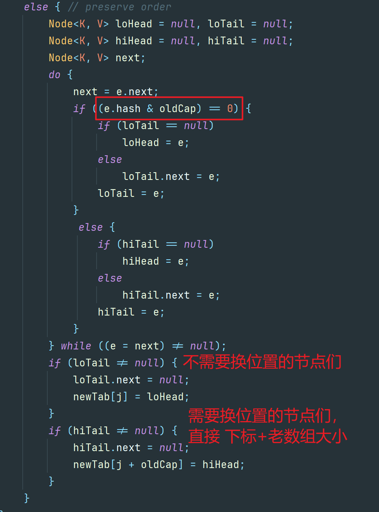
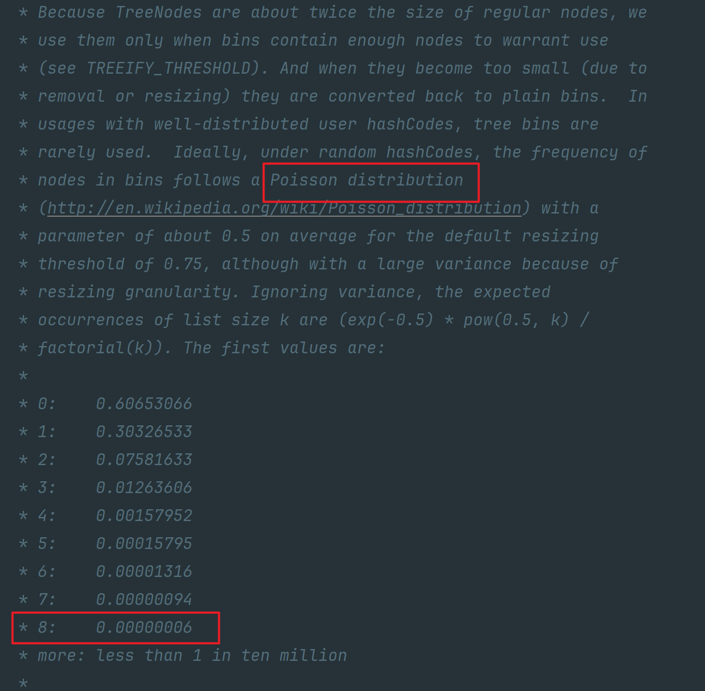

## 请你介绍以下常见的List实现类？

首先，List是一个接口，它属于Collection的一部分。`List`接口有几个常用的实现类有：

-   ArrayList
-   LinkedList
-   Vector（古老的遗留类）

### **ArrayList**

ArrayList 是 List 接口的主要实现类。线程不安全，内部是通过**数组**实现的，继承了AbstractList，实现了List。

优点：它允许对元素进行快速随机访问。

缺点：每个元素之间不能有间隔，当数组大小不足时，会触发扩容操作（开销较大）

从 ArrayList 的中间位置插入或者删除元素时，需要对数组进行复制、移动、代价比较高。

因此，它适合随机查找和遍历，不适合插入和删除。

本质上，ArrayList 是对象引用的一个**”变长”数组** 

ArrayList扩容公式：newCapacity = oldCapacity + (oldCapacity >> 1)，这实际上是将原容量增加50%（即乘以1.5）

```java
private void grow(int minCapacity) {
   	// 。。。
    int newCapacity = oldCapacity + (oldCapacity >> 1);  // 新数组的容量
 	// 。。
    elementData = Arrays.copyOf(elementData, newCapacity);  // 将旧数组中的数据进行copy
}
```

ArrayList实现了RandomAccess接口，即提供了随机访问功能。RandomAccess是java中用来被List实现，为List提供快速访问功能的。在ArrayList中，我们即可以通过元素的序号快速获取元素对象，这就是快速随机访问。

ArrayList实现java.io.Serializable接口，这意味着ArrayList支持序列化，能通过序列化去传输。

### LinkedList（链表）

LinkedList 是用链表结构存储数据的（基于双向链表实现），它实现了 List 接口和 Deque 接口，存储**有序**的、**可重复**的数据，**线程不安全。**

LinkedList 的特点包括：

-   **链表结构**：LinkedList 内部使用双向链表来存储元素，每个节点包含一个指向前一个节点和后一个节点的引用。这使得在插入和删除元素时具有较好的性能，但在**随机访问元素时性能较差**。
-   **可以在任意位置插入和删除元素**：由于 LinkedList 是基于链表实现的，因此可以在任意位置插入和删除元素，而不需要像数组那样进行元素的移动。（增删性能高）
-   **不支持随机访问**：由于 LinkedList 不是基于数组实现的，因此无法通过索引直接访问元素，而是需要从头节点或尾节点开始遍历链表来查找元素。
-   **支持双向遍历**：LinkedList 实现了**双向链表**，可以从头到尾或从尾到头遍历链表

LinkedList是一个继承于AbstractSequentialList的双向链表。**它也可以被当作堆栈、队列或双端队列进行操作。**

### Vector（数组实现、线程同步）

Vector 是一个古老的集合，JDK1.0 就有了。Vector 是 Java 中的一个动态数组实现的数据结构，它实现了 List 接口，存储**有序**的、**可重复**的数据。**与 ArrayList 类似**，Vector 也是**基于数组**实现的，用法上几乎相同，但它是**线程安全**的，效率低，支持同步访问。

Vector 的特点包括：

-   **动态数组**：Vector 内部使用数组来存储元素，可以根据需要自动调整数组的大小。当元素数量超过当前数组容量时，Vector 会自动增加数组的大小。
-   **线程安全**：Vector 是线程安全的，支持多线程环境下的并发访问。它的方法都使用了 synchronized 关键字来保证线程安全，但这也导致了一定的性能损失。
-   **支持随机访问**：由于 Vector 是基于数组实现的，因此可以通过索引直接访问元素，具有较好的随机访问性能。
-   **可以在任意位置插入和删除元素**：与 ArrayList 类似，Vector 也可以在任意位置插入和删除元素。但由于需要调整数组的大小，插入和删除元素的性能较差。

扩容时，默认扩展一倍容量。

建议：在各种 List 中，最好把 ArrayList 作为默认选择。当插入、删除频繁时，使用LinkedList；Vector 总是比ArrayList 慢，所以尽量避免使用。 


## ArrayList 与 Vector 的区别

-   **数据结构相同**ArrayList 和 Vector它们的底层物理结构都是数组，我们称为**动态数组**。

-   **线程安全不同**
    -   ArrayList 是新版的动态数组，**线程不安全**，效率高
    -   Vector 是旧版的动态数组，**线程安全**，效率低。 
-   **动态数组的扩容机制不同**
    -   ArrayList 默认扩容为原来的 1.5 倍
    -   Vector 默认扩容增加为原来的 2 倍。
-   **数组的初始化容量不同**
    -   如果在构建 ArrayList 与 Vector 的集合对象时，没有显式指定初始化容量，那么 Vector 的内部数组的初始容量默认为 10，而 ArrayList 在 JDK 6.0 及之前的版本也是 10，JDK8.0 之后的版本 ArrayList 初始化为长度为 0 的空数组，之后在添加第一个元素时，再创建长度为 10 的数组。
    -   原因： 用的时候，再创建数组，避免浪费。因为很多方法的返回值是 ArrayList 类型，需要返回一个 ArrayList 的对象，例如：后期从数据库查询对象的方法，返回值很多就是 ArrayList。有可能你要查询的数据不存在，要么返回null，要么返回一个没有元素的 ArrayList 对象。 


## ArrayList初始容量是多少？

ArrayList 有一个默认的初始容量，这个容量是在你创建 ArrayList 实例时如果没有明确指定容量参数时所使用的。

在 Java 的 ArrayList 实现中，默认的初始容量是 10。这意味着当你创建一个新的 ArrayList 而不指定其容量时，它会以一个内部数组长度为 10 的数组来开始。当添加的元素数量超过这个初始容量时，ArrayList 的内部数组会进行扩容，通常是增长为原来的 1.5 倍。

例如：

```java
ArrayList<String> list = new ArrayList<>(); // 默认的初始容量是 10
```

但是，如果你可以预算到将要在 ArrayList 中存储多少元素，那么最好在创建时指定一个初始容量，这样可以减少由于扩容而导致的重新分配数组和复制元素的操作，从而提高性能。

```java
ArrayList<String> list = new ArrayList<>(50); // 初始容量设置为 50
```

自从JDK1.7之后，Arraylist初始化的时候为一个空数组。

```java
private static final Object[] DEFAULTCAPACITY_EMPTY_ELEMENTDATA = {};

// 这是new一个ArrayList时，不指定初始容量的构造器
public ArrayList() {
    this.elementData = DEFAULTCAPACITY_EMPTY_ELEMENTDATA;
}
```

但是当你去放入第一个元素的时候，会触发他的懒加载机制（在懒加载之前是0），使得数量变为10。

```java
private static int calculateCapacity(Object[] elementData, int minCapacity) {
    if (elementData == DEFAULTCAPACITY_EMPTY_ELEMENTDATA) {
        return Math.max(DEFAULT_CAPACITY, minCapacity);        
    }        
    return minCapacity;    
}
```

所以我们的Arraylist初始容量的确是10。只不过jdk8变为懒加载来节省内存。进行了一点优化

总结：

​	在JDK7后，对于无参数构造函数创建的 `ArrayList`，初始容量默认为0，但在首次添加元素时会扩展到至少10个元素的容量。对于带有初始容量参数的构造函数，初始容量就是你指定的值。

## ArrayList是如何扩容的？

1.  **初始容量和扩容因子**:

    当创建一个新的ArrayList对象时，它通常会分配一个初始容量，这个初始容量默认为10。

    -   当使用无参数构造函数创建 `ArrayList` 时，其内部使用的数组 `elementData` 会被初始为空数组 `DEFAULTCAPACITY_EMPTY_ELEMENTDATA`。
    -   第一次添加元素时，`ArrayList` 会将其容量扩展至默认容量 `DEFAULT_CAPACITY`，这个值通常是10

    ```java
    /**
     * Default initial capacity.
     */
    private static final int DEFAULT_CAPACITY = 10;
    ```

2.  **扩容规则**:

    -   当 `ArrayList` 的实际元素数量超过其当前容量时，`ArrayList` 会自动进行扩容。

    -   扩容时，新的容量通常是当前容量的1.5倍。

        ```java
        newCapacity = oldCapacity + (oldCapacity >> 1)
        ```

    -   例如，如果当前容量为10，那么扩容后的容量将是15；如果当前容量为15，则扩容后的容量将是22

3.  **扩容过程**:

    -   扩容时，`ArrayList` 会创建一个新的数组，并将原有数组中的元素复制到新数组中。
    -   新数组的大小是原数组大小的1.5倍，向上取整得到一个整数。
    -   原有数组会被释放，从而减少内存占用。

4.  **扩容示例**:

    -   假设 `ArrayList` 的当前容量为10，且已经满了。
    -   当尝试添加第11个元素时，`ArrayList` 会创建一个新的数组，大小为15（10 * 1.5 = 15）。
    -   然后将旧数组中的所有元素复制到新数组中，并将新元素添加到新数组的末尾。
    -   最后，旧数组被垃圾回收机制回收。

5.  **扩容阈值**:

    -   `ArrayList` 在每次添加元素前都会检查是否需要扩容。这个检查是通过比较元素的数量（`size`）与当前容量（`elementData.length`）来完成的。
    -   如果 `size` 大于等于 `elementData.length`，则触发扩容操作。

6.  **扩容方法、源码**:

    -   扩容的具体逻辑通常封装在 `ensureCapacityInternal` 或者 `grow` 方法中。

    ```java
    private void grow(int minCapacity) {
        // overflow-conscious code
        int oldCapacity = elementData.length;
        int newCapacity = oldCapacity + (oldCapacity >> 1);	// 位运算指定新数组的容量
        if (newCapacity - minCapacity < 0)
            newCapacity = minCapacity;
        if (newCapacity - MAX_ARRAY_SIZE > 0)
            newCapacity = hugeCapacity(minCapacity);
        // minCapacity is usually close to size, so this is a win:
        elementData = Arrays.copyOf(elementData, newCapacity);
    }
    ```

7.  **注意事项**:

    -   `ArrayList` 没有缩容机制。即使删除了大量元素，`ArrayList` 的容量也不会减小，除非显式调用 `trimToSize` 方法。
    -   `trimToSize` 方法会将 `ArrayList` 的容量调整为其实际大小，从而避免不必要的内存浪费。

## ArrayList第二次扩容时容量大小？

ArrayList扩容规则：

```java
newCapacity = oldCapacity + (oldCapacity >> 1)
```

先说结论：

​	**在JDK8中，ArrayList第二次扩容时容量为22**

代码如下：

```java
public class ArrayListDemo {
    public static void main(String[] args) {
        List<Integer> list = new ArrayList<>();

        for (int i = 1; i < 17; i++) {
            list.add(i);
        }

        list.forEach(e -> System.out.print(e + " "));
    }
}
```

ArrayList第一次添加元素时，首次进入add方法，可以发现，此时为动态数组容量为0


ArrayList第一次添加元素时，进入了ensureCapacityInternal方法，会将动态数组容量初始化为10


ArrayList第一次扩容时


ArrayList第二次扩容时


## ArrayList的添加与删除元素为什么慢？

主要原因是由于其内部实现基于数组的特性所导致的。

ArrayList的添加与删除操作慢，主要是因为其内部实现基于数组，而数组在插入和删除元素时需要移动其他元素来保证连续性和顺序性，这个过程需要耗费较多的时间。

相对于基于链表的数据结构（如LinkedList），ArrayList的插入和删除操作的时间复杂度是O(n)级别的，而链表的时间复杂度为O(1)。

**添加元素**

1.  **尾部添加**：

-   -   当在ArrayList的尾部添加元素时，如果当前数组的容量还未达到最大值，只需要将新元素添加到数组的末尾即可，此时时间复杂度为**O(1)**。
    -   但是，当数组容量已满时，会触发**扩容**操作。扩容操作通常会将数组的容量增加到当前容量的1.5倍或2倍，并将原数组中的所有元素复制到新的更大的数组中。这一过程的时间复杂度为**O(n)**，其中n为当前数组中的元素数量。

1.  **指定位置插入**：

-   -   当在ArrayList的指定位置（非尾部）插入元素时，需要将目标位置之后的所有元素向后移动一个位置，然后将新元素插入到指定位置。这个过程涉及到移动元素的操作，时间复杂度为**O(n)**，在最坏情况下，如头部插入，需要移动所有的元素。

**删除元素**

1.  **尾部删除**：

-   -   当删除的元素位于列表末尾时，只需要将末尾元素移除即可，时间复杂度为**O(1)**。

1.  **指定位置删除**：

-   -   当在ArrayList的指定位置（非尾部）删除元素时，需要将删除点之后的所有元素向前移动一个位置，以填补被删除元素的位置。这个过程同样涉及到移动元素的操作，时间复杂度为**O(n)**，在最坏情况下，如头部删除，需要移动除了被删除元素之外的所有元素。


## ArrayList是线程安全的吗？

ArrayList是**线程不安全**的。在多线程环境下，如果多个线程同时对ArrayList进行操作，可能会出现数据不一致的情况。

当多个线程同时对ArrayList进行添加、删除等操作时，可能会导致数组大小的变化，从而引发数据不一致的问题。例如，当一个线程在对ArrayList进行添加元素的操作时（这通常分为两步：先在指定位置存放元素，然后增加size的值），另一个线程可能同时进行删除或其他操作，导致数据的不一致或错误。


比如下面的这个代码，就是实际上ArrayList 放入元素的代码：

```java
elementData[size] = e;
size = size + 1;
```

1.  elementData[size] = e; 这一行代码是将新的元素 e 放置在 ArrayList 的内部数组 elementData 的当前大小 size 的位置上。这里假设 elementData 数组已经足够大，可以容纳新添加的元素（实际上 ArrayList 在必要时会增长数组的大小）。
2.  size = size + 1; 这一行代码是更新 ArrayList 的大小，使其包含新添加的元素。

如果两个线程同时尝试向同一个 ArrayList 实例中添加元素，那么可能会发生以下情况：

-   线程 A 执行 elementData[size] = eA;（假设当前 size 是 0）
-   线程 B 执行 elementData[size] = eB;（由于线程 A 尚未更新 size，线程 B 看到的 size 仍然是 0）
-   此时，elementData[0] 被线程 B 的 eB 覆盖，线程 A 的 eA 丢失
-   线程 A 更新 size = 1;
-   线程 B 更新 size = 1;（现在 size 仍然是 1，但是应该是 2，因为有两个元素被添加）


为了解决ArrayList的线程安全问题，可以采取以下几种方式：

-   1、使用Collections类的synchronizedList方法：**将ArrayList转换为线程安全的List**。这种方式通过在对ArrayList进行操作时加锁来保证线程安全，但可能会带来一定的性能损耗。
-   2、使用**CopyOnWriteArrayList**类：它是Java并发包中提供的线程安全的List实现。CopyOnWriteArrayList在对集合进行修改时，会创建一个新的数组来保存修改后的数据，这样就不会影响到其他线程对原数组的访问。因此，它**适合在读操作远远多于写操作的场景**下使用。
-   3、使用并发包中的锁机制：如Lock或Semaphore等，显式地使用锁来保护对ArrayList的操作，可以确保在多线程环境下数据的一致性。但这种方式需要开发人员自行管理锁的获取和释放，容易出现死锁等问题。
-   还可以考虑使用其他线程安全的集合类，如Vector或ConcurrentLinkedQueue等，它们本身就是线程安全的，可以直接在多线程环境下使用。


## ArrayList如何保证线程安全？

为了保证 ArrayList 的线程安全，一般有以下几种方式：

-   1、借助**锁**、手动同步

可以通过在访问 ArrayList 的代码块上使用 synchronized 关键字来手动同步对 ArrayList 的访问。这要求所有访问 ArrayList 的代码都知道并使用相同的锁。

```java
List<String> list = new ArrayList<>();
// ... 填充列表 ...

synchronized(list) {
    Iterator<String> it = list.iterator();
    while (it.hasNext()) {
        String element = it.next();
        // 处理元素...
    }
}
```

-   2、使用 **Collections.synchronizedList**

Collections.synchronizedList 方法返回一个线程安全的列表，该列表是通过在每个公共方法（如 add(), get(), iterator() 等）上添加同步来实现的，其中同步是基于里面的同步代码块实现。

但是，和手动同步一样，它也**不能解决在迭代过程中进行结构修改导致的问题**。

```java
List<String> list = Collections.synchronizedList(new ArrayList<>());
```

-   **4、 使用并发集合**：

Java 并发包 java.util.concurrent 提供了一些线程安全的集合类，如 **CopyOnWriteArrayList**。这些类提供了不同的线程安全保证和性能特性。

CopyOnWriteArrayList是一个线程安全的变体，其中所有可变操作（add、set 等等）都是通过对底层数组进行新的复制来实现的。因此，迭代器不会受到并发修改的影响，并且遍历期间不需要额外的同步。但是，当有很多**写操作**时，这种方法可能会**很昂贵**，因为它需要在每次修改时复制整个底层数组。

```java
List<String> list = new CopyOnWriteArrayList<>();List<String> list = new CopyOnWriteArrayList<>();
```

选择解决方案时，需要考虑并发模式、读写比例以及性能需求。如果你的应用主要是读操作并且偶尔有写操作，CopyOnWriteArrayList是一个好选择。如果你的应用有大量的写操作，那么可能需要使用其他并发集合或手动同步策略。


## Arrays.asList() 方法把数组转换成集合

**说明：**

​	使用Arrays.asList() 方法把数组转换成集合后，该集合不能添加、删除元素

**原因：**

​	Arrays.ArrayList类继承自**AbstractList**，实现了List接口。它**重写了add()、remove()**等修改List结构的方法，并将它们**直接抛出UnsupportedOperationException异常**，从而禁止了对List结构的修改。具体来说，Arrays.asList()方法返回的是Arrays类中的一个私有静态内部类ArrayList，它继承自AbstractList类，实现了List接口。

**源码：**

```java
public class Arrays {

    public static <T> List<T> asList(T... a) {
        return new ArrayList<>(a);
    }

    /**
     * @serial include 注意这是个内部类，并不是java.util包下的ArrayList
     */
    private static class ArrayList<E> extends AbstractList<E>
        implements RandomAccess, java.io.Serializable
    {

    }

}
```

**阿里手册：**


**最佳实践：**

-   如果使用了&nbsp;Arrays.asList()&nbsp;的话，最好不要使用其集合的操作方法

-   如果非要用，可以在外面包一层ArrayList

    -   ```java
        List<Integer> list = new ArrayList<>(Arrays.asList(1,2));
        ```


## 集合遍历时remove或add操作注意事项？


**阿里手册：**


## 数组和链表在Java中的区别？


## Java中有哪些集合类？概述Java集合体系？


## Java中List有哪些常见实现类？


## Java中Set有哪些常见实现类？

-   Set 接口是 Collection 的子接口，**Set 接口相较于 Collection 接口没有提供额外的方法** （依然还是Collection中的15个抽象方法）	
-   Set集合用于存储**无序**（无序是指存入和取出的顺序不一定相同）、**不重复**的元素
-   Set 集合不允许包含相同的元素，如果试把两个相同的元素加入同一个 Set 集合中，则添加操作失败。 
-   Set 集合支持的遍历方式和 Collection 集合一样：foreach 和 Iterator。 
-   Set 的常用实现类有：HashSet、TreeSet、LinkedHashSet（HashSet的子类）

### Set集合的特点

**无序性：**

-   无序性 != 随机性
-   添加元素的顺序和遍历元素的顺序不一致，这是不是无须性呢？NO
-   到底什么是无序性？与添加的元素的位置有关，不像ArrayList一样是紧密排序的。
-   这里是根据添加元素的Hash值，计算其在数组中的存储位置。此位置不是依次紧密排序的，表现为无序性。

**HashSet、LinkedHashSet中元素不可重复性：**

-   添加到Set中的元素是不能相同的。
-   比较的标准是hashCode() 得到的哈希值以及 equals() 得到的boolean的结果
-   **哈希值相同且 equals()返回 true，则认为元素相同的**。

**添加到HashSet、LinkedHashSet中元素的要求**

-   要求（建议）元素所在的类重写两个方法 hashCode() equals() ，以确保添加到集合中的对象的唯一性
-   同时，要求hashCode() 和 equals() 要保持一致性，IDEA自动生成的即可保持一致。

**TreeSet 判断元素是否相同的标准**

-   不再是考虑 hashCode() 和 equals() ，也就意味着添加到TreeSet中的元素所在的类不需要重写hashCode() 和 equals()
-   **比较**元素大小或是比较元素是否相等的标准就是考虑自然排序或定制排序中，**compareTo() 或 compare() 的返回值**
-   **如果compareTo() 或 compare() 的返回值为0，则认为两个对象是相等的。**由于TreeSet中不能存放相同的元素，则后一个元素就无法成功添加到 TreeSet中。

### HashSet

-   HashSet是Set接口的一个实现类，它基**基于哈希表实现（底层使用的是HashMap（HashMap底层在JDK8及之后是数组+链表（长度>8 红黑树）））**  （主要是应用场景是用于过滤数据）

-   HashSet 按 Hash 算法来存储集合中的元素，因此具有很好的存储、查找、删除性能。 
-   HashSet 具有以下特点：
    -   **哈希表结构**：HashSet 内部使用哈希表来存储元素，每个元素被存储在哈希表的一个桶中。通过哈希函数将元素映射到桶的位置，从而实现快速的插入、删除和查找操作。
    -   **不保证元素顺序**：HashSet 不保证元素的顺序，**元素的存储顺序可能与插入顺序不同**。
    -   **不允许重复元素**：HashSet **不允许存储重复的元素**，如果尝试插入重复元素，插入操作将被忽略。
    -   **允许存储 null 元素**：HashSet 允许存储 null 元素，但**只能存储一个 null 元素**。
    -   HashSet **不是线程安全的** ，如果多个线程同时访问并修改HashSet，则需要外部同步

-   HashSet 集合**判断两个元素相等**的标准：两个对象通过 **hashCode()** 方法得到的哈希值相等，并且两个对象的 **equals()方法返回值为 true**。 
-   对于存放在 Set 容器中的对象，**对应的类一定要重写 hashCode()和 equals(Object obj)方法**，以实现对象相等规则。即：“相等的对象必须具有相等的散列码”。 
    -   当存储自定义对象时，需要重写对象的`hashCode()`和`equals()`方法，以确保对象的唯一性。
-   HashSet 集合中元素的**无序性，不等同于随机性**。这里的无序性与元素的添加位置有关。
    -   具体来说：我们在添加每一个元素到数组中时，具体的存储位置是由元素的hashCode()调用后返回的 hash 值决定的。导致在数组中每个元素不是依次紧密存放的，表现出一定的无序性。 

注意：

​	**如果两个元素的 equals() 方法返回 true，但它们的hashCode() 返回值不相等，hashSet 将会把它们存储在不同的位置，但依然可以添加成功。** 

实例代码：

```java
public class HashSetDemo2 {
    public static void main(String[] args) {
        // Set集合去重的原因 先判断哈希值，在比较equals()
        Set<Student> hashSet = new HashSet<>(); // 无序、可重复、无索引

        Student s1 = new Student("小明", 18);
        Student s2 = new Student("小明", 18);
        Student s3 = new Student("小华", 18);
        Student s4 = new Student("小红", 18);

        hashSet.add(s1);
        hashSet.add(s2);
        hashSet.add(s3);
        hashSet.add(s4);

        System.out.println(hashSet);
        // [Student(name=小明, age=18), Student(name=小华, age=18), Student(name=小红, age=18)]
    }
}

@Getter
@Setter
@ToString
@EqualsAndHashCode
class Student{
    private String name;
    private int age;

    public Student() {
    }

    public Student(String name, int age) {
        this.name = name;
        this.age = age;
    }
}
```

### LinkedHashSet

-   LinkedHashSet是**HashSet的子类**，同时也实现了 Set 接口。与 HashSet 不同，**LinkedHashSet 保持了元素的插入顺序，并且不允许重复元素**

-   它基于哈希表和双向链表实现，继承于 HashSet、又基于 LinkedHashMap 来实现的。 根据元素的 hashCode 值来决定元素的存储位置，但它同时**使用双向链表维护元素的次序**，这**使得元素看起来是以添加顺序保存的。** **相比于 HashSet 增加了顺序性**。

-   LinkedHashSet 插入性能略低于 HashSet，但在将元素按照插入的顺序进行迭代迭代访问 Set 里的全部元素时有很好的性能。同时继承了HashSet的所有特性。

-   LinkedHashSet 的特点包括：
    -   **哈希表结构**：LinkedHashSet 内部使用哈希表来存储元素，每个元素被存储在哈希表的一个桶中。通过哈希函数将元素映射到桶的位置，从而实现快速的插入、删除和查找操作。
    -   **保持插入顺序**：LinkedHashSet 会维护元素的插入顺序，即元素被添加到集合中的顺序将被保留。
    -   **不允许重复元素**：LinkedHashSet 不允许存储重复的元素，如果尝试插入重复元素，插入操作将被忽略。
    -   **允许存储 null 元素**：LinkedHashSet 允许存储 null 元素，**但只能存储一个 null 元素**。

### TreeSet

-   TreeSet 是 SortedSet 接口（该接口继承于Set接口）的实现类，它基于**红黑树**实现，可以对元素进行自然排序或自定义排序。
-   不允许null元素的存在。TreeSet 同样是**线程不安全**的。
-   TreeSet 特点：
    -   **不允许重复**
    -   **实现排序**（自然排序或定制排序） 
    -   添加到TreeSet集合中的元素必须是同一个类的对象，因为只有相同类的两个实例才会比较大小，否则报错`ClassCastException`
-   当存储自定义对象时，如果想要进行排序，需要实现`Comparable`接口并重写`compareTo()`方法，或提供自定义的`Comparator`对象来进行排序。

**TreeSet 判断元素使用相同的标准**

-   不再是考虑 hashCode() 和 equals() ，也就意味着添加到TreeSet中的元素所在的类不需要重写hashCode() 和 equals()
-   比较元素大小或是比较元素是否相等的标准就是考虑自然排序或定制排序中，compareTo() 或 compare() 的返回值
-   **如果compareTo() 或 compare() 的返回值为0，则认为两个对象是相等的。**

扩展：

-   TreeSet 两种排序方法：**自然排序**和**定制排序**。默认情况下，TreeSet 采用自然排序。 
    -   自然排序：TreeSet 会调用集合元素的 compareTo(Object obj) 方法来比较元素之间的大小关系，然后将集合元素按升序(默认情况)排列。  
        -   如果试图把**一个对象添加到 TreeSet 时，则该对象的类必须实现 Comparable 接口**。 
        -   实现 Comparable 的类必须实现 compareTo(Object obj) 方法，两个对象即通过 compareTo(Object obj) 方法的返回值来比较大小。 
    -   定制排序：**如果元素所属的类没有实现 Comparable 接口**，或不希望按照升序(默认情况)的方式排列元素或希望按照其它属性大小进行排序，则考虑使用定制排序。定制排序，**通过 Comparator 接口来实现**。需要重写 compare(T o1,T o2)方法。 
        -   利用 int compare(T o1,T o2)方法，比较 o1 和 o2 的大小：如果方法返回正整数，则表示 o1 大于 o2；如果返回 0，表示相等；返回负整数，表示 o1 小于 o2。 
        -   要实现定制排序，需要将实现 Comparator 接口的实例作为形参传递给 TreeSet 的构造器。 

### 适用场景

-   `HashSet`：适用于需要快速查找的场景，不保证元素的顺序。
-   `LinkedHashSet`：适用于需要保持元素插入顺序的场景。
-   `TreeSet`：适用于需要元素排序的场景。


## HashSet 中添加元素的过程？

第 1 步：当向 HashSet 集合中存入一个元素时，HashSet 会调用该对象的 hashCode() 方法得到该对象的 hashCode 值，然后根据 hashCode 值，通过某个散列函数决定该对象在 HashSet 底层数组中的存储位置。 

第 2 步：如果要在数组中存储的位置上没有元素，则直接添加成功。 

第 3 步：如果要在数组中存储的位置上有元素，则继续比较： 

​	如果两个元素的 hashCode 值不相等，则添加成功； 

​	如果两个元素的 hashCode()值相等，则会继续调用 equals()方法： 

​		如果 equals()方法结果为 false，则添加成功。 

 		如果 equals()方法结果为 true，则添加失败。第 2 步添加成功，元素会保存在底层数组中。 

第 3 步两种添加成功的操作，由于该底层数组的位置已经有元素了，则会通过链表的方式继续链接，存储。 


## HashSet如何实现线程安全？

HashSet本身不是线程安全的。如果多个线程在没有外部同步的情况下同时访问一个HashSet，并且至少有一个线程修改了集合，那么它必须保持同步。否则，会导致不可预知的行为和数据损坏。变为线程安全，主要有以下几种方式：

-   1、 使用**Collections.synchronizedSet**

Java 提供了一个简单的方法来创建一个同步的集合，通过Collections.synchronizedSet方法。这个方法返回一个线程安全的集合包装器。

```java
Set<String> synchronizedSet = Collections.synchronizedSet(newHashSet<>());
```

使用这个方法后，所有对集合的访问都将是同步的。但是，需要注意的是，对于迭代操作，必须手动同步：

```java
Set<String> synchronizedSet = Collections.synchronizedSet(newHashSet<>());
synchronized (synchronizedSet) {
    Iterator<String> iterator = synchronizedSet.iterator();
    while (iterator.hasNext()) {
        System.out.println(iterator.next());
    }
}
```

-   2、使用**ConcurrentHashMap**

如果需要更高效的并发访问，可以使用ConcurrentHashMap来实现类似HashSet的功能。ConcurrentHashMap提供了更细粒度的锁机制，在高并发环境下性能更好

```java
Set<String> concurrentSet = ConcurrentHashMap.newKeySet();
```

ConcurrentHashMap.newKeySet()返回一个基于ConcurrentHashMap的Set实现，它是线程安全的，并且在高并发环境下性能优越。

-   3、 使用**CopyOnWriteArraySet**

对于**读操作远多于写操作**的场景，可以使用CopyOnWriteArraySet。它的实现基于CopyOnWriteArrayList，在每次修改时都会复制整个底层数组，因此在写操作较少时性能较好。

```java
Set<String> copyOnWriteArraySet = new CopyOnWriteArraySet<>();
```

-   4、手动同步

如果你不想使用上述任何一种方法，也可以手动同步HashSet的访问。可以使用synchronized关键字来保护对HashSet的访问：

```java
Set<String> hashSet = newHashSet<>();
synchronized (hashSet) {
    // 对 hashSet 的操作
}
```

**选择合适的方案**

-   如果你的应用程序是单线程的，或只有少量的线程访问集合，可以使用Collections.synchronizedSet。
-   如果你的应用程序有大量的并发读写操作，可以使用ConcurrentHashMap.newKeySet。
-   如果你的应用程序读操作远多于写操作，可以使用CopyOnWriteArraySet。

下面是一个ConcurrentHashMap实现线程安全Set的示例代码：

```java
import java.util.Set;
import java.util.concurrent.ConcurrentHashMap;

public class ConcurrentHashSetExample {
    public static void main(String[] args) {
        Set<String> concurrentSet = ConcurrentHashMap.newKeySet();

        // 多线程环境下的操作示例
        Runnable task = () -> {
            for (int i = 0; i < 1000; i++) {
                concurrentSet.add(Thread.currentThread().getName() + "-" + i);
            }
        };

        Thread thread1 = new Thread(task, "Thread1");
        Thread thread2 = new Thread(task, "Thread2");

        thread1.start();
        thread2.start();

        try {
            thread1.join();
            thread2.join();
        } catch (InterruptedException e) {
            e.printStackTrace();
        }

        System.out.println("Set size: " + concurrentSet.size());
    }
}
```


## Java中Map有那些常见实现类？

Map接口的常见实现类：HashMap(主要实现类)、LinkedHashMap、TreeMap、Hashtable、Properties

```text
java.util.Map
	HashMap：（主要实现类）线程不安全，效率高；可以添加null的key和value
				底层：数组+单向链表+红黑树存储结构（JDK8）
		LinkedHashMap：是HashMap的子类；在HashMap的数据结构基础上，增加了一对双向链表，用于记录添加的元素的先后顺序，进而在我们遍历时，就可以按照添加的顺序显示
        开发中，需要频繁遍历建议使用此类
        
	Hashtable：古老实现类；线程安全，效率低；不可以添加null的key和value
				底层：数组+单向链表存储结构（JDK8）
		Properties：是Hashtable的子类，其key-value都是String类型，常用于读取属性文件
		
	TreeMap：底层使用红黑树存储；可以按照添加的key-value中的key元素指定的属性的大小进行遍历。
			需要考虑使用 	自然排序、定制排序
```

-   **Map接口 与 Collection接口 并列存在**。用于保存具有*映射关系*的数据：key-value 
-   **Collection** 集合称为**单列集合**，元素是孤立存在的（理解为单身）。 
-   **Map** 集合称为**双列集合**，元素是成对存在的(理解为夫妻)。 
-   Map 中的 key 和 value 都可以是任何引用类型的数据。但常用 String 类作为 Map的“键”。 

**注意：**

​	HashMap：可以添加null的key和value（key最多一个为null、value可以有多个为null）

​	Hashtable：不可以添加null的key和value

```java
public class MapTest {
    @Test
    // HashMap的 key-value 可以存储 null
    public void test1(){
        Map map = new HashMap();
        map.put(null,null);
        System.out.println(map);
    }
    @Test
    // Hashtable的 key-value 都不可以存储 null
    public void test2(){
        Map map = new Hashtable();
        map.put(null,123);  // 报错 NullPointerException
        System.out.println(map);
    }
}
```

### Map 中 key-value 特点 

-   这里主要以 HashMap 为例说明。HashMap 中存储的 key、value 的特点如下：
-   Map 中的 **key用Set来存放，不允许重复**（所有的key构成一个Set集合），即同一个 Map 对象所对应的类，**须重写 hashCode()和 equals()**方法 
    -   **key所在的类要重写 hashCode()和 equals()方法** 
-   key 和 value 之间存在单向一对一关系，即通过指定的 key 总能找到唯一的、确定的 value，不同 key 对应的 **value 可以重复**。
    -   所有的value构成一个Collection集合，**value 所在的类要重写 equals()方法。** 
-   **key 和 value 构成一个 entry**。所有的 **entry** 彼此之间是**无序的、不可重复的**。 

### HashMap

HashMap 是 Map 接口使用频率最高的实现类。

-   HashMap 是**线程不安全**的。如果多个线程同时访问一个HashMap并且至少有一个线程修改了它，则必须手动同步。
-   **允许添加 一个null 键和 多个null 值**。 
-   存储数据采用的**哈希表结构**，底层使用**一维数组+单向链表+红黑树**进行 key-value数据的存储。
    -   与 HashSet 一样不保证映射的顺序，元素的存取顺序不能保证一致。 
-   HashMap **判断两个 key 相等的标准**是：**两个 key 的 hashCode 值相等，通过 equals() 方法返回 true**。 
-   HashMap **判断两个 value 相等的标准**是：**两个 value 通过 equals() 方法返回true**。 
-   HashMap提供了 O(1) 时间复杂度的基本操作（如 get 和 put），前提是哈希函数的分布良好且冲突较少

HashMap的**特点**包括：

-   键值对的存储是无序的。
-   允许添加 一个null 键和 多个null 值
-   不支持同一个键对应多个值的情况

**内部工作原理** 

HashMap使用哈希表来存储数据。哈希表是基于（数组+链表）的组合结构。

-   1、**哈希函数**：HashMap使用键的hashCode()方法来计算哈希值，然后将哈希值映射到数组的索引位置。
-   2、**数组和链表**：HashMap使用一个数组来存储链表或树结构（Java 8 及以后）。每个数组位置被称为一个“桶”，每个桶存储链表或树。

-   3、**冲突处理**：当两个键的哈希值相同时，它们会被存储在同一个桶中，形成一个链表（或树）。这种情况称为哈希冲突。

-   4、**再哈希**：当HashMap中的元素数量超过容量的负载因子（默认 0.75）时，HashMap会进行再哈希，将所有元素重新分配到一个更大的数组中。


**性能注意事项** 

-    **初始容量和负载因子**：可以通过构造函数设置HashMap的初始容量和负载因子，以优化性能。

    -    初始容量越大，减少再哈希的次数；

    -    负载因子越小，减少冲突的概率，但会增加空间开销。

        -   对于源码中的负载因子 0.75，是大佬们设置的，如果你不能确保你设置的更优，请不要随意改变

-    **哈希函数的质量**：哈希函数的质量直接影响HashMap的性能。理想的哈希函数应尽可能均匀地分布键。

 

**线程安全性** 

HashMap不是线程安全的。如果需要线程安全的映射，可以使用`Collections.synchronizedMap`来包装HashMap

```java
Map<String, Integer> synchronizedMap = Collections.synchronizedMap(newHashMap<>());
```

或者使用ConcurrentHashMap,后者在高并发环境下性能更好。

```java
Map<String, Integer> concurrentMap = newConcurrentHashMap<>();
```


### LinkedHashMap

LinkedHashMap 是 HashMap 的子类

-   存储数据采用的**哈希表结构+链表**结构，在 HashMap 存储结构的基础上，使用了一对 **双向链表**来**记录添加元素的先后顺序**，可以保证遍历元素时，与添加的顺序一致。 

-   通过哈希表结构可以保证键的唯一、不重复，需要键所在类重写 hashCode()方法、 equals()方法。

LinkedHashMap 的**特点**包括

-   具有**哈希表和链表**的双重特性：LinkedHashMap通过哈希表实现快速的键值对查找，同时通过双向链表维护顺序
-   **有序性**：可以保证元素的插入顺序和访问顺序
-   **允许null键和值**：与HashMap一致，LinkedHashMap允许一个null键和多个null值。
-   **线程不安全**：与HashMap一致，LinkedHashMap也是线程不安全的，如果需要在多线程环境中使用，需要通过外部同步机制来保证线程安全。

**与其他集合类的比较**

-   **LinkedHashMap 与 HashMap**：

-   -   LinkedHashMap基于双写链表保证键值对的顺序（插入顺序或访问顺序），而HashMap不保证顺序。
    -   LinkedHashMap通过维护链表来记录顺序，因此在插入和删除操作上可能略慢于HashMap。

-   **LinkedHashMap 与 TreeMap**：

-   -   LinkedHashMap保证插入顺序或访问顺序，而TreeMap保证键的自然顺序或比较器的顺序。
    -   LinkedHashMap基于哈希表实现，操作的平均时间复杂度为 O(1)，而TreeMap基于红黑树实现，操作的时间复杂度为 O(log n)。

**适用场景**

LinkedHashMap适用于需要保持键值对的插入顺序或访问顺序的场景，例如：

-   实现 LRU（最近最少使用）缓存。
-   需要按插入顺序遍历键值对。
-   需要在保持顺序的同时快速查找键值对


### TreeMap

-   TreeMap 存储 key-value 对时，需要根据 key-value 对进行排序。TreeMap 可以保证所有的 key-value 对处于**有序状态**。 
-   TreeMap 底层使用**红黑树**结构存储数据 
-   TreeMap 的 Key 的排序： 
    -   **自然排序**：TreeMap 的所有的 Key 必须实现 Comparable 接口，而且所有的 Key 应该是同一个类的对象，否则将会抛出 ClasssCastException 
    -   **定制排序**：创建 TreeMap 时，构造器传入一个 Comparator 对象，该对象负责对 TreeMap 中的所有 key 进行排序。此时不需要 Map 的 Key 实现 Comparable 接口 
-   TreeMap **判断两个key 相等**的标准：**两个 key 通过 compareTo()方法或者 compare()方法返回 0**。 
-   与TreeSet一致，添加进入 TreeMap 的元素必须是同样的类型，否则报错 `ClassCastException`

TreeMap 的**特点**包括：

-   **有序性**：TreeMap保证了键的有序性
    -   有序性是通过自然顺序（通过Comparable接口）或比较器（Comparator）的通过提供的。
    -   因此插入TreeMap中的key必须实现排序
-   **红黑树**：TreeMap内部使用红黑树数据结构来存储键值对，保证了插入、删除、查找等操作的时间复杂度为 O(log n)
-   **不允许null键**：TreeMap不允许键为null，但允许值为null
-   **线程不安全**：TreeMap不是线程安全的，如果需要在多线程环境中使用，需要通过外部同步机制来保证线程安全

**与其他集合类的比较**

-   **TreeMap 与 HashMap**：

-   -   TreeMap保证键的有序性，而HashMap不保证顺序。
    -   TreeMap基于红黑树实现，操作的时间复杂度为 O(log n)，而HashMap基于哈希表实现，操作的平均时间复杂度为 O(1)。
    -   TreeMap不允许null键，而HashMap允许一个null键。

-   **TreeMap 与  LinkedHashMap**：

-   -   TreeMap保证键的自然顺序或比较器的顺序，而LinkedHashMap保证插入顺序或访问顺序。
    -   TreeMap的操作时间复杂度为 O(log n)，而LinkedHashMap的操作时间复杂度为 O(1)。

**适用场景**

TreeMap适用于需要按键排序存储键值对的场景，例如：

-   实现基于范围的查询。
-   需要按顺序遍历键值对。
-   需要快速查找最小或最大键值对。


### Hashtable

-   Hashtable继承自 Dictionary 类，是 Map 接口的**古老实现类**，JDK1.0 就提供了。
-   不同于 HashMap，Hashtable 是**线程安全**的。 并发性不如 ConcurrentHashMap，因为 ConcurrentHashMap 引入了分段锁。
-   Hashtable 实现原理和 HashMap 相同，功能相同。底层都使用哈希表结构（**数组+单向链表**），查询速度快。 
-   与 HashMap 一样，Hashtable 也不能保证其中 Key-Value 对的顺序 
-   Hashtable 判断两个 key 相等、两个 value 相等的标准，与 HashMap 一致。 
-   与 **HashMap 不同，Hashtable 不允许使用 null 作为 key 或 value**。 

**开发建议**：

​	Hashtable 不建议在新代码中使用，不需要线程安全的场合可以用 HashMap 替换，需要线程安全的场合可以用 ConcurrentHashMap 替换。

**与其他集合类的比较**

-   **Hashtable 与 HashMap**：

-   -   Hashtable是线程安全的，而HashMap不是。
    -   Hashtable不允许键或值为null，而HashMap允许一个null键和多个null值。
    -   在现代 Java 编程中，HashMap更常用，因为它在大多数情况下性能更好，并且可以通过外部同步来实现线程安全。

-   **Hashtable 与 ConcurrentHashMap**：

-   -   ConcurrentHashMap是 Java 5 引入的一种改进的哈希表实现，专为高并发环境设计。
    -   ConcurrentHashMap提供了**更细粒度的锁机**制，允许更高的并发性和更好的性能。

### Properties

-   Properties是 Java 中的一个类（Hashtable 的子类），用于处理属性文件（.properties文件）。属性文件是一种简单的文本文件，用于存储键值对形式的配置信息
-   **由于属性文件里的 key、value 都是字符串类型**，所以 **Properties 中要求 key 和 value 都是字符串类型** 
-   存取数据时，建议使用 setProperty(String key,String value) 方法和 getProperty(String key) 方法 

Properties类的**特点**如下：

-   继承关系：**Properties类是Hashtable类的子类**，因此它具有Hashtable类的所有方法。
-   键值对存储：Properties类用于存储键值对形式的配置信息，其中**键和值都是字符串类型**。
-   加载和保存属性文件：Properties类提供了 load() 和 store() 方法，用于从属性文件中加载配置信息和将配置信息保存到属性文件中。
-   默认值：**Properties类可以设置默认值**，当获取某个键对应的值时，如果该键不存在，则返回默认值。

## 什么是IdentityHashMap？


## 什么是WeakHashMap？


## HashMap是怎么计算hashCode的？（HashMap是怎么确定key存储在数组上的索引位置的？）

HashMap使用键的hashCode()方法来生成哈希值，并对其进行一些处理，以提高哈希表的性能和均匀分布。

-   1、调用键的hashCode()方法

首先，HashMap调用键对象的hashCode()方法来获取一个整数哈希码。这个哈希码是由键对象的类定义的，通常是通过某种算法基于对象的内部状态计算出来的

```java
int hashCode= key.hashCode();
```

-   2、扰动函数 (Perturbation Function)

为了减少哈希冲突并使哈希码更加均匀地分布，HashMap**对原始哈希码进行了一些额外的处理**。这种处理被称为扰动函数。Java 8 及以后的HashMap实现使用以下算法来计算最终的哈希值：

```java
static final int hash(Object key) {
    int h;
    return (key == null) ? 0 : (h = key.hashCode()) ^ (h >>> 16);
}
```

这个算法的步骤如下：

1.  **获取键的哈希码**：h = key.hashCode()
2.  **右移 16 位**：h >>> 16
3.  **异或运算**：h ^ (h >>> 16)

这种方法通过将高位和低位的哈希码混合在一起，减少了哈希冲突的概率，从而使得哈希码更加均匀地分布在哈希表的桶中。

-   3、计算数组索引

计算出扰动后的哈希值后，HashMap使用这个值来确定键值对在哈希表中的位置。通常，HashMap使用哈希值对数组的长度取模（取余数）来计算索引：

```java
int index = (n - 1) & hash;
```

其中，n是哈希表数组的长度。n通常是 2 的幂，这样(n - 1)就是一个全 1 的二进制数，这使得按位**与操作&**可以有效地**替代取模操作%**，从而提高性能

示例：

假设我们有一个键对象，其hashCode()返回值为 123456。那么，计算哈希值的过程如下：

1.  调用hashCode()方法：int hashCode = 123456;
2.  扰动函数计算：

-   -   h = 123456
    -   h >>> 16 = 123456 >>> 16 = 1（右移 16 位）
    -   hash = h ^ (h >>> 16) = 123456 ^ 1 = 123457

1.  计算数组索引（假设数组长度n为 16，即n - 1为 15）：

-   -   index = (15) & 123457 = 15 & 123457 = 1

最终，键值对将存储在哈希表数组的索引 1 位置。

## HashMap为什么要使用扰动函数？

扰动函数的目的是为了提高哈希码的质量，使其在哈希表中更均匀地分布。具体来说：

-   **减少哈希冲突**：通过将高位和低位混合，扰动函数减少了哈希码的模式性，降低了哈希冲突的概率。
-   **均匀分布**：扰动后的哈希码更加均匀地分布在哈希表的桶中，从而提高了哈希表的性能。

示例：

假设我们有一个键对象，其hashCode()返回值为123456。我们可以通过哈希函数（扰动函数）计算其哈希值：

1、调用hashCode()方法：

```
int h = 123456;
```

2、扰动函数计算：

```java
int hash = h ^ (h >>> 16);
```

具体计算步骤：

-   -   h >>> 16 = 123456 >>> 16 = 1（右移 16 位）
    -   hash = 123456 ^ 1 = 123457（异或运算）

最终，哈希值为123457

**扰动函数源码**：

```java
static final int hash(Object key) {
    int h;
    return (key == null) ? 0 : (h = key.hashCode()) ^ (h >>> 16);
}
```


## 为什么HashMap扩容时采用2^n倍（2的幂次）？

在HashMap中，初始化设置长度时，容量自动转成 2 的幂次长度，这样设计有几个重要原因，主要是为了优化性能和简化计算

**1、高效计算索引**

HashMap使用哈希值来确定键值对在哈希表中的位置。为了计算数组索引，HashMap使用**按位与操作代替取模运算。**具体来说，HashMap通过以下方式计算索引：

```java
int index= (n - 1) & hash;

// hash=扰动函数得到的哈希值
```

其中n是哈希表数组的长度。假设n是 2 的幂次，比如 16（2^4），则n - 1是 15（1111 二进制）。这样，(n - 1) & hash操作可以快速地对哈希值进行取模运算，而不需要使用性能较低的取模操作%。

例如，如果n是 16（2^4）：

-   则 n - 1是 15（1111 二进制）
-   按位与操作(n - 1) & hash只保留哈希值的低 4 位，这相当于对 16 取模。

这种方式不仅计算快速，而且代码简洁。

**2、减少哈希冲突**

在哈希表中，哈希冲突是一个主要问题。哈希冲突发生时，不同的键计算出的索引相同，导致它们被存储在同一个桶中。通过将容量设置为 2 的幂次，哈希表能够更均匀地分布哈希值，减少冲突。

具体来说，当容量是 2 的幂次时，哈希值的低位和高位都能均匀地影响最终索引。这是因为扰动函数hash = h ^ (h >>> 16)将高位和低位混合在一起，使得哈希值的分布更均匀。

假设我们有一个HashMap，其容量为 10（不是 2 的幂次），并且我们有一组键，它们的哈希值分别为：

-   键 A 的哈希值：35
-   键 B 的哈希值：45
-   键 C 的哈希值：55

（1）使用非 2 的幂次容量

如果容量为 10，我们计算索引的方法是取模运算：

-   键 A 的索引：35 % 10 = 5
-   键 B 的索引：45 % 10 = 5
-   键 C 的索引：55 % 10 = 5

可以看到，这些不同的键在取模运算后都映射到同一个索引 5，导致了哈希冲突。

（2）使用 2 的幂次容量

现在假设我们将容量设置为 16（2^4），并使用按位与操作来计算索引：

-   键 A 的索引：35 & (16 - 1) = 35 & 15 = 3
-   键 B 的索引：45 & (16 - 1) = 45 & 15 = 13
-   键 C 的索引：55 & (16 - 1) = 55 & 15 = 7

在这种情况下，这些键映射到不同的索引（3、13 和 7），没有发生哈希冲突。

**3、简化扩容**

HashMap在需要扩容时，通常会将容量加倍。如果容量总是 2 的幂次，那么加倍后的容量仍然是 2 的幂次，这样可以简化扩容过程中的计算和重新哈希操作。

**4、内存对齐和效率**

计算机内存分配通常更高效地处理 2 的幂次大小的内存块。使用 2 的幂次长度可以更好地利用内存对齐，提高内存访问效率。

**实现细节**

当你初始化HashMap时，指定的初始容量会被调整为大于或等于该值的最小的 2 的幂次。例如，如果你指定的初始容量是 10，HashMap会将其调整为 16（2^4）。

具体实现如下：

```java
/**
 * 根据给定的目标容量返回一个2的幂大小。
 * 这个方法通过将目标容量向上舍入到最接近的2的幂来确定哈希表的大小，
 * 以提高哈希表的装载因子，从而在给定容量需求下提供更高效的性能。
 * 
 * @param cap 目标容量，用于计算哈希表的大小。
 * @return 返回一个2的幂大小，该大小大于或等于目标容量。
 */
static final int tableSizeFor(int cap) {
    // 对目标容量进行一系列位操作，以找到大于或等于目标容量的最小2的幂
    int n = cap - 1;
    n |= n >>> 1;
    n |= n >>> 2;
    n |= n >>> 4;
    n |= n >>> 8;
    n |= n >>> 16;
    // 确保返回值在有效范围内，如果计算结果超出最大容量，则返回最大容量
    return (n < 0) ? 1 : (n >= MAXIMUM_CAPACITY) ? MAXIMUM_CAPACITY : n + 1;
}

```

这个方法通过一系列的位移和按位或操作，将任意整数调整为大于或等于它的最小 2 的幂次。但是还有一种特殊情况套用以上公式不行，这些数字就是2的幂自身。如果数字4 套用公式的话。得到的会是 8 ，为了解决这个问题，JDK的工程师把所有用户传进来的数在进行计算之前先-1。


## HashMap的主要参数都有哪些？

1、**初始容量（Initial Capacity）**

初始容量是HashMap在创建时分配的桶（bucket）数组的大小。**默认初始容量是 16**。可以在创建HashMap时通过构造函数指定初始容量。

```java
HashMap<K, V> map = new HashMap<>(initialCapacity);
```

2、**负载因子（Load Factor）**

负载因子是一个衡量HashMap何时需要调整大小（即扩容）的参数。**默认负载因子是 0.75**，这意味着当HashMap中的条目数达到当前容量的 75% 时，HashMap会进行扩容。负载因子越低，哈希表中的空闲空间越多，冲突越少，但空间利用率也越低。

```java
HashMap<K, V> map = new HashMap<>(initialCapacity, loadFactor);
```

3、**阈值（Threshold）**

阈值是HashMap需要**扩容的临界点**，计算方式为**初始容量 * 负载因子**。当实际存储的键值对数量超过这个阈值时，HashMap会进行扩容。

4、 **桶（Bucket）**

HashMap内部使用一个数组来存储链表或树（在 Java 8 及之后的版本中，当链表长度超过一定阈值时，会转化为树）。数组中每个元素称为一个桶（bucket）。哈希值经过计算后决定了键值对存储在哪个桶中。

5、 **哈希函数（Hash Function）**

HashMap使用哈希函数将键的**哈希码转换为数组索引**。Java 的HashMap使用了**扰动函数**（perturbation function）来减少哈希冲突：

```java
static final int hash(Object key) {
    int h;
    return (key == null) ? 0 : (h = key.hashCode()) ^ (h >>> 16);
}
```

6、 **链表和树（Linked List and Tree）**

在桶中的键值对存储方式上，HashMap使用链表来处理哈希冲突。在 Java 8 及之后的版本中，当链表的长度超过阈值（默认是 8）时，链表会转换为红黑树，以提高查找效率。

7、**红黑树转换阈值（Treeify Threshold）**

这是一个阈值，当单个桶中的链表长度超过这个值时，链表会转换为红黑树。**默认值是 8**。

8、**最小树化容量（Minimum Treeify Capacity）**

这是一个阈值，当HashMap的容量小于这个值时，即使链表长度超过Treeify Threshold，也不会将链表转换为红黑树，而是会先进行扩容。**默认值是 64**。

9、**扩容因子（Resize Factor）**

当HashMap的大小超过阈值时，容量会加倍。即新的容量是旧容量的两倍。

10、**迭代器（Iterators）**

HashMap提供了键、值和条目的迭代器，用于遍历HashMap中的元素。**迭代器是快速失败的（fail-fast**），即在迭代过程中，如果HashMap结构被修改（除了通过迭代器自身的remove方法），迭代器会抛出ConcurrentModificationException。

11、 **版本（ModCount）**

HashMap维护了一个内部版本号modCount，用于跟踪HashMap的结构修改次数。这在迭代器中用于**检测并发修改。**

这些参数和属性共同决定了HashMap的性能和行为。理解这些参数可以帮助开发者更好地使用HashMap，并在需要时进行适当的调整以满足特定的性能需求。

## 解决hash碰撞的方法？

1、**链地址法（Chaining）**

链地址法是最常见的解决哈希碰撞的方法之一。当发生哈希碰撞时，使用链表或其他数据结构来存储具有相同哈希值的元素。

在这种方法中，每个桶（bucket）包含一个链表（Java 8 及以上版本引入了树化机制），新的键值对被添加到相应桶的链表中。

优点：

-   简单易实现。
-   动态调整链表长度，不需要提前知道元素数量。

缺点：

-   当链表长度增加时，查找效率下降。
-   需要额外的存储空间来存储指针。

```java
class HashMapNode<K, V> {
    K key;
    V value;
    HashMapNode<K, V> next;

    HashMapNode(K key, V value) {
        this.key = key;
        this.value = value;
    }
}
```

2、**开放地址法（Open Addressing）**

-   当发生冲突时，使用某种探测技术在哈希表中寻找下一个可用的槽位。来存储碰撞的元素。

-   探测技术包括线性探测、二次探测、双重哈希（Double Hashing）和伪随机探测等。

常见的开放地址法有以下几种：

2.1、**线性探测（Linear Probing）**

当发生哈希碰撞时，线性探测法在哈希表中向后依次查找下一个空闲位置。

优点：

-   实现简单。
-   不需要额外的存储空间。

缺点：

-   当哈希表接近满时，查找效率急剧下降（称为“主群集”问题）。

```java
int hash = key.hashCode() % table.length;
while (table[hash] != null) {
    hash = (hash + 1) % table.length;
}
table[hash] = new Entry(key, value);
```

2.2、**二次探测（Quadratic Probing）**

二次探测法在发生哈希碰撞时，按照平方序列查找空闲位置（如 1, 4, 9, 16, ...）。

优点：

-   减少主群集问题。

缺点：

-   实现较复杂。
-   可能会导致二次群集问题。

```java
int hash = key.hashCode() % table.length;
int i = 1;
while (table[hash] != null) {
    hash = (hash + i * i) % table.length;
    i++;
}
table[hash] = new Entry(key, value);
```

2.3、**双重散列（Double Hashing）**

双重散列法使用两个不同的哈希函数。当第一个哈希函数发生碰撞时，使用第二个哈希函数计算新的索引。

优点：

-   减少群集问题。
-   较好的查找性能。

缺点：

-   实现复杂。
-   需要设计两个有效的哈希函数。

```java
int hash1 = key.hashCode() % table.length;
int hash2 = 1 + (key.hashCode() % (table.length - 1));
while (table[hash1] != null) {
    hash1 = (hash1 + hash2) % table.length;
}
table[hash1] = new Entry(key, value);
```

3、 **再哈希法（Rehashing）**

再哈希法在发生碰撞时，使用不同的哈希函数重新计算哈希值，直到找到空闲位置。

优点：

-   减少群集问题。

缺点：

-   实现复杂。
-   需要设计多个有效的哈希函数。

4、**分离链接法（Separate Chaining with Linked List or Tree）**

在 Java 8 及以上版本中，当链表长度超过一定阈值（默认是 8）时，链表会转换为红黑树，以提高查找效率。

优点：

-   在高冲突情况下性能较好。
-   动态调整链表和树的长度。

缺点：

-   实现复杂。
-   需要额外的存储空间。

5、其他方法

-   **Cuckoo Hashing**：使用两个哈希表和两个哈希函数，如果插入时发生冲突，将原来的元素“踢出”并重新插入到另一个哈希表中。
-   **Hopscotch Hashing**：类似于线性探测，但在插入时会调整元素的位置，使得查找路径更短。

链地址法是最常见的解决哈希碰撞的方法，适用于大多数情况。开放地址法在空间利用率上有优势，但在高负载情况下性能可能下降。再哈希法和其他高级方法适用于特定的高性能需求场景。


## 为什么HashMap的默认负载因子是0.75？

HashMap的负载因子（load factor）初始值设为 0.75 是一个经过权衡的结果，主要考虑了性能和内存使用之间的平衡。主要以下几个原因：

1、**性能与内存使用的平衡**

-   **查找性能**：在HashMap中，查找操作的时间复杂度接近 (O(1))。然而，当哈希表中的元素过多时，链地址法中的链表会变长，查找时间会增加。负载因子为 0.75 意味着在表达到 75% 满时进行扩容，这样可以保持链表的长度较短，从而保证查找操作的高效性。
-   **内存使用**：如果负载因子设置得太低（例如 0.5），HashMap会更频繁地扩容，需要更多的内存来存储未使用的桶。负载因子为 0.75 是一个较为合理的设置，可以在保证查找性能的同时，节约内存。

2、**扩容频率**

较高的负载因子（如 1.0）会减少扩容的频率，但会导致较长的链表或更多的哈希碰撞，从而影响查找性能。较低的负载因子（如 0.5）会增加扩容的频率，虽然可以减少碰撞，但会导致更多的空间浪费。

0.75 是一个折中的选择，它既能保证较少的哈希碰撞，又不会频繁地进行扩容，从而在性能和内存使用之间取得平衡。

3、**实际应用中的经验**

在实际应用中，0.75 被证明是一个有效的默认值。它在大多数情况下提供了良好的性能和较为合理的内存使用。尽管特定应用可能有不同的需求，但对于通用场景，这个默认值是经过大量实践验证的。

4、**负载因子的灵活性**

虽然 0.75 是默认值，开发者在创建HashMap时可以根据具体需求指定不同的负载因子。例如：

```java
Map<Integer, String> map = new HashMap<>(initialCapacity, 0.5f);
```

在上述代码中，HashMap的负载因子被设置为 0.5，这可能适用于需要更高查找性能但内存使用不是主要考虑因素的场景。

HashMap默认负载因子为 0.75 是一个经过深思熟虑的选择，旨在平衡查找性能和内存使用。它在大多数情况下提供了良好的性能表现，同时避免了频繁扩容和过多的内存浪费。开发者可以根据具体需求调整负载因子，以适应不同的应用场景。


## 重新调整HashMap大小存在什么问题吗？

1、**性能影响**

-   **时间复杂度**：扩容是一个相对昂贵的操作，因为它需要重新计算所有现有键值对的哈希值，并将它们重新分配到新的桶数组中。这个过程的时间复杂度为 (O(n))，其中 (n) 是哈希表中元素的数量。因此，在扩容期间，可能会导致性能的短暂下降，尤其是在插入大量数据时。
-   **阻塞操作**：在单线程环境中，扩容会阻塞其他操作（如查找、插入、删除），直到扩容完成。在多线程环境中，如果没有适当的同步机制，扩容可能会导致数据不一致或其他并发问题。

2、**内存使用**

-   **临时内存消耗**：扩容期间，HashMap需要分配一个新的桶数组，同时保留旧的桶数组，直到重新哈希完成。这会导致临时的内存消耗增加。如果哈希表非常大，可能会导致内存不足的问题。
-   **内存碎片**：频繁的扩容和缩容可能导致内存碎片化，降低内存利用效率。

3、**并发问题**

-   **线程安全**：默认的HashMap不是线程安全的。在多线程环境中，如果一个线程在进行扩容操作，而另一个线程在进行插入或删除操作，可能会导致数据不一致或程序崩溃。为了解决这个问题，可以使用ConcurrentHashMap或在外部进行同步。
-   **扩容期间的数据一致性**：在扩容过程中，如果有其他线程在进行读写操作，可能会导致数据不一致。因此，在多线程环境中，必须**确保扩容操作是原子**的，或者使用并发安全的数据结构。

4、**负载因子选择**

-   **不合适的负载因子**：选择不合适的负载因子可能导致频繁扩容或性能下降。例如，过低的负载因子会导致频繁扩容，增加内存消耗和扩容开销；过高的负载因子会增加哈希碰撞，降低查找性能。
-   **负载因子的动态调整**：在某些应用场景中，数据量可能会大幅波动。固定的负载因子可能无法适应这种变化，需要动态调整负载因子以平衡性能和内存使用。

5、**重新哈希的成本**

-   **哈希函数的复杂性**：重新哈希所有键值对需要调用哈希函数。如果哈希函数较为复杂，重新哈希的成本也会增加。
-   **哈希冲突的处理**：在扩容过程中，哈希冲突的处理（如链地址法中的链表或红黑树）也会增加额外的开销。

6、 **应用层面的影响**

-   **实时性要求**：在某些实时性要求较高的应用中，扩容操作可能导致短暂的性能下降，影响系统的响应时间。
-   **数据一致性要求**：在某些应用中，数据的一致性要求较高，扩容过程中可能会导致短暂的数据不一致，需要额外的机制来保证一致性。

解决方案和优化

1.  **预估初始容量**：如果可以预估数据量，尽量在创建HashMap时设置合适的初始容量，减少扩容次数。
2.  **使用并发数据结构**：在多线程环境中，使用ConcurrentHashMap代替HashMap，它采用了分段锁机制，减少了扩容带来的并发问题。
3.  **动态调整负载因子**：根据应用需求，动态调整负载因子以适应数据量的变化。


## HashMap扩容机制？

`HashMap` 的扩容（rehashing）主要发生在以下两种情况下：

1.  **当添加元素时，如果当前数组为空，会进行初始化**：默认情况下，会创建一个长度为 16 的数组，并且加载因子（load factor）默认为 0.75。
2.  **当数组中的元素数量大于或等于阈值（数组长度*加载因子）时**：例如，当数组长度为 16，加载因子为 0.75，并且元素数量达到 12 时（16 * 0.75 = 12），会触发扩容。扩容时，数组长度会翻倍（通常是扩容为2倍），并重新哈希所有元素到新的数组中。

**扩容过程**

1、扩容的时候，默认会创建一个新数组，大小为老数组的2倍

2、`HashMap` 会**重新计算每个元素的哈希值**，并根据新的数组长度重新定位其索引位置

​	由于数组长度翻倍，哈希值的位运算结果可能会改变，导致元素在新数组中的位置与旧数组不同。（**JDK1.7及之前是这样子的**）

3、以我们正常人的思维来看，每一个元素都是重新hash一个个搬迁到新数组中的。

JDK1.8开始做了优化，关键点就在于数据的长度是2的幂次方，且扩容时为原来的2倍。

举例：

​	因为数组的长度是2的幂次方，所以假设数组长度为16（二进制为01000），那么新数组的长度就为32（二进制为10000），它们之间的差别就在于高位多了1。

补充：`HashMap` 中是以key的hash值来定位到key存放在数组中的索引位置的（`(数组长度-1) & hash`）

```java
16-1=15 二进制为001111
32-1=31 二进制为011111
```

所以重点就在key的hash值从右往左数第五位是否是1：

​	如果是1说明需要搬迁到新位置，且新位置的下标就是 原下标+16（原数组大小）

​	如果是0说明吃不到新数组长度的高位，那就还是在原来的位置，不需要迁移。

所以，我们刚好拿老数组的长度（010000）来判断高位是否是 1，这里只有两种情况，要么是 1 要么是 0 。



从上面的源码可以看到，链表的数据是一次性计算完，然后一堆搬运的，因为扩容时候，节点的下标变化只会是原位置，或者原位置+老数组长度，不会有第三种选择。

上面的位操作，包括为什么是原下标+老数组长度等，如果你不理解的话，可以举几个数带进去算一算，就能理解了。

总结一下，**JDK1.8 的扩容不需要每个节点重新计算 hash 值**，而是通过和老数组长度的 & 计算是否为 0，来判断新下标的位置。


## JDK1.7中HashMap的实现？

HashMap在 JDK 7 中的实现其实并不复杂，它主要依靠两个数据结构：**数组和链表**。

首先，HashMap内部有一个数组，这个数组用来存储所有的键值对。**每个数组的元素其实是一个链表的头节点**。也就是说，如果两个或多个键计算出来的哈希值相同，它们会被存储在同一个数组位置的链表中。

当我们往HashMap里放一个键值对时，HashMap会先根据键的hashCode计算出一个哈希值，然后用这个哈希值决定键值对应该放在数组的哪个位置。如果那个位置是空的，键值对就直接放进去；如果那个位置已经有其他键值对了（也就是发生了哈希冲突），HashMap会把新的键值对放到那个位置的链表上。

举个例子吧，假设我们有一个HashMap，我们要往里面放一个键值对("apple", 1)。HashMap会先计算"apple"的哈希值，然后用这个哈希值决定应该把它放到数组的哪个位置。假如计算出来的位置是 5，如果数组的第 5 个位置是空的，它就直接放进去；如果已经有其他键值对了，比如("banana", 2)，它就会把("apple", 1)加到("banana", 2)的链表上。

取值的时候也类似。假设我们要取"apple"对应的值，HashMap会先计算"apple"的哈希值，然后找到数组的对应位置，再沿着链表找到"apple"对应的节点，最后返回它的值。

需要注意的是，HashMap不是线程安全的。如果多个线程同时修改HashMap，可能会导致一些奇怪的问题，比如死循环。所以在多线程环境下，建议使用ConcurrentHashMap。

总结一下，HashMap在 JDK 7 中主要是通过数组和链表来存储数据，使用哈希值来决定存储位置，并通过链表来解决哈希冲突。它的设计让我们在大多数情况下能够快速地存取数据，但在多线程环境下需要小心使用。

JDK 7 中的HashMap底层实现方式主要基于数组和链表。它通过哈希函数将键映射到数组中的索引位置，从而实现快速的查找和存储操作。以下是对 JDK 7 中HashMap具体实现方式的详细介绍：

1、**数据结构**

HashMap主要由以下几部分组成：

-   **数组（table）**：存储HashMap的核心数据结构。每个数组元素是一个链表的头节点。
-   **链表（Entry）**：处理哈希冲突的结构。当多个键的哈希值映射到同一个数组索引时，这些键值对会被存储在该索引位置的链表中。

2、**Entry 类**

在 JDK 7 中，HashMap使用一个内部类Entry来表示键值对。Entry类的定义如下：

```java
static class Entry<K, V> implements Map.Entry<K, V> {
    final K key;
    V value;
    Entry<K, V> next;
    final int hash;

    Entry(int h, K k, V v, Entry<K, V> n) {
        value = v;
        next = n;
        key = k;
        hash = h;
    }

    public final K getKey() {
        return key;
    }

    public final V getValue() {
        return value;
    }

    public final V setValue(V newValue) {
        V oldValue = value;
        value = newValue;
        return oldValue;
    }

    public final boolean equals(Object o) {
        if (!(o instanceof Map.Entry))
            return false;
        Map.Entry e = (Map.Entry) o;
        Object k1 = getKey();
        Object k2 = e.getKey();
        if (k1 == k2 || (k1 != null && k1.equals(k2))) {
            Object v1 = getValue();
            Object v2 = e.getValue();
            if (v1 == v2 || (v1 != null && v1.equals(v2)))
                return true;
        }
        return false;
    }

    public final int hashCode() {
        return (key == null ? 0 : key.hashCode()) ^
               (value == null ? 0 : value.hashCode());
    }

    public final String toString() {
        return getKey() + "=" + getValue();
    }
}
```

3、 **存储过程**

当向HashMap中存储一个键值对时，主要步骤如下：

1.  **计算哈希值**：通过键的hashCode()方法计算哈希值，并进一步处理以减少冲突（使用hash扰动函数处理）
2.  **确定数组索引**：通过哈希值计算数组索引位置。
3.  **插入节点**：如果数组索引位置为空，则直接插入。如果不为空，则需要处理哈希冲突。

4、 **处理哈希冲突**

在 JDK 7 中，HashMap通过链表法处理哈希冲突。当多个键的哈希值映射到同一个数组索引时，这些键值对会被存储在该索引位置的链表中。**插入时，新节点会被插入到链表的头部**。

5、**代码示例**

以下是put方法的简化版本，展示了HashMap的存储过程：

```java
public V put(K key, V value) {
    if (key == null)
        return putForNullKey(value);
    int hash = hash(key.hashCode());
    int i = indexFor(hash, table.length);
    for (Entry<K, V> e = table[i]; e != null; e = e.next) {
        Object k;
        if (e.hash == hash && ((k = e.key) == key || key.equals(k))) {
            V oldValue = e.value;
            e.value = value;
            e.recordAccess(this);
            return oldValue;
        }
    }

    modCount++;
    addEntry(hash, key, value, i);
    return null;
}

void addEntry(int hash, K key, V value, int bucketIndex) {
    if ((size >= threshold) && (null != table[bucketIndex])) {
        resize(2 * table.length);
        hash = (null != key) ? hash(key.hashCode()) : 0;
        bucketIndex = indexFor(hash, table.length);
    }

    createEntry(hash, key, value, bucketIndex);
}

void createEntry(int hash, K key, V value, int bucketIndex) {
    Entry<K, V> e = table[bucketIndex];
    table[bucketIndex] = new Entry<>(hash, key, value, e);
    size++;
}
```

6、**取值过程**

取值时，通过键计算哈希值和数组索引，然后在链表中查找对应的键值对。

```java
public V get(Object key) {
    if (key == null)
        return getForNullKey();
    int hash = hash(key.hashCode());
    for (Entry<K, V> e = table[indexFor(hash, table.length)];
         e != null;
         e = e.next) {
        Object k;
        if (e.hash == hash && ((k = e.key) == key || key.equals(k)))
            return e.value;
    }
    return null;
}
```

小结：

​	JDK7中，HashMap通过数组和链表相结合的方式实现，时候key的hashCode方法得到哈希值并通过hash扰动函数得到一个最终哈希值，（数组长度-1）& 最终哈希值得到这个元素在数组中的索引位置。通过头插法的方式将元素存放到数组相应位置的链表中，以解决可能遇到的哈希冲突问题。

​	在多线程环境下，JDK 7 的HashMap存在一些潜在的问题，如并发修改可能导致的死循环等，因此在多线程环境下建议使用ConcurrentHashMap。


## JDK1.8中HashMap的实现？

在 JDK 8中，HashMap的实现进行了显著的优化，特别是在处理哈希冲突方面，引入了红黑树数据结构。这些改进旨在提高在高冲突情况下的性能。

1、**数据结构**

HashMap的底层结构仍然是基于**数组和链表**的组合，但在Java 8中，当链表长度超过一定阈值（默认为8）时，会将链表转换为**红黑树**，以提高操作效率。

2、**存储过程**

-   **计算哈希值**：首先，通过键的hashCode方法计算哈希值，然后对该哈希值进行扰动，以减少冲突。扰动的目的是为了使哈希值更加均匀地分布在数组中。

```java
static final int hash(Object key) {
    int h;
    return (key == null) ? 0 : (h = key.hashCode()) ^ (h >>> 16);
}
// 说明：这个扰动函数相比于jdk7进行了简化，因为jdk8引入了更好的哈希算法，以及对于哈希冲突的处理方式有所改进
```

-   **确定数组索引**：通过哈希值与数组长度的减一值进行按位与运算，计算出数组的索引位置。

```java
static int indexFor(int h, int length) {
    return h & (length - 1);  
}
// 说明：length-1是为了取代 （h % length） 的取模操作，优化效率
```

-   **插入节点**：

    -   如果数组索引位置为空，直接插入新的节点。
    -   如果不为空，则需要处理哈希冲突。

3、**处理哈希冲突**

在Java 8中，处理哈希冲突的方法有了显著改进：

1.  **链表**：如果冲突的节点数较少（链表长度小于等于8），则使用链表存储。链表的**插入操作在链表尾部**进行，以保持插入顺序。
2.  **红黑树**：如果链表长度超过8，HashMap会将链表转换为红黑树。红黑树是一种自平衡的二叉搜索树，其查找、插入和删除操作的时间复杂度为O(log n)，相比链表的O(n)更高效。

```java
if (binCount >= TREEIFY_THRESHOLD - 1) // -1 for 1st
    treeifyBin(tab, hash);
```

4、**取值过程**

在取值时，HashMap会先计算哈希值，然后找到对应的数组位置。如果该位置存储的是链表，则遍历链表查找；如果是红黑树，则在树中查找。

5、**扩容**

当HashMap中的元素数量超过一定阈值（通常是数组长度的0.75倍）时，会进行扩容。扩容时，HashMap会创建一个新的、更大的数组，并将旧数组中的所有元素重新哈希并放入新数组中。

```java
void resize(int newCapacity) {
    Node<K,V>[] oldTable = table;
    int oldCapacity = oldTable.length;
    Node<K,V>[] newTable = (Node<K,V>[])new Node[newCapacity];
    // Rehashing elements to new table
    for (int j = 0; j < oldCapacity; ++j) {
        Node<K,V> e;
        if ((e = oldTable[j]) != null) {
            oldTable[j] = null;
            if (e.next == null)
                newTable[e.hash & (newCapacity - 1)] = e;
            else if (e instanceof TreeNode)
                ((TreeNode<K,V>)e).split(this, newTable, j, oldCapacity);
            else { // preserve order
                Node<K,V> loHead = null, loTail = null;
                Node<K,V> hiHead = null, hiTail = null;
                Node<K,V> next;
                do {
                    next = e.next;
                    if ((e.hash & oldCapacity) == 0) {
                        if (loTail == null)
                            loHead = e;
                        else
                            loTail.next = e;
                        loTail = e;
                    }
                    else {
                        if (hiTail == null)
                            hiHead = e;
                        else
                            hiTail.next = e;
                        hiTail = e;
                    }
                } while ((e = next) != null);
                if (loTail != null) {
                    loTail.next = null;
                    newTable[j] = loHead;
                }
                if (hiTail != null) {
                    hiTail.next = null;
                    newTable[j + oldCapacity] = hiHead;
                }
            }
        }
    }
    table = newTable;
}
```

小结：

​	JDK8中的HashMap通过引入红黑树来优化哈希冲突的处理。当链表长度超过一定阈值（默认为8）时转换为红黑树，从而在极端情况下提高查找和插入的效率。

​	JDK8在中链表中插入元素由头插法变为了**尾插法**


## JDK8的HashMap的put过程？

1、  **put方法的实现**

```java
public V put(K key, V value) {
    return putVal(hash(key), key, value, false, true);
}
```

put方法调用了putVal方法。这里的hash(key)是计算键的哈希值。

2、**计算哈希值**

hash方法用于计算键的哈希值并进行扰动处理，以减少冲突。

```java
static final int hash(Object key) {
    int h;
    return (key == null) ? 0 : (h = key.hashCode()) ^ (h >>> 16);
}
```

3、**putVal方法的实现**

putVal方法是HashMap中实际执行插入操作的核心方法。

```java
/**
     * 实现Map.put及相关方法的核心逻辑
     *
     * @param hash 键的哈希值
     * @param key 键
     * @param value 值
     * @param onlyIfAbsent 如果为true，表示只有当键不存在时才插入值
     * @param evict 如果为false，表示当前表处于创建模式
     * @return 键原有的值，或者如果不存在则返回null
     */
final V putVal(int hash, K key, V value, boolean onlyIfAbsent,
               boolean evict) {
    Node<K,V>[] tab; Node<K,V> p; int n, i;
    // 确保哈希表已初始化
    if ((tab = table) == null || (n = tab.length) == 0)
        n = (tab = resize()).length;
    // 计算键的索引位置
    if ((p = tab[i = (n - 1) & hash]) == null)
        // 如果该位置为空，直接插入新节点
        tab[i] = newNode(hash, key, value, null);
    else {
        Node<K,V> e; K k;
        // 检查当前位置的节点是否与当前键相等或哈希值相同
        if (p.hash == hash &&
            ((k = p.key) == key || (key != null && key.equals(k))))
            e = p;
        else if (p instanceof TreeNode)
            // 如果节点是一个红黑树节点，则调用红黑树的put方法
            e = ((TreeNode<K,V>)p).putTreeVal(this, tab, hash, key, value);
        else {
            // 遍历链表，查找相等的键或插入新节点
            for (int binCount = 0; ; ++binCount) {
                if ((e = p.next) == null) {
                    // 未找到相等的键，插入新节点到链表末尾
                    p.next = newNode(hash, key, value, null);
                    // 如果链表太长，转换为红黑树
                    if (binCount >= TREEIFY_THRESHOLD - 1) // -1 for 1st
                        treeifyBin(tab, hash);
                    break;
                }
                if (e.hash == hash &&
                    ((k = e.key) == key || (key != null && key.equals(k))))
                    // 找到相等的键，更新节点e
                    break;
                p = e;
            }
        }
        // 如果找到现有映射
        if (e != null) {
            V oldValue = e.value;
            // 根据onlyIfAbsent参数决定是否更新值
            if (!onlyIfAbsent || oldValue == null)
                e.value = value;
            // 访问节点e后执行的操作
            afterNodeAccess(e);
            return oldValue;
        }
    }
    // 更新修改计数器和大小，如果需要则进行扩容
    ++modCount;
    if (++size > threshold)
        resize();
    // 插入节点后执行的操作
    afterNodeInsertion(evict);
    return null;
}
```

### 详细步骤解析

1、**初始化表**：如果哈希表还没有初始化或长度为0，则进行初始化（扩容）

```java
if ((tab = table) == null || (n = tab.length) == 0)
    n = (tab = resize()).length;
```

2、**计算索引**：通过哈希值和数组长度计算出索引位置

```java
if ((p = tab[i = (n - 1) & hash]) == null)
    tab[i] = newNode(hash, key, value, null);
```

3、**插入新节点**：如果索引位置为空，直接插入新节点。

4、**处理哈希冲突**：如果索引位置不为空，需要处理冲突。

- **检查是否存在相同的键**：如果找到相同的键，替换其值。

- **红黑树处理**：如果当前节点是红黑树节点，则调用putTreeVal方法插入。

- **链表处理**：如果当前节点是链表节点，遍历链表插入新节点。

5、**转换为红黑树**：如果链表长度超过阈值（8），则将链表转换为红黑树。

```java
if (binCount >= TREEIFY_THRESHOLD - 1) // -1 for 1st
    treeifyBin(tab, hash);
```

6、**更新节点值**：如果存在相同的键，更新其值。

```java
if (e != null) { // existing mapping for key
    VoldValue= e.value;
    if (!onlyIfAbsent || oldValue == null)
        e.value = value;
    afterNodeAccess(e);
    return oldValue;
}
```

7、**调整大小**：插入新节点后，增加元素数量。如果超过阈值，则进行扩容。

```java
++modCount;if (++size > threshold)
    resize();
```

8、**插入后的处理**：进行一些插入后的处理操作

```java
afterNodeInsertion(evict);
```


## 为什么HashMap多线程会进入死循环？

HashMap在多线程环境中可能会进入死循环，主要是由于其非线程安全的设计导致的。

1、**并发修改导致的链表环**

在HashMap中，当发生哈希冲突时，使用链地址法（链表）来存储冲突的键值对。如果多个线程同时对HashMap进行修改（例如插入或删除操作），可能会导致链表结构被破坏，形成环形链表。这种情况下，当遍历链表时，会陷入死循环

-   原因分析

当两个或多个线程同时修改HashMap，例如在同一个桶中插入元素，可能会导致链表的指针被错误地更新。例如，一个线程正在将一个新的节点插入链表中，而另一个线程正在重新排列链表的顺序。这种竞争条件可能导致链表中出现环形结构。

-   示例代码

```java
import java.util.HashMap;
import java.util.Map;

public class HashMapInfiniteLoop {
    public static void main(String[] args) {
        final Map<Integer, Integer> map = new HashMap<>();

        // 创建两个线程同时对 HashMap 进行插入操作
        Thread t1 = new Thread(() -> {
            for (int i = 0; i < 10000; i++) {
                map.put(i, i);
            }
        });

        Thread t2 = new Thread(() -> {
            for (int i = 10000; i < 20000; i++) {
                map.put(i, i);
            }
        });

        t1.start();
        t2.start();

        try {
            t1.join();
            t2.join();
        } catch (InterruptedException e) {
            e.printStackTrace();
        }

        // 遍历 HashMap，可能会陷入死循环
        for (Map.Entry<Integer, Integer> entry : map.entrySet()) {
            System.out.println(entry.getKey() + " : " + entry.getValue());
        }
    }
}
```

在上述代码中，两个线程同时对HashMap进行插入操作，可能会导致链表结构被破坏，形成环形链表，从而在遍历时陷入死循环。

2、**扩容导致的并发问题**

HashMap在容量达到一定阈值时会进行扩容（rehash），即重新分配桶数组，并重新哈希所有键值对。如果在扩容过程中，有其他线程同时进行插入操作，可能会导致重新哈希过程中的数据不一致，进而引发死循环。

-   原因分析

扩容过程中，HashMap会创建一个新的、更大的桶数组，并将所有旧的键值对重新哈希并放入新的桶中。如果在这个过程中有其他线程插入新的键值对，可能会导致旧桶和新桶的数据结构不一致，进而引起死循环。

-   示例代码

```java
import java.util.HashMap;
import java.util.Map;

public class HashMapResizeInfiniteLoop {
    public static void main(String[] args) {
        final Map<Integer, Integer> map = new HashMap<>(2);

        // 创建两个线程同时对 HashMap 进行插入操作
        Thread t1 = new Thread(() -> {
            for (int i = 0; i < 10000; i++) {
                map.put(i, i);
            }
        });

        Thread t2 = new Thread(() -> {
            for (int i = 10000; i < 20000; i++) {
                map.put(i, i);
            }
        });

        t1.start();
        t2.start();

        try {
            t1.join();
            t2.join();
        } catch (InterruptedException e) {
            e.printStackTrace();
        }

        // 遍历 HashMap，可能会陷入死循环
        for (Map.Entry<Integer, Integer> entry : map.entrySet()) {
            System.out.println(entry.getKey() + " : " + entry.getValue());
        }
    }
}
```

在上述代码中，HashMap初始容量设置为 2，两个线程同时插入大量元素，可能会导致扩容过程中数据不一致，从而引发死循环。

3、**解决方案**

-   1）**使用线程安全的数据结构**

在多线程环境中，使用ConcurrentHashMap代替HashMap。ConcurrentHashMap通过分段锁机制来保证线程安全，并发性能更好。

```java
import java.util.concurrent.ConcurrentHashMap;
import java.util.Map;

public class ConcurrentHashMapExample {
    public static void main(String[] args) {
        final Map<Integer, Integer> map = new ConcurrentHashMap<>();

        Thread t1 = new Thread(() -> {
            for (int i = 0; i < 10000; i++) {
                map.put(i, i);
            }
        });

        Thread t2 = new Thread(() -> {
            for (int i = 10000; i < 20000; i++) {
                map.put(i, i);
            }
        });

        t1.start();
        t2.start();

        try {
            t1.join();
            t2.join();
        } catch (InterruptedException e) {
            e.printStackTrace();
        }

        for (Map.Entry<Integer, Integer> entry : map.entrySet()) {
            System.out.println(entry.getKey() + " : " + entry.getValue());
        }
    }
}
```

-   2）**外部同步**

如果必须使用HashMap，可以在外部进行同步，确保同时只有一个线程对HashMap进行修改。

```java
import java.util.HashMap;
import java.util.Map;

public class SynchronizedHashMapExample {
    public static void main(String[] args) {
        final Map<Integer, Integer> map = new HashMap<>();

        Thread t1 = new Thread(() -> {
            synchronized (map) {
                for (int i = 0; i < 10000; i++) {
                    map.put(i, i);
                }
            }
        });

        Thread t2 = new Thread(() -> {
            synchronized (map) {
                for (int i = 10000; i < 20000; i++) {
                    map.put(i, i);
                }
            }
        });

        t1.start();
        t2.start();

        try {
            t1.join();
            t2.join();
        } catch (InterruptedException e) {
            e.printStackTrace();
        }

        synchronized (map) {
            for (Map.Entry<Integer, Integer> entry : map.entrySet()) {
                System.out.println(entry.getKey() + " : " + entry.getValue());
            }
        }
    }
}
```

通过使用ConcurrentHashMap或外部同步，可以避免HashMap在多线程环境中出现死循环的问题。


## 为什么String, Integer这样的wrapper类适合作为键？

**1、不可变性**

String和Integer等包装类都是不可变的对象。一旦创建，这些对象的状态就不能被改变。不可变性是一个重要的特性，因为它保证了对象在其生命周期内的**哈希码（hash code）不会改变**。

如果一个对象在作为键的过程中其哈希码发生了改变，那么在哈希表中查找该键时将无法找到正确的位置，导致数据结构无法正常工作。不可变对象避免了这一问题。

2、**合理的hashCode()实现**

String和Integer类都提供了**高质量的hashCode()方法**，这些方法能够**有效地分布哈希值，减少哈希冲突**。具体来说：

-   **String**的hashCode()方法是基于字符串内容计算的，使用了一个高效的算法。
-   **Integer**的hashCode()方法直接返回其内部存储的整数值。

3、**合理的equals()实现**

String和Integer类都提供了正确且高效的equals()方法，这些方法能够准确地比较两个对象的内容是否相等。这对于哈希表等数据结构来说是至关重要的，因为在哈希表中查找键时需要依赖equals()方法来判断两个键是否相等。

4、**常用且广泛支持**

String和Integer是 Java 中最常用的基本数据类型的包装类。这些类在 Java 标准库中被广泛使用，并且得到了良好的优化和支持。使用这些类作为键可以保证代码的可读性和一致性。

5、**内存效率**

虽然包装类相对于原始类型有一些额外的内存开销，但这些类通常经过了优化，能够在大多数情况下提供足够的性能和内存效率。例如，Integer类使用了对象池来缓存常用的整数值（-128 到 127），从而减少了内存消耗和对象创建的开销。


## 为什么JDK8对HashMap进行了红黑树改动？

主要是避免 hash 冲突导致链表的长度过长，这样 get方法的时间复杂度严格来说就不是 O(1) 了，因为可能需要遍历链表来查找命中的键值对。

**为什么定义链表长度为 8 且数组大小大于等于 64 才转红黑树？不要链表直接用红黑树不就得了吗？**

```java
// 源码中是这么解释的
Because TreeNodes are about twice the size of regular nodes
因为 TreeNodes 的大小大约是常规节点的两倍

// 即 因为红黑树节点的大小是普通节点大小的两倍，所以为了节省内存空间不会直接只用红黑树，只有当节点到达一定数量才会转成红黑树，这里定义的是 8。
```

**为什么是 8 呢？这个其实 HashMap 注释上也有说的，和泊松分布有关系**



简单翻译下就是在默认阈值是 0.75 的情况下，冲突节点长度为 8 的概率为 0.00000006，也就概率比较小（毕竟红黑树耗内存，且链表长度短点时遍历的还是很快的）。

这就是基于时间和空间的平衡了，红黑树占用内存大，所以节点少就不用红黑树，如果万一真的冲突很多，就用红黑树，选个参数为 8 的大小，就是为了平衡时间和空间的问题。

**为什么节点小于等于 6 要从红黑树转成链表？**

链表树化的节点是 8，除此之外，当树节点数小于等于 6 时候，又会从红黑树转为链表。

这个操作是为了平衡时间和空间，节点太少链表遍历也很快，没必要成红黑树，变成链表节约内存。

**为什么定了 6 而不是小于等于 8 就变？**

是因为要留个缓冲余地，避免反复横跳。举个例子，一个节点反复添加，从 8 变成 9 ，链表变红黑树，又删了，从 9 变成 8，又从红黑树变链表，再添加，又从链表变红黑树？

所以余一点，毕竟树化和反树化都是有开销的。


## JDK8对HashMap进行了哪些改动，除了红黑树？

主要包括以下几个方面：

-   hash函数的优化（扰动函数）
-   扩容rehash的优化
-   头插法改为尾插法
-   插入和扩容时机的变更

1、**hash函数的优化**

JDK1.7的实现

```java
static int hash(int h) {
    // This function ensures that hashCodes that differ only by
    // constant multiples at each bit position have a bounded
    // number of collisions (approximately 8 at default load factor).
    h ^= (h >>> 20) ^ (h >>> 12);
    return h ^ (h >>> 7) ^ (h >>> 4);
}
```

JDK1.8的实现

```java
static final int hash(Object key) {
    int h;
    return (key == null) ? 0 : (h = key.hashCode()) ^ (h >>> 16);
}
```

具体而言就是 1.7 的操作太多了，经历了四次异或，所以 1.8 优化了下，它将 key 的哈希码的高 16 位和低 16 位进行了异或，得到的 hash 值同时拥有了高位和低位的特性，使得哈希码的分布更均匀，不容易冲突。

这也是 JDK 开发者根据速度、实用性、哈希质量所做的权衡来做的实现：

```java
// 源码327、328行
There is a tradeoff between speed, utility, and quality of bit-spreading.
```

2、**扩容rehash的优化**

**扩容过程**

1、扩容的时候，默认会创建一个新数组，大小为老数组的2倍

2、`HashMap` 会**重新计算每个元素的哈希值**，并根据新的数组长度重新定位其索引位置

​	由于数组长度翻倍，哈希值的位运算结果可能会改变，导致元素在新数组中的位置与旧数组不同。（**JDK1.7及之前是这样子的**）

3、以我们正常人的思维来看，每一个元素都是重新hash一个个搬迁到新数组中的。

JDK1.8开始做了优化，**关键点就在于数据的长度是2的幂次方，且扩容时为原来的2倍。**

举例：

​	因为数组的长度是2的幂次方，所以假设数组长度为16（二进制为01000），那么新数组的长度就为32（二进制为10000），它们之间的差别就在于高位多了1。

补充：`HashMap` 中是以key的hash值来定位到key存放在数组中的索引位置的（`(数组长度-1) & hash`）

```java
16-1=15 二进制为001111
32-1=31 二进制为011111
```

所以重点就在key的hash值从右往左数第五位是否是1：

​	如果是1说明需要搬迁到新位置，且新位置的下标就是 原下标+16（原数组大小）

​	如果是0说明吃不到新数组长度的高位，那就还是在原来的位置，不需要迁移。

所以，我们刚好拿老数组的长度（010000）来判断高位是否是 1，这里只有两种情况，要么是 1 要么是 0 。


从上面的源码可以看到，链表的数据是一次性计算完，然后一堆搬运的，因为扩容时候，节点的下标变化只会是原位置，或者原位置+老数组长度，不会有第三种选择。

上面的位操作，包括为什么是原下标+老数组长度等，如果你不理解的话，可以举几个数带进去算一算，就能理解了。

总结一下，**JDK1.8 的扩容不需要每个节点重新计算 hash 值**，而是通过和老数组长度的 & 计算是否为 0，来判断新下标的位置。

补充：**为什么 HashMap 的长度一定要是 2 的 n 次幂？**

​	原因就在于数组下标的计算，由于下标的计算公式用的是 i = (n - 1) & hash，即位运算，一般我们能想到的是 %（取余）计算，但相比于位运算而言，效率比较低，所以推荐用位运算，而要满足上面这个公式，n 的大小就必须是 2 的 n 次幂。

​	即：<strong>当 数组长度 等于 2 的 n 次幂时，a % b 操作等于 a & ( 数组长度 - 1 )</strong>

3、**头插法改为尾插法**

1.7 是头插法，头插法的好处就是插入的时候不需要遍历链表，直接替换成头结点，但是缺点是扩容的时候会逆序，而逆序在多线程操作下可能会出现环，然后就死循环了。

然后 1.8 是尾插法，每次都从尾部插入的话，扩容后链表的顺序还是和之前一致，所以不可能出现多线程扩容成环的情况。

补充：**改成尾插法之后 HashMap 就不会死循环了吗？**好像还是会，这次是红黑树的问题 ，我在网上看到这篇文章，有兴趣的可以深入了解下：https://blog.csdn.net/qq_33330687/article/details/101479385

4、**插入和扩容时机的变更**

1.7 是先判断 put 的键值对是新增还是替换，如果是替换则直接替换，如果是新增会判断当前元素数量是否大于等于阈值，如果超过阈值且命中数组索引的位置已经有元素了，那么就进行扩容。

```java
if ((size >= threshold) && (null != table[bucketIndex])) {
    resize(2 * table.length);
    hash = (null != key) ? hash(key) : 0;
    bucketIndex = indexFor(hash, table.length);
}
createEntry(...)
```

所以 **1.7 是先扩容，然后再插入**。

而 **1.8 则是先插入**，然后再判断 size 是否大于阈值，若大于则**扩容**。

就这么个差别，至于为什么，我也不知道


## HashMap的实现原理？

## HashMap和Hashtable的区别？

-   HashMap：底层是一个哈希表（jdk7:数组+链表; jdk8:数组+链表+红黑树，是一个线程不安全的集合，执行效率高 
-   Hashtable：底层也是一个哈希表（数组+链表），是一个线程安全的集合，执行效率低 
-   **HashMap集合，可以存储一个 null 的键、多个 null 的值** 
-   **Hashtable 集合，不能存储 null 的键、null 的值** 
-   Hashtable 和 Vector 集合一样,在 jdk1.2 版本之后被更先进的集合(HashMap,ArrayList)取代了。所以 HashMap 是 Map 的主要实现类，Hashtable 是 Map 的古老实现类。 
-   Hashtable 的子类 Properties（配置文件）依然活跃在历史舞台 
-   **Properties 集合是一个唯一和 IO 流相结合的集合** 


## HashMap和Hashset的区别？


## HashMap的扩容机制？


## ArrayList的扩容机制？


## JDK7中ConcurrentHashMap的实现？

在JDK 7中，ConcurrentHashMap的实现与JDK 8有所不同。JDK 7中的ConcurrentHashMap使用了分段锁（Segment Locking）来实现高并发性能。

**主要结构**

JDK 7中的ConcurrentHashMap由以下几个主要部分组成：

1.  **Segment**：分段锁的核心，每个Segment是一个小的哈希表，拥有独立的锁。
2.  **HashEntry**：哈希表中的每个节点，存储键值对。
3.  **ConcurrentHashMap**：包含多个Segment，每个Segment管理一部分哈希表。

**Segment 类**

Segment类是ReentrantLock的子类，它是ConcurrentHashMap的核心部分。

```java
static final class Segment<K,V> extends ReentrantLock implements Serializable {
    transient volatile HashEntry<K,V>[] table;
    transient int count;
    transient int modCount;
    transient int threshold;
    final float loadFactor;

    Segment(float lf, int threshold, HashEntry<K,V>[] tab) {
        this.loadFactor = lf;
        this.threshold = threshold;
        this.table = tab;
    }
}
```

**HashEntry 类**

HashEntry类是哈希表中的节点，存储键值对和指向下一个节点的指针

```java
static final class HashEntry<K,V> {
    final K key;
    final int hash;
    volatile V value;
    volatile HashEntry<K,V> next;

    HashEntry(K key, int hash, HashEntry<K,V> next, V value) {
        this.key = key;
        this.hash = hash;
        this.next = next;
        this.value = value;
    }
}
```

**ConcurrentHashMap 类**

ConcurrentHashMap类包含多个Segment，每个Segment管理一部分哈希表

```java
public class ConcurrentHashMap<K,V> extends AbstractMap<K,V>
    implements ConcurrentMap<K,V>, Serializable {

    final Segment<K,V>[] segments;
    transient Set<K> keySet;
    transient Set<Map.Entry<K,V>> entrySet;
    transient Collection<V> values;
    static final int DEFAULT_INITIAL_CAPACITY = 16;
    static final float DEFAULT_LOAD_FACTOR = 0.75f;
    static final int DEFAULT_CONCURRENCY_LEVEL = 16;
    static final int MAXIMUM_CAPACITY = 1 << 30;
    static final int MIN_SEGMENT_TABLE_CAPACITY = 2;
    static final int MAX_SEGMENTS = 1 << 16; // slightly conservative

    // Other fields and methods...
}
```

**put 操作**

put操作是ConcurrentHashMap的核心操作之一，以下是其简化版实现：

```java
public V put(K key, V value) {
    Segment<K,V> s;
    if (value == null)
        throw new NullPointerException();
    int hash = hash(key);
    int j = (hash >>> segmentShift) & segmentMask;
    if ((s = (Segment<K,V>)UNSAFE.getObject          // nonvolatile; recheck
         (segments, (j << SSHIFT) + SBASE)) == null) // in ensureSegment
        s = ensureSegment(j);
    return s.put(key, hash, value, false);
}

final V put(K key, int hash, V value, boolean onlyIfAbsent) {
    HashEntry<K,V> node = tryLock() ? null : scanAndLockForPut(key, hash, value);
    V oldValue;
    try {
        HashEntry<K,V>[] tab = table;
        int index = (tab.length - 1) & hash;
        HashEntry<K,V> first = entryAt(tab, index);
        for (HashEntry<K,V> e = first;;) {
            if (e != null) {
                K k;
                if ((k = e.key) == key || (e.hash == hash && key.equals(k))) {
                    oldValue = e.value;
                    if (!onlyIfAbsent) {
                        e.value = value;
                        ++modCount;
                    }
                    break;
                }
                e = e.next;
            } else {
                if (node != null)
                    node.setNext(first);
                else
                    node = new HashEntry<K,V>(key, hash, first, value);
                int c = count + 1;
                if (c > threshold && tab.length < MAXIMUM_CAPACITY)
                    rehash(node);
                else
                    setEntryAt(tab, index, node);
                ++modCount;
                count = c;
                oldValue = null;
                break;
            }
        }
    } finally {
        unlock();
    }
    return oldValue;
}
```

**get 操作**

get操作是ConcurrentHashMap的另一个核心操作，以下是其简化版实现：

```java
public V get(Object key) {
    Segment<K,V> s;
    HashEntry<K,V>[] tab;
    int h = hash(key);
    long u = (((h >>> segmentShift) & segmentMask) << SSHIFT) + SBASE;
    if ((s = (Segment<K,V>)UNSAFE.getObjectVolatile(segments, u)) != null &&
        (tab = s.table) != null) {
        for (HashEntry<K,V> e = (HashEntry<K,V>) UNSAFE.getObjectVolatile
                 (tab, ((long)(((tab.length - 1) & h)) << TSHIFT) + TBASE);
             e != null; e = e.next) {
            K k;
            if ((k = e.key) == key || (e.hash == h && key.equals(k)))
                return e.value;
        }
    }
    return null;
}
```

**主要特点**

1.  **分段锁**：ConcurrentHashMap将整个哈希表分成多个Segment，每个Segment是一个独立的小哈希表，拥有自己的锁。这样不同的线程可以并发地访问不同的Segment，显著提高并发性能。
2.  **高效并发**：通过细粒度的锁机制，ConcurrentHashMap在高并发环境下表现出色，避免了全表锁的性能瓶颈。
3.  **线程安全**：所有的操作都在锁的保护下进行，确保了线程安全性。

小结：

​	JDK 7中的ConcurrentHashMap通过分段锁机制实现高并发性能。每个Segment是一个独立的小哈希表，拥有自己的锁，允许多个线程并发地访问不同的Segment。这种设计在高并发环境下显著提高了性能，同时保证了线程安全性。


## JDK8中ConcurrentHashMap的实现？

Java 8 对ConcurrentHashMap进行了重新设计，取消了分段锁的机制，改用更细粒度的锁和无锁操作来提高并发性能。以下是主要的改进：

**数据结构**

-   **Node**：基本的链表节点，存储键值对和指向下一个节点的指针。
-   **TreeNode**：用于红黑树的节点，当链表长度超过一定阈值（默认是8）时，链表会转换为红黑树。
-   **TreeBin**：红黑树的容器，管理红黑树的操作。
-   **ForwardingNode**：在扩容过程中用于指示节点已经被移动。

**主要操作**

-   **put 操作**：通过 CAS 操作和细粒度的锁来实现高效的并发插入和更新。
-   **get 操作**：使用无锁的方式进行查找，性能更高。
-   **扩容**：通过逐步迁移节点和协作扩容机制，提高扩容效率。

**细粒度的并发控制**

Java 8 中的ConcurrentHashMap采用了更细粒度的并发控制，主要通过以下方式实现：

-   **CAS 操作**：使用 CAS 操作（Compare-And-Swap）进行无锁插入和更新，减少锁竞争。
-   **synchronized 块**：在必要时对单个桶（bin）进行加锁，而不是整个段，从而进一步提高并发性。
-   **红黑树**：当链表长度超过阈值时，转换为红黑树，降低查找时间复杂度，从 O(n) 降低到 O(log n)。

**Java 8 相比 Java 7 的好处**

-   **更高的并发性**：

-   -   Java 7 使用段级别的锁，而 Java 8 使用更细粒度的锁和无锁操作，减少了锁竞争，提高了并发性。

-   **更好的性能**：

-   -   Java 8 中的get操作是无锁的，性能更高。
    -   put操作使用 CAS 和细粒度的锁，提高了插入和更新的性能。

-   **更高效的扩容**：

-   -   Java 8 通过逐步迁移节点和协作扩容机制，提高了扩容效率，减少了扩容过程中对性能的影响。

-   **更高效的查找**：

-   -   当链表长度超过阈值时，转换为红黑树，降低了查找时间复杂度。

小结：

​	通过对链表的头加锁实现，使用的是cas操作加内部的synchroized。Node数组+链表+红黑树的结构，从而实现了对每一行数据进行加锁，进一步减少并发冲突的概率。Node类成员变量Node的元素val和指针next都标注volatile，目的是在多线程环境下线程A修改结点的val或者新增节点的时候是对线程B可见的。


## ConcurrentHashMap在JDK7和8之间的区别？


## ConcurrentHashMap的get方法是否需要加锁？


## 为什么ConcurrentHashMap的k-v都不能为null？


## ConcurrentHashMap底层具体实现你知道吗？实现原理？


## 什么是Java中的Copy-On-Write？


## 你遇到过ConrrentModificationException异常吗？

循环删除


## CopyOnWriteArrayList和Collections.synchronization有什么区别？分别有什么优缺点？


## 什么是Hash碰撞？怎么解决？


## 使用HashMap时，有哪些提升性能的技巧？