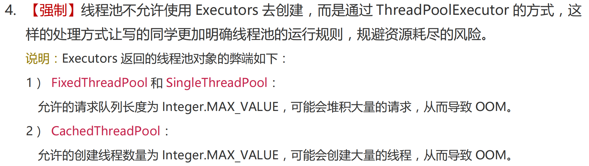

## 死锁的发生原因？怎么避免？


## 什么是协程？Java支持协程吗？

## 什么是Java中的线程同步？


## 什么是Java中的ABA问题？


## volatile关键字的作用？


## 什么是Java中的指令重排？


## 什么是Java的happens-before规则？


## final关键字能否保证变量的可见性？


## Java内存模型（JMM）？


## 什么是Java中的原子性、可见性、有序性？


## 什么是Java的CAS（）操作？


## Java中Thread.sleep(0)的作用是什么？


## 什么是Java中的TransmittableThreadLocal？


## Java中父子线程如何传递数据？


## Java中为什么需要使用ThreadLocal？


## ThreadLocal的缺点？


## 使用ThreadLocal是需要用弱引用来防止内存泄露？


## ThreadLocal是如何实现线程资源隔离的？


## ThreadLocal最佳实践？


## 为什么Netty不适用ThreadLocal而是自定义FastThreadLocal？


## Java中线程安全是什么意思？


## 你是怎么理解线程安全问题的？


## Java中线程之间是如何通信的？


## 如何在Java中控制多个线程的执行顺序？


## 线程的生命周期在Java中是如何定义的？


## 谈谈你对AQS的理解？


## 谈谈你对CAS的理解？


## Java中的synchronized是怎么实现的？


## Java中的synchronized轻量级锁是否会进行自旋？


## Java中的synchronizeds升级到重量级锁时，会发生什么？


## 什么是Java中的锁自适应自旋？


## lock和synchronized的区别？


## ReentrantLock和synchronized的区别？


## 你理解Java线程池原理吗？


## 如何设置Java线程池的线程数？


## Java线程池有哪些拒绝策略？


## 如何优化Java中的锁？


## 线程池如何知道一个线程的任务已经执行完毕了？（小米）


## Java并发库中提供了哪些线程池实现？它们有什么区别？


## Java中的Delay和ScheduledThreadPool有什么区别？


## 什么是Java的Timer？


## 什么叫做阻塞队列的有界和无解？


## 讲一下wait和notify为什么要在synchronized代码块中？


## 你了解时间轮（Time Wheel）吗？他在Java中有哪些应用场景？


## 你使用过哪些Java并发工具？


## 你使用过Java中哪些阻塞队列？


## 你使用过Java中哪些原子类？


## 你使用过Java中的累加器吗？


## 什么是守护线程？他有什么特点？


## reentrantLock是如何实现公平锁和非公平锁？


## reentrantLock的实现原理？


## 你了解Java中的读写锁吗？


## 如何优化Java中的锁？


## 什么是Java的Semaphore？


## 什么是Java的CycliBarrier？


## 什么是Java的CountDownLatch？


## 什么是Java的StampedLock？


## 什么是Java的CompletableFuture？


## 什么是Java的ForkJoinPool？


## 程序、进程、线程？

**程序（program）**

为完成特定任务，用某种语言编写的一组指令的集合。即指一段静态的代码，静态对象。

**进程（process）**

程序的一次执行过程，或是正在内存中运行的应用程序。如：运行中的 QQ，运行中的网易音乐播放器。

-   每个进程都有一个独立的内存空间，系统运行一个程序即是一个进程从创建、运行到消亡的过程。（生命周期）
-   程序是静态的，进程是动态的
-   **进程作为操作系统调度和分配资源的最小单位**（亦是系统运行程序的基本单位），系统在运行时会为每个进程分配不同的内存区域。
-   现代的操作系统，大都是支持多进程的，支持同时运行多个程序。比如：现在我们上课一边使用编辑器，一边使用录屏软件，同时还开着画图板，dos 窗口等软件。

**线程（thread）**

进程可进一步细化为线程，是程序内部的一条执行路径。一个进程中至少有一个线程。

-   一个进程同一时间若并行执行多个线程，就是支持多线程的。
-   **线程作为 CPU 调度和执行的最小单位。**
-   **一个进程中的多个线程共享相同的内存单元**，它们从同一个堆中分配对象，可以访问相同的变量和对象。这就使得线程间通信更简便、高效。但多个线程操作共享的系统资源可能就会带来安全的隐患。
-   与进程相比，线程更加”轻量级“，创建、撤销一个线程比启动新进程的开销小得多


##  线程调度?

线程调度是操作系统的一项核心功能，它负责管理和分配处理器时间给多个线程。在多线程环境中，线程调度确保各个线程能够公平地获得CPU时间，并且在必要时能够进行上下文切换。以下是关于线程调度的一些基本概念和常见策略。

-   **分时调度**

所有**线程轮流**使用cpu的使用权，并且平均分配每个线程的使用时间

-   **抢占式调度**

让**优先级高**的线程以**较大的概率**优先使用 CPU。如果线程的优先级相同，那么会随机选择一个(线程随机性)，**Java使用的为抢占式调度。**


## 并发与并行

**并发（concurrency）**：指**两个或多个事件在同一个时间段内发生**。即在一段时间内，有多条指令在单个CPU上快速轮换、交替执行，使得在宏观上具有多个进程同时执行的效果。（微观上分时交替执行，宏观上同时进行）    

比如：

​	小渣有五个女朋友，在某一天的上午7点到12点需要与五个女朋友约会，在7-8点他与女友A约会，8-9点他与女友B约会，9-10点他与女友C约会，10-11点他与女友D约会，11-12点他与女友E约会，他在一上午与5个女朋友约会了，在宏观上他就是在8-12点这段时间内与五个女朋友一起约会了。

**并行（parallel）**：指两个或多个事件在同一时刻发生（同时发生）。指在同一时刻，有多条指令在多个CPU上同时执行。

比如：

​	小渣有五个女朋友，在某一天的上午7点到12点需要与五个女朋友约会，意思就是在7-12点这段时间（假设这是一个时刻）内要与五个女朋友一起约会，这就叫并行。（但是这在现实生活中肯定是不肯的，除非有五个小渣）


## JDK1.5之前线程的五种状态

线程的生命周期有五种状态：新建（New）、就绪（Runnable）、运行 （Running）、阻塞（Blocked）、死亡（Dead）。CPU 需要在多条线程之间切换，于是线程状态会多次在运行、阻塞、就绪之间切换。


-   **新建（New）**

当一个 Thread 类或其子类的对象被声明并创建时，新生的线程对象处于新建状态。

此时它和其他 Java 对象一样，仅仅由 JVM 为其分配了内存，并初始化了实例变量的值。

此时的线程对象并**没有任何线程的动态特征**，程序也不会执行它的线程体 run()。

-   **就绪（Runnable）**

但是当线程对象调用了 **start()**方法之后，就不一样了，线程就从新建状态转为**就绪状态**。JVM 会为其创建方法调用栈和程序计数器，当然，处于这个状态中的线程并没有开始运行，只是表示已**具备了运行的条件**，随时可以被调度。至于什么时候被调度，取决于 JVM 里线程调度器的调度。

>   注意：
>
>   ​	程序只能对新建状态（NEW）的线程调用 start()，并且只能调用一次，如果对非新建状态的线程，如已启动的线程或已死亡的线程调用 start()都会报错 `IllegalThreadStateException` 异常。

-   **运行 （Running）**

如果处于就绪状态的线程获得了**CPU资源**时，开始执行 run()方法的线程体代码，则该线程处于运行状态。如果计算机只有一个 CPU 核心，在任何时刻只有一个线程处于运行状态，如果计算机有多个核心，将会有多个线程并行 
(Parallel)执行。

当然，美好的时光总是短暂的，而且 CPU 讲究雨露均沾。对于**抢占式策略**的系统而言，系统会给每个可执行的线程一个小时间片来处理任务，当该时间用完，系统会剥夺该线程所占用的资源，让其回到就绪状态等待下一次被调度。

此时其他线程将获得执行机会，而在选择下一个线程时，系统会适当考虑线程的优先级。

-   **阻塞（Blocked）**

当在运行过程中的线程遇到如下情况时，会让出CPU并临时中止自己的执行，进入阻塞状态：

1.  线程调用了 **sleep()**方法，主动放弃所占用的 CPU 资源；
2.  线程试图获取一个同步监视器，但该同步监视器正被其他线程持有；
3.  线程执行过程中，同步监视器调用了 wait()，让它等待某个通知（notify）；
4.  线程执行过程中，同步监视器调用了 wait(time)
5.  线程执行过程中，遇到了其他线程对象的加塞（join）；
6.  线程被调用 suspend 方法被挂起（已过时，因为容易发生死锁）；

当前正在执行的线程被阻塞后，其他线程就有机会执行了。针对如上情况，当发生如下情况时会解除阻塞，让该线程重新进入就绪状态，等待线程调度器再次调度它：

1.  线程的 sleep()时间到；
2.  线程成功获得了同步监视器；
3.  线程等到了通知(notify)；
4.  线程 wait 的时间到了
5.  加塞的线程结束了；
6.  被挂起的线程又被调用了 resume 恢复方法（已过时，因为容易发生死锁）；

-   **死亡（Dead）**

线程会以以下三种方式之一结束，结束后的线程就处于死亡状态：

1.  run()方法执行完成，线程正常结束
2.  线程执行过程中抛出了一个未捕获的异常（Exception）或错误（Error）
3.  直接调用该线程的 stop()来结束该线程（已过时）

 

## JDK1.5之后线程的五种状态


在jdk1.5及之后线程有如下6种状态：

-   **NEW（新建）**

该线程还没开始执行

-   **Runnable（可运行）**

一旦调用**start()**方法，线程将处于**Runnable状态**，一个可运行的线程可能正在运行也可能还未运行，这取决于操作系统给线程提供运行的时间。

一旦一个线程开始运行，它不必始终保持运行。（因为操作系统的时间片轮转机制，目的是让其他线程获得运行的机会）线程调度的细节依赖于操作系统提供的服务。抢占式调度系统给每一个可运行的线程一个时间片来执行任务。时间片完，操作系统将剥夺线程的运行权

>   注意：
>
>   ​	**任何给定时刻，一个可运行的线程可能正在运行也可能没有运行**（这就是为什么将这个状态称为可运行而不是运行）

-   **Blocked（被阻塞）**

    当线程处于被阻塞或等待状态时，它暂不活动。他不允许任何代码且消耗最少的资源。

-   **Waiting（等待）**

-   **Timed waiting（计时等待）**

-   **Terminated（被终止）**线程被终止有如下两种原因：

    -   因为**run方法正常退出**而自然死亡
    -   因为一个没有捕获的**异常终止了run方法**而意外死亡

>   说明：
>
>   ​	当从 WAITING 或 TIMED_WAITING 恢复到 Runnable 状态时，如果发现当前线程没有得到监视器锁，那么会立刻转入 BLOCKED 状态

特点强调，可以调用线程的**stop()方法（已过时）**杀死这个线程，但是该方法会抛出ThreadDeath错误对象，由此杀死线程。部分源码如下：

```java
@Deprecated
public final void stop() {
	SecurityManager security = System.getSecurityManager();
	if (security != null) {
		checkAccess();
		if (this != Thread.currentThread()) {
			security.checkPermission(SecurityConstants.STOP_THREAD_PERMISSION);
		}
	}
	// A zero status value corresponds to "NEW", it can't change to
	// not-NEW because we hold the lock.
	if (threadStatus != 0) {
		resume(); // Wake up thread if it was suspended; no-op otherwise
	}

	// The VM can handle all thread states
	stop0(new ThreadDeath());
}

public class ThreadDeath extends Error {
    private static final long serialVersionUID = -4417128565033088268L;
}
```

可调用如下方法确定当前线程的状态

```java
public State getState()		// 得到线程的当前状态 	
    						// NEW,RUNNABLE,BLOCKED,WAITING,TIMED_WAITING,TERMINATED;
```

在`java.lang.Thread.State` 的枚举类中这样定义：

```java
public enum State {
    /**
         * Thread state for a thread which has not yet started.
         	线程状态为尚未启动的线程。
         */
    NEW,  // NEW（新建）：线程刚被创建，但是并未启动。还没调用 start 方法。

    /**
     线程状态,用于可运行的线程。可运行的线程状态在Java虚拟机中执行,但可能正在等待操作系统的其他资源
	 如处理器。
    */
    RUNNABLE,  // RUNNABLE（可运行）：这里没有区分就绪和运行状态。因为对于 Java 对象来说，只能标记为可运行，至于什么时候运行，不是 JVM 来控制的了，是 OS 来进行调度的，而且时间非常短暂，因此对于 Java 对象的状态来说，无法区分

    // 重点说明，根据 Thread.State 的定义，阻塞状态分为三种：BLOCKED、WAITING、TIMED_WAITING
    BLOCKED,  // BLOCKED（锁阻塞）：在 API 中的介绍为：一个正在阻塞、等待一个监视器锁（锁对象）的线程处于这一状态。只有获得锁对象的线程才能有执行机会。

    WAITING,  // WAITING（无限等待）：在 API 中介绍为：一个正在无限期等待另一个线程执行一个特别的（唤醒）动作的线程处于这一状态。
    // 当前线程执行过程中遇到遇到 Object 类的 wait，Thread 类的join，LockSupport 类的 park 方法，并且在调用这些方法时，没有指定时间，那么当前线程会进入 WAITING 状态，直到被唤醒。
    // 通过 Object 类的 wait 进入 WAITING 状态的要有 Object 的notify/notifyAll 唤醒；
    // 通过 Condition 的 await 进入 WAITING 状态的要有Condition 的 signal 方法唤醒；
    // 通过 LockSupport 类的 park 方法进入 WAITING 状态的要有LockSupport类的 unpark 方法唤醒
    // 通过 Thread 类的 join 进入 WAITING 状态，只有调用join方法的线程对象结束才能让当前线程恢复

    TIMED_WAITING,  // TIMED_WAITING（计时等待）：在 API 中的介绍为：一个正在限时等待另一个线程执行一个（唤醒）动作的线程处于这一状态。
    // 当前线程执行过程中遇到 Thread 类的 sleep 或 join，Object 类的 wait，LockSupport 类的 park 方法，并且在调用这些方法时，设置了时间，那么当前线程会进入 TIMED_WAITING，直到时间到，或被中断

    TERMINATED;  //  Teminated（被终止）：表明此线程已经结束生命周期，终止运行。
}
```


## Thread类的特性？

-   每个线程都是通过某个特定Thread对象的run()方法来完成操作的，因此把**run()方法体称为线程执行体**。
-   通过该Thread对象的**start()方法来启动这个线程**，而非直接调用run()（如果使用Thread方法直接调用run方法，相当于main线程在执行该方法）
-   要想实现多线程，必须在主线程中创建新的线程对象

在学习线程的创建方式之前需要明白：下面的方式都只是创建线程的方式，==本质上线程的创建方式只有一种，那就是Thread.start()==


## 为什么启动线程不直接调用run()，而调用start()？

run()和start()的区别，包括以下4个方面

-   如果自己手动调用run()方法，那么就只是普通方法，没有启动多线程模式
-   run()方法由JVM调用，什么时候调用，执行的过程控制都有操作系统的CPU调度决定。
-   我们创建线程的目的是为了更充分地利用CPU资源，如果直接调用run()方法，就失去了创建线程的意义

-   start()方法是Java线程中约定的内置方法，能够确保代码在新的线程上下文中执行

-   start()方法包含了除创建新线程的特殊代码逻辑。run()方法是我们自己写的代码，显然没有这个能力

-   想要启动多线程，**必须调用start方法**。
-   **一个线程对象只能调用一次start()方法**启动线程，如果重复调用了，则将抛出以上的异常`IllegalThreadStateException`。


## 两次调用start方法会怎么样？

第一次调用start方法时，线程可能处于终止或其他非NEW状态，再次调用start()方法会让正在运行的线程重新运行一遍。

不管是从线程安全的角度来看 ，还是从线程本身的执行逻辑来看 ，他都是不合理的。因此为了避免这种问题的出现，Java中会先判断线程的运行状态。

可调用如下方法确定当前线程的状态

```java
public State getState()		// 得到线程的当前状态 	
    						// NEW,RUNNABLE,BLOCKED,WAITING,TIMED_WAITING,TERMINATED;
```


>   注意：
>
>   ​	程序只能对新建状态（NEW）的线程调用 start()，并且只能调用一次，如果对非新建状态的线程，如已启动的线程或已死亡的线程调用 start()都会报错 `IllegalThreadStateException` 异常。

这个问题的**关键点**在于：

​	只能对新建状态（NEW）的线程调用 start()


## 为什么不建议使用Executors来创建线程池？

Executors：一个**线程池的工厂类**，通过此类的**静态工厂方法**可以创建多种类型的线程池对象。 

Executors提供了4个常用方法来创建内置的线程池

1、**newFixedThreadPool**

Executors.newFixedThreadPool(int nThreads)：创建一个可重用固定线程数的线程池 

```java
public static ExecutorService newFixedThreadPool(int nThreads) {
    return new ThreadPoolExecutor(nThreads, nThreads,
                                  0L, TimeUnit.MILLISECONDS,
                                  new LinkedBlockingQueue<Runnable>());
}
```

发现创建的队列为LinkedBlockingQueue，是一个无界阻塞队列，如果使用改线程池执行任务，如果任务过多就会不断的添加到队列中，任务越多占用的内存就越多，最终可能耗尽内存，导致OOM

2、**SingleThreadExecutor**

Executors.newSingleThreadExecutor() ：创建一个只有一个线程的线程池 

```java
public static ExecutorService newSingleThreadExecutor() {
    return new FinalizableDelegatedExecutorService
        (new ThreadPoolExecutor(1, 1,
                                0L, TimeUnit.MILLISECONDS,
                                new LinkedBlockingQueue<Runnable>()));
}
```

发现创建的队列为LinkedBlockingQueue，是一个无界阻塞队列，如果使用改线程池执行任务，如果任务过多就会不断的添加到队列中，任务越多占用的内存就越多，最终可能耗尽内存，导致OOM

3、**CachedThreadPool**

Executors.newCachedThreadPool()：创建一个可根据需要创建新线程的线程池

```java
public static ExecutorService newCachedThreadPool() {
    return new ThreadPoolExecutor(0, Integer.MAX_VALUE,
                                  60L, TimeUnit.SECONDS,
                                  new SynchronousQueue<Runnable>());
}
```

它的特点是线程数不受限制，可以根据需要创建新线程。虽然这对于短时间的任务非常有用，但如果任务执行时间较长或任务量较大，可能会导致大量线程堆积，从而消耗过多系统资源，最终导致OOM

4、**ScheduledThreadPool**

Executors.newScheduledThreadPool(int corePoolSize)：创建一个线程池，它可安排在给定延迟后运行命令或者定期地执行。 

```java
public ScheduledThreadPoolExecutor(int corePoolSize) {
    super(corePoolSize, Integer.MAX_VALUE, 0, NANOSECONDS,
          new DelayedWorkQueue());
}
```

**阿里规约**

