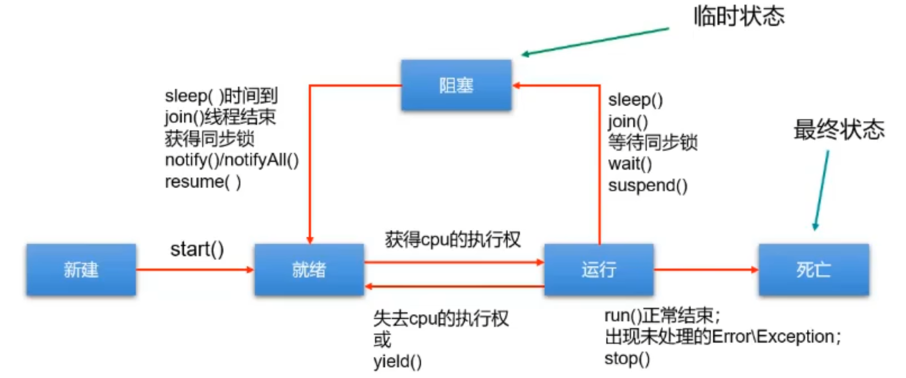
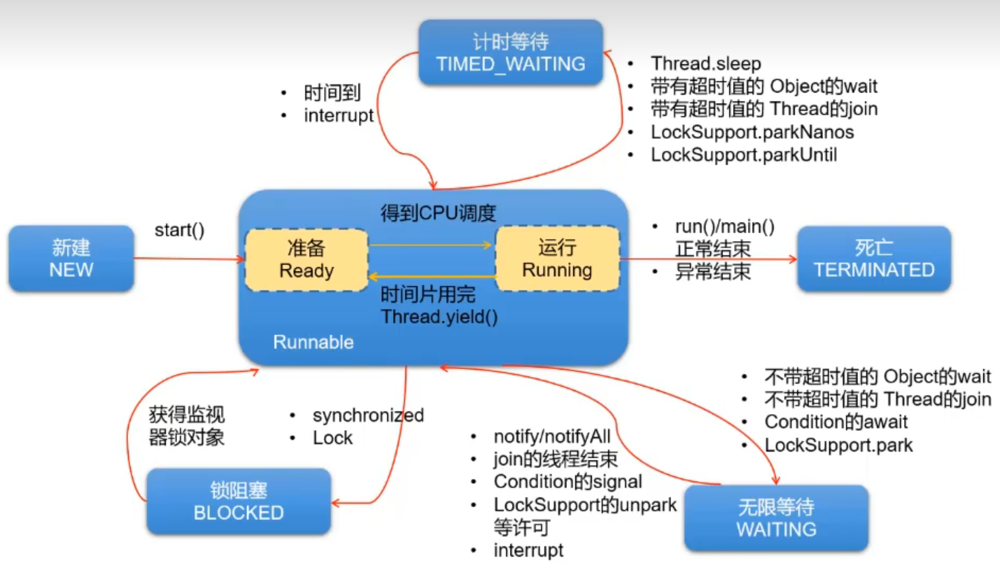

## 为什么要使用多线程？


## 串行、并行和并发有什么区别？

**串行**：指多个任务按顺序依次完成。此时反而使用单线程效果更好，避免了线程的切换。

**并发（concurrency）**：指**两个或多个事件在同一个时间段内发生**。即在一段时间内，有多条指令在单个CPU上快速轮换、**交替执行**，使得在宏观上具有多个进程同时执行的效果。（微观上分时交替执行，宏观上同时进行）    

比如：

​	小渣有五个女朋友，在某一天的上午7点到12点需要与五个女朋友约会，在7-8点他与女友A约会，8-9点他与女友B约会，9-10点他与女友C约会，10-11点他与女友D约会，11-12点他与女友E约会，他在一上午与5个女朋友约会了，在宏观上他就是在8-12点这段时间内与五个女朋友一起约会了。

**并行（parallel）**：指**两个或多个事件在同一时刻发生**（同时发生）。指在同一时刻，有多条指令在多个CPU上同时执行。

比如：

​	小渣有五个女朋友，在某一天的上午7点到12点需要与五个女朋友约会，意思就是在7-12点这段时间（假设这是一个时刻）内要与五个女朋友一起约会，这就叫并行。（但是这在现实生活中肯定是不肯的，除非有五个小渣）


## 进程、线程、管程、协程区别？

**进程（Process）**

**进程是操作系统调度和分配资源的最小单位**。每个进程都有自己的内存空间、文件描述符、堆栈等资源。如：运行中的 QQ，运行中的网易音乐播放器。

-   **进程的特点**
    -   **独立性**：进程之间是独立的，互不干扰。一个进程的崩溃不会影响其他进程。
    -   **资源丰富**：每个进程拥有独立的资源，包括内存、文件句柄等。
    -   **开销大**：创建和销毁进程的开销较大，进程间通信（IPC）也相对复杂。
    -   **上下文切换**：进程的上下文切换开销较大，因为需要切换内存空间和资源。

-   **使用场景**
    -   适用于需要强隔离和独立资源的场景，如独立的服务、应用程序等

**线程 (Thread)**

线程是进程内的执行单元，一个进程可以包含多个线程。线程共享进程的资源（如内存空间、文件描述符）。一个进程中至少有一个线程。

-   **线程的特点**
    -   **共享资源**：同一进程内的线程共享内存和资源，通信方便。
    -   **轻量级**：与进程相比，线程更加”轻量级“，线程的创建和销毁开销较小，上下文切换较快。
    -   **并发执行**：多线程可以并发执行，提高程序的响应速度和资源利用率。
    -   **同步问题**：由于共享资源，线程间需要同步机制（如锁）来避免资源竞争和数据不一致。

-   **使用场景**
    -   适用于需要并发执行的任务，如多任务处理、并行计算等。

>   注意：
>
>   -   不同的进程之间是不共享内存的。
>   -   进程之间的数据交换和通信的成本很高。

 **管程 (Monitor)** 

管程是一种高级的同步机制，用于管理共享资源的并发访问。它将共享资源和访问资源的代码封装在一起，通过条件变量和互斥锁来实现同步。

-   **管程特点** 
    -   封装性：将共享资源和同步代码封装在一起，提供更高层次的抽象。
    -   互斥访问：通过互斥锁确保同一时刻只有一个线程可以访问共享资源。
    -   条件同步：使用条件变量来协调线程间的执行顺序。

-   **使用场景** 
    -   适用于需要对共享资源进行复杂同步操作的场景，如操作系统内核、并发数据结构等。

 **协程 (Coroutine)** 

协程是一种比线程更轻量级的并发执行单元。协程由程序自身调度，而不是由操作系统内核调度。协程可以在执行过程中主动让出控制权，以便其他协程运行。

-   **协程特点** 
    -   **轻量级**：协程的创建和切换开销极小，通常在用户态完成。
    -   **主动让出**：协程通过显式的调用（如yield）让出控制权，实现合作式多任务。
    -   **非抢占式**：协程之间的切换是合作式的，不存在抢占问题。
    -   **栈独立**：每个协程有自己的栈，避免了线程间共享栈带来的同步问题。

-   **使用场景** 
    -   适用于需要大量并发任务且切换频繁的场景，如高并发网络服务器、异步编程等。

**虚拟线程 (Virtual Thread)** 

虚拟线程是一个新概念，特别是在 Java 的 Project Loom 中引入。虚拟线程是一种轻量级线程，由 JVM 管理，旨在简化并发编程并提高并发性能。

-   **特点** 
    -   **轻量级**：虚拟线程的创建和销毁开销极小，可以高效地管理数百万个线程。
    -   **自动管理**：由 JVM 自动调度和管理，不需要开发者显式地管理线程池。
    -   **兼容性**：与传统的 Java 线程 API 兼容，开发者可以用熟悉的线程模型编写高并发程序。
    -   **阻塞操作**：虚拟线程可以在阻塞操作（如 I/O 操作）时高效地让出 CPU，而不会浪费资源。

-   **使用场景** 
    -   适用于高并发应用程序，如高性能服务器、Web 应用等。

  

## 用户线程与守护线程区别?

**用户线程**

用户线程是应用程序创建的普通线程，也称为非守护线程。当所有用户线程都结束时，Java 虚拟机 (JVM) 也会退出。

**特点**

-   **生命周期**：用户线程的生命周期由应用程序控制。只要有一个用户线程在运行，JVM 就会继续运行。

- **重要性**：用户线程通常用于执行应用程序的主要任务，例如处理业务逻辑、执行计算等。

-   **关闭 JVM**：JVM 只有在所有用户线程都结束后才会退出，即使还有守护线程在运行。

**使用场景**

-   适用于需要执行重要任务且不能中途被终止的线程。例如：处理用户请求的线程，执行关键业务逻辑的线程


**守护线程 (Daemon Thread)**

守护线程是为其他线程提供服务和支持的线程。当所有非守护线程（用户线程）都结束时，JVM 会自动退出，即使守护线程还在运行。

**特点**

-   **生命周期**：守护线程的生命周期依赖于用户线程。当所有用户线程结束时，守护线程也会自动终止。

-   **后台任务**：守护线程通常用于执行后台任务，如垃圾回收、日志记录等。

-   **低优先级**：守护线程通常优先级较低，因为它们主要为用户线程提供支持。

**使用场景**

-   适用于执行后台任务或辅助任务的线程，这些任务不需要在 JVM 退出时完成。例如：JVM 的垃圾回收线程，日志记录线程，监控和统计线程

示例

```java
public class ThreadExample {
    public static void main(String[] args) {
        Thread userThread = new Thread(() -> {
            try {
                Thread.sleep(5000);
                System.out.println("User thread finished");
            } catch (InterruptedException e) {
                e.printStackTrace();
            }
        });

        Thread daemonThread = new Thread(() -> {
            while (true) {
                try {
                    Thread.sleep(1000);
                    System.out.println("Daemon thread running");
                } catch (InterruptedException e) {
                    e.printStackTrace();
                }
            }
        });

        daemonThread.setDaemon(true);

        userThread.start();
        daemonThread.start();

        System.out.println("Main thread finished");
    }
}
```

在这个例子中：

userThread是一个用户线程，它会运行 5 秒钟。daemonThread是一个守护线程，它会每秒钟打印一次消息。

当userThread结束后，JVM 会退出，即使daemonThread还在运行


## 线程的基本方法（Thread类的方法）

`start()`

start()方法用于启动线程。线程创建以后，并不会自动运行，需要我们**调用start()**，将线程的状态设为**就绪状态**，但不一定马上就被运行，得等到CPU分配时间片以后，才会运行

```java
class MyThread extends Thread {
    @Override
    public void run() {
        System.out.println("Thread is running");
    }
}

public class Main {
    public static void main(String[] args) {
        MyThread t1 = new MyThread();
        t1.start();  // 启动新线程
    }
}
```

**注意**：直接调用run()方法不会启动新线程，而是在当前线程中执行run()方法。


`run()`

run()方法包含线程执行的代码。它是Thread类和Runnable接口的核心方法

```java
class MyRunnable implements Runnable {
    @Override
    public void run() {
        System.out.println("Thread is running");
    }
}

public class Main {
    public static void main(String[] args) {
        Thread t1 = new Thread(new MyRunnable());
        t1.start();  // 启动新线程，实际调用的仍是 run() 方法
    }
}
```


`sleep(long millis)`

sleep(long millis)方法使当前线程休眠指定的毫秒数。它会抛出`InterruptedException`，因此需要处理该异常。

```java
try {
    System.out.println("Thread is sleeping");
    Thread.sleep(1000);  // 休眠1秒
    System.out.println("Thread woke up");
} catch (InterruptedException e) {
    e.printStackTrace();
}
```


`join()`

join()方法**等待线程终止**。调用该方法的线程会等待被调用线程执行完毕后再继续执行。

```java
public class Main {
    public static void main(String[] args) {
        Thread t1 = new Thread(() -> {
            try {
                Thread.sleep(1000);  // 模拟工作
                System.out.println("Thread finished");
            } catch (InterruptedException e) {
                e.printStackTrace();
            }
        });
        t1.start();
        
        try {
            t1.join();  // 等待 t1 线程结束
            System.out.println("Main thread continues");
        } catch (InterruptedException e) {
            e.printStackTrace();
        }
    }
}
```


`currentThread()`

currentThread()方法用于获取当前正在执行的线程（线程对象的引用）

```java
public class Main {
    public static void main(String[] args) {
        Thread t1 = new Thread(() -> {
            Thread currentThread = Thread.currentThread();
            System.out.println("Current thread: " + currentThread.getName());
        });
        t1.start();
    }
}
```


`interrupt()`

interrupt()方法用于**中断线程**。被中断的线程会抛出`InterruptedException`

`Thread.currentThread().isInterrupted()`

isInterrupted()方法用于**检查线程是否被中断**，但不会重置中断标志。它返回一个布尔值

`Thread.interrupted()`

检查当前线程的中断状态，并重置中断标志为 false。

```java
public class Main {
    public static void main(String[] args) {
        Thread t1 = new Thread(() -> {
            try {
                while (!Thread.currentThread().isInterrupted()) { // 判断线程是否被中断
                    System.out.println("Thread is running");
                    Thread.sleep(500);
                }
            } catch (InterruptedException e) {
                System.out.println("Thread was interrupted");
            }
        });
        t1.start();
        
        try {
            Thread.sleep(2000);
        } catch (InterruptedException e) {
            e.printStackTrace();
        }
        
        t1.interrupt();  // 中断 t1 线程
    }
}
```


`setPriority(int newPriority)`

setPriority(int newPriority)方法用于**设置线程的优先级**。

优先级范围从Thread.MIN_PRIORITY(1) 到 Thread.MAX_PRIORITY(10)，默认优先级为Thread.NORM_PRIORITY(5)。

`getPriority()`

getPriority()方法用于获取线程的优先级

```java
public class Main {
    public static void main(String[] args) {
        Thread t1 = new Thread(() -> {
            System.out.println("Thread is running with priority: " + Thread.currentThread().getPriority());
        });
        t1.setPriority(Thread.MAX_PRIORITY);
        t1.start();
    }
}
```


`setName(String name)`

setName(String name)方法用于**设置线程的名称**

`getName()`

getName()方法用于**获取线程的名称**

```java
public class Main {
    public static void main(String[] args) {
        Thread t1 = new Thread(() -> {
            System.out.println("Thread name: " + Thread.currentThread().getName());
        });
        t1.setName("MyThread");
        t1.start();
    }
}
```


`yield()`

yield()方法它使得当前线程从运行状态（Running）进入到就绪状态（Runnable），给其他具有相同优先级的等待线程以执行的机会。

-   不确定性：调用 yield 不一定会导致当前线程停止执行，因为调度器可能会再次选择该线程继续运行。
-   使用场景：通常在希望多个同优先级的线程能够更加“公平”地获得 CPU 时间时使用，但实际效果依赖于 JVM 和底层操作系统的线程调度策略。

```java
class YieldExample {
    public static void main(String[] args) {
        Thread t1 = new Thread(() -> {
            for (int i = 0; i < 5; i++) {
                System.out.println("Thread 1: " + i);
                if (i == 2) Thread.yield(); // 尝试让出CPU
            }
        });

        Thread t2 = new Thread(() -> {
            for (int i = 0; i < 5; i++) {
                System.out.println("Thread 2: " + i);
            }
        });

        t1.start();
        t2.start();
    }
}
```


此外，还有如下这些方法

```java
public final native boolean isAlive()  // 判断线程是否还活着
    
// @since 1.5
public State getState()  // 得到这一线程的状态
    
    
// 将指定线程设置为守护线程
public final void setDaemon(boolean on)  
// 必须在线程启动start()之前设置，否则会报 IllegalThreadStateException 异常。
    
// 判断线程是否是守护线程
public final boolean isDaemon()
    
    
// 以下三个方法已过时，不建议使用
    
public final void stop()  // 强行结束一个线程的执行，直接进入死亡状态。run()即刻停止，可能会导致一些清理性的工作得不到完成，如文件，数据库等的关闭。同时，会立即释放该线程所持有的所有的锁，导致数据得不到同步的处理，出现数据不一致的问题。
    
// 二者必须成对出现，否则非常容易发生死锁。
public final void suspend() // 会导致线程暂停，但不会释放任何锁资源，导致其它线程都无法访问被它占用的锁，直到调用 resume()
public final void resume()  // 恢复线程。该方法仅用于调用suspend()之后调用
```


## Java创建线程的方式有哪些？

Java语言的JVM允许程序运行多个线程，使用`java.lang.Thread`类代表**线程**，所有的线程对象都必须是Thread类或其子类的实例。

**Thread类的特性**

-   每个线程都是通过某个特定Thread对象的run()方法来完成操作的，因此把**run()方法体称为线程执行体**。
-   通过该Thread对象的**start()方法来启动这个线程**，而非直接调用run()（如果使用Thread方法直接调用run方法，相当于main线程在执行该方法）
-   要想实现多线程，必须在主线程中创建新的线程对象

在学习线程的创建方式之前需要明白：下面的方式都只是创建线程的方式，==本质上线程的创建方式只有一种，那就是Thread.start()==

-   继承Thread类
-   实现Runnable接口
-   实现Callable接口
-   使用线程池

**方式1：继承Thread类**

通过继承`java.lang.Thread`类并重写其run方法来创建线程：

1.  定义**Thread类的子类**，并**重写**该类的**run()方法**，该run()方法的方法体就代表了线程需要完成的任务
2.  创建Thread子类的实例，即创建了线程对象
3.  调用线程对象的**start()方法**来**启动该线程**

```java
public class EvenNumberDemo {
    public static void main(String[] args) {
        EvenNumberThread evenNumberThread = new EvenNumberThread();
        evenNumberThread.start();  // 启动子线程

        // 主方法的逻辑
        for (int i = 1; i < 100; i++) {
            if (i % 2 == 0) {
                System.out.println(Thread.currentThread().getName() + ":" + i);
            }
        }
    }
}

// 为了方便，我们直接在这里定义一个类
class EvenNumberThread extends Thread {
    @Override
    public void run() {
        for (int i = 1; i < 100; i++) {  // 遍历1-100内的偶数
            if (i % 2 == 0) {
                System.out.println(Thread.currentThread().getName() + ":" + i);
            }
        }
    }
}
```

注意：

-   如果自己手动调用run()方法，那么就只是普通方法，没有启动多线程模式。
-   run()方法由JVM调用，什么时候调用，执行的过程控制都由操作系统的CPU调度决定。
-   想要启动多线程，必须调用start方法。
-   **一个线程对象只能调用一次start()方法**启动线程，如果重复调用了，则将抛出以上的异常`IllegalThreadStateException`


**方式2：实现Runnable接口**

通过实现`java.lang.Runnable`接口并将其传递给Thread对象来创建线程

**Java有单继承的限制，当我们无法继承Thread类时**，那么该如何做呢？在核心类库中提供了Runnable接口，我们**可以实现Runnable接口，重写run()方法**，然后再通过Thread类的对象代理启动和执行我们的线程体run()方法

步骤如下：

1.  定义Runnable接口的实现类，并**重写该接口的run()方法**，该run()方法的方法体同样是该线程的线程执行体。
2.  **创建Runnable**实现类的**实例**，并以此**实例作为Thread的target参数来创建Thread对象**，该Thread对象才是真正的线程对象。
3.  调用线程对象的start()方法，启动线程。调用Runnable接口实现类的run方法

```java
public class OddNumberDemo {
    public static void main(String[] args) {
        //创建自定义类对象 线程任务对象
        OddNumberRunnable oddNumberRunnable = new OddNumberRunnable();
        //创建线程对象,并启动线程
        new Thread(oddNumberRunnable).start();

        // 主方法的逻辑
        for (int i = 0; i < 100; i++) {  // 打印1-100以内的奇数
            if (i % 2 == 1) {
                System.out.println(Thread.currentThread().getName() + ":" + i);
            }
        }
    }
}

class OddNumberRunnable implements Runnable {

    @Override
    public void run() {
        for (int i = 0; i < 100; i++) {  // 打印1-100以内的奇数
            if (i % 2 == 1) {
                System.out.println(Thread.currentThread().getName() + ":" + i);
            }
        }
    }
}
```

注意：

-   通过实现Runnable接口，使得该类有了多线程类的特征。所有的分线程要执行的代码都在run方法里面。
-   在启动的多线程的时候，需要先通过Thread类的构造方法Thread(Runnable target) 构造出对象，然后调用Thread对象的start()方法来运行多线程代码。
-   实际上，**所有的多线程代码都是通过运行Thread的start()方法来运行**的。因此，不管是继承Thread类还是实现 Runnable接口来实现多线程，最终还是通过Thread的对象的API来控制线程的，熟悉Thread类的API是进行多线程编程的基础。
-   说明：Runnable对象仅仅作为Thread对象的target，Runnable实现类里包含的run()方法仅作为线程执行体。 而实际的线程对象依然是Thread实例，只是该Thread线程负责执行其target的run()方法。


**方式二：使用Lambda表达式简化Runnable接口的实现**

通过Lambda表达式简化Runnable接口的实现

```java
public class OddNumberDemo {
    public static void main(String[] args) {
        //创建线程对象,并启动线程
        new Thread(()->{  for (int i = 0; i < 100; i++) {
            if (i % 2 == 1) {  // 遍历100以内的奇数
                System.out.println(Thread.currentThread().getName() + ":" + i);

            }
        }},"老六线程").start();

        // 主方法的逻辑
        for (int i = 0; i < 100; i++) {  // 打印1-100以内的奇数
            if (i % 2 == 1) {
                System.out.println(Thread.currentThread().getName() + ":" + i);
            }
        }
    }
}
```


**方式三：实现Callable接口**（JDK5.0增加）

通过实现`java.util.concurrent.Callable`接口来创建线程，并使用FutureTask来管理返回结果。

-   与使用 Runnable 相比， Callable 功能更强大些 
    -   相比 run()方法，**可以有返回值** 
    -   call()方法**可以抛出异常**
    -   **支持泛型的返回值**（需要借助 FutureTask 类，获取返回结果） 
-   Future 接口
    -   可以对具体 Runnable、Callable 任务的执行结果进行取消、查询是否完成、获取结果等。 
    -   FutureTask 是 Futrue 接口的唯一的实现类 
    -   FutureTask 同时实现了 `Runnable`,`Future 接口。它既可以作为 Runnable 被线程执行，又可以作为 Future 得到 Callable 的返回值 
-   缺点：在获取分线程执行结果的时候（即调用get方法），当前线程（或是主线程）受阻塞，效率较低。 

```java
import java.util.concurrent.Callable;
import java.util.concurrent.ExecutionException;
import java.util.concurrent.FutureTask;

// jdk5.0新增的创建线程的方式：实现Callable

// 1.创建一个类实现 Callable
class NumThread implements Callable {
    // 2.实现 call 方法，将此线程要执行的操作声明在方法内
    @Override
    public Object call() throws Exception {
         // 执行任务逻辑，返回结果
        int sum = 0;
        for (int i = 1; i <= 100; i++) {
            if (i % 2 == 0) {
                System.out.println(i);
                sum += i;
            }
        }
        return sum;
    }
}

public class CallableTest {
    public static void main(String[] args) {
        // 3.创建Callable接口的实现类对象
        NumThread numThread = new NumThread();

        // 4.将此Callable接口的实现类对象作为参数传递到FutureTask构造器中，创建FutureTask的对象
        FutureTask futureTask = new FutureTask(numThread);

        // 5.将FutureTask的对象作为参数传递到Thread类的构造器中，创建Thread对象，并调用start()
        Thread t1 = new Thread(futureTask);
        t1.start();

        try {
            // 6.获取Callable中的返回值（执行任务逻辑，返回结果）
            // get()返回值即为FutureTask构造器参数Callable实现类重写的call()的返回值
            Object sum = futureTask.get();  // todo get方法自然会有阻塞，等待t1执行完以后，再取返回值
            System.out.println("sum this is " + sum);
        } catch (InterruptedException e) {
            e.printStackTrace();
        } catch (ExecutionException e) {
            e.printStackTrace();
        }
    }
}
```


**方式四：使用线程池**

通过`java.util.concurrent.ExecutorService`接口的实现类创建和管理线程池，避免手动创建和管理线程。

**使用线程池的好处：** 

-   提高响应速度（减少了创建新线程的时间） 
-   降低资源消耗（重复利用线程池中线程，不需要每次都创建） 
-   便于线程管理 
    -   corePoolSize：核心池的大小  
    -   maximumPoolSize：最大线程数 
    -   keepAliveTime：线程没有任务时最多保持多长时间后会终止 

​	在 Java 中，可以使用 `java.util.concurrent` 包中的 `ExecutorService` 接口和 `ThreadPoolExecutor` 类来创建和管理线程池。

线程池核心思想：==用固定的线程去执行不定量的task==

**使用线程池的一般步骤**

-   1）**创建线程池对象**：可以使用 `Executors` 类的静态方法来创建线程池对象

```java
// 例如，可以使用 Executors.newFixedThreadPool(int nThreads) 方法创建一个固定大小的线程池。
ExecutorService executor = Executors.newFixedThreadPool(5);
```

-   2）**提交任务给线程池**：使用 `execute(Runnable command)` 方法或 `submit(Callable<T> task)` 方法将任务提交给线程池。
    -   `execute` 方法用于提交不需要返回结果的任务，而 `submit` 方法用于提交需要返回结果的任务。

```java
executor.execute(new MyRunnable());
executor.submit(new MyCallable());
```

-   3）**定义任务**：任务可以是实现了 `Runnable` 接口的类或实现了 `Callable` 接口的类。`Runnable` 接口的 `run` 方法定义了任务的执行逻辑，`Callable` 接口的 `call` 方法也定义了任务的执行逻辑，并且可以返回一个结果。

```java
class MyRunnable implements Runnable {
    public void run() {
        // 任务的执行逻辑
    }
}

class MyCallable implements Callable<Integer> {
    public Integer call() {
        // 任务的执行逻辑，并返回一个结果
        return 42;
    }
}
```

-   4）**关闭线程池**：在不再需要线程池时，应该调用 `shutdown()` 方法来关闭线程池。这将停止接受新的任务，并等待已提交的任务完成。

```java
executor.shutdown();
```

​	以上是使用线程池的基本步骤。您还可以根据需要设置线程池的参数，如线程池大小、任务队列类型等。可以通过 `ThreadPoolExecutor` 类的构造函数或 `ExecutorService` 接口的其他方法来进行配置

示例：

**通过 ThreadPoolExecutor类的构造器创建线程池**

```java
import java.util.concurrent.*;

// 线程池：JDK5.0增加的线程创建方式
// 使用 execute()方法提交线程任务，无返回值
public class ThreadPoolDemo1 {
    public static void main(String[] args) {
        /**
         public ThreadPoolExecutor(int corePoolSize,    核心线程数量
         int maximumPoolSize,   最大线程池数量
         long keepAliveTime,    非核心线程的空闲时间
         TimeUnit unit,         空闲时间单位
         BlockingQueue<Runnable> workQueue, 任务队列
         ThreadFactory threadFactory,   线程工厂
         RejectedExecutionHandler handler  拒绝策略
         )
         */
        // todo 1.创建线程池对象
        ExecutorService pool = new ThreadPoolExecutor(3, 5, 6,
                TimeUnit.SECONDS, new ArrayBlockingQueue<>(5),
                Executors.defaultThreadFactory(), new ThreadPoolExecutor.AbortPolicy());

        // todo 2.将任务给线程池处理，通过 execute()方法提交
        Runnable target = new MyRunnable();
        pool.execute(target);
        pool.execute(target);
        pool.execute(target);

        // 放入任务队列
        pool.execute(target);
        pool.execute(target);
        pool.execute(target);
        pool.execute(target);
        pool.execute(target);

        // 开始创建临时线程
        pool.execute(target);
        pool.execute(target);

        // 不创建，拒绝策略被触发！！
        pool.execute(target);  // 抛出异常  RejectedExecutionException

        // todo 4.关闭线程池
        //pool.shutdownNow();  // 立即关闭，即使任务没有执行完，会丢失任务
        pool.shutdown();  // 会等待任务执行完毕后才完毕（可以使用）
    }
}


// todo 3.定义任务
public class MyRunnable implements Runnable {
    @Override
    public void run() {
        for (int i = 0; i < 2; i++) {
            System.out.println(Thread.currentThread().getName() + "输出了：HelloWorld ==>" + i);
        }
        try {
            System.out.println("本任务与线程"+ Thread.currentThread().getName()+ "进行绑定，线程进入休眠");
            Thread.sleep(500000);
        } catch (InterruptedException e) {
            e.printStackTrace();
        }
    }
}
```

**通过 Executors 工厂类使用线程池（阿里规约曰禁止使用）**

```java
import java.util.concurrent.ExecutorService;
import java.util.concurrent.Executors;

// 使用 Executors静态工厂方法创建线程池对象
public class ThreadPoolTest {
    public static void main(String[] args) {
        // todo 1.获取一个指定线程数量的线程池
        ExecutorService threadPool = Executors.newFixedThreadPool(5);

        // todo 2.提交任务给线程池，并且使用匿名内部类的方式定义任务
        threadPool.execute(() -> {
            int sum = 0;
            for (int i = 1; i <= 100; i++) {
                if (i % 2 == 0) {
                    sum += i;
                }
            }
            System.out.println("sum this is " + sum);
        });
        threadPool.execute(() -> System.out.println("hello world"));
        threadPool.execute(() -> System.out.println("hello world"));
        threadPool.execute(() -> System.out.println("hello world"));
        threadPool.execute(() -> System.out.println("hello world"));

        // todo 4.关闭线程池
        threadPool.shutdown();
    }
}
```


## Java创建线程的几种方式有什么区别？

**继承Thread类**

-   实现方式：通过继承 `java.lang.Thread` 类并重写 `run()` 方法。

-   特点：
    -   简单直接，适合简单的场景。
    -   **受限于 Java 的单继承机制**，如果类已经继承了其他类，则不能使用这种方式。
    -   **不支持返回值**：任务执行完毕后无法返回结果。

-   适用场景：非常基础的并发需求，代码量较少且不需要复杂功能。不适合复杂的线程管理和资源共享场景

**实现Runnable接口**

-   实现方式：通过实现 `java.lang.Runnable` 接口并重写 `run()` 方法，然后将 Runnable 实例传递给 Thread 类的构造函数。
-   特点：
    -   **避免了单继承限制**，灵活性更高（因为类可以实现多个接口）。
    -   **资源共享**：多个线程可以共享同一个 Runnable 实例，便于资源共享。
    -   **不支持返回值**：任务执行完毕后无法返回结果
-   适用场景：大多数并发编程场景，尤其是需要多个线程执行相同任务时。

**实现Callable接口和使用FutureTask**

-   实现方式：通过实现 `java.util.concurrent.Callable` 接口并重写 `call()` 方法。与 Runnable 不同，Callable **可以返回结果**并且**可以抛出异常**。但实现和使用稍微复杂一些。

-   特点：
    -   **支持返回值和异常处理**，适用于需要返回结果的任务。
    -   通常与 Future 和 ExecutorService 一起使用，便于管理和获取任务结果。（使用FutureTask来管理和返回结果）

-   适用场景：需要任务返回结果或处理异常的场景。

**使用线程池**

-   实现方式：通过 `java.util.concurrent.ExecutorService` 来管理线程的创建和执行。ExecutorService 提供了线程池管理功能，如固定大小的线程池、缓存线程池、定时线程池等。

-   特点
    -   **线程池管理**：通过线程池复用线程，减少频繁创建和销毁线程的开销。
    -   **任务调度**：支持异步任务提交和结果获取。
    -   **灵活配置**：可以根据任务量动态调整线程池大小。可以根据需求选择不同类型的线程池（如固定大小、缓存、定时等）。
    -   **简化开发**：隐藏了线程管理的复杂性，使代码更加简洁和易于维护。

-   适用场景：需要高效管理和复用线程的场景，特别是高并发环境。


## 为什么不建议使用Executors来创建线程池？（阿里规约）

`Executors`：一个**线程池的工厂类**，通过此类的**静态工厂方法**可以创建多种类型的线程池对象。 

Executors提供了4个常用方法来创建内置的线程池

1、**newFixedThreadPool**

Executors.newFixedThreadPool(int nThreads)：创建一个可重用**固定线程数**的线程池 

```java
public static ExecutorService newFixedThreadPool(int nThreads) {
    return new ThreadPoolExecutor(nThreads, nThreads,
                                  0L, TimeUnit.MILLISECONDS,
                                  new LinkedBlockingQueue<Runnable>());
}
```

发现创建的队列为LinkedBlockingQueue，是一个无界阻塞队列，如果使用改线程池执行任务，如果任务过多就会不断的添加到队列中，任务越多占用的内存就越多，最终可能耗尽内存，导致OOM

2、**SingleThreadExecutor**

Executors.newSingleThreadExecutor() ：创建一个只有**一个线程**的线程池 

```java
public static ExecutorService newSingleThreadExecutor() {
    return new FinalizableDelegatedExecutorService
        (new ThreadPoolExecutor(1, 1,
                                0L, TimeUnit.MILLISECONDS,
                                new LinkedBlockingQueue<Runnable>()));
}
```

发现创建的队列为LinkedBlockingQueue，是一个无界阻塞队列，如果使用改线程池执行任务，如果任务过多就会不断的添加到队列中，任务越多占用的内存就越多，最终可能耗尽内存，导致OOM

3、**CachedThreadPool**

Executors.newCachedThreadPool()：创建一个可根据需要创建新线程的线程池

```java
public static ExecutorService newCachedThreadPool() {
    return new ThreadPoolExecutor(0, Integer.MAX_VALUE,
                                  60L, TimeUnit.SECONDS,
                                  new SynchronousQueue<Runnable>());
}
```

它的特点是线程数不受限制，可以根据需要创建新线程。虽然这对于短时间的任务非常有用，但如果任务执行时间较长或任务量较大，可能会导致大量线程堆积，从而消耗过多系统资源，最终导致OOM

4、**ScheduledThreadPool**

Executors.newScheduledThreadPool(int corePoolSize)：创建一个线程池，它可安排在给定延迟后运行命令或者定期地执行。 

```java
public ScheduledThreadPoolExecutor(int corePoolSize) {
    super(corePoolSize, Integer.MAX_VALUE, 0, NANOSECONDS,
          new DelayedWorkQueue());
}
```

**阿里规约**


## 线程池相关的常用API？

​	JDK5.0 之前，我们必须手动自定义线程池。**从 JDK5.0 开始，Java 内置线程池相关的API**。在 `java.util.concurrent` 包下提供了线程池相关 API：`ExecutorService`接口 和 `Executors`工厂类。 

-   ExecutorService：真正的线程池接口。常见子类 **ThreadPoolExecutor** 
    -   `void execute(Runnable command)`：执行任务/命令，没有返回值，一般用来执行 Runnable
    -   `<T> Future<T> submit(Callable<T> task)`：执行任务，有返回值，一般又来执行 Callable 
    -   `void shutdown()` ：关闭连接池 
-   Executors：一个**线程池的工厂类**，通过此类的**静态工厂方法**可以创建多种类型的线程池对象。 
    -   `Executors.newCachedThreadPool()`：创建一个可根据需要创建新线程的线程池
    -   `Executors.newFixedThreadPool(int nThreads)`：创建一个可重用固定线程数的线程池 
    -   `Executors.newSingleThreadExecutor()` ：创建一个只有一个线程的线程池 
    -   `Executors.newScheduledThreadPool(int corePoolSize)`：创建一个线程池，它可安排在给定延迟后运行命令或者定期地执行。 

下面是java.util.concurrent包下 ThreadPoolExecutor 类中参数最多的一个构造器

```java
public ThreadPoolExecutor(int corePoolSize,
                              int maximumPoolSize,
                              long keepAliveTime,
                              TimeUnit unit,
                              BlockingQueue<Runnable> workQueue,
                              ThreadFactory threadFactory,
                              RejectedExecutionHandler handler)
    	

// corePoolSize：线程池的核心线程数。在没有任务执行时，线程池会保持这些核心线程的数量。
// 即使这些线程处于空闲状态，它们也不会被销毁。当有新的任务提交时，线程池会优先使用核心线程来执行任务。

// maximumPoolSize：线程池的最大线程数。线程池中允许创建的最大线程数，包括核心线程和非核心线程。
// 当任务提交的数量超过核心线程数，并且任务队列已满时，线程池会创建新的非核心线程来执行任务，直到达到最大线程数。

// keepAliveTime：非核心线程的空闲时间。当线程池中的线程数量超过核心线程数时，空闲的非核心线程会在指定的时间内保持存活状态。如果在这段时间内没有新的任务提交，这些线程将被销毁。

// unit：空闲时间的时间单位。指定 keepAliveTime 参数的时间单位，例如 TimeUnit.SECONDS 表示秒。

// workQueue：任务队列。用于存储待执行的任务的阻塞队列。当线程池中的线程都在执行任务时，新的任务会被放入任务队列中等待执行。

// threadFactory：线程工厂。用于创建新线程的工厂对象。可以自定义线程的创建逻辑，例如设置线程的名称、优先级等。
- SynchronousQueue：直接提交队列
- ArrayBlockingQueue：有界队列，可以指定容量
- LinkedBlockingQueue：无界队列
- PriorityBlockingQueue：优先任务队列，可以根据任务的优先级顺序执行
- DelayQueue：延迟任务

// handler：拒绝策略。当线程池已经达到最大线程数，并且任务队列已满时，新的任务无法提交时，会触发拒绝策略来处理这些被拒绝的任务。
// 可以使用预定义的拒绝策略，如 ThreadPoolExecutor.AbortPolicy、ThreadPoolExecutor.DiscardPolicy、ThreadPoolExecutor.DiscardOldestPolicy 或自定义的拒绝策略。 
```


## **终止线程的四种方式**


## 启动一个线程用start还是run？


## 为什么启动线程不直接调用run()，而调用start()？

想要启动多线程，**必须调用`start()`方法**。

**一个线程对象只能调用一次start()方法**启动线程，如果重复调用会抛出`IllegalThreadStateException`异常

**start()方法**

start()方法的作用是**启动一个新线程**，并且使该线程进入**就绪状态**，等待操作系统的线程调度器来调度它执行。

当你调用start()方法时，Java虚拟机会创建一个新的执行线程。在这个新的线程中，Java虚拟机会自动调用run()方法。

调用start()方法后，原来的线程和新创建的线程可以并发执行

**run()方法**

run()方法包含了线程执行的代码，是你需要在新线程中执行的任务。

如果直接调用run()方法，run()方法会在当前线程中执行，而不会启动一个新线程。（失去了创建线程的意义）

直接调用run()方法不会创建新的线程，所有代码在调用run()方法的线程中顺序执行


**为什么不能直接调用run()方法**

1.  **启动新线程**：start()方法负责启动一个新线程，而直接调用run()只是普通的方法调用，不会启动新线程。
2.  **并发执行**：通过start()方法启动的新线程可以与原来的线程并发执行，而直接调用run()方法则是在当前线程中顺序执行。
3.  **线程状态管理**：start()方法会使线程进入就绪状态，等待操作系统调度，而直接调用run()方法不会改变线程的状态管理


-   如果自己手动调用run()方法，那么就只是普通方法，不会启动新线程。
-   run()方法由JVM调用，什么时候调用，执行的过程控制都由操作系统的CPU调度决定。
-   我们创建线程的目的是为了更充分地利用CPU资源，如果直接调用run()方法，就失去了创建线程的意义
-   start()方法是Java线程中约定的内置方法，能够确保代码在新的线程上下文中执行
-   start()方法包含了除创建新线程的特殊代码逻辑。run()方法是我们自己写的代码，显然没有这个能力
-   想要启动多线程，**必须调用start方法**。
-   **一个线程对象只能调用一次start()方法**启动线程，如果重复调用了，则将抛出以上的异常`IllegalThreadStateException`。


## 两次调用start方法会怎么样？

第一次调用start方法时，线程可能处于终止或其他非NEW状态，再次调用start()方法会让正在运行的线程重新运行一遍。

不管是从线程安全的角度来看 ，还是从线程本身的执行逻辑来看 ，他都是不合理的。因此为了避免这种问题的出现，Java中会先判断线程的运行状态。

可调用如下方法确定当前线程的状态

```java
public State getState()		// 得到线程的当前状态 	
    						// NEW,RUNNABLE,BLOCKED,WAITING,TIMED_WAITING,TERMINATED;
```


>   注意：
>
>   ​	程序只能对新建状态（NEW）的线程调用 start()，并且只能调用一次，如果对非新建状态的线程，如已启动的线程或已死亡的线程调用 start()都会报错 `IllegalThreadStateException` 异常。

这个问题的**关键点**在于：

​	只能对新建状态（NEW）的线程调用 start()


## **Java多线程的生命周期是什么**


## **创建线程的底层原理**？


## 怎么理解线程分组？编程实现一个线程分组的例子？

线程分组（Thread Group）是一种将多个线程组织在一起的机制，主要用于管理和控制一组线程的行为。通过线程分组，可以方便地对一组线程进行批量操作，例如启动、中断或监控。

每个线程在创建是都会被分配到一个线程租，默认情况下，主线程会被分配到一个名为`main`的线程组。

在 Java 中，`ThreadGroup` 类提供了对线程分组的支持。每个线程都属于一个线程组，线程组可以包含多个线程，也可以嵌套其他线程组，从而形成一种树状结构。

线程分组的主要用途

-   **统一管理**：可以对一组线程进行统一的操作，比如中断所有线程。

-   **资源隔离**：通过分组，可以将不同功能的线程隔离开来，便于调试和维护。

-   **异常处理**：线程组可以捕获其内部线程未捕获的异常，提供全局异常处理的能力。

示例：

```java
public class ThreadGroupExample {
    public static void main(String[] args) {
        // 创建一个线程组
        ThreadGroup group = new ThreadGroup("MyThreadGroup");

        // 创建并启动多个线程，加入到线程组中
        Thread thread1 = new Thread(group, () -> {
            for (int i = 0; i < 5; i++) {
                System.out.println(Thread.currentThread().getName() + " is running");
                try {
                    Thread.sleep(500); // 模拟任务执行
                } catch (InterruptedException e) {
                    System.out.println(Thread.currentThread().getName() + " was interrupted");
                }
            }
        }, "Thread-1");

        Thread thread2 = new Thread(group, () -> {
            for (int i = 0; i < 5; i++) {
                System.out.println(Thread.currentThread().getName() + " is running");
                try {
                    Thread.sleep(500); // 模拟任务执行
                } catch (InterruptedException e) {
                    System.out.println(Thread.currentThread().getName() + " was interrupted");
                }
            }
        }, "Thread-2");

        // 启动线程
        thread1.start();
        thread2.start();

        // 打印线程组信息
        System.out.println("Active threads in group: " + group.activeCount());

        // 中断线程组中的所有线程
        try {
            Thread.sleep(2000); // 主线程等待一段时间
            System.out.println("Interrupting all threads in the group...");
            group.interrupt(); // 中断线程组中的所有线程
        } catch (InterruptedException e) {
            e.printStackTrace();
        }
    }
}
```

在这个例子中，创建了一个名为MyThreadGroup 的线程组，并将线程thread1、thread2加入到了这个线程组中，接着启动所有线程，打印了MyThreadGroup 的线程组内活动线程的数量，2s后中断这个线程组中的所有线程。

**注意事项**

-   线程组的局限性
    -   ThreadGroup 在现代 Java 开发中使用较少，因为它的功能有限，且容易导致复杂性和潜在问题（如异常处理不够灵活）。
    -   **更推荐使用高级并发工具（如 ExecutorService 和 ForkJoinPool）来管理线程**。
-   异常处理
    -   如果线程组中的某个线程抛出未捕获的异常，可以通过重写 ThreadGroup.uncaughtException(Thread t, Throwable e) 方法来处理。
-   线程组的嵌套
    -   线程组支持嵌套，即一个线程组可以包含另一个线程组，形成树状结构。


## 线程的状态有哪几种？

**jdk1.5之前的五种状态**

线程的生命周期有五种状态：新建（New）、就绪（Runnable）、运行 （Running）、阻塞（Blocked）、死亡（Dead）。CPU 需要在多条线程之间切换，于是线程状态会多次在运行、阻塞、就绪之间切换**。**

```java
								(这是一种临时状态)
				    |------------阻塞<---------------|
	   sleep()时间到 |							      | sleep()
       join线程结束	 |							     | join()
	   获得同步锁	 |								| 等待同步锁							
notify()\notifyAll()|								| wait()							
	   resume()		v								| suspend()      
		                   获得cpu执行权              |                    (线程的最终状态)
新建 =============> 就绪 <=========================> 运行 ====================>死亡
      start() 			失去cpu执行权（时间片用完）			    run()正常结束
						   yield()							出现未处理的Error\Exception
						   						            stop()                      
```

**新建（New）**

当一个 Thread 类或其子类的对象被声明并创建时，新生的线程对象处于新建状态。此时它和其他 Java 对象一样，仅仅由 JVM 为其分配了内存，并初始化了实例变量的值。此时的线程对象并没有任何线程的动态特征，程序也不会执行它的线程体`run()`

**就绪（Runnable）**

但是当线程对象调用了 start()方法之后，就不一样了，线程就从新建状态转为就绪状态。JVM 会为其创建方法调用栈和程序计数器，当然，处于这个状态中的**线程并没有开始运行**，只是表示**已具备了运行的条件，随时可以被调度**。至于什么时候被调度，取决于 JVM 里线程调度器的调度。

注意：

​	程序只能对新建状态的线程调用 `start()`，并且只能调用一次，如果对非新建状态的线程，如已启动的线程或已死亡的线程调用 `start()`都会报错 `IllegalThreadStateException` 异常。

**运行 （Running）**

如果处于就绪状态的线程获得了CPU资源时，**开始执行 run()方法的线程体代码**，则该线程处于运行状态。如果计算机只有一个 CPU 核心，在任何时刻只有一个线程处于运行状态，如果计算机有多个核心，将会有多个线程并行 
(Parallel)执行

当然，美好的时光总是短暂的，而且 CPU 讲究雨露均沾。对于**抢占式策略**的系统而言，系统会给每个可执行的线程一个小**时间片**来处理任务，当该时间用完，系统会剥夺该线程所占用的资源，让其回到就绪状态等待下一次被调度。

此时其他线程将获得执行机会，而在选择下一个线程时，系统会**适当考虑线程的优先级**

**阻塞（Blocked）**

当在运行过程中的线程遇到如下情况时，会让出CPU并临时中止自己的执行，进入阻塞状态：

-   线程调用了 **sleep()**方法，主动放弃所占用的 CPU 资源；
-   线程试图获取一个**同步监视器**，但该同步监视器正被其他线程持有；
-   线程执行过程中，同步监视器调用了 **wait()**，让它等待某个通知（notify）；
-   线程执行过程中，同步监视器调用了 **wait(time)**
-   线程执行过程中，遇到了其他线程对象的加塞（**join**）；
-   线程被调用 **suspend** 方法被挂起（**已过时，因为容易发生死锁**）；

当前正在执行的线程被阻塞后，其他线程就有机会执行了。针对如上情况，当发生如下情况时会解除阻塞，让该线程重新进入就绪状态，等待线程调度器再次调度它：

-   线程的 sleep()时间到；
-   线程成功获得了同步监视器；
-   线程等到了通知(notify)；
-   线程 wait 的时间到了
-   加塞的线程结束了；
-   被挂起的线程又被调用了 **resume** 恢复方法（**已过时，因为容易发生死锁**）；

**死亡（Dead）**

线程会以以下三种方式之一结束，结束后的线程就处于死亡状态：

-   run()方法执行完成，线程正常结束
-   线程执行过程中抛出了一个未捕获的异常（Exception）或错误（Error）
-   直接调用该线程的 stop()来结束该线程（已过时）


>   记忆方式：
>
>   ​	JDK5将就绪（Runnable）、运行 （Running）统一为了Runnable（可运行）
>
>   ​			将阻塞（Blocked）细分为了Blocked（被阻塞）、Waiting（等待）、Timed Waiting（计时等待）


**jdk1.5及其之后的6种状态**

在`java.lang.Thread.State` 的枚举类中这样定义了6种状态：

**NEW（新建）**:该线程还没开始执行

**RUNNABLE（可运行）**：一旦调用start方法，线程将处于Runnable状态，一个可运行的线程可能正在运行也可能还未运行，这取决于操作系统给线程提供运行的时间。

-   一旦一个线程开始运行，它不必始终保持运行。（因为操作系统的**时间片轮转机制**，目的是让其他线程获得运行的机会）线程调度的细节依赖于操作系统提供的服务。抢占式调度系统给每一个可运行的线程一个时间片来执行任务。时间片完，操作系统将剥夺线程的运行权

注意：

​	**任何给定时刻，一个可运行的线程可能正在运行也可能没有运行**（这就是为什么将这个状态称为可运行而不是运行）

**BLOCKED（被阻塞）**

当线程处于被阻塞或等待状态时，它暂不活动。他不允许任何代码且消耗最少的资源。

**WAITING（等待）**

**TIMED_WAITING（计时等待）**

**TERMINATED（被终止）**线程被终止有如下两种原因：

-   因为**run方法正常退出**而自然死亡
-   因为一个没有捕获的**异常终止了run方法**而意外死亡

特点强调，可以调用线程的**stop()方法（已过时）**杀死这个线程，但是该方法会抛出`ThreadDeath`错误对象，由此杀死线程。

```java
                             TIMED_WAITING（计时等待）
						 时间到  |     ^ sleep()
					  interrupt |	  | 带有超时值的Object的wait
								|     | 带有超时值的Thread的join
								|     | LockSupport.parkNanos
								|     | LockSupport.parkUntil
								|     |
								|     |        run()\main()正常结束 
				start()			V	  |        异常结束								
NEW(新建) ==================> RUNNABLE(可运行) ==================> RUNNABLE(死亡)
							^ |      ^|--------------------
                           	| |      |----------------|   |
                            | |                       |   |
		     获得监视器锁对象  | | synchornized          |   |
                            | | Lock                  |	  | 不带有超时值的Object的wait
                            | |                       |   | 不带有超时值的Thread的join
							| |   notify()\notifyAll()|   | Condition的await
                            | |   join的线程结束        |   | LockSupport.park
                            | |   Condition的signal    |   |
                            | | LockSupport的unpark等许可|	 |
                            V |   interrupt          	|   |       
                     	BLOCKED(锁阻塞）	           	  |   | 
                                 					     |   |
                                 					     |   |
	                                                     |   |
                                 					     |   V
													WAITING(无限等待)
```

在`java.lang.Thread.State` 的枚举类中这样定义：

```java
public enum State {
    /**
         * Thread state for a thread which has not yet started.
         	线程状态为尚未启动的线程。
         */
    NEW,  // NEW（新建）：线程刚被创建，但是并未启动。还没调用 start 方法。

    /**
         * Thread state for a runnable thread.  A thread in the runnable
         * state is executing in the Java virtual machine but it may
         * be waiting for other resources from the operating system
         * such as processor.
         	线程状态,用于可运行的线程。可运行的线程
			状态在Java虚拟机中执行,但可能
			正在等待操作系统的其他资源
			如处理器。
         */
    RUNNABLE,  // RUNNABLE（可运行）：这里没有区分就绪和运行状态。因为对于 Java 对象来说，只能标记为可运行，至于什么时候运行，不是 JVM 来控制的了，是 OS 来进行调度的，而且时间非常短暂，因此对于 Java 对象的状态来说，无法区分

    // 重点说明，根据 Thread.State 的定义，阻塞状态分为三种：BLOCKED、WAITING、TIMED_WAITING
    BLOCKED,  // BLOCKED（锁阻塞）：在 API 中的介绍为：一个正在阻塞、等待一个监视器锁（锁对象）的线程处于这一状态。只有获得锁对象的线程才能有执行机会。

    WAITING,  // WAITING（无限等待）：在 API 中介绍为：一个正在无限期等待另一个线程执行一个特别的（唤醒）动作的线程处于这一状态。
    // 当前线程执行过程中遇到遇到 Object 类的 wait，Thread 类的join，LockSupport 类的 park 方法，并且在调用这些方法时，没有指定时间，那么当前线程会进入 WAITING 状态，直到被唤醒。
    // 通过 Object 类的 wait 进入 WAITING 状态的要有 Object 的notify/notifyAll 唤醒；
    // 通过 Condition 的 await 进入 WAITING 状态的要有Condition 的 signal 方法唤醒；
    // 通过 LockSupport 类的 park 方法进入 WAITING 状态的要有LockSupport类的 unpark 方法唤醒
    // 通过 Thread 类的 join 进入 WAITING 状态，只有调用join方法的线程对象结束才能让当前线程恢复

    TIMED_WAITING,  // TIMED_WAITING（计时等待）：在 API 中的介绍为：一个正在限时等待另一个线程执行一个（唤醒）动作的线程处于这一状态。
    // 当前线程执行过程中遇到 Thread 类的 sleep 或 join，Object 类的 wait，LockSupport 类的 park 方法，并且在调用这些方法时，设置了时间，那么当前线程会进入 TIMED_WAITING，直到时间到，或被中断

    /**
         * Thread state for a terminated thread.
         * The thread has completed execution.
         */
    TERMINATED;  //  Teminated（被终止）：表明此线程已经结束生命周期，终止运行。
}
```

  说明：

​	当从 WAITING 或 TIMED_WAITING 恢复到 Runnable 状态时，如果发现当前线程没有得到监视器锁，那么会立刻转入 BLOCKED 状态


## Java的线程优先级是什么？有什么用？

在Java中，每个线程都有一个优先级，优先级决定了线程调度器对线程的调度顺序。线程的优先级是一个整数值，范围在1到10之间。

Java 中的线程优先级用于指示线程调度器（Thread Scheduler）在分配 CPU 时间时对不同线程的重视程度。线程优先级是一个整数值，范围从 1 到 10，默认情况下所有线程的优先级为 5（即 NORM_PRIORITY）。优先级越高，线程越有可能被优先执行。

**优先级常量**

Java 提供了三个静态常量来表示常见的优先级：

-   MIN_PRIORITY：最低优先级，值为 1。

-   NORM_PRIORITY：默认优先级，值为 5。
-   MAX_PRIORITY：最高优先级，值为 10。

**线程优先级的作用**

口语化：线程优先级是对线程调度器的一种建议，调度器会根据优先级来决定哪个线程应该优先执行。然而，线程优先级并不能保证线程一定会按照优先级顺序执行，具体的调度行为依赖于操作系统的线程调度策略。

-   **影响调度顺序**：优先级较高的线程更有可能被调度器选中执行。然而，这并不意味着高优先级线程一定会立即执行，具体行为取决于操作系统的调度策略。
-   **资源分配**：在某些操作系统上，线程优先级可以影响 CPU 时间片的分配。高优先级线程可能会获得更多的 CPU 时间片，从而更快完成任务。
-   **提高响应性**：对于需要快速响应的任务（如用户界面事件处理），可以适当提高其优先级以确保及时处理。
-   **避免饥饿**：如果某些线程的优先级过低，可能会导致它们长时间得不到执行机会（即“饥饿”现象）。合理设置优先级可以避免这种情况。

**设置线程优先级**

可以通过`setPriority(int newPriority)`方法来设置线程的优先级。需要注意的是，设置的优先级必须在1到10之间，否则会抛出`IllegalArgumentException`

```java
public class ThreadPriorityExample {
    public static void main(String[] args) {
        Thread lowPriorityThread = new Thread(() -> {
            for (int i = 0; i < 5; i++) {
                System.out.println("Low priority thread running");
            }
        });
        lowPriorityThread.setPriority(Thread.MIN_PRIORITY);

        Thread highPriorityThread = new Thread(() -> {
            for (int i = 0; i < 5; i++) {
                System.out.println("High priority thread running");
            }
        });
        highPriorityThread.setPriority(Thread.MAX_PRIORITY);

        lowPriorityThread.start();
        highPriorityThread.start();
    }
}
```

我们创建了两个线程，一个设置为最低优先级，一个设置为最高优先级。通常情况下，系统会优先调度高优先级的线程执行，但这并不是绝对的，具体行为依赖于操作系统的调度策略。

**注意事项**

-   **不可过度依赖优先级**：线程优先级只是一个提示，具体的调度行为仍然由操作系统决定。不要完全依赖优先级来控制程序的行为，尤其是在跨平台应用中，不同操作系统的调度策略可能有所不同。

-   **避免频繁调整优先级**：频繁调整线程优先级可能会导致性能问题，并且难以预测实际效果。通常只在必要时进行调整。应该更多地通过设计合理的并发控制机制（如锁、信号量、条件变量等）来管理线程。

-   **主调用栈限制**：Java 规范要求主线程（main thread）的优先级不能低于其他线程。因此，设置线程优先级时需要注意这一点。

-   **守护线程不受影响**：守护线程（Daemon Thread）的优先级设置与普通线程相同，但它们不会影响 JVM 的退出行为。


## **线程的安全三大特性**


## join方法有什么用？什么原理？

join方法是Thread类中一个非常重要的方法，用于**控制线程的顺序执行**。

**`join` 方法的作用**

-   **等待线程完成**：
    -   当一个线程调用另一个线程的 `join` 方法时，当前线程会被阻塞，直到被调用的线程执行完毕。
    -   这在需要确保某些操作顺序执行的情况下非常有用。

-   **控制程序执行顺序**：
    -   通过使用 `join` 方法，可以确保某些线程在其他线程完成之前不会继续执行，从而实现对程序执行顺序的控制。

**`join` 方法的原理**

join方法的原理是通过调用 wait 方法来实现的。

-   **线程同步机制**：
    -   `join` 方法本质上是一种线程同步机制，它通过让当前线程进入等待状态来实现线程间的协调。
    -   当一个线程调用另一个线程的 `join` 方法时，它会检查目标线程的状态（通过`isAlive()`方法）。如果目标线程已经完成，则立即返回；否则，当前线程会被阻塞，直到目标线程完成。

-   **超时机制**：
    -   `join` 方法还支持设置超时时间。例如，`thread.join(timeout)`，其中 `timeout` 是一个以秒为单位的时间值。
    -   如果在指定的时间内目标线程没有完成，当前线程会自动恢复执行，而不必一直等待。

源码如下：

```java
public final synchronized void join(long millis)
    throws InterruptedException {
    long base = System.currentTimeMillis();
    long now = 0;

    if (millis < 0) {
        throw new IllegalArgumentException("timeout value is negative");
    }

    if (millis == 0) {
        while (isAlive()) {
            wait(0);
        }
    } else {
        while (isAlive()) {
            long delay = millis - now;
            if (delay <= 0) {
                break;
            }
            wait(delay);
            now = System.currentTimeMillis() - base;
        }
    }
}
```


## 怎么让3个线程按顺序执行？

-   使用join方法

-   使用CountDownLatch

-   使用CyclicBarrier

**方式一：使用join方法**

原理：

-   `join` 方法可以让当前线程等待另一个线程执行完毕后再继续执行。
-   通过依次调用线程的 `join` 方法，可以确保线程按顺序执行

```java
public class Main {
    public static void main(String[] args) {
        Thread t1 = new Thread(() -> {
            System.out.println("Thread 1 is running");
        });
        Thread t2 = new Thread(() -> {
            try {
                t1.join(); // 等待t1线程执行完毕
            } catch (InterruptedException e) {
                e.printStackTrace();
            }
            System.out.println("Thread 2 is running");
        });
        Thread t3 = new Thread(() -> {
            try {
                t2.join(); // 等待t2线程执行完毕
            } catch (InterruptedException e) {
                e.printStackTrace();
            }
            System.out.println("Thread 3 is running");
        });

        t1.start();
        t2.start();
        t3.start();
    }
}
```

**方式二：使用CountDownLatch**

原理：

-   `CountDownLatch` 是一个同步工具类，允许一个或多个线程等待其他线程完成操作。
-   初始化时设置计数器值，每个线程完成任务后调用 `countDown` 减少计数器，当计数器为 0 时，等待的线程被唤醒。

```java
public class Main {
    public static void main(String[] args) {
        CountDownLatch latch1 = new CountDownLatch(1);
        CountDownLatch latch2 = new CountDownLatch(1);

        Thread t1 = new Thread(() -> {
            System.out.println("Thread 1 is running");
            latch1.countDown(); // 线程t1执行完毕，计数器减1，通知t2线程开始执行
        });
        Thread t2 = new Thread(() -> {
            try {
                latch1.await(); // 等待t1线程执行完毕
                System.out.println("Thread 2 is running");
                latch2.countDown(); // 线程t2执行完毕，计数器减1，通知t3线程开始执行
            } catch (InterruptedException e) {
                throw new RuntimeException(e);
            }
        });
        Thread t3 = new Thread(() -> {
            try {
                latch2.await(); // 等待t2线程执行完毕
                System.out.println("Thread 3 is running");
            } catch (InterruptedException e) {
                throw new RuntimeException(e);
            }
        });

        t1.start();
        t2.start();
        t3.start();
    }
}
```

**方式三：使用CyclicBarrier**

-   `CyclicBarrier` 是一个同步工具类，允许多个线程在某个屏障点（barrier point）相互等待。
-   初始化时设置参与线程的数量，所有线程到达屏障点后才能继续执行

```java
public class Main {
    public static void main(String[] args) {
        CyclicBarrier barrier1 = new CyclicBarrier(2);
        CyclicBarrier barrier2 = new CyclicBarrier(2);

        Thread t1 = new Thread(() -> {
            System.out.println("Thread 1 is running");
            try {
                barrier1.await();
            } catch (InterruptedException | BrokenBarrierException e) {
                throw new RuntimeException(e);
            }
        });
        Thread t2 = new Thread(() -> {
            try {
                barrier1.await();
                System.out.println("Thread 2 is running");
                barrier2.await();
            } catch (InterruptedException | BrokenBarrierException e) {
                throw new RuntimeException(e);
            }
        });
        Thread t3 = new Thread(() -> {
            try {
                barrier2.await();
            } catch (InterruptedException | BrokenBarrierException e) {
                throw new RuntimeException(e);
            }
            System.out.println("Thread 3 is running");
        });

        t1.start();
        t2.start();
        t3.start();
    }
}
```


## 线程间的通信方式？


## 为什么说线程的上下文切换效率不高


## **线程什么时候主动放弃CPU**


## **引起CPU进行上下文切换的原因**


## **JVM的线程调度是什么？**


## sleep和wait、yield方法有什么区别？

**Thread.sleep**

sleep是Thead类中的静态方法，用于让当前线程睡眠，进入阻塞状态。

-   作用：使当前正在执行的线程暂停执行指定的时间（以毫秒为单位），**让出 CPU** 给其他线程。

-   特点：
    -   **不释放锁**（即如果当前线程持有某个对象的同步锁，在睡眠期间不会释放该锁）。
    -   必须捕获 InterruptedException 异常，因为当另一个线程中断了正在睡眠的线程时会抛出此异常。

-   适用场景：用于实现定时任务或需要线程暂停一段时间后再继续执行的情况。

```java
try {
    Thread.sleep(1000); // 线程暂停1秒
} catch (InterruptedException e) {
    e.printStackTrace();
}
```

**Object.wait**

wait是Object类中的实例方法，**必须由同步锁对象调用**（这一点是与其他方法最大的不同），用于让当前线程睡眠，进入阻塞状态。

-   作用：使当前线程等待，直到另一个线程调用同一个对象上的 notify() 或 notifyAll() 方法唤醒它。
-   特点：
    -   必须在同步代码块中调用（即必须获取对象的锁后才能调用 wait 方法），并且**会释放锁**。
    -   可以指定等待时间，超时后自动唤醒；如果不指定时间，则一直等待直到被唤醒。
    -   同样需要处理 InterruptedException 异常。
-   适用场景：通常用于线程间通信，比如生产者-消费者模式。

```java
public class WaitNotifyExample {
    private static final Object lock = new Object();

    public static void main(String[] args) {
        Thread waitingThread = new Thread(() -> {
            synchronized (lock) {
                try {
                    System.out.println("Thread is waiting");
                    lock.wait(); // 进入等待状态，并释放锁
                    System.out.println("Thread is resumed");
                } catch (InterruptedException e) {
                    e.printStackTrace();
                }
            }
        });

        Thread notifyingThread = new Thread(() -> {
            synchronized (lock) {
                try {
                    Thread.sleep(2000); // 休眠2秒
                    System.out.println("Thread is going to notify");
                    lock.notify(); // 唤醒等待线程
                } catch (InterruptedException e) {
                    e.printStackTrace();
                }
            }
        });

        waitingThread.start();
        notifyingThread.start();
    }
}
```

**Thread.yield**

yield是Thead类中的静态方法，用于让当前线程暂停执行，让出CPU，进入就绪状态。

-   作用：提示当前线程**让出 CPU** 占用时间，给其他同优先级的线程以执行的机会。
-   特点：
    -   不保证当前线程会立即让出 CPU，也不保证其他线程会立即得到执行机会。
    -   不会抛出异常，也不需要在同步上下文中使用。
    -   不释放任何锁资源。
-   适用场景：用于希望多个同优先级的线程能够更加“公平”地获得 CPU 时间，但实际效果依赖于 JVM 和操作系统的线程调度策略。

```java
public static void main(String[] args) {
    Thread t1 = new Thread(() -> {
        for (int i = 0; i < 5; i++) {
            System.out.println("Thread 1: " + i);
            if (i == 2) Thread.yield(); // 尝试让出CPU
        }
    });

    Thread t2 = new Thread(() -> {
        for (int i = 0; i < 5; i++) {
            System.out.println("Thread 2: " + i);
        }
    });

    t1.start();
    t2.start();
}
```

|        | Thread.sleep                                                 | object.wait                                                  | Thread.yield                                                 |
| ------ | ------------------------------------------------------------ | ------------------------------------------------------------ | ------------------------------------------------------------ |
| 定义   | Thread.sleep(long millis)是一个静态方法                      | wait()是一个实例方法，属于Object类                           | Thread.yield()是一个静态方法                                 |
| 作用   | 使当前线程进入**休眠**状态，暂停执行一段时间（以毫秒为单位） | **使当前线程等待**，直到另一个线程调用该对象的notify()或notifyAll()方法来唤醒它。 | 提示当前线程**让出 CPU** 占用时间，**给其他同优先级的线程以执行的机会**。 |
| 锁状态 | **不释放锁**：当前线程在睡眠期间仍然持有它所获取的任何锁     | **释放锁**：必须在同步代码块或方法中调用 wait()，并且会立即释放对象的锁。等待被唤醒后重新竞争锁 | **不释放锁**：让出 CPU 时不释放任何锁资源。                  |
| 唤醒   | 自动唤醒：指定的时间到了之后自动恢复执行，无需其他线程干预   | 需要显式唤醒：<br/>可以通过调用同一个对象上的 notify() 或 notifyAll() 方法来唤醒等待中的线程。<br/>如果指定了超时时间（如 wait(long timeout)），则超时后也会自动唤醒。<br/>Thr | 无唤醒机制：只是一个提示，线程调度器可能会选择其他线程运行，但没有明确的唤醒机制。 |
| 异常   | 抛出 InterruptedException：如果在睡眠期间线程被中断，则会抛出此异常。因此，调用 sleep 的代码通常需要捕获并处理这个异常 | 抛出 InterruptedException：同样地，如果在等待期间线程被中断，则会抛出此异常。此外，wait 必须在同步上下文中使用，否则会抛出 IllegalMonitorStateException。 | 不抛出异常：不会抛出任何异常，也不需要特别的异常处理         |
| 场景   | 定时任务：适用于需要线程暂停一段时间后再继续执行的情况，例如模拟延迟、实现定时器等。<br/>避免忙等待：用于减少不必要的 CPU 占用，比如在轮询机制中引入适当的休眠时间。 | **线程间通信**：适用于生产者-消费者模式、多线程协作等场景，其中一个线程需要等待另一个线程完成某些工作。<br/>**条件变量**：用于实现更复杂的线程同步逻辑，确保某个条件满足时再继续执行。 | 同优先级线程调度：适用于希望多个同优先级的线程能够更加“公平”地获得 CPU 时间的情况，但实际效果依赖于 JVM 和操作系统的线程调度策略。<br/>提示性调度：由于其不可靠性，一般不建议作为主要的线程控制手段，更多是作为一种优化提示。 |


## 怎么理解Java中的线程中断？

Java中的线程中断是一种协作机制，用于请求线程停止其所执行的任务。**线程中断并不强制终止线程**，而是通过设置线程的中断标志来通知一个正在运行的线程应该停止当前的任务并进行清理或终止。线程可以选择如何响应这个中断请求，通常是在合适的时机优雅地终止任务。

注意：以下阻塞方法（如Thread.sleep()、Object.wait()、BlockingQueue.take()等）会在检测到中断标志时抛出`InterruptedException`异常

**线程中断的核心概念**

-   **中断状态**：每个线程都有一个中断状态（interrupted status），初始值为 false。当调用 `thread.interrupt()` 方法时，该线程的中断状态被设置为 true。

-   **检查中断状态**：
    -   `Thread.currentThread().isInterrupted()`：检查当前线程的中断状态，但不会重置中断标志。
    -   `Thread.interrupted()`：检查当前线程的中断状态，并重置中断标志为 false。

-   **响应中断**：线程可以选择如何响应中断。通常的做法是在适当的地方检查中断状态，并根据需要执行清理操作或终止线程。

**线程中断的行为**

-   **阻塞方法**：线程中断时在执行某些阻塞方法（如 `Thread.sleep()`、`Object.wait()`、`BlockingQueue.take()` 等）会抛出 `InterruptedException`，并在捕获到中断时清除中断状态。

-   **非阻塞代码**：对于非阻塞代码，线程需要定期检查中断状态，并根据需要处理中断请求。

```java
public class ThreadInterruptionExample {
    public static void main(String[] args) throws InterruptedException {
        // 创建并启动一个新线程
        Thread worker = new Thread(() -> {
            while (!Thread.currentThread().isInterrupted()) {
                System.out.println("Working...");
                try {
                    // 模拟长时间运行的任务
                    Thread.sleep(500);
                } catch (InterruptedException e) {
                    // 捕获中断异常并设置中断状态
                    System.out.println("Thread was interrupted, stopping...");
                    Thread.currentThread().interrupt(); // 重新设置中断状态
                    return;
                }
            }
            System.out.println("Thread is stopping gracefully...");
        });

        worker.start();

        // 主线程等待一段时间后中断工作线程
        Thread.sleep(2000);
        System.out.println("Main thread is interrupting the worker thread...");
        worker.interrupt();
        
        // 等待工作线程结束
        worker.join();
        System.out.println("Worker thread has finished.");
    }
}
```

在这个例子中，创建了一个worker线程，在其whele循环中不断处理任务，直到检测到线程中断状态为true。

主线程会在2s后通过worker.interrupt()方法设置worker线程的中断状态为true。worker线程内部捕获到`InterruptedException`异常，会重新设置中断状态。


**线程中断的最佳实践**

-   礼貌中断：不要强制终止线程，而是通过中断机制让线程有机会进行清理和资源释放。
-   定期检查中断状态：在线程的长时间运行任务中，应定期检查中断状态，以确保能够及时响应中断请求。
-   处理阻塞方法：对于可能会抛出 InterruptedException 的阻塞方法，务必捕获异常并适当地处理。
-   重设中断状态：在捕获 InterruptedException 后，可以考虑重新设置中断状态，以便其他代码段也能感知到中断请求。
-   避免忽略中断：不要简单地忽略中断请求，应该根据业务逻辑合理处理。


## interrupt和stop有什么区别？

**interrupt方法**

interrupt方法用于让线程中断，是一种协作机制，用于请求线程停止其所执行的任务。**线程中断并不强制终止线程**，而是通过设置线程的中断标志来通知一个正在运行的线程应该停止当前的任务并进行清理或终止。**线程可以选择如何响应这个中断请求，通常是在合适的时机优雅地终止任务。**

特点

-   非强制性：线程可以选择是否响应中断请求。

-   中断状态：调用 **interrupt()** 会将线程的中断状态设置为 **true**。

-   阻塞方法的行为：
    -   如果线程在执行阻塞方法时（如 Thread.sleep()、Object.wait()、BlockingQueue.take() 等）中被中断，这些方法会抛出 InterruptedException 并清除中断状态。
    -   如果线程没有处于阻塞状态，则需要手动检查中断状态并决定如何处理。

```java
Thread thread = new Thread(() -> {
    while (!Thread.currentThread().isInterrupted()) {
        System.out.println("Working...");
        try {
            Thread.sleep(1000); // 模拟阻塞操作
        } catch (InterruptedException e) {
            System.out.println("Thread was interrupted, stopping...");
            return; // 响应中断请求并退出
        }
    }
});
thread.start();
Thread.sleep(2000); // 主线程等待一段时间
thread.interrupt(); // 发送中断请求
thread.join(); // 线程线程结束才会结束主线程
```

**stop()方法**

stop() 是一种**强制终止线程**的方法，直接停止线程的执行（直接进入**死亡状态**），并**释放线程持有的所有锁**。

特点

-   强制性：调用 stop() 会立即终止线程，无论线程当前正在做什么。

-   危险性：
    -   可能导致资源泄漏（如文件未关闭、数据库连接未释放等）。run()即刻停止，可能会导致一些清理性的工作得不到完成，如文件，数据库等的关闭
    -   可能导致数据不一致（如线程在更新共享数据时被强制终止）。
    -   可能引发死锁问题（因为线程持有的锁会被突然释放）。
-   已废弃：由于上述问题，stop() 方法在 Java 早期版本中就被标记为不推荐使用（deprecated）。

```java
Thread thread = new Thread(() -> {
    while (true) {
        System.out.println("Working...");
        try {
            Thread.sleep(1000); // 模拟阻塞操作
        } catch (InterruptedException e) {
            e.printStackTrace();
        }
    }
});
thread.start();
Thread.sleep(2000); // 主线程等待一段时间
thread.stop(); // 强制终止线程
```

>   注意：虽然 stop() 方法仍然可以使用，但它已经被废弃，不应在现代 Java 程序中使用。
>

**主要区别**

| 特性           | interrupt()                          | stop()                               |
| -------------- | ------------------------------------ | ------------------------------------ |
| 强制性         | 非强制性，线程可以选择是否响应       | 强制终止线程，释放线程持有的所有锁   |
| 安全性         | 安全，允许线程进行清理和资源释放     | 不安全，可能导致资源泄漏或数据不一致 |
| 中断状态       | 设置线程的中断状态为 true            | 无中断状态的概念                     |
| 阻塞方法的行为 | 抛出 InterruptedException 并清除状态 | 直接终止线程                         |
| 推荐使用       | 推荐使用的线程终止方式               | 已废弃，不推荐                       |

**为什么推荐使用 interrupt() 而不是 stop()？**

-   优雅退出：interrupt() 允许线程在合适的时间点退出，从而避免资源泄漏或数据不一致的问题。
-   可控性：线程可以决定如何响应中断请求，例如完成当前任务后再退出。
-   灵活性：可以通过定期检查中断状态来实现更复杂的线程控制逻


## 如何优雅的终止一个线程？

在 Java 中，优雅地终止一个线程意味着确保线程能够在合适的时间点安全退出，并且不会导致资源泄漏、数据不一致或其他问题。

**使用 interrupt() 和循环检查中断状态**

这是最常见也是最推荐的方式。通过在循环中定期检查线程的中断状态，线程可以在接收到中断请求时安全退出。

```java
public class GracefulShutdownExample {
    public static void main(String[] args) throws InterruptedException {
        Thread worker = new Thread(() -> {
            while (!Thread.currentThread().isInterrupted()) {
                try {
                    System.out.println("Working...");
                    Thread.sleep(500); // 模拟长时间运行的任务
                } catch (InterruptedException e) {
                    System.out.println("Thread was interrupted, stopping...");
                    Thread.currentThread().interrupt(); // 重新设置中断状态
                    return;
                }
            }
            System.out.println("Thread is stopping gracefully...");
        });

        worker.start();
        Thread.sleep(2000); // 主线程等待一段时间后中断工作线程
        System.out.println("Main thread is interrupting the worker thread...");
        worker.interrupt();

        // 等待工作线程结束
        worker.join();
        System.out.println("Worker thread has finished.");
    }
}
```

关键点

-   while (!Thread.currentThread().isInterrupted())：在循环中定期检查中断状态。

-   捕获 InterruptedException：如果线程在阻塞方法（如 Thread.sleep()）中被中断，会抛出 InterruptedException，此时可以处理中断并退出。
-   重设中断状态：在捕获 InterruptedException 后，调用 Thread.currentThread().interrupt() 重新设置中断状态，以便其他代码段也能感知到中断请求。

**使用标志位控制线程的生命周期**

除了使用 interrupt()，还可以通过一个共享的标志位来控制线程的生命周期。这种方式适用于需要更复杂的终止逻辑或不适合使用中断的场景。

```java
public class FlagBasedShutdownExample {
    private static volatile boolean running = true;

    public static void main(String[] args) throws InterruptedException {
        Thread worker = new Thread(() -> {
            while (running) {
                System.out.println("Working...");
                try {
                    Thread.sleep(500); // 模拟长时间运行的任务
                } catch (InterruptedException e) {
                    System.out.println("Thread was interrupted, stopping...");
                    return;
                }
            }
            System.out.println("Thread is stopping gracefully...");
        });

        worker.start();
        Thread.sleep(2000); // 主线程等待一段时间后停止工作线程
        System.out.println("Main thread is stopping the worker thread...");
        running = false;

        // 等待工作线程结束
        worker.join();
        System.out.println("Worker thread has finished.");
    }
}
```

关键点

-   volatile 标志位：使用 volatile 关键字确保标志位的可见性，避免线程缓存导致的问题。
-   标志位控制：通过外部控制标志位 running 来决定线程是否继续执行。

**使用 ExecutorService 进行线程管理**

现代 Java 编程中，推荐使用 ExecutorService 来管理线程池和任务提交。ExecutorService 提供了更高级的线程管理和优雅终止机制。

```java
import java.util.concurrent.ExecutorService;
import java.util.concurrent.Executors;
import java.util.concurrent.TimeUnit;

public class ExecutorServiceShutdownExample {
    public static void main(String[] args) throws InterruptedException {
        ExecutorService executor = Executors.newSingleThreadExecutor();

        // 提交任务
        executor.submit(() -> {
            while (!Thread.currentThread().isInterrupted()) {
                System.out.println("Working...");
                try {
                    Thread.sleep(500); // 模拟长时间运行的任务
                } catch (InterruptedException e) {
                    System.out.println("Task was interrupted, stopping...");
                    return;
                }
            }
        });

        // 等待一段时间后关闭线程池
        Thread.sleep(2000);
        System.out.println("Shutting down executor service...");

        // 发送关闭请求
        executor.shutdown();

        // 等待所有任务完成或超时
        if (!executor.awaitTermination(1, TimeUnit.SECONDS)) {
            System.out.println("Tasks did not complete in time, forcing shutdown...");
            executor.shutdownNow(); // 强制终止未完成的任务
        }

        System.out.println("Executor service has been shut down.");
    }
}
```

关键点

-   shutdown()：发送关闭请求，不再接受新任务，但允许正在执行的任务完成。
-   awaitTermination()：等待所有任务完成，或在指定时间内超时。
-   shutdownNow()：强制终止所有正在执行的任务，并返回未执行的任务列表。


## 如何判断代码是不是有线程安全问题？如何解决

**识别共享资源**

关键点

-   共享变量：多个线程访问同一个变量（尤其是可变变量）时，可能会引发竞争条件。
-   共享对象：多个线程操作同一个对象实例，尤其是该对象包含可变状态时，需要特别注意。

```java
public class Counter {
    private int count = 0;

    public void increment() {
        count++; // 可能存在线程安全问题
    }

    public int getCount() {
        return count;
    }
}
```

在这个例子中，count++ 操作不是原子性的，可能会导致多个线程同时修改 count，从而产生错误的结果。

**检查同步机制**

关键点

-   同步块：使用 synchronized 关键字来确保同一时刻只有一个线程可以执行特定代码段。
-   锁机制：使用显式的锁（如 ReentrantLock）来控制对共享资源的访问。
-   原子类：使用 java.util.concurrent.atomic 包中的原子类（如 AtomicInteger）来避免显式同步。

改进后的示例

```java
import java.util.concurrent.atomic.AtomicInteger;

public class ThreadSafeCounter {
    private AtomicInteger count = new AtomicInteger(0);

    public void increment() {
        count.incrementAndGet(); // 线程安全的增量操作
    }

    public int getCount() {
        return count.get();
    }
}
```

**查找竞争条件**

关键点

-   临界区：多个线程同时访问共享资源的代码段称为临界区。如果临界区没有适当的同步机制，可能会导致竞争条件。
-   双重检查锁定：在某些情况下，双重检查锁定可能导致线程安全问题，尤其是在处理单例模式时。

示例代码（存在竞争条件）

```java
public class Singleton {
    private static Singleton instance;

    public static Singleton getInstance() {
        if (instance == null) { // 第一次检查
            synchronized (Singleton.class) {
                if (instance == null) { // 第二次检查
                    instance = new Singleton(); // 可能存在线程安全问题
                }
            }
        }
        return instance;
    }
}
```

在这个例子中，虽然使用了双重检查锁定，但如果 new Singleton() 的构造过程被中断，可能会导致部分初始化的问题。

改进后的示例代码（使用静态内部类）

```java
public class Singleton {
    private Singleton() {}

    private static class SingletonHolder {
        private static final Singleton INSTANCE = new Singleton();
    }

    public static Singleton getInstance() {
        return SingletonHolder.INSTANCE; // 线程安全的单例模式
    }
}
```

在这个改进版本中，静态内部类确保了单例的线程安全性。

**分析死锁可能性**

关键点

-   锁顺序：多个线程获取锁的顺序不一致可能会导致死锁。确保所有线程以相同的顺序获取锁。
-   嵌套锁：避免在一个线程中嵌套获取多个锁，这会增加死锁的风险。

示例代码（潜在死锁）

```java
public class DeadlockExample {
    private final Object lock1 = new Object();
    private final Object lock2 = new Object();

    public void method1() {
        synchronized (lock1) {
            synchronized (lock2) {
                // 执行任务
            }
        }
    }

    public void method2() {
        synchronized (lock2) {
            synchronized (lock1) {
                // 执行任务
            }
        }
    }
}
```

在这个例子中，method1 和 method2 获取锁的顺序不同，可能会导致死锁。

改进后的示例代码（统一锁顺序）

```java
public class DeadlockFreeExample {
    private final Object lock1 = new Object();
    private final Object lock2 = new Object();

    public void method1() {
        synchronized (lock1) {
            synchronized (lock2) {
                // 执行任务
            }
        }
    }

    public void method2() {
        synchronized (lock1) { // 统一锁顺序
            synchronized (lock2) {
                // 执行任务
            }
        }
    }
}
```

**使用工具和测试**

关键点

-   静态分析工具：使用静态分析工具（如 FindBugs、PMD、SonarQube）可以帮助自动检测潜在的线程安全问题。
-   单元测试：编写多线程单元测试（如 JUnit + MultithreadedTC）来验证代码在并发环境下的行为。
-   性能监控：使用性能监控工具（如 VisualVM、JProfiler）来观察线程的行为和资源争用情况。

示例工具

-   FindBugs：可以检测常见的线程安全问题，如未同步的共享变量。
-   JUnit + MultithreadedTC：用于编写多线程测试用例，模拟并发场景。
-   VisualVM：用于监控线程的状态和资源使用情况。


**遵循最佳实践**

-   不可变对象：尽量使用不可变对象（如 final 字段、不可变集合），因为它们天生是线程安全的。
-   局部变量：优先使用局部变量而不是共享变量，因为局部变量是线程私有的。
-   最小化锁范围：尽量缩小同步块的范围，减少锁的持有时间，提高并发性能。
-   使用并发工具类：充分利用 java.util.concurrent 包中的工具类（如 ConcurrentHashMap、CopyOnWriteArrayList）来简化线程安全的实现。

**总结**

要判断代码是否存在线程安全问题，可以通过以下步骤进行：

-   识别共享资源：找出哪些变量或对象可能被多个线程访问。
-   检查同步机制：确保对共享资源的访问有适当的同步机制。
-   查找竞争条件：分析代码中是否存在可能导致竞争条件的临界区。
-   分析死锁可能性：确保锁的获取顺序一致，避免死锁。
-   使用工具和测试：利用静态分析工具和多线程测试来验证代码的安全性。
-   遵循最佳实践：尽量使用不可变对象、局部变量和并发工具类来简化线程安全的实现。


## synchronized同步锁有哪几种方法？

**同步方法：**`synchronized` 关键字直接修饰方法，表示**同一时刻只有一个线程能进入这个方法**，其他线程在外面等着。 

基本格式：

```JAVA
修饰符 synchronized 返回值类型 method(形参列表){
	// 可能会产生线程安全问题的代码
}
```


**同步代码块**：它提供了更细粒度的控制，只对特定的代码块进行同步，而不是整个方法。这可以减少锁的竞争，提高程序的性能。

基本格式：

```JAVA
synchronized(同步锁){
	// 需要同步操作的代码
}
```


## 如何选择同步锁对象？如何设定同步代码访问？

**同步锁对象可以是任意类型**，但是必须保证竞争”同一个共享资源”的多个线程必须使用同一个“同步锁对象”。 

对于同步方法来说，**同步锁对象**只能是默认的： 

-   **静态方法：当前类的 Class 对象（类名.class）** 
-   **非静态方法：this** 

对于同步代码块来说，同步锁对象是由程序员手动指定的（很多时候也是指定为 **this 或类名.class**）


同步代码块不是越大越好，否则会导致性能低下，或者其他线程没有机会。也不是越小越好，否则安全问题无法彻底解决。具体以单次原子性任务代码为准。


## Java中的synchronized是怎么实现的？（底层原理）

synchronized关键字的实现是基于监视器锁（Monitor）。监视器锁是一个互斥锁，确保同一时间只有一个线程可以持有锁并执行同步代码块或方法。

每个Java对象都有一个对象头，其中包含对象的元数据信息，包括锁信息。对象头中的锁状态可以是无锁状态、偏向锁、轻量级锁和重量级锁。

在Java中，synchronized关键字的锁状态会根据竞争情况动态转换，主要包括以下几种状态：

-   无锁状态：没有线程竞争锁
-   偏向锁：当一个线程访问同步快时，JVM会将锁偏向该线程，减少锁的开销
-   轻量级锁：当多个线程竞争锁时，JVM会尝试使用自旋锁，避免线程上下文切换的开销
-   重量级锁：当自旋锁失败时，JVM会将锁升级为重要级锁，使用操作吸引提供的互斥锁


## **wait和notifiy的虚假唤醒的产生原因及如何解决**


## 怎么理解wait、notify、notifyAll方法？

wait、notify、notifyAll是Java中用于**线程间通信**的重要方法，它们都定义在Object类中。这些方法主要用于协调多个线程对共享资源的访问，确保线程之间的正确同步，主要用于解决生产者与消费者问题，它们的搭配使用我们也成为**等待与唤醒机制**。

-   wait()：使当前线程进入等待状态，并释放当前对象的锁，直到其他线程调用该对象上的 notify() 或 notifyAll() 方法唤醒它。
-   notify()：唤醒一个正在等待该对象监视器的单个线程（如果有多个线程等待被唤醒，具体哪个线程由 JVM 决定）
-   notifyAll()：唤醒所有正在等待该对象监视器的线程。被唤醒的线程会重新竞争锁，但最终只有一个线程能够获取锁并继续执行。

这三个方法都必须在同步上下文中调用，即必须在 synchronized 块或方法中使用。否则，会抛出 IllegalMonitorStateException 异常。

>   在JUC中，也有一组类似的方法，Condition的signal（唤醒）、await

**注意事项**

-   **必须在同步上下文中调用**
    -   wait()、notify() 和 notifyAll() 必须在 synchronized 块或方法中调用，因为它们依赖于对象的监视器锁。如果不在同步上下文中调用，会导致 IllegalMonitorStateException。

```java
// 正确的用法
synchronized (obj) {
    obj.wait(); // 在同步块中调用
}

// 错误的用法
obj.wait(); // 不在同步块中调用，会抛出异常
```

-   **避免忙等**
    -   不要在循环外直接调用 wait()，而应该使用 while 循环来检查条件是否满足。这是因为当线程被唤醒时，条件可能仍然不满足，或者存在虚假唤醒的情况

```java
synchronized (obj) {
    while (!conditionMet()) {
        obj.wait(); // 使用 while 循环检查条件
    }
}
```

-   **虚假唤醒**
    -   Java 规范允许 wait() 方法在没有显式调用 notify() 或 notifyAll() 的情况下返回，这被称为“虚假唤醒”。因此，始终使用 while 循环来确保条件真正满足。

```java
synchronized (obj) {
    while (!conditionMet()) {
        obj.wait(); // 处理虚假唤醒
    }
}
```

-   **选择 notify() 还是 notifyAll()**
    -   notify()：只唤醒一个线程，适用于只需要唤醒一个线程的场景。由于 JVM 选择哪个线程不可预测，可能会导致某些线程永远无法被唤醒。
    -   notifyAll()：唤醒所有等待中的线程，适用于多个线程都在等待同一条件变化的场景。虽然性能稍差，但更安全，避免了某些线程永远无法被唤醒的问题。

生产者与消费者示例

```java
import java.util.LinkedList;
import java.util.Queue;

public class ProducerConsumerExample {

    private final Queue<Integer> queue = new LinkedList<>();
    private final int capacity = 5;

    public static void main(String[] args) {
        ProducerConsumerExample example = new ProducerConsumerExample();

        Thread producer = new Thread(() -> {
            for (int i = 0; i < 10; i++) {
                example.produce(i);
            }
        });

        Thread consumer = new Thread(() -> {
            for (int i = 0; i < 10; i++) {
                example.consume();
            }
        });

        producer.start();
        consumer.start();
    }

    public synchronized void produce(int value) {
        while (queue.size() == capacity) {
            try {
                System.out.println("Queue is full, producer is waiting...");
                wait(); // 当队列满时，生产者等待
            } catch (InterruptedException e) {
                Thread.currentThread().interrupt();
            }
        }
        queue.offer(value);
        System.out.println("Produced: " + value);
        notifyAll(); // 唤醒所有等待的消费者
    }

    public synchronized void consume() {
        while (queue.isEmpty()) {
            try {
                System.out.println("Queue is empty, consumer is waiting...");
                wait(); // 当队列空时，消费者等待
            } catch (InterruptedException e) {
                Thread.currentThread().interrupt();
            }
        }
        int value = queue.poll();
        System.out.println("Consumed: " + value);
        notifyAll(); // 唤醒所有等待的生产者
    }
}
```

produce() 方法：当队列满时，生产者调用 wait() 等待；当有空间时，调用 notifyAll() 唤醒所有等待的消费者。

consume() 方法：当队列空时，消费者调用 wait() 等待；当有数据时，调用 notifyAll() 唤醒所有等待的生产者。


## 死锁的发生原因？怎么避免？

死锁发生在两个或多个线程互相等待对方释放资源的情况下。当线程A持有资源1并等待资源2，而线程B持有资源2并等待资源1时，就会发生死锁。

一旦出现死锁，整个程序既不会发生异常，也不会给出任何提示，只是所有线程处于阻塞状态，无法继续。 

死锁产生的主要原因：

-   **互斥条件**：资源只能被一个线程占用，如果一个线程已经占用了资源，其他线程就无法访问该资源。
-   **请求与保持条件**：线程在持有资源的同时又请求其他资源，而这些资源被其他线程占用，导致线程之间相互等待。
-   **不可剥夺条件**：已经分配给线程的资源不能被其他线程强制性地剥夺，只能由持有资源的线程主动释放。
-   **循环等待条件**：存在一个资源的循环链，每个线程都在等待下一个线程所持有的资源。

当以上四个条件同时满足时，就可能产生死锁。

死锁破除的解决思路：

-   针对条件 1：互斥条件基本上无法被破坏。因为线程需要通过互斥解决安全问题。 
-   针对条件 2：可以考虑一次性申请所有所需的资源，这样就不存在等待的问题。 
-   针对条件 3：占用部分资源的线程在进一步申请其他资源时，如果申请不到，就主动释放掉已经占用的资源。 
-   针对条件 4：可以将资源改为线性顺序。申请资源时，先申请序号较小的，这样避免循环等待问题。

举例 1

```java
public class DeadLockTest {
    public static void main(String[] args) {
        StringBuilder s1 = new StringBuilder();
        StringBuilder s2 = new StringBuilder();
        new Thread() {
            public void run() {
                synchronized (s1) {
                    s1.append("a");
                    s2.append("1");
                    try {
                        Thread.sleep(10);
                    } catch (InterruptedException e) {
                        e.printStackTrace();
                    }
                    synchronized (s2) {
                        s1.append("b");
                        s2.append("2");
                        System.out.println(s1);
                        System.out.println(s2);
                    }
                }
            }
        }.start();
        new Thread() {
            public void run() {
                synchronized (s2) {
                    s1.append("c");
                    s2.append("3");
                    try {
                        Thread.sleep(10);
                    } catch (InterruptedException e) {
                        e.printStackTrace();
                    }
                    synchronized (s1) {
                        s1.append("d");
                        s2.append("4");
                        System.out.println(s1);
                        System.out.println(s2);
                    }
                }
            }
        }.start();
    }
}
```

举例 2：

```java
class A {
    public synchronized void foo(B b) {
        System.out.println("当前线程名: " + Thread.currentThread().get
                           Name()
                           + " 进入了 A 实例的 foo 方法"); // ①
        try {
            Thread.sleep(200);
        } catch (InterruptedException ex) {
            ex.printStackTrace();
        }
        System.out.println("当前线程名: " + Thread.currentThread().get
                           Name()
                           + " 企图调用 B 实例的 last 方法"); // ③
        b.last();
    }
    public synchronized void last() {
        System.out.println("进入了 A 类的 last 方法内部");
    }
}
class B {
    public synchronized void bar(A a) {
        System.out.println("当前线程名: " + Thread.currentThread().get
                           Name()
                           + " 进入了 B 实例的 bar 方法"); // ②
        try {
            Thread.sleep(200);
        } catch (InterruptedException ex) {
            ex.printStackTrace();
        }
        System.out.println("当前线程名: " + Thread.currentThread().get
                           Name()
                           + " 企图调用 A 实例的 last 方法"); // ④
        a.last();
    }
    public synchronized void last() {
        System.out.println("进入了 B 类的 last 方法内部");
    }
}
public class DeadLock implements Runnable {
    A a = new A();
    B b = new B();
    public void init() {
        Thread.currentThread().setName("主线程");
        // 调用 a 对象的 foo 方法
        a.foo(b);
        System.out.println("进入了主线程之后");
    }
    public void run() {
        Thread.currentThread().setName("副线程");
        // 调用 b 对象的 bar 方法
        b.bar(a);
        System.out.println("进入了副线程之后");
    }
    public static void main(String[] args) {
        DeadLock dl = new DeadLock();
        new Thread(dl).start();
        dl.init();
    }
}

```

举例 3：

```java
public class TestDeadLock {
    public static void main(String[] args) {
        Object g = new Object();
        Object m = new Object();
        Owner s = new Owner(g,m);
        Customer c = new Customer(g,m);
        new Thread(s).start();
        new Thread(c).start();
    }
}
class Owner implements Runnable{
    private Object goods;
    private Object money;
    public Owner(Object goods, Object money) {
        super();
        this.goods = goods;
        this.money = money;
    }
    @Override
    public void run() {
        synchronized (goods) {
            System.out.println("先给钱");
            synchronized (money) {
                System.out.println("发货");
            }
        }
    }
}
class Customer implements Runnable{
    private Object goods;
    private Object money;
    public Customer(Object goods, Object money) {
        super();
        this.goods = goods;
        this.money = money;
    }
    @Override
    public void run() {
        synchronized (money) {
            System.out.println("先发货");
            synchronized (goods) {
                System.out.println("再给钱");
            }
        }
    }
}
```


## 什么是协程？Java支持协程吗？

## 什么是Java中的线程同步？


## 什么是Java中的ABA问题？


## volatile关键字的作用？


## 什么是Java中的指令重排？


## 为什么指令重排能够提高性能？


## volatile如何防止指令重排？


## volatile保证线程的可见性和有序性，不保证原子性是为什么？


## 什么是内存屏障？


## 什么是Java的happens-before规则？


## final关键字能否保证变量的可见性？


## Java内存模型（JMM）？


## 什么是Java中的原子性、可见性、有序性？


## 什么是Java的CAS（）操作？


## Java中Thread.sleep(0)的作用是什么？


## 什么是Java中的TransmittableThreadLocal？


## Java中父子线程如何传递数据？


## Java中为什么需要使用ThreadLocal？


## **ThreadLocal原理**


## ThreadLocal的缺点？


## **ThreadLocal的内存泄漏问题**

## **如何避免ThreadLocal的内存泄漏？**


## 使用ThreadLocal是需要用弱引用来防止内存泄露？


## ThreadLocal是如何实现线程资源隔离的？


## **ThreadLocal的用法**


## **ThreadLocal慎用的场景**


## ThreadLocal最佳实践？


## 为什么Netty不适用ThreadLocal而是自定义FastThreadLocal？


## Java中线程安全是什么意思？


## 你是怎么理解线程安全问题的？


## Java中线程之间是如何通信的？


## 如何在Java中控制多个线程的执行顺序？


## 线程的生命周期在Java中是如何定义的？


## 谈谈你对AQS的理解？（抽象的队列同步器）


## 谈谈你对CAS的理解？


## **什么是自旋锁**？


## **自旋锁的优缺点**


## **自旋锁时间阈值**


## 什么是可重入锁及使用场景？


## **可重入锁实现原理**


## **锁升级机制是怎样的**


## **常用的锁都有哪些，适用的场景**


## Lock常用的实现类？


## Locak的实现方法？


## **ReentrantLock的实现**


## **Semaphore信号量的使用**


## **synchronized是可重入锁吗**


## **synchronized能否被打断，什么情况下打断**


## **synchronized的不同作用范围有什么区别**


## **为什么wait和notify必须要在synchronized代码块使用？**


## Java中的synchronized轻量级锁是否会进行自旋？


## Java中的synchronizeds升级到重量级锁时，会发生什么？


## 什么是Java中的锁自适应自旋？


## lock和synchronized的区别？


## ReentrantLock和synchronized的区别？


## **线程池的异步任务执行完后，如何回调**


## 你理解Java线程池原理吗？


## 如何设置Java线程池的线程数？


## Java线程池有哪些拒绝策略？


## 如何优化Java中的锁？


## 线程池如何知道一个线程的任务已经执行完毕了？（小米）


## Java并发库中提供了哪些线程池实现？它们有什么区别？


## Java中的Delay和ScheduledThreadPool有什么区别？


## 什么是Java的Timer？


## 什么叫做阻塞队列的有界和无解？


## 讲一下wait和notify为什么要在synchronized代码块中？


## **为什么多线程执行时，需要catch Interrupt异常，catch里面写啥**


## **interrupt的标志位是否会回归到原有标记**


## **Park和unPark的使用**


## **ReadWriteLock的整体实现**


## **Lock的公平锁与非公平锁**


## **AtomicInteger的实现方式及场景**


## 你了解时间轮（Time Wheel）吗？他在Java中有哪些应用场景？


## 你使用过哪些Java并发工具？


## 你使用过Java中哪些阻塞队列？


## 你使用过Java中哪些原子类？


## 你使用过Java中的累加器吗？


## 什么是守护线程？他有什么特点？


## reentrantLock是如何实现公平锁和非公平锁？


## reentrantLock的实现原理？


## 你了解Java中的读写锁吗？


## 如何优化Java中的锁？


## 什么是Java的Semaphore？


## 什么是Java的CycliBarrier？


## 什么是Java的CountDownLatch？**countdownLatch用法**


## 什么是Java的CyclicBarrier？CyclicBarrier用法？


## 什么是Java的StampedLock？


## 什么是Java的CompletableFuture？


## 什么是Java的ForkJoinPool？


## 程序、进程、线程？

**程序（program）**

为完成特定任务，用某种语言编写的一组指令的集合。即指一段静态的代码，静态对象。

**进程（process）**

程序的一次执行过程，或是正在内存中运行的应用程序。如：运行中的 QQ，运行中的网易音乐播放器。

-   每个进程都有一个独立的内存空间，系统运行一个程序即是一个进程从创建、运行到消亡的过程。（生命周期）
-   程序是静态的，进程是动态的
-   **进程作为操作系统调度和分配资源的最小单位**（亦是系统运行程序的基本单位），系统在运行时会为每个进程分配不同的内存区域。
-   现代的操作系统，大都是支持多进程的，支持同时运行多个程序。比如：现在我们上课一边使用编辑器，一边使用录屏软件，同时还开着画图板，dos 窗口等软件。

**线程（thread）**

进程可进一步细化为线程，是程序内部的一条执行路径。一个进程中至少有一个线程。

-   一个进程同一时间若并行执行多个线程，就是支持多线程的。
-   **线程作为 CPU 调度和执行的最小单位。**
-   **一个进程中的多个线程共享相同的内存单元**，它们从同一个堆中分配对象，可以访问相同的变量和对象。这就使得线程间通信更简便、高效。但多个线程操作共享的系统资源可能就会带来安全的隐患。
-   与进程相比，线程更加”轻量级“，创建、撤销一个线程比启动新进程的开销小得多


##  线程调度?

线程调度是操作系统的一项核心功能，它负责管理和分配处理器时间给多个线程。在多线程环境中，线程调度确保各个线程能够公平地获得CPU时间，并且在必要时能够进行上下文切换。以下是关于线程调度的一些基本概念和常见策略。

-   **分时调度**

所有**线程轮流**使用cpu的使用权，并且平均分配每个线程的使用时间

-   **抢占式调度**

让**优先级高**的线程以**较大的概率**优先使用 CPU。如果线程的优先级相同，那么会随机选择一个(线程随机性)，**Java使用的为抢占式调度。**


## 并发与并行

**并发（concurrency）**：指**两个或多个事件在同一个时间段内发生**。即在一段时间内，有多条指令在单个CPU上快速轮换、交替执行，使得在宏观上具有多个进程同时执行的效果。（微观上分时交替执行，宏观上同时进行）    

比如：

​	小渣有五个女朋友，在某一天的上午7点到12点需要与五个女朋友约会，在7-8点他与女友A约会，8-9点他与女友B约会，9-10点他与女友C约会，10-11点他与女友D约会，11-12点他与女友E约会，他在一上午与5个女朋友约会了，在宏观上他就是在8-12点这段时间内与五个女朋友一起约会了。

**并行（parallel）**：指两个或多个事件在同一时刻发生（同时发生）。指在同一时刻，有多条指令在多个CPU上同时执行。

比如：

​	小渣有五个女朋友，在某一天的上午7点到12点需要与五个女朋友约会，意思就是在7-12点这段时间（假设这是一个时刻）内要与五个女朋友一起约会，这就叫并行。（但是这在现实生活中肯定是不肯的，除非有五个小渣）


## JDK1.5之前线程的五种状态

线程的生命周期有五种状态：新建（New）、就绪（Runnable）、运行 （Running）、阻塞（Blocked）、死亡（Dead）。CPU 需要在多条线程之间切换，于是线程状态会多次在运行、阻塞、就绪之间切换。



-   **新建（New）**

当一个 Thread 类或其子类的对象被声明并创建时，新生的线程对象处于新建状态。

此时它和其他 Java 对象一样，仅仅由 JVM 为其分配了内存，并初始化了实例变量的值。

此时的线程对象并**没有任何线程的动态特征**，程序也不会执行它的线程体 run()。

-   **就绪（Runnable）**

但是当线程对象调用了 **start()**方法之后，就不一样了，线程就从新建状态转为**就绪状态**。JVM 会为其创建方法调用栈和程序计数器，当然，处于这个状态中的线程并没有开始运行，只是表示已**具备了运行的条件**，随时可以被调度。至于什么时候被调度，取决于 JVM 里线程调度器的调度。

>   注意：
>
>   ​	程序只能对新建状态（NEW）的线程调用 start()，并且只能调用一次，如果对非新建状态的线程，如已启动的线程或已死亡的线程调用 start()都会报错 `IllegalThreadStateException` 异常。

-   **运行 （Running）**

如果处于就绪状态的线程获得了**CPU资源**时，开始执行 run()方法的线程体代码，则该线程处于运行状态。如果计算机只有一个 CPU 核心，在任何时刻只有一个线程处于运行状态，如果计算机有多个核心，将会有多个线程并行 
(Parallel)执行。

当然，美好的时光总是短暂的，而且 CPU 讲究雨露均沾。对于**抢占式策略**的系统而言，系统会给每个可执行的线程一个小时间片来处理任务，当该时间用完，系统会剥夺该线程所占用的资源，让其回到就绪状态等待下一次被调度。

此时其他线程将获得执行机会，而在选择下一个线程时，系统会适当考虑线程的优先级。

-   **阻塞（Blocked）**

当在运行过程中的线程遇到如下情况时，会让出CPU并临时中止自己的执行，进入阻塞状态：

1.  线程调用了 **sleep()**方法，主动放弃所占用的 CPU 资源；
2.  线程试图获取一个同步监视器，但该同步监视器正被其他线程持有；
3.  线程执行过程中，同步监视器调用了 wait()，让它等待某个通知（notify）；
4.  线程执行过程中，同步监视器调用了 wait(time)
5.  线程执行过程中，遇到了其他线程对象的加塞（join）；
6.  线程被调用 suspend 方法被挂起（已过时，因为容易发生死锁）；

当前正在执行的线程被阻塞后，其他线程就有机会执行了。针对如上情况，当发生如下情况时会解除阻塞，让该线程重新进入就绪状态，等待线程调度器再次调度它：

1.  线程的 sleep()时间到；
2.  线程成功获得了同步监视器；
3.  线程等到了通知(notify)；
4.  线程 wait 的时间到了
5.  加塞的线程结束了；
6.  被挂起的线程又被调用了 resume 恢复方法（已过时，因为容易发生死锁）；

-   **死亡（Dead）**

线程会以以下三种方式之一结束，结束后的线程就处于死亡状态：

1.  run()方法执行完成，线程正常结束
2.  线程执行过程中抛出了一个未捕获的异常（Exception）或错误（Error）
3.  直接调用该线程的 stop()来结束该线程（已过时）

 

## JDK1.5之后线程的五种状态



在jdk1.5及之后线程有如下6种状态：

-   **NEW（新建）**

该线程还没开始执行

-   **Runnable（可运行）**

一旦调用**start()**方法，线程将处于**Runnable状态**，一个可运行的线程可能正在运行也可能还未运行，这取决于操作系统给线程提供运行的时间。

一旦一个线程开始运行，它不必始终保持运行。（因为操作系统的时间片轮转机制，目的是让其他线程获得运行的机会）线程调度的细节依赖于操作系统提供的服务。抢占式调度系统给每一个可运行的线程一个时间片来执行任务。时间片完，操作系统将剥夺线程的运行权

>   注意：
>
>   ​	**任何给定时刻，一个可运行的线程可能正在运行也可能没有运行**（这就是为什么将这个状态称为可运行而不是运行）

-   **Blocked（被阻塞）**

    当线程处于被阻塞或等待状态时，它暂不活动。他不允许任何代码且消耗最少的资源。

-   **Waiting（等待）**

-   **Timed waiting（计时等待）**

-   **Terminated（被终止）**线程被终止有如下两种原因：

    -   因为**run方法正常退出**而自然死亡
    -   因为一个没有捕获的**异常终止了run方法**而意外死亡

>   说明：
>
>   ​	当从 WAITING 或 TIMED_WAITING 恢复到 Runnable 状态时，如果发现当前线程没有得到监视器锁，那么会立刻转入 BLOCKED 状态

特点强调，可以调用线程的**stop()方法（已过时）**杀死这个线程，但是该方法会抛出ThreadDeath错误对象，由此杀死线程。部分源码如下：

```java
@Deprecated
public final void stop() {
	SecurityManager security = System.getSecurityManager();
	if (security != null) {
		checkAccess();
		if (this != Thread.currentThread()) {
			security.checkPermission(SecurityConstants.STOP_THREAD_PERMISSION);
		}
	}
	// A zero status value corresponds to "NEW", it can't change to
	// not-NEW because we hold the lock.
	if (threadStatus != 0) {
		resume(); // Wake up thread if it was suspended; no-op otherwise
	}

	// The VM can handle all thread states
	stop0(new ThreadDeath());
}

public class ThreadDeath extends Error {
    private static final long serialVersionUID = -4417128565033088268L;
}
```

可调用如下方法确定当前线程的状态

```java
public State getState()		// 得到线程的当前状态 	
    						// NEW,RUNNABLE,BLOCKED,WAITING,TIMED_WAITING,TERMINATED;
```

在`java.lang.Thread.State` 的枚举类中这样定义：

```java
public enum State {
    /**
         * Thread state for a thread which has not yet started.
         	线程状态为尚未启动的线程。
         */
    NEW,  // NEW（新建）：线程刚被创建，但是并未启动。还没调用 start 方法。

    /**
     线程状态,用于可运行的线程。可运行的线程状态在Java虚拟机中执行,但可能正在等待操作系统的其他资源
	 如处理器。
    */
    RUNNABLE,  // RUNNABLE（可运行）：这里没有区分就绪和运行状态。因为对于 Java 对象来说，只能标记为可运行，至于什么时候运行，不是 JVM 来控制的了，是 OS 来进行调度的，而且时间非常短暂，因此对于 Java 对象的状态来说，无法区分

    // 重点说明，根据 Thread.State 的定义，阻塞状态分为三种：BLOCKED、WAITING、TIMED_WAITING
    BLOCKED,  // BLOCKED（锁阻塞）：在 API 中的介绍为：一个正在阻塞、等待一个监视器锁（锁对象）的线程处于这一状态。只有获得锁对象的线程才能有执行机会。

    WAITING,  // WAITING（无限等待）：在 API 中介绍为：一个正在无限期等待另一个线程执行一个特别的（唤醒）动作的线程处于这一状态。
    // 当前线程执行过程中遇到遇到 Object 类的 wait，Thread 类的join，LockSupport 类的 park 方法，并且在调用这些方法时，没有指定时间，那么当前线程会进入 WAITING 状态，直到被唤醒。
    // 通过 Object 类的 wait 进入 WAITING 状态的要有 Object 的notify/notifyAll 唤醒；
    // 通过 Condition 的 await 进入 WAITING 状态的要有Condition 的 signal 方法唤醒；
    // 通过 LockSupport 类的 park 方法进入 WAITING 状态的要有LockSupport类的 unpark 方法唤醒
    // 通过 Thread 类的 join 进入 WAITING 状态，只有调用join方法的线程对象结束才能让当前线程恢复

    TIMED_WAITING,  // TIMED_WAITING（计时等待）：在 API 中的介绍为：一个正在限时等待另一个线程执行一个（唤醒）动作的线程处于这一状态。
    // 当前线程执行过程中遇到 Thread 类的 sleep 或 join，Object 类的 wait，LockSupport 类的 park 方法，并且在调用这些方法时，设置了时间，那么当前线程会进入 TIMED_WAITING，直到时间到，或被中断

    TERMINATED;  //  Teminated（被终止）：表明此线程已经结束生命周期，终止运行。
}
```


## Thread类的特性？

-   每个线程都是通过某个特定Thread对象的run()方法来完成操作的，因此把**run()方法体称为线程执行体**。
-   通过该Thread对象的**start()方法来启动这个线程**，而非直接调用run()（如果使用Thread方法直接调用run方法，相当于main线程在执行该方法）
-   要想实现多线程，必须在主线程中创建新的线程对象

在学习线程的创建方式之前需要明白：下面的方式都只是创建线程的方式，==本质上线程的创建方式只有一种，那就是Thread.start()==


## **乐观锁如果通过数据库实现，并发情况下，数据库如何保证一致**


## **什么是乐观锁？**


## **乐观锁的ABA 问题**


## **什么是悲观锁**


## **悲观锁的常见的实现方式**


## **CAS与Synchronized的使用情景?**


## 介绍一下常用的Java的线程池？

**FixedThreadPool（固定大小线程池）**

特点：

-   创建一个固定大小的线程池。
-   每次提交任务时，如果线程池中有空闲线程，则立即执行；如果没有空闲线程，则将任务放入队列中等待。
-   适用于**负载较重、任务数量较多**且持续有新任务到来的场景。

```java
ExecutorService fixedThreadPool = Executors.newFixedThreadPool(5);
```

**CachedThreadPool（缓存线程池）**

线程池中线程数量不固定，可以根据需要自动创建新线程。当提交新任务时，如果没有空闲线程，则会创建新线程。

特点

-   创建一个根据需要创建新线程的线程池，但在之前构造的线程可用时将重用它们。
-   适用于**执行大量短生命周期的任务**，线程池会根据需要动态调整线程数量。
-   如果线程在60秒内未被使用，则会被终止并从缓存中移除。

```java
ExecutorService cachedThreadPool = Executors.newCachedThreadPool();
```

**SingleThreadExecutor（单线程池）**

特点

-   创建一个只有一个线程的线程池。
-   保证所有任务按照提交顺序依次执行（FIFO）。
-   适用于需要**串行**执行任务的场景，确保任务不会并发执行

```java
ExecutorService singleThreadExecutor = Executors.newSingleThreadExecutor();
```

**ScheduledThreadPool（定时线程池）**

特点：

-   创建一个支持定时及周期性任务执行的线程池。

-   可以安排命令在给定的延迟后运行，或者定期执行（类似于Timer类，但更灵活且功能更强大）。

-   适用于需要**定时**或**周期**性执行任务的场景

```java
ScheduledExecutorService scheduledThreadPool = Executors.newScheduledThreadPool(4);

// 安排任务在指定延迟后执行
scheduledThreadPool.schedule(() -> System.out.println("Delayed Task"), 5, TimeUnit.SECONDS);

// 安排任务周期性执行
scheduledThreadPool.scheduleAtFixedRate(() -> System.out.println("Periodic Task"), 0, 2, TimeUnit.SECONDS);
```

**WorkStealingPool（工作窃取线程池）**

使用多个工作队列减少竞争，适用于并行计算。线程池中的线程数量是`Runtime.getRuntime().availableProcessors()`的返回值。适用于需要大量并行任务的场景。

特点：

-   创建一个工作窃取线程池，使用 ForkJoinPool 实现。
-   线程池中的线程可以“窃取”其他线程的任务来执行，从而提高 CPU 利用率。
-   适用于处理大量细粒度的任务，特别适合**并行计算任务**。

```java
ExecutorService workStealingPool = Executors.newWorkStealingPool();
```

**自定义线程池**

除了上述预定义的线程池外，还可以使用 `ThreadPoolExecutor` 类来自定义线程池，以满足特定需求。例如，可以通过设置核心线程数、最大线程数、队列类型等参数来创建更灵活的线程池。

```java
import java.util.concurrent.*;

public class CustomThreadPoolExample {
    public static void main(String[] args) {
        ThreadPoolExecutor customThreadPool = new ThreadPoolExecutor(
            2, // 核心线程数
            4, // 最大线程数
            60L, TimeUnit.SECONDS, // 线程空闲时间
            new LinkedBlockingQueue<Runnable>(), // 任务队列
            new ThreadPoolExecutor.CallerRunsPolicy() // 拒绝策略
        );

        // 提交任务
        for (int i = 0; i < 10; i++) {
            customThreadPool.execute(() -> System.out.println("Task " + Thread.currentThread().getName()));
        }

        // 关闭线程池
        customThreadPool.shutdown();
    }
}
```


## **Java线程池的原理**


## **使用线程池的好处**


## **线程池的核心构造参数有哪些？**


## **Java 线程池工作过程？**


## **如何重构一个线程工厂**


## **线程池的拒绝策略有哪些？**


## **线程池的shutDown和shutDownNow的区别**