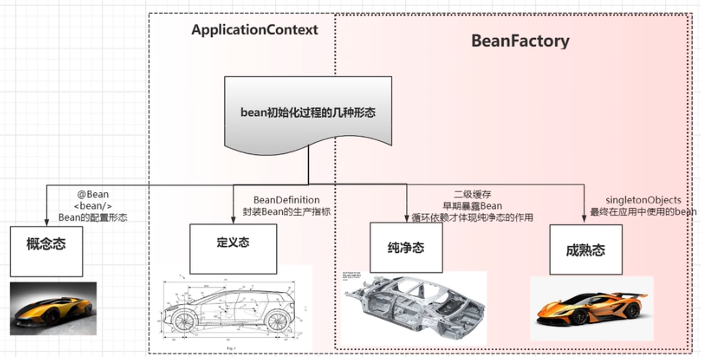
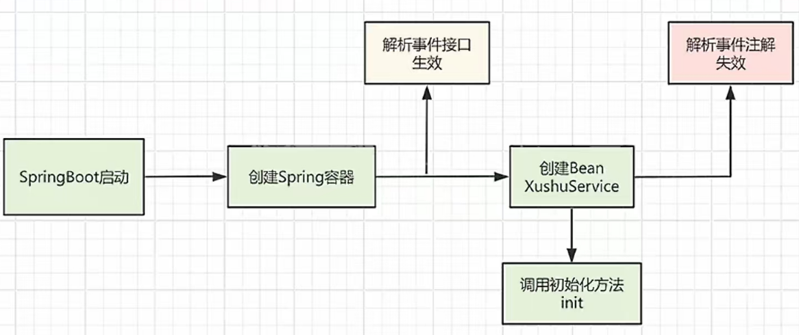

谈谈你对Spring的理解？

‌Spring是一个轻量级的Java EE应用程序框架，由Rod Johnson发起。它旨在简化企业级应用的开发难度和周期，通过提供控制反转（IoC）和面向切面编程（AOP）等核心机制，Spring解决了传统J2EE开发中的许多常见问题‌‌

**Spring的核心思想**

1.  ‌**解耦与模块化**‌：通过IoC容器和AOP，Spring将组件与业务逻辑分离，提高了代码的可复用性和维护性。每个模块专注于解决特定的问题，如资源管理、事务控制或安全验证‌。
2.  ‌**高度灵活**‌：Spring提供了丰富的模块和工具，支持从依赖注入到事务管理、数据访问等全面功能。开发者可以根据需要选择使用特定的模块，而无需修改核心代码‌。
3.  ‌**开发者体验**‌：Spring的设计哲学是以开发者体验为中心，提供了简洁的API和强大的功能支持，使得开发过程更加高效‌

Spring框架主要由以下几个**核心模块组成**：

1.  ‌**Spring Core**‌：提供了基础的功能支持。
2.  ‌**Spring AOP**‌：支持面向切面编程，用于封装横切关注点，如日志和事务管理。
3.  ‌**Spring ORM**‌：提供了对各种ORM框架的支持。
4.  ‌**Spring DAO**‌：数据访问对象模块，简化了数据库操作。
5.  ‌**Spring Context**‌：提供了框架级的支持，管理bean的生命周期和配置。
6.  ‌**Spring Web**‌：支持创建web应用程序。
7.  ‌**Spring Web MVC**‌：提供了模型-视图-控制器（MVC）模式的实现，简化了web应用的开发‌12。

**Spring 的核心功能**

**IoC（控制反转）**

-   这是 Spring 的灵魂！以前我们自己创建对象、管理依赖，现在交给 Spring 来干。
-   比如你需要一个 `UserService`，以前是你手动 new 出来，现在你只需要告诉 Spring “我要这个东西”，Spring 自动帮你准备好，这就是 IoC 的魔力。

**DI（依赖注入）**

-   DI 是 IoC 的实现方式之一，简单说就是 Spring 帮你把需要的对象“塞”到你的类里。
-   比如你有个 `UserServiceImpl` 需要用到 `UserDao`，你不用自己 new，只要在代码里声明一下，Spring 会自动帮你注入好。

**AOP（面向切面编程）**

-   AOP 让我们可以把一些通用的功能（比如日志记录、权限校验、事务管理）抽出来，集中处理，而不用在每个地方重复写代码。
-   比如你想给某个方法加日志，不用修改原有代码，直接通过 AOP 配置就能搞定。


**Spring MVC**

-   这是用来开发 Web 应用的模块，它把请求、控制器、视图这些都分得很清楚，让代码结构更清晰。
-   比如用户访问 `/user/login`，Spring MVC 会自动找到对应的控制器方法，并返回结果。


**Spring 的优点**

-   **解耦**：通过 IoC 和 DI，减少了类之间的依赖关系，代码更容易维护。
-   **灵活**：Spring 提供了很多扩展点，可以根据需求定制功能。
-   **生态丰富**：除了核心功能，Spring 还有 Spring Boot、Spring Cloud 等子项目，覆盖了从单体应用到微服务架构的各种场景。


**Spring Boot 是啥？**

Spring Boot 是 Spring 的一个“升级版”，它让开发变得更简单。以前用 Spring 配置一堆 XML 文件很麻烦，Spring Boot 直接用注解和默认配置代替了，开箱即用。

举个例子，以前你要配 Tomcat、数据源、Spring 容器等等，现在只需要加一个 `@SpringBootApplication` 注解，运行 `main` 方法，应用就启动了！


## 看过源码吗？说说Spring由哪些重要的模块组成？


## Spring中的BeanFactory是什么？


## Spring中的FactoryBean是什么？


## Spring中的ObjectFactory是什么？


## Spring中的ApplicationContext是什么？


## ApplicationContext的实现类有哪些？


## BeanFactory 和 ApplicationContext的区别？

**口语化表达**

BeanFactory 和 ApplicationContext 都是用于管理和获取Bean的容器接口。

BeanFactory功能相对简单。提供了Bean的创建、获取和管理功能。默认采用延迟初始化，只有在第一次访问Bean时才会创建该Bean。因为功能较为基础，BeanFactory通常用于资源受限的环境中，比如移动设备或嵌入式设备。

ApplicationContext是BeanFactory的子接口，提供了更丰富的功能和更多的企业级特性。默认会在启动时创建并初始化所有单例Bean，支持自动装配Bean，可以根据配置自动注入依赖对象。有多种实现，如ClassPathXmlApplicationContext、FileSystemXmlApplicationContext、AnnotationConfigApplicationContext等。


**BeanFactory** 

BeanFactory是Spring框架的核心接口之一，负责管理和配置应用程序中的Bean。它提供了基本的Bean容器功能，但功能相对简单。

-   **基本功能**：BeanFactory提供了Bean的创建、获取和管理功能。它是Spring IoC容器的最基本接口。

-   **延迟加载**：BeanFactory默认采用延迟初始化（lazy loading），即只有在第一次访问Bean时才会创建该Bean。这有助于提升启动性能

-   **轻量级**：因为功能较为基础，BeanFactory通常用于资源受限的环境中，比如移动设备或嵌入式设备

**ApplicationContext**

ApplicationContext默认会在启动时创建并初始化所有单例Bean（除非显式配置为延迟初始化）。这有助于在应用启动时尽早发现配置问题。

-   **增强功能**：ApplicationContext是BeanFactory的子接口，提供了更丰富的功能和更多的**企业级特性**。
    -   不仅提供了BeanFactory的所有功能，还提供了更多高级特性，如事件发布、国际化、AOP、自动Bean装配等。

-   **自动刷新**：支持自动刷新配置文件，例如当使用 XML 配置文件时，可以在不重启应用的情况下更新配置。

-   **事件传播**：支持发布/订阅事件机制，允许组件之间进行解耦通信。

-   **国际化支持**：内置对国际化（i18n）的支持，可以轻松实现多语言应用。

**AOP 支持**：支持面向切面编程（AOP），可以方便地添加横切关注点（如日志、事务管理等）。

-   **资源访问**：简化了对各种资源（如文件、URL 等）的访问。

-   **依赖注入**：支持更复杂的依赖注入方式，如构造器注入、Setter 注入、字段注入等

-   **自动装配**：ApplicationContext支持自动装配Bean，可以根据配置自动注入依赖对象。


**启动时间和内存占用**

-   **BeanFactory**
    -   启动快：由于其轻量级特性，启动速度较快，占用的内存也较少。
    -   适合简单场景：适用于简单的应用程序或嵌入式系统。

-   **ApplicationContext**

    -   启动慢：因为加载了更多的功能模块，启动时间相对较长，内存占用也较大。

    -   适合复杂场景：适用于大型企业级应用，能够更好地处理复杂的业务需求。

**Bean 生命周期管理**

-   **BeanFactory**
    -   **手动管理**：需要显式调用 `getBean()` 方法来获取 Bean 实例，并且 Bean 的生命周期管理相对简单。

-   **ApplicationContext**
    -   **自动管理**：不仅支持 `getBean()` 方法，还可以自动管理 Bean 的生命周期，包括初始化后回调（`InitializingBean` 接口）、销毁前回调（`DisposableBean` 接口）等。

**具体实现类**

-   **BeanFactory**
    -   常见实现类：`DefaultListableBeanFactory`、`XmlBeanFactory`（已废弃，推荐使用 `GenericApplicationContext`）

-   **ApplicationContext**
    -   常见实现类：
        -   `ClassPathXmlApplicationContext`：从类路径下的 XML 文件加载配置。
        -   `FileSystemXmlApplicationContext`：从文件系统中的 XML 文件加载配置。
        -   `AnnotationConfigApplicationContext`：基于注解配置的上下文。
        -   `WebApplicationContext`：用于 Web 应用程序，通常由 ContextLoaderListener 初始化。


| 特性           | BeanFactory                                                  | ApplicationContext                                           |
| -------------- | ------------------------------------------------------------ | ------------------------------------------------------------ |
| 功能丰富度     | 基本功能（Bean的创建、获取和管理功能）                       | 增强功能（事件、国际化、AOP 等）                             |
| 启动时间和内存 | 启动快，内存占用少                                           | 启动慢，内存占用大                                           |
| Bean 生命周期  | 手动管理（显式调用 `getBean()` 方法）                        | 自动管理                                                     |
| 适用场景       | 资源受限环境、简单应用                                       | 大型企业级应用、复杂业务需求                                 |
| 实现类         | `DefaultListableBeanFactory`、<br/>`XmlBeanFactory`（已废弃，推荐使用 `GenericApplicationContext`） | `ClassPathXmlApplicationContext`、<br/>`AnnotationConfigApplicationContext` |

**选择建议**

-   如果你只需要基本的 IoC 容器功能，并且希望保持轻量级和快速启动，可以选择 BeanFactory。
-   如果你需要更多高级特性（如事件传播、国际化、AOP 等），并且不介意稍微增加启动时间和内存占用，那么 ApplicationContext 是更好的选择。


## BeanFactory 和 FactoryBean 的区别？

BeanFactory是一个工厂，也就是一个容器，是用来管理和生成Bean的；

FactoryBean是一个bean，但它是一个特殊的bean，所以也是由BeanFactory所管理的，不过FactoryBean不是一个普通的Bean，他会表现出工厂模式的样子，是一个能产生或者修饰对象生成的工厂Bean，里面的`getObject()`就是用来获取FactoryBean产生的对象。所以在BeanFactory中使用 "&" 来得到FactoryBean本身，用来区分通过容器获取FactoryBean产生的对象还是获取FactoryBean本身。

**BeanFactory**

-   定义：BeanFactory 是 Spring 中最基本的 IoC 容器接口，用于管理 Bean 的生命周期和依赖注入。
-   作用：它负责根据配置（如 XML、注解或 Java 配置类）创建和管理 Bean 实例，并提供获取这些 Bean 的方法（如 getBean()）。

-   适用场景：适用于需要基本的 IoC 容器功能的应用程序，特别是资源受限的环境（如 Applet 或移动设备）。它提供了轻量级的 Bean 管理功能。
-   接口主要方法
    -   `Object getBean(String name)`：根据名称获取 Bean 实例。
    -   `Object getBean(String name, Class<T> requiredType)`：根据名称和类型获取 Bean 实例。
    -   `boolean containsBean(String name)`：检查容器中是否存在指定名称的 Bean。
    -   `String[] getBeanDefinitionNames()`：获取所有已注册的 Bean 名称。
-   BeanFactory
    可以通过 XML 配置文件、注解或 Java 配置类来配置和管理 Bean。
    FactoryBean
    通常在 XML 配置文件或 Java 配置类中声明为普通的 Bean，Spring 容器会自动识别并调用其 getObject() 方法来创建实际的 Bean。

**FactoryBean**

-   定义：FactoryBean 是一个特殊的接口，允许开发者自定义 Bean 的创建逻辑。它不是容器本身，而是一个由容器管理的 Bean，通过实现特定的方法来生成其他对象。
-   作用：主要用于在容器中创建复杂的对象或需要特殊初始化逻辑的对象。它可以通过 `getObject()` 方法返回最终的 Bean 实例。
-   适用场景：当你需要更灵活地控制 Bean 的创建过程时使用。例如，创建第三方库的对象、处理复杂初始化逻辑、或者需要在运行时动态决定返回哪个对象。
-   接口的方法
    -   `Object getObject()`：返回由 FactoryBean 创建的对象实例。
    -   `Class<?> getObjectType()`：返回 getObject() 方法返回的对象类型。
    -   `boolean isSingleton()`：指示 FactoryBean 创建的对象是否为单例。


使用 BeanFactory

```java
import org.springframework.context.ApplicationContext;
import org.springframework.context.support.ClassPathXmlApplicationContext;

public class BeanFactoryExample {
    public static void main(String[] args) {
        ApplicationContext context = new ClassPathXmlApplicationContext("beans.xml");
        MyService myService = (MyService) context.getBean("myService");
        myService.doSomething();
    }
}
```

使用 FactoryBean

```java
import org.springframework.beans.factory.FactoryBean;
import org.springframework.stereotype.Component;

@Component
public class MyServiceFactoryBean implements FactoryBean<MyService> {

    @Override
    public MyService getObject() throws Exception {
        // 自定义创建逻辑
        return new MyServiceImpl();
    }

    @Override
    public Class<?> getObjectType() {
        return MyService.class;
    }

    @Override
    public boolean isSingleton() {
        return true; // 返回的对象是单例
    }
}
```

总结表格

| 特性     | BeanFactory                  | FactoryBean                                 |
| -------- | ---------------------------- | ------------------------------------------- |
| 定义     | 基本的 IoC 容器接口          | 允许自定义 Bean 创建逻辑的接口              |
| 作用     | 管理 Bean 生命周期和依赖注入 | 创建复杂的对象或需要特殊初始化逻辑的对象    |
| 适用场景 | 资源受限环境、简单应用       | 需要灵活控制 Bean 创建过程的场景            |
| 主要方法 | getBean()、containsBean() 等 | getObject()、getObjectType()、isSingleton() |
| 配置方式 | XML、注解、Java 配置类       | 在 XML 或 Java 配置类中声明为普通 Bean      |

**总结**

-   如果你需要更灵活地控制 Bean 的创建过程，特别是当 Bean 的创建逻辑较为复杂时，可以选择实现 `FactoryBean` 接口


## 什么是BeanDefinition ？ 

`BeanDefinition` 是 Spring 框架中的一个核心接口，用于描述和定义一个 Spring Bean 的元信息

它主要包含了以下内容：

-   **类信息**：Bean 所对应的类。
-   **作用域**：如单例（singleton）或原型（prototype）等。
-   **构造函数参数**：如果需要通过构造函数注入依赖。
-   **属性值**：通过 setter 方法注入的属性值。
-   **初始化方法** 和 **销毁方法**：定义 Bean 生命周期中的回调方法。
-   **其他配置**：如是否是抽象 Bean、是否延迟加载等

在 Spring 容器启动时，在解析配置（如 XML、Java 配置类、注解等）后，Spring 会将每个 Bean 的定义信息（如类名、依赖关系、作用域等）注册到 `BeanDefinitionRegistry` 中（实际是存储在beanDefinitionMap）。这是容器内部的一个注册表，用于存储所有 Bean 的定义信息


## 如何在所有BeanDefinition 注册完以后做扩展？

可以通过实现`BeanFactoryPostProcessor` 接口重写抽象方法，修改Bean的元数据信息

```java
@Component
public class CustomBeanFactoryPostProcessor implements BeanFactoryPostProcessor {

    @Override
    public void postProcessBeanFactory(ConfigurableListableBeanFactory beanFactory) throws BeansException {
        // 在这里可以访问所有的 BeanDefinition，并进行扩展或修改
        String[] beanNames = beanFactory.getBeanDefinitionNames();
        for (String beanName : beanNames) {
            BeanDefinition beanDefinition = beanFactory.getBeanDefinition(beanName);
            // 对 BeanDefinition 进行自定义处理
            System.out.println("Bean Name: " + beanName + ", Class: " + beanDefinition.getBeanClassName());
        }
    }
}
```


## Bean标签的（常用）属性？

bean 是最长使用的标签，如果是使用 xml 形式。最常见的基本属性就是 id，name，class。分别标识唯一的 bean，bean 的别名和实际要注入的类。也可以通过一些属性实现，bean 初始化时候的操作，比如init-method，配置的方法，可以在 bean 初始化的时候，进行执行。bean 还有常见的构造函数注入标签，注入 bean 中的属性。

**id**

Bean 的唯一标识符。

作用：用于引用该 Bean。

```xml
<bean id="myService" class="com.example.MyService"/>
```

**name**

Bean 的名称（别名），可以有多个，用逗号、空格或分号分隔。

作用：类似于 id，但可以有多个名称。

```xml
<bean id="myService" name="service1, service2" class="com.example.MyService"/>
```

**class**

Bean 所对应的类的全限定名。

作用：指定要实例化的类。

```xml
<bean id="myService" class="com.example.MyService"/>
```

**scope**

定义 Bean 的作用域。

常见取值：

-   singleton（默认）：单例模式，整个应用中只有一个实例。
-   prototype：每次请求都会创建一个新的实例。
-   request：每个 HTTP 请求创建一个新的实例（仅限 Web 应用）。
-   session：每个 HTTP 会话创建一个新的实例（仅限 Web 应用）。
-   application：每个 ServletContext 创建一个新的实例（仅限 Web 应用）。

```xml
<bean id="myService" class="com.example.MyService" scope="prototype"/>
```

**init-method**

指定初始化方法，在 Bean 实例化后调用。

作用：用于执行一些初始化逻辑。

```xml
<bean id="myService" class="com.example.MyService" init-method="init"/>
```

**destroy-method**

指定销毁方法，在容器关闭时调用。

作用：用于执行一些清理逻辑。

```xml
<bean id="myService" class="com.example.MyService" destroy-method="clearup"/>
```

**factory-bean 和 factory-method**

factory-bean：指定用于创建Bean实例的工厂Bean的 ID。

factory-method：指定用于创建Bean实例的静态工厂方法

作用：用于通过工厂方法创建 Bean。

```xml
<bean id="myFactory" class="com.example.MyFactory"/>
<bean id="myService" factory-bean="myFactory" factory-method="createService"/>
```

**autowire**

自动装配依赖关系的方式。

取值：

-   no（默认）：不进行自动装配。
-   byName：根据属性名称自动装配。
-   byType：根据属性类型自动装配。
-   constructor：通过构造函数参数类型自动装配。
-   autodetect：先尝试通过构造函数自动装配，如果不行则按 byType 自动装配。

```xml
<bean id="myService" class="com.example.MyService" autowire="byType"/>
```

**depends-on**

指定该 Bean 依赖的其他 Bean，确保这些 Bean 在当前 Bean 初始化之前被初始化。

作用：用于强制依赖顺序。

```xml
<bean id="myService" class="com.example.MyService" depends-on="dataSource"/>
```

**lazy-init**

是否延迟初始化。

取值：

-   true：延迟初始化，直到第一次使用时才创建实例。
-   false（默认）：立即初始化。

```xml
<bean id="myService" class="com.example.MyService" lazy-init="true"/>
```

**primary**

当自动装配时，如果有多个候选Bean，可以将某个Bean标记为主要候选者。

```xml
<bean id="myService" class="com.example.MyService" primary="true"/>
```

**bean标签子元素constructor-arg**

用于通过构造函数注入依赖。

作用：指定构造函数的参数值，支持按索引、类型或名称注入。

常见属性：

-   index：参数的索引位置（从 0 开始）。
-   type：参数的类型。
-   name：参数的名称（如果构造函数参数有名称）。
-   value：直接赋值。
-   ref：引用其他 Bean。

```xml
<bean id="myService" class="com.example.MyService">
    <constructor-arg index="0" value="someValue"/>
    <constructor-arg index="1" ref="myRepository"/>
</bean>
```

**bean标签子元素property**

用于通过设值方法（Setter 方法）注入依赖。

作用：为 Bean 的属性赋值，支持直接赋值或引用其他 Bean。

常见属性：

-   name：属性的名称。
-   value：直接赋值。
-   ref：引用其他 Bean。

```xml
<bean id="myService" class="com.example.MyService">
    <property name="repository" ref="myRepository"/>
    <property name="timeout" value="3000"/>
</bean>
```

**p命名空间**

描述：简化属性注入的 XML 配置。

作用：使用 `p: `命名空间可以简化 `<property>` 元素的配置。

```xml
<bean id="myService" class="com.example.MyService" p:repository-ref="myRepository" p:timeout="3000"/>
```

**c命名空间**

描述：简化构造函数注入的 XML 配置。

作用：使用 `c:` 命名空间可以简化 `<constructor-arg>` 元素的配置。

```xml
<bean id="myService" class="com.example.MyService" c:_0="someValue" c:_1-ref="myRepository"/>
```


## Bean的作用范围（域）和生命周期？:star:

**Bean 的作用范围**

Bean 的作用范围（域）主要有以下几种：

-   **singleton**：默认的作用域，整个应用中只有一个实例。
-   **prototype**：每次请求都会创建一个新的实例。
-   request：每个 HTTP 请求创建一个新的实例（仅限 Web 应用）。
-   session：每个 HTTP 会话创建一个新的实例（仅限 Web 应用）。
-   application：每个 ServletContext 创建一个新的实例（仅限 Web 应用）。
-   globalSession：用于 Portlet 应用中的全局会话（较少使用）。

常用的是 **singleton** 和 **prototype**。singleton 是单例的，当 Bean 是无状态的时候，singleton 是最好的选择。如果 Bean 涉及共享数据或有状态信息，singleton 可能不够安全，这时应该使用 prototype 来确保每个请求都有独立的实例。

**Bean 的生命周期**

Bean 的生命周期是指bean从创建到销毁的过程，总体上分为4大步，**实例化、属性赋值、初始化、销毁**：

-   1、**实例化**：Spring 容器根据配置创建 Bean 实例。
    -   通过反射去推断构造器进行实例化
    -   实例工厂、静态工厂
-   2、**属性设置**：为 Bean 设置属性值，包括依赖注入。
    -   解析自动装配（DI的体现）
    -   循环依赖（Spring底层已经处理了）
-   3、**初始化**：调用初始化方法（如果有），例如通过 **init-method** 属性指定的方法，或者实现 **InitializingBean** 接口的 **afterPropertiesSet** 方法。
    -   调用xxxAware相关接口回调
    -   调用初始化生命周期回调（三种）
    -   如果bean实现了AOP，还会创建动态代理
-   4、**可用**：Bean 已经完全初始化，可以被应用程序使用。
-   5、**销毁**：当容器关闭时，调用销毁方法（如果有），例如通过 **destroy-method** 属性指定的方法，或者实现 **DisposableBean** 接口的 **destroy** 方法。
    -   调用初始化生命周期回调


### Bean的作用范围（Scope）

**singleton**

-   在整个应用程序上下文中，只有一个Bean实例，所有对该Bean的引用都指向同一个实例
-   这个实例在容器启动时创建，并且在整个上下文生命周期中一直存在。
-   默认情况下，所有的Spring Beans都是单例的（**默认作用范围**）
-   适用于**无状态**的Bean。

```xml
<bean id="myBean" class="com.example.MyBean" scope="singleton"/>
```

**prototype：**

-   每次请求该Bean时都会创建一个新的实例。这种模式适合那些需要为每个客户端请求创建新对象的情况。
-   适用于有状态的Bean。

```xml
<bean id="myBean" class="com.example.MyBean" scope="prototype"/>
```

**Request**

-   在Web环境中，为每一个HTTP**请求**创建一个新的Bean实例。
    -   仅适用于Web应用
-   这个Bean的生命周期与一个HTTP请求的生命周期相同。

```xml
<bean id="myBean" class="com.example.MyBean" scope="request"/>
```

**Session**

-   在Web环境中，为每一个用户**会话**创建一个新的Bean实例。
    -   仅适用于Web应用
-   这个Bean的生命周期与用户的会话生命周期相同。

```xml
<bean id="myBean" class="com.example.MyBean" scope="session"/>
```

**globalSession**

-   类似于Session作用域，每个全局HTTP会话都会创建一个新的实例
    -   但是用于portlet环境。
-   在portlet环境中，全局会话可以在portlet之间共享。

```xml
<bean id="myBean" class="com.example.MyBean" scope="globalSession"/>
```

**application**

-   每个ServletContext会创建一个新的实例，适用于Web应用

```xml
<bean id="myBean" class="com.example.MyBean" scope="application"/>
```

### Bean的生命周期（Lifecycle）

Bean的生命周期是指从Bean实例从被创建开始，直到它被销毁为止的整个过程。

Spring允许开发者通过不同的方法来控制这个过程


1、**实例化（Instantiation）**

-   Spring通过**反射**机制创建Bean的实例，但此时还没有进行任何的依赖注入（属性设置）

>   补充：Bean通过构造器、静态工厂方法或者实例工厂方法被创建出来。

2、**属性设置|赋值（Property Population）**

-   在Bean实例化之后，Spring容器会设置Bean的属性值
-   会解析自动装配（DI的体现）。即 如果Bean有@Autowrited、@Value等注解设置的属性，这一步将进行相关依赖的注入
-   会处理循环依赖问题

3、**初始化（Initialization）**

**调用Aware接口的回调方法**

-   如果Bean实现了`BeanNameAware`、`BeanFactoryAware`、`ApplicationContextAware`等接口，Spring将回调这些接口的方法，把相关信息传递给Bean。

这里列举一下这些Aware接口：

1）BeanNameAware——invokeAwareMethods

2）BeanClassLoaderAware——setBeanClassLoader

3）BeanFactoryAware——setBeanFactory

**BeanPostProcess 前置处理**

-   在依赖注入和Aware回调之后，Spring容器会调用所有`BeanPostProcessor`的postProcessBeforeInitialization（前置处理方法），对Bean进行进一步的处理

Bean实例化并且其属性被设置后，可以调用**初始化方法**进行额外的设置。

-   初始化方法，也叫**生命周期回调**（如果有的话就调用）
    -   通过`@PostConstruct`注解指定的方法
    -   通过实现`InitializingBean`接口的`afterPropertiesSet()`方法
    -   通过`<bean>`标签的`init-method`属性来指定的方法 或 通过 `@Bean`注解的`initMethod`属性指定的方法

-   如果bean实现了AOP，还会创建动态代理

**BeanPostProcess 后置处理**

-   初始化完成以后，Spring容器会调用所有`BeanPostProcessor`的postProcessAfterInitialization（后置处理方法），对Bean进行进一步的处理

4、**Bean的使用（Usage）**

经过上述一系列的处理后，Bean处于就绪状态，可以被应用程序使用

5、**销毁（Destruction）**

-   当Spring容器关闭时
-   销毁方法，也叫**生命周期回调**（如果有的话就调用）
    -   通过`@PreDestroy`注解指定的方法
    -   通过实现`DisposableBean`接口的`destroy()`方法
    -   通过`<bean>`标签的`destroy-method`属性指定的销毁方法 或 通过 `@Bean`注解的`destoryMethod`属性指定的方法

**容器销毁**

-   最后，Spring容器关闭，Bean生命周期结束


### 生命周期回调接口和注解

如下是比较常用的生命周期回调接口

**InitializingBean接口**

方法：afterPropertiesSet()

```java
public class MyBean implements InitializingBean {
    @Override
    public void afterPropertiesSet() throws Exception {
        // 初始化逻辑
    }
}
```

**DisposableBean接口**

方法：destroy()

```java
public class MyBean implements DisposableBean {
    @Override
    public void destroy() throws Exception {
        // 销毁逻辑
    }
}
```

**@PostConstruct注解**

用于标注初始化方法。

```java
public class MyBean {
    @PostConstruct
    public void init() {
        // 初始化逻辑
    }
}
```

**@PreDestroy注解**

用于标注销毁方法。

```java
public class MyBean {
    @PreDestroy
    public void cleanup() {
        // 销毁逻辑
    }
}
```


## 单例bean的优势？

在Spring中，默认情况下，Bean 是以单例（Singleton）模式创建的。这种设计带来了以下显著优势

 **资源利用率高**

-   单例 Bean 在整个应用生命周期中只会被实例化一次，减少了对象创建和销毁的开销。
-   对于那些不需要频繁创建或销毁的对象（如服务层、工具类等），使用单例模式可以显著节省内存和 CPU 资源。

**线程安全（前提：无状态bean）**

-   如果单例 Bean 是无状态的（即不包含可变的状态信息），它可以在多线程环境中安全地共享。
-   例如，Spring 中的服务层 Bean 通常是无状态的，只负责业务逻辑处理，因此可以安全地被多个请求复用。

**全局唯一性**

-   单例 Bean 在整个应用上下文中是唯一的，这使得它非常适合用于管理全局状态或提供全局访问点。
-   例如，配置管理器、日志记录器、数据库连接池等组件通常以单例形式存在。

**简化依赖注入**

-   单例 Bean 的唯一性使得依赖注入更加简单。当一个 Bean 需要依赖另一个 Bean 时，Spring 容器可以直接复用已有的单例实例，而无需重新创建。
-   这种机制提高了开发效率，并减少了代码复杂度。

**易于缓存和共享数据**

-   单例 Bean 可以用来缓存一些全局共享的数据，避免重复计算或加载。
-   例如，缓存配置文件内容、字典数据等。

**性能优化**

-   单例模式减少了对象的创建次数，从而降低了垃圾回收（GC）的压力。
-   对于高频调用的 Bean，单例模式可以显著提升应用性能。

**便于管理生命周期**

-   单例 Bean 的生命周期由 Spring 容器完全管理，包括初始化、销毁等阶段。
-   我们可以通过定义 `@PostConstruct` 和 `@PreDestroy` 方法等来控制 Bean 的生命周期行为。


**注意事项**

尽管单例 Bean 有诸多优势，但在使用时需要注意以下几点：

1.  **线程安全性**：如果单例 Bean 包含可变状态，需要确保其线程安全。
2.  **过度共享问题**：单例 Bean 不适合用于存储用户会话相关的数据，因为这些数据可能会被多个用户共享。
3.  **依赖关系复杂化**：过多的单例 Bean 可能会导致复杂的依赖关系，增加维护难度。


## Spring的单例bean是线程安全的吗？

存在并发安全问题

在Spring中，默认情况下，Bean 是以单例（Singleton）模式创建的。因此同一个bean的实例会在整个应用程序中被多个线程共享。

在多线程环境中，**如果bean中包含全局可变状态（如实例变量或非线程安全资源），则可能会引发线程安全问题**


>   其实这个问题本质上是考察并发环境下对共享资源的操作
>
>   单例bean其实就是某个类的对象，因此单例bean是否线程安全就转变为了类是否线程安全
>
>   类是否线程安全，取决于你代码是怎么写的。即属性、方法是怎么写的。
>
>   单例bean可能会被多个线程访问，类中的方法可以被多个线程同时访问，方法有没有进行锁的控制？会不会有些共享资源在方法中进行读写呢？这都是你编写代码所需要考虑的事情，与spring无关。
>
>   所以问题就转变为了如何保证方法的线程安全了，与spring无关。


**解决方案**

-   避免在单例bean中使用可变状态：确保单例bean是无状态的或适用线程安全的数据结构

-   将单例bean中可能需要操作读写的实例变量放在方法局部中（这也是无状态的处理方案）

如果变量一定要定义为实例变量，可采用以下方式

-   使用@Scope注解，将bean设置为多例。即创建多个对象，但这种方式比较浪费内存
-   使用ThreadLocal包裹成员变量，ThreadLocal会为每一个线程提供一个独立的变量副本，从而隔离了多个线程对数据的访问冲突。
-   在需要操作共享资源的方法上加上同步锁，但是会降低服务器吞吐量 


**Spring如何处理线程并发问题?**

spring一般是使用ThreadLocal进行处理，解决线程安全问题。

ThreadLocal和线程同步机制都是为了解决多线程中相同变量的访问冲突问题。

同步机制采用了“时间换空间”的方式，仅提供一份变量，不同的线程获取锁，没获得锁的线程则需要排队。

而ThreadLocal采用了“空间换时间”的方式。ThreadLocal会为每一个线程提供一个独立的变量副本，从而隔离了多个线程对数据的访问冲突。因为每一个线程都拥有自己的变量副本，所以没有相同变量的访问冲突问题。所以在编写多线程代码时，可以把不安全的变量封装进ThreadLocal。

  

## Spring实例化Bean有几种方式？

口语化

实例化 bean 的方式，主要有构造器实例化、bean注解实例化（如@Component）、不常用的用静态工厂和实例工厂实例化。

构造器实例化主要是通过调用类的构造器来实例化 Bean，构造器可以是无参构造器，也可以是有参构造器，配合 bean 标签的 xml 配置形式，放入容器中。

bean注解的方式就更加常用，尤其是现在都是 springboot 的形式，一个注解就可以放入容器中。

以上。


**通过构造器实例化**

这是最常见的方式之一，Spring 可以通过调用类的构造器来实例化 Bean。构造器可以是无参构造器，也可以是有参构造器。

-   无参构造器

```xml
public class MyBean {
    public MyBean() {
        // 无参构造器
    }
}
```

配置方式：

```xml
<bean id="myBean" class="com.example.MyBean"/>
```

-   有参构造器

```java
public class MyBean {
    private String name;

    public MyBean(String name) {
        this.name = name;
    }
}
```

配置方式：

```xml
<bean id="myBean" class="com.example.MyBean">
    <constructor-arg value="exampleName"/>
</bean>
```


**通过静态工厂方法实例化**

Spring 可以通过调用静态工厂方法来实例化 Bean。这种方式适用于需要复杂初始化逻辑的情况

```java
public class MyBeanFactory {
    public static MyBean createInstance(String name) { // 注意方法是静态的
        return new MyBean(name);
    }
}
```

配置方式：

```xml
<bean id="myBean" class="com.example.MyBeanFactory" factory-method="createInstance">
    <constructor-arg value="exampleName"/>
</bean>
```


**通过实例工厂方法实例化**

这种方式类似于静态工厂方法，不同之处在于实例工厂方法需要先实例化工厂类，然后调用工厂类的实例方法来创建 Bean。

```java
public class MyBeanFactory {
    public MyBean createInstance(String name) {
        return new MyBean(name);
    }
}
```

配置方式：

```xml
<bean id="myBeanFactory" class="com.example.MyBeanFactory"/>
<bean id="myBean" factory-bean="myBeanFactory" factory-method="createInstance">
    <constructor-arg value="exampleName"/>
</bean>
```


**通过 FactoryBean 接口实例化**

Spring 提供了一个FactoryBean接口，允许开发者定制 Bean 的创建逻辑。实现FactoryBean接口的类可以被用作工厂来生成其他 Bean

```java
public class MyFactoryBean implements FactoryBean<MyBean> {
    private String name;

    public void setName(String name) {
        this.name = name;
    }

    @Override
    public MyBean getObject() throws Exception {
        return new MyBean(name);
    }

    @Override
    public Class<?> getObjectType() {
        return MyBean.class;
    }

    @Override
    public boolean isSingleton() {
        return true;
    }
}
```

配置方式：

```xml
<bean id="myFactoryBean" class="com.example.MyFactoryBean">
    <property name="name" value="exampleName"/>
</bean>
<bean id="myBean" factory-bean="myFactoryBean" factory-method="getObject"/>
```


**通过 @Bean 注解实例化**

使用@Bean注解的方法可以用来实例化和配置 Bean。这种方式更加直观和灵活

```java
@Configuration
public class AppConfig {
    @Bean
    public MyBean myBean() {
        return new MyBean("exampleName");
    }
}
```

>   @Bean注解的底层就是通过实例工厂方法实例化。
>
>   不管是factory-bean还是factory-method，它们最终都会将定义的信息注册为BeanDefinition。
>
>   当使用@Bean注解时，会将生成@Bean方法的配置类读取到 `factoryBeanName` 中，`factoryMethodName`就是通过@Bean注解修饰的那个方法名。
>
>   补充：关于 `factoryBeanName`、`factoryMethodName`可以在 `AbstractBeanDefinition`类中找到


**通过 @Component 注解实例化**

使用@Component注解可以将类标记为 Spring 管理的 Bean。结合@ComponentScan注解，Spring 会自动扫描并实例化这些类。

```java
@Component
public class MyBean {
    // Bean 定义
}
```

配置方式：

```java
@Configuration
@ComponentScan(basePackages = "com.example")
public class AppConfig {
    // 配置类
}
```


## 如何控制Spring Bean的创建顺序？

需求：我们有serviceA、serviceB，希望在serviceA中拿到serviceB的名称，但是这个名称是在serviceB创建完在初始化完成后才赋值的。现在需要在serviceA中获取的serviceB的name，因为serviceA可能会在serviceB之前创建，serviceB还没创建，此时拿到的name为null。这种场景下就要去控制Bean的创建顺序

如下：

```java
@Component
public class ServiceA {
    private String name;
    
    @PostConstruct
    public void init() {
        name = ServiceB.getName();
        // 拿到这个name去做后续的事情
        Sysytem.out.println("----" + name);
    }
}
```

```java
@Component
public class ServiceB {
    private String name;
    
    @PostConstruct
    public void init() {
        name = "BBB";
    }
    public static String getName(){ return name }
}
```

现在，需要serviceA在serviceB创建之后在创建，因此存在依赖关系，有两种常见方式：

-   在serviceA的类上使用注解`@DependsOn`

```java
@Component
@DependsOn("servieB")
public class ServiceA {
```

这种方式，可以确保创建serviceA时，serviceB已经被创建

但是这种方式只适用于一对一的情况

-   `BeanDefinitionRegisterPostProcessor`接口的**postProcessBeanDefinitionRegisty**钩子方法
    -   在spring中，对象的创建都是基于`beanDefinitionMap`的，这个Map中元素是顺序决定了Bean创建的顺序，因此可以手动控制ServiceA、ServiceB放入到Map中的顺序

```java
@Component
public class ServiceOrderConfig implements BeanDefinitionRegistryPostProcessor, PriorityOrdered {

    @Override
    public void postProcessBeanDefinitionRegistry(BeanDefinitionRegistry registry) {
        // 首先注册 ServiceB
        GenericBeanDefinition serviceBDefinition = new GenericBeanDefinition();
        serviceBDefinition.setBeanClass(ServiceB.class);
        registry.registerBeanDefinition("serviceB", serviceBDefinition);

        // 然后注册 ServiceA，并注入 ServiceB
        BeanDefinitionBuilder serviceABuilder = BeanDefinitionBuilder.genericBeanDefinition(ServiceA.class);
        serviceABuilder.addConstructorArgReference("serviceB");
        BeanDefinition serviceADefinition = serviceABuilder.getBeanDefinition();
        registry.registerBeanDefinition("serviceA", serviceADefinition);
    }

    @Override
    public void postProcessBeanFactory(ConfigurableListableBeanFactory beanFactory) {
        // 不需要实现
    }

    @Override
    public int getOrder() {
        // 设置优先级，确保该处理器尽早执行
        return Ordered.HIGHEST_PRECEDENCE;
    }
}
```


## Spring循环依赖问题是什么？（什么是循环依赖？）:star:

Spring循环依赖问题是指在Spring容器中，两个或多个Bean之间存在直接的或间接的依赖关系，导致在创建和初始化这些Bean时形成了一个**闭环**，使得无法正确地创建和初始化这些Bean。

主要有两种形式：

-   **构造器循环依赖**：这种循环依赖发生在Bean之间的构造器相互引用
-   **setter 方式的循环依赖**：这种循环依赖发生在Bean实例化后进行依赖注入的过程中

构造器循环依赖主要是 Bean A的构造器需要Bean B作为参数，而Bean B的构造器又需要Bean A作为参数。由于构造器是在Bean实例化时调用的，所以Spring容器无法先创建其中一个Bean，因为这样会导致另一个Bean无法实例化，从而形成死循环。

setter 循环依赖发生在Bean的setter注入方法中。与构造器循环依赖不同，setter注入是在Bean实例化之后进行的。如果循环依赖关系复杂或配置不当，也可能导致Spring容器无法正确初始化Bean。

示例：

```java
@Service
public class A{
	@Autowired
    private B b;
}

@Service
public class B{
	@Autowired
    private A a;
}

// 或自己依赖于自己
@Service
public class A{
	@Autowired
    private A a;
}
```

为了解决循环依赖问题，Spring容器采用了**三级缓存机制来处理setter注入的循环依赖**。在Bean实例化过程中，Spring容器会将Bean的实例和ObjectFactory放入不同的缓存中，以便在后续的依赖注入过程中使用。如果Spring容器检测到循环依赖，它会从缓存中获取Bean的实例或ObjectFactory来完成注入，从而解决循环依赖问题。

然而，对于**构造器循环依赖**，**Spring容器无法通过缓存机制来解决**，因为它需要在Bean实例化之前注入依赖。因此，如果应用程序中存在构造器循环依赖，Spring容器将无法正确创建和初始化Bean，并抛出相应的异常。

为了避免循环依赖问题，最佳的做法是重新设计代码结构，确保Bean之间的依赖关系是单向的，并尽量减少Bean之间的直接依赖。这可以通过引入接口、使用依赖注入框架的特定功能（如@Autowired注解的按类型自动装配）、或者利用设计模式（如工厂模式、代理模式等）来实现。


## Spring如何解决循环依赖？

循环依赖问题的解决主要是靠**三级缓存机制**来解决的。

其中一级缓存用于存储完全初始化好的单例 Bean，二级缓存用于存储早期暴露的 Bean 实例，部分初始化的 Bean。三级缓存用于存储 Bean 工厂，主要用于创建 Bean 的代理对象。

假设现在有两个对象 A 依赖 B，B 依赖 A。那么在A创建过程中发现需要属性 B，查找发现 B 还没有在一级缓存中，于是先将 A 放到三级缓存中，此时的 A 不完整，没有属性，但是可以引用。接下来就去实例化B。B 开始创建，此时发现需要A，于是B先查一级缓存寻找A，如果没有，再查二级缓存，如果还没有，再查三级缓存，找到了A，然后把三级缓存里面的这个A放到二级缓存里面，并删除三级缓存里面的A。B顺利初始化完毕，将自己放到一级缓存里面（此时B里面的A依然是创建中的状态）。然后回来接着创建A，此时B已经创建结束，可以直接从一级缓存里面拿到B，这样 A 就完成了创建，并将A放到一级缓存


**循环依赖的两种情况**

1、构造器注入的循环依赖

Spring 无法直接解决通过构造器注入引起的循环依赖，因为在这种情况下，Spring 无法创建任何一个 Bean 实例而不先创建另一个 Bean 实例。这会导致一个无限循环。因此，通常建议避免在构造器注入中引入循环依赖。

```java
public class ClassA {
    private ClassB b;
    public ClassA() {
    }
    public ClassA(ClassB b) {
        this.b = b;
    }
}

public class ClassB {
    private ClassC c;
    public ClassB() {
    }
    public ClassB(ClassC c) {
        this.c = c;
    }
}

public class ClassC {
    private ClassA a;
    public ClassC() {
    }
    public ClassC(ClassA a) {
        this.a = a;
    }
}
```

```xml
<!--声明A-->
<bean id="a" class="com.clear.ClassA">
	<!--构造注入b依赖-->
	<constructor-arg name="b" ref="b"></constructor-arg>
</bean>
<!--声明B-->
<bean id="b" class="com.clear.ClassB">
    <!--构造注入c依赖-->
    <constructor-arg name="c" ref="c"></constructor-arg>
</bean>
<!--声明C-->	
<bean id="c" class="com.clear.ClassC">
    <!--构造注入a依赖-->
    <constructor-arg name="a" ref="a"></constructor-arg>
</bean>
```

2、Setter 注入的循环依赖

对于通过 setter 方法注入引起的循环依赖，Spring 采用三级缓存机制来解决问题

**三级缓存机制**

-   1、**一级缓存（singletonObjects）**：用于存储完全初始化好的单例 Bean。类型：Map<String, Object>
-   2、**二级缓存（earlySingletonObjects）**：用于存储早期暴露的 Bean 实例，部分初始化的 Bean。Map<String, Object>
-   3、**三级缓存（singletonFactories）**：用于存储 Bean 工厂，主要用于创建 Bean 的代理对象。Map<String, ObjectFactory<?>>

**解决循环依赖的过程**

我们拿 A 依赖 B，B 依赖 A 来进行举例

1、在创建 A 对象放入到 spring 容器的过程，先看一级缓存，能否可以直接获取到 A，如果可以，直接获取，如果不可以，则开始创建 A 对象，A创建过程中发现需要属性 B，查找发现 B 还没有在一级缓存中，于是先将 A 放到三级缓存中，此时的 A 不完整，没有属性，但是可以引用。接下来就去实例化B。

2、B 实例化的过程，也是先从一级缓存，看自己有没有，没有的话，开始创建，此时发现需要A，于是B先查一级缓存寻找A，如果没有，再查二级缓存，如果还没有，再查三级缓存，找到了A，然后把三级缓存里面的这个A放到二级缓存里面，并删除三级缓存里面的A。

3、B顺利初始化完毕，将自己放到一级缓存里面（此时B里面的A依然是创建中的状态）。然后回来接着创建A，此时B已经创建结束，可以直接从一级缓存里面拿到B，去完成A的创建，并将A放到一级缓存。

#### 假设我们没有三级缓存，只有一级缓存，那么我们会怎样进行处理呢？

首先A对象进行实例化，A要进行属性填充B。但是B还没有创建，于是开始B进行实例化，同样的B也要进行属性填充，发现他需要A。然而我们的一级缓存的Map里面还没有A，所以他有创建A，于是就产生了死循环。循环往复，最后栈溢出。那么小伙伴们会问，我的A我不进行属性填充，我直接扔一级缓存里面，那不就可以了吗？这样就会造成map里面存的A是个假A，缺胳膊少腿，当你真正用到他的时候，啪一个空指针异常。而且我们的一级缓存规定是完全初始化好的bean。给我们的程序进行使用。那么大家这会都理解了，一级缓存行不通

#### 二级缓存解决了什么问题？

首先我们还是实例化A开始，注意这个地方，我们实例化后，还没有进行属性填充的时候，就把A对象的引用放入到了map2备用。然后进行属性填充，A去填充B，发现B没有实例化，于是B同样实例化后，把自己的半成品放入到map2。B开始进行填充，发现Map1中没有A，又去Map2中进行寻找，发现map2里面有。于是B直接拿到map2中的A使自己变得非常完整。这个时候B就把自己放入Map1。并把Map2的半成品删除了。回到刚才A的阶段，A发现Map1中已经有B了。那么A也就完成了属性的创建。于是双方都完成了自己的创建。这就是二级缓存解决的问题。

#### 不需要三级缓存可以吗？

主要是因为Spring的Aop机制所产生的代理对象问题。首先要了解一个前置就是Spring的代理对象产生阶段是在填充属性后才进行的，原理通过后置处理器BeanPostProcessor来实现。如果说我们用二级缓存来解决，那么就要在属性填充的时候，将代理对象生成好，放入二级缓存。那么就与我们spring的对象生命周期相悖。所以这种方式不好，于是我们引入了三级缓存


## 为什么Spring循环依赖需要三级缓存，二级不够吗？


## Spring一共有几种注入方式？

## **Spring 的属性注入方式有哪几种？**


## 什么是bean装配（注入）？什么是bean的自动装配（自动注入）？

**Bean 装配（注入）** 是指在 Spring 容器中，将依赖的对象（即其他 Bean 或外部资源）注入到目标 Bean 的过程。通过这种方式，Spring 容器可以管理对象之间的依赖关系，从而实现松耦合的设计

**手动装配**：我们需要显式地指定依赖关系。例如：可以通过 XML 配置bean之间的依赖关系。


**Bean 的自动装配（自动注入）** 是指 Spring 容器根据一定的规则，自动将依赖的对象注入到目标 Bean 中的过程。

我们无需手动指定依赖关系，Spring 会根据类型、名称等信息自动完成装配。

主要是通过@Autowired、@Resource实现。

**自动装配的方式：**

-   **基于类型的装配（Type-Based Autowiring）**
    -   Spring 根据依赖的类型找到匹配的 Bean 并进行注入。再根据名称注入。
    -   如果容器中有多个相同类型的 Bean，则会报错（除非使用 `@Qualifier` 指定具体 Bean）。

-   **基于名称的装配（Name-Based Autowiring）**
    -   使用 `@Resource` 注解时，Spring 会根据属性名匹配对应的 Bean。

-   **构造函数注入**
    -   使用 `@Autowired` 注解在构造函数上，Spring 会通过构造函数参数的类型自动装配。

-   **多例装配**
    -   如果存在多个候选 Bean，可以通过 `@Primary` 或 `@Qualifier` 注解指定优先级或具体 Bean。


| 特性             | 手动装配               | 自动装配                |
| :--------------- | :--------------------- | :---------------------- |
| **依赖声明方式** | 显式指定依赖关系       | Spring 自动解析依赖关系 |
| **配置复杂度**   | 配置较为繁琐           | 配置简单，减少冗余代码  |
| **灵活性**       | 更加灵活，适合复杂场景 | 适合简单的依赖关系      |
| **维护成本**     | 维护成本较高           | 维护成本较低            |


## 自动装配（注入）有什么限制或者说注意事项？ 

1、**多例冲突问题**

-   如果容器中有多个相同类型的 Bean，Spring 无法确定应该注入哪个 Bean，如果不手动指定就会报错
-   解决方法：
    -   使用 `@Primary` 注解标记优先级较高的 Bean。
    -   使用 `@Qualifier` 注解指定具体的 Bean 名称

2、**类型不明确时无法注入**

-   如果目标 Bean 的类型在容器中没有匹配的候选 Bean，Spring 会抛出 `NoSuchBeanDefinitionException` 异常。
-   解决方法：
    -   确保容器中存在与目标类型匹配的 Bean。
    -   如果可能不存在 Bean，可以使用 `@Autowired(required = false)` 允许注入失败。

3、**复杂场景下的灵活性不足**

-   在某些复杂的依赖关系中，自动装配可能无法满足需求。
-   示例：
    -   需要根据运行时条件动态选择不同的 Bean。
    -   解决方法：
        -   使用 `@Conditional` 注解根据条件加载 Bean。
        -   使用 `@FactoryBean` 或 `@Bean` 方法手动创建 Bean

4、**性能开销**

-   在大规模应用中，自动装配可能会增加容器初始化的性能开销，尤其是当容器中存在大量 Bean 时。
-   解决方法：
    -   减少不必要的 Bean 定义。
    -   使用懒加载（`@Lazy`）延迟初始化 Bean

5、**想被自动装配的类要声明set方法**

6、**自动装配会被覆盖**

-   可以使用 \<constructor-arg> 和 \<property>配置来定义依赖，这些配置将始终覆盖自动注入

7、**自动装配不能装配简单的属性**

-   如基本数据类型、字符串和类都不能自动装配。（但手动注入可以注入基本数据类型：\<property value=""> 或 @Value）


## Spring自动装配的方式有哪些？

>   在`AutowireCapableBeanFactory`接口中定义了一系列常量，用于定义自动装配的方式


spring中xml配置中有5种自动装配的方式：

-   1）no（默认）：不进行自动装配，需要显式地定义依赖。通过手动设置ref属性来进行装配bean。
    -   @Autowrited来进行手动指定需要自动装配注入的属性（更加人性化，先byType，后byName）

-   2）byName：通过bean名称进行自动装配
    -   注意：这里的名称是set方法的名称，去掉set前缀，然后按照小驼峰。例如setTask，名称就是task

-   3）byType：通过bean类型进行自动装配

-   4）constructor：通过构造器进行自动装配。构造器中参数通过byType进行装配

-   5）autodetect：自动探针，如果有构造器，通过constructor的方式进行自动装配，否则使用byType的方式进行自动装配（Spring3.0已被弃用）


## **Spring使用注解的进行装配的时候，需要什么注解**


## bean的生命周期回调方法和执行顺序？

在 Spring 容器中，Bean 的生命周期由容器管理，从创建到销毁经历了一系列的方法调用。

bean的生命周期方法主要分为两大类，一种是bean初始化时调用的、一种是bean销毁时调用的

**bean初始化时调用的回调**：

-   通过`@PostConstruct`注解指定的方法
-   通过实现`InitializingBean`接口的`afterPropertiesSet()`方法
-   通过`<bean>`标签的`init-method`属性来指定的方法 或 通过 `@Bean`注解的`initMethod`属性指定的方法

**bean销毁时调用的回调**

-   通过`@PreDestroy`注解指定的方法
-   通过实现`DisposableBean`接口的`destroy()`方法
-   通过`<bean>`标签的`destroy-method`属性指定的销毁方法 或 通过 `@Bean`注解的`destoryMethod`属性指定的方法


**执行顺序**

看完如下示例就豁然开朗了

```java
public class UserService implements InitializingBean, DisposableBean {

    @PostConstruct
    public void init1() {
        System.out.println("初始化1");
    }

    @Override
    public void destroy() throws Exception {
        System.out.println("初始化2");
    }

    public void init3() {
        System.out.println("初始化3");
    }

    @PreDestroy
    public void destroy1() {
        System.out.println("销毁1");
    }

    @Override
    public void afterPropertiesSet() throws Exception {
        System.out.println("销毁2");
    }

    public void destroy3() {
        System.out.println("销毁3");
    }
}


@Configuration
public class MainConfig {

    @Bean(initMethod = "init3", destroyMethod = "destroy3")
    public UserService userService() {
        return new UserService();
    }
}


public class DemoApplication {
    public static void main(String[] args) {
        AnnotationConfigApplicationContext applicationContext = new AnnotationConfigApplicationContext(MainConfig.class);
        UserService bean = applicationContext.getBean(UserService.class);
        applicationContext.close();
    }
}
```

输入结果：

```
初始化1
销毁2
初始化3
销毁1
初始化2
销毁3
```


## Spring在加载过程中bean有几种形态？





## 什么是SpringIOC？


## 解释一下Spring的IOC控制反转？

口语化：

控制反转通过将对象的创建和依赖关系的管理交给Spring IoC容器，极大地提高了代码的模块化和可维护性。IoC的主要实现方式是依赖注入，其中通过构造函数注入、Setter方法注入和字段注入等形式来注入，这样 Spring容器能够自动管理对象的依赖关系，使得应用程序代码更加简洁。

>   解题思路：
>
>   ​	主要思路就是聊 ioc 是什么，再说说 di 的形式，最后说一下好处即可


Spring 的 IOC（Inversion of Control，控制反转）是 Spring 框架的核心特性之一，它通过将对象的创建和依赖关系管理交给框架来实现解耦。以下是关于 Spring IOC 的详细解释：

**什么是控制反转（IoC）**

传统应用程序中，对象自己负责管理和创建其依赖的对象。而在使用控制反转后，对象不再直接创建依赖对象，而是由外部容器（如 Spring 容器）负责创建并注入这些依赖。

**IOC 容器**

Spring IoC容器负责管理应用程序中对象的生命周期和依赖关系。它的主要职责包括：

-   **对象的创建**：根据配置文件或注解创建对象。
-   **依赖注入**：将对象的依赖注入到相应的对象中。
-   **对象的销毁**：在适当的时候销毁对象，释放资源

Spring 提供了两个主要的 IOC 容器：

-   BeanFactory：最基本的容器，提供了基本的依赖注入功能。
-   ApplicationContext：继承自 BeanFactory，增加了更多企业级功能，如国际化、事件传播、资源加载等。

Spring IoC容器可以通过多种方式进行配置：

-   **XML配置**：通过XML文件定义Bean及其依赖关系。

```xml
<beans>
    <bean id="repository" class="com.example.Repository"/>
    <bean id="service" class="com.example.Service">
        <constructor-arg ref="repository"/>
    </bean>
</beans>
```

-   **Java配置**：通过Java类和注解定义Bean及其依赖关系

```java
@Configuration
public class AppConfig {
    @Bean
    public Repository repository() {
        return new Repository();
    }

    @Bean
    public Service service() {
        return new Service(repository());
    }
}
```

-   **注解配置**：通过注解（如@Component,@Autowired）自动扫描和注入Bean

```java
@Component
public class Repository {
}

@Component // 标识组件
public class Service {
    @Autowired // 依赖注入
    private Repository repository;
}
```

**依赖注入（DI）**

**依赖注入是实现控制反转的一种具体方式**，Spring 支持以下几种注入方式：

-   构造器注入：通过构造函数传递依赖。
-   Setter方法注入（Setter Injection）：通过 Setter 方法传递依赖。
-   字段注入：直接在字段上使用 @Autowired 注解注入依赖。

**构造器注入**：通过构造函数传递依赖。

```java
public class Service {
    private final Repository repository;

    public Service(Repository repository) {
        this.repository = repository;
    }
}
```

**Setter方法注入**（Setter Injection）：通过 Setter 方法传递依赖。

```java
public class Service {
    private Repository repository;

    public void setRepository(Repository repository) {
        this.repository = repository;
    }
}
```

字段注入：直接在字段上使用 @Autowired 注解注入依赖。

```java
public class Service {
    @Autowired
    private Repository repository;
}
```

**生命周期管理**

Spring 容器不仅负责创建和注入依赖，还管理对象的整个生命周期。可以使用 `@PostConstruct` 和`@PreDestroy `注解定义初始化和销毁方法。

```java
@Component
public class MyService {
    @PostConstruct
    public void init() {
        // 初始化逻辑
    }

    @PreDestroy
    public void cleanup() {
        // 清理逻辑
    }
}
```


## SpringIOC容器初始化过程？

Spring 的 IOC 容器初始化过程是一个复杂但有序的过程，涉及到多个步骤和内部机制。


>   SpringIOC的加载是从new一个`ApplicationContext` 开始的，而`ApplicationContext` 是一个接口，所以我们常常new的是它的实现类。
>
>   IOC容器的加载过程，也可以看作是bean的创建过程，而bean的创建过程有四种形态：概念态、定义态、纯静态、成熟态
>
>   概念态：IOC还未加载，此时还没new Spring的上下文容器。只是通过\<bean/> 、@Bean、@Lazy...等等定义了一个个bean
>
>   定义态：当我们new Spring的上下文容器时，概念态的bean会注册成为定义态的bean，即BeanDefinition，它存储了bean的元信息。
>
>   纯静态：所有的bean都注册未BeanDefinition之后，就会通过反射机制创建bean，早期暴力的bean，此时还没进行属性赋值等操作。
>
>   成熟态：此时的bean可以在应用中直接使用

以下是 Spring IOC 容器（特别是 ApplicationContext）的初始化流程：

1.  **创建容器实例**

首先，通过调用 ApplicationContext 的构造函数或静态方法来创建**容器实例**。

常用的实现类包括 `AnnotationConfigApplicationContext `和 `ClassPathXmlApplicationContext`。

```java
// 使用注解配置
AnnotationConfigApplicationContext context = 
    			new AnnotationConfigApplicationContext(MyConfig.class);

// 使用 XML 配置
ClassPathXmlApplicationContext context = 
    			new ClassPathXmlApplicationContext("applicationContext.xml");
```

2.  **加载配置元数据**

容器会根据提供的配置文件或注解加载配置元数据。这一步骤包括解析 XML 文件、注解配置类等。

-   XML 配置：解析 XML 文件中的 `<bean> `定义。
-   注解配置：扫描带有 `@Configuration`, `@Component`, `@Service`, `@Repository` 等注解的类，并注册为 Bean。

3.  **注册 BeanDefinition**

在解析配置后，Spring 会将每个 Bean 的定义信息（如类名、依赖关系、作用域等）注册到 `BeanDefinitionRegistry` 中。这是容器内部的一个注册表，用于存储所有 Bean 的定义信息。

4.  **准备 BeanFactoryPostProcessors**（bean工厂后置处理器）

Spring 容器会提前准备并执行 `BeanFactoryPostProcessor`。这类处理器可以在 Bean 实例化之前修改 Bean 定义，例如 PropertyPlaceholderConfigurer 可以**解析占位符**。

```java
@Configuration
public class MyConfig {
    @Bean
    public static PropertySourcesPlaceholderConfigurer propertyConfigurer() {
        return new PropertySourcesPlaceholderConfigurer();
    }
}
```

6.  **实例化单例 Beans**

对于所有被标记为单例的 Bean，Spring 会在容器启动时预先实例化它们。这个过程包括：

-   **实例化**：根据 BeanDefinition 创建 Bean 实例。
-   **属性填充**：通过依赖注入（DI）设置 Bean 的属性值。
-   **Aware 接口回调**：如果 Bean 实现了某些 Aware 接口（如 BeanFactoryAware, ApplicationContextAware），则在此阶段调用相应的回调方法。

6.  **初始化 Bean**

在 Bean 实例化和属性填充完成后，Spring 会调用 Bean 的初始化方法：

-   自定义初始化方法：通过 `@PostConstruct` 注解或 **init-method** 属性指定的方法。
-   InitializingBean 接口：如果 Bean 实现了 `InitializingBean` 接口，则调用 afterPro**pertiesSet()** 方法。

```java
@Component
public class MyService implements InitializingBean {
    @Override
    public void afterPropertiesSet() throws Exception {
        // 初始化逻辑
    }

    @PostConstruct
    public void init() {
        // 初始化逻辑
    }
}
```

7.  **应用 BeanPostProcessors**

Spring 容器会调用所有已注册的 BeanPostProcessor。这些处理器可以对 Bean 进行进一步的处理，例如 AOP 代理的创建。

```java
@Component
public class MyBeanPostProcessor implements BeanPostProcessor {
    @Override
    public Object postProcessBeforeInitialization(Object bean, String beanName) throws BeansException {
        // 在初始化前处理
        return bean;
    }

    @Override
    public Object postProcessAfterInitialization(Object bean, String beanName) throws BeansException {
        // 在初始化后处理
        return bean;
    }
}
```

8.  **完成容器初始化**

当所有单例 Bean 都被成功初始化后，Spring 容器的初始化过程结束。此时，应用程序可以开始使用容器中的 Bean。

9.  **销毁 Bean**

当容器关闭时（例如应用程序关闭），Spring 会调用 Bean 的销毁方法：

-   自定义销毁方法：通过 `@PreDestroy` 注解或 **destroy-method** 属性指定的方法。
-   DisposableBean 接口：如果 Bean 实现了 `DisposableBean` 接口，则调用 **destroy()** 方法。

```java
@Component
public class MyService implements DisposableBean {
    @Override
    public void destroy() throws Exception {
        // 清理逻辑
    }

    @PreDestroy
    public void cleanup() {
        // 清理逻辑
    }
}
```


## SpringIOC有什么好处？

Spring 的 IOC 容器通过提供依赖注入、生命周期管理、模块化开发等功能，极大地简化了应用程序的开发和维护工作，提高了代码的灵活性、可测试性和复用性。它不仅适用于小型项目，也能很好地支持大型企业级应用的需求

-   **解耦合**
    -   依赖注入：通过依赖注入（DI），对象不再需要自己创建或查找依赖的对象，而是由 Spring 容器负责创建和注入。这减少了类之间的直接依赖，降低了耦合度。
    -   接口编程：IOC 鼓励使用接口编程，使得代码更加灵活和可维护。
-   **模块化和复用性**
    -   组件化开发：通过 @Component, @Service, @Repository 等注解，可以将应用程序的不同部分模块化，便于管理和复用。
    -   AOP 支持：Spring 的 AOP（面向切面编程）功能允许开发者将横切关注点（如日志记录、事务管理等）从业务逻辑中分离出来，提高了代码的复用性和清晰度。
-   **生命周期管理**
    -   自动管理：Spring 容器不仅负责创建和注入依赖，还管理对象的整个生命周期。可以通过 @PostConstruct 和 @PreDestroy 注解定义初始化和销毁方法。
    -   作用域支持：Spring 支持多种作用域（如单例、原型、会话等），可以根据需求选择合适的 Bean 作用域
-   **简化配置**
    -   声明式配置：通过 XML 文件、注解或 Java 配置类，Spring 提供了多种方式来声明和管理 Bean，简化了配置过程。
    -   自动装配：Spring 可以根据类型或名称自动装配依赖，减少了手动配置的工作量。
-   **企业级特性支持**
    -   事务管理：Spring 提供了强大的声明式事务管理功能，简化了事务处理。
    -   国际化支持：通过 MessageSource 接口，Spring 支持多语言和国际化。
    -   事件驱动架构：Spring 提供了事件发布和监听机制，支持事件驱动的应用程序设计。
-   **性能优化**
    -   懒加载：对于非单例 Bean，Spring 支持懒加载（lazy initialization），只有在真正需要时才实例化 Bean，节省资源。
    -   缓存支持：Spring 提供了缓存抽象层，可以方便地集成各种缓存解决方案，提升性能
-   **提高可测试性**
    -   Mock 对象：依赖注入使得在单元测试中可以轻松地用 Mock 或 Stub 替换实际的依赖对象，从而更容易进行隔离测试。
    -   自动化配置：Spring 提供了多种方式来配置 Bean，如 XML、注解和 Java 配置类，这些配置可以在测试环境中灵活调整。


## Spring中的DI（依赖注入）是什么？

依赖注入（Dependency Injection，简称DI）是Spring框架实现控制反转（IoC）的主要手段。

依赖注入是 Spring 框架的核心特性之一，它是一种设计模式，通过将对象的依赖关系由外部容器（如 Spring 容器）管理并注入到对象中，而不是由对象自己创建或查找这些依赖。这种方式可以显著降低代码的耦合度，提高代码的可测试性和灵活性。

**DI 的核心思想**

-   **控制反转（IoC）**：传统应用程序中，对象自己负责管理和创建其依赖的对象。而在使用依赖注入后，对象不再直接创建依赖对象，而是由外部容器负责创建并注入这些依赖。
-   **解耦合**：依赖注入使得类之间的依赖关系更加松散，减少了类之间的直接耦合，提高了代码的可维护性和复用性。

**DI 的实现方式**

Spring框架主要提供了三种依赖注入的方式：

**依赖注入是实现控制反转的一种具体方式**，Spring 支持以下几种注入方式：

-   构造器注入：通过构造函数传递依赖。
-   Setter方法注入（Setter Injection）：通过 Setter 方法传递依赖。
-   字段注入：直接在字段上使用 @Autowired 注解注入依赖。

**构造器注入**：通过构造函数传递依赖。

```java
public class Service {
    private final Repository repository;

    public Service(Repository repository) {
        this.repository = repository;
    }
}
```

**Setter方法注入**（Setter Injection）：通过 Setter 方法传递依赖。

```java
public class Service {
    private Repository repository;

    public void setRepository(Repository repository) {
        this.repository = repository;
    }
}
```

**字段注入**：直接在字段上使用 @Autowired 注解注入依赖。

```java
public class Service {
    @Autowired
    private Repository repository;
}
```


## SpringIOC有哪些扩展点，在什么时候调用呢？

Spring IOC 容器提供了丰富的扩展点，允许开发者在容器初始化、Bean 创建和管理过程中插入自定义逻辑。以下是 Spring IOC 的主要扩展点及其调用时机：

**BeanFactoryPostProcessor**

-   **描述**：用于修改 Bean 定义（`BeanDefinition`）的扩展点。
-   调用时机：
    -   在所有 Bean 实例化之前调用。
    -   允许开发者动态修改 Bean 的属性或配置。
-   典型用途：
    -   修改 Bean 的属性值。
    -   动态注册新的 Bean 定义。

```java
@Component
public class MyBeanFactoryPostProcessor implements BeanFactoryPostProcessor {
    @Override
    public void postProcessBeanFactory(ConfigurableListableBeanFactory beanFactory) throws BeansException {
        System.out.println("1. 调用 BeanFactoryPostProcessor 修改 Bean 定义");
    }
}
```


 **BeanPostProcessor**

-   **描述**：用于在 Bean 初始化前后进行处理的扩展点。
-   调用时机：
    -   `postProcessBeforeInitialization(Object bean, String beanName)`：在 Bean 初始化之前调用。
    -   `postProcessAfterInitialization(Object bean, String beanName)`：在 Bean 初始化之后调用。
-   典型用途：
    -   在 Bean 初始化前后执行额外逻辑。
    -   动态代理 Bean。

```java 
@Component
public class MyBeanPostProcessor implements BeanPostProcessor {
    @Override
    public Object postProcessBeforeInitialization(Object bean, String beanName) throws BeansException {
        System.out.println("2. 调用 BeanPostProcessor 在初始化之前");
        return bean;
    }

    @Override
    public Object postProcessAfterInitialization(Object bean, String beanName) throws BeansException {
        System.out.println("3. 调用 BeanPostProcessor 在初始化之后");
        return bean;
    }
}
```

**ApplicationContextInitializer**

-   **描述**：用于在 `ApplicationContext` 初始化之前执行逻辑的扩展点。
-   调用时机：
    -   在 `ApplicationContext` 加载之前调用。
-   典型用途：
    -   修改环境变量。
    -   动态加载配置文件

```java
public class MyApplicationContextInitializer implements ApplicationContextInitializer<ConfigurableApplicationContext> {
    @Override
    public void initialize(ConfigurableApplicationContext applicationContext) {
        System.out.println("4. 调用 ApplicationContextInitializer 在上下文初始化之前");
    }
}
```

**SmartLifecycle**

-   **描述**：用于在应用启动和关闭时执行逻辑的扩展点。
-   调用时机：
    -   `start()`：在容器启动后调用。
    -   `stop()`：在容器关闭前调用。
-   典型用途：
    -   启动后台任务。
    -   关闭资源。

```java
@Component
public class MySmartLifecycle implements SmartLifecycle {
    private boolean running = false;

    @Override
    public void start() {
        System.out.println("5. 调用 SmartLifecycle 在容器启动后");
        running = true;
    }

    @Override
    public void stop() {
        System.out.println("6. 调用 SmartLifecycle 在容器关闭前");
        running = false;
    }

    @Override
    public boolean isRunning() {
        return running;
    }
}
```

 **ApplicationListener**

-   **描述**：用于监听 Spring 应用事件的扩展点。
-   调用时机：
    -   当特定事件发生时调用。
-   典型用途：
    -   监听应用启动、关闭等事件。
    -   执行与事件相关的逻辑。

```java
@Component
public class MyApplicationListener implements ApplicationListener<ApplicationReadyEvent> {
    @Override
    public void onApplicationEvent(ApplicationReadyEvent event) {
        System.out.println("7. 调用 ApplicationListener 在应用启动完成后");
    }
}
```

**FactoryBean**

-   **描述**：用于自定义 Bean 创建逻辑的扩展点。
-   调用时机：
    -   在 Bean 实例化时调用。
-   典型用途：
    -   创建复杂的对象。
    -   动态生成 Bean。

```java
@Component
public class MyFactoryBean implements FactoryBean<MyObject> {
    @Override
    public MyObject getObject() throws Exception {
        System.out.println("8. 调用 FactoryBean 创建自定义对象");
        return new MyObject();
    }

    @Override
    public Class<?> getObjectType() {
        return MyObject.class;
    }

    @Override
    public boolean isSingleton() {
        return true;
    }
}
```


 **BeanDefinitionRegistryPostProcessor**

-   **描述**：类似于 `BeanFactoryPostProcessor`，是其子类，但可以访问 `BeanDefinitionRegistry` 接口。
-   调用时机：
    -   在所有 Bean 定义加载之后，但在 Bean 实例化之前调用。
-   典型用途：
    -   动态注册新的 Bean 定义。
    -   修改已有的 Bean 定义

```java
@Component
public class MyBeanDefinitionRegistryPostProcessor implements BeanDefinitionRegistryPostProcessor {
    @Override
    public void postProcessBeanDefinitionRegistry(BeanDefinitionRegistry registry) throws BeansException {
        System.out.println("9.  调用 BeanDefinitionRegistryPostProcessor 修改或注册 Bean 定义");
    }

    @Override
    public void postProcessBeanFactory(ConfigurableListableBeanFactory beanFactory) throws BeansException {
        // 可选实现
    }
}
```

**ImportSelector 和 ImportBeanDefinitionRegistrar**

-   描述：
    -   `ImportSelector`：用于动态选择需要导入的配置类。
    -   `ImportBeanDefinitionRegistrar`：用于动态注册 Bean 定义。
-   调用时机：
    -   在解析 `@Import` 注解时调用。
-   典型用途：
    -   动态导入配置类。
    -   动态注册 Bean。

```java
public class MyImportSelector implements ImportSelector {
    @Override
    public String[] selectImports(AnnotationMetadata importingClassMetadata) {
        System.out.println("10. 调用 ImportSelector 动态选择配置类");
        return new String[]{"com.example.MyConfig"};
    }
}
```


| 扩展点名称                          | 调用时机                    | 典型用途                 |
| :---------------------------------- | :-------------------------- | :----------------------- |
| BeanFactoryPostProcessor            | Bean 实例化之前             | 修改 Bean 定义           |
| BeanPostProcessor                   | Bean 初始化前后             | 自定义初始化逻辑         |
| ApplicationContextInitializer       | ApplicationContext 加载之前 | 修改上下文配置           |
| SmartLifecycle                      | 容器启动/关闭时             | 启动/关闭后台任务        |
| ApplicationListener                 | 特定事件发生时              | 监听应用事件             |
| FactoryBean                         | Bean 实例化时               | 自定义对象创建逻辑       |
| BeanDefinitionRegistryPostProcessor | Bean 定义加载之后           | 动态注册或修改 Bean 定义 |
| ImportSelector                      | 解析 @Import 注解时         | 动态选择配置类           |
| ImportBeanDefinitionRegistrar       | 解析 @Import 注解时         | 动态注册 Bean            |


## 什么是AOP？

**口语化**

aop 是 spring 框架的一个核心。常见的可以做日志记录、事务管理、接口限流等公共性的处理。

当我们想要统一做一些水平统一的操作的时候，就常用 aop。

aop 的核心概念就是**面向切面编程**。通过 aop 可以在范围内的类方法执行之前，执行之后，或者异常的时候，做统一的操作。aop 可以提高代码的可维护性，任何修改只需要在切面中进行，而不需要修改业务逻辑代码。**基于动态代理机制**，还可以在不修改源代码的情况下为现有代码添加功能。在 Springboot 应用使用中，只需要配合@Aspect 注解，即可实现功能aop。

>   关键点：面向切面、模块化、减少重复代码


AOP（面向切面编程，Aspect-Oriented Programming）是一种编程范式，它旨在通过分离**横切关注点**（（如日志记录、事务管理、安全性等））来提高代码的**模块化**。AOP 在传统的面向对象编程（OOP）基础上，提供了一种处理系统级关注点的机制，而这些关注点通常会散布在多个模块中。

AOP允许我们在不修改现有代码的情况下，将特定的行为（切面）动态地应用到程序中的多个方法或类上

**AOP的核心概念**

-   **Aspect（切面）**：切面是横切关注点的**模块化**，它定义了我们希望插入到程序中的额外行为。一个切面通常可以包含多个 advice（通知）和 pointcut（切入点）。
-   **Pointcut（切入点）**：切入点定义了通知应该应用到哪些连接点上。

>   切入点是一个表达式，定义了哪些连接点会被切面所影响。切入点表达式用于匹配连接点，从而决定切面应该应用到哪些方法上。常见的切入点表达式语言包括 AspectJ 的表达式语言。

-   **Advice（通知）**：通知是切面在特定的切入点执行的动作。通知有几种类型：
    -   **前置通知（Before Advice）**：方法执行之前执行。
    -   **后置通知（After Advice）**：方法执行之后执行。
    -   **环绕通知（Around Advice）**：在方法执行前后都可以执行，且可以决定是否执行目标方法。
    -   **异常通知（Throws Advice）**：方法抛出异常时执行。
    -   **返回通知（After Returning Advice）**：方法正常返回后执行。

-   **Join Point（连接点）**：程序执行的特定点，例如方法调用或异常抛出。

-   **Weaving（织入）**：织入是将切面应用到目标对象创建代理对象的过程。织入可以在编译时、类加载时、运行时进行。

>   织入是将切面应用到目标对象并创建 AOP 代理对象的过程。织入可以在以下几个时机进行：
>
>   -   **编译时（Compile-time Weaving）**：在编译阶段将切面织入到目标类中。
>   -   **类加载时（Load-time Weaving）**：在类加载阶段使用类加载器将切面织入到目标类中。
>   -   **运行时（Runtime Weaving）**：在运行时通过动态代理将切面织入到目标对象中。


**AOP的作用**

AOP的主要作用是将横切关注点从核心业务逻辑中分离出来，减少代码重复和提高代码的可维护性。具体作用包括：

1.  **解耦业务逻辑和横切关注点**：例如，日志记录、安全验证、事务处理等不属于业务逻辑的内容，通过AOP可以将其从业务代码中提取出来，减少耦合。
2.  **提高代码复用性**：横切关注点（如日志、事务管理等）往往需要在多个地方使用，通过AOP实现增强，可以避免在每个方法中重复编写相同的代码。
3.  **增强功能灵活性**：AOP允许你在运行时动态地为方法添加横切逻辑，而不需要修改业务逻辑代码。
4.  **简化代码维护**：将横切关注点统一管理，可以避免代码重复和分散的修改，降低了维护成本。

**AOP的优势**

1.  **提高模块化**：AOP使得横切关注点可以单独定义和处理，避免了业务逻辑和附加功能（如日志、安全、事务等）之间的紧密耦合，提升了系统的模块化。
2.  **减少代码重复**：通过将横切关注点（直白点：通用功能）提取到切面中，可以避免在多个类中重复编写相同的代码（如日志、权限验证、事务等）。
3.  **灵活的功能增强**：AOP可以通过**动态代理**的方式在运行时对现有代码进行功能增强，而**无需修改原有代码**。这使得在不改变现有代码的情况下，方便地增加新的功能。
4.  **提高代码可维护性**：由于横切关注点被提取到单独的切面中，修改、扩展这些功能时不需要修改业务逻辑代码，从而提高了代码的可维护性。
5.  **增强代码的可测试性**：通过将横切关注点和核心业务逻辑分离，单独的切面可以更容易进行单元测试，减少了对核心业务逻辑的干扰。
6.  **运行时控制**：AOP的织入是动态的，能够在运行时根据需求决定是否执行某个切面，提供了极大的灵活性。

**AOP应用场景**

-   **日志记录**：自动记录方法执行情况，如输入参数、返回结果等。
-   **事务管理**：在方法执行之前或之后自动管理事务。在方法抛出异常时回滚事务
-   **安全控制**：控制方法调用权限，确保用户具有相应权限。
-   **性能监控**：监控方法执行时间，进行性能分析。
-   **缓存**：自动缓存方法返回值，提高应用性能。

示例

```java
@Aspect
@Component
@Slf4j
@ConditionalOnProperty(name = {"log.aspect.enable"}, havingValue = "true", matchIfMissing = false)
public class LogAspect {

    // execution([修饰符] 返回类型 [类全路径].方法名(参数列表) [异常模式])
    @Pointcut("execution(* com.clear.*.controller.*Controller.*(..)) || " + "execution(* com.clear.*.service.*Service.*(..))")
    public void pointCut() {
    }

    /**
     * 环绕通知使用注意事项
     * <pre>
     *      环绕通知依赖形参ProceedingJoinPoint才能实现对原始方法的调用
     *      环绕通知可以隔离原始方法的调用执行
     *      环绕通知返回值设置为Object类型（如果设置为void，原始方法的返回值会被吞掉，方法返回值为null）
     *      环绕通知中可以对原始方法调用过程中出现的异常进行处理
     * </pre>
     *
     * @param joinPoint
     * @throws Throwable
     */
    @Around(value = "pointCut()")
    public Object around(ProceedingJoinPoint joinPoint) throws Throwable {
        Object[] args = joinPoint.getArgs();
        String req = new Gson().toJson(args);
        MethodSignature methodSignature = (MethodSignature) joinPoint.getSignature();
        String methodName = methodSignature.getDeclaringType().getName() + "." + methodSignature.getName();
        log.info("{},req:{}", methodName, req);
        Long startTime = System.currentTimeMillis();
        Object responseObj = joinPoint.proceed(); // 注意！！！这里的异常千万不能捕获，如果捕获了就是将业务方法的异常给捕获了，因此抛出
        String resp = new Gson().toJson(responseObj);
        Long endTime = System.currentTimeMillis();
        log.info("{},response:{},costTime:{}", methodName, resp, endTime - startTime);
        return responseObj;
    }
}
```


## 什么是动态代理？


## 动态代理常用的两种方式？


## JDK动态代理如何实现？


## **Cglib的Enhancer实现动态代理？**


## Spring AOP默认用的是什么代理？两者区别？

**口语化**

动态代理的方式主要是 jdk 动态代理和 cglib 动态代理，spring 也是使用的这两种，具体选择哪种最主要取决于要被代理的类有没有实现接口，如果类已经实现了接口，就用 jdk 的动态代理即可，如果没有实现接口，就需要用子类的形式，采用 cglib 动态代理。

在 Spring 配置中，可以通过@EnableAspectJAutoProxy注解的proxyTargetClass属性来强制使用 CGLIB 代理。


**JDK 动态代理** 

-   适用范围：JDK 动态代理仅适用于实现了一个或多个接口的类。Spring AOP默认会使用 **JDK动态代理**。

-   实现原理：JDK 动态代理使用`java.lang.reflect.Proxy`类（反射机制）和相关的`InvocationHandler`接口来创建代理对象。
-   **特点**：
    -   只支持接口方法的代理。
    -   目标对象必须实现接口。

示例

```java
public interface MyService {
    void doSomething();
}

@Service
public class MyServiceImpl implements MyService {
    @Override
    public void doSomething() {
        // 业务逻辑
    }
}
```

在这个例子中，`MyServiceImpl` 实现了接口 `MyService`，所以Spring会使用JDK动态代理。

**CGLIB 代理** 

-   适用范围：CGLIB 代理适用于没有实现接口的类，或者需要代理类中的所有方法（包括那些没有在接口中定义的方法）。Spring AOP会使用 **CGLIB代理**。
-   实现原理：CGLIB 代理使用字节码生成技术，在运行时生成目标类的子类，并在子类中拦截方法调用。因此被代理的对象不需要实现接口

>   说明：CGLIB是一个字节码生成库，通过生成目标对象的子类来创建代理对象

-   **特点**：
    -   适用于没有实现接口的目标对象。
    -   代理对象是目标对象的子类。
    -   性能较好，但会增加类的继承关系。

示例

```java
@Service
public class MyService {
    public void doSomething() {
        // 业务逻辑
    }
}
```

在这个例子中，由于 `MyService` 没有实现任何接口，Spring会使用CGLIB代理


 **Spring 代理选择策略** 

Spring AOP 默认的代理选择策略如下：

-   如果目标对象实现了至少一个接口，Spring AOP 会优先选择使用JDK 动态代理。
-   如果目标对象没有实现任何接口，Spring AOP 会使用CGLIB 代理。


 **配置代理方式** 

虽然Spring默认会根据目标对象的类型选择代理类型，但我们可以通过配置来强制选择代理类型

在 Spring 配置中，可以通过`@EnableAspectJAutoProxy`注解的`proxyTargetClass`属性来强制使用 CGLIB 代理。

 **使用 JDK 动态代理（默认行为）** 

如果目标对象实现了接口，Spring 默认会使用 JDK 动态代理。

```java
import org.springframework.context.annotation.Configuration;
import org.springframework.context.annotation.EnableAspectJAutoProxy;

@Configuration
@EnableAspectJAutoProxy
public class AppConfig {
    // 配置 Bean
}
```

**强制使用 CGLIB 代理**

无论目标对象是否实现了接口，都可以通过设置proxyTargetClass属性为true来强制使用 CGLIB 代理：

```java
import org.springframework.context.annotation.Configuration;
import org.springframework.context.annotation.EnableAspectJAutoProxy;

@Configuration
@EnableAspectJAutoProxy(proxyTargetClass = true)
public class AppConfig {
    // 配置 Bean
}
```

  


## Spring AOP在什么场景下会失效？

**首先，Spring AOP是通过动态代理实现的，所以，想要让AOP生效，前提必须是动态代理生效，并且可以调用到代理对象的方法。**

什么情况下会不走代理对象的调用呢？

1、首先就是类内部的调用，比如一些**私有方法调用**，**内部类调用**，以及同一个类中**方法的自调用**等。如：

```js
//1
public class MyService {
    public void doSomething() {
        doInternal(); // 自调用方法
    }

    public void doInternal() {
        System.out.println("Doing internal work...");
    }
}

//2
public class MyService {
    public void doSomething() {
        doInternal(); // 自调用私有方法
    }

    private void doInternal() {
        System.out.println("Doing internal work...");
    }
}


//3
public class OuterClass {
    private class InnerClass {
        public void doSomething() {
            System.out.println("Doing something in inner class...");
        }
    }

    public void invokeInnerClassMethod() {
        InnerClass innerClass = new InnerClass();
        innerClass.doSomething(); // 调用内部类方法
    }
}
```

以上，都是因为在对象内部直接调用其他方法，就会用原始对象直接调用了，不会调用到代理对象，所以代理会失效。

2、类似的还有一种情况，虽然不是对象的自调用，但是他也是因为没有调用到代理对象，那就是调用**static方法**，因为这类方法是属于这个类的，并不是对象的，所以无法被AOP。

```java
public class MyService {
    public static void doSomething() {
        // static 方法
    }
}
```

3、还有一种方法，也无法被代理，那就是**final方法**，由于AOP是通过创建代理对象来实现的，而无法对final方法进行子类化和覆盖，所以无法拦截这些方法。

```java
public class MyService {
    public final void doSomethingFinal() {
        System.out.println("Doing something final...");
    }
}
```

总结，AOP失效的场景，与声明式事务失效的场景类似，本质就是无法进行对对象进行代理：

1、私有方法调用

2、static静态方法调用（原因：类方法属于类本身，代理机制无法对类方法进行代理或拦截）

3、final方法调用（原因：final修饰的方法无法被重写，，代理机制无法对 final 方法进行拦截或增强）

4、类内部自调用

5、内部类方法调用


## 简述Spring拦截链的实现？


## Spring AOP和AspectJ有什么区别？


## Spring事务有几个隔离级别？

在 Spring 中，事务的隔离级别（Isolation Level）定义了一个事务与其他事务隔离的程度。隔离级别控制着事务在并发访问数据库时的行为，特别是如何处理多个事务同时读取和修改数据的情况。不同的隔离级别提供了不同的并发性和数据一致性保证。

Spring 提供了以下几种隔离级别，通过`@Transactional`注解的`isolation`属性来配置：

-   **DEFAULT**：使用底层数据库的默认隔离级别。通常情况下，这个默认值是READ_COMMITTED。

-   **READ_UNCOMMITTED**：允许一个事务读取另一个事务尚未提交的数据。可能会导致脏读（Dirty Read）、不可重复读（Non-repeatable Read）和幻读（Phantom Read）问题。

-   **READ_COMMITTED**：保证一个事务只能读取另一个事务已经提交的数据。可以防止脏读，但可能会导致不可重复读和幻读问题。

-   **REPEATABLE_READ**：保证一个事务在读取数据时不会看到其他事务对该数据的修改。可以防止脏读和不可重复读，但可能会导致幻读问题。

-   **SERIALIZABLE**：最高的隔离级别。保证事务按顺序执行，完全隔离。可以防止脏读、不可重复读和幻读问题，但并发性最低，可能导致性能下降。

示例

```java
@Service
public class MyService {

    @Transactional(isolation = Isolation.READ_COMMITTED)
    public void readCommittedMethod() {
        // 数据库操作
    }

    @Transactional(isolation = Isolation.REPEATABLE_READ)
    public void repeatableReadMethod() {
        // 数据库操作
    }

    @Transactional(isolation = Isolation.SERIALIZABLE)
    public void serializableMethod() {
        // 数据库操作
    }
}
```

**隔离级别的选择**

选择合适的隔离级别取决于具体的业务需求和对并发性和数据一致性的要求：

-   **READ_UNCOMMITTED**：适用于对数据一致性要求不高，且需要最高并发性的场景。

-   **READ_COMMITTED**：适用于大多数应用，能够防止脏读，提供较好的并发性和数据一致性平衡。

-   **REPEATABLE_READ**：适用于需要防止脏读和不可重复读，但可以容忍幻读的场景。

-   **SERIALIZABLE**：适用于对数据一致性要求极高的场景，尽管会牺牲并发性。


## Spring支持的事务管理类型和实现方式？

Spring支持的事务管理类型主要有两种：**编程式事务管理**和**声明式事务管理**。


**编程式事务管理（Programmatic Transaction Management）**

编程式事务管理意味着开发人员手动编写代码来管理事务，通常使用Spring的 `PlatformTransactionManager` 接口来管理事务。开发人员需要显式地打开、提交和回滚事务。

-   实现方式：
    -   使用 `TransactionTemplate` 或直接使用 `PlatformTransactionManager` 进行事务管理。
    -   需要在代码中手动控制事务的开启、提交和回滚。

```java
public class MyService {
    @Autowired
    private PlatformTransactionManager transactionManager;

    public void someMethod() {
        DefaultTransactionDefinition def = new DefaultTransactionDefinition();
        TransactionStatus status = transactionManager.getTransaction(def);
        try {
            // 业务逻辑
            transactionManager.commit(status);  // 提交事务
        } catch (Exception e) {
            transactionManager.rollback(status);  // 回滚事务
        }
    }
}
```


**声明式事务管理（Declarative Transaction Management）**

声明式事务管理是通过配置（通常使用AOP）来实现事务管理，我们不需要在代码中显式地处理事务，而是通过 **注解** 或 **XML**配置来声明事务的行为。Spring AOP（面向切面编程）帮助实现了这种事务管理方式。

>   除了基于 注解 或 XML来声明事务的行为，还可以基于接口声明事务的行为，但这种方式在spring2.0已经不推荐了。了解即可。

-   实现方式：
    -   **注解驱动事务管理**（基于`@Transactional`注解）：通过在方法上使用`@Transactional`注解，Spring自动为该方法或类应用事务。
    -   **基于XML的事务配置**：通过在Spring的配置文件中定义事务相关的Bean和配置。

使用`@Transactional`注解：

```java
@Service
public class MyService {
    @Transactional
    public void someMethod() {
        // 业务逻辑
    }
}

```

基于XML配置：

```xml
<bean id="transactionManager" class="org.springframework.orm.hibernate5.HibernateTransactionManager">
    <property name="sessionFactory" ref="sessionFactory"/>
</bean>

<tx:advice id="txAdvice" transaction-manager="transactionManager">
    <tx:attributes>
        <tx:method name="someMethod" propagation="REQUIRED"/>
    </tx:attributes>
</tx:advice>

<aop:config>
    <aop:pointcut expression="execution(* com.example.MyService.*(..))" id="txPointcut"/>
    <aop:advisor pointcut-ref="txPointcut" advice-ref="txAdvice"/>
</aop:config>

```


**事务管理的关键实现类**：

-   PlatformTransactionManager：Spring的核心事务管理接口，不同的实现类支持不同的事务技术（如JDBC、Hibernate、JPA等）。
    -   `DataSourceTransactionManager`：针对JDBC的事务管理实现。
    -   `JpaTransactionManager`：针对JPA的事务管理实现。
    -   `HibernateTransactionManager`：针对Hibernate的事务管理实现。


## Spring（声明式）事务传播行为？

>   Spring的事务信息是存储在ThreadLocal中的，所以**一个线程永远只能有一个事务**
>
>   -   融入：当事务行为是融入外部事务则拿到ThreadLocal中的Connection、共享一个数据库连接，共同提交、回滚
>   -   创建新事物：当传播行为是创建新事务，会将嵌套新事物存入ThreadLocal、再将外部事务暂存起来；当嵌套事务提交、回滚后，会将暂存的事务信息恢复到ThreadLocal中

**口语化**

spring的事物传播行为本质上，事物是由数据库进行管理的，而spring通过事物管理器间接控制事物的开启、提交以及回滚，本质上还是对JDBC的二次封装。

在单一的事务当中，整个处理过程相对来说比较简单，首先开启事务，执行完成进行提交，遇到异常进行回滚。

但如果你在spring当中使用了声明式事务，所有的调用过程都是由spring通过AOP生成代理替我们完成，很多初学者可能对此没有什么强烈的感觉。

在日常开发中，我们可能会遇到一些特殊情况，比如说方法A和方法B都被声明的事物，但是在A方法当中调用了方法B，此时B方法的事物就被传播到了A方法的事物当中，产生了**传播行为**，这个很好理解。

在spring当中，我们的声明式事物通常是在service层。

但是一般情况下，我们不建议service层之间的方法互相调用，但是特殊情况一定需要特殊的处理方案，Spring作为一个通用框架，各种各样的特殊情况，它一定需要全盘的去考量。

当B方法的事物传播到A方法的事物当中的时候，我们需要对B方法做一些特殊处理，从而满足相应的业务需求，达到相应的目的。

Spring给事物的传播行为提供了7个可选项

`@Transactional`注解有个关键的参数`propagation`，它控制着事务的**传播行为**，有时事务传播参数配置错误也会导致事务的不回滚。

propagation 支持 7 种事务传播特性：

-   `REQUIRED`：**默认的传播行为**，如果当前没有事务，则创建一个新事务；如果存在事务，则加入当前事务。
-   `REQUIRES_NEW`：无论当前是否存在事务，都会创建一个新事务，原有事务被挂起。
-   `MANDATORY`：支持当前事务，如果不存在则抛出异常
-   `NEVER`：非事务性执行，如果存在事务，则抛出异常
-   `NESTED`：嵌套事务，被调用方法在一个嵌套的事务中运行，这个事务依赖于当前的事务。
-   `SUPPORTS`：如果当前存在事务，则加入；如果没有，就以非事务方式执行。
-   `NOT_SUPPORTED`：以非事务方式执行，如果当前存在事务，将其挂起。

为了加深印象，我用案例来模拟下每种特性的使用场景。

**REQUIRED（需要）**

REQUIRED 是**默认**的事务传播行为。

如果 testMerge() 方法开启了事务，那么其内部调用的 testA() 和 testB() 方法也将加入这个事务。

如果 testMerge() 没有开启事务，而 testA() 和 testB() 方法上使用了 @Transactional 注解，这些方法将各自创建新的事务，只控制自身的回滚。

```java
@Component
@RequiredArgsConstructor
@Slf4j
@Service
public class TestMergeService {

    private final TestBService testBService;

    private final TestAService testAService;

    @Transactional
    public String testMerge() {

        testAService.testA();

        testBService.testB();

        return "ok";
    }
}

@Transactional
public String testA() {
    log.info("testA");
    DeepzeroStandardBak entity = buildEntity();
    standardBakService.save(entity);
    return "ok";
}

@Transactional
public String testB() {
    log.info("testB");
    DeepzeroStandardBak2 entity2 = buildEntity2();
    standardBak2Service.save(entity2);
    throw new RuntimeException("testB");
}
```

**MANDATORY**

MANDATORY 传播特性简单来说就是只能被开启事务的上层方法调用，调用者不支持事务则抛出异常，支持则加入当前事务

例如 testMerge() 方法未开启事务调用 testB() 方法，那么将抛出异常；

testMerge() 开启事务调用 testB() 方法，则加入当前事务。

```java
@Component
@RequiredArgsConstructor
@Slf4j
@Service
public class TestMergeService {

    private final TestBService testBService;

    private final TestAService testAService;

    public String testMerge() {

        testAService.testA();

        testBService.testB();

        return "ok";
    }
}

@Transactional
public String testA() {
    log.info("testA");
    DeepzeroStandardBak entity = buildEntity();
    standardBakService.save(entity);
    return "ok";
}

@Transactional(propagation = Propagation.MANDATORY)
public String testB() {
    log.info("testB");
    DeepzeroStandardBak2 entity2 = buildEntity2();
    standardBak2Service.save(entity2);
    throw new RuntimeException("testB");
}
```

抛出的异常信息

>   org.springframework.transaction.IllegalTransactionStateException: No existing transaction found for transaction marked with propagation 'mandatory'

**NEVER**

NEVER 传播特性是强制你的方法只能以非事务方式运行，如果方法存在事务操作会抛出异常，我实在是没想到有什么使用场景。

```java
@Transactional(propagation = Propagation.NEVER)
public String testB() {
    log.info("testB");
    DeepzeroStandardBak2 entity2 = buildEntity2();
    standardBak2Service.save(entity2);
//        throw new RuntimeException("testB");
    return "ok";
}
```

抛出的异常信息

>   org.springframework.transaction.IllegalTransactionStateException: Existing transaction found for transaction marked with propagation 'never'

**REQUIRES_NEW**

我们在使用 Propagation.REQUIRES_NEW 传播特性时，无论当前（调用者）是否存在事务，都会创建一个新事务，原有事务被挂起

例如，testMerge() 方法开始一个事务，调用 testB() 方法时，它会暂停 testMerge() 的事务，并启动一个新的事务。

如果 testB() 方法内部发生异常，新事务会回滚，但原先挂起的事务不会受影响。

这意味着，挂起的事务不会因为新事务的回滚而受到影响，也不会因为新事务的失败而回滚。

```java
@Transactional
public String testMerge() {

    testAService.testA();

    testBService.testB();

    return "ok";
}

@Transactional
public String testA() {
    log.info("testA");
    DeepzeroStandardBak entity = buildEntity();
    standardBakService.save(entity);
    return "ok";
}

@Transactional(propagation = Propagation.REQUIRES_NEW)
public String testB() {
    log.info("testB");
    DeepzeroStandardBak2 entity2 = buildEntity2();
    standardBak2Service.save(entity2);
    throw new RuntimeException("testB");
}
```

**NESTED**

方法的传播行为设置为 NESTED，其被调用方法会在内部开启一个新的嵌套事务（子事务）。这个事务依赖于当前的事务。

在没有外部事务的情况下 `NESTED` 与 `REQUIRED` 效果相同；存在外部事务的情况下，一旦外部事务回滚，它会创建一个嵌套事务（子事务）。

也就是说外部事务回滚时，子事务会跟着回滚；但子事务的回滚不会对外部事务和其他同级事务造成影响

```java
@Component
@RequiredArgsConstructor
@Slf4j
@Service
public class TestMergeService {

    private final TestBService testBService;

    private final TestAService testAService;

    @Transactional
    public String testMerge() {

        testAService.testA();

        testBService.testB();

        throw new RuntimeException("testMerge");
        return "ok";
    }
}

@Transactional
public String testA() {
    log.info("testA");
    DeepzeroStandardBak entity = buildEntity();
    standardBakService.save(entity);
    return "ok";
}

@Transactional(propagation = Propagation.NESTED)
public String testB() {
    log.info("testB");
    DeepzeroStandardBak2 entity2 = buildEntity2();
    standardBak2Service.save(entity2);
    throw new RuntimeException("testB");
}
```

**NOT_SUPPORTED**

`NOT_SUPPORTED` 事务传播特性表示该方法必须以非事务方式运行。

当方法 testMerge() 开启事务并调用事务方法 testA() 和 testB() 时，如果 testA() 和 testB() 的事务传播特性为 NOT_SUPPORTED，那么 testB() 将以非事务方式运行，并**挂起**当前的事务。

默认传播特性的情况下 testB() 异常事务加入会导致 testA() 回滚，而挂起的意思是说，testB() 其内部一旦抛出异常，不会影响 testMerge() 中其他 testA() 方法的回滚。

```java
@Component
@RequiredArgsConstructor
@Slf4j
@Service
public class TestMergeService {

    private final TestBService testBService;

    private final TestAService testAService;

    @Transactional
    public String testMerge() {

        testAService.testA();

        testBService.testB();

        return "ok";
    }
}

@Transactional
public String testA() {
    log.info("testA");
    DeepzeroStandardBak entity = buildEntity();
    standardBakService.save(entity);
    return "ok";
}

@Transactional(propagation = Propagation.NOT_SUPPORTED)
public String testB() {
    log.info("testB");
    DeepzeroStandardBak2 entity2 = buildEntity2();
    standardBak2Service.save(entity2);
    throw new RuntimeException("testB");
}
```

**SUPPORTS**

如果当前方法的事务传播特性是 `SUPPORTS`，那么只有在调用该方法的上层方法开启了事务的情况下，该方法的事务才会有效。如果上层方法没有开启事务，那么该方法的事务特性将无效。

例如，如果入口方法 testMerge() 没有开启事务，而 testMerge() 调用的方法 testA() 和 testB() 的事务传播特性为 SUPPORTS，那么由于 testMerge() 没有事务，testA() 和 testB() 将以非事务方式执行。即使在这些方法上加上 `@Transactional` 注解，也不会回滚异常。

```java
@Component
@RequiredArgsConstructor
@Slf4j
@Service
public class TestMergeService {

    private final TestBService testBService;

    private final TestAService testAService;

    public String testMerge() {

        testAService.testA();

        testBService.testB();

        return "ok";
    }
}

@Transactional(propagation = Propagation.SUPPORTS)
public String testA() {
    log.info("testA");
    DeepzeroStandardBak entity = buildEntity();
    standardBakService.save(entity);
    return "ok";
}

@Transactional(propagation = Propagation.SUPPORTS)
public String testB() {
    log.info("testB");
    DeepzeroStandardBak2 entity2 = buildEntity2();
    standardBak2Service.save(entity2);
    throw new RuntimeException("testB");
}
```

### 事务传播行为的选择

**REQUIRED**：大多数情况下使用的默认传播行为，适用于大多数需要事务管理的方法。

**REQUIRES_NEW**：适用于需要独立事务的情况，例如记录日志、审计等操作，即使外层事务回滚，这些操作也应该提交。

**SUPPORTS**：适用于可选事务的情况，例如读取操作，可以在事务内或事务外执行。

**NOT_SUPPORTED**：适用于不需要事务的情况，例如调用外部服务。

**MANDATORY**：适用于必须在事务内执行的方法，例如严格依赖事务上下文的操作。

**NEVER**：适用于必须在非事务上下文中执行的方法。

**NESTED**：适用于需要嵌套事务的情况，例如需要在一个事务内执行多个子事务，并且可以单独回滚子事务。


## Spring事务传播行为有什么用？


## Spring的事务在哪几种情况下会失效？（事务失效场景）

>   参考：https://juejin.cn/post/7003949263281455112?searchId=202503072108394D5311941DDE7910231C#heading-4

在Spring中我们可以通过编程式或声明式来实现事务

-   编程式事务的开启、提交、回滚都由我们手动控制，不在这个问题的考虑范围内

-   对于声明式即使用`@Transactional`注解来实现事务，是Spring给我们提供的一个环绕通知，通过AOP生成代理类才实现的事务，其事务的开启、提交、回滚由代理类负责

>   重点就在于这个代理，在spring中，会通过cglib为目标类生成一个代理对象

因此，Spring事务失效的场景主要有以下几种

-   **非public方法使用@Transactional**
-   **被final或static关键字修饰的方法**
-   **在同类中的非事务方法调用事务方法（同类内部方法调用问题）** | **this直接调用**
    -   原因：不触发代理机制
-   **抛出的是受检异常（异常类型不匹配）**
    -   原因：默认只对非受检（运行时）异常回滚
-   **吞并异常（即异常被方法内部吞并，并未抛出）**
-   **事务拦截器配置错误**
-   **事务超时配置错误**
-   **异步线程调用**
    -   原因：异步任务在不同线程
-   **数据库本身不支持事务**，例如使用MyISAM引擎
-   **操作跨越多个数据源**
-   **Bean没有被Spring管理**


1、**非public方法使用@Transactional**

场景描述：Spring事务管理是基于AOP实现的，而AOP对于JDK动态代理或CGLib动态代理**只会代理public方法**。如果事务方法的访问修饰符为非public，SpringAOP无法正确地代理该方法，从而导致事务失效。

错误示例：事务方法的访问修饰符被设置为private、default或protected。

解决方案：将需要事务管理的方法设置为public。


2、**被final、static关键字修饰的方法**

和上边的原因类似，在对 `final` 、`static` 修饰的方法上加 `@Transactional` 事务也不会生效。

-   static 静态方法属于类本身的而非实例，因此代理机制是无法对静态方法进行代理或拦截的
-   final 修饰的方法不能被子类重写，事务相关的逻辑无法插入到 final 方法中，因此代理机制无法对 final 方法进行拦截或增强

>   这些都是java基础概念了，使用时要注意
>

```java
// 反例
@Transactional
public static void b() {
    // 事务管理不会生效
}

@Transactional
public final void b() {
    // 事务管理不会生效
}
```


3、**在同类中的非事务方法调用事务方法（同类内部方法调用问题）** | **this直接调用**

>   重点在于：确保调用的方法是代理对象的方法，而非原始对象的方法。

场景描述：Spring的事务管理是通过动态代理实现的，只有通过代理对象调用的方法才能享受到Spring的事务管理。如果在同一个类中，一个没有标记为@Transactional的方法内部调用了一个标记为@Transactional的方法，那么事务是不会起作用的。

**注意了**，这种情况经常发生啊！

同类内部方法间的调用是 @Transactional 注解失效的重灾区，网上你总能看到方法内部调用另一个同类的方法时，**这种调用是不会经过代理的**，因此事务管理不会生效。但这说法比较片面，要分具体情况。

比如：如果 testMerge() 方法未开启事务，并且在同类中调用了非事务方法 a() 和事务方法 b()，当 b() 抛出异常时，a() 和 b() 的事务都不会生效。因为这种调用直接通过 `this` 对象进行，未经过代理，因此事务管理无法生效。这经常出问题的！

```java
public String testMerge() {

    a();

    b();

    return "ok";
}

public void a() {
    standardBakService.save(testAService.buildEntity());
}

@Transactional
public void b() {
    standardBak2Service.save(testBService.buildEntity2());
    throw new RuntimeException("b error");
}
```

解决方案：

-   **独立的 Service 类**：尽量将事务方法放在不同的类中
-   **自注入方式**：通过自己注入自己的方式解决，尽管解决了问题，逻辑看起来很奇怪，它破坏了依赖注入的原则，虽然 spring 支持我们这样用，还是要注意下循环依赖的问题。
-   **手动获取代理对象**：使用Spring的AopContext.currentProxy()来获取当前类的代理对象，然后通过代理对象调用事务方法。


4、**抛出的是受检异常（异常类型不匹配）**

场景描述：Spring 的事务默认会回滚` RuntimeException` 及其子类，以及 `Error` 类型的异常。

如果抛出的是其他类型的异常，例如 `checked exceptions`（检查型异常），即继承自 Exception 但不继承自 RuntimeException 的异常，比如 `SQLException`、`DuplicateKeyException`，事务将不会回滚。

对于检查性异常，即使你在方法中抛出了，Spring也不会回滚事务，除非你在@Transactional注解中显式地指定需要回滚哪些检查性异常。

解决方案：了解Spring事务管理对异常的处理，必要时在@Transactional注解中指定需要回滚的异常类型。

```java
@Transactional(rollbackFor = Exception.class)	// 指定回滚的异常
public String testMerge() throws Exception {
    try {
       	// ..
        
    } catch (Exception e) {
        log.error("testMerge error:{}", e);
        throw new Exception(e);
    }
    return "ok";
}
```


5、**吞并异常（即异常被方法内部吞并，并未抛出）**

场景描述：当异常在方法内部被捕获并处理时，Spring 的事务管理器无法感知到异常的发生，因此不会触发事务回滚。这会导致预期的事务行为无法正常工作。

```java
@Transactional
public String testMerge()  {
    try {
       	// ..
        
    } catch (Exception e) {
        log.error("testMerge error:{}", e);
        // 方法内部捕获了异常，但是未抛出
    }
    return "ok";
}
```


6、**事务拦截器配置错误**

场景描述：如果没有正确地配置事务拦截器，例如没有指定切入点或指定了错误的切入点，就会导致Spring事务失效。

例如：事务传播参数配置错误也会导致事务的不回滚。


7、**事务超时配置错误**

场景描述：如果事务超时时间设置得太短，就有可能在事务执行过程中出现超时，从而导致Spring事务失效


8、**异步线程调用**

在spring中，事务和线程是绑定关系，一个线程绑定一个连接。如果在一个事务中使用了线程池或多线程（或异步线程）的方式去调用另一个被调用者的方法，此时此刻，事务的传播行为会失效，事务也会失效。

例如，testMerge() 方法在事务中调用了 testA()，testA() 方法中开启了事务。接着，在 testMerge() 方法中，我们通过一个新线程调用了 testB()，testB() 中也开启了事务，并且在 testB() 中抛出了异常。

此时的回滚情况是怎样的呢？

```java
@Transactional
public String testMerge() {

    testAService.testA();

    new Thread(() -> {
        try {
            testBService.testB();
        } catch (Exception e) {
            throw new RuntimeException();
        }
    }).start();

    return "ok";
}

@Transactional
public String testB() {
    DeepzeroStandardBak2 entity2 = buildEntity2();

    dataImportJob2Service.save(entity2);

    throw new RuntimeException("test2");
}

@Transactional
public String testA() {
    DeepzeroStandardBak entity = buildEntity();
    standardBakService.save(entity);
    return "ok";
}
```

答案是：testA() 和 testB() 中的事务都不会回滚。

testA() 无法回滚是因为没有捕获到新线程中 testB()抛出的异常；testB()方法无法回滚，是因为事务管理器只对当前线程中的事务有效，因此在新线程中执行的事务不会回滚。

由于在多线程环境下，Spring 的事务管理器不会跨线程传播事务，事务的状态（如事务是否已开启）是存储在线程本地的 `ThreadLocal` 来存储和管理事务上下文信息。这意味着每个线程都有一个独立的事务上下文，事务信息在不同线程之间不会共享。


## Spring多线程事务能否保证事务的一致性？

>   Spring本身并不直接保证多线程环境下的事务一致性，它依赖于底层数据库和事务管理的机制来保证。

Spring的事务信息是存储在ThreadLocal中的，所以一个线程永远只能有一个事务

在Spring中，事务和线程是绑定关系，一个线程绑定一个连接。如果在一个事务中使用了线程池或多线程（或异步线程）的方式去调用另一个被调用者的方法，此时此刻，事务的传播行为会失效，事务也会失效。


可以通过编程式事务，或者通过分布式事务的思路，例如二阶段提交方式来保证多线程事务的一致性


## Spring通知类型有哪些？


## Spring Bean注册到容器有哪些方式？


## Spring自动装配的方式有哪些？


## Spring 提供的事件发布和监听机制？

>   Spring事件监听的核心机制：**观察者模式**

Spring提供的事件发布机制一般情况下我们很少使用，我们更多的时候都是在使用Spring提供的IOC、AOP等

它的主要作用是实现**业务解耦**，提高可扩展性、可维护性。

它类似于MQ消息队列，提供了一种发布订阅的机制。

Spring的事件监听器主要由三部分组成：事件、监听器、播放器（或者叫事件发布器）。

Spring提供了`ApplicationEventMulticaster`（播放器，可多播或组播）、`ApplicationEvent`、`ApplicationListener`等api，可以轻松实现简单的实现发布订阅功能。

播放器在spring中有默认的实现，我们只需要调用publishEvent方法就可以发布事件了。

>   在refresh方法中就初始化了默认的播放器
>
>   ```java
>   this.initApplicationEventMulticaster();
>   ```
>
>   它初始化的是 `SimpleApplicationEventMulticaster`

适用场景：

​	1）一些初始化操作可以使用，这样可以降低业务耦合。（前提是业务比较简单）

​	2）还有就是想要实现事件监听，但又不想引入MQ这种中间件时使用。例如：下单和扣减库存操作，扣减库存就可以适用spring的事件机制，实现业务解耦。（一般大项目都会用到MQ）


虽然我们平时用Spring的事件机制不多，但是底层源码倒是用到挺多的，比如springboot、springcloud等都大量使用了spring事件监听来进行扩展和集成。


**Spring的事件监听的三个组成部分**

-   **事件**（`ApplicationEvent`）：负者对应响应监视器。事件源发生某事件是特定事件监听器被触发的原因。
-   **监听器**（`ApplicationListener`）：对应于观察者模式中的观察者。监听器监听特定事件，并在内部定义了事件触发后的响应逻辑
-   **事件发布器**（`ApplicationEventMulticaster`）：对应于观察者模式中的被观察者/主题，负者通知观察者对外提供发布事件和增删事件监听器的接口，维护事件和事件监听器的映射问题，并在事件发生时负责通知相关监听器。


**一些Spring内置的事件**

1）`ContextRefreshedEvent`：当容器被实例化 或 refreshed时发布，如调用 refresh()方法，此处的实例化是指所有的bean都已经加载，后置处理器都被激活，所有单例bean都已经被实例化，所有的容器对象都已经准备好可以使用了。

如果 ApplicationContext实现类支持热重载，则refersh可以被触发多次（XmlWebApplicationContext支持热刷新，而GenericApplication不支持）

2）`ContextStartedEvent`：当容器启动时发布，即调用start()方法，已启动意味着所有的Lifecycle bean都已经显式的接收到了start信号

3）`ContextStoppedEvent`：当容器停止时发布，即调用stop()方法，即所有的Lifecycle bean都已经显式的接收到了stop信号，stopped的容器可以通过start()方法重启

4）`ContextClosedEvent`：当容器关闭时发布，即调用close()方法，关闭意味着所有的单例bean都已被销毁，关闭的容器不能 restart或 refresh

5）`RequestHandledEvent`：这只有在使用spring的DispatcherServlet时有效，当一个请求被处理完成时发布


**示例**

```java
// 自定义事件
@Getter
public class PersonChangeEvent extends ApplicationEvent {

    private Person person;

    private String operateType;

    public PersonChangeEvent(Person person, String operateType) {
        super(person);
        this.person = person;
        this.operateType = operateType;
    }
}

// 发布事件
@Service
public class PersonEventService {

    @Resource
    private ApplicationEventPublisher applicationEventPublisher;

    public void createPerson(Person person) {
        applicationEventPublisher.publishEvent(new PersonChangeEvent(person, "create"));
    }
}


// 监听器的事件方式有两种：一、实现ApplicationListener接口 二、使用@EventListener注解
@Service
@Slf4j
public class PersonEventLister {

    // 监听事件 
    // TransactionalEventListener 是 EventListener 的子接口
    @TransactionalEventListener(fallbackExecution = true)
    public void listenCreateEvent(PersonChangeEvent personChangeEvent) {
        switch (personChangeEvent.getOperateType()) {
            case "create":
                // 这里按需写自己的业务逻辑
                log.info("执行创建事件：{}", JSON.toJSONString(personChangeEvent.getPerson()));
                break;
            default:
                break;
        }
    }
}
```


## Spring事件监听什么情况下会失效？

1、**监听器未被Spring容器管理**

若监听器类未添加`@Component`、`@Service`等注解，或未被组件扫描路径覆盖，则无法注册到Spring容器，导致事件监听失效‌

2、**事件未通过ApplicationContext发布**

手动调用监听方法（onApplicationEvent），而非通过`ApplicationContext.publishEvent()`发布事件，导致事件未被Spring事件机制处理‌

```java
MyEvent event = new MyEvent();
myListener.onApplicationEvent(event); // 手动调用监视器类中的方法, 事件未广播
```

3、**监听器方法定义不符合要求**

‌**方法签名错误**‌：使用`@EventListener`注解的方法，参数列表中未正确声明事件类型参数。

‌**访问权限限制**‌：监听方法为`private`或`final`，导致AOP代理无法拦截调用（部分Spring版本可能不限制）‌

```java
@EventListener
public void handleEvent(String event) { ... } // String不是事件类型
```

4、异步事件未配置执行器

若使用`@Async`标记异步监听器，但未配置`TaskExecutor`，导致异步任务无法执行‌

解决方案：

在配置类添加`@EnableAsync`，定义线程池

```java
@Bean
public TaskExecutor taskExecutor() {
    return new ThreadPoolTaskExecutor();
}
```

5、事务边界与事件监听冲突

使用`@TransactionalEventListener`监听事务事件时，若事件发布不在事务上下文中（如未添加`@Transactional`），则监听器不会触发‌

6、**事件类型不匹配**

监听器注册的事件类型是父类，而实际发布的是子类事件，或监听器通过泛型限定事件类型但未正确匹配‌

7、**监听器注册时机问题**

例如

定了一个Clear事件（Clear无任何含义，我的网名）

```java
@Getter
public class ClearEvent extends ApplicationEvent {

    private String name;

    public ClearEvent(String name) {
        super(name);
        this.name = name;
    }
}
```

定义一个service，用于发布事件

```java
@Service
public class ClearService {

    @Resource
    ApplicationEventPublisher applicationEventPublisher;

    @PostConstruct
    public void init() {
        applicationEventPublisher.publishEvent(new ClearEvent("程序员clear"));
    }
}
```

定义一个监听器，注意需要被spring容器所管控

```java
@Component
public class ClearEventListener  {

    @EventListener
    public void onApplicationEvent(ClearEvent clearEvent) {
        System.out.println("拿到事件执行一些操作");
    }
}
```

以上这种情况下，事件机制会失效。

看完下面这种图片你大概率就懂了



因为解析事件注解的时机在bean初始化之前，然而在@PostConstruct注解声明的方法中进行了事件发布，而 @EventListener注解声明的监听器方法在此时还没生效，也就是事件监听还没有创建，所以监听器监听不到消息。

因此，**除了通过 @EventListener注解定义监视器外，spring还提供了通过实现ApplicationListener接口定义监听器**

如下，这种方式创建的监听器生效时机就在@PostConstruct注解声明的方法之前了

```java
@Component
public class ClearEventListener implements ApplicationListener<ClearEvent> {

    @Override
    @EventListener
    public void onApplicationEvent(ClearEvent clearEvent) {
        System.out.println("拿到事件执行一些操作");
    }
}
```


## Spring异步发布事件的核心机制？

**核心机制：多线程     异步的是非阻塞的**


## @PropertySource注解的作用？


## @Qualifier注解有什么用？


## @ComponentScan注解的作用？


## @Component、@Controller、@Repository和@Service的区别？


## 说说Spring启动过程？


## Spring单例Bean使用有并发安全问题？


## Spring Bean如何保证并发安全问题？


## @Transactional底层实现？

@Transactional 是 Spring 框架提供的一个注解，用于简化声明式事务管理。以下是它的底层实现原理：

1.  **解析`@Transactional`注解**：Spring在启动时会扫描所有带有`@Transactional`注解的类和方法，并解析注解中的属性，生成`TransactionAttribute`对象。
2.  **创建代理对象**：Spring使用AOP创建代理对象，代理对象会拦截对目标方法的调用。
3.  **事务拦截器拦截方法调用**：当代理对象的方法被调用时，`TransactionInterceptor`会拦截该调用。
4.  **获取事务属性**：`TransactionInterceptor`从`TransactionAttributeSource`获取当前方法的事务属性。
5.  **事务管理器处理事务**：根据事务属性，`TransactionInterceptor`会通过`TransactionManager`开启一个新事务或加入一个现有事务。
6.  **执行目标方法**：事务开始后，`TransactionInterceptor`会调用目标方法。
7.  **提交或回滚事务**：如果目标方法执行成功，`TransactionInterceptor`会通过`TransactionManager`提交事务。如果目标方法抛出异常，根据事务属性中的回滚规则，`TransactionInterceptor`会决定是否回滚事务。
8.  **清理事务上下文**：事务提交或回滚后，`TransactionSynchronizationManager`会清理事务上下文，确保线程的事务状态一致。

总结

​	@Transactional 的实现依赖于 **Spring AOP** 和**事务管理器**，通过**代理模式**和**拦截器机制**来控制事务的生命周期


**相关概念**

**AOP（面向切面编程）**

Spring的声明式事务管理主要依靠AOP来实现。AOP允许在方法执行之前和之后添加额外的行为（如事务管理）

**事务管理器（Transaction Manager）**

Spring提供了多种事务管理器实现，如：

-   `DataSourceTransactionManager`：用于JDBC数据源的事务管理。
-   `JpaTransactionManager`：用于JPA的事务管理。
-   `HibernateTransactionManager`：用于Hibernate的事务管理。

这些事务管理器负责具体的事务处理逻辑。

**事务拦截器（Transaction Interceptor）**

`TransactionInterceptor`是AOP的一个拦截器，用于拦截带有`@Transactional`注解的方法。它会在方法执行之前和之后执行事务管理逻辑。

**事务属性（Transaction Attributes）**

`@Transactional`注解的属性（如传播行为、隔离级别、超时、只读等）会被解析为`TransactionAttribute`对象。这些属性定义了事务的具体行为。

**事务同步管理器（Transaction Synchronization Manager）**

`TransactionSynchronizationManager`用于管理事务的同步状态。它维护了当前线程的事务状态，并负责在事务开始、提交或回滚时调用相应的回调。

**事务代理（Transaction Proxy）**

Spring使用代理模式来实现声明式事务管理。代理对象会拦截对目标方法的调用，并在调用目标方法之前和之后执行事务管理逻辑。

**事务上下文（Transaction Context）**

事务上下文包含了当前事务的状态信息，如事务是否已经开始、是否需要回滚等。Spring会在事务开始时创建事务上下文，并在事务结束时清理它


## @Transactional 注解失效场景

>   参考：https://juejin.cn/post/7003949263281455112?searchId=202503072108394D5311941DDE7910231C#heading-4

@Transactional 注解虽然用起来简单，但这货总是能在一些你意想不到的情况下失效，防不胜防！

我把这些事务问题归结成了三类：`不必要`、`不生效`、`不回滚`，接下用一些demo演示下各自的场景。

### 不必要

1、**无需事务的业务**

在没有事务操作的业务方法上使用 @Transactional 注解，比如：用在仅有查询或者一些 HTTP 请求的方法，虽然加上影响不大，但从编码规范的角度来看还是不够严谨，建议去掉。

```java
// 反例：查询不需要事务
@Transactional
public String testQuery() {
    standardBak2Service.getById(1L);
    return "testB";
}
```

2、 **事务范围过大**

为了省事直接将 @Transactional 注解加在了类上或者抽象类上，这样做导致的问题就是**类内的方法或抽象类的实现类中所有方法全部都被事务管理**。增加了不必要的性能开销或复杂性，建议按需使用，只在有事务逻辑的方法上加@Transactional

```java
// 反例
@Transactional
public abstract class BaseService {
}

@Slf4j
@Service
public class TestMergeService extends BaseService{

    private final TestAService testAService;

    public String testMerge() {

        testAService.testA();

        return "ok";
    }
}
```

如果在类中的方法上添加 @Transactional 注解，它将覆盖类级别的事务配置。例如，类级别上配置了只读事务，方法级别上的 @Transactional 注解也会覆盖该配置，从而启用读写事务。

```java
@Transactional(readOnly = true)
public class TestMergeService {

    private final TestBService testBService;

    private final TestAService testAService;

    @Transactional
    public String testMerge() {

        testAService.testA();

        testBService.testB();
        return "ok";
    }
}    
```

### 不生效

3、**方法权限问题**

**不要把 @Transactional注解加在 private 级别的方法上！**

我们知道 @Transactional 注解依赖于Spring AOP切面来增强事务行为，这个 AOP 是通过代理来实现的，而 private 方法恰恰不能被代理的，所以 AOP 对 private 方法的增强是无效的，@Transactional也就不会生效

```java
@Transactional
private String testMerge() {

    testAService.testA();

    testBService.testB();

    return "ok";
}
```

那如果我在 testMerge() 方法内调用 private 的方法事务会生效吗？

答案：事务会生效

```java
@Transactional
public String testMerge() throws Exception {

    ccc();
    
    return "ok";
}

private void ccc() {
    testAService.testA();

    testBService.testB();
}
```

4、**被用 final 、static 修饰方法**

和上边的原因类似，被用 `final` 、`static` 修饰的方法上加 @Transactional 也不会生效。

-   static 静态方法属于类本身的而非实例，因此代理机制是无法对静态方法进行代理或拦截的
-   final 修饰的方法不能被子类重写，事务相关的逻辑无法插入到 final 方法中，代理机制无法对 final 方法进行拦截或增强。

这些都是java基础概念了，使用时要注意。

```java
// 反例
@Transactional
public static void b() {
}

@Transactional
public final void b() {
}
```

5、**同类内部方法调用问题**

**注意了**，这种情况经常发生啊！

同类内部方法间的调用是 @Transactional 注解失效的重灾区，网上你总能看到方法内部调用另一个同类的方法时，**这种调用是不会经过代理的**，因此事务管理不会生效。但这说法比较片面，要分具体情况。

比如：如果 testMerge() 方法未开启事务，并且在同类中调用了非事务方法 a() 和事务方法 b()，当 b() 抛出异常时，a() 和 b() 的事务都不会生效。因为这种调用直接通过 `this` 对象进行，未经过代理，因此事务管理无法生效。这经常出问题的！

```java
public String testMerge() {

    a();

    b();

    return "ok";
}

public void a() {
    standardBakService.save(testAService.buildEntity());
}

@Transactional
public void b() {
    standardBak2Service.save(testBService.buildEntity2());
    throw new RuntimeException("b error");
}
```

5.1、**独立的 Service 类**

要想 b() 方法的事务生效也容易，最简单的方法将它剥离放在独立的Service类注入使用，交给spring管理就行了。不过，这种方式会创建很多类。

```java
@Slf4j
@Service
public class TestBService {

      @Transactional
      public void b() {
          standardBak2Service.save(testBService.buildEntity2());
          throw new RuntimeException("b error");
      }
}
```

5.2、**自注入方式**

或者通过自己注入自己的方式解决，尽管解决了问题，逻辑看起来很奇怪，它破坏了依赖注入的原则，虽然 spring 支持我们这样用，还是要注意下循环依赖的问题。

```java
@Slf4j
@Service
public class TestMergeService {
      @Autowired
      private TestMergeService testMergeService;

      public String testMerge() {

          a();

          testMergeService.b();

          return "ok";
      }

      public void a() {
          standardBakService.save(testAService.buildEntity());
      }

      @Transactional
      public void b() {
          standardBak2Service.save(testBService.buildEntity2());
          throw new RuntimeException("b error");
      }
}
```

5.3、**手动获取代理对象**

b() 方法它不是没被代理嘛，那我们手动获取代理对象调用 b() 方法也可以。通过 `AopContext.currentProxy()` 方法返回当前的代理对象实例，这样调用代理的方法时，就会经过 AOP 的切面，@Transactional注解就会生效了。

```java
@Slf4j
@Service
public class TestMergeService {

      public String testMerge() {

          a();

         ((TestMergeService) AopContext.currentProxy()).b();

          return "ok";
      }

      public void a() {
          standardBakService.save(testAService.buildEntity());
      }

      @Transactional
      public void b() {
          standardBak2Service.save(testBService.buildEntity2());
          throw new RuntimeException("b error");
      }
}
```

6、**Bean 未被 spring 管理**

上边我们知道 @Transactional 注解通过 AOP 来管理事务，而 AOP 依赖于代理机制。因此，**Bean 必须由Spring管理实例！** 要确保为类加上如 `@Controller`、`@Service` 或 `@Component`注解，让其被Spring所管理，这很容易忽视。

```java
@Service
public class TestBService {

    @Transactional
    public String testB() {
        standardBak2Service.save(entity2);
        return "testB";
    }
}
```

7、**异步线程调用**

如果我们在 testMerge() 方法中使用异步线程执行事务操作，通常也是无法成功回滚的，来个具体的例子。

testMerge() 方法在事务中调用了 testA()，testA() 方法中开启了事务。接着，在 testMerge() 方法中，我们通过一个新线程调用了 testB()，testB() 中也开启了事务，并且在 testB() 中抛出了异常。

此时的回滚情况是怎样的呢？

```java
@Transactional
public String testMerge() {

    testAService.testA();

    new Thread(() -> {
        try {
            testBService.testB();
        } catch (Exception e) {
//                e.printStackTrace();
            throw new RuntimeException();
        }
    }).start();

    return "ok";
}

@Transactional
public String testB() {
    DeepzeroStandardBak2 entity2 = buildEntity2();

    dataImportJob2Service.save(entity2);

    throw new RuntimeException("test2");
}

@Transactional
public String testA() {
    DeepzeroStandardBak entity = buildEntity();
    standardBakService.save(entity);
    return "ok";
}
```

答案是：testA() 和 testB() 中的事务都不会回滚。

testA() 无法回滚是因为没有捕获到新线程中 testB()抛出的异常；testB()方法无法回滚，是因为事务管理器只对当前线程中的事务有效，因此在新线程中执行的事务不会回滚。

由于在多线程环境下，Spring 的事务管理器不会跨线程传播事务，事务的状态（如事务是否已开启）是存储在线程本地的 `ThreadLocal` 来存储和管理事务上下文信息。这意味着每个线程都有一个独立的事务上下文，事务信息在不同线程之间不会共享。

8、**不支持事务的引擎**

不支持事务的数据库引擎不在此次 `Review` 范围内，只做了解就好。我们通常使用的关系型数据库，如 MySQL，默认使用支持事务的 `InnoDB` 引擎，而非事务的 `MyISAM` 引擎则使用较少。

以前开启启用 MyISAM 引擎是为了提高查询效率。不过，现在非关系型数据库如 `Redis`、`MongoDB` 和 `Elasticsearch` 等中间件提供了更高性价比的解决方案

### 不回滚

9、 **用错传播属性**

`@Transactional`注解有个关键的参数`propagation`，它控制着事务的传播行为，有时事务传播参数配置错误也会导致事务的不回滚。

propagation 支持 7 种事务传播特性：

-   `REQUIRED`：**默认的传播行为**，如果当前没有事务，则创建一个新事务；如果存在事务，则加入当前事务。
-   `MANDATORY`：支持当前事务，如果不存在则抛出异常
-   `NEVER`：非事务性执行，如果存在事务，则抛出异常
-   `REQUIRES_NEW`：无论当前是否存在事务，都会创建一个新事务，原有事务被挂起。
-   `NESTED`：嵌套事务，被调用方法在一个嵌套的事务中运行，这个事务依赖于当前的事务。
-   `SUPPORTS`：如果当前存在事务，则加入；如果没有，就以非事务方式执行。
-   `NOT_SUPPORTED`：以非事务方式执行，如果当前存在事务，将其挂起。

为了加深印象，我用案例来模拟下每种特性的使用场景。

**REQUIRED**

REQUIRED 是默认的事务传播行为。如果 testMerge() 方法开启了事务，那么其内部调用的 testA() 和 testB() 方法也将加入这个事务。如果 testMerge() 没有开启事务，而 testA() 和 testB() 方法上使用了 @Transactional 注解，这些方法将各自创建新的事务，只控制自身的回滚。

```java
@Component
@RequiredArgsConstructor
@Slf4j
@Service
public class TestMergeService {

    private final TestBService testBService;

    private final TestAService testAService;

    @Transactional
    public String testMerge() {

        testAService.testA();

        testBService.testB();

        return "ok";
    }
}

@Transactional
public String testA() {
    log.info("testA");
    DeepzeroStandardBak entity = buildEntity();
    standardBakService.save(entity);
    return "ok";
}

@Transactional
public String testB() {
    log.info("testB");
    DeepzeroStandardBak2 entity2 = buildEntity2();
    standardBak2Service.save(entity2);
    throw new RuntimeException("testB");
}
```

**MANDATORY**

MANDATORY 传播特性简单来说就是只能被开启事务的上层方法调用，例如 testMerge() 方法未开启事务调用 testB() 方法，那么将抛出异常；testMerge() 开启事务调用 testB() 方法，则加入当前事务。

```java
@Component
@RequiredArgsConstructor
@Slf4j
@Service
public class TestMergeService {

    private final TestBService testBService;

    private final TestAService testAService;

    public String testMerge() {

        testAService.testA();

        testBService.testB();

        return "ok";
    }
}

@Transactional
public String testA() {
    log.info("testA");
    DeepzeroStandardBak entity = buildEntity();
    standardBakService.save(entity);
    return "ok";
}

@Transactional(propagation = Propagation.MANDATORY)
public String testB() {
    log.info("testB");
    DeepzeroStandardBak2 entity2 = buildEntity2();
    standardBak2Service.save(entity2);
    throw new RuntimeException("testB");
}
```

抛出的异常信息

>   org.springframework.transaction.IllegalTransactionStateException: No existing transaction found for transaction marked with propagation 'mandatory'

**NEVER**

NEVER 传播特性是强制你的方法只能以非事务方式运行，如果方法存在事务操作会抛出异常，我实在是没想到有什么使用场景。

```java
@Transactional(propagation = Propagation.NEVER)
public String testB() {
    log.info("testB");
    DeepzeroStandardBak2 entity2 = buildEntity2();
    standardBak2Service.save(entity2);
//        throw new RuntimeException("testB");
    return "ok";
}
```

抛出的异常信息

>   org.springframework.transaction.IllegalTransactionStateException: Existing transaction found for transaction marked with propagation 'never'

**REQUIRES_NEW**

我们在使用 Propagation.REQUIRES_NEW 传播特性时，不论当前事务的状态如何，调用该方法都会创建一个新的事务。

例如，testMerge() 方法开始一个事务，调用 testB() 方法时，它会暂停 testMerge() 的事务，并启动一个新的事务。如果 testB() 方法内部发生异常，新事务会回滚，但原先挂起的事务不会受影响。这意味着，挂起的事务不会因为新事务的回滚而受到影响，也不会因为新事务的失败而回滚。

```java
@Transactional
public String testMerge() {

    testAService.testA();

    testBService.testB();

    return "ok";
}

@Transactional
public String testA() {
    log.info("testA");
    DeepzeroStandardBak entity = buildEntity();
    standardBakService.save(entity);
    return "ok";
}

@Transactional(propagation = Propagation.REQUIRES_NEW)
public String testB() {
    log.info("testB");
    DeepzeroStandardBak2 entity2 = buildEntity2();
    standardBak2Service.save(entity2);
    throw new RuntimeException("testB");
}
```

**NESTED**

方法的传播行为设置为 NESTED，其内部方法会开启一个新的嵌套事务（子事务）。在没有外部事务的情况下 `NESTED` 与 `REQUIRED` 效果相同；存在外部事务的情况下，一旦外部事务回滚，它会创建一个嵌套事务（子事务）。

也就是说外部事务回滚时，子事务会跟着回滚；但子事务的回滚不会对外部事务和其他同级事务造成影响

```java
@Component
@RequiredArgsConstructor
@Slf4j
@Service
public class TestMergeService {

    private final TestBService testBService;

    private final TestAService testAService;

    @Transactional
    public String testMerge() {

        testAService.testA();

        testBService.testB();

        throw new RuntimeException("testMerge");
        return "ok";
    }
}

@Transactional
public String testA() {
    log.info("testA");
    DeepzeroStandardBak entity = buildEntity();
    standardBakService.save(entity);
    return "ok";
}

@Transactional(propagation = Propagation.NESTED)
public String testB() {
    log.info("testB");
    DeepzeroStandardBak2 entity2 = buildEntity2();
    standardBak2Service.save(entity2);
    throw new RuntimeException("testB");
}
```

**NOT_SUPPORTED**

`NOT_SUPPORTED` 事务传播特性表示该方法必须以非事务方式运行。当方法 testMerge() 开启事务并调用事务方法 testA() 和 testB() 时，如果 testA() 和 testB() 的事务传播特性为 NOT_SUPPORTED，那么 testB() 将以非事务方式运行，并挂起当前的事务。

默认传播特性的情况下 testB() 异常事务加入会导致 testA() 回滚，而挂起的意思是说，testB() 其内部一旦抛出异常，不会影响 testMerge() 中其他 testA() 方法的回滚。

```java
@Component
@RequiredArgsConstructor
@Slf4j
@Service
public class TestMergeService {

    private final TestBService testBService;

    private final TestAService testAService;

    @Transactional
    public String testMerge() {

        testAService.testA();

        testBService.testB();

        return "ok";
    }
}

@Transactional
public String testA() {
    log.info("testA");
    DeepzeroStandardBak entity = buildEntity();
    standardBakService.save(entity);
    return "ok";
}

@Transactional(propagation = Propagation.NOT_SUPPORTED)
public String testB() {
    log.info("testB");
    DeepzeroStandardBak2 entity2 = buildEntity2();
    standardBak2Service.save(entity2);
    throw new RuntimeException("testB");
}
```

**SUPPORTS**

如果当前方法的事务传播特性是 `SUPPORTS`，那么只有在调用该方法的上层方法开启了事务的情况下，该方法的事务才会有效。如果上层方法没有开启事务，那么该方法的事务特性将无效。

例如，如果入口方法 testMerge() 没有开启事务，而 testMerge() 调用的方法 testA() 和 testB() 的事务传播特性为 SUPPORTS，那么由于 testMerge() 没有事务，testA() 和 testB() 将以非事务方式执行。即使在这些方法上加上 `@Transactional` 注解，也不会回滚异常。

```java
@Component
@RequiredArgsConstructor
@Slf4j
@Service
public class TestMergeService {

    private final TestBService testBService;

    private final TestAService testAService;

    public String testMerge() {

        testAService.testA();

        testBService.testB();

        return "ok";
    }
}

@Transactional(propagation = Propagation.SUPPORTS)
public String testA() {
    log.info("testA");
    DeepzeroStandardBak entity = buildEntity();
    standardBakService.save(entity);
    return "ok";
}

@Transactional(propagation = Propagation.SUPPORTS)
public String testB() {
    log.info("testB");
    DeepzeroStandardBak2 entity2 = buildEntity2();
    standardBak2Service.save(entity2);
    throw new RuntimeException("testB");
}
```

10、**自己吞了异常**

在整个 review 的过程中我发现导致事务不回滚的场景，多数是开发同学在业务代码中手动 try...catch 捕获了异常，然后又没抛出异常....

比如：testMerge() 方法开启了事务，并调用了非事务方法 testA() 和 testB()，同时在 testMerge() 中捕获了异常。如果 testB() 中发生了异常并抛出，但 testMerge() 捕获了这个异常而没有继续抛出，Spring 事务将无法捕获到异常，从而无法进行回滚。

```java
@RequiredArgsConstructor
@Slf4j
@Service
public class TestMergeService {

    private final TestBService testBService;

    private final TestAService testAService;
    @Transactional
    public String testMerge() {

        try {
            testAService.testA();

            testBService.testB();

        } catch (Exception e) {
            log.error("testMerge error:{}", e);
        }
        return "ok";
    }
}

@Service
public class TestAService {

    public String testA() {
        standardBakService.save(entity);
        return "ok";
    }
}

@Service
public class TestBService {

    public String testB() {
        standardBakService.save(entity2);
        
        throw new RuntimeException("test2");
    }
}
```

为了确保 Spring 事务能够正常回滚，需要我们在 catch 块中主动重新抛出它能够处理的 RuntimeException 或者 Error 类型的异常。

```java
@Transactional
public String testMerge() {

    try {
        testAService.testA();

        testBService.testB();

    } catch (Exception e) {
        log.error("testMerge error:{}", e);
        throw new RuntimeException(e);
    }
    return "ok";
}
```

**捕获异常并不意味着一定不会回滚**，这取决于具体情况。

例如，当 testB() 方法上也加上了 @Transactional 注解时，如果在该方法中发生异常，事务会捕获到这个异常。由于事务传播的特性，testB() 的事务会合并到上层方法的事务中。因此，即使在 testMerge() 中捕获了异常而未抛出，事务仍然可以成功回滚。

```java
@Transactional
public String testB() {

    DeepzeroStandardBak2 entity2 = buildEntity2();

    dataImportJob2Service.save(entity2);

    throw new RuntimeException("test2");
    // return "ok";
}
```

>   但这有个提前，必须在 testMerge() 方法上添加 @Transactional 注解以启用事务。如果 testMerge() 方法没有开启事务，不论其内部是否使用 try 块，都只能部分回滚 testB()，而 testA() 将无法回滚。

11、**事务无法捕获的异常**

Spring 的事务默认会回滚` RuntimeException` 及其子类，以及 `Error` 类型的异常。

如果抛出的是其他类型的异常，例如 `checked exceptions`（检查型异常），即继承自 Exception 但不继承自 RuntimeException 的异常，比如 `SQLException`、`DuplicateKeyException`，事务将不会回滚。

所以，我们在主动抛出异常时，要确保该异常是事务能够捕获的类型。

```java
@Transactional
public String testMerge() throws Exception {
    try {
        testAService.testA();

        testBService.testB();
    } catch (Exception e) {
        log.error("testMerge error:{}", e);
//            throw new RuntimeException(e);
        throw new Exception(e);
    }
    return "ok";
}
```

如果你非要抛出默认情况下不会导致事务回滚的异常，务必要在 `@Transactional` 注解的 `rollbackFor` 参数中明确指定该异常，这样才能进行回滚。

```java
@Transactional(rollbackFor = Exception.class)
public String testMerge() throws Exception {
    try {
        testAService.testA();

        testBService.testB();
    } catch (Exception e) {
        log.error("testMerge error:{}", e);
//            throw new RuntimeException(e);
        throw new Exception(e);
    }
    return "ok";
}
```

问问你身边的同学，哪些异常属于运行时异常，哪些属于检查型异常，十有八九他们可能无法给出准确的回答！

所以减少出现 bug 的风险，我建议使用 @Transactional 注解时，将 rollbackFor 参数设置为 `Exception` 或 `Throwable`，这样可以扩大事务回滚的范围。

12、**自定义异常范围问题**

针对不同业务定制异常类型是比较常见的做法，@Transactional 注解的 rollbackFor 参数支持自定义的异常，但我们往往习惯于将这些自定义异常继承自 RuntimeException。

那么这就出现和上边同样的问题，事务的范围不足，许多异常类型仍然无法触发事务回滚。

```java
@Transactional(rollbackFor = CustomException.class)
public String testMerge() throws Exception {
    try {
        testAService.testA();

        testBService.testB();
    } catch (Exception e) {
        log.error("testMerge error:{}", e);
//            throw new RuntimeException(e);
        throw new Exception(e);
    }
    return "ok";
}
```

想要解决这个问题，可以在 catch 中主动抛出我们自定义的异常。

```java
@Transactional(rollbackFor = CustomException.class)
public String testMerge() throws Exception {
    try {
        testAService.testA();

        testBService.testB();
    } catch (Exception e) {
        log.error("testMerge error:{}", e);
        throw new CustomException(e);
    }
    return "ok";
}
```

13、**嵌套事务问题**

还有一种场景就是嵌套事务问题，比如，我们在 testMerge() 方法中调用了事务方法 testA() 和事务方法 testB()，此时不希望 testB() 抛出异常让整个 testMerge() 都跟着回滚；这就需要单独 try catch 处理 testB() 的异常，不让异常在向上抛。

```java
@RequiredArgsConstructor
@Slf4j
@Service
public class TestMergeService {

    private final TestBService testBService;

    private final TestAService testAService;
    @Transactional
    public String testMerge() {
    
        testAService.testA();

        try {
            testBService.testB();
        } catch (Exception e) {
            log.error("testMerge error:{}", e);
        }
        return "ok";
    }
}

@Service
public class TestAService {

    @Transactional
    public String testA() {
        standardBakService.save(entity);
        return "ok";
    }
}

@Service
public class TestBService {

    @Transactional
    public String testB() {
        standardBakService.save(entity2);
        
        throw new RuntimeException("test2");
    }
}
```


## 为什么有些公司禁止使用@Transactional声明式事务？

主要与性能、复杂性和维护性有关

-   **长事务问题**：如果一个方法中存在较多耗时的操作，很容易引发长事务问题。长事务会带来锁的竞争，影响性能。同时也会导致数据库的连接池被消耗尽，影响程序正常执行
    -   替代方案：**编程式事务管理**

-   **嵌套调用混乱问题：**如果方法存在嵌套调用，而被嵌套调用的方法也声明了@Transactional事务，那么就会出现事务嵌套的调用行为，容易引起事务混乱，造成程序运行结果异常

-   **代码可读性和维护性**：@Transactional声明式事务是将事务控制逻辑放在注解里面，如果项目中的复杂性增加，事务的控制可能会变动更加复杂，导致代码的可读性和维护性下降
-   **异常处理不当**： @Transactiona默认只会在遇到运行时异常（如 `RuntimeException`）时回滚事务。如果业务逻辑中抛出的是受检异常（如 `IOException`），则需要显式配置回滚规则。如果开发人员没有正确处理这些异常，可能会导致事务未按预期回滚。


## **Spring引入外部配置文件的方式**


## **说说Spring常用的注解**


## Spring都用到哪些设计模式？

Spring 框架广泛使用了多种设计模式来实现其功能和特性，这些设计模式不仅提高了代码的可维护性和扩展性，还简化了开发人员

单例模式——Bean实例

简单工厂——BeanFactory、ApplicationContext

工厂方法——FactoryBean

代理模式——AOP底层

责任链模式——AOP的方法调用

模板方法模式——Spring几乎所有的外层扩展都采用了这种模式，如JdbcTemplate

适配器模式——Spring MVC的HanderApatper

装饰器模式——BeanWrapper

观察者模式——Spring的事件机制

策略模式——excludeFilters、includeFilters

依赖注入模式——（这不属于经典23种设计模式）


**单例模式（Singleton Pattern）**

-   描述：确保一个类只有一个实例，并提供一个全局访问点。
-   应用：Spring 容器中的 Bean 默认是单例的。每个 Bean 在整个应用程序中只有一个实例，除非显式配置为其他作用域（如原型、会话等）。

**简单工厂（Simple Factory）**

一般情况下，工厂模式分为三种更加细分的类型：简单工厂、工厂方法和抽象工厂。

在 GoF 的《设计模式》一书中，**它将简单工厂模式看作是工厂方法模式的一种特例**，所以工厂模式只被分成了工厂方法和抽象工厂两类。

简单工厂又叫作**静态工厂方法模式**（Static Factory Method Pattern）

-   应用：
    -   BeanFactory 和 ApplicationContext 是 Spring 的核心接口，用于创建和管理 Bean 实例。

```java
beanFactory.getBean("userService");
```

**工厂方法（Factory Method）**

-   应用：FactoryBean 

FactoryBean 接口允许自定义 Bean 的创建逻辑。FactoryBean提供了三个方法，其中getObject就是一个典型的工厂方法，FactoryBean定制bean的创建过程，我们将FactoryBean（一种特殊的bean）注入容器，由容器统一管理工厂对象，再有工厂对象创建具体的bean

```java
public interface FactoryBean<T> {

	@Nullable
	T getObject() throws Exception;

	Class<?> getObjectType();

	default boolean isSingleton() {
		return true;
	}
}
```

**代理模式（Proxy Pattern）**

-   描述：通过代理对象控制对目标对象的访问。
-   应用：
    -   **AOP**（面向切面编程） 使用代理模式来拦截方法调用并添加额外的行为（如事务管理、日志记录等）。
    -   CGLIB 和 JDK 动态代理 是 Spring AOP 的两种实现方式。

```java
@Aspect
public class LoggingAspect {
    @Before("execution(* com.example.service.*.*(..))")
    public void logBeforeMethod(JoinPoint joinPoint) {
        System.out.println("Executing method: " + joinPoint.getSignature().getName());
    }
}
```

**责任链模式（Chain of Responsibility Pattern）**

-   描述：多个对象都有机会处理请求，从而避免请求的发送者和接收者之间的耦合。
-   应用：
    -   **Interceptor（拦截器）** 和 Filter 链在 Spring MVC 和 Web 应用中用于处理请求前后的各种操作（如权限验证、日志记录等）。

**模板方法模式（Template Method Pattern）**

-   描述：定义一个操作中的算法骨架，而将一些步骤延迟到子类中实现。
-   应用：
    -   **JdbcTemplate、JmsTemplate** 等模板类封装了底层资源的访问细节，提供了统一的操作接口，开发者只需实现具体的业务逻辑。

>   补充：Spring 提供了很多 Template 类，比如，RedisTemplate、RestTemplate。尽管都叫作 xxxTemplate，但它们**并非基于模板模式来实现的**，而是**基于回调**来实现的，确切地说应该是同步回调。而**同步回调从应用场景上很像模板模式**，所以，在命名上，这些类使用 Template（模板）这个单词作为后缀

**适配器模式（Adapter Pattern）**

-   描述：将一个类的接口转换成客户希望的另一个接口。
-   应用：
    -   **ViewResolver** 和 **HandlerAdapter** 是 Spring MVC 中的适配器模式应用，用于处理不同类型的视图和请求处理器。

**装饰器模式（Decorator Pattern）**

-   描述：动态地给一个对象添加一些额外的职责。
-   应用：
    -   BeanPostProcessor 和 BeanFactoryPostProcessor 允许在 Bean 创建前后对其进行装饰或修改。
    -   BeanWrapper
    -   AOP 切面 可以看作是对目标对象的装饰，添加额外的行为而不改变其原有结构

**观察者模式（Observer Pattern）**——Spring的事件机制

-   描述：定义了一种一对多的依赖关系，当一个对象状态改变时，所有依赖于它的对象都会得到通知并自动更新。
-   应用：
    -   事件驱动模型：Spring 提供了 **ApplicationEvent** 和 **ApplicationListener** 来实现事件发布和监听机制。

**策略模式（Strategy Pattern）**——excludeFilters、includeFilters

-   描述：定义一系列算法，把它们一个个封装起来，并且使它们可以互相替换。
-   应用：
    -   **TransactionManager** 接口定义了事务管理的策略，不同的实现类（如 DataSourceTransactionManager、JtaTransactionManager）提供了不同的事务管理方式。
    -   **Spring中的Resource接口**：在Spring框架中，`org.springframework.core.io.Resource`接口用于抽象不同类型的资源，例如文件系统资源、类路径资源、URL资源等。Resource接口就像策略模式中的策略接口，而不同类型的资源类（如`ClassPathResource`、`FileSystemResource`等）就像具体策略。客户端可以根据需要选择和使用不同的资源类。
    -   **Spring中的AOP代理**：在Spring AOP中，代理类的创建使用了策略模式。`org.springframework.aop.framework.ProxyFactory`中的`AopProxy`接口定义了创建代理对象的策略接口，而`JdkDynamicAopProxy`和`CglibAopProxy`这两个类分别为基于JDK动态代理和CGLIB动态代理的具体策略。客户端可以根据需要选择使用哪种代理方式。
    -   Spring MVC中的`HandlerMapping`接口：在Spring MVC框架中，`HandlerMapping`接口定义了映射请求到处理器的策略接口。Spring MVC提供了多种`HandlerMapping`实现，例如`BeanNameUrlHandlerMapping`、`RequestMappingHandlerMapping`等，分别表示不同的映射策略。客户端可以通过配置选择使用哪种映射策略。

**依赖注入（Dependency Injection, DI）**

-   描述：将依赖关系从代码中分离出来，通过外部配置或容器进行管理。
-   应用：
    -   构造器注入、设值注入 和 接口注入 是 Spring 中常用的依赖注入方式。
    -   通过依赖注入，Spring 容器可以自动管理和组装对象之间的依赖关系，减少了耦合度。


# 注解篇


## @Component与@Bean的区别？

**口语化**

@Component和@Bean 都是非常常用的将类注册到Spring容器中的注解。

@Component需要配合@ComponentScan注解使用，Spring 会自动扫描指定包及其子包中的所有类，找到带有@Component注解的类，并将它们注册为 Bean。

@Bean 标记在方法上，方法所在的类通常需要用@Configuration注解标记。不需要扫描，主动的注入到 spring 容器中。

它的的区别主要是：

1）用法不一样：@Component必须写在类上面，@Bean需要写在方法上面，并且通常写在@Configuration标记的配置类中

>   @Bean方法不写在@Configuration标记的配置类中也可以，具体查看：
>
>   [【@Bean写在配置类与@Bean不写在配置类中的区别】](#@Bean写在配置类与@Bean不写在配置类中的区别)

2）用途不一样：@Bean有两个特殊的用途，一自己控制bean的实例化过程，二@Bean可以配置一些第三方Jar包的bean，；而@Component它是由Spring通过反射的方式默认调用无参构造器来进行实例化


**用途不同**

-   @Component是一个通用组件，可用于普通的Java类，业务逻辑组件，持久化对象等

-   @Bean通常用于配置类上的方法上面，表示将该方法的返回对象注册到SpringIOC容器中，**用于显示声明**

**使用方式不同**

-   @Component是一个类级别的注解，Spring通过@ComponentScan注解扫描@Component注解修饰的类，并将该类的实例对象到注册到SpringIOC容器中

-   @Bean用于配置类在的方法上面，用于在配置类中声明和配置Bean

**控制权不同**

-   @Component修饰的类是由Spring框架通过反射的方式创建和初始化的

-   @Bean允许开发者自定义Bean的创建和配置过程，包括指定Bean的名称、作用域、依赖关系等
    -   所以Bean注解更加的灵活


## @Bean写在配置类与@Bean不写在配置类中的区别

@Bean写在配置类与@Bean不写在配置类中

这个问题主要是想考察@Bean写在@Configuration类里面与不写在@Configuration类里面的区别

首先我们要知道@Configuration也是一个@Component，这一点在他的注解声明中可以看到

```java
@Target({ElementType.TYPE})
@Retention(RetentionPolicy.RUNTIME)
@Documented
@Component
public @interface Configuration {

}
```

所有，问题就转变为了**@Bean写在@Configuration类里面与写在@Component类里面的区别**

@Bean写在@Component中也能够正常的配置对于的bean，如下

```java
@Component
public class MainConfig {
    @Bean
    public UserService userService() {
        RoleService roleService = roleService();
        RoleService roleService2 = roleService();
        return new UserService(roleService2;
    }
    
    @Bean
    public RoleService roleService() {
        return new RoleService(());
    }
}
```

**实际上，当我们在一个@Bean方法在调用另一个@Bean方法时，它并不会直接去调用这个方法，而是先去Spring容器中查看有没有对应的bean，有则返回，从而保证了bean的单例性。**（前提是@Bean方法都声明在@Configuration类中）

上面例子中：

​	userService方法中调用了roleService()，正常情况会先去Spring容器中查看有没有roleService这个bean，有就返回。

​	然而，上面的userService方法没有写在@Configuration类中，不会走查询Spring容器的过程，因此调用userService方法都会创建两个roleService bean，打破了Spring bean的单例原则。

下面的例子中，userService方法中依然调用了两次roleService()，但是只会创建一个bean

那么它是如何做到的呢？

>   Spring在解析配置类时，实际上会为配置类创建一个CGLIB动态代理，这个动态代理的作用就是，当你去调用本类方法的时候（例如：roleService()），它会先去执行动态代理增强的代码，增强的代码就是去Spring容器中查询对应的bean，找到了就返回，从而保证了单例性

```java
@Configuration
public class MainConfig {
    @Bean
    public UserService userService() {
        RoleService roleService = roleService();
        RoleService roleService2 = roleService();
        return new UserService(roleService2;
    }
    
    @Bean
    public RoleService roleService() {
        return new RoleService(());
    }
}
```

**总结**

@Bean写在@Configuration类里面

-   **支持编译时代理**：当 `@Bean` 方法定义在 `@Configuration` 类中时，Spring 会通过 CGLIB 创建代理对象来确保方法调用的一致性（例如，单例作用域的行为）。
-   **单例作用域默认行为**：即使多次调用同一个 `@Bean` 方法，Spring 也会确保返回的是同一个实例（单例模式）。

@Bean写在@Component类里面

-   **无编译时代理**：当 `@Bean` 方法定义在 `@Component` 类中时，Spring 不会创建代理对象。如果多次调用同一个 `@Bean` 方法，可能会创建多个实例（违反单例模式）。
-   **单例作用域可能被破坏**：由于没有代理机制，`@Bean` 方法的调用行为可能不符合预期，尤其是在方法被多次调用时


## @Autowired和@Resource的区别

**口语化**

Autowired 和 Resource 都是依赖注入注解。

但是它们的来源不一样，一个是 Spring 框架提供的，一个是 JavaEE 提供的，在`javax.annotation`包下。

第二就是它们的装配方式不一样，Resource 默认是按照名称注入，名称找不到的话，会按照类型进行注入。

Autowired 主要是类型注入。如果该类型有多个实现，就会按照名称注入，如果按照名称注入找不到就会报错。

如果该类型有多个实现，建议可以配合Qualifier 来进行使用。

>   注意：
>
>    在使用Autowired时，如果该类型有多个实现，就会按照名称注入，如果按照名称注入找不到就会报错。
>
>   这一点很多人都不知道或者是不清楚

一般在实际工作中比较常用 Resource。


**@Autowired**

@Autowrited：自动注入，按照类型自动装配，如果有多个同类型的bean，则需要通过 @Qualifier 指定具体的bean（也就是实现按名称注入）

-   **用法**：可以用于字段、构造器、Setter 方法或其他任意方法。

-   **处理机制**：Spring 的AutowiredAnnotationBeanPostProcessor处理@Autowired注解。

**@Resource**

@Resource：由 Java EE 提供（ JSR-250 定义），默认按名称注入，如果按名称找不到，则按类型注入。

-   **用法**：可以用于字段或 Setter 方法。

-   **属性**：可以指定name和type属性。

-   **处理机制**：Spring 的CommonAnnotationBeanPostProcessor处理@Resource注解。


**详细比较**

**注入方式**：

@Autowired：默认按类型注入。如果需要按名称注入，可以结合@Qualifier注解使用。

@Resource：默认按名称注入。如果名称匹配失败，则按类型注入。

**属性**：

@Autowired：没有name和type属性，但可以使用@Qualifier指定名称。

@Resource：有name和type属性，可以明确指定要注入的 Bean 名称或类型。

**兼容性**：

@Autowired：是 Spring 框架特有的注解。

@Resource：是 Java 标准注解，兼容性更广，适用于任何支持 JSR-250 的容器。

**使用场景**：

@Autowired：在 Spring 应用中更为常见，尤其是在需要按类型注入的场景中。

@Resource：在需要兼容标准 Java EE 规范的应用中更为常见，或者在需要明确指定 Bean 名称时使用。

| 特性                 | `@Autowired`              | `@Resource`                   |
| :------------------- | :------------------------ | :---------------------------- |
| **来源**             | Spring                    | Java EE (JSR-250)             |
| **默认注入方式**     | 按类型 (`byType`)         | 按名称 (`byName`)，其次按类型 |
| **是否支持名称注入** | 可以配合 `@Qualifier`     | 直接支持                      |
| **适用范围**         | Spring Bean               | Spring Bean 和其他资源        |
| **灵活性**           | 更灵活，支持多种注入方式  | 较简单，优先按名称注入        |
| **错误处理**         | 可设置 `required = false` | 默认行为更倾向于按名称查找    |


示例

```java
public interface IClear {
}


@Service
public class Clear implements IClear{
}


@Service
public class Clear1 implements IClear{
}
```

**Resource**

```java
@Component
public class Demo implements CommandLineRunner {

    @Resource
    private IClear clear;

    @Override
    public void run(String... args) throws Exception {
        System.out.println("-----" + clear); // -----com.clear.service.Clear@69aa7d76
    }
}
```

Resource，默认会按照名称注入，如果想要按照类型 或者 指定名称也使用name 或 type属性指定，如下：

```java
@Component
public class Demo implements CommandLineRunner {

    @Resource(name = "clear1")
    private IClear clear;

    @Override
    public void run(String... args) throws Exception {
        System.out.println("-----" + clear); // -----com.clear.service.Clear1@1280682
    }
}
```

Autowired

```java
@Component
public class Demo implements CommandLineRunner {

    @Autowired
    private IClear clear;

    @Override
    public void run(String... args) throws Exception {
        System.out.println("-----" + clear); // -----com.clear.service.Clear@41ccb3b9
    }
}
```

Autowired默认是按照类型进入注入的，当然如果你指定一个合法（存在）的bean名称，也是可以按照名称注入的。

**！！！前提是该类型有多个实现**

```java
@Component
public class Demo implements CommandLineRunner {

    @Autowired
    private IClear clear1; // 指定bean名称 clear1

    @Override
    public void run(String... args) throws Exception {
        System.out.println("-----" + clear1); // -----com.clear.service.Clear1@3b42121d
    }
}
```

如果你指定一个不存在的bean名称，就会报错，即使你配合了Qualifier注解也是一样的报错

```java
@Component
public class Demo implements CommandLineRunner {

    @Autowired
    @Qualifier("clear2") 
    private IClear clear2; // 指定bean名称 clear2 

    @Override
    public void run(String... args) throws Exception {
        System.out.println("-----" + clear2); // 报错
    }
}
```


## @Scope注解的作用？


## @Primary注解的作用？


## @Value注解的作用？


## @Profile注解的作用？


## @PostConstruct和@PreDestory注解的作用？


## @ExceptionHandler注解的作用？


## @ResponseStatus注解的作用？


## @Validated和@Valid注解的作用？区别？


## @Scheduled注解的作用？


## @Cacheable和@CacheEvict注解的作用？


## @Conditional注解的作用？


## @Lazy注解的作用？


## @PropertySource注解的作用？


## @EventListener注解的作用？


## Spring和SpringMVC的关系？


## Spring中的JPA和Hibernate有什么区别？


## @Valid 与 @Validated 的区别？ 