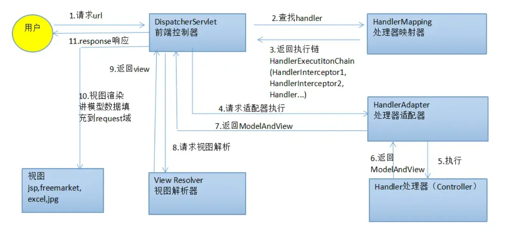

## 什么是Restful风格？

## Spring MVC 与 Spring Boot 有什么区别？


## 说说你对SpringMVC的理解？


## 简述SpringMVC核心组件？

**组件**

Spring MVC是一个基于Java的实现了MVC设计模式的**请求驱动**类型的轻量级Web框架，它大量使用了Spring框架中提供的设计模式。Spring MVC框架的核心组件包括：

1.  DispatcherServlet：前端控制器，负责接收请求并根据映射关系调用相应的控制器。
2.  HandlerMapping：负责根据请求的URL到HandlerMapping中找到映射的处理器（Controller）。
3.  HandlerAdapter：负责根据处理器，生成处理器适配器，通过适配器调用实际的处理器。
4.  Controller：处理器，执行相应的业务逻辑操作，并返回ModelAndView对象。
5.  ModelAndView：包含了视图逻辑名和模型数据的对象，是连接控制器和视图的桥梁。
6.  ViewResolver：负责解析视图名到具体视图实现类的映射，根据视图名称找到对应的视图实现类。
7.  View：视图，负责渲染数据并展示给用户。


## SpringMVC具体的工作原理和执行流程？



**组件**

Spring MVC是一个基于Java的实现了MVC设计模式的**请求驱动**类型的轻量级Web框架，它大量使用了Spring框架中提供的设计模式。Spring MVC框架的核心组件包括：

1.  DispatcherServlet：前端控制器，负责接收请求并根据映射关系调用相应的控制器。
2.  HandlerMapping：负责根据请求的URL到HandlerMapping中找到映射的处理器（Controller）。
3.  HandlerAdapter：负责根据处理器，生成处理器适配器，通过适配器调用实际的处理器。
4.  Controller：处理器，执行相应的业务逻辑操作，并返回ModelAndView对象。
5.  ModelAndView：包含了视图逻辑名和模型数据的对象，是连接控制器和视图的桥梁。
6.  ViewResolver：负责解析视图名到具体视图实现类的映射，根据视图名称找到对应的视图实现类。
7.  View：视图，负责渲染数据并展示给用户。

**执行流程**

Spring MVC 的**执行流程**大致可以分为以下几个步骤：

-   1、发送请求到DispatcherServlet：用户向服务器发送请求，请求被DispatcherServlet捕获。

-   2、查找Handler：DispatcherServlet根据请求URL到**HandlerMapping中查找映射的处理器**（Controller）
    -   HandlerMapping找到具体的处理器（可以根据xml配置、注解进行查找），生成处理器及处理器拦截器（如果有则生成）一并返回给DispatcherServlet

-   3、调用HandlerAdapter：DispatcherServlet根据处理器，到HandlerAdapter中找到对应的处理器适配器。

-   4、执行Controller：处理器适配器（HandlerAdapter）调用实际的处理器（Controller）执行业务逻辑操作，并返回ModelAndView对象。

-   5、处理ModelAndView：DispatcherServlet根据ModelAndView中的视图名称，到ViewResolver中找到对应的视图实现类。

-   6、渲染视图：视图实现类根据ModelAndView中的数据和视图模板渲染视图。

-   7、返回响应到客户端：DispatcherServlet将渲染后的视图返回给客户端。


## 解释 Spring MVC 的工作原理？

Spring MVC 的工作原理基于 Model-View-Controller（MVC）设计模式，旨在将应用程序的业务逻辑、用户界面和数据分离开来。

-   **用户请求**

用户通过浏览器发送 HTTP 请求到服务器。例如，用户访问 `http://example.com/hello`。

-   **前端控制器（DispatcherServlet）**

Spring MVC 的核心组件 `DispatcherServlet` 充当前端控制器，它拦截所有进入的 HTTP 请求。`DispatcherServlet` 在 `web.xml` 文件中配置，负责初始化 Spring MVC 的上下文环境

```xml
<servlet>
    <servlet-name>dispatcher</servlet-name>
    <servlet-class>org.springframework.web.servlet.DispatcherServlet</servlet-class>
    <load-on-startup>1</load-on-startup>
</servlet>
<servlet-mapping>
    <servlet-name>dispatcher</servlet-name>
    <url-pattern>/</url-pattern>
</servlet-mapping>
```

-   **处理器映射（Handler Mapping）**

`DispatcherServlet` 接收到请求后，会根据请求 URL 通过处理器映射（Handler Mapping）找到相应的控制器（Controller）。处理器映射是由 `HandlerMapping` 接口实现的，常见的实现包括 `RequestMappingHandlerMapping`，它会扫描控制器中的 `@RequestMapping` 注解。

```java
@Controller
public class HelloController {
    @RequestMapping("/hello")
    public ModelAndView helloWorld() {
        String message = "Hello, Spring MVC!";
        return new ModelAndView("hello", "message", message);
    }
}
```

-   **控制器处理**

找到相应的控制器后，`DispatcherServlet` 调用控制器的方法处理请求。控制器执行业务逻辑，通常会调用服务层或数据访问层获取数据，并将数据封装到模型中。

```java
@Controller
public class HelloController {
    @RequestMapping("/hello")
    public ModelAndView helloWorld() {
        String message = "Hello, Spring MVC!";
        return new ModelAndView("hello", "message", message);
    }
}
```

-   **视图解析器（View Resolver）**

控制器处理完请求后，会返回一个 `ModelAndView` 对象，其中包含视图名称和模型数据。`DispatcherServlet` 使用视图解析器（View Resolver）将视图名称解析为实际的视图对象。常见的视图解析器包括 `InternalResourceViewResolver`、`ThymeleafViewResolver` 等。

```java
@Bean
public InternalResourceViewResolver viewResolver() {
    InternalResourceViewResolver resolver = new InternalResourceViewResolver();
    resolver.setPrefix("/WEB-INF/views/");
    resolver.setSuffix(".jsp");
    return resolver;
}
```

-   **视图渲染**

  视图解析器将视图名称解析为实际的视图对象后，视图对象负责将模型数据渲染为用户界面，通常是 HTML 页面。视图对象可以是 JSP、Thymeleaf 模板、FreeMarker 模板等。

```jsp
<!-- hello.jsp -->
<%@ taglib uri="http://java.sun.com/jsp/jstl/core" prefix="c" %>
<html>
<body>
    <h2>${message}</h2>
</body>
</html>
```

-   **响应返回**

渲染后的视图返回给 `DispatcherServlet`，`DispatcherServlet` 将最终的响应发送回用户浏览器。用户在浏览器中看到渲染后的页面。


## 什么是DispatcherServlet？

`DispatcherServlet`充当前端控制器（Front Controller），负责接收所有进入的 HTTP 请求并将它们分派给适当的处理器进行处理。`DispatcherServlet` 是实现 MVC 模式的关键部分，负责协调整个请求处理流程。

**主要职责**

1.  **请求接收和分派**：拦截所有进入的 HTTP 请求并将它们分派给适当的控制器（Controller）。
2.  **处理器映射**：根据请求 URL，查找相应的处理器（通常是控制器方法）。
3.  **视图解析**：将控制器返回的视图名称解析为实际的视图对象。
4.  **请求处理**：调用处理器进行请求处理，并将处理结果封装到模型中。
5.  **视图渲染**：将模型数据传递给视图对象进行渲染，并生成最终的响应。

**工作流程**

  1. **初始化**：

在应用程序启动时，`DispatcherServlet` 被初始化。它加载 Spring 应用程序上下文，配置处理器映射、视图解析器等组件。

  2. **接收请求**：

用户通过浏览器发送 HTTP 请求到服务器。`DispatcherServlet` 拦截所有符合配置的 URL 模式的请求。

  3. **处理器映射**：

`DispatcherServlet` 使用处理器映射器（Handler Mapping）根据请求 URL 查找相应的处理器（Controller）。

  4. **调用处理器**：

找到处理器后，`DispatcherServlet` 调用处理器的方法进行请求处理。处理器执行业务逻辑，通常会调用服务层或数据访问层获取数据，并将数据封装到模型中。

  5. **视图解析**：

处理器处理完请求后，返回一个包含视图名称和模型数据的 `ModelAndView` 对象。`DispatcherServlet` 使用视图解析器（View Resolver）将视图名称解析为实际的视图对象。

  6. **视图渲染**：

视图对象负责将模型数据渲染为用户界面，通常是 HTML 页面。

  7. **响应返回**：

渲染后的视图返回给 `DispatcherServlet`，`DispatcherServlet` 将最终的响应发送回用户浏览器。


## **如何在 Spring MVC 中配置DispatcherServlet？**

配置 `DispatcherServlet` 通常有两种方式：基于 XML 配置和基于 Java 配置（也称为 Java Config 或 Java-based Configuration）。

**基于XML配置**

-   **web.xml 配置**

在传统的 Spring MVC 应用中，`DispatcherServlet` 通常是在 `web.xml` 文件中配置的

```xml
<web-app xmlns="http://xmlns.jcp.org/xml/ns/javaee" 
         xmlns:xsi="http://www.w3.org/2001/XMLSchema-instance" 
         xsi:schemaLocation="http://xmlns.jcp.org/xml/ns/javaee 
                             http://xmlns.jcp.org/xml/ns/javaee/web-app_3_1.xsd" 
         version="3.1">
    
    <servlet>
        <servlet-name>dispatcher</servlet-name>
        <servlet-class>org.springframework.web.servlet.DispatcherServlet</servlet-class>
        <load-on-startup>1</load-on-startup>
    </servlet>
    
    <servlet-mapping>
        <servlet-name>dispatcher</servlet-name>
        <url-pattern>/</url-pattern>
    </servlet-mapping>
    
</web-app>
```

`<servlet>` 元素定义了一个名为 `dispatcher` 的 `DispatcherServlet` 实例。

`<load-on-startup>` 元素指定了 `DispatcherServlet` 应该在应用启动时加载。

`<servlet-mapping>` 元素将所有请求（`/`）映射到 `DispatcherServlet`。

-   **Spring 配置文件（如 spring-servlet.xml）**

`DispatcherServlet` 会加载一个 Spring 配置文件，该文件的名称通常是 `[servlet-name]-servlet.xml`，例如 `dispatcher-servlet.xml`。这个文件包含 Spring MVC 的具体配置，如视图解析器、控制器扫描等：

```xml
<beans xmlns="http://www.springframework.org/schema/beans"
       xmlns:xsi="http://www.w3.org/2001/XMLSchema-instance"
       xsi:schemaLocation="http://www.springframework.org/schema/beans 
                           http://www.springframework.org/schema/beans/spring-beans.xsd">
    
    <!-- 启用注解驱动的控制器 -->
    <context:component-scan base-package="com.example" />
    <mvc:annotation-driven />
    
    <!-- 配置视图解析器 -->
    <bean class="org.springframework.web.servlet.view.InternalResourceViewResolver">
        <property name="prefix" value="/WEB-INF/views/" />
        <property name="suffix" value=".jsp" />
    </bean>
    
</beans>
```

**基于Java配置**

Spring 提供了基于 Java 配置的方式来配置 `DispatcherServlet`，这通常是在不使用 `web.xml` 的情况下进行的（例如，使用 Spring Boot 或者 Spring 的 Java Config）。

-   **Web 应用初始化类**

创建一个类来替代 web.xml，实现 WebApplicationInitializer 接口：

```java
import org.springframework.web.WebApplicationInitializer;
import org.springframework.web.context.support.AnnotationConfigWebApplicationContext;
import org.springframework.web.servlet.DispatcherServlet;
import javax.servlet.ServletContext;
import javax.servlet.ServletException;
import javax.servlet.ServletRegistration;

public class MyWebAppInitializer implements WebApplicationInitializer {

    @Override
    public void onStartup(ServletContext servletContext) throws ServletException {
        AnnotationConfigWebApplicationContext context = new AnnotationConfigWebApplicationContext();
        context.register(WebConfig.class);
        
        DispatcherServlet dispatcherServlet = new DispatcherServlet(context);
        ServletRegistration.Dynamic registration = servletContext.addServlet("dispatcher", dispatcherServlet);
        registration.setLoadOnStartup(1);
        registration.addMapping("/");
    }
}
```

-   **Spring 配置类**

创建一个 Java 配置类来替代 XML 配置文件：

```java
import org.springframework.context.annotation.Bean;
import org.springframework.context.annotation.ComponentScan;
import org.springframework.context.annotation.Configuration;
import org.springframework.web.servlet.config.annotation.EnableWebMvc;
import org.springframework.web.servlet.config.annotation.WebMvcConfigurer;
import org.springframework.web.servlet.view.InternalResourceViewResolver;

@Configuration
@EnableWebMvc
@ComponentScan(basePackages = "com.example")
public class WebConfig implements WebMvcConfigurer {

    @Bean
    public InternalResourceViewResolver viewResolver() {
        InternalResourceViewResolver resolver = new InternalResourceViewResolver();
        resolver.setPrefix("/WEB-INF/views/");
        resolver.setSuffix(".jsp");
        return resolver;
    }
}
```


## 什么是 Handler Mapping？

`Handler Mapping` 负责将 HTTP 请求映射到相应的处理器（通常是控制器方法）。当 `DispatcherServlet` 接收到一个请求时，它会使用 `Handler Mapping` 来确定哪个处理器应该处理这个请求

**主要职责**

1.  **请求映射**：根据请求的 URL、HTTP 方法、请求参数等信息，查找并确定相应的处理器。
2.  **处理器返回**：返回一个包含处理器对象和处理器拦截器链的 `HandlerExecutionChain` 对象。

**工作流程**

1.  **请求到达** `**DispatcherServlet**`：当一个 HTTP 请求到达 `DispatcherServlet` 时，它会首先交给 `Handler Mapping` 进行处理。
2.  **查找处理器**：`Handler Mapping` 根据请求的 URL、HTTP 方法等信息查找匹配的处理器。
3.  **返回处理器**：`Handler Mapping` 返回一个 `HandlerExecutionChain` 对象，其中包含处理器（通常是控制器方法）和处理器拦截器链。
4.  **处理请求**：`DispatcherServlet` 使用找到的处理器来处理请求，并生成响应。

**常见的 `Handler Mapping` 实现**

-   **`BeanNameUrlHandlerMapping`**

通过 bean 的名称来映射处理器。例如，bean 名称为 `/hello` 的处理器会处理 `/hello` 请求。

-   **`SimpleUrlHandlerMapping`**

通过显式配置的 URL 路径来映射处理器。可以在 Spring 配置文件中指定 URL 到处理器的映射关系。

-   **`DefaultAnnotationHandlerMapping`**（过时）：

通过注解（如 `@RequestMapping`）来映射处理器。在较新的 Spring 版本中被 `RequestMappingHandlerMapping` 取代。

-   **`RequestMappingHandlerMapping`**：

这是最常用的 `Handler Mapping` 实现。通过注解（如 `@RequestMapping`、`@GetMapping`、`@PostMapping` 等）来映射处理器。支持复杂的请求映射规则，包括路径变量、请求参数、请求头等。

**示例**

```java
import org.springframework.stereotype.Controller;
import org.springframework.web.bind.annotation.GetMapping;
import org.springframework.web.bind.annotation.RequestMapping;
import org.springframework.web.servlet.config.annotation.EnableWebMvc;
import org.springframework.web.servlet.config.annotation.WebMvcConfigurer;
import org.springframework.context.annotation.ComponentScan;
import org.springframework.context.annotation.Configuration;

@Controller
@RequestMapping("/hello")
public class HelloController {

    @GetMapping
    public String helloWorld() {
        return "hello";
    }
}

@Configuration
@EnableWebMvc
@ComponentScan(basePackages = "com.example")
public class WebConfig implements WebMvcConfigurer {
    // 可以在这里添加其他配置
}
```

`HelloController` 类使用 `@RequestMapping` 和 `@GetMapping` 注解来定义请求映射。

`/hello` URL 会被映射到 `helloWorld` 方法。


## 什么是 Handler Adapter？

`Handler Adapter`负责将处理器（Handler）适配为具体的处理方法。`Handler Adapter` 的主要作用是根据处理器的类型和具体实现，执行相应的处理逻辑。`Handler Adapter` 是 `DispatcherServlet` 和具体处理器之间的桥梁。

**主要职责**

1.  **处理器执行**：调用处理器的方法来处理请求。
2.  **返回模型和视图**：处理完请求后，返回一个 `ModelAndView` 对象，包含视图名称和模型数据

**工作流程**

1.  **请求到达 `DispatcherServlet`**：当一个 HTTP 请求到达 `DispatcherServlet` 时，它会先通过 `Handler Mapping` 找到对应的处理器。
2.  **选择`Handler Adapter`：**`DispatcherServlet` 根据处理器的类型选择合适的 `Handler Adapter`。
3.  **执行处理器**：`Handler Adapter` 调用处理器的方法来处理请求。
4.  **返回结果**：处理完请求后，`Handler Adapter` 返回一个 `ModelAndView` 对象，`DispatcherServlet` 再根据这个对象生成最终的响应。

**常见的 `Handler Adapter` 实现**

-   **`HttpRequestHandlerAdapter`**：

用于处理实现 `HttpRequestHandler` 接口的处理器。例如实现了 `HttpRequestHandler` 接口的处理器。

-   **`SimpleControllerHandlerAdapter`**：

用于处理实现 `Controller` 接口的处理器。例如实现了 `Controller` 接口的处理器。

-   **`RequestMappingHandlerAdapter`**：

最常用的 `Handler Adapter` 实现。用于处理使用 `@RequestMapping` 注解的控制器方法。支持复杂的请求映射规则和数据绑定。

**示例**

```java
import org.springframework.stereotype.Controller;
import org.springframework.web.bind.annotation.GetMapping;
import org.springframework.web.bind.annotation.RequestMapping;
import org.springframework.web.servlet.ModelAndView;
import org.springframework.web.servlet.config.annotation.EnableWebMvc;
import org.springframework.web.servlet.config.annotation.WebMvcConfigurer;
import org.springframework.context.annotation.ComponentScan;
import org.springframework.context.annotation.Configuration;

@Controller
@RequestMapping("/hello")
public class HelloController {

    @GetMapping
    public ModelAndView helloWorld() {
        ModelAndView modelAndView = new ModelAndView();
        modelAndView.setViewName("hello");
        modelAndView.addObject("message", "Hello, World!");
        return modelAndView;
    }
}

@Configuration
@EnableWebMvc
@ComponentScan(basePackages = "com.example")
public class WebConfig implements WebMvcConfigurer {
    // 可以在这里添加其他配置
}
```

-   `HelloController` 类使用 `@RequestMapping` 和 `@GetMapping` 注解来定义请求映射。
-   `RequestMappingHandlerAdapter` 会根据注解找到 `helloWorld` 方法并执行它。
-   `helloWorld` 方法返回一个 `ModelAndView` 对象，包含视图名称和模型数据。


## 什么是 View Resolver？

`View Resolver` 负责将逻辑视图名称解析为具体的视图对象（如 JSP、Thymeleaf 模板等）。`View Resolver` 的主要作用是**根据控制器返回的视图名称，找到相应的视图资源，并将其渲染成最终的 HTML 响应。**

**主要职责**

1.  **视图名称解析**：将控制器返回的逻辑视图名称解析为具体的视图对象。
2.  **视图对象返回**：返回一个 `View` 对象，该对象可以用来渲染模型数据。

**工作流程**

1.  **控制器处理请求**：当一个 HTTP 请求到达 `DispatcherServlet` 时，它会通过 `Handler Adapter` 调用控制器的方法来处理请求。
2.  **返回视图名称**：控制器方法处理完请求后，会返回一个包含视图名称和模型数据的 `ModelAndView` 对象。
3.  **视图名称解析**：`DispatcherServlet` 使用 `View Resolver` 将逻辑视图名称解析为具体的视图对象。
4.  **渲染视图**：`View` 对象使用模型数据来渲染最终的 HTML 响应。

**常见的 `View Resolver` 实现**

-   **`InternalResourceViewResolver`**：

最常用的 `View Resolver` 实现。用于解析 JSP 文件。通过配置前缀和后缀来确定视图的实际路径。

-   **`ThymeleafViewResolver`**：

用于解析 Thymeleaf 模板文件。需要配合 Thymeleaf 模板引擎使用。

-   **`BeanNameViewResolver`**：

通过视图名称作为 bean 名称来查找视图对象。适用于视图对象作为 Spring bean 定义的情况。

-   **`XmlViewResolver`**：

通过 XML 文件配置视图名称和视图对象的映射关系。

**示例**

使用 `InternalResourceViewResolver` ：

```java
import org.springframework.context.annotation.Bean;
import org.springframework.context.annotation.Configuration;
import org.springframework.web.servlet.ViewResolver;
import org.springframework.web.servlet.config.annotation.EnableWebMvc;
import org.springframework.web.servlet.config.annotation.WebMvcConfigurer;
import org.springframework.web.servlet.view.InternalResourceViewResolver;

@Configuration
@EnableWebMvc
public class WebConfig implements WebMvcConfigurer {

    @Bean
    public ViewResolver viewResolver() {
        InternalResourceViewResolver resolver = new InternalResourceViewResolver();
        resolver.setPrefix("/WEB-INF/views/");
        resolver.setSuffix(".jsp");
        return resolver;
    }
}
```

`InternalResourceViewResolver` 被配置为视图解析器。

视图的前缀被设置为 `/WEB-INF/views/`，后缀被设置为 `.jsp`。

例如，当控制器返回视图名称 `home` 时，`InternalResourceViewResolver` 会将其解析为 `/WEB-INF/views/home.jsp`。

```java
import org.springframework.stereotype.Controller;
import org.springframework.web.bind.annotation.GetMapping;
import org.springframework.web.servlet.ModelAndView;

@Controller
public class HomeController {

    @GetMapping("/home")
    public ModelAndView home() {
        ModelAndView modelAndView = new ModelAndView();
        modelAndView.setViewName("home");
        modelAndView.addObject("message", "Welcome to the home page!");
        return modelAndView;
    }
}
```

-   `HomeController` 类定义了一个处理 `/home` 请求的方法。
-   该方法返回一个 `ModelAndView` 对象，其中视图名称为 `home`。
-   `InternalResourceViewResolver` 会将视图名称 `home` 解析为 `/WEB-INF/views/home.jsp`。


## SpringMVC中的视图解析器有什么用？

在SpringMVC框架中，视图解析器（View Resolver）的作用如下：

-   **视图名称解析**：控制器（Controller）处理完用户请求后，通常会返回一个逻辑视图名称。视图解析器负责将这个逻辑名称转换为实际的视图对象（如JSP、Thymeleaf模板等）。
-   **视图渲染**：根据解析出的视图对象，结合模型数据（Model），生成最终的HTML页面或其他格式的响应内容返回给客户端。
-   **支持多种视图技术**：通过配置不同的视图解析器，可以灵活地支持多种视图技术，例如JSP、FreeMarker、Velocity、Thymeleaf等。

视图解析器是SpringMVC中实现MVC设计模式的关键组件之一，它使得应用程序的视图层更加模块化和易于维护。


## Spring MVC 中的 @Controller 注解有什么作用？

`@Controller` 注解用于标记一个类作为控制器组件。控制器是处理 HTTP 请求的核心组件，它负责接收请求、处理业务逻辑并返回视图或数据响应。

**主要作用**

1.  **标识控制器类**：`@Controller` 注解告诉 Spring 该类是一个控制器，应该由 Spring 容器管理。
2.  **处理请求**：控制器类中的方法通过映射注解（如 `@RequestMapping`、`@GetMapping`、`@PostMapping` 等）处理 HTTP 请求。

**相关注解**

在 Spring MVC 中，除了 `@Controller`，还有一些常用的注解用于处理请求：

-   **`@RequestMapping`**：用于定义请求 URL 和 HTTP 方法的映射。可以应用于类级别和方法级别。

-   **`@GetMapping`、`@PostMapping`、`@PutMapping`、`@DeleteMapping`**：分别用于处理 `GET`、`POST`、`PUT`、`DELETE` 请求。是 `@RequestMapping` 的快捷方式。

-   **@RequestParam**`：用于绑定请求参数到方法参数。可以指定参数名称、是否必需以及默认值。

-   **`@PathVariable`**：用于绑定 URL 路径中的变量到方法参数。

-   **`@ModelAttribute`**：用于将请求参数绑定到模型对象，并将模型对象添加到模型中。

-   **`@ResponseBody`**：用于将方法的返回值直接作为 HTTP 响应体。常用于返回 JSON 或 XML 数据


## @RequestMapping

`@RequestMapping` 注解用于映射 HTTP 请求到处理器方法（控制器方法）上。它可以应用于类级别和方法级别，用于定义请求 URL 和 HTTP 方法的映射关系

**主要作用**

1.  **URL 映射**：将特定的 URL 映射到控制器类或方法上。
2.  **HTTP 方法映射**：指定处理请求的 HTTP 方法（如 GET、POST、PUT、DELETE 等）。
3.  **请求参数和头信息映射**：可以根据请求参数、头信息等进一步细化映射条件。

**详细用法**

-   **类级别和方法级别的结合**

`@RequestMapping` 可以同时应用于类级别和方法级别，用于构建更复杂的 URL 映射结构。

```java
@Controller
@RequestMapping("/api")
public class ApiController {

    @RequestMapping("/users")
    public String getUsers() {
        // 处理 /api/users 请求
        return "users";
    }

    @RequestMapping("/products")
    public String getProducts() {
        // 处理 /api/products 请求
        return "products";
    }
}
```

-   **指定 HTTP 方法**

可以通过 `method` 属性指定处理请求的 HTTP 方法

```java
@RequestMapping(value = "/submit", method = RequestMethod.POST)
public String handleSubmit() {
    // 处理 POST 请求 /submit
    return "submitSuccess";
}
```

-   **请求参数和头信息**

可以通过 `params` 和 `headers` 属性进一步细化映射条件。

```java
@RequestMapping(value = "/filter", params = "type=admin")
public String filterAdmin() {
    // 处理包含参数 type=admin 的请求
    return "adminPage";
}

@RequestMapping(value = "/filter", headers = "User-Agent=Mozilla/5.0")
public String filterByUserAgent() {
    // 处理包含特定 User-Agent 头信息的请求
    return "mozillaPage";
}
```

-   **消息体和内容类型**

可以通过 `consumes` 和 `produces` 属性指定请求和响应的内容类型

```java
@RequestMapping(value = "/json", method = RequestMethod.POST, consumes = "application/json", produces = "application/json")
@ResponseBody
public ResponseEntity<String> handleJsonRequest(@RequestBody String jsonData) {
    // 处理 JSON 请求并返回 JSON 响应
    return ResponseEntity.ok("{\"status\":\"success\"}");
}
```


## 如何处理 Spring MVC 中的表单数据？

1.  **创建表单页面**：使用 HTML 表单元素。
2.  **创建数据模型**：定义一个 Java 类来接收表单数据。
3.  **创建控制器方法**：处理表单提交请求。
4.  **数据绑定和验证**：使用 Spring 提供的验证机制来验证表单数据

**创建表单页面**

首先，创建一个 HTML 表单页面来收集用户输入。一个简单的用户注册表单：

```html
<!DOCTYPE html>
<html>
<head>
    <title>Register</title>
</head>
<body>
    <h2>Register</h2>
    <form action="/register" method="post">
        <label for="username">Username:</label>
        <input type="text" id="username" name="username"><br><br>
        <label for="password">Password:</label>
        <input type="password" id="password" name="password"><br><br>
        <input type="submit" value="Register">
    </form>
</body>
</html>
```

**创建数据模型**

创建一个 Java 类来表示表单数据。一个用户类：

```java
public class User {
    private String username;
    private String password;

    // Getters and Setters

}
```

**创建控制器方法**

在控制器类中创建方法来处理表单提交请求

```java
import org.springframework.stereotype.Controller;
import org.springframework.ui.Model;
import org.springframework.web.bind.annotation.GetMapping;
import org.springframework.web.bind.annotation.ModelAttribute;
import org.springframework.web.bind.annotation.PostMapping;

@Controller
public class UserController {

    @GetMapping("/register")
    public String showForm(Model model) {
        model.addAttribute("user", new User());
        return "register";
    }

    @PostMapping("/register")
    public String submitForm(@ModelAttribute("user") User user, Model model) {
        // 处理表单数据
        model.addAttribute("message", "User registered successfully");
        return "result";
    }
}
```

-   `@GetMapping("/register")` 方法用于显示注册表单。
-   `@PostMapping("/register")` 方法用于处理表单提交。通过 `@ModelAttribute` 注解，Spring MVC 会自动将表单数据绑定到 `User` 对象。

**数据绑定和验证**

为了确保表单数据的有效性，可以使用 Spring 的验证机制。首先，在数据模型类上使用注解进行验证：

```java
import javax.validation.constraints.NotEmpty;

public class User {
    @NotEmpty(message = "Username is required")
    private String username;

    @NotEmpty(message = "Password is required")
    private String password;

    // Getters and Setters
}
```

  在控制器方法中添加验证逻辑：

```java
import org.springframework.validation.BindingResult;
import javax.validation.Valid;

@Controller
public class UserController {

    @GetMapping("/register")
    public String showForm(Model model) {
        model.addAttribute("user", new User());
        return "register";
    }

    @PostMapping("/register")
    public String submitForm(@Valid @ModelAttribute("user") User user, BindingResult bindingResult, Model model) {
        if (bindingResult.hasErrors()) {
            return "register";
        }
        // 处理表单数据
        model.addAttribute("message", "User registered successfully");
        return "result";
    }
}
```

-   `@Valid` 注解用于触发验证。
-   `BindingResult` 参数用于检查验证结果。如果有验证错误，返回到表单页面并显示错误信息。

**显示验证错误信息**

在表单页面上显示验证错误信息：

```html
<!DOCTYPE html>
<html>
<head>
    <title>Register</title>
</head>
<body>
    <h2>Register</h2>
    <form action="/register" method="post">
        <label for="username">Username:</label>
        <input type="text" id="username" name="username" value="${user.username}"><br>
        <span style="color:red">${#fields.hasErrors('username')} ? ${#fields.errors('username')} : ''</span><br><br>
        
        <label for="password">Password:</label>
        <input type="password" id="password" name="password"><br>
        <span style="color:red">${#fields.hasErrors('password')} ? ${#fields.errors('password')} : ''</span><br><br>
        
        <input type="submit" value="Register">
    </form>
</body>
</html>
```


## 如何在 Spring MVC 中进行表单验证？

1.  **定义数据模型并添加验证注解**。
2.  **在控制器中处理表单提交并进行验证**。
3.  **在视图中显示验证错误信息**。

**定义数据模型并添加验证注解**

使用 Java Bean Validation (JSR-380) 注解来定义数据模型的验证规则。例如，创建一个 `User` 类，并在其字段上添加验证注解：

```java
import javax.validation.constraints.NotEmpty;
import javax.validation.constraints.Size;

public class User {
    @NotEmpty(message = "Username is required")
    @Size(min = 3, max = 20, message = "Username must be between 3 and 20 characters")
    private String username;

    @NotEmpty(message = "Password is required")
    @Size(min = 6, message = "Password must be at least 6 characters")
    private String password;

    // Getters and Setters
    public String getUsername() {
        return username;
    }

    public void setUsername(String username) {
        this.username = username;
    }

    public String getPassword() {
        return password;
    }

    public void setPassword(String password) {
        this.password = password;
    }
}
```

**在控制器中处理表单提交并进行验证**

在控制器中使用 `@Valid` 注解和 `BindingResult` 参数来处理表单验证

```java
import org.springframework.stereotype.Controller;
import org.springframework.ui.Model;
import org.springframework.validation.BindingResult;
import org.springframework.web.bind.annotation.GetMapping;
import org.springframework.web.bind.annotation.ModelAttribute;
import org.springframework.web.bind.annotation.PostMapping;

import javax.validation.Valid;

@Controller
public class UserController {

    @GetMapping("/register")
    public String showForm(Model model) {
        model.addAttribute("user", new User());
        return "register";
    }

    @PostMapping("/register")
    public String submitForm(@Valid @ModelAttribute("user") User user, BindingResult bindingResult, Model model) {
        if (bindingResult.hasErrors()) {
            return "register";
        }
        // 处理表单数据
        model.addAttribute("message", "User registered successfully");
        return "result";
    }
}
```

`@Valid` 注解用于触发验证。

`BindingResult` 参数用于检查验证结果。如果有验证错误，将返回到表单页面并显示错误信息

**在视图中显示验证错误信息**

在视图模板中显示验证错误信息。例如，使用 Thymeleaf 模板引擎：

```html
<!DOCTYPE html>
<html xmlns:th="http://www.thymeleaf.org">
<head>
    <title>Register</title>
</head>
<body>
    <h2>Register</h2>
    <form action="#" th:action="@{/register}" th:object="${user}" method="post">
        <label for="username">Username:</label>
        <input type="text" id="username" th:field="*{username}">
        <div th:if="${#fields.hasErrors('username')}" th:errors="*{username}">Username Error</div>
        <br><br>
        
        <label for="password">Password:</label>
        <input type="password" id="password" th:field="*{password}">
        <div th:if="${#fields.hasErrors('password')}" th:errors="*{password}">Password Error</div>
        <br><br>
        
        <input type="submit" value="Register">
    </form>
</body>
</html>
```

`th:object="${user}"` 绑定表单对象。

`th:field="*{username}"` 和 `th:field="*{password}"` 绑定表单字段。

`th:if="${#fields.hasErrors('username')}"` 和 `th:errors="*{username}"` 用于显示验证错误信息。


## 什么是 ModelAndView？

`ModelAndView`用于封装模型数据和视图信息。它允许控制器方法返回一个对象，该对象包含视图名称和模型数据，从而将数据传递给视图进行渲染。

**`ModelAndView` 的组成部分**

-   **视图名称**：表示要渲染的视图的名称，通常对应于某个 JSP、Thymeleaf 模板或其他视图模板。

-   **模型数据**：一个 `Map` 或者 `Model` 对象，包含要传递给视图的数据

```java
import org.springframework.stereotype.Controller;
import org.springframework.web.bind.annotation.GetMapping;
import org.springframework.web.servlet.ModelAndView;

@Controller
public class MyController {

    @GetMapping("/welcome")
    public ModelAndView welcome() {
        ModelAndView modelAndView = new ModelAndView();
        modelAndView.setViewName("welcome"); // 设置视图名称
        modelAndView.addObject("message", "Welcome to Spring MVC!"); // 添加模型数据

        return modelAndView;
    }
}
```

`ModelAndView` 对象被创建。

`setViewName("welcome")` 设置视图名称为 `welcome`，表示将使用名为 `welcome` 的视图模板来渲染响应。

`addObject("message", "Welcome to Spring MVC!")` 添加模型数据，键为 `message`，值为 `"Welcome to Spring MVC!"`。

**在视图模板中使用模型数据（假设使用 Thymeleaf）**

```java
<!DOCTYPE html>
<html xmlns:th="http://www.thymeleaf.org">
<head>
    <title>Welcome</title>
</head>
<body>
    <h1 th:text="${message}">Welcome Message</h1>
</body>
</html>
```

`${message}` 表达式将被替换为模型数据中 `message` 键对应的值。

**`ModelAndView` 的常用方法**

-   **构造函数**：
    -   `ModelAndView()`：创建一个空的 `ModelAndView` 对象。
    -   `ModelAndView(String viewName)`：创建一个带有视图名称的 `ModelAndView` 对象。
    -   `ModelAndView(String viewName, String modelName, Object modelObject)`：创建一个带有视图名称和单个模型数据的 `ModelAndView` 对象。
    -   `ModelAndView(String viewName, Map<String, ?> model)`：创建一个带有视图名称和模型数据的 `ModelAndView` 对象。

-   **设置视图名称**：
    -   `void setViewName(String viewName)`：设置视图名称。

-   **添加模型数据**：
    -   `ModelAndView addObject(String attributeName, Object attributeValue)`：添加单个模型数据。
    -   `ModelAndView addObject(Object attributeValue)`：添加单个模型数据，属性名为对象的类名。
    -   `ModelAndView addAllObjects(Map<String, ?> modelMap)`：添加多个模型数据。

-   **获取模型数据**：
    -   `Map<String, Object> getModel()`：获取模型数据。

-   **获取视图名称**：
    -   `String getViewName()`：获取视图名称。

**使用 `ModelAndView` 的优点**

1.  **清晰分离模型和视图**：将模型数据和视图信息封装在一个对象中，使得控制器方法的返回值更加清晰和结构化。
2.  **灵活性**：可以在一个地方设置视图和模型数据，便于维护和修改。
3.  **简化代码**：通过返回 `ModelAndView` 对象，可以避免在控制器方法中显式设置模型和视图。


## @ModelAttribute

`@ModelAttribute` 注解是 Spring MVC 中用于**绑定请求参数到模型对象**的注解。它可以用于方法参数、方法和控制器类中，以便将请求中的数据绑定到模型对象，并将该对象添加到模型中，以便在视图中使用。

**`@ModelAttribute` 的使用场景**

-   **方法参数**：用于绑定请求参数到方法参数，并将该参数添加到模型中。

-   **方法**：用于在处理请求之前准备模型数据。通常用于在处理请求之前初始化一些公共数据。

-   **控制器类**：用于在所有请求处理方法之前初始化模型数据。

**用于方法参数**

当 `@ModelAttribute` 注解用于控制器方法参数时，它会自动将请求参数绑定到该参数对象中，并将该对象添加到模型中

```java
import org.springframework.stereotype.Controller;
import org.springframework.web.bind.annotation.ModelAttribute;
import org.springframework.web.bind.annotation.PostMapping;

@Controller
public class UserController {

    @PostMapping("/register")
    public String registerUser(@ModelAttribute User user) {
        // user 对象已经绑定了请求参数
        // 可以在这里处理业务逻辑
        return "result";
    }
}
```

在`@ModelAttribute` 注解用于 `User` 对象的参数。这意味着 Spring MVC 会自动将请求参数绑定到 `User` 对象的属性中，并将该对象添加到模型中。

**用于方法**

当 `@ModelAttribute` 注解用于控制器方法时，该方法会在每个处理请求的方法之前执行，用于准备模型数据

```java
import org.springframework.stereotype.Controller;
import org.springframework.ui.Model;
import org.springframework.web.bind.annotation.ModelAttribute;
import org.springframework.web.bind.annotation.GetMapping;

@Controller
public class UserController {

    @ModelAttribute
    public void addAttributes(Model model) {
        model.addAttribute("commonAttribute", "This is a common attribute");
    }

    @GetMapping("/register")
    public String showForm(Model model) {
        model.addAttribute("user", new User());
        return "register";
    }
}
```

`addAttributes` 方法会在 `showForm` 方法之前执行，并将一个公共属性添加到模型中。这样，`commonAttribute` 可以在视图中使用。

**用于控制器类**

当 `@ModelAttribute` 注解用于控制器类时，它会在所有请求处理方法之前执行，用于初始化模型数据。

```java
import org.springframework.stereotype.Controller;
import org.springframework.ui.Model;
import org.springframework.web.bind.annotation.ModelAttribute;
import org.springframework.web.bind.annotation.RequestMapping;

@Controller
@RequestMapping("/users")
public class UserController {

    @ModelAttribute
    public void addCommonAttributes(Model model) {
        model.addAttribute("appName", "User Management System");
    }

    @GetMapping("/register")
    public String showForm(Model model) {
        model.addAttribute("user", new User());
        return "register";
    }

    @PostMapping("/register")
    public String registerUser(@ModelAttribute User user) {
        // user 对象已经绑定了请求参数
        // 可以在这里处理业务逻辑
        return "result";
    }
}
```

`addCommonAttributes` 方法会在所有请求处理方法之前执行，并将一个公共属性添加到模型中。这样，`appName` 可以在所有视图中使用


## @RequestParam

`@RequestParam` 注解是 Spring MVC 中用于**将请求参数绑定到处理方法的参数上**的注解。它可以用于从 URL 查询参数、表单数据或其他请求参数中提取值，并将这些值传递给控制器方法的参数

**`@RequestParam` 的基本用法**

-   **绑定单个请求参数**

```java
import org.springframework.stereotype.Controller;
import org.springframework.web.bind.annotation.GetMapping;
import org.springframework.web.bind.annotation.RequestParam;
import org.springframework.web.bind.annotation.ResponseBody;

@Controller
public class UserController {

    @GetMapping("/greet")
    @ResponseBody
    public String greetUser(@RequestParam String name) {
        return "Hello, " + name;
    }
}
```

`@RequestParam` 注解用于将请求参数 `name` 的值绑定到方法参数 `name` 上。如果请求 URL 是 `/greet?name=John`，那么方法参数 `name` 的值将是 `John`

-   **指定请求参数名称**

可以通过 `value` 属性指定请求参数的名称：

```java
@GetMapping("/greet")
@ResponseBody
public String greetUser(@RequestParam("username") String name) {
    return "Hello, " + name;
}
```

`@RequestParam("username")` 表示将请求参数 `username` 的值绑定到方法参数 `name` 上。如果请求 URL 是 `/greet?username=John`，那么方法参数 `name` 的值将是 `John`。

-   **设置请求参数的默认值**

可以通过 defaultValue 属性设置请求参数的默认值：

```java
@GetMapping("/greet")
@ResponseBody
public String greetUser(@RequestParam(value = "name", defaultValue = "Guest") String name) {
    return "Hello, " + name;
}
```

  如果请求 URL 中没有 `name` 参数，那么 `name` 参数的默认值将是 `Guest`

-   **请求参数为可选**

可以通过 `required` 属性指定请求参数是否是必需的：

```java
@GetMapping("/greet")
@ResponseBody
public String greetUser(@RequestParam(value = "name", required = false) String name) {
    if (name == null) {
        name = "Guest";
    }
    return "Hello, " + name;
}
```

`@RequestParam(value = "name", required = false)` 表示 `name` 参数是可选的。如果请求 URL 中没有 `name` 参数，那么 `name` 参数的值将是 `null`

**`@RequestParam` 的高级用法**

-   **绑定多个请求参数**

```java
@GetMapping("/user")
@ResponseBody
public String getUserInfo(@RequestParam String name, @RequestParam int age) {
    return "User: " + name + ", Age: " + age;
}
```

`name` 和 `age` 请求参数将分别绑定到方法参数 `name` 和 `age` 上。如果请求 URL 是 `/user?name=John&age=30`，那么方法参数 `name` 的值将是 `John`，`age` 的值将是 `30`。

-   **绑定到集合类型**

```java
@GetMapping("/numbers")
@ResponseBody
public String getNumbers(@RequestParam List<Integer> nums) {
    return "Numbers: " + nums;
}
```

`nums` 请求参数将绑定到方法参数 `nums` 上。如果请求 URL 是 `/numbers?nums=1&nums=2&nums=3`，那么方法参数 `nums` 的值将是 `[1, 2, 3]`。


## **@PathVariable** 

`@PathVariable` 注解是 Spring MVC 中用于**将 URL 路径中的变量绑定到处理方法的参数上**的注解。它允许你从 URL 路径中提取参数，并将这些参数传递给控制器方法，从而实现更加动态和灵活的 URL 路由。

**`@PathVariable` 的基本用法**

-   **绑定单个路径变量**

可以将 URL 路径中的变量绑定到方法参数上：

```java
import org.springframework.stereotype.Controller;
import org.springframework.web.bind.annotation.GetMapping;
import org.springframework.web.bind.annotation.PathVariable;
import org.springframework.web.bind.annotation.ResponseBody;

@Controller
public class UserController {

    @GetMapping("/users/{id}")
    @ResponseBody
    public String getUserById(@PathVariable String id) {
        return "User ID: " + id;
    }
}
```

`@PathVariable` 注解用于将 URL 路径中的 `id` 变量绑定到方法参数 `id` 上。如果请求 URL 是 `/users/123`，那么方法参数 `id` 的值将是 `123`。

-   **指定路径变量名称**

可以通过 `value` 属性指定路径变量的名称：

```java
@GetMapping("/users/{userId}")
@ResponseBody
public String getUserById(@PathVariable("userId") String id) {
    return "User ID: " + id;
}
```

`@PathVariable("userId")` 表示将 URL 路径中的 `userId` 变量绑定到方法参数 `id` 上。如果请求 URL 是 `/users/123`，那么方法参数 `id` 的值将是 `123`。

**`@PathVariable` 的高级用法**

-   **绑定多个路径变量**

可以绑定多个路径变量到方法参数上：

```java
@GetMapping("/users/{userId}/orders/{orderId}")
@ResponseBody
public String getUserOrder(@PathVariable String userId, @PathVariable String orderId) {
    return "User ID: " + userId + ", Order ID: " + orderId;
}
```

`userId` 和 `orderId` 路径变量将分别绑定到方法参数 `userId` 和 `orderId` 上。如果请求 URL 是 `/users/123/orders/456`，那么方法参数 `userId` 的值将是 `123`，`orderId` 的值将是 `456`。

-   **绑定到特定类型**

可以将路径变量绑定到特定类型的参数上：

```java
@GetMapping("/products/{productId}")
@ResponseBody
public String getProductById(@PathVariable int productId) {
    return "Product ID: " + productId;
}
```

`productId` 路径变量将绑定到方法参数 `productId` 上，并自动转换为 `int` 类型。如果请求 URL 是 `/products/789`，那么方法参数 `productId` 的值将是 `789`。


## 如何处理 Spring MVC 中的文件上传？

**1、配置 Spring MVC 以支持文件上传**

首先，需要在 Spring 配置文件中添加对文件上传的支持。你可以在 Spring 的 Java 配置类或 XML 配置文件中进行配置。

-   **Java 配置类方式**

```java
import org.springframework.context.annotation.Bean;
import org.springframework.context.annotation.Configuration;
import org.springframework.web.multipart.commons.CommonsMultipartResolver;

@Configuration
public class AppConfig {

    @Bean
    public CommonsMultipartResolver multipartResolver() {
        CommonsMultipartResolver multipartResolver = new CommonsMultipartResolver();
        multipartResolver.setMaxUploadSize(50000000); // 设置最大上传文件大小为 50MB
        return multipartResolver;
    }
}
```

-   XML 配置文件方式

```xml
<beans xmlns="http://www.springframework.org/schema/beans"
       xmlns:xsi="http://www.w3.org/2001/XMLSchema-instance"
       xsi:schemaLocation="http://www.springframework.org/schema/beans
                           http://www.springframework.org/schema/beans/spring-beans.xsd">

    <bean id="multipartResolver" class="org.springframework.web.multipart.commons.CommonsMultipartResolver">
        <property name="maxUploadSize" value="50000000"/> <!-- 设置最大上传文件大小为 50MB -->
    </bean>

</beans>
```

**2、创建一个表单用于文件上传**

创建一个包含文件上传字段的 HTML 表单。注意，表单的 `enctype` 属性必须设置为 `multipart/form-data`

```html
<!DOCTYPE html>
<html>
<head>
    <title>File Upload</title>
</head>
<body>
    <form method="post" action="/upload" enctype="multipart/form-data">
        <input type="file" name="file" />
        <input type="submit" value="Upload" />
    </form>
</body>
</html>
```

**3、编写控制器方法来处理文件上传请求**

在控制器中编写处理文件上传请求的方法。使用 `@RequestParam` 注解将上传的文件绑定到方法参数上。

```java
import org.springframework.stereotype.Controller;
import org.springframework.web.bind.annotation.PostMapping;
import org.springframework.web.bind.annotation.RequestParam;
import org.springframework.web.multipart.MultipartFile;
import org.springframework.web.bind.annotation.ResponseBody;

import java.io.File;
import java.io.IOException;

@Controller
public class FileUploadController {

    @PostMapping("/upload")
    @ResponseBody
    public String handleFileUpload(@RequestParam("file") MultipartFile file) {
        if (!file.isEmpty()) {
            try {
                // 获取文件名
                String fileName = file.getOriginalFilename();
                // 将文件保存到指定路径
                String filePath = "C:/uploads/" + fileName;
                File dest = new File(filePath);
                file.transferTo(dest);
                return "File uploaded successfully: " + fileName;
            } catch (IOException e) {
                e.printStackTrace();
                return "Failed to upload file: " + e.getMessage();
            }
        } else {
            return "Failed to upload file: File is empty.";
        }
    }
}
```


## SpringMVC父子容器是什么？


## SpringMVC中的Controller是什么？如何定义应该Controller?


## 简述请求是如何找到对应Controller的？


## SpringMVC中如何处理表单提交？


## SpringMVC中的拦截器是什么？

在 Spring MVC 中，拦截器（Interceptor）是一种用于**对 HTTP 请求进行预处理和后处理的机制**。拦截器可以在请求到达控制器之前、控制器处理请求之后以及视图渲染之前执行特定的逻辑。它们类似于 Servlet 中的过滤器（Filter），但提供了更细粒度的控制和更强大的功能。

**拦截器的主要用途**

-   **请求日志记录**：记录每个请求的详细信息，如请求 URL、请求参数、处理时间等。

-   **权限验证**：在请求到达控制器之前检查用户是否有权限访问特定的资源。

- **性能监控**：测量请求的处理时间，帮助优化性能。

-   **通用处理**：在请求处理之前或之后执行一些通用的逻辑，如设置公共属性、国际化处理等

**拦截器的生命周期方法**

Spring MVC 的拦截器通过实现 `HandlerInterceptor` 接口来定义。这个接口包含三个主要方法：

-   **`preHandle`**：在请求处理之前执行。返回 `true` 表示继续处理请求，返回 `false` 表示中止请求。

-   **`postHandle`**：在请求处理之后、视图渲染之前执行。可以修改视图模型数据。

-   **`afterCompletion`**：在整个请求完成之后（包括视图渲染之后）执行。**通常用于资源清理**


## 如何在 Spring MVC 中配置拦截器？|如何定义一个拦截器？

在 Spring MVC 中配置拦截器有两种常见方式：使用 Java 配置类和使用 XML 配置文件

-   **使用 Java 配置类**

通过 Java 配置类来配置拦截器是一种更现代和推荐的方式。需要实现 `WebMvcConfigurer` 接口，并在其中注册你的拦截器。

1.  **创建一个拦截器类**：实现 `HandlerInterceptor` 接口。
2.  **创建一个配置类**：实现 `WebMvcConfigurer` 接口，并在其中注册拦截器

**拦截器类：**

```java
import org.springframework.stereotype.Component;
import org.springframework.web.servlet.HandlerInterceptor;
import org.springframework.web.servlet.ModelAndView;

import javax.servlet.http.HttpServletRequest;
import javax.servlet.http.HttpServletResponse;

@Component
public class MyInterceptor implements HandlerInterceptor {

    @Override
    public boolean preHandle(HttpServletRequest request, HttpServletResponse response, Object handler) throws Exception {
        System.out.println("Pre Handle method is Calling");
        return true; // 返回 true 继续处理请求，返回 false 中止请求
    }

    @Override
    public void postHandle(HttpServletRequest request, HttpServletResponse response, Object handler, ModelAndView modelAndView) throws Exception {
        System.out.println("Post Handle method is Calling");
    }

    @Override
    public void afterCompletion(HttpServletRequest request, HttpServletResponse response, Object handler, Exception exception) throws Exception {
        System.out.println("Request and Response is completed");
    }
}
```

**配置类：**

```java
import org.springframework.beans.factory.annotation.Autowired;
import org.springframework.context.annotation.Configuration;
import org.springframework.web.servlet.config.annotation.InterceptorRegistry;
import org.springframework.web.servlet.config.annotation.WebMvcConfigurer;

@Configuration
public class WebConfig implements WebMvcConfigurer {

    @Autowired
    private MyInterceptor myInterceptor;

    @Override
    public void addInterceptors(InterceptorRegistry registry) {
        registry.addInterceptor(myInterceptor).addPathPatterns("/**"); // 拦截所有请求
    }
}
```

-   使用 XML 配置文件

如果你使用的是 XML 配置文件，可以通过 `<mvc:interceptors>` 元素来配置拦截器。

1.  **创建一个拦截器类**：实现 `HandlerInterceptor` 接口。
2.  **在 XML 配置文件中注册拦截器**。

**拦截器类：**

```java
import org.springframework.stereotype.Component;
import org.springframework.web.servlet.HandlerInterceptor;
import org.springframework.web.servlet.ModelAndView;

import javax.servlet.http.HttpServletRequest;
import javax.servlet.http.HttpServletResponse;

@Component
public class MyInterceptor implements HandlerInterceptor {

    @Override
    public boolean preHandle(HttpServletRequest request, HttpServletResponse response, Object handler) throws Exception {
        System.out.println("Pre Handle method is Calling");
        return true; // 返回 true 继续处理请求，返回 false 中止请求
    }

    @Override
    public void postHandle(HttpServletRequest request, HttpServletResponse response, Object handler, ModelAndView modelAndView) throws Exception {
        System.out.println("Post Handle method is Calling");
    }

    @Override
    public void afterCompletion(HttpServletRequest request, HttpServletResponse response, Object handler, Exception exception) throws Exception {
        System.out.println("Request and Response is completed");
    }
}
```

**XML 配置文件：**

```xml
<beans xmlns="http://www.springframework.org/schema/beans"
       xmlns:xsi="http://www.w3.org/2001/XMLSchema-instance"
       xmlns:mvc="http://www.springframework.org/schema/mvc"
       xsi:schemaLocation="http://www.springframework.org/schema/beans
                           http://www.springframework.org/schema/beans/spring-beans.xsd
                           http://www.springframework.org/schema/mvc
                           http://www.springframework.org/schema/mvc/spring-mvc.xsd">

    <mvc:interceptors>
        <mvc:interceptor>
            <mvc:mapping path="/**"/>
            <bean class="com.example.MyInterceptor"/>
        </mvc:interceptor>
    </mvc:interceptors>

</beans>
```


## 拦截器和过滤器的区别？


## SpringMVC中如何处理异常（异常处理机制）？

**异常处理机制概述**

在 Spring MVC 中，无论是 DAO 层、Service 层还是 Controller 层，都有可能抛出异常。这些异常可以通过 `throws Exception` 向上抛出，并最终由 Spring MVC 的前端控制器（DispatcherServlet）交给异常处理器进行处理。Spring MVC 提供了多种异常处理机制，以便开发者能够根据自己的需求选择最适合的方式。

**异常处理的主要方式**

-   **使用 SimpleMappingExceptionResolver**

`SimpleMappingExceptionResolver` 是 Spring MVC 提供的一个**简单异常处理器**，它实现了 `HandlerExceptionResolver` 接口。通过配置该处理器，开发者可以定义异常类型与视图之间的映射关系，从而指定当特定类型的异常发生时应该渲染哪个视图。


配置方式：在 Spring MVC 的配置文件中（如 XML 配置文件或 Java 配置类）配置 `SimpleMappingExceptionResolver`，并设置其属性，如 `defaultErrorView`（默认错误视图）、`exceptionMappings`（异常类型与视图的映射关系）等。


-   **实现 HandlerExceptionResolver 接口**

如果 SimpleMappingExceptionResolver 不能满足需求，开发者可以实现 `HandlerExceptionResolver` 接口来创建自定义的异常处理器。这种方式提供了更高的灵活性，允许开发者在异常处理过程中执行更复杂的逻辑。


实现方式：创建一个类实现 HandlerExceptionResolver 接口，并重写 `resolveException` 方法。在该方法中，可以根据异常类型决定如何处理异常，并返回一个 ModelAndView 对象，该对象指定了要渲染的视图和要传递给视图的模型数据。


-   **使用 @ControllerAdvice + @ExceptionHandler**

从 Spring 3.2 开始，Spring MVC 引入了 `@ControllerAdvice` 和 `@ExceptionHandler` 注解，提供了一种基于注解的异常处理机制。这种方式允许开发者将异常处理逻辑与具体的 Controller 分离，从而实现更加模块化和可重用的异常处理代码。


实现方式：首先，使用 `@ControllerAdvice` 注解标记一个类，该类将作为全局的异常处理类。然后，在该类中使用 `@ExceptionHandler` 注解标记方法，并指定该方法用于处理哪种类型的异常。当指定的异常发生时，Spring MVC 将自动调用该方法进行处理。

**异常处理机制的优势**

-   统一处理：能够将所有类型的异常处理从各处理过程解耦出来，既保证了相关处理过程的功能较单一，也实现了异常信息的统一处理和维护。

-   灵活性：提供了多种异常处理方式，允许开发者根据自己的需求选择最适合的方式。

-   用户体验：通过友好的错误页面或错误信息提示，可以提升用户体验


## 如何在 Spring MVC 中使@ExceptionHandler 注解？


## SpringMVC中的国际化（i18n）支持是如何实现的？

**1、创建资源文件**

首先，你需要创建多个资源文件来存储不同语言的文本信息。这些文件通常以 `.properties` 扩展名结尾，并且每个文件都对应一个特定的语言和国家代码（如 `messages_en_US.properties`）。在这些文件中，你可以定义 key-value 对，其中 key 是一个唯一的标识符，value 是相应语言的翻译文本

**2、配置消息源**

在 Spring MVC 中，你需要配置一个 `MessageSource` bean 来加载这些资源文件。最常用的实现是 `ReloadableResourceBundleMessageSource`，它允许你在不重新启动应用程序的情况下更新资源文件。

```xml
<bean id="messageSource" class="org.springframework.context.support.ReloadableResourceBundleMessageSource">
    <property name="basenames" value="com.example.i18n.messages"/>
    <property name="defaultEncoding" value="UTF-8"/>
    <property name="fallbackToSystemLocale" value="true"/>
</bean>
```

`basenames` 属性指向了你的资源文件的基本名称（不包括语言和国家代码部分），`defaultEncoding` 属性指定了文件的编码方式，`fallbackToSystemLocale` 属性决定了当请求的语言没有对应的资源文件时是否使用系统默认的语言。

**3、使用** `@SessionAttribute` **或** `@RequestAttribute` **注解获取当前语言**

为了在处理器方法中获取当前的语言环境，你可以使用 `@SessionAttribute` 或 `@RequestAttribute` 注解来注入当前的 `Locale` 对象。

```java
@Controller
public class MyController {
    @GetMapping("/greeting")
    public String greeting(@RequestAttribute("locale") Locale locale) {
        // 使用 locale 对象来获取相应语言的文本信息
    }
}
```

**4、在视图中使用国际化文本**

在 JSP、Thymeleaf 或其他视图技术中，你可以使用 Spring 提供的国际化标签或函数来显示相应语言的文本信息。例如，在 JSP 中，你可以使用 `<spring:message>` 标签：

```jsp
<spring:message code="greeting.message" text="Hello, World!" />
```

**5、处理请求的语言**

最后，你需要在应用程序中处理请求的语言。通常情况下，这可以通过在请求头中设置 `Accept-Language` 来实现。Spring MVC 提供了一个 `LocaleChangeInterceptor` 来自动检测和处理这种情况。你只需要将其添加到你的拦截器链中即可：

```xml
<mvc:interceptors>
    <bean class="org.springframework.web.servlet.i18n.LocaleChangeInterceptor"/>
</mvc:interceptors>
```


## 什么是Spring MVC的REST支持？


## 如何在SpringMVC中处理JSON数据？


## 如何在 Spring MVC 中实现跨域资源共享（CORS）？


## 如何在 Spring MVC 中使用模板引擎（如 Thymeleaf）？


## 如何在 Spring MVC 中配置静态资源？


## 什么是 Spring MVC 的生命周期？


## @RestController


## @RequestBody和@ResponseBody注解的作用？


## @PathVariable注解的作用？


## @ModelAttribute注解的作用？


## @RequestHeader和@CookieValue注解的作用？


## @SessionAttribute注解的作用？


## Spring WebFlux是什么？它与Spring MVC有何不同？	