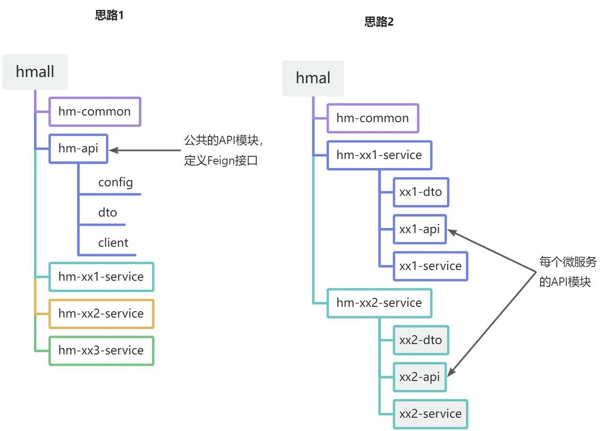

## 什么是微服务？你是怎么理解微服务的？

## 单体应用、SOA、微服务架构有什么区别？

## SpringCloud的组成？

## SpringCloud Alibaba的组成？

## SpringCloud的优缺点？

## SpringCloud与SpringBoot之间的区别？

## Spring、SpringBoot、SpringCloud之间的关系？

## 什么是配置中心？有哪些常见配置中心？

## Nacos配置中心实现原理？

## 为什么需要服务注册发现？

## 为什么需要在微服务中使用链路跟踪？SpringCloud可以选择哪些微服务链路跟踪方案？

## SpringCloud Config是什么？

## 你们的服务是怎么做日志收集的？

## 什么情况下需要使用分布式事务，有哪些解决方案？

## 什么是seata？谈谈你的理解？

## seata支持哪些模式的分布式事务？

## seata的实现原理？

## seata的事务执行流程？

## seata的事务回滚是怎么实现的？

## 微服务带来的挑战？

## 微服务之间的通信方式？微服务之间如何交互？

微服务架构是一种分布式软件设计模式，它将大型应用程序拆分为一组小型服务，每个服务都运行在自己的进程中，并使用轻量级通信机制（如HTTP API）进行通信。

比如一个大型商城项目，我们可以拆分为订单服务、支付服务、购物车服务、商品服务。。。。。

微服务之间的交互通常通过以下几种方式进行：

-   **HTTP REST API**
    -   这是微服务之间最常见的交互方式。每个微服务都暴露一组REST API，供其他微服务调用。
    -   HTTP（HyperText Transfer Protocol）或HTTPS是传输协议的首选，因为它基于开放的标准，可以在多种平台和编程语言中使用。
    -   JSON（JavaScript Object Notation）或XML（eXtensible Markup Language）通常用作数据交换的格式。
-   **gRPC**
    -   gRPC是一个高性能、开源、通用的远程过程调用（RPC）框架，它面向移动和HTTP/2设计。
    -   gRPC使用Protocol Buffers（protobuf）作为接口定义语言（IDL），允许开发者定义服务接口和消息类型，然后可以生成客户端和服务端的代码。
    -   gRPC支持多种编程语言，并且具有比HTTP/REST更低的延迟和更高的吞吐量。
-   **消息队列**（如RabbitMQ, Apache Kafka等）：
    -   消息队列允许微服务之间进行异步通信。生产者将消息发送到队列，消费者从队列中拉取消息并处理。
    -   这种方式特别适用于需要**解耦**、**异步处理**或确保消息**可靠**传递的场景。
    -   消息队列还提供了诸如发布/订阅、消息持久化、负载均衡等高级功能。
-   **服务发现与注册**（如Consul, Eureka等）
    -   在微服务架构中，服务的数量可能是动态的，因此需要一种机制来发现和定位服务实例。
    -   服务注册中心允许服务实例注册自己并提供元数据（如主机名、端口号等）。
    -   客户端使用服务发现机制来查找并连接到所需的服务实例。
-   **API网关**
    -   API网关是微服务架构中的一个重要组件，它位于客户端和微服务之间，负责路由、认证、限流、监控等功能。
    -   客户端通过API网关与服务交互，而无需直接与微服务通信。这降低了客户端的复杂性，并允许引入额外的功能，如统一的身份验证和授权机制。
-   **事件驱动架构 (Event-driven architecture)**
    -   在事件驱动架构中，**微服务通过发布和订阅事件进行通信**。当一个微服务执行某项操作时，它会发布一个事件，其他对该事件感兴趣的微服务会收到通知并执行相应的操作。
    -   这种方式允许微服务之间实现松耦合的通信，并降低了服务之间的依赖关系。
-   使用分布式追踪和监控工具
    -   为了确保微服务之间的交互正常且高效，需要使用分布式追踪和监控工具来跟踪和分析微服务之间的请求和响应。
    -   这些工具可以帮助开发者识别性能瓶颈、故障点和其他潜在问题，并采取相应的措施进行修复和优化。

## 微服务体系如何传递用户信息？

在微服务体系中，用户信息的传递是一个关键的部分，它确保了在多个微服务之间能够正确地识别和处理用户请求。主要有以下几种方式：

**使用令牌（Token）**：

- 当用户登录成功后，服务会生成一个令牌（通常是JWT，即JSON Web Tokens），这个令牌包含了用户的身份信息和有效期等。
- 客户端（如前端应用、移动端应用等）会在后续的请求中，将令牌放入HTTP请求的头部（通常是`Authorization`头，格式为`Bearer <token>`）。
- 微服务之间在调用时，也会将这个令牌作为请求头的一部分传递给下一个服务，从而实现了用户信息的传递。

**通过API网关层处理**：

- API网关是微服务架构中的一个重要组件，它位于客户端和微服务之间，负责请求的路由、认证、限流等功能。
- 客户端的请求会首先到达API网关（如Spring Cloud Gateway），网关会对请求进行验证（如验证令牌的有效性），如果认证成功，会将请求转发给相应的微服务。
- 在请求转发的过程中，API网关可以将用户信息（如用户ID、用户名等）添加到请求头中，或者将用户信息放入请求体中，然后传递给下游的微服务。

**使用分布式追踪系统**：

- 分布式追踪系统（如Zipkin、Jaeger等）可以跟踪微服务之间的调用关系，从而帮助开发者理解用户请求在整个系统中的处理流程。
- 在这个过程中，用户的身份信息也可以被传递和记录，以便在出现问题时能够快速地定位和解决。

**ThreadLocal存储**：

- 在某些情况下，为了在不同的线程之间传递用户信息，可以使用Java中的ThreadLocal类来存储用户信息。
- 当一个请求到达某个微服务时，可以从请求头或请求体中获取用户信息，并将其存储在ThreadLocal中。然后，在这个微服务的后续处理过程中，就可以通过ThreadLocal方便地获取用户信息了。

**服务之间通信机制**：

- 微服务之间的通信通常通过RESTful API、gRPC等方式进行。在这些通信机制中，用户信息可以作为请求的一部分进行传递。
- 例如，在RESTful API中，可以将用户信息放入HTTP请求的头部或请求体中；在gRPC中，可以将用户信息放入消息体中进行传递。

## 分布式和微服务的区别？

## 现在流行的微服务框架？

## 微服务架构是如何运行的？

## SpringCloud有哪些注册中心？

## 什么Eureka？

## Eureka的实现原理？

## Eureka的自我保护模式是什么？

## Eureka的高可用是怎么实现的？

## SpringCloud是如何实现服务注册的？

## Eureka和Zookeeper的区别？

## Consul是什么？

## Eureka、Zookeeper、Consul的区别？

## Eureka、Zookeeper、Nacos的区别？

## Eureka、Zookeeper、Nacos注册中心的区别？

## Nacos的服务注册表结构是什么样的？

## Nacos中的Namespace是什么？如何使用它来组织和管理微服务？

## 为什么需要负载均衡？

## 在SpringCloud中怎么使用服务的负载均衡？

## 负载均衡的实现方式有哪些？

## 负载均衡有什么策略？

## Ribbon和Nginx的区别？

## Http和RPC的区别？

Http和RPC是两种常见的通信协议。

Http接口：

## Ribbon和Feign调用服务的区别是什么？

## 什么是Feign？

## Feign和OpenFeign的区别？

## Feign和Dubbo的区别？

## Feign是如何实现负载均衡的？

## 为什么Feign第一次调用耗时很长？

## OpenFeign最佳实践？

以黑马商城举例

将来我们要把与下单有关的业务抽取为一个独立微服务:`trade-service`，不过我们先来看一下`hm-service`中原本与下单有关的业务逻辑。

入口在`com.hmall.controller.OrderController`的`createOrder`方法，然后调用了`IOrderService`中的`createOrder`方法。

由于下单时前端提交了商品id，为了计算订单总价，需要查询商品信息：

也就是说，如果拆分了交易微服务（`trade-service`），它也需要远程调用`item-service`中的根据id批量查询商品功能。这个需求与`cart-service`中是一样的。

因此，我们就需要在`trade-service`中再次定义`ItemClient`接口，这不是重复编码吗？ 有什么办法能加避免重复编码呢？

**思路分析**

相信大家都能想到，避免重复编码的办法就是**抽取**。不过这里有两种抽取思路：

-   思路1：抽取到微服务之外的公共module
-   思路2：每个微服务自己抽取一个module

如图：

方案1抽取更加简单，工程结构也比较清晰，但缺点是整个项目耦合度偏高。（适用于聚合模块）

方案2抽取相对麻烦，工程结构相对更复杂，但服务之间耦合度降低。（适用于每个模块都是独立的project。但是比较合理，因为开发这个微服务的开发者必然对这个服务比较熟悉，由他开写rpc也自然是最合适的）

**总结**

OpenFeign使用的**最佳实践方式**是什么？

-   由服务提供者编写独立module，将FeignClient及DTO抽取

其实这里有两种方案。

-   一：在每个微服务都是独立的project前提下，服务提供者编写独立module（子module），将FeignClient及DTO抽取在这个module中，其他微服务需要发起远程调用时，引入这个module
    -   优点：耦合度较低。服务提供者对服务比较熟悉，编写出来的代码不容易出bug
    -   缺点：相对麻烦，工程结构相对更复杂
-   二：在使用maven聚合模块的前提下，抽取出一个公共module，将所有FeignClient及DTO抽取在这个module中
    -   优点：抽取更加简单，工程结构也比较清晰
    -   缺点：整个项目耦合度偏高

将FeignClient抽取为独立module，SpringBootApplication启动类扫描不到时，无法注入Bean

解决方案如下：

## RPC层为什么建议防腐？

## 什么是断路器？为什么需要断路器？

## 什么是Hystrix？

## 微服务雪崩是什么？

## 什么是服务降级？

## 什么是服务熔断？

## 什么是服务限流？

## 什么是降级熔断？为什么需要熔断降级？

## 熔断降级有哪些方案？

## Hystrix是怎么实现服务容错的？

## Sentinel是怎么实现限流的？

## Sentinel与Hystrix的区别？

## Sentinel是怎么实现集群限流的？

## 什么是服务网络？

## 什么是灰度发布、金丝雀部署以及蓝绿部署？

## 说说什么是API网关？它有什么作用？

## 什么是微服务网关？为什么需要服务网关？

## SpringCloud可以选择哪些API网关？

## 什么是SpringCloud Zuul？

## 什么是SpringCloud Gateway？

## 说说SpringCloud Gateway核心概念？

## 你的项目为什么使用SpringCloud Gateway作为网关？

## SpringCloud Gateway与Zuul的区别？

## SpringCloud Gateway与Dubbo的区别？

## 什么是令牌桶算法？工作原理是什么？使用它有什么优点和注意事项？

# Dubbo篇

## Dubbo的负载均衡是如何实现的？服务端挂了怎么避免被调用到？

