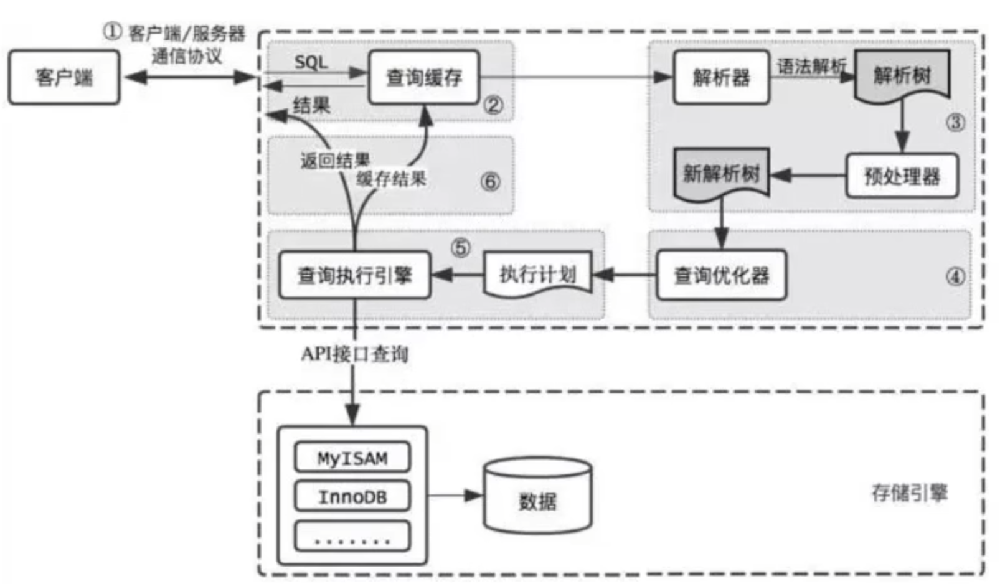

## MySQL事务的四大特性？

**口语化表述**

MySQL事务的四大特性就是ACID，分别是原子性、一致性、隔离性、持久性。其中原子性就是确保事务中的所有操作要么全部成功，要么全部失败；一致性是指数据库从一个一致性的状态转换到另外一个一致性的状态；隔离性确保并发执行的事务彼此隔离开来，避免相互干扰；持久性确保事务一旦提交，其结果是永久性的。

-   **1、原子性（Atomicity）**

定义：事务是一个不可分割的最小工作单元。原子性确保事务中的所有操作要么全部完成，要么全部不完成。

保证：如果事务在执行过程中遇到错误或中断，整个事务将被回滚（Rollback），以确保数据库状态不会部分更新。

例子：假设有一个银行转账操作，事务包括从账户A中扣钱和向账户B中加钱。如果任何一个操作失败，整个事务都会回滚，账户A和账户B的余额不会发生变化。

-   **2、一致性（Consistency）**

定义：一致性确保事务在完成后，数据库从一个一致状态转换到另一个一致状态。即事务开始前和结束后，数据库的完整性约束没有被破坏。

保证：事务执行过程中，任何中间状态对外部都是不可见的，只有当事务成功提交后，结果才会对其他事务可见

例子：在银行转账操作中，一致性确保转账后总金额保持不变。如果账户A减少了100元，账户B就应该增加100元。

-   **3、隔离性（Isolation）**

定义：隔离性确保并发执行的事务彼此隔离开来，避免相互干扰。不同的事务之间的操作是互不可见的，直到事务提交。

保证：通过不同的隔离级别（如读未提交、读已提交、可重复读、串行化）来控制并发事务之间的可见性和冲突。

**隔离级别**：

1.  **读未提交（Read Uncommitted）**：允许一个事务可以读到另一个未提交事务的数据，**可能导致脏读**。
2.  **读已提交（Read Committed）**：一个事务只能读到已提交事务的数据，避免脏读。
3.  **可重复读（Repeatable Read）**：一个事务在整个过程中看到的数据是一致的，避免不可重复读。
4.  **串行化（Serializable）**：最高隔离级别，事务完全串行化执行，完全避免了并发问题，但性能较低。

-   **4、持久性（Durability）**

定义：持久性确保事务一旦提交，其结果是永久性的，即使系统发生故障，数据也不会丢失。

保证：通过日志记录和定期备份等机制，确保事务提交后的数据能够持久保存。

例子：在银行转账操作中，一旦事务提交，转账操作的结果（账户A和账户B的余额变化）将永久保存在数据库中，即使之后系统崩溃，数据也不会丢失。


## MySQL的事务隔离级别？

MySQL 主要支持四种事务隔离级别，分别是读未提交、读已提交、可重复读和串行化。

简单来说，**读未提交**就是一个事务可以读取另一个未提交事务的数据，可能导致脏读，即一个事务读取了另一个事务未提交的数据。如果该事务回滚，那么读到的数据将是无效的。

**读已提交**是说一个事务只能读取已经提交的事务的数据。这样可以避免脏读，但可能会出现不可重复读，即A事务读取完数据后B事务提交数据，A事务再次读取的数据和上次不相同

**可重复读**是说一个事务在整个过程中多次读取同一行数据时，结果是相同的。可以避免脏读和不可重复读，但可能会出现幻读。

**串行化**，这种级别下，事务完全串行化执行，避免了脏读、不可重复读和幻读。代价是并发性大大降低，事务可能会因为锁等待而阻塞。


**读未提交（READ UNCOMMITTED）**

-   最低隔离级别：允许一个事务读取其他事务尚未提交的数据。
-   这种情况下可能会发生**脏读**（Dirty Reads），即一个事务可以读取到另一个事务中未提交的数据。
-   是四种隔离级别中并发性能最好的，但数据安全性最差。
-   使用场景：极少使用，因为可能会导致数据不一致的问题。

```mysql
SET TRANSACTION ISOLATION LEVEL READ UNCOMMITTED;
```

补充：

​	**脏读**：一个事务读取了另一个事务未提交的数据。如果该事务回滚，那么读到的数据将是无效的。

**读已提交（READ COMMITTED ）**

-   一个事务只能读取已经提交的数据。
-   避免了脏读的发生，但仍然可能出现**不可重复读**（Non-Repeatable Reads）和“幻读”（Phantom Reads）。
-   每次查询都会读取最新的已提交数据。
-   使用场景：适用于大多数应用程序，尤其是那些对数据一致性要求较高但可以容忍不可重复读的情况。

```mysql
SET TRANSACTION ISOLATION LEVEL READ COMMITTED;
```

补充：

​	**不可重复读**：一个事务在读取同一行数据时，可能因为另一个事务的提交而得到不同的结果。

**可重复读（REPEATABLE READ ）**

-   MySQL **InnoDB 默认的隔离级别**。
-   在同一个事务中的多次查询返回相同的结果集，即使在这期间有其他事务对数据进行了修改并提交。
-   能够防止脏读和不可重复读，但仍然可能出现**幻读**（Phantom Read）。
-   InnoDB 存储引擎通过多版本并发控制（**MVCC**）来实现这一级别。
-   使用场景：适用于需要保证数据一致性的场景，例如银行系统、金融交易等。

```mysql 
SET TRANSACTION ISOLATION LEVEL REPEATABLE READ;
```

补充：

​	**幻读**：一个事务在读取某个范围内的行时，另一个事务在该范围内插入了新的行（或删除了行），导致前一个事务再次读取时发现了“幻影”行

**串行化（SERIALIZABLE ）**

-   最高的隔离级别。
-   事务被强制按顺序执行，完全避免了并发操作带来的问题，如脏读、不可重复读和幻读。
-   但是，这种隔离级别可能会导致大量的锁定，从而降低了系统的并发性能。
-   使用场景：适用于对数据一致性要求极高的场景，例如在线拍卖系统、库存管理系统等。

```mysql
SET TRANSACTION ISOLATION LEVEL SERIALIZABLE;
```

设置 MySQL 事务隔离级别的示例：

```mysql
-- 设置全局事务隔离级别为可重复读 
SET GLOBAL TRANSACTION ISOLATION LEVEL REPEATABLE READ;
-- 设置当前会话的事务隔离级别为读已提交 
SET SESSION TRANSACTION ISOLATION LEVEL READ COMMITTED;
-- 开始事务 
START TRANSACTION;
-- 在事务内进行操作 
SELECT * FROM accounts WHERE account_id ='A';
-- 提交事务 
COMMIT;

-- 查看当前会话事务隔离级别 
SELECT @@session.transaction_isolation;
-- 查看全局会话事务隔离级别 
SELECT @@global.transaction_isolation;
```

小结：

选择合适的事务隔离级别取决于你的应用程序的具体需求和性能考虑：

-   如果你需要最高的数据一致性，可以选择 SERIALIZABLE，但要注意其性能开销。
-   如果你希望在性能和一致性之间取得平衡，REPEATABLE READ 是一个不错的选择。
-   如果你能容忍不可重复读，READ COMMITTED 可能更合适。
-   避免使用 READ UNCOMMITTED，除非你明确知道其风险并愿意接受潜在的数据不一致性

​	选择合适的隔离级别需要权衡数据一致性和系统性能之间的关系。对于大多数应用，默认的可重复读隔离级别已经能够提供足够的数据一致性和并发性能。

| **隔离级别**                | **脏读** | **不可重复读** | **幻读** |
| --------------------------- | -------- | -------------- | -------- |
| Read uncommitted (读未提交) | 存在     | 存在           | 存在     |
| Read committed (读已提交)   | ×        | 存在           | 存在     |
| Repeatable read (可重复读)  | ×        | ×              | 存在     |
| Serializable (串行化)       | ×        | ×              | ×        |


## 什么是脏读、幻读、不可重复读？

**脏读**

定义：脏读是指一个事务能够读取到另一个事务修改的数据，且修改暂未提交。如果该未提交的事务后来回滚（rollback），那么第一个事务读取到的数据就是无效的或“脏”的。

例如：

​	张三的工资为5000，事务A中把他的工资改为8000，但事务A尚未提交。

​	与此同时，事务B正在读取张三的工资，读取到张三的工资为8000。

​	随后，事务A发生异常，而回滚了事务。张三的工资又回滚为5000。

​	最后，事务B读取到的张三工资为8000的数据即为脏数据，事务B做了一次脏读。

**不可重复读**

定义：是指在一个事务内，多次读同一数据。在这个事务还没有结束时，另外一个事务也访问该同一数据。那么，在第一个事务中的两次读数据之间，由于第二个事务的修改，那么第一个事务两次读到的的数据可能是不一样的。也就是说，**在同一个事务中，两次读取同一行数据得到的结果不同**。

例如：

​	在事务A中，读取到张三的工资为5000，操作没有完成，事务还没提交。

​	与此同时，事务B把张三的工资改为8000，并提交了事务。

​	随后，在事务A中，再次读取张三的工资，此时工资变为8000。在一个事务中前后两次读取的结果并不致，导致了不可重复读。

**幻读**

定义：幻读是指在一个事务内多次执行相同的查询时，由于其他事务插入或删除了数据行，导致查询结果集发生变化。具体来说，幻读表现为第一次查询时某些行不存在，而第二次查询时这些行出现了，或者相反。

例如：

​	目前工资为5000的员工有10人，事务A读取所有工资为5000的人数为10人。

​	此时，事务B插入一条工资也为5000的记录。

​	这是，事务A再次读取工资为5000的员工，记录为11人。此时产生了幻读。


## 不可重复读和幻读有什么区别

不可重复读的重点是修改：同样的条件，你读取过的数据，再次读取出来发现值不一样了

幻读的重点在于新增或者删除：同样的条件，第 1 次和第 2 次读出来的记录数不一样。

| 特性     | 不可重复读（Non-Repeatable Read）          | 幻读（Phantom Read）                               |
| -------- | ------------------------------------------ | -------------------------------------------------- |
| 定义     | 同一行数据在同一个事务中多次读取结果不一致 | 相同查询在同一个事务中多次执行结果集不同           |
| 原因     | 其他事务修改了同一行数据                   | 其他事务插入或删除了符合条件的行                   |
| 解决方案 | 使用可重复读或序列化隔离级别               | 使用序列化隔离级别，某些数据库的可重复读也防止幻读 |
| 影响范围 | 单个行的数据变化                           | 查询结果集的变化（涉及多行）                       |


## MySQL的存储引擎有哪些？有什么区别？

**InnoDB**

-   **默认存储引擎**：自 MySQL **5.5** 版本起成为默认存储引擎。
-   **事务支持**：支持 ACID（原子性、一致性、隔离性、持久性）事务。
-   **行级锁**：提高并发性能，适合高并发读写操作。
-   **外键支持**：支持外键约束，确保数据完整性。
-   **崩溃恢复**：具有自动崩溃恢复功能。
-   **全文索引**：从 MySQL 5.6 开始支持全文索引。

**MyISAM**

-   非事务型存储引擎：**不支持事务**，但读取速度较快。
-   **表级锁**：在并发写入时性能较差，适合以读操作为主的场景。
    -   不支持行级锁
-   **全文索引**：支持全文索引，适合用于搜索引擎等应用。
-   **压缩表**：支持创建压缩只读表，节省磁盘空间。

补充：MySQL早期的默认存储引擎，项目开发中更多情况下被NoSQL取代

**MEMORY（HEAP）**

-   **内存表**：所有数据都存储在内存中，提供极高的读写速度。
-   **临时数据**：适用于需要快速访问的临时数据，如会话信息。
-   **表级锁**：使用表级锁，不适合高并发写入。
-   **非持久化**：重启后数据丢失，因此不适合持久化存储。

补充：项目开发中更多情况下被Redis取代

| 特点         | InnoDB           | MyISAM | Memory |
| ------------ | ---------------- | ------ | ------ |
| 存储限制     | 64TB             | 有     | 有     |
| 事务支持     | ✔                | x      | x      |
| 锁机制       | 表级锁、行级锁   | 表级锁 | 表级锁 |
| B+tree索引   | ✔                | ✔      | ✔      |
| Hash索引     | x                | x      | ✔      |
| 全文索引     | ✔（5.6版本开始） | ✔      | x      |
| 空间使用     | 高               | 低     | N/A    |
| 内存使用     | 高               | 低     | 中等   |
| 批量插入速度 | 低               | 高     | 高     |
| 外键支持     | ✔                | x      | x      |


除了InnoDB、MyISAM、Memory，还有如下存储引擎，了解即可

**ARCHIVE**

-   归档存储：主要用于存储大量历史数据，适合日志记录等场景。
-   压缩存储：数据被压缩存储，节省磁盘空间。
-   只读操作：仅支持插入

**CSV**

-   CSV 文件存储：将数据存储为 CSV 文件格式，便于与其他应用程序交换数据。
-   简单结构：适合简单的数据导入导出操作。
-   无索引：不支持索引，查询性能较低。
-   有限功能：功能有限，主要用于数据迁移或备份。

**BLACKHOLE**

-   **黑洞存储引擎**：所有插入的数据都被丢弃，类似于 **/dev/null**。
-   日志记录：可用于测试或调试，例如模拟 SQL 语句的日志记录。
-   无数据存储：不存储任何实际数据，查询总是返回空结果集。

**FEDERATED**

-   远程表访问：允许通过本地表访问远程 MySQL 数据库中的表。
-   分布式查询：适合分布式数据库环境，可以跨多个服务器进行查询。
-   性能开销：由于涉及网络通信，性能可能受到影响。

**NDB Cluster (NDB)**

-   集群存储引擎：用于 MySQL Cluster，提供高可用性和分布式处理能力。
-   分布式架构：数据分布在多个节点上，适合高可用性和容错需求。
-   实时应用：适用于需要低延迟和高可用性的实时应用。
-   复杂配置：配置和管理相对复杂，适合有经验的管理员。

**MERGE**

-   合并多个 MyISAM 表：将多个 MyISAM 表逻辑上合并为一个表，便于管理和查询。
-   统一视图：提供对多个表的统一视图，简化查询操作。
-   限制：只能合并 MyISAM 表，且不支持事务。

**PERFORMANCE_SCHEMA**

-   性能监控：用于收集和分析 MySQL 性能数据，帮助优化数据库性能。
-   内部使用：主要用于内部性能监控，不适合用户数据存储。


## MySQL中InnoDB和MyISAM的区别？

MyISAM和InnoDB都是mysql的存储引擎。

mysql5.5之前，默认的存储引擎是MyISAM，从5.5之后，默认的是InnoDB。

MyISAM 适用于**读多**写少的场景，如数据仓库、日志分析等；InnoDB 适用于事务密集型和高并发场景，如在线交易系统、社交网络等。

-   **事务支持**：
    -   MyISAM 不支持事务，无法进行回滚和提交操作；
    -   InnoDB 支持**事务**，提供 ACID 特性（原子性、一致性、隔离性、持久性）。

-   **锁机制**：
    -   MyISAM 使用**表级锁**，每次操作都会锁定整个表，适合读多写少的应用；
    -   InnoDB 使用**行级锁**，每次操作只锁定相关的行，适合高并发和写操作频繁的应用。

-   **外键支持**：
    -   MyISAM 不支持外键，无法在表间建立引用完整性约束；
    -   InnoDB **支持外键**，可以在表间建立引用完整性约束，保证数据的一致性和完整性。

-   **全文索引**：
    -   MyISAM 原生支持全文索引，适合需要全文搜索的应用；
    -   InnoDB 从 **MySQL 5.6 开始支持全文索引**，但性能和功能上仍不如 MyISAM。

-   **数据存储结构**：
    -   MyISAM 将数据存储在三个文件中（`.frm`文件存储表结构，`.MYD`文件存储数据，`.MYI`文件存储索引）；
    -   InnoDB 将**数据和索引**存储在表空间文件中，支持自动扩展和多表空间。（`.frm`文件存储表结构定义、`.idb`文件存储数据和索引）

-   **崩溃恢复**：
    -   MyISAM 只支持基于表的崩溃恢复，恢复过程较慢且不完全；
    -   InnoDB 支持**自动崩溃恢复**，通过重做日志和回滚日志实现快速和完整的恢复。

-   **性能特点**：
    -   MyISAM 在读多写少场景下性能优越，查询速度快，占用资源少；
    -   InnoDB 在高并发和事务密集型场景下性能优越，写操作和并发处理能力强。

-   **存储空间**：
    -   MyISAM 存储空间效率较高，数据文件较小；
    -   InnoDB 可能占用更多存储空间，特别是需要存储事务日志和外键约束信息。

-   **表的大小限制**：
    -   MyISAM 受文件系统限制，单个表最大可达 256TB（取决于文件系统）；
    -   InnoDB 最大表大小可达 **64TB**，适合处理大规模数据集。

-   **适用场景**：
    -   MyISAM 适用于读多写少的场景，如数据仓库、日志分析等；
    -   InnoDB 适用于事务密集型和高并发场景，如在线交易系统、社交网络等。


## 存储引擎应该如何选择？

三点主要原则：

​	1、 需要事务支持必选InnoDB，不需要事务选择MyISAM

​	2、如果表的大部分操作都是查询，数据不大，并发不大，可以考虑选择MyISAM，但是一般还是选择 innodb，有写又有读则选择InnoDB

​	3、如果系统奔溃导致数据难以恢复，且成本高，选择 innodb


选择 MySQL 的存储引擎时，应根据具体应用场景、性能需求、数据完整性要求等因素进行综合考虑。

1.  **事务支持**：InnoDB 支持事务和 ACID 特性，适合需要事务支持的应用；MyISAM 不支持事务，适合对数据完整性要求不高的应用。
2.  **锁机制**：InnoDB 使用**行级锁**，**适合高并发和频繁写操作**；MyISAM 使用表级锁，适合读多写少的场景。
3.  **外键支持**：InnoDB 支持外键约束，保证数据的一致性和完整性；MyISAM 不支持外键。
4.  **全文索引**：MyISAM 原生支持全文索引，适合需要全文搜索的应用；InnoDB 从 MySQL 5.6 开始支持全文索引，但性能可能不如 MyISAM。
5.  **崩溃恢复**：**InnoDB 支持自动崩溃恢复**，通过重做日志和回滚日志实现快速恢复；MyISAM 只支持基于表的崩溃恢复，恢复过程较慢且不完全。
6.  **存储空间**：InnoDB 可能占用更多存储空间，但支持更大的表（最大表大小可达 64TB）；MyISAM 存储空间效率较高，数据文件较小，但受文件系统限制（单个表最大可达 256TB）。
7.  **读写性能**：InnoDB 在高并发和事务密集型场景下性能优越，写操作和并发处理能力强；MyISAM 在读多写少场景下性能优越，查询速度快，占用资源少。
8.  **数据备份和恢复**：InnoDB 支持热备份和在线备份，适合需要不间断服务的应用；MyISAM 备份和恢复相对简单，但需要停机操作，适合对服务连续性要求不高的应用。
9.  **其他存储引擎**：Memory 适合需要极高读写性能且数据不持久存储的场景；Archive 适合存储大量历史数据，支持高效的插入操作；NDB 适合需要高可用性和分布式存储的场景。


## InnoDB引擎的4大特性？

>
>   本题较难，5 年以下不必在意。
>

**插入缓冲(insert buffer)** 

提升插入性能，change buffering是insert buffer的加强，insert buffer只针对insert有效，change buffering对insert、delete、update(delete+insert)、purge都有效

只对于非聚集索引（非唯一）的插入和更新有效，对于每一次的插入不是写到索引页中，而是先判断插入的非聚集索引页是否在缓冲池中，如果在则直接插入；若不在，则先放到Insert Buffer 中，再按照一定的频率进行合并操作，再写回disk。这样通常能将多个插入合并到一个操作中，目的还是为了减少随机IO带来性能损耗。

**二次写(double write)** 

Doublewrite缓存是位于系统表空间的存储区域，用来缓存InnoDB的数据页从innodb buffer pool中flush之后并写入到数据文件之前，所以当操作系统或者数据库进程在数据页写磁盘的过程中崩溃，Innodb可以在doublewrite缓存中找到数据页的备份而用来执行crash恢复。数据页写入到doublewrite缓存的动作所需要的IO消耗要小于写入到数据文件的消耗，因为此写入操作会以一次大的连续块的方式写入

在应用（apply）重做日志前，用户需要一个页的副本，当写入失效发生时，先通过页的副本来还原该页，再进行重做，这就是double write。

**自适应哈希索引(Adaptive Hash index)** 

Adaptive Hash index属性使得InnoDB更像是内存数据库。该属性通过innodb_adapitve_hash_index开启，也可以通过—skip-innodb_adaptive_hash_index参数关闭；

Innodb存储引擎会监控对表上二级索引的查找，如果发现某二级索引被频繁访问，二级索引成为热数据，建立哈希索引可以带来速度的提升

经常访问的二级索引数据会自动被生成到hash索引里面去(最近连续被访问三次的数据)，自适应哈希索引通过缓冲池的B+树构造而来，因此建立的速度很快。哈希（hash）是一种非常快的等值查找方法，在一般情况下这种查找的时间复杂度为O(1)，即一般仅需要一次查找就能定位数据。而B+树的查找次数，取决于B+树的高度，在生产环境中，B+树的高度一般3-4层，故需要3-4次的查询。

innodb会监控对表上个索引页的查询。如果观察到建立哈希索引可以带来速度提升，则自动建立哈希索引，称之为自适应哈希索引（Adaptive Hash Index，AHI）。AHI有一个要求，就是对这个页的连续访问模式必须是一样的。

**预读(read ahead)**  

InnoDB使用两种预读算法来提高I/O性能：线性预读（linear read-ahead）和随机预读（randomread-ahead）为了区分这两种预读的方式，我们可以把线性预读放到以extent为单位，而随机预读放到以extent中的page为单位。线性预读着眼于将下一个extent提前读取到buffer pool中，而随机预读着眼于将当前extent中的剩余的page提前读取到buffer pool中。

**线性预读(linear read-ahead)**  

方式有一个很重要的变量控制是否将下一个extent预读到buffer pool中，通过使用配置参数innodb_read_ahead_threshold，可以控制Innodb执行预读操作的时间。如果一个extent中的被顺序读取的page超过或者等于该参数变量时，Innodb将会异步的将下一个extent读取到buffer pool中，innodb_read_ahead_threshold可以设置为0-64的任何值，默认值为56，值越高，访问模式检查越严格例如，如果将值设置为48，则InnoDB只有在顺序访问当前extent中的48个pages时才触发线性预读请求，将下一个extent读到内存中。如果值为8，InnoDB触发异步预读，即使程序段中只有8页被顺序访问。你可以在MySQL配置文件中设置此参数的值，或者使用SET GLOBAL需要该SUPER权限的命令动态更改该参数。在没有该变量之前，当访问到extent的最后一个page的时候，Innodb会决定是否将下一个extent放入到buffer pool中。

**随机预读（randomread-ahead）**

随机预读方式则是表示当同一个extent中的一些page在buffer pool中发现时，Innodb会将该extent中的剩余page一并读到buffer pool中，由于随机预读方式给Innodb code带来了一些不必要的复杂性，同时在性能也存在不稳定性，在5.5中已经将这种预读方式废弃。要启用此功能，请将配置变量设置innodb_random_read_ahead为ON。


## InnoDB 的双写缓冲是什么？


## 什么是自适应hash索引?


## MySQL使用规范你觉得都有什么?

**数据库设计规范**

-    **遵循三范式**：根据业务需求，合理选择符合一定范式（如1NF、2NF、3NF或BCNF）进行表结构设计，减少数据冗余，增强数据的一致性。
-   **表命名规范**：采用有意义的、区分大小写的表名，通常使用小写字母，并用下划线`_`分隔单词，如`user_info`
-   **字段命名规范**：同样遵循有意义的命名原则，使用小写字母加下划线，避免使用数据库保留字。

**索引设计规范**

-   **适度索引**：为频繁查询和参与JOIN操作的字段创建索引，但需注意过多的索引会影响插入、删除和更新操作的性能。
-   **索引类型选择**：根据数据特性和查询需求选择合适的索引类型。如BTREE索引适用于范围查询，哈希索引适合等值查询。
-   **复合索引**：合理安排复合索引中字段的顺序，一般将区分度高的字段放在前面以提高索引利用率。

**SQL编写规范**

-   **避免SELECT \***：明确指定需要查询的字段，减少不必要的数据传输量。

-   **使用参数化查询**：防止SQL注入攻击，提高代码安全性和可读性。

-   **事务处理**：对相关操作使用事务管理，确保数据一致性，尤其是在涉及多表操作时

**数据类型选择**

-   根据实际存储需求选择最合适的的数据类型，避免过度使用大容量类型，比如合理使用`INT`而非`BIGINT`，使用`VARCHAR`并限制长度而非无限制的`TEXT`。

**性能优化**

-   **查询优化**：利用`EXPLAIN`分析查询计划，优化复杂的查询语句，**减少子查询的使用**，适当情况下使用连接（JOIN）代替，以确保查询效率。
-   **定期分析和优化表**：使用`ANALYZE TABLE`和`OPTIMIZE TABLE`命令来分析表的状态并进行必要的优化。
-   **定期进行数据库备份**，包括全备和增量备份，确保在数据丢失或损坏时能够快速恢复
-   **批量操作**
    -   批量插入或更新数据，减少事务开销。
    -   使用 LOAD DATA INFILE 或 INSERT ... VALUES 进行大批量插入。
-   **缓存机制**：
    -   合理配置查询缓存（虽然在 MySQL 8.0 中已移除，但在某些版本中仍可使用）。
    -   使用应用层缓存（如 **Redis**、Memcached）来减轻数据库压力。

**安全管理**

-   **最小权限原则**：为不同用户或应用分配仅满足其功能所需的最小权限。
-   定期审查和清理不必要的用户和权限。

-   **加密敏感数据**：对敏感信息如密码进行加密存储，不直接保存明文

**监控与日志**

-   启用并监控MySQL的日志系统（如错误日志、慢查询日志），及时发现并解决问题。


## 创建数据库表要注意什么？


## 数据库的三大范式是什么？

数据库设计中的三范式（3NF）是关系数据库理论中的一种规范化标准，用于**减少数据冗余和提高数据一致性**。

**第一范式 (1NF)**

-   **原子性**：确保每个字段都是不可分割的基本数据项。

-   **唯一性**：表中的每一列都必须是唯一的，不能有重复的列。

-   **消除重复组**：不允许存在多值属性或重复组。

**第二范式（2NF）**

-   满足第一范式：表必须先符合第一范式的要求。
-   **完全依赖**：非主键字段必须完全依赖于主键，而不能部分依赖于主键的一部分（即不存在部分函数依赖）。这通常意味着需要将多值依赖的数据拆分到多个表中。
    -   如果主键是复合主键，就要注意是否有部分依赖

**第三范式（3NF）**

-   满足第二范式：表必须先符合第二范式的要求。
-   **无传递依赖**：非主键字段之间不能存在传递依赖关系，即一个非主键字段不能依赖于另一个非主键字段。所有非主键字段应该直接依赖于主键。

**总结**

-   第一范式1NF的核心原则就是：**属性不可切割**

-   第二范式2NF的核心原则就是：**不能存在 ”部分函数依赖“**

-   第三范式3NF的核心原则就是：**不能存在传递函数依赖**

示例

现有一张表，如下

| 学号           | 姓名   | 系名   | 系主任 | 课名           | 分数 |
| -------------- | ------ | ------ | ------ | -------------- | ---- |
| **1022211101** | 李小明 | 经济系 | 王强   | **高等数学**   | 95   |
| **1022211101** | 李小明 | 经济系 | 王强   | **大学英语**   | 87   |
| **1022211101** | 李小明 | 经济系 | 王强   | **普通化学**   | 76   |
| **1022211102** | 张莉莉 | 经济系 | 王强   | **高等数学**   | 72   |
| **1022211102** | 张莉莉 | 经济系 | 王强   | **大学英语**   | 98   |
| **1022211102** | 张莉莉 | 经济系 | 王强   | **计算机基础** | 88   |
| **1022511101** | 高芳芳 | 法律系 | 刘玲   | **高等数学**   | 82   |
| **1022511101** | 高芳芳 | 法律系 | 刘玲   | **法学基础**   | 82   |

**完全依赖**

​	设X、Y是关系R的两个属性集合，X’ 是 X的真子集，存在 X -> Y，但对每一个 X’ 都有 X‘ !-> Y，则称Y完全依赖于X。

说人话：

​	 比如，通过**(学号, 课名) 推出分数**，但是**单独用学号推断不出分数**，那么就可以说：**分数完全依赖于(学号, 课名)**

即，通过AB能推断出C，但是AB单独推断不出C，那么说C完全依赖与AB

**部分依赖**

​	设Y函数依赖与X，但同时Y并不完全函数依赖与X，那么我们就称Y部分函数依赖于X。

说人话：

​	 比如，通过**(学号, 课名) 推出姓名**，因为其实**直接可以通过学号推断出姓名**，所以：**姓名 部分依赖于(学号, 课名)** 

即，通过AB能推断出C，但是通过A也能推断出C，或者通过B也能推断出C，那么说C部分依赖与AB

**传递函数依赖**

​	传递函数依赖：设X、Y、Z是关系R中互不相同的属性集合，存在 X -> Y（Y !->X）,Y -> Z，则称Z传递函数依赖于X。

说人话：

​	 比如，**学号 推断出 系名，系名 推断出 系主任**，但是**，系主任 推断不出 学号，系主任也要依赖于系名**。这种情况下可以说 **系主任 传递依赖于 学号**

即，通过A得到B，通过B得到C，但是C得不到A，那么就可以说C 传递依赖于 A

**第一范式**

第一范式1NF的核心原则就是：**属性不可切割**

| ID   | 商品        | 商家ID    | 用户ID |
| ---- | ----------- | --------- | ------ |
| 001  | **5台电脑** | XXX旗舰店 | 00001  |

​	很明显，上表不符合第一范式，商品列的数据不是原子数据项，是可以进行分割，因此需要对表格进行优化，让表格符合第一范式，如下

| ID   | 商品     | 数量 | 商家ID    | 用户ID |
| ---- | -------- | ---- | --------- | ------ |
| 001  | **电脑** | 5    | XXX旗舰店 | 00001  |

​	实际上，**1NF是所有关系型数据库的最基本要求**，你在关系型数据库管理系统（RDBMS），例如MySQL、Oracle等创建数据表时，**如果数据表的设计不符合最基本的要求，那么操作也一定是不能成功的**。也就是说，只要是RBDMS中存在的表，一定是符合1NF的。

**第二范式**

第二范式2NF的核心原则就是：**不能存在 ”部分函数依赖“**

| 学号           | 姓名   | 系名   | 系主任 | 课名           | 分数 |
| -------------- | ------ | ------ | ------ | -------------- | ---- |
| **1022211101** | 李小明 | 经济系 | 王强   | **高等数学**   | 95   |
| **1022211101** | 李小明 | 经济系 | 王强   | **大学英语**   | 87   |
| **1022211101** | 李小明 | 经济系 | 王强   | **普通化学**   | 76   |
| **1022211102** | 张莉莉 | 经济系 | 王强   | **高等数学**   | 72   |
| **1022211102** | 张莉莉 | 经济系 | 王强   | **大学英语**   | 98   |
| **1022211102** | 张莉莉 | 经济系 | 王强   | **计算机基础** | 88   |
| **1022511101** | 高芳芳 | 法律系 | 刘玲   | **高等数学**   | 82   |
| **1022511101** | 高芳芳 | 法律系 | 刘玲   | **法学基础**   | 82   |

​	以上表格明显存在，部分函数依赖。比如，这张表的**主键是(学号, 课名)**，分数确实完全依赖于(学号, 课名)，但是姓名并不完全依赖于(学号, 课名)，我们直接通过**学号 就可以推断出 姓名，所以存在部分函数依赖**

优化如下，拆分称两个表

| 学号           | 课名           | 分数 |
| -------------- | -------------- | ---- |
| **1022211101** | **高等数学**   | 95   |
| **1022211101** | **大学英语**   | 87   |
| **1022211101** | **普通化学**   | 76   |
| **1022211102** | **高等数学**   | 72   |
| **1022211102** | **大学英语**   | 98   |
| **1022211102** | **计算机基础** | 88   |
| **1022511101** | **高等数学**   | 82   |
| **1022511101** | **法学基础**   | 82   |

| 学号           | 姓名   | 系名   | 系主任 |
| -------------- | ------ | ------ | ------ |
| **1022211101** | 李小明 | 经济系 | 王强   |
| **1022211102** | 张莉莉 | 经济系 | 王强   |
| **1022511101** | 高芳芳 | 法律系 | 刘玲   |

通过以上拆分后，符合第二范式，去除了部分函数依赖

**第三范式**

第三范式3NF的核心原则就是：**不能存在传递函数依赖**

在下面这张表中，存在传递函数依赖：学号 -> 系名 -> 系主任 ，但是系主任 推不出 学号 

| 学号           | 姓名   | 系名   | 系主任 |
| -------------- | ------ | ------ | ------ |
| **1022211101** | 李小明 | 经济系 | 王强   |
| **1022211102** | 张莉莉 | 经济系 | 王强   |
| **1022511101** | 高芳芳 | 法律系 | 刘玲   |

所有需要对盖表进行拆分，以满足第三范式

| 学号           | 姓名   | 系名   |
| -------------- | ------ | ------ |
| **1022211101** | 李小明 | 经济系 |
| **1022211102** | 张莉莉 | 经济系 |
| **1022511101** | 高芳芳 | 法律系 |

| 系名   | 系主任 |
| ------ | ------ |
| 经济系 | 王强   |
| 法律系 | 刘玲   |

>   相关补充
>
>   ​	关系型数据库的范式一共有六种，分别是第一范式（1NF）、第二范式（2NF）、第三范式（3NF）、巴斯-科德范式（BCNF）、第四范式(4NF）和第五范式（5NF）。遵循的范式级别越高，数据冗余性就越低。


## 什么是索引？有什么用？

在 MySQL 中，索引（Index）是一种数据结构，用于加速数据库查询操作。它类似于书籍的目录或索引页，通过提供快速定位数据的途径，减少了查询时需要扫描的数据量，从而显著提高查询效率。

**索引的基本概念**

-   定义：索引是数据库中一个独立的、物理的结构，它存储了表中某些字段的值及其对应的行位置信息。
-   作用：通过索引，MySQL 可以快速定位到满足查询条件的记录，而不需要扫描整个表。

**索引的工作原理**

-   查找机制：当执行查询时，MySQL 首先在索引中查找符合条件的键值，然后通过这些键值快速定位到实际数据行。
-   数据结构：常见的索引类型使用 B-Tree 或哈希等数据结构来组织数据，以便高效地进行查找、插入和删除操作。

**索引的类型**

-   B-Tree 索引：
    -   适用场景：适用于范围查询（如 >、<、BETWEEN）、等值查询（如 =）和排序操作。
    -   特点：按顺序存储数据，支持有序遍历。
-   哈希索引：
    -   适用场景：仅适用于等值查询（如 =），不支持范围查询或排序。
    -   特点：通过哈希函数将键值映射到固定大小的桶中，查找速度非常快。
-   全文索引（FULLTEXT）：
    -   适用场景：适用于大文本字段的全文搜索。
    -   特点：支持复杂的文本匹配和自然语言处理。
-   空间索引（SPATIAL）：
    -   适用场景：适用于地理空间数据的查询。
    -   特点：支持多维数据的索引和查询。

**索引的优点**

-   **提高查询效率**：减少查询时扫描的数据量，特别是对于大表。
-   **加速排序和分组**：索引可以加速 ORDER BY 和 GROUP BY 操作。
-   **唯一性约束**：通过唯一索引（UNIQUE）确保字段的唯一性。

**索引的缺点**

-   **占用额外存储空间**：索引本身需要占用磁盘空间，过多的索引可能导致存储资源浪费。

-   **增加写入开销**：每次插入、更新或删除记录时，MySQL 都需要维护索引，这会增加写入操作的时间。

-   **复杂化查询优化**：过多的索引可能会使查询优化器的选择更加复杂，反而影响性能。

**创建和删除索引**

```mysql
-- 创建索引
CREATE INDEX index_name ON table_name (column1, column2, ...);
-- 查看索引
SHOW INDEX FROM table_name;
-- 删除索引
DROP INDEX index_name ON table_name;  
```

**索引的使用建议**

-   选择合适的字段：优先为经常用于查询条件的字段创建索引。
-   避免过度索引：不要为每个字段都创建索引，应根据实际查询需求合理选择。
-   定期分析和优化：使用 ANALYZE TABLE 和 OPTIMIZE TABLE 定期分析和优化表结构，确保索引的有效性。


**索引的分类**

-   按【数据结构】分类：b+树索引、hash索引、full-text索引
-   按【物理存储】分类：聚簇索引（主键索引）、二级索引（辅助索引）
-   按【字段特性】分类：主键索引、唯一索引、普通索引、前缀索引
-   按【字段个数】分类：单列索引、联合索引


## 什么是hash索引？

哈希索引（hash index）基于哈希表实现。哈希索引通过hash算法将数据库的索引列数据转换为定长的哈希码作为key，将这条数据的行的地址作为value，一并存入hash表的对应位置。


在Mysql中，只要 memory引擎显式的支持哈希索引，这也是memory引擎默认的索引结构，memory同时也支持b-tree索引。并且，memory引擎支持非唯一哈希索引，如果多个列的哈希值相同（发送hash碰撞），索引会在对应hash键以下形成链表形式存储多个记录地址。


hash索引的特点

-   hash索引不支持部分索引列的匹配查找，因为哈希索引始终是使用索引列的全部内容来计算哈希值的。
    -   例如，在数据列（A，B）上建立了哈希索引，如果查询只有数据列A，则无法使用该索引
-   hash索引具有哈希表的特性，因此只有精确匹配所有列的查询对于哈希索引才有效
    -   比如 =、<>、in（因为数据的存储是无序的），**无法使用任何范围查询**
-   因为数据的存储是无序的，哈希索引还**无法用于排序**
-   对于**精确查询**，哈希索引效率很高，**时间复杂度为O(1)**，除非有很多哈希冲突的情况下。如果发生了哈希冲突，则存储引擎必须遍历链表字段所有数据指针，逐一比较，直到找到所有符合条件的行。哈希冲突越多，代价就越大。


## InnoDB到底支不支持哈希索引呢？

对于InnoDB是否支持哈希索引，

-   InnoDB存储引擎中，用户无法手动创建哈希索引，这一层面来说，InnoDB确实不支持哈希索引
-   但InnoDB会自调优（self-tuning），如果判断建立自适应哈希索引（Adaptive Hash Index，AHI）能够提升查询效率，InnoDB会自己建立相关哈希索引，这一层面来说，InnoDB又是支持哈希索引的

>   1、自适应即我们不需要自己处理，当InnoDB引擎根据查询统计发现某一查询满足hash索引的数据结构特点，就会给其建立一个hash索引
>
>   2、hash索引的底层是hash表，其数据特点就是比较适合在内存中使用，自适应哈希索引存在于InnoDB架构中的缓存中（不存在与磁盘架构中 ）


## 什么是唯一索引？

唯一索引（Unique Index）是数据库中的一种约束机制，用于确保索引列中的所有值都是唯一的。换句话说，唯一索引可以防止在该列中插入重复的值。

可以是单列唯一索引，也可以是多列唯一索引。

它与“普通索引”类似，不同点就是：索引列的值必须是唯一的，但允许有空值。（因为 `NULL` 不等于 `NULL`）

**特点**

-   **唯一性**：唯一索引要求索引列中的值不能重复。
-   **允许多个 NULL 值**：大多数数据库系统允许唯一索引列中有多个 `NULL` 值（因为 `NULL` 不等于 `NULL`）。
-   **加速查询**：唯一索引除了保证数据的唯一性外，还可以加快查询速度。
    -   但插入数据可能会比普通索引慢

**与主键的区别**

| 特性              | 主键                   | 唯一索引                  |
| :---------------- | :--------------------- | :------------------------ |
| **是否允许 NULL** | 不允许                 | 允许（通常支持多个 NULL） |
| **数量限制**      | 每张表只能有一个主键   | 每张表可以有多个唯一索引  |
| **用途**          | 标识表中每一行的唯一性 | 确保列值的唯一性          |

------

**应用场景**

-   **用户注册系统**：确保用户的邮箱、手机号、身份证等唯一。
-   **商品管理系统**：确保商品编号唯一。
-   **金融系统**：确保交易流水号唯一。


**什么使用应该使用唯一索引呢？**

唯一索引最大的好处就是能够保证唯一性。

这看似没有什么价值，有的人会说，我在业务层面做重复性检测不就好了吗？问题就在于“业务是无法确保唯一性的”，除非你写的代码没有debug。

很多时候，为了保证唯一性，如果不在数据库层面加以限制，总有一天会出现脏数据。

又有的人会说，既然要保证不想重复，为什么不使用主键索引呢？

-   我们确实可以通过主键索引来保证唯一，但是如果你的数据不能保证插入的有序性，可能会导致查询效率降低。
-   唯一索引还有一个好处就是可以为空，真实的业务场景是有这个需求的。比如，创建用户，你不能一上来就让用户填写身份证等信息。


**唯一索引是否会影响性能呢？**

这里和普通索引做对比，比较查询和插入的场景。

**查询时：**

一般情况下，我们是使用b+树索引，它是从根节点开始层序遍历到叶子节点的，数据页内部通过二分搜索。

-   普通索引：查询到满足条件的第一条数据，还需要继续查找下一条记录，直到找不到满足条件的记录
-   唯一索引：查到第一个满足条件的记录，就停止搜索

>   InnoDB它是以页为单位进行读写的，我们读一条记录，并不是从磁盘加载一条记录，而是以页为单位整体读到内存中的

普通索引比唯一索引就多了一次**查找和判断下一条**记录的操作，也就是多了一次指针寻找数据和一次计算。

当然还有一种特殊情况，就是读取到的数据刚好是数据页的最后一条了，但这种情况概率极低，几乎忽略不计。

整体上看来去，查询的性能差距不大

**插入时：**

假设需要在2和6之间插入一个数据3

在内存中的情况：

-   普通索引：找到2和6之间的位置 -> 插入值 -> 结束
-   唯一索引：找到2和6之间的位置 -> **判断有没有冲突** -> 插入值 -> 结束

不在内存中的情况：

-   普通索引：将更新记录在`change buffer` -> 结束
-   唯一索引：将数据页读入内存 ->  **判断有没有冲突** -> 插入值 -> 结束

读取数据到内存中涉及到了随机IO访问，这是数据库里面成本最高的操作之一，而`change buffer`就可以减少这种随机磁盘访问，所以性能提升比较明显。


## 什么是mysql的三星索引？


## MySQL的explain有哪些字段？哪些是主要的？

EXPLAIN命令用于分析 SQL 查询的执行计划工具，帮助优化查询性能。通过 explain 命令获取 select 语句的执行计划，通过 explain 我们可以知道以下信息：

​	表的读取顺序（对应id）

​	数据读取操作的类型（对应select_type）

​	哪些索引可以使用（对应possible_keys）

​	哪些索引实际使用了（对应key）

​	表之间的引用（对应ref）

​	每张表有多少行被优化器查询（对应row）

等信息

>   重点学习 type。

**id**

查询的标识符。一个查询中的每个子查询或联合查询都会有一个唯一的id。

id相同时，执行顺序由上至下。

如果是子查询，id的序号会递增，id值越大优先级越高，越先被执行。id如果相同，可以认为是一组，从上往下顺序执行；在所有组中，id值越大，优先级越高，越先执行。主要用于区分查询中的不同部分。

**select_type**

查询的类型，描述 SELECT 的类型。主要用于区分普通查询、联合查询、子查询等复杂的查询。

常见值：

-   SIMPLE：简单的查询，不包括子查询或UNION查询

-   PRIMARY：最外层的 SELECT 查询
-   UNION：UNION 中的第二个或后续的 SELECT 查询。
-   DEPENDENT UNION：UNION 中的第二个或后续的 SELECT 查询，依赖于外部查询。
-   UNION RESULT：UNION 的结果。
-   SUBQUERY：在select或where列表中包含了子查询，就为被标记为SUBQUERY。子查询中的第一个 SELECT
-   DEPENDENT SUBQUERY：子查询，依赖于外部查询。
-   DERIVED：派生表。在from列表中包含的子查询会被标记为DERIVED(衍生)，MySQL会递归执行这些子查询，将结果放在临时表中（子查询的结果作为临时表）。

当通过union来连接多个查询结果时，第二个之后的select其select_type为UNION。

当union作为子查询时，其中第二个union的select_type就是DEPENDENT UNION。第一个子查询的select_type则是DEPENDENT SUBQUERY。

**table**

这一列表示 explain的这一行正在访问哪个表

1）当 from 子句中有子查询时，如果table列是 <derivenN> 格式，则表示当前查询依赖 id=N 的查询，于是先执行 id=N 的查询。

2）当有 union 时，UNION RESULT 的 table 列的值为<union1,2>，1和2表示参与 union 的 select 行id。

**partitions**

如果该查询是基于分区表的查询，partitions字段会显示查询所访问的分区。

**type**

这一列表示关联类型或访问类型，即，Mysql决定通过哪种方式查找数据表中的数据。

从优到最差分别为：system > const > eq_ref > ref > range > index > ALL

一般来说，至少需要保证查询达到range级别，最好达到ref级别

常见值

-   system：表只有一行记录
-   const：表最多有一行匹配。通常是采用主键或唯一索引访问
-   eq_ref：对于每个来自前一个表的行，最多一行与之匹配，比如一个订单表的对应另一张订单信息扩充表，扩充表的记录和订单表肯定是 1 对 1 的，就是 eq
-   ref：对于每个来自前一个表的行，可能有多行与之匹配，如果上面的例子是一对多，那么就是 ref。通常是非唯一索引扫描
-   range：使用索引查找指定范围的行
-   index：全索引扫描，扫描索引树（遍历整个索引树）
-   ALL：全表扫描，性能最差

**possible_keys**

**查询中可能使用的索引**

指出MySQL能使用哪个索引在表中找到记录。

查询涉及到的字段上若存在索引，则该索引将被列出，但不一定被查询使用（该查询可以利用的索引，如果没有任何索引显示 null）

**key**

**实际使用的索引**

key列显示MySQL实际决定使用的键（索引），必然包含在possible_keys中

如果没有选择索引，键是NULL。要想强制MySQL使用或忽视possible_keys列中的索引，在查询中使用FORCE INDEX、USE INDEX或者IGNORE INDEX。

可能出现这种情况，possible_keys有显示列，而key显示NULL的情况，这种情况是因为表中数据不多，Mysql优化器认为查询时走索引对此查询语句帮助不大，从而优化器会选择全表扫描（扫描聚簇索引），而不是走索引来查询。

**key_len**

表示索引中使用的字节数，可通过该列计算查询中使用的索引的长度。

**ref**

列与索引的比较，表示上述表的连接匹配条件，即哪些列或常量被用于查找索引列上的值

**rows**

显示MySQL认为它执行查询时检查的行数。多行之间的同组数据相乘可以估算要处理的行数，不同组的相加

在innodb引擎的表中，是一个估计值，可能并不总是准确。

**filtered**

该列是一个百分比的值，rows * filtered/100 可以估算出将要和 explain 中前一个表进行连接的行数（前一个表指 explain 中的id值比当前表id值小的表）

**Extra**

附加信息。

-   常见值：
    -   Using index：查询使用了覆盖索引（索引包含所有需要的数据）
    -   Using where：使用了WHERE子句进行过滤
    -   Using temporary：使用了临时表
    -   Using filesort：使用了文件排序


## 用explain分析举一个具体的例子？


## Mysql语句都有哪些种类？


## Mysql查询优化建议？


## Mysql聚集索引是什么？


## 为什么聚集索引，不要选择频繁更新的列？


## Mysql的非聚集索引是什么？


## 什么是前缀索引？

前缀索引（Prefix Index）是一种索引类型，用于对字符串类型的列（如CHAR、VARCHAR、TEXT等）进行部分索引。通过索引字符串的前一部分，而不是整个字符串，可以显著减少索引的占用的大小，从而提高查询性能，特别是在处理大量数据时。比如一个字符串有 30 个字符，建立索引的时候，发现取前 10 个字符就可以区分出来，这样就可以减少索引大小，也就是前缀索引

**使用场景**

-   字符串列的长度较长，且前几位字符就能区分大多数记录。

-   需要减少索引的存储空间

**索引选择性**

这里要了解一个概念，索引的选择性（Index Selectivity），是指不重复的索引值和数据表的记录总数的比值。索引的**选择性越高则查询效率越高**。

前缀索引的目的其实就是性能和空间中找到一个平衡

假设现在有几条记录：

​	vceina12312-ceince

​	vceina1demiwad

​	dwianfgein-ceicenm

假设我们取前 7 位来建立前缀索引，就得到如下结果：

​	vceina1

​	vceina1

​	dwianfg

也就是有两条记录是相同的，那么 2/3 = 0.666666 这就是选择性得到的值。

那假设扩展到 8 位来建立索引呢。

​	vceina12

​	vceina1d

​	dwianfge

用 8 位我们就可以区分出来，找到一条记录。那相比最上面的数据，我们的空间就变小了。所以前缀索引的选择性，最好要接近于正常数据的量。

可以通过如下公式计算：

全列的数为

```sql
SELECT COUNT(DISTINCT column_name) / COUNT(*) FROM table_name;
```

某一长度前缀的选择性

```sql
SELECT COUNT(DISTINCT LEFT(column_name, prefix_length)) / COUNT(*) FROM table_name;
```

如果二者计算结果约等于全列选择性的时候，就是最佳结果

**如何创建前缀索引**

创建前缀索引时，需要指定要索引的前缀长度。前缀长度应根据实际数据分布和查询需求来确定，一般选择能够有效区分数据的最小长度。

假设有一个包含URL的表websites，其结构如下：

```sql
CREATE TABLE websites (
  id INT AUTO_INCREMENT PRIMARY KEY,
  url VARCHAR(255)
);
```

如果我们希望对url列创建前缀索引，可以使用如下的SQL语句：

```sql
CREATE INDEX idx_url_prefix ON websites (url(10));
```

上述语句创建了一个前缀长度为10的索引，即只对url列的前10个字符进行索引。

**前缀索引的优缺点**

**优点**

-   **减少索引大小**：前缀索引只索引字符串的前部分字符，显著减少了索引占用的存储空间。

-   **提高性能**：在某些情况下，较小的索引可以提高查询性能，特别是在内存有限的情况下。

**缺点**

-   **精确性降低**：前缀索引可能无法完全区分所有记录，特别是前缀部分相同的记录。在这种情况下，可能需要进行额外的行扫描来完成查询。

-   **适用场景有限**：前缀索引主要适用于字符串列，对于其他类型的列（如整数、日期等）不适用

**注意事项**

-   **选择合适的前缀长度**：前缀长度过短可能导致索引选择性差，前缀长度过长则无法充分减少索引大小。需要根据数据分布和查询需求选择合适的前缀长度。

-   **不适用于ORDER BY和GROUP BY**：前缀索引在某些查询（如ORDER BY和GROUP BY）中可能无法使用，因为这些操作需要完整的列值


## 什么是联合索引（复合索引）？

联合索引（Composite Index）是数据库中的一个概念，它指的是在数据库表中的多个列上创建的索引。与单列索引不同，单列索引只涉及一个列，联合索引会根据多个列的值来排序和搜索数据。

使用联合索引的主要目的是提高数据库查询的效率。当查询条件中涉及到多个列时，如果这些列都有联合索引，那么数据库引擎可以更快地定位到所需的行

数据库系统在执行查询时，可以利用联合索引来同时过滤掉不符合多个条件的行，尤其是当查询条件中包含了联合索引的所有前列时，效率最高。这是因为数据库系统能够直接在索引中定位到满足所有条件的数据，而无需回表（即避免了再次访问实际的数据行）来检查其他条件，这样就减少了磁盘I/O操作，加快了查询速度。

**创建联合索引时，列的排列顺序也很重要**，因为数据库系统会优先考虑索引中的**最左前缀原则**。这意味着在使用联合索引进行查询时，从索引中的第一个列开始的查询条件将会被最有效地利用。如果查询条件没有按照索引定义的列顺序给出，那么部分或全部索引可能无法发挥作用，从而影响查询性能。

**联合索引的基本原则**

1.  **最左前缀原则**：联合索引会按照定义的字段顺序进行排序。查询必须从联合索引的最左边开始，才能利用索引。
2.  **连续性原则**：如果跳过了联合索引中的某个字段，那么索引在跳过的字段之后就无法继续利用。

**注意点**

1.  **索引列的顺序**：在创建联合索引时，列的顺序非常重要。通常，应该将选择性最高的列（即具有大量唯一值的列）放在索引的最前面。
2.  **查询优化**：当执行涉及索引中所有列的查询时，联合索引最有效。如果查询只涉及部分列，那么索引可能不会被充分利用。
3.  **覆盖查询**：如果一个查询可以仅通过索引中的列来获取所需的所有数据，而不需要访问表中的实际行，这样的查询称为“覆盖查询”，它可以大大提高查询性能。

**创建联合索引**

假设有一个 student 表，其结构如下：

```sql
CREATE TABLE student (
  id INT AUTO_INCREMENT PRIMARY KEY,
  name VARCHAR(255),
  sex INT(11)
);
```

如果我们希望对 name、sex 列创建联合索引，可以使用如下的SQL语句：

```sql
CREATE INDEX idx_union_name ON student (name,sex);
```


## A,B,C三个字段组成联合索引，AB,AC,BC三种情况下查询是否能命中索引？

在数据库中，联合索引（也称为复合索引）是由多个列组成的单个索引。假设我们有一个包含字段 A、B 和 C 的联合索引(A, B, C)，我们来分析在不同情况下查询是否能命中索引

**联合索引的基本原则**

1.  **最左前缀原则**：联合索引会按照定义的字段顺序进行排序。查询必须从联合索引的最左边开始，才能利用索引。
2.  **连续性原则**：如果跳过了联合索引中的某个字段，那么索引在跳过的字段之后就无法继续利用。


**查询情况分析**

假设我们有一个联合索引(A, B, C)，我们来分析以下几种查询情况是否能命中索引：

1、查询条件为(A, B)

```sql
SELECT * FROM table WHERE A = ? AND B = ?;
```

**能命中索引**：这个查询条件从最左边开始使用联合索引的前两个字段(A, B)，因此可以利用索引。

2、查询条件为(A, C)

```sql
SELECT * FROM table WHERE A = ? AND C = ?;
```

**能部分命中索引**：查询条件包含了联合索引的第一个字段A，因此可以利用索引来查找A的值。但是，由于跳过了字段B，对于字段C的查询将无法继续利用索引。

3、 查询条件为(B, C)

```sql
SELECT * FROM table WHERE B = ? AND C = ?;
```

**不能命中索引**：查询条件没有从联合索引的最左边字段A开始，因此不能利用联合索引(A, B, C)。

其他查询情况

4、查询条件为(A) 

```sql
SELECT * FROM table WHERE A = ?;
```

**能命中索引**：查询条件只包含了联合索引的第一个字段A，可以完全利用索引。

5、查询条件为(B) 

```sql
SELECT * FROM table WHERE B = ?;
```

**不能命中索引**：查询条件没有包含联合索引的最左边字段A，因此不能利用联合索引(A, B, C)。  

6、查询条件为(A, B, C)

```sql
SELECT * FROM table WHERE A = ? AND B = ? AND C = ?;
```

**能命中索引**：查询条件包含了联合索引的所有字段(A, B, C)，可以完全利用索引

**总结**

| 查询条件  | 是否命中索引 | 说明                                                         |
| --------- | ------------ | ------------------------------------------------------------ |
| (A, B)    | 是           | 完全匹配联合索引的前缀部分。                                 |
| (A)       | 是           | 只使用了联合索引的第一列，可以命中。                         |
| (A, B, C) | 是           | 完全匹配整个联合索引。                                       |
| (A, C)    | 部分         | 能够利用索引中A的部分，但C不在B之后直接出现，因此只能部分利用索引。 |
| (B, C)    | 否           | 没有从最左边开始连续匹配索引定义，故无法利用索引。           |
| (B)       | 否           | 未包含联合索引中最左侧的列A，所以不能利用索引。              |


## 什么是索引下推？:star:

>   MySQL5.6引入 

索引下推（Index Pushdown）是一种优化查询性能的技术，主要用于数据库系统中，以减少不必要的数据访问和提升查询效率。

**索引下推的概念**

在传统的索引扫描过程中，数据库通常会先通过索引定位到符合条件的记录位置，然后再回表（访问实际数据行）进行进一步的过滤。这可能导致读取大量不必要的数据。

索引下推通过在索引扫描阶段提前应用部分查询条件，从而**减少回表次数和读取的数据量**。具体来说：

-   **提前过滤**：在索引扫描时，尽可能多地应用查询条件，以减少需要回表的记录数量。

-   **减少I/O操作**：通过减少回表次数，降低磁盘I/O负担，提高查询速度。

**应用场景**

索引下推在以下情况下特别有效：

-   **复合索引**：对于包含多个列的复合索引，索引下推可以在索引扫描阶段应用非索引前缀列的过滤条件。

-   **范围查询**：在进行范围查询时，可以通过索引下推减少不必要的数据访问


demo

假设有一个表`Employees`，包含索引`idx_name_age`，索引列为`name`和`age`。如果执行如下查询：

```sql
SELECT * FROM Employees WHERE name ='Alice' AND age >30;
```

在没有索引下推的情况下，数据库会通过索引找到所有`name = 'Alice'`的记录，然后回表检查`age > 30`的条件。

使用索引下推后，数据库可以在索引扫描阶段就应用`age > 30`的条件，从而减少回表的次数。

索引下推是现代数据库优化技术中的重要组成部分，特别是在处理大数据量和复杂查询时，能够显著提升性能。


## Mysql的回表查询是什么？:star:

-   **定义**：当通过索引找到记录的主键值或其他索引字段后，需要再次访问实际的数据行以获取完整数据的过程称为回表查询。
-   **原因**：如果查询的字段不在索引中，或者查询需要完整的数据行信息，那么数据库引擎需要根据索引中的主键或唯一键回到主表中查找完整的记录。
-   **代价**：回表查询会增加I/O开销，降低查询效率。

demo

假设有一个表`Employees`。如果执行如下查询：

```sql
SELECT * FROM Employees WHERE name ='Alice' AND age >30;
```

假设`name`索引只存储了`name`和主键`id`，那么对于每个满足`name = 'Alice'`的记录，数据库需要通过主键`id`回到主表中查找完整的记录，包括`age`和其他字段。


## mysql的覆盖索引是什么？:star:

-   **定义**：如果一个查询的所有字段都可以通过某个索引获取，而无需回表查询主表，则称该索引为覆盖索引。
-   **优点**：避免了回表操作，减少了I/O开销，提高了查询性能。
-   **适用场景**：查询的字段完全包含在某个索引中

demo

假设有一个表`Employees`。如果执行如下查询：

```sql
SELECT * FROM Employees WHERE name ='Alice' AND age >30;
```

如果存在一个复合索引`(name, age)`，则查询可以直接通过这个索引获取所有需要的信息（`name`和`age`），而无需回表查询主表。

在这种情况下，`(name, age)`索引就是一个覆盖索引


## 什么情况下应不建或少建索引？

**表的数据量较小**

对于小表，扫描整个表的速度可能比通过索引查找还要快。在这种情况下，索引带来的性能提升非常有限，甚至可能增加不必要的开销。小表一般不需要额外的索引，除非有特定的查询需要优化。

**表的写操作频繁**

每次插入、更新或删除操作时，索引也需要更新，这会增加额外的开销。如果表的写操作非常频繁，索引的维护成本可能会超过其带来的查询优化收益。对于写操作频繁的表，应谨慎添加索引，尽量减少不必要的索引。

**索引列的基数低**

基数低的列是指列中重复值较多的列，如性别（男/女）、布尔值（是/否）等。对于这种列，索引的选择性较差，使用索引进行查询可能不会显著提高性能。

**频繁的批量数据加载**

在进行批量数据加载（如批量插入或更新）时，索引的维护会显著增加操作时间。如果数据加载频繁，索引的维护成本会非常高。可以考虑在批量数据加载前暂时删除索引，加载完成后再重新创建索引。

**查询模式不确定或多变**

如果表的查询模式不确定或经常变化，创建索引的效果可能无法持续优化查询性能，反而可能带来不必要的维护开销。在查询模式稳定前，不要急于创建索引，先观察和分析实际查询情况，再决定是否需要索引。

**索引过多导致的维护开销**

一个表上创建过多的索引会增加插入、更新和删除操作的开销，因为每次数据修改都需要更新所有相关的索引。此外，过多的索引也会占用更多的存储空间。合理规划和管理索引数量，避免创建过多的冗余索引。

**使用不当的复合索引**

复合索引是指在多个列上创建的索引。如果查询中未使用索引的前导列，索引可能不会被使用，从而无法发挥其优化作用。在创建复合索引时，确保查询中会使用到索引的前导列，否则应重新考虑索引的设计。


## 在建立索引的时，需要考虑哪些因素?

**选择合适的列**

并非所有列都适合创建索引。

-   **高频查询字段**：通常，那些频繁用于查询条件（如**WHERE**子句）、**JOIN**操作或者**ORDER BY、GROUP BY**语句中的列是建立索引的首选。
-   **索引维护成本**：同时，考虑到索引维护的成本，应避免在具有高更新频率或大量重复值的列上建立索引。

**数据选择性**

-   **高选择性字段**：选择性高的字段（即不同值的数量较多）更适合创建索引。例如，user_id 或 email 字段的选择性通常较高。
-   低选择性字段：对于选择性低的字段（如性别或状态），创建索引的效果可能不佳，甚至可能降低性能。

**索引覆盖**

如果一个查询的所有需要的数据都能从索引中直接获取而无需回表查询（即索引覆盖查询），那么这样的查询将更加高效。因此，在设计索引时，考虑是否能通过包含额外的列来实现索引覆盖。

**索引类型**

根据数据特性和查询需求选择合适的索引类型。例如，B-Tree索引是最常见的，适用于范围查询和等值操作；哈希索引适合等值查询；位图索引在数据只有几种固定值时效率较高；而全文索引则用于文本的全文搜索。

-   B-Tree 索引：适用于范围查询和等值查询，是 MySQL 默认的索引类型。
-   哈希索引：适用于等值查询，但不支持范围查询和排序。
-   全文索引：适用于文本搜索，特别是大文本字段。
-   空间索引：适用于地理空间数据的查询。

**复合索引**

当查询涉及多个列时，可以考虑创建复合索引（即包含多个列的索引）。合理安排复合索引中列的顺序至关重要，一般将区分度高的列放在前面以提高筛选效率。

-   **字段顺序**：复合索引中字段的顺序非常重要。应将最常用于查询条件的字段放在前面。
-   **覆盖索引**：如果一个索引包含了查询所需的所有字段，则可以避免回表查询，提高查询效率。

**索引的稀疏性**

索引应该尽可能地“瘦”，即只包含对查询有帮助的列，避免不必要的数据冗余，减少索引的大小和维护成本。

**系统资源与性能影响**

创建和维护索引会占用磁盘空间，并可能影响数据插入、删除和更新的性能。需要**权衡索引带来的查询加速与资源消耗之间的平衡**，尤其是在数据量大、写操作频繁的场景下。索引会占用额外的存储空间，特别是对大表和多列索引，需要权衡存储成本。

**评估和优化**

随着业务需求和数据量的变化，定期评估现有索引的有效性，删除不再使用的索引，添加新的索引。使用数据库的监控工具（如 MySQL 的慢查询日志、性能模式等）监控索引的使用情况和性能。


## MySQL常见索引失效的情况?:star:

**使用函数或表达式**

在索引列上使用函数或表达式（如UPPER(column)、column + 1）会导致索引失效

```sql
SELECT * FROM table WHERE UPPER(column) = 'VALUE';
```

**隐式类型转换**

当查询条件中的数据类型与索引列的数据类型不匹配时，MySQL 可能会进行隐式类型转换，从而导致索引失效

```sql
SELECT * FROM table WHERE varchar_column = 123;  -- varchar_column 是字符串类型
```

**使用OR条件**

如果OR条件中的列没有索引或无法同时使用索引，也会导致索引失效。

```sql
SELECT * FROM table WHERE column1 = 'value1' OR column2 = 'value2';
```

**前导模糊查询**

在 LIKE 查询中，如果模式以通配符（如%）开头，索引将失效

```sql
SELECT * FROM table WHERE column LIKE '%value';
```

**不等于操作**

使用不等于操作符（如!=或<>）通常会导致索引失效

```sql
SELECT * FROM table WHERE column != 'value';
```

**范围条件后再使用等值条件**

复合索引中，如果使用了范围条件（如<、>、BETWEEN），后面的等值条件可能无法使用索引。

```sql
SELECT * FROM table WHERE column1 > 10 AND column2 = 'value';
```

**不满足最左前缀原则**

对于复合索引，查询条件必须满足最左前缀原则，否则索引将失效

```sql
SELECT * FROM table WHERE column2 = 'value';  -- 不能使用索引
```

**查询条件中包含负向查询**

例如NOT IN、NOT LIKE等负向查询条件会导致索引失效。

```sql
SELECT * FROM table WHERE column NOT IN ('value1', 'value2');
```

**数据分布不均匀**

即使有索引，如果数据分布非常不均匀，MySQL 优化器可能会选择全表扫描而不是使用索引。


## 唯一索引比普通索引快吗？

**唯一索引（Unique Index）**：保证索引列中的值是唯一的，即不允许重复值。数据库系统在插入或更新数据时，会检查索引列的值是否已经存在，如果存在则会拒绝该操作。

**普通索引（Non-Unique Index）**：不强制索引列中的值唯一，可以有重复值。插入和更新操作不需要进行唯一性检查。

在数据库中，唯一索引和普通索引在性能上的差异主要体现在插入和更新操作上，而不是查询操作上。

**查询性能**

对于查询操作，唯一索引和普通索引的性能通常是相似的，因为查询操作主要依赖于索引结构（如 B+树或哈希表）来快速定位数据。无论是唯一索引还是普通索引，查询操作的复杂度和效率主要取决于索引的深度和数据分布情况。

**插入和更新性能**

-   **唯一索引**：需要进行**唯一性检查**，以确保新插入或更新的数据不会违反唯一性约束。这意味着每次插入或更新操作都需要额外的步骤来检查索引列中的值是否已经存在，这**会增加一定的开销**

-   **普通索引**：不需要进行唯一性检查，只需插入或更新索引数据即可。由于没有额外的唯一性检查步骤，插入和更新操作通常会比唯一索引更快。

**删除操作**

删除操作对唯一索引和普通索引的性能影响较小，因为删除操作通常只涉及到从索引中移除数据，而不需要进行额外的检查。


## B+树索引和哈希索引的区别？**

## **哈希索引的优势及不适用的场景？**

## B树和B+树的区别？:star:

**B树**

B树的每个节点都可以包含多个键和子节点指针，所有键和值都存储在内节点和叶节点中。每个节点包含的键值数量有一个上限和下限，确保树的高度保持平衡。B树的叶节点不一定在同一层，可能会有不同的深度。

**特点**

1.  **所有节点存储数据**：内节点和叶节点都存储数据。
2.  **范围查询效率较低**：由于数据分布在所有节点上，范围查询需要遍历多个节点。每次都要从根节点进行遍历


**B+树**

B+树是B树的一种变种，所有实际数据都存储在叶节点中，内节点只存储索引键和子节点指针。

叶节点通过**双向链表**相连，形成一个有序的链表，所有叶节点都在同一层。

内节点只用于导航，不存储实际数据，这样就有更多的空间去存储索引，从而可以组织一颗更宽的B+树。树更宽了进行磁盘I/O的数据检索次数就少了 。

>   又有的人会提出疑问，如果我要查询的数据刚好就在根节点，那么不是B树更快吗？
>
>   这点确实没错，但你要清楚，对于一个数据库来说，专注的应该是大量数据的检索效率，如果数据量小，链表等数据结果也能达到很高的检索效率。

**特点**

1.  **所有数据在叶节点**：内节点只存储索引键，所有实际数据都存储在叶节点中。
2.  **高效的范围查询**：由于叶节点通过链表相连，范围查询和顺序访问非常高效。
3.  **更简单的内节点**：内节点只存储索引键和指针，结构相对简单。
4.  **所有叶节点在同一层**：B+树的叶节点都在同一层，树的高度更加均匀


区别

| 特性         | B树                                                          | B+树                                                         |
| ------------ | ------------------------------------------------------------ | ------------------------------------------------------------ |
| 数据存储位置 | 数据存储在内节点和叶节点中。                                 | 数据只存储在叶节点中，内节点只存储索引键。**树比较矮胖**     |
| 范围查询效率 | 范围查询效率较低，需要遍历多个节点。每次都要从根节点进行遍历 | **范围查询效率高**，叶节点通过链表相连，可以高效地进行顺序访问。 |
| 树的高度     | 叶节点不一定在同一层，树的高度可能不均匀。                   | 所有叶节点都在同一层，树的高度更加均匀。                     |
| 结构复杂度   | 内节点和叶节点都存储数据，结构较复杂。                       | 内节点只存储索引键，结构相对简单。                           |
| 内存使用     | 由于数据存储在所有节点中，内存使用较为分散。                 | 数据集中存储在叶节点中，内存使用更为集中。                   |

**选择建议**

**B树**：适用于需要频繁进行插入和删除操作的场景，因为其内节点和叶节点都存储数据，插入和删除操作可以直接在任何节点上进行。MongoDB使用B树，所有节点都有Data域，只要找到指定索引就可以进行访问，无疑单次查询平均快于Mysql。

**B+树**：适用于需要高效范围查询和顺序访问的场景，因为其叶节点通过链表相连，范围查询和顺序访问非常高效。Mysql作为一个关系型数据库，数据的关联性是非常强的，区间访问是常见的一种情况，B+树由于数据全部存储在叶子节点，并且通过指针串在一起，这样就很容易的进行区间遍历甚至全部遍历。


## 为什么说B+比B树更适合实际应用中作为数据库索引？

**范围查询效率更高**

B树的数据存储在内节点和叶节点中，范围查询需要遍历多个节点，效率较低。

B+树所有数据都存储在叶节点中，叶节点通过链表相连，形成一个有序的链表。这种结构使得范围查询和顺序访问非常高效，只需遍历叶节点链表即可完成范围查询。

**内存和磁盘I/O效率更高**

B树数据存储在所有节点中，内存使用较为分散，内节点和叶节点都存储数据，导致更多的磁盘I/O操作。

B+树内节点只存储索引键和指针，数据集中存储在叶节点中。这种结构使得内节点更小，可以在内存中存储更多的内节点，减少磁盘I/O操作，提高查询效率。

**树的高度更低、更均匀**

B树叶节点不一定在同一层，可能会导致树的高度不均匀，增加查询的复杂度。

B+树所有叶节点都在同一层，树的高度更加均匀。更低、更均匀的树高意味着更少的磁盘I/O操作，查询效率更高。

**更适合数据库的插入和删除操作**

B树插入和删除操作可能会导致内节点和叶节点的分裂和合并，影响树的平衡性。

B+树插入和删除操作主要影响叶节点，内节点的结构相对稳定。叶节点通过链表相连，插入和删除操作在叶节点上进行，不会影响内节点的平衡性。

**更高的空间利用率**

B树：由于数据存储在所有节点中，内节点和叶节点的空间利用率较低。

B+树：内节点只存储索引键和指针，空间利用率更高。叶节点通过链表相连，可以更高效地利用磁盘空间。


## **怎么做数据冷热分离？**


## **为什么MyISAM不支持行锁，而InnoDB支持？**


## **Mysql如何做分库分表？**

## **MySQL 的锁，表级锁是哪一层的锁？**

## **Mysql中什么是表分区？**


## drop、delete与truncate的区别？

**drop**

DROP用于删除数据库对象，如表（结构及数据）、视图、索引等。可以删除表、数据库、视图、索引等

```sql
DROP TABLE table_name;
DROP DATABASE database_name;
```

特点：完全删除表及其所有数据。删除表后，表的结构和数据都将永久消失，且无法恢复（除非有备份）。不会触发DELETE触发器。无法回滚（不可逆操作）。

**delete**

DELETE用于删除表中符合条件的行。只能删除表中的数据行。

```sql
DELETE FROM table_name WHERE condition;
```

特点：可以通过WHERE子句指定删除哪些行，如果没有WHERE子句，将删除表中所有行，但表结构和索引保留。删除操作会记录在事务日志中，因此可以回滚（可逆操作）。可以触发DELETE触发器。相对较慢，因为每行删除操作都会记录在日志中，并且需要考虑事务处理

**truncate**

TRUNCATE用于快速删除表中的所有行。直接操作表中的所有数据行

```sql
TRUNCATE TABLE table_name;
```

特点：删除所有行，但保留表结构及其列、索引等元数据。比DELETE快，因为它不逐行删除数据，而是直接释放数据页。无法回滚（不可逆操作），但在某些数据库系统中，TRUNCATE可能被视为DDL操作，具体行为取决于数据库系统的实现。**重置自增列（AUTO_INCREMENT）计数器**。


| 特性     | DROP                                 | DELETE                         | TRUNCATE                             |
| -------- | ------------------------------------ | ------------------------------ | ------------------------------------ |
| 作用对象 | 表、数据库、索引、视图等             | 表中的数据行                   | 表中的所有数据                       |
| 操作粒度 | 删除整个表                           | 可以有条件删除                 | 清空所有数据                         |
| 事务控制 | 不可回滚                             | 可回滚                         | 通常不可回滚（具体取决于数据库实现） |
| 性能     | 通常比DELETE快，因为它不逐行处理数据 | 较低（逐行删除，需要记录日志） | 高（重置数据页指针）                 |
| 触发器   | 不触发                               | 触发                           | 通常不触发（具体取决于数据库实现）   |
| 日志记录 | 记录表结构变化                       | 记录每一行的变化               | 记录元数据变化                       |


## MySQL的innodb和myisam索引的区别?

-   **聚簇索引**：
    -   InnoDB 使用**聚簇索引**，主键索引和行数据存储在一起，查询主键时效率高；
    -   MyISAM 使用非聚簇索引，索引和数据分开存储，主键索引只包含指向数据文件的指针。
-   **辅助索引**：
    -   InnoDB 的辅助索引存储索引列和主键值，通过主键找到实际数据；
    -   MyISAM 的辅助索引存储索引列和数据文件指针，直接通过指针找到实际数据。
-   **全文索引**：
    -   MyISAM 原生支持全文索引，适合需要全文搜索的应用；
    -   InnoDB 从 **MySQL 5.6 开始支持全文索引**，但在某些情况下性能可能不如 MyISAM。
-   **索引大小**：
    -   InnoDB 的索引由于包含行数据和事务日志，占用更多存储空间；
    -   MyISAM 的索引文件较小，存储空间利用率较高。
-   **索引锁定机制**：
    -   InnoDB 使用**行级锁**，允许更高的并发性和更细粒度的锁定；
    -   MyISAM 使用表级锁，索引操作时可能会锁定整个表，影响并发性能。
-   **数据一致性**：
    -   InnoDB 支持**外键和事务**，能够自动保证数据的一致性和完整性；
    -   MyISAM 不支持外键和事务，数据一致性需要通过应用层来处理。


## union和union all区别？

UNION和UNION ALL是 SQL 中用于合并两个或多个结果集的操作符。它们的**主要区别在于是否去除重复的行**。

-   **UNION**：去除重复行，需要额外的排序操作，性能较UNION ALL略低。
-   **UNION ALL**：保留所有行，不去重，性能较好。

**UNION**

-   **去除重复行**：UNION操作会自动去除合并结果中的重复行。
-   **排序操作**：由于UNION需要去除重复行，因此它会在内部执行一个排序操作来识别和删除重复行，这可能会影响性能。

```sql
SELECT column1, column2 FROM table1
UNION
SELECT column1, column2 FROM table2;
```

**UNION ALL**

-   **保留重复行**：UNION ALL操作不会去除重复行，所有的结果行都会被保留。
-   **性能较好**：由于UNION ALL不需要进行去重操作，因此**通常比UNION性能更好**，特别是在处理大数据量时。

```sql
SELECT column1, column2 FROM table1
UNION ALL
SELECT column1, column2 FROM table2;
```

假设有两个表table1和table2，它们的结构和数据如下：

```
-- table1
id | name
---|------
1  | Alice
2  | Bob

-- table2
id | name
---|------
2  | Bob
3  | Charlie
```

使用UNION：

```sql
SELECT id, name FROM table1
UNION
SELECT id, name FROM table2;
```

结果：

```
id | name
---|------
1  | Alice
2  | Bob
3  | Charlie
```

使用UNION ALL：

```sql
SELECT id, name FROM table1
UNION ALL
SELECT id, name FROM table2;
```

结果：

```
id | name
---|------
1  | Alice
2  | Bob
2  | Bob
3  | Charlie
```


## MySQL中数据排序的实现原理是什么？


## SQL语法顺序？

手写SQL的顺序：

```sql
SELECT DISTINCT
	<select_list>
FROM
	<left_table> <join_type>
JOIN <right_table> ON <JOIN_condition>
WHERE
	<where_condition>
GROUP BY
	<group_by_list>
HAVING
	<having_condition>
ORDER BY
	<order_by_condition>
LIMIT <limit_number>
```

机读顺序：

```sql
FROM
	<left_table> <join_type>
JOIN <right_table> 
ON <JOIN_condition>
WHERE
	<where_condition>
GROUP BY
	<group_by_list>
HAVING
	<having_condition>
SELECT 
DISTINCT
	<select_list>
ORDER BY
	<order_by_condition>
LIMIT <limit_number>
```

示例：

```sql
SELECT name, age
	FROM users
	WHERE age > 18
    	GROUP BY department
        	HAVING COUNT(*) > 5
        ORDER BY age DESC
		LIMIT 10 OFFSET 5;
```

表示，从users表中查询，筛选出age>18，然后根据department进行分组，接着对分组后的结果进行筛选，只筛选出记录数大于5的分组。然后取出name, age字段。最后根据age字段进行降序排序，返回第6到第15条记录


## 简述一条SQL在MySQL中的执行过程？



**MySQL的查询流程**

**1、查询缓存**：Server如果在查询缓存中发现了这条SQL语句，就直接将结果返回给客户端；如果没有，就进入解析器阶段。

```sql
query_cache_type -- 通过设置这个变量来开启缓存，1开启 2关闭（默认）
show status like '%Qcache%'; -- 查询缓存命中
```

但是查询缓存的效率往往不高，所以MySQL8.0之后就移除了这个功能。

**2、解析器**：在解析器中对SQL语句进行语法分析、语义分析。

SQL语句的分析分为**词法分析**与**语法分析**。

分析器首先会做“**词法分析**“，你输入的SQL语句包含多个字符串和空格组成。MySQL需要识别出里面的字符串分别是什么，代码什么。

接着做”**语法分析**“。根据词法分析的结果，语法分析器（比如：Bison）会根据语法规则，判断你输入的这个SQL语句是否**满足MySQL语法。**如果你输入的SQL语句不对，就会收到一个`You have an error in Your SQL syntax`的错误提醒。

如果SQL语句正确，则会生成一个语法树。

**3、优化器**：在优化器中会确定SQL语句的执行路径，比如是根据全表检索，还是根据索引检索等。

经过了解析器，MySQL就知道你要做什么了。在开始执行之前，还要经过优化器的处理。**一条查询可以有很多种执行方式，最后都返回相同的结果。优化器的作用就是找到这其中最好的执行计划。**

在查询优化器中，可以分为**逻辑查询**优化阶段和**物理查询**优化阶段。

-   逻辑查询优化就是通过改变SQL语句的内容来使得SQL查询更高效，同时为物理查询优化提供更多的候选执行计划。通常采用的方式是对SQL语句进行**等价变换**，对查询进行**重写**，而查询重写的数据基础就是关系代数。对条件表达式进行等价谓词重写、条件简化，对视图进行重写，对子查询进行优化，对连接语义进行了外连接消除、嵌套连接消除等。
-   物理查询优化是基于关系代数进行的查询重写，而关系代数的每一步都对应物理计算，这些物理计算往往存在多种算法，因此需要计算各种物理路径的代价，从而选择代价最小的作为执行计划。在这个阶段里，对于单表和多表连接的操作，需要高效地使用索引，提升查询效率

**4、执行器**

截止到现在，还没有真正的读写真实的表，仅仅只是产出了一个执行计划，于是就进行了**执行器阶段。**

在执行之前需要判断用户是否**具备权限**。如果没有，就会返回权限错误。如果具备，就执行SQL查询并返回结果。

在MySQL8.0以下版本，如果设置了查询缓存，就会将结果进行缓存。

如果有权限，就打开表继续执行。打开表的时候，执行器就会根据表的引擎定义，调用存储引擎API对表进行读写。存储引擎API只是抽象接口，下面还有个**存储引擎层**，具体实现还是要看表选择的存储引擎。


至此，SQL语句就执行完成了。对于有索引的表，执行的逻辑也差不多。

SQL语句在MySQL中的执行流程是：`SQL语句 ==> 查询缓存 ==> 解析器 ==> 优化器 ==> 执行器`


## MySQL的索引类型有哪些？


## MySQL  InnoDB引擎中的聚簇索引和非聚簇索引有什么区别？


## MySQL中的回表是什么？


## MySQL索引最左前缀匹配原则？


## MySQL的覆盖索引？

## MySQL中建立索引需要注意什么？


## MySQL在使用索引一定有效吗？如何排查索引效果？


## MySQL中索引数量是否越多越好？为什么？


## 在什么情况下，不推荐为数据库建立索引？


## b树和b+树的理解？


## 简述MySQL的b+树查询数据的全过程？


## 为什么MySQL选择使用B+树作为索引结构？


## MySQL是如何实现事务的？


## MySQL中大事务会有哪些影响？

## 单个索引的大小会对B+树造成什么影响？ 


## MySQL中长事务可能会导致哪些问题？


## MySQL中MVCC是什么？

多版本并发控制（MVCC，Multi-Version Concurrency Control）是一种用于管理数据库系统中并发访问的方法。它通过维护数据的多个版本来提高数据库系统的并发性和性能，同时确保数据的一致性和隔离性。可将MVCC看成行级别锁的一种妥协，它在许多情况下避免了使用锁，同时可以提供更小的开销。根据实现的不同，它可以允许非阻塞式读，在写操作进行时只锁定必要的记录。

## **MVCC解决了什么问题？**

## 如果MySQL没有MVCC，会有什么影响？


## 什么是当前读与快照读（一致性读）？


## MySQL默认事务隔离级别是什么？为什么选这个级别？


## 脏读、不可重复读和幻读分别是什么？


## innoDB如何解决幻读？


## MySQL中有哪些锁类型？

## **MySQL中有哪几种锁？**

## MySQL的乐观锁和悲观锁有什么区别？


## MySQL中如果发生死锁如何解决？

## **mysql什么情况下会产生死锁？**

## **Mysql死锁常见解决方案？**

## **什么是数据库脏页？**


## **mysql的redolog是什么？**

## **mysql的binlog是什么？**

## **mysql的除了binlog和redolog，还有其他的什么log吗**

## mysql的持久性是如何保证的(Redolog)？

​    


## **mysql的行锁和表锁是什么？分别在哪些情况下会出现 ？**


## 如何使用MySQL中的explain语句进行查询分析？

## **Mysql的常用函数有哪些?**

## **Mysql的常用数据类型？**

## **Mysql的char和varchar的区别？**

## MySQL中count(*)、count(1)和count(字段名)有什么区别？

在 MySQL 中，COUNT(*)、COUNT(1) 和 COUNT(字段名) 都用于统计行数

**COUNT(*)**

-   定义：统计表中的所有行数，包括包含 NULL 值的行。
-   特点：
    -   最常用的形式，适用于大多数场景。
    -   **不会忽略**任何行，即使所有列都为 **NULL**。

**COUNT(1)**

-   定义：统计表中的所有行数，类似于 COUNT(\*)。
-   特点：
    -   实际上与 COUNT(\*) 没有本质区别，**MySQL 优化器会将 COUNT(\*) 转换为 COUNT(1) 处理**。
    -   有些人认为 COUNT(1) 更直观，因为它明确指定了一个常量值。

**COUNT(字段名)**

-   定义：统计指定字段不为 NULL 的行数。
-   特点：
    -   **忽略NULL**：只统计该字段非 NULL 的行数，如果字段中有 NULL 值，则这些行不会被计入。
    -   对于主键或唯一索引字段（如 id），效果与 COUNT(\*) 相同，因为这些字段不允许 NULL。
    -   对于允许 NULL 的字段，结果可能会小于 COUNT(\*)。

示例：

```sql
CREATE TABLE users (
    id INT PRIMARY KEY,
    name VARCHAR(50),
    email VARCHAR(100)
);
INSERT INTO users (id, name, email) VALUES
(1, 'Alice', 'alice@example.com'),
(2, 'Bob', NULL),
(3, 'Charlie', 'charlie@example.com');
```

```sql
SELECT COUNT(*), COUNT(1), COUNT(email) FROM users;
```

查询结果如下：

```
+----------+----------+---------------+
| COUNT(*) | COUNT(1) | COUNT(email)  |
+----------+----------+---------------+
|        3 |        3 |             2 |
+----------+----------+---------------+
```


**COUNT(\*) vs COUNT(1)**

-   **性能差异**：没有区别。**MySQL 优化器会将 COUNT(\*) 转换为 COUNT(1) 处理**，因此两者的执行计划和性能是相同的。
    -   MySQL官方解释是没有区别的，MySQL 优化器会将 COUNT(\*) 优化为 COUNT(0)， 
-   选择建议：可以根据个人或团队的习惯选择使用哪一个，两者在功能和性能上没有显著差异。

**COUNT(*) vs COUNT(字段名)**

-   性能差异：
    -   对于带有索引的字段，COUNT(字段名) 可能会稍微快一些，因为它可以直接利用索引来统计非 NULL 的行数。
    -   但对于未索引的字段，COUNT(字段名) 可能需要额外的检查来判断是否为 NULL，这可能会稍微慢一些。
-   选择建议：
    -   如果你需要统计所有行数，无论字段是否为 NULL，应使用 COUNT(\*)。
    -   如果你需要统计某个特定字段非 NULL 的行数，应使用 COUNT(字段名)。

**总结**

-   COUNT(\*)：统计所有行数，包括 NULL 值。
-   COUNT(1)：等价于 COUNT(*)，由 MySQL 优化器转换处理。
-   COUNT(字段名)：只统计指定字段非 NULL 的行数


## MySQL中int(1)和int(10)的区别？

INT(1)和INT(10)的区别并不在于它们能存储的数值范围，而是在于**显示宽度（display width）**。

**显示宽度 (Display Width)**

-   **INT(1)**：指定显示宽度为 1。
-   **INT(10)**：指定显示宽度为 10。

显示宽度主要用于某些特定的输出格式化场景，例如：

-   当使用 `ZEROFILL` 属性时，MySQL 会用零填充不足显示宽度的部分。例如，`INT(5) ZEROFILL` 会将 `42` 显示为 `00042`。
-   在某些旧版本的 MySQL 中，显示宽度可能会影响某些客户端工具的对齐方式，但在现代 MySQL 版本中，显示宽度对存储和计算没有影响

**取值范围**

无论显示宽度如何，`INT` 类型的取值范围始终是固定的：

-   **有符号整数 (INT)**：
    -   最小值：-2,147,483,648
    -   最大值：2,147,483,647
-   **无符号整数 (UNSIGNED INT)**：
    -   最小值：0
    -   最大值：4,294,967,295

因此，`INT(1)` 和 `INT(10)` 的实际取值范围是完全相同的，不会因为显示宽度的不同而改变。

**性能影响**

由于显示宽度不影响存储和计算，因此 `INT(1)` 和 `INT(10)` 在性能上没有任何区别。选择哪种显示宽度主要取决于具体的应用需求和展示格式。

示例

```sql
CREATE TABLE example (
    int_one INT(1),
    int_ten INT(10) ZEROFILL
);

INSERT INTO example (int_one, int_ten) VALUES (5, 42);

SELECT int_one, int_ten FROM example;
```

在上面的例子中：

​	int_one字段的显示宽度为 1，但实际存储的数值范围和普通的INT类型一样。

​	int_ten字段的显示宽度为 10，并且由于使用了ZEROFILL属性，插入的值42会显示为0000000042

**注意事项**

-   **ZEROFILL 属性**：如果你使用了 `ZEROFILL` 属性，显示宽度会变得有意义。

-   **自动递增列**：对于 `AUTO_INCREMENT` 列，默认情况下显示宽度不会影响自动生成的值，除非你显式指定了 `ZEROFILL`


## MySQL中int(11)的11表示什么？

## **mysql中tinyint的默认位数?**

## MySQL的varchar和char有什么区别？

## **mysql主键自增达到最大值会发生什么？你会怎么调整?**

## MySQL如何进行SQL调优？

## **mysql的blob和text有什么区别?**

## **MySQL 有关权限的表都有哪几个？**


## **MyISAM Static 和 MyISAM Dynamic 有什么区别？**

## **表分区与分表的区别？**

## **Mysql的binlog有哪几种格式？**


## MySQL中如何避免单点故障？


## MySQL如何实现读写分离？Java代码中如何实现？


## mysql主从同步原理?

## MySQL的主从同步机制？它是如何实现的？


## 如何处理MySQL的主从同步延迟？

## **mysql主从同步延迟的原因和解决办法？**

## **mysql的全复制、半复制、异步复制都是什么？**

## **mysql半同步复制的特点?**

## 什么是分库分表？分库分表有哪些策略？如何实现？


## 如何在MySQL中实施分库分表策略？


## 对数据库实施分库分表可能会引发哪些问题？


## 单表数据量多少需要分表？

**阿里规约**


在数据库设计中，单表数据量达到一定规模时，可能会对性能、存储和维护造成影响。是否需要分表取决于多个因素，而不仅仅是数据量本身。

[配合视频食用](https://www.bilibili.com/video/BV1aM4m1y7pw?spm_id_from=333.788.videopod.episodes&vd_source=b48089bbf3cd1948c3e907eb18c73f36&p=2)


**单表数据量的经验值**

虽然没有绝对的标准，但以下经验值可以作为参考：

-   **小表**：小于 100 万行，通常无需分表。
-   **中等表**：100 万 ~ 2000 万行，可以通过优化索引、查询等方式应对。
-   **大表**：超过 2000 万行，建议考虑分表或其他优化手段。
-   **超大表**：超过 5000 万行甚至上亿行，分表几乎是必然选择。

>   **注意**：这些数值仅为经验参考，具体分表阈值需根据实际场景调整。

**分表的常见策略**

如果决定分表，可以根据业务需求选择合适的分表策略：

(1) **水平分表**

-   将表中的数据按某种规则拆分到多个表中。
-   常见的拆分规则包括：
    -   **按时间**：如按年、月、日拆分（适合日志类数据）。
    -   **按 ID 范围**：如按主键范围拆分。
    -   **哈希取模**：如 `user_id % N` 分配到不同的表中。

(2) **垂直分表**

-   将表中的列拆分到多个表中。
-   适合字段较多且访问频率差异较大的场景（如将不常用的字段拆分到另一张表）。

(3) **混合分表**

-   结合水平分表和垂直分表的方式，适用于复杂场景。

**分表的优缺点**

优点

-   提高查询性能，减少单表的数据量。
-   降低单表的存储压力。
-   提升备份和恢复效率。

缺点

-   增加了系统复杂性（如跨表查询、事务管理）。
-   需要额外的开发和运维成本。

**其他优化手段**

在考虑分表之前，可以先尝试以下优化手段：

-   **索引优化**：添加合适的索引，避免全表扫描。
-   **分区表**：使用数据库的分区功能（如 MySQL 的分区表）。
-   **读写分离**：通过主从复制分担读请求压力。
-   **缓存**：使用 Redis 等缓存系统减轻数据库压力。

 **总结**

-   **单表数据量阈值**：一般建议单表数据量控制在 2000 万行以内，超过此规模应考虑分表。
-   **分表决策依据**：不仅看数据量，还需结合查询性能、存储容量、业务需求等因素综合判断。
-   **优先优化**：在分表之前，可以尝试索引优化、分区表、读写分离等手段。
-   **分表策略**：根据业务特点选择水平分表、垂直分表或混合分表。


## 从MySQL中获取数据，是从磁盘读取的吗？


## MySQL的Doublewriter Buffer是什么？有什么用？


## MySQL的Long Buffer是什么？有什么用？


## 为什么在MySQL在不推荐使用对表join？


阿里规范：


## 为什么SQL语句不要过多的使用join？

口语化

性能问题，每个join操作都需要对两个或多个表进行连接操作，这个操作需要消耗大量的计算资源和时间。如果join太多，会导致SQL的执行效率下降。

可读性和维护性

join操作会使得SQL语句变得复杂，难以维护和理解。特别是join操作涉及到多个表的时候，SQL语句的复杂度会呈现指数的增长，给代码的可读性和可维护性带来挑战。


## MySQL在如何解决数据深度分页的问题？


## 如何在MySQL中监控和优化慢SQL？


## MySQL中delete、drop和truncate的区别？


## MySQL在inner join、left join、right join的区别是什么？


## MySQL中`limit 1000000,10`和`limit 10`的执行速度是否相同？

>   本题考察面试者对数据库查询语句的优化、性能调优的了解

口语化

`limit 1000000,10`和`limit 10`的执行速度差异主要却决于两个关键因素

1、数据量

如果数据库中的数据量很小，那么两个查询的速度相差可能不是很大

但是如果数据库中的数据量很大，那么 limit 1000000,10 会跳过大量的数据行才能返回结果；而limit 10则不需要跳过

2、索引

如果表中有合适的索引，那么使用 limit 1000000,10 的时候数据库可以通过索引直接定位到指定的行号返回结果，而对于limit 10数据库只需要返回前10行数据即可。


但是不管什么因素，limit 1000000,10的查询速度肯定是要慢于limit 10，而随着数据量的增加前者的查询速度会更慢。

因此我认为可以从两个方面来优化：

1、SQL语句层面优化

假设存在主键id，可以使用子查询语句的查询结果作为过滤条件，从第999999行的主键值开始获取10行数据，这样可以跳过大量的数据行，提高查询效率

```sql
select * from where id (select id from order by id limit 1 offset 999999)
    order by id
    limit 10;
```

2、从业务层面优化

正常情况下，很少会出现翻100w页查询一个数据的情况，这种设计本身就会存在问题。

如果涉及到大量数据翻页的查询，可以尝试做冷热数据的分离，减少热数据的查询量。

或者针对运营用到的数据做分析，形成固化表以后展示出来。


 **执行速度差异的原因**

(1) **偏移量的影响**

-   `LIMIT 1000000, 10` 的偏移量为 1000000，这意味着 MySQL 必须先扫描或跳过前 1000000 条记录，才能定位到目标记录。
-   如果数据量较大且没有合适的索引支持，这种操作可能会非常耗时。

(2) **索引的作用**

-   如果查询条件中使用了索引（例如通过 `WHERE` 子句过滤数据），MySQL 可以利用索引快速定位到目标记录，从而减少扫描的开销。
-   然而，即使有索引，`LIMIT 1000000, 10` 仍然需要遍历索引树中的前 1000000 条记录，这仍然是一个较大的开销。

(3) **内存和磁盘 I/O**

-   对于较大的偏移量（如 1000000），MySQL 可能需要从磁盘加载更多的数据块到内存中，进一步增加查询的延迟。


## MySQL中datetime和timestamp类型的区别？


## 数据库三大范式？


## 在MySQL中，你使用过哪些函数？常用函数？


## MySQL中text类型最大可以存储多长的文本？


## MySQL中auto_increment列到达最大值时会发生什么？


## 在MySQL存储金额数据，应该使用什么数据类型？


## 什么是视图？

## **为什么要使用视图？什么是视图？**


## **什么是存储过程？有哪些优缺点？**


## 什么是游标？


## 为什么不推荐在MySQL中直接存储图片、音频、视频等大容量内容？


## 相比Oracle，MySQL的优势有哪些？

## MySQL中varchar(100)和varchar(10)的区别？


## MySQL中exists和in的区别？


## 你是否在面试中被问过MySQL相关优化的问题呢？


## MySQL数据库的性能优化方法有哪些？


## MySQL的查询优化器如何选择执行计划？


## 什么是数据库逻辑删除？与物理删除有啥区别？


## 什么是数据库逻辑外键？和物理外键有啥区别？


## 如何实现数据库的不停服迁移？


## 你们生产环境的MySQL中使用了什么事务隔离级别？为什么？


## 为什么阿里手册不推荐使用存储过程？


## 什么是Write-Ahead-Logging（WAL）技术？它有啥优点？MySQL中是否用到了？


## MySQL的行级锁到底锁的是什么东西？


## 慢SQL优化思路？

1、SQL本身

-   **避免使用 select ***
    -   避免查询所有的字段。1、只查询我们需要的字段，减少数据传输量，提高IO性能
-   **避免子查询，使用JOIN替代**
    -   子查询都是嵌套查询，会创建临时表，增加性能损耗
-   **避免使用or查询，使用 union/union all 代替**
    -   mysql 5.0之前应该避免使用or查询，因为可能导致索引失效
    -   union可去重，union all不去重
-   **避免使用 != 或 < > 操作符，使用 in 代替**
    -   因为 != 或 < > 操作符等操作符导致查询引擎放弃使用索引来查找数据，转为变为全表查询
    -   注意，使用  != 时，字段上有索引也会走全表扫描，但是这个情况不是决定的
-   **避免使用 % 开头的 like 查询**
    -   会导致索引失效
-   **避免字段上使用函数**
    -   会导致索引失效

2、索引

-   **查询条件和连接条件的列上建立索引**
-   **利用覆盖索引**
    -   覆盖索引会减少回表查询
-   **适当使用前缀索引**
    -   比如说邮箱，后面几位是固定的，只需要针对前缀进行索引建立即可，减低索引的空间占用，提高索引查询效率
-   **正确使用联合索引，避免过多的列使用复合索引**
    -   因为如果联合索引中的字段过多的话，每当我们插入数据的时候都有可能会触发索引树的重构
-   **更新频繁的列慎用索引**
-   **避免范围查询数据量过多**，可能会导致索引失效
    -   因为在mysql中，是否走索引取决于执行计划的成本，这个成本是由mysql的优化器来进行选择的

3、其他

-   善用 **explain**
    -   分析sql执行计划，可以知道sql也没有使用到索引
-   **分页优化、排序优化、分组优化**
    -   确保排序、分组字段存在索引，并且能够成功利用索引
    -   深分页问题
-   **分解复杂查询**
    -   比如一个sql有1000行，通过物理手段来进行拆分（在代码中拆分），加速查询
-   **批量插入**
    -   每插入一条数据，提交事务非常浪费性能。比如可以优化为每500条数据提交一下事务
        -   需要进行压测，根据压测结果评测出一个性能最高的提交数量
-   **监控和分析工具**
    -   监控整个数据库或是哪一些地方出现了慢sql
-   硬件资源优化
    -   能够加机器解决的事都不是事


## 数据量过大的情况下，怎么处理？分库分表的设计规范是什么？


## MySQL中一条查询语句是如何执行的？

## MySQL中一条更新语句是如何执行的？

## InnoDB存储引擎的架构？

buffer pool（change buffer）

redo log

undo log

binlog


## 索引的本质？

## 索引底层的数据结构？

## 在不同存储引擎中索引的落地方式？

## 索引的创建和使用规则？

## MySQL锁的分类？

## 行锁的原理及算法？