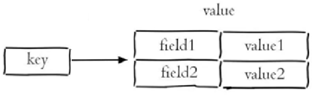

## 什么是Redis？


## **Redis相比memcached有哪些优势？**

## Redis为什么那么快？


## Redis有哪些优点？


## Redis的一般使用场景？

-   **统计访问次数**：很多官方网站的首页都需要统计访问次数PV

-   **生成全局ID**：使用incrby命令
    -   区别于雪花算法（因为存在时钟回拨的问题）

-   **分布式锁**：同类还有ZK分布式锁

-   **排行榜**：比如销量排行榜、点赞排行榜、积分排行
    -   通常情况使用sorted set保存排行榜的数据，zdd添加排行榜数据，zrange获取排行榜数据

-   **消息队列**：发布订阅，Redis2.0提供的，利用发布订阅也可以实现消息队列的功能

-   **记录用户登录状态**：保存用户登录信息，好处是可以设置过期时间

-   **限流**：比如限制同一个ip，一分钟之内只能访问10次接口
    -   也可以使用nginx，但使用Redis可以控制得更精细

-   位统计：使用Bitmap统计一周内连续登录的用户

-   缓存：减轻数据库压力


## Redis常用类型的应用场景？

**口语化**

Redis 的常用类型的应用场景，最常见的就是用来做各种各样的缓存，主要是 string 和 hash 用的会比较多。string 支持了各种方式的缓存，配合过期时间，非常的方便，string 的 value 可以存 json 等等这些东西，用起来也非常灵活。

还有一个大的场景就是基于 redis 实现的分布式锁，setnx 命令天然支持锁的机制。

针对一些对象的处理，hash 结构就比较常用，省去了 json 序列化的性能消耗。

另一种常用的就是 sortset，经常用来实现排行榜功能，也可以做一些延迟队列的操作。

还有就是 set 可以用来做黑名单，

list 可以实现一些简单的消息队列！

**字符串（string）**

-   **缓存**：最常见的就是缓存，利用set方法，可以将字符串数据放入到redis中。get方法直接读取。set里面可以放字符串，也可以放json串。配合过期时间等等，实现性能的提升。
-   **计数器**：incrby、decrby很轻松的就可以实现数字的加减，比如说库存的扣减。在高并发的情况下就可以使用这种方式来快速处理。又比如说点赞功能，点赞数量，也可以通过此来实现。总之和数字加减有关的，可以考虑计数器。

-   **分布式锁**：可以使用**setnx**命令，来做一些分布式锁的处理，判断是否拿到了锁，一般如果setnx成功放入了val，就认为是拿到了锁，否则就是没拿到
-   **常量存储**：平时的一些简单的配置信息，比如一些标志位，假设现在有一个任务在跑，如果跑完成功了，则想在redis中写一个值，后续其他人做业务逻辑的时候，就可以通过这个值来知道，任务是否成功

**哈希（hash）**

-   **对象存储**：大家用java，肯定离不开和对象打交道，对象就是一堆属性，假设我们把这个存储到缓存里面，用hash再适合不过了。当然你也可以使用string，但是每次都要做json序列化，得不偿失，考虑性能后，还是要对象存储，直接就可以拿到某个属性的值

-   其他：网上有很多把hash存储不同的数据，列为不同用途的说话，我个人不这么看。因为本质上就是对象存储的用途，所以都可以归为同一类。可能大家看到了其他用途，如用户信息存储、地理位置村里等，都是同一类的。

**列表（list）**

-   超简单的**消息队列**：list的push和pop命令，天然支持，针对一些简单的消费场景，可以考虑使用redis的队列。
-   **实现栈**：list的push和pop命令可以非常容易的实现栈结构，其实本质上和消费队列差不多
-   **分页查询**：假设需要分页查询，又不想用数据库，小数据量的操作，可以配合lrange来实现，不过开发中很少人这么干

**集合（set）**

-   **黑名单**：黑名单用的非常常用，不重复的数据，比如存储一些用户的id、用户的ip地址等，来做拉黑
-   一些**标签**数据：比如商品的打标等，如新品、饮料、冻品等
-   共同关注、爱好等等**交集**：redis的set有个非常好的功能，可以快速帮我们找到两个set之间的交集、差集、并集等。比如说想知道两个人共同关注的博主、共同的爱好等这些（交集），又比如说想知道我关注了他没关注的博主等（差集），set实现起来非常的方便

**有序集合（sorted set）**

-   **排行榜**：这是一个非常常用常见的场景，zset的分数机制，非常适合用来做带数据的排名，同时性能又非常的高。比如游戏排名、销量排行榜、点赞排行榜、积分排行、考试分数排行等
-   **延迟队列**：zset实现的延迟队列，也是轻量级比较常见的一种方式。分数可以用来存储毫秒数，来判断什么时候取出来指向。配合扫描机制
-   **时间排序的数据**：比如股票的时间的价格变化


## Redis是单线程还是多线程？


## Redis为什么要设计成单线程？6.0不是变成多线程了吗？


## **本地缓存与分布式缓存的区别?**

## **分布式缓存和本地缓存的区别？**

## Redis常见五大数据类型？

**口语化**

redis 的基础数据类型，主要有五种，string ，hash，list，set 和 zset。平时最常用的就是 string，可以缓存内容、做分布式锁等等，其次就是 hash，比如缓存一些对象结构的数据，hash 就比较合理。假设缓存一个个人信息，姓名，年龄，头像这些。传统的 string 需要进行序列化转 json，hash 则可以直接拿到。zset 也用过，主要是做排行榜功能，利用分数的特性进行排序。

>   重点：string 的分布式锁、hash 存储对象、zset 做排行榜


Redis存储的是key-value结构的数据，其中key是字符串类型，value有5种常用的数据类型：

-   字符串(string)：普通字符串，Redis中最简单的数据类型
-   哈希(hash)：也叫散列，类似于Java中的HashMap结构
-   列表(list)：按照插入顺序排序，可以有重复元素，类似于Java中的LinkedList
-   集合(set)：无序集合，没有重复元素，类似于Java中的HashSet
-   有序集合(sorted set/zset)：集合中每个元素关联一个分数(score)，根据分数升序排序，没有重复元素


**字符串(string)**

字符串是 Redis 中最简单和最常用的数据类型。

可以用来存储如字符串、整数、浮点数、图片（图片的base64编码或图片的路径）、序列化后的对象等

每个键（key）对应一个值（value），一个键最大能存储512MB的数据

Redis 中字符串类型常用命令：

-   **SET** key value 					         设置指定key的值
-   **GET** key                                        获取指定key的值
-   **SETEX** key seconds value         设置指定key的值，并将 key 的过期时间设为 seconds 秒
-   **SETNX** key value                        只有在 key    不存在时设置 key 的值

更多命令可以参考Redis中文网：https://www.redis.net.cn

**哈希(hash)**

Redis hash 是一个string类型的 field 和 value 的映射表，类似于Java中的Map<String, Object>。

Hash特别适合用于存储对象，如用户信息、商品详情等

每个Hash可以存储 2^32 - 1个键值对



常用命令：

-   **HSET** key field value             将哈希表 key 中的字段 field 的值设为 value
-   **HGET** key field                       获取存储在哈希表中指定字段的值
-   **HDEL** key field                       删除存储在哈希表中的指定字段
-   **HKEYS** key                              获取哈希表中所有字段
-   **HVALS** key                              获取哈希表中所有值

示例：

```shell
HSET user:1000 name "John"
HGET user:1000 name
```

**列表(list)**

Redis 列表是一个有序的字符串列表，可以从两端压入或弹出元素，支持在列表的头部或尾部添加元素。

列表最多可存储2^32 - 1个元素

常用命令：

-   **LPUSH** key value1 [value2]         将一个或多个值插入到列表头部
-   **LRANGE** key start stop                获取列表指定范围内的元素
-   **RPOP** key                                       移除并获取列表最后一个元素
-   **LLEN** key                                        获取列表长度
-   **BRPOP** key1 [key2 ] timeout       移出并获取列表的最后一个元素， 如果列表没有元素会阻塞列表直到等待超    时或发现可弹出元素为止


示例：

```shell
LPUSH mylist "world"
LPUSH mylist "hello"
LRANGE mylist 0 -1
```

**集合(set)**

Redis set 是string类型的无序集合。集合成员是唯一的，这就意味着集合中不能出现重复的数据

集合适用于去重和集合运算（如交集、并集、差集）

set的添加、删除、查找操作的复杂度都是O(1)。

常用命令：

-   **SADD** key member1 [member2]            向集合添加一个或多个成员
-   **SMEMBERS** key                                         返回集合中的所有成员
-   **SCARD** key                                                  获取集合的成员数
-   **SINTER** key1 [key2]                                   返回给定所有集合的交集
-   **SUNION** key1 [key2]                                 返回所有给定集合的并集
-   **SREM** key member1 [member2]            移除集合中一个或多个成员


示例：

```shell
SADD myset "hello"
SADD myset "world"
SMEMBERS myset
```

**有序集合(sorted set/zset)**

zset和Set一样也是string类型元素的集合，且不允许重复的成员。有序集合类似于集合，但每个元素都会关联一个double类型的分数（score），redis正是通过分数来为集合中的成员进行从小到大的排序

常用命令：

-   **ZADD** key score1 member1 [score2 member2]     向有序集合添加一个或多个成员
-   **ZRANGE** key start stop [WITHSCORES]                     通过索引区间返回有序集合中指定区间内的成员
-   **ZINCRBY** key increment member                              有序集合中对指定成员的分数加上增量 increment
-   **ZREM** key member [member ...]                                移除有序集合中的一个或多个成员

 

**通用命令**

Redis的通用命令是不分数据类型的，都可以使用的命令：

-   KEYS pattern 		查找所有符合给定模式( pattern)的 key 
-   EXISTS key 		检查给定 key 是否存在
-   TYPE key 		返回 key 所储存的值的类型
-   DEL key 		该命令用于在 key 存在是删除 key


## Redis的高级数据类型有哪些？

**口语化**

面对一些复杂的场景，redis提供了一些高级数据类型，来进行了功能的扩展。

主要有四种，bitmaps，hyperloglog，geo，stream。

stream 不是非常常用，主要是用来实现消息队列功能。

常用的就是 bitmap，bitmap 的 0、1 特性，非常适用于签到，或者存在、不存在这种类型判断，以及在大量数据下，快速统计是否结果。bitmap 非常节省空间，相比于传统的存储数据后，在 mysql 等层面统计，bitmap 更加适用。

其次就是hyperloglog 主要是用于一些数量的统计，不过要允许误差，他不会存具体的内容，会帮助我们进行数据的统计，像常见的网站访问统计，就非常适合这个数据结构。

geo 主要是做地理位置的计算，通过经度和纬度来定位位置，经过运算可以得到距离，附近范围的坐标等等。像比如美团外卖的附近商家，地图的距离测算，都可以通过 geo 的结构来进行实现

>   重点 bitmap，其次是hyperloglog，geo


## Redis的list类型常见的命令？


## Redis的Geo类型？

>   GEO的底层其实是ZSET

GEO就是Geolocation的简写形式，代表地理坐标。Redis在3.2版本中加入了对GEO的支持，允许存储地理坐标信息，帮助我们根据经纬度来检索数据。常见的命令有：

-   GEOADD：添加一个地理空间信息，包含：经度（longitude）、纬度（latitude）、值（member）
-   GEODIST：计算指定的两个点之间的距离并返回
-   GEOHASH：将指定member的坐标转为hash字符串形式并返回
-   GEOPOS：返回指定member的坐标
-   GEORADIUS：指定圆心、半径，找到该圆内包含的所有member，并按照与圆心之间的距离排序后返回。**6.以后已废弃**
-   GEOSEARCH：在指定范围内搜索member，并按照与指定点之间的距离排序后返回。范围可以是圆形或矩形。**6.2.新功能**
-   GEOSEARCHSTORE：与GEOSEARCH功能一致，不过可以把结果存储到一个指定的key。 **6.2.新功能**

```shell
# 有如下数据
-	北京南站（116.378248 39.865275）
-	北京站（116.42803 39.903738）
-	北京西站（116.322287 39.893729）
127.0.0.1:6379> GEOADD g1 116.378248 39.865275 bjnz 116.42803 39.903738 bjz 116.322287 39.893729 bjxz
(integer) 3

# 1.计算北京西站到北京站的距离
127.0.0.1:6379> GEODIST g1 bjxz bjz m
"9091.5648"
127.0.0.1:6379> GEODIST g1 bjxz bjz km
"9.0916"

# 2.搜索北京天安门（116.397904 39.909005）福建10km的所有火车站，并按照升序排序
127.0.0.1:6379> GEORADIUS g1 116.397904 39.909005 10 km
1) "bjz"
2) "bjnz"
3) "bjxz"
127.0.0.1:6379> GEORADIUS g1 116.397904 39.909005 10 km WITHDIST
1) 1) "bjz"
   2) "2.6361"
2) 1) "bjnz"
   2) "5.1452"
3) 1) "bjxz"
   2) "6.6723"
127.0.0.1:6379> GEOSEARCH g1 FROMLONLAT 116.397904 39.909005 BYRADIUS 10 km
1) "bjz"
2) "bjnz"
3) "bjxz"
127.0.0.1:6379> GEOSEARCH g1 FROMLONLAT 116.397904 39.909005 BYRADIUS 10 km WITHDIST
1) 1) "bjz"
   2) "2.6361"
2) 1) "bjnz"
   2) "5.1452"
3) 1) "bjxz"
   2) "6.6723"
```


## 


## Redis的Bitmap类型？

>   **Redis中是利用string类型数据结构实现BitMap**，因此最大上限是512M，转换为bit则是 2^32个bit位。

BitMap的操作命令有：

-   SETBIT：向指定位置（offset）存入一个0或1
-   GETBIT ：获取指定位置（offset）的bit值
-   BITCOUNT ：统计BitMap中值为1的bit位的数量
-   BITFIELD ：操作（查询、修改、自增）BitMap中bit数组中的指定位置（offset）的值
    -   它的修改比较繁琐，因此直接用SETBIT修改即可
    -   查询，可以批量查询。GETBIT只能单个查询
-   BITFIELD_RO ：获取BitMap中bit数组，并以十进制形式返回
-   BITOP ：将多个BitMap的结果做位运算（与 、或、异或）
-   BITPOS ：查找bit数组中指定范围内第一个0或1出现的位置

```shell
# 1.模拟用户一周7天的签到情况，其中星期4未签到
127.0.0.1:6379> SETBIT bm1 0 1		# 0 表示bitmap中第一位，相当于星期一； 1表示签到
(integer) 0
127.0.0.1:6379> SETBIT bm1 1 1		# 1 表示bitmap中第二位，相当于星期二； 1表示签到
(integer) 0
127.0.0.1:6379> SETBIT bm1 2 1
(integer) 0
127.0.0.1:6379> SETBIT bm1 5 1
(integer) 0
127.0.0.1:6379> SETBIT bm1 6 1
(integer) 0

# 2.查询用户星期三、星期四是否签到
127.0.0.1:6379> GETBIT bm1 2
(integer) 1
127.0.0.1:6379> GETBIT bm1 3
(integer) 0			# 表示未签到

# 3.统计用户一周内的签到天数（即：统计BitMap中值为1的bit位的数量）
127.0.0.1:6379> BITCOUNT bm1 
(integer) 5

# 4.查询用户星期一到星期三三天的前靠情况
127.0.0.1:6379> BITFIELD bm1 get u3 0		# u3表示无符号，显示3位； 0表示offset偏移量
1) (integer) 7	# 7（十进制）==> 111（二进制）

# 5.查询用户一周内第一次未签到是在哪一天
127.0.0.1:6379> BITPOS bm1 0
(integer) 3		# 3表示bitmap中第四位，即星期四
# 5.查询用户一周内第一次签到是在哪一天
127.0.0.1:6379> BITPOS bm1 1
(integer) 0		# 0表示bitmap中第一位，即星期一
```


## Redis的HyperLogLog类型？

首先我们搞懂两个概念：

-   UV：全称**U**nique **V**isitor，也叫**独立访客量**，是指通过互联网访问、浏览这个网页的自然人。1天内同一个用户多次访问该网站，只记录1次。

-   PV：全称

    P

    age

     

    V

    iew，也叫

    页面访问量或点击量

    ，用户每访问网站的一个页面，记录1次PV，用户多次打开页面，则记录多次PV。往往用来衡量网站的流量。

    -   PV可以使用 Redis 的 incr、incrby 轻松实现

通常来说UV会比PV大很多，所以衡量同一个网站的访问量，我们需要综合考虑很多因素，所以我们只是单纯的把这两个值作为一个参考值。

UV统计在服务端做会比较麻烦，因为要判断该用户是否已经统计过了，需要将统计过的用户信息保存。但是如果每个访问的用户都保存到Redis中，数据量会非常恐怖，那怎么处理呢？

这里提一下解决UV统计的思路：

-   （1）数据存储在 MySQL 表中，使用 distinct count 计算不重复个数。
-   （2）使用 Redis 提供的 hash、set、bitmaps 等数据结构来处理。

以上的方案结果精确，但随着数据不断增加，导致占用空间越来越大，对于非常大的数据集是不切实际的。能否能够降低一定的精度来平衡存储空间？Redis 推出了 HyperLogLog。

Hyperloglog(HLL)是从Loglog算法派生的概率算法，用于确定非常大的集合的基数，而不需要存储其所有值。相关算法原理大家可以参考：[https://juejin.cn/post/6844903785744056333#heading-0](https://gitee.com/link?target=https%3A%2F%2Fjuejin.cn%2Fpost%2F6844903785744056333%23heading-0) 

Redis中的**HLL是基于string**结构实现的，**单个HLL**的内存**永远小于16kb**，**内存占用低**的令人发指！作为代价，其测量结果是概率性的，**有小于0.81％的误差**。不过对于UV统计来说，这完全可以忽略。

```shell
# 插入
127.0.0.1:6379> PFADD hl1 e1 e2 e3 e4 e5
(integer) 1
# 查看
127.0.0.1:6379> PFCOUNT hl1
(integer) 5
# 再次插入重复
127.0.0.1:6379> PFADD hl1 e1 e2 e3 e4 e5
(integer) 0
# 再次查看
127.0.0.1:6379> PFCOUNT hl1
(integer) 5		# 结构还是5，说明hyperloglog这种数据结构天生就适合统计UV
```


## 为什么EMBSTR的阈值是44？为什么以前是39？


## Redis可以实现事务吗？|**什么是redis事务机制？**

Redis 事务是一个单独的隔离操作：**事务中的所有命令都会序列化、按顺序地执行**。事务在执行的过程中，不会被其他客户端发送来的命令请求所打断。

Redis 事务的主要作用就是**串联多个命令**防止别的命令插队。

注意：

​	**==Redis单条命令保证原子性，但是事务不保证原子性==**


## **redis事务保证原子性吗，支持回滚吗?**


## Redis的事务和关系型数据库有何不同？


## Redis中如何实现队列和栈的功能？


## Redis的复制延迟有哪些可能的原因？


## 简述Redis的Ziplist和Quicklist？


## Redis的VM机制是什么？

## 什么是Redis的ListPack？


## Redis的内存碎片化是什么？如何解决？


## Redis字符串的值最大能存多少？


## 如何保证缓存与数据库的一致性？


## 什么是缓存击穿？（热点key）

产生原因：在同一时间内，大量并发请求访问一个热点key，恰好key此时过期，又因为热点key缓存重建时间比较久，此时所有的请求都打到了数据库

解决方案：

-   逻辑过期
    -   思路：给热点key缓存永不过期，而是设置逻辑过期。每次请求查缓存，查看是否逻辑过期，未过期直接返回；已过期则获取互斥锁，开启独立线程重建缓存。其他线程无需等待，直接返回逻辑过期的数据
    -   优点：1）线程无需等待，性能较好
    -   缺点：1）不保证一致性，缓存重建期间可能会拿到脏数据；2）有额外内存消耗，因为除了缓存值，还要缓存逻辑过期时间；3）实现复杂；4）需要缓存预热
-   互斥锁
    -   思路：给缓存重建的过程加锁，确保重建过程只有一个线程执行，其他线程等待并重试查询
    -   优点：1）实现简单；2）没有额外内存消耗；3）一致性好
    -   缺点：1）等待导致性能下降；2）有死锁风险，因此可以给锁设置有效时间


## 什么是缓存雪崩？

产生原因：在同一时刻内大量缓存的key失效或者是Redis服务宕机，导致大量请求都打到数据库

解决方案：

-   给不同的key的TTL添加随机值，让它们不再同时过期
-   部署高可用的redis服务（如哨兵、集群）
-   给缓存业务添加降级限流策略
-   给业务添加多级缓存


## 什么是缓存穿透？

产生原因：客户端请求的数据在缓存与数据库中都不存在，缓存中不存在，就会去查数据库，数据库也不存在，每次请求都会访问数据库，如果这个请求并发量比较大，就会压垮数据库

解决方案：

-   缓存空值
    -   思路：对于不存在的数据也在redis中建立空缓存，并设置一个较短的TTL
    -   优点：实现简单，维护方便
    -   缺点：1）额外的内存消耗；2）短期的数据不一致问题
-   布隆过滤器
    -   思路：利用布隆过滤算法，在请求进入Redis之前先判断是否存在，如果不存在直接拒绝请求
    -   优点：内存占用少
    -   缺点：1）实现复杂；2）存在误判的可能性
-   其他方案：
    -   最好数据的基础格式校验
    -   加强用户权限校验
    -   做好热点参数限流


## 缓存击穿、雪崩、穿透的区别？


## **如果有大量的key需要设置同一时间过期，一般需要注意什么？**


## Redis的发布订阅功能？


## 如何实现分布式锁？

## **分布式锁的特点？**


## **看门狗机制的原理是什么？**

## Redis实现分布式锁有什么问题吗？


## 分布式锁在未执行完逻辑之前就过期了怎么办？


## **redlock的分布式锁是什么？**


## Redis的setnx和setex的区别？


## Redis的持久化机制？|**redis有哪些持久化方式？**


## Redis生成rdb的时候，是如何处理正常请求的？

## **rdb的优势与劣势?**

### **aof机制的优势和劣势？**


## Redis的red lock？


## Redis主从有哪几种常见的拓扑结构？


## **redis主从复制的核心原理？**


## **Redis的从服务器的作用？**


## **Redis中的管道有什么用**


## 原生批处理命令(mset、mget)与Pipeline的区别？


## 如果Redis扛不住了怎么办？


## **redis的同步机制是什么?**

## Redis的Cluster模式和Sentinel模式的区别是什么？


## Redis集群脑裂？


## 使用Redis集群时，通过key如何定位到对应节点？

**口语化回答**

​	这个问题主要是涉及到哈希槽（slot）的概念。Redis集群会将键划分成16384（2^14-1）个槽。每个槽分配一个或多个节点。比如一个集群，三个节点，每个节点负责一定范围的槽。当 key 来了的时候，首先做 hash 算法获得数值后，与 16384 进行取模。得到的值就是槽的位置，然后再根据槽的编号，就可以找到对应的节点。

**要点**

slot 机制，取模 hash 槽，16384，节点范围（0~16383）机制

**哈希槽机制**

Redis集群将整个键空间划分为16384个哈希槽。每个键根据其哈希值被映射到其中一个哈希槽上，每个哈希槽被分配给一个节点或多个节点（主从复制的场景）。计算过程如下：

1.  **计算哈希值**：Redis使用MurmurHash算法**对键进行哈希计算**，得到一个整数哈希值。
2.  **映射到哈希槽**：将哈希值对16384取模（即`hash(key) % 16384）`，得到对应的哈希槽编号。
3.  **定位节点**：根据哈希槽编号找到负责该哈希槽的节点。


看了上面的图，你对 slot 有了解了，那么你会产生疑问，slot 又是如何和 redis 节点进行关联的呢？

**哈希槽分配**

集群的配置时，哈希槽会被分配给不同的节点。每个节点负责一定范围的哈希槽。例如，节点A可能负责哈希槽0-5000，节点B负责哈希槽5001-10000，节点C负责哈希槽10001-16383。这样就实现了集群、节点、slot 三者联动。

如下是使用Docker部署Redis三主三从集群的案例，让你更加理解哈希槽的分配情况：

[docker中部署三主三从redis集群](./docs/docker中部署三主三从redis集群.md)

**客户端需要查找某个键的实现**

当客户端需要查找某个键时，流程如下：

1.  **计算哈希槽**：客户端根据键计算出对应的哈希槽编号。
2.  **查找节点**：客户端查询集群的哈希槽分配表，找到负责该哈希槽的节点。
3.  **发送请求**：客户端将请求发送到对应的节点，获取或存储数据。

一般这种都需要我们操心，很多都帮我们封装好了，如下：

```java
import redis.clients.jedis.HostAndPort;
import redis.clients.jedis.JedisCluster;
import java.util.HashSet;
import java.util.Set;

public class RedisClusterExample {
    public static void main(String[] args) {
        // 定义集群节点
        Set<HostAndPort> nodes = new HashSet<>();
        nodes.add(newHostAndPort("127.0.0.1", 7000));
        nodes.add(newHostAndPort("127.0.0.1", 7001));
        nodes.add(newHostAndPort("127.0.0.1", 7002));

        // 创建JedisCluster对象
        JedisCluster jedisCluster=new JedisCluster(nodes);

        // 存储键值对
        jedisCluster.set("mykey", "myvalue");

        // 获取键值对
        String value= jedisCluster.get("mykey");
        System.out.println("Value for 'mykey': " + value);

        // 关闭JedisCluster连接
        jedisCluster.close();
    }
}
```


## Redis为什么不复用c语言的字符串？


## 如何快速实现一个布隆过滤器？


## 如何快速实现一个排行榜？


## 如何用Redis统计海量UV？


## 如何使用Redis记录用户连续登录多少天？


## 如何解决热点key？


## 什么是redis bigKey？如何解决？


## redis哨兵机制？


## **什么情况下redis哨兵模式会产生数据丢失?**


## Redis的lua脚本？


## Redis的pipeline？


## Redis的过期策略？


## Redis的内存淘汰策略？

## **redis的内存用完了会发生什么？**

## Redis和memached的区别？


## 什么是Redis跳表？


## Redis存在线程安全吗？为什么？


## RDB和AOF的实现原理？以及优缺点？


## Redis和MySQL如何保证数据一致性？

## **redis常见性能问题和解决方案?**

## **jedis与redisson对比有什么优缺点？**

## **redis key的过期时间和永久有效分别怎么设置?**

## **redis回收进程如何工作的?**

## **什么是redis哈希槽的概念？**

## **Redis如何实现延时队列**

## **看门狗机制的原理是什么？**