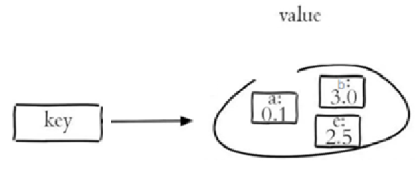

## 什么是Redis？

Redis诞生于2009年全称是**Re**mote **D**ictionary **S**erver 远程词典服务器，是一个基于内存的键值型NoSQL数据库。

**特征**

-   键值（key-value）型，value支持多种不同数据结构，功能丰富
    -   和 Memcached 类似，但它支持存储的 value 类型相对更多
        -   包括 **string (字符串)、list (链表)、set (集合)、zset (sorted set 有序集合) 和 hash（哈希类型）**
        -   hyperloglog、geo、bitmap、stream等高级类型
-   单线程，每个命令具备原子性
-   低延迟，速度快（基于内存、IO多路复用、良好的编码）。
-   支持数据持久化（通过rdb与aof）
-   支持主从集群、分片集群
-   支持多语言客户端

>   相关
>
>   ​	多路复用是指使用一个线程来检查多个文件描述符（Socket）的就绪状态，比如调用 select 和 poll 函数，传入多个文件描述符，如果有一个文件描述符就绪，则返回，否则阻塞直到超时。得到就绪状态后进行真正的操作可以在同一个线程里执行，也可以启动线程执行（比如使用线程池）。


## Redis相比memcached有哪些优势？

**口语化**

redis 相比 memcached，主要提供了丰富的数据类型和各种高级操作。memcached 仅仅支持字符串类型，redis 支持 5 种基础+4 种高级，非常丰富。

还有就是 redis 提供了 rdb 和 aof 的持久化机制，memcached 一旦重启，数据就会直接丢失。

分布式相关，redis 天然支持主从复制，哨兵，集群。memcached 还需要靠一些第三方库和工具类实现。

再高级一点的就是 redis 支持像 lua，事务，发布订阅这些，memcached 统统不支持。

>   最近几年基本上不会考这道题了，这道题在早些时候，memcached 还用的时候，问的比较多。除非碰到还在用memcached 的公司，否则不会被问到。大家稍微了解即可，比较的过程也是了解历史的过程。


>   关键点：丰富的数据类型、持久化、分布式、lua

|                  | redis                                                        | Memcached                                                    |
| ---------------- | ------------------------------------------------------------ | ------------------------------------------------------------ |
| **数据类型**     | Redis 支持字符串、哈希、列表、集合、有序集合、位图BitMap、HyperLogLog、地理空间GEO和流等多种数据类型 | Memcached 仅支持字符串类型的键值对。                         |
| **持久化机制**   | Redis 支持将数据持久化到磁盘，可以通过 RDB 快照和 AOF 日志来保存数据，确保在系统重启后数据不会丢失 | Memcached不支持持久化，数据仅保存在内存中，一旦服务器重启或宕机，数据就会丢失。 |
| **分布式**       | 支持主从，哨兵，集群                                         | Memcached也支持分布式部署，但通常需要依赖第三方库或工具来实现 |
| **脚本功能**     | Redis 支持在服务器端执行 Lua 脚本，能够将多个操作合并为一个原子操作 | 不支持                                                       |
| **事务**         | Redis 提供 MULTI、EXEC、WATCH 等命令，支持简单的事务操作     | 不支持事务                                                   |
| **内存淘汰策略** | Redis 提供多种内存淘汰策略，如 LRU、LFU 等                   | Memcached 仅支持 LRU 淘汰策略。                              |


## Redis为什么那么快？

>   首先，我声明一下，这就是一个垃圾题目。redis基于内存操作能不快吗？

 **口语化**

redis 的快主要得益于以下几个点

第一个就是纯内存的操作，相比磁盘来说，纯内存带来的速度提升非常大。

其次就是合理的数据结构和数据编码设计。像不同的数据类型所对应的底层结构都会有变化，基本上作者让我们在 O(1)的复杂度内就可以读取到我们想要的值。

还有就是redis官方表示：Redis是基于内存操作的，CPU不是Redis的性能瓶颈，**Redis的性能瓶颈是根据机器的内存和网络带宽**，既然可以使用单线程来实现，就使用单线程了！！！

基于单线程，这使得 redis 不需要考虑上下文切换的消耗。以及 redis 采取了 io 多路复用，减少了网络压力，提高了吞吐量。以上就是 redis 这么快的原因

>   关键点：内存、数据结构、单线程、io多路复用


**纯内存**

Redis将数据存储在内存中，避免了大量访问数据库和直接读取磁盘数据的操作。内存的读写速度远超过磁盘I/O，使得Redis的数据访问非常迅速。

**数据结构合理**

Redis内部的数据结构都是为快速读写而设计的，如跳跃表、SDS（简单动态字符串）、链表和Hash等。基本都能够在O(1)复杂度下完成大部分操作，比如 hash 的结构，想获取其中一个属性的值，非常的方便，不像数据库查询需要磁盘寻找。

**单线程操作**

redis官方表示：Redis是基于内存操作的，CPU不是Redis的性能瓶颈，**Redis的性能瓶颈是根据机器的内存和网络带宽**，既然可以使用单线程来实现，就使用单线程了！！！

Redis采用单线程模型来处理客户端请求，**避免**了多线程带来的**上下文切换和竞争条件**。

单线程模型使得Redis不需要考虑各种锁的问题，减少了性能消耗。

但是持久化，异步删除等等是异步线程处理，但这不影响性能。不过要注意一个点，因为单线程，某个命令如果耗时太大，可能会产生阻塞，也就是我们经常说的，不要使用 keys，或者直接读整个 hash 大 key。

**io 多路复用模型**

Redis在网络通信和磁盘写入方面采用了**异步式的IO处理**，即使用epoll多路复用技术同时处理多个网络请求，减少了I/O阻塞及上下文切换开销，提高了系统的吞吐量和响应时间。

>   相关
>
>   ​	多路复用是指使用一个线程来检查多个文件描述符（Socket）的就绪状态，比如调用 select 和 poll 函数，传入多个文件描述符，如果有一个文件描述符就绪，则返回，否则阻塞直到超时。得到就绪状态后进行真正的操作可以在同一个线程里执行，也可以启动线程执行（比如使用线程池）。

**专门设计的数据结构**

redis的每种数据类型对应的底层存储结构都不一样，经历过多种方式的设计。

拿 string 类型来进行说，key是string类型，底层编码包含int、embstr和raw三种

-   如果存储数字的话，是用int类型的编码。
-   如果存储非数字
    -   当字节数 小于 44字节时，使用 embstr，采用连续内存空间，内存占用更小
    -   当字节数 大于 44字节时，会转为raw模式存储


## Redis有哪些优点？

**口语化**

Redis 是现在非常常用的缓存，相比于其他的缓存，最大的一个优势就是高性能，redis 的速度非常快，操作都是毫秒级，吞吐量非常高，支持每秒数百万的请求。同时各种操作都基于内存进行，读写速度非常快。

还有就是他提供了丰富的数据类型，像 string、hash、list、set、zset这些基本类型 ，在我们日常开发都非常常见的使用。还有一些高级数据类型，像 geo、bitmap、hyperloglog。

另外就是 redis 的持久化机制做的也比较好，不同的策略选择使其可以应对宕机等异常情况。配合分布式集群的支持，整体的可用性也非常高。

>   关键点：高性能，内存，快，高吞吐，持久化，分布式


Redis 是当前非常主流的缓存，基于键值对来实现的存储，支持多种数据类型

**高性能**

-   毫秒级操作：所有的命令都在毫秒级，响应速度非常快，除了一些keys等大key命令，那些生产环境也是尽量不要用的。
-   高吞吐：可以处理大量的读写请求，支持每秒数百万请求。
-   内存存储：交互都在内存，读写速度极快，缓存热点数据

**支持丰富数据类型**

-   具备5种数据类型+4种高级类型，满足不同业务需要，相比以前的memcached丰富了太多。

**持久化机制**

-   提供了**rdb**和**aof**两种持久化机制，即可以做灾难快速回复，也可以细粒度记录每次写操作恢复数据

**支持分布式**

-   支持主从复制，数据备份，读写分离
-   提供哨兵模式，在集群内节点发生问题时，自动故障转移，高可用
-   支持一致性hash，数据分片，集群模式

**生态方面**

-   api命令实用简单

-   图形化界面配套全面

-   社区活跃，不断更新


## Redis的一般使用场景？

-   **统计访问次数**：很多官方网站的首页都需要统计访问次数PV
-   **生成全局ID**：使用incrby命令
    -   区别于雪花算法（因为存在时钟回拨的问题）
-   **分布式锁**：同类还有ZK分布式锁
-   **排行榜**：比如销量排行榜、点赞排行榜、积分排行
    -   通常情况使用sorted set保存排行榜的数据，zdd添加排行榜数据，zrange获取排行榜数据
-   **消息队列**：发布订阅，Redis2.0提供的，利用发布订阅也可以实现消息队列的功能
-   **记录用户登录状态**：保存用户登录信息，好处是可以设置过期时间
-   **限流**：比如限制同一个ip，一分钟之内只能访问10次接口
    -   也可以使用nginx，但使用Redis可以控制得更精细
-   位统计：使用Bitmap统计一周内连续登录的用户
-   缓存：减轻数据库压力
-   **延迟队列**：使用zset来做**定时任务**，例如订单超时取消
    -   原理：member存储订单号，score存储（下单时间+超时时间）的和，只要当前时间大于score，就取出订单号


## Redis常用类型的应用场景？

**口语化**

Redis 的常用类型的应用场景，最常见的就是用来做各种各样的缓存，主要是 string 和 hash 用的会比较多。string 支持了各种方式的缓存，配合过期时间，非常的方便，string 的 value 可以存 json 等等这些东西，用起来也非常灵活。

还有一个大的场景就是基于 redis 实现的分布式锁，setnx 命令天然支持锁的机制。

针对一些对象的处理，hash 结构就比较常用，省去了 json 序列化的性能消耗。

另一种常用的就是 sortset，经常用来实现排行榜功能，也可以做一些延迟队列的操作。

还有就是 set 可以用来做黑名单，

list 可以实现一些简单的消息队列！

**字符串（string）**

-   **缓存**：最常见的就是缓存，利用set方法，可以将字符串数据放入到redis中。get方法直接读取。set里面可以放字符串，也可以放json串。配合过期时间等等，实现性能的提升。
-   **计数器**：incrby、decrby很轻松的就可以实现数字的加减，比如说库存的扣减。在高并发的情况下就可以使用这种方式来快速处理。又比如说点赞功能，点赞数量，也可以通过此来实现。总之和数字加减有关的，可以考虑计数器。

-   **分布式锁**：可以使用**setnx**命令，来做一些分布式锁的处理，判断是否拿到了锁，一般如果setnx成功放入了val，就认为是拿到了锁，否则就是没拿到
-   **常量存储**：平时的一些简单的配置信息，比如一些标志位，假设现在有一个任务在跑，如果跑完成功了，则想在redis中写一个值，后续其他人做业务逻辑的时候，就可以通过这个值来知道，任务是否成功

**哈希（hash）**

-   **对象存储**：大家用java，肯定离不开和对象打交道，对象就是一堆属性，假设我们把这个存储到缓存里面，用hash再适合不过了。当然你也可以使用string，但是每次都要做json序列化，得不偿失，考虑性能后，还是要对象存储，直接就可以拿到某个属性的值

-   其他：网上有很多把hash存储不同的数据，列为不同用途的说话，我个人不这么看。因为本质上就是对象存储的用途，所以都可以归为同一类。可能大家看到了其他用途，如用户信息存储、地理位置村里等，都是同一类的。

**列表（list）**

-   超简单的**消息队列**：list的push和pop命令，天然支持，针对一些简单的消费场景，可以考虑使用redis的队列。
-   **实现栈**：list的push和pop命令可以非常容易的实现栈结构，其实本质上和消费队列差不多
-   **分页查询**：假设需要分页查询，又不想用数据库，小数据量的操作，可以配合lrange来实现，不过开发中很少人这么干

**集合（set）**

-   **黑名单**：黑名单用的非常常用，不重复的数据，比如存储一些用户的id、用户的ip地址等，来做拉黑
-   一些**标签**数据：比如商品的打标等，如新品、饮料、冻品等
-   共同关注、爱好等等**交集**：redis的set有个非常好的功能，可以快速帮我们找到两个set之间的交集、差集、并集等。比如说想知道两个人共同关注的博主、共同的爱好等这些（交集），又比如说想知道我关注了他没关注的博主等（差集），set实现起来非常的方便

**有序集合（sorted set）**

-   **排行榜**：这是一个非常常用常见的场景，zset的分数机制，非常适合用来做带数据的排名，同时性能又非常的高。比如游戏排名、销量排行榜、点赞排行榜、积分排行、考试分数排行等
-   **延迟队列**：zset实现的延迟队列，也是轻量级比较常见的一种方式。分数可以用来存储毫秒数（下单时间+超时时间），来判断什么时候取出来指向。配合扫描机制，只要当前时间大于score就取出来
-   **时间排序的数据**：比如股票的时间的价格变化


## Redis是单线程还是多线程？

**口语化**

这个问题其实是两个角度来看，我们通常说 redis 说单线程，是因为从接收到客户端的请求，然后 redis 进行内部操作，再返回结果，这个过程是单线程的。

单线程的吞吐量可以达到 10w+ qps，这是来自 redis 的官方数据，由于 redis 的操作都是在内存中完成，所以性能的瓶颈是内存和带宽，而不是 cpu。如果在这种情况下，使用多线程，反而又要去处理线程安全和数据竞争的问题，还有上下文切换的消耗。

那么另一个角度就是除了 redis 执行命令的时候，像**持久化数据操作，内存释放操作**，这些是**由多线程来进行实现**的。

在 redis6.0 之后，为了减轻网络的性能瓶颈，还增加了多个 io 线程来处理请求。也是一个比较大的优化。所以这个问题，两个角度来看

>   关键点：单线程 + 多路 IO 复用技术，异步线程处理持久化、异步删除和集群数据同步等


Redis核心操作是单线程的。Redis在处理并发请求时有简单、高效和一致性的优点。但是Redis在某些方面使用了额外的线程来处理后台任务。

Redis的主要操作，包括网络IO和键值对读写，确实是由一个线程来完成的。这保证了Redis在处理客户端请求时的简单性和一致性，避免了多线程可能带来的上下文切换开销和竞争条件。利用队列技术将并发访问变为串行访问，消除了传统数据库串行控制的开销。这意味着，虽然多个客户端可能同时发送请求，但Redis会将这些请求放入队列中，并逐个处理它们。

**Redis 单线程性能高的原因**

1、高效的 I/O 多路复用：Redis使用网络IO多路复用技术（如epoll）来同时处理多个客户端连接。这使得Redis能够高效地利用系统资源，为大量并发连接提供高性能的服务。官网数据 10w/qps

>   相关
>
>   ​	多路复用是指使用一个线程来检查多个文件描述符（Socket）的就绪状态，比如调用 select 和 poll 函数，传入多个文件描述符，如果有一个文件描述符就绪，则返回，否则阻塞直到超时。得到就绪状态后进行真正的操作可以在同一个线程里执行，也可以启动线程执行（比如使用线程池）。

2、由于Redis基于内存操作，并且采用了单线程模型，不需要处理线程切换问题和多线程之间资源竞争，以及锁的问题。

**Redis 多线程主要做的事情**

持久化（例如，在保存RDB快照时，Redis会自动fork一个子进程去处理）、异步删除和集群数据同步等。这些任务不会阻塞Redis的主线程，从而确保Redis能够持续地为客户端提供服务。


## Redis为什么要设计成单线程？6.0不是变成多线程了吗？


## Redis 为什么单线程还这么快？

误区1：高性能的服务器一定是多线程的

误区2：多线程一定比单线程效率高（多线程存在CPU上下文切换）

核心：redis是将所有的数据都放在内存中的，所以说使用单线程去操作效率就是最高的，多线程（CPU上下文切换：耗时操作！！！），对于内存系统来说，如果没有上下文切换效率就是最高的！！多次读写都是在一个CPU上，在内存情况下，这个就是最佳的方案。


## 本地缓存与分布式缓存的区别?

**口语化**

本地缓存与分布式缓存的本质区别在于一个是存在应用内部，属于JVM级别，一个是独立于应用外，大家共享。

本地缓存比如hashMap、caffine、guava cache 这些都是比较常用的，本地缓存的优点就是速度非常快，没有网络消耗，缺点就是应用重启或宕机，缓存就会丢失。

分布式缓存像 redis 这种，也很快，但是多了一些网络的开销。在高并发的情况，有时候 redis 这种会成为性能瓶颈，就需要我们上一个本地缓存，配合 redis 做**多级缓存架构**来进行处理和优化。


缓存在日常开发中启动至关重要的作用，由于是存储在内存中，数据的读取速度是非常快的，能大量减少对数据库的访问，减少数据库的压力。我们把缓存分为两类：

-   分布式缓存，例如Redis：
    -   优点：存储容量更大、可靠性更好、可以在集群间共享
    -   缺点：访问缓存有网络开销
    -   场景：缓存数据量较大、可靠性要求较高、需要在集群间共享
-   进程本地缓存，例如HashMap、GuavaCache、guava cache：
    -   优点：读取本地内存，没有网络开销，速度更快
    -   缺点：存储容量有限、可靠性较低、无法共享（无法在多个tomcat之间共享，数据存在冗余）
    -   场景：性能要求较高，缓存数据量较小

**Caffeine**是一个基于Java8开发的，提供了近乎最佳命中率的高性能的本地缓存库。目前Spring内部的缓存使用的就是Caffeine。GitHub地址：[https://github.com/ben-manes/caffeine](https://gitee.com/link?target=https%3A%2F%2Fgithub.com%2Fben-manes%2Fcaffeine)


主要区别如下：

**存储位置**

-   **本地缓存**：存储在应用服务器的内存中，与应用程序运行在同一台机器上。
-   **分布式缓存**：存储在独立的缓存服务中，通常分布在多台服务器上，可以被多个应用实例共享。

**访问速度**

-   **本地缓存**：由于数据存储在本地内存中，访问速度非常快，延迟低。
-   **分布式缓存**：需要通过网络通信访问远程缓存服务，因此访问速度相对较慢，但仍然比直接访问数据库快很多。

 **一致性**

-   **本地缓存**：每个应用实例都有自己的缓存副本，容易出现数据不一致的问题（例如，一个实例更新了数据，其他实例的缓存未同步）。
-   **分布式缓存**：所有应用实例共享同一个缓存，能够保证数据的一致性（前提是正确配置缓存失效策略和同步机制）。

**扩展性**

-   **本地缓存**：受限于单机内存容量，扩展性较差。
-   **分布式缓存**：可以通过增加缓存节点实现水平扩展，支持更大的数据量和更高的并发访问。

 **高可用性**

-   **本地缓存**：如果应用实例崩溃或重启，本地缓存的数据会丢失。
-   **分布式缓存**：通常具备持久化和数据复制功能，即使某个节点故障，数据也不会完全丢失。

**适用场景**

-   **本地缓存**：适合读多写少、对性能要求极高且数据更新频率较低的场景，例如热点数据的临时存储。
-   **分布式缓存**：适合多实例部署的应用，尤其是需要跨服务共享数据或处理大规模并发请求的场景。


## Caffeine的缓存驱逐策略（过期策略）

**Caffeine**是一个基于Java8开发的，提供了近乎最佳命中率的高性能的本地缓存库。目前Spring内部的缓存使用的就是Caffeine。GitHub地址：[https://github.com/ben-manes/caffeine](https://gitee.com/link?target=https%3A%2F%2Fgithub.com%2Fben-manes%2Fcaffeine)

缓存使用的基本API：

```java
@Test
void testBasicOps() {
    // 构建cache对象
    Cache<String, String> cache = Caffeine.newBuilder()
                .initialCapacity(100)
                .maximumSize(10_000)
                .build();
    
    // 存数据
    cache.put("gf", "迪丽热巴");
    // 取数据
    String gf = cache.getIfPresent("gf");
    System.out.println("gf = " + gf);

    // 取数据，包含两个参数：
    // 参数一：缓存的key
    // 参数二：Lambda表达式，表达式参数就是缓存的key，方法体是查询数据库的逻辑
    // 优先根据key查询JVM缓存，如果未命中，则执行参数二的Lambda表达式
    String defaultGF = cache.get("defaultGF", key -> {
        // 根据key去数据库查询数据
        return "柳岩";
    });
    System.out.println("defaultGF = " + defaultGF);
}
```

Caffeine既然是缓存的一种，肯定需要有缓存的清除策略，不然的话内存总会有耗尽的时候。

Caffeine提供了三种缓存驱逐策略（过期策略）：

-   **基于容量**：设置缓存的数量上限

```java
// 创建缓存对象
Cache<String, String> cache = Caffeine.newBuilder()
    .maximumSize(1) // 设置缓存大小上限为 1
    .build();
```

-   **基于时间**：设置缓存的有效时间

```java
// 创建缓存对象
Cache<String, String> cache = Caffeine.newBuilder()
    // 设置缓存有效期为 10 秒，从最后一次写入开始计时 
    .expireAfterWrite(Duration.ofSeconds(10)) 
    .build();
```

-   **基于引用**：设置缓存为软引用或弱引用，利用GC来回收缓存数据。性能较差，不建议使用。

>   **注意**：
>
>    在默认情况下，当一个缓存元素过期的时候，Caffeine不会自动立即将其清理和驱逐。而是在一次读或写操作后，或者在空闲时间完成对失效数据的驱逐。


## Redis常见五大数据类型？

**口语化**

redis 的基础数据类型，主要有五种，string ，hash，list，set 和 zset。平时最常用的就是 string，可以缓存内容、做分布式锁等等，其次就是 hash，比如缓存一些对象结构的数据，hash 就比较合理。假设缓存一个个人信息，姓名，年龄，头像这些。传统的 string 需要进行序列化转 json，hash 则可以直接拿到。zset 也用过，主要是做排行榜功能，利用分数的特性进行排序。

>   重点：string 的分布式锁、hash 存储对象、zset 做排行榜


Redis存储的是key-value结构的数据，其中key是字符串类型，value有5种常用的数据类型：

-   字符串(string)：普通字符串，Redis中最简单的数据类型
-   哈希(hash)：也叫散列，类似于Java中的HashMap结构
-   列表(list)：按照插入顺序排序，可以有重复元素，类似于Java中的LinkedList
-   集合(set)：无序集合，没有重复元素，类似于Java中的HashSet
-   有序集合(sorted set/zset)：集合中每个元素关联一个分数(score)，根据分数升序排序，没有重复元素
    -   与Java中的TreeSet有些类似，但底层数据结构却差别很大


**字符串(string)**

字符串是 Redis 中最简单和最常用的数据类型。

可以用来存储如字符串、整数、浮点数、图片（图片的base64编码或图片的路径）、序列化后的对象等

每个键（key）对应一个值（value），一个键最大能存储512MB的数据

Redis 中字符串类型常用命令：

-   **SET** key value 					         设置指定key的值（添加或修改）
-   **GET** key                                        获取指定key的值
-   **SETEX** key seconds value         设置指定key的值，并将 key 的过期时间设为 seconds 秒
-   **SETNX** key value                        只有在 key    不存在时设置 key 的值
-   **MSET**                                            批量添加多个String类型的键值对
-   **MGET**                                           根据多个key获取多个String类型的value
-   **INCR**                                            让一个整型的key自增1
-   **INCRBY**                                       让一个整型的key自增并指定步长，例如：incrby num 2 让num值自增2
-   **INCRBYFLOAT**                           让一个浮点类型的数字自增并指定步长

更多命令可以参考Redis中文网：https://www.redis.net.cn

**哈希(hash)**

Redis hash 是一个string类型的 field 和 value 的映射表，类似于Java中的Map<String, Object>。

Hash特别适合用于存储对象，如用户信息、商品详情等

每个Hash可以存储 2^32 - 1个键值对


常用命令：

-   **HSET** key field value             将哈希表 key 中的字段 field 的值设为 value
-   **HGET** key field                       获取存储在哈希表中指定字段的值
-   **HDEL** key field                       删除存储在哈希表中的指定字段
-   **HKEYS** key                              获取哈希表中所有字段
-   **HVALS** key                              获取哈希表中所有值
-   HMSET：批量添加多个hash类型key的field的值
-   HMGET：批量获取多个hash类型key的field的值
-   HGETALL：获取一个hash类型的key中的所有的field和value
-   HINCRBY:让一个hash类型key的字段值自增并指定步长
-   HSETNX：添加一个hash类型的key的field值，前提是这个field不存在，否则不执行

示例：

```shell
HSET user:1000 name "John"
HGET user:1000 name
```

**列表(list)**

Redis 列表是一个有序的字符串列表，可以从两端压入或弹出元素，支持在列表的头部或尾部添加元素。

列表最多可存储2^32 - 1个元素

类似于Java中的LinkedList，特征也与LinkedList类似：

-   有序
-   元素可以重复
-   插入和删除快
-   查询速度一般

**适用场景**：朋友圈点赞列表，评论列表等

常用命令：

-   **LPUSH** key value1 [value2]         将一个或多个值插入到列表头部（左侧）
-   **LPOP** key                                        移除并返回列表左侧的第一个元素，没有则返回nil
-   **LRANGE** key start stop                获取列表指定范围内的元素
-   **RPUSH** key element ...                 向列表右侧插入一个或多个元素
-   **RPOP** key                                       移除并获取列表最后一个元素（右侧）
-   **LLEN** key                                        获取列表长度
-   **BRPOP** key1 [key2 ] timeout       移出并获取列表的最后一个元素， 如果列表没有元素会阻塞列表直到等待超    时或发现可弹出元素为止


示例：

```shell
LPUSH mylist "world"
LPUSH mylist "hello"
LRANGE mylist 0 -1
```

**集合(set)**

Redis set 是string类型的无序集合。集合成员是唯一的，这就意味着集合中不能出现重复的数据

集合适用于去重和集合运算（如交集、并集、差集）

set的添加、删除、查找操作的复杂度都是O(1)。

类似于Java中的HashSet可以看做是一个value为null的HashMap。因为也是一个hash表，因此具备与HashSet类似的特征：

-   无序
-   元素不可重复
-   查找快
-   支持交集、并集、差集等功能

常用命令：

-   **SADD** key member1 [member2]            向集合添加一个或多个成员
-   **SMEMBERS** key                                         返回集合中的所有成员
-   **SISMEMBER** key member                       判断一个元素是否存在于set中
-   **SCARD** key                                                  获取集合的成员数
-   **SINTER** key1 [key2]                                   返回给定所有集合的交集
-   **SUNION** key1 [key2]                                 返回所有给定集合的并集
-   **SREM** key member1 [member2]            移除集合中一个或多个成员


示例：

```shell
SADD myset "hello"
SADD myset "world"
SMEMBERS myset
```

**有序集合(sorted set/zset)**

zset和Set一样也是string类型元素的集合，且不允许重复的成员。有序集合类似于集合，但每个元素都会关联一个double类型的分数（score），redis正是通过分数来为集合中的成员进行从小到大的排序

与Java中的TreeSet有些类似，但底层数据结构却差别很大。SortedSet中的每一个元素都带有一个score属性，可以基于score属性对元素排序，底层的实现是一个**跳表（SkipList）加 hash表**

SortedSet具备下列特性：

-   可排序
-   元素不重复
-   查询速度快

常用命令：

-   **ZADD** key score1 member1 [score2 member2]     向有序集合添加一个或多个成员
-   **ZRANGE** key start stop [WITHSCORES]                     通过索引区间返回有序集合中指定区间内的成员
-   **ZINCRBY** key increment member                              有序集合中对指定成员的分数加上增量 increment
-   **ZREM** key member [member ...]                                移除有序集合中的一个或多个成员

 

**通用命令**

Redis的通用命令是不分数据类型的，都可以使用的命令：

-   KEYS pattern 		查找所有符合给定模式( pattern)的 key 
-   EXISTS key 		检查给定 key 是否存在
-   TYPE key 		返回 key 所储存的值的类型
-   DEL key 		该命令用于在 key 存在是删除 key


## Redis的高级数据类型有哪些？

**口语化**

面对一些复杂的场景，redis提供了一些高级数据类型，来进行了功能的扩展。

主要有四种，bitmaps，hyperloglog，geo，stream。

stream 不是非常常用，主要是用来实现消息队列功能。

常用的就是 bitmap，bitmap 的 0、1 特性，非常适用于签到，或者存在、不存在这种类型判断，以及在大量数据下，快速统计是否结果。bitmap 非常节省空间，相比于传统的存储数据后，在 mysql 等层面统计，bitmap 更加适用。

其次就是hyperloglog 主要是用于一些数量的统计，不过要允许误差，他不会存具体的内容，会帮助我们进行数据的统计，像常见的网站访问统计，就非常适合这个数据结构。

geo 主要是做地理位置的计算，通过经度和纬度来定位位置，经过运算可以得到距离，附近范围的坐标等等。像比如美团外卖的附近商家，地图的距离测算，都可以通过 geo 的结构来进行实现

>   重点 bitmap，其次是hyperloglog，geo

关键点：

-   bitmap，二进制位统计，签到功能
-   hyperloglog，大数据量统计
-   geo，地理位置，经纬度，附近的人


**BitMap**

-   Redis 提供了 Bitmaps 这个 “数据类型” 可以实现对**位**的操作
-   **Bitmaps 本身不是一种数据类型**， 实际上它就是字符串（key-value） ， 但是它可以==对字符串的位进行操作==。
-   Bitmaps 单独提供了一套命令， 所以在 Redis 中使用 Bitmaps 和使用字符串的方法不太相同。
    -   可以把 Bitmaps 想象成一个以位为单位的数组， 数组的每个单元只能存储 0 和 1， 数组的下标在 Bitmaps 中叫做偏移量（从左到右），如下图所示。


>   **Redis中是利用string类型数据结构实现BitMap**，因此最大上限是512M，转换为bit则是 2^32个bit位。

BitMap的操作命令有：

-   SETBIT：向指定位置（offset）存入一个0或1
-   GETBIT ：获取指定位置（offset）的bit值
-   BITCOUNT ：统计BitMap中值为1的bit位的数量
-   BITFIELD ：操作（查询、修改、自增）BitMap中bit数组中的指定位置（offset）的值
    -   它的修改比较繁琐，因此直接用SETBIT修改即可
    -   查询，可以批量查询。GETBIT只能单个查询
-   BITFIELD_RO ：获取BitMap中bit数组，并以十进制形式返回
-   BITOP ：将多个BitMap的结果做位运算（与 、或、异或）
-   BITPOS ：查找bit数组中指定范围内第一个0或1出现的位置

```shell
# 1.模拟用户一周7天的签到情况，其中星期4未签到
127.0.0.1:6379> SETBIT bm1 0 1		# 0 表示bitmap中第一位，相当于星期一； 1表示签到
(integer) 0
127.0.0.1:6379> SETBIT bm1 1 1		# 1 表示bitmap中第二位，相当于星期二； 1表示签到
(integer) 0
127.0.0.1:6379> SETBIT bm1 2 1
(integer) 0
127.0.0.1:6379> SETBIT bm1 5 1
(integer) 0
127.0.0.1:6379> SETBIT bm1 6 1
(integer) 0

# 2.查询用户星期三、星期四是否签到
127.0.0.1:6379> GETBIT bm1 2
(integer) 1
127.0.0.1:6379> GETBIT bm1 3
(integer) 0			# 表示未签到

# 3.统计用户一周内的签到天数（即：统计BitMap中值为1的bit位的数量）
127.0.0.1:6379> BITCOUNT bm1 
(integer) 5

# 4.查询用户星期一到星期三三天的签到情况
127.0.0.1:6379> BITFIELD bm1 get u3 0		# u3表示无符号，显示3位； 0表示offset偏移量
1) (integer) 7	# 7（十进制）==> 111（二进制）

# 5.查询用户一周内第一次未签到是在哪一天
127.0.0.1:6379> BITPOS bm1 0
(integer) 3		# 3表示bitmap中第四位，即星期四
# 5.查询用户一周内第一次签到是在哪一天
127.0.0.1:6379> BITPOS bm1 1
(integer) 0		# 0表示bitmap中第一位，即星期一
```


**HyperLogLog**

首先我们搞懂两个概念：

-   UV：全称**U**nique **V**isitor，也叫**独立访客量**，是指通过互联网访问、浏览这个网页的自然人（独立 IP 数、搜索记录数等）。1天内同一个用户多次访问该网站，只记录1次。
-   PV：全称**P**age **V**iew，也叫页面访问量或点击量，用户每访问网站的一个页面，记录1次PV，用户多次打开页面，则记录多次PV。往往用来衡量网站的流量。
    -   PV可以使用 Redis 的 incr、incrby 轻松实现

通常来说UV会比PV大很多，所以衡量同一个网站的访问量，我们需要综合考虑很多因素，所以我们只是单纯的把这两个值作为一个参考值。

UV统计在服务端做会比较麻烦，因为要判断该用户是否已经统计过了，需要将统计过的用户信息保存。但是如果每个访问的用户都保存到Redis中，数据量会非常恐怖，那怎么处理呢？

这里提一下解决UV统计的思路：

-   （1）数据存储在 MySQL 表中，使用 distinct count 计算不重复个数。
-   （2）使用 Redis 提供的 hash、set、bitmaps 等数据结构来处理。

以上的方案结果精确，但随着数据不断增加，导致占用空间越来越大，对于非常大的数据集是不切实际的。能否能够降低一定的精度来平衡存储空间？Redis 推出了 **HyperLogLog**。


Hyperloglog(HLL)是从Loglog算法派生的概率算法，用于确定非常大的集合的基数，而不需要存储其所有值。相关算法原理大家可以参考：[https://juejin.cn/post/6844903785744056333#heading-0](https://gitee.com/link?target=https%3A%2F%2Fjuejin.cn%2Fpost%2F6844903785744056333%23heading-0) 

Redis中的**HLL是基于string**结构实现的，**每个 HyperLogLog 键只需要花费 12 KB 内存，就可以计算接近 2^64 个不同元素的基数！**作为代价，其测量结果是概率性的，**有小于0.81％的误差**。不过对于UV统计来说，这完全可以忽略。

>   什么是基数？
>
>   ​	比如数据集 {1, 3, 5, 7, 5, 7, 8}，那么这个数据集的基数集为 {1, 3, 5 ,7, 8}，基数 (不重复元素) 为 5。 基数估计就是在误差可接受的范围内，快速计算基数。

**常用命令**

-   PFADD

```shell
# 添加指定元素到HyperLogLog中
PFADD key element [element ...]
```

-   PFCOUNT

```shell
# 计算HLL的近似基础，可以计算多个HLL。比如用HLL存储每天的UV，计算一周的UV可以使用7天的UV合并进行计算
PFCOUNT key [key ...]
```

-   PFMERGE

```shell
# 将一个或多个 HLL 合并后的结果存储到另一个 HLL中，比如每月活跃用户可以使用没有的活跃用户合并计算得到
PFMERGE destkey sourcekey [sourcekey ...]
```

**应用场景**

凡是大量的数据下，统计不同数据的数量的情况都可以使用，非常的方便，同时要接受误差的场景。比如

- **网站访问统计**：估算鸡翅 club 网站每天有多少独立访客。

-   **日志分析**：估算日志文件中有多少不同的错误类型。

演示

```shell
# 插入
127.0.0.1:6379> PFADD hl1 e1 e2 e3 e4 e5
(integer) 1
# 查看
127.0.0.1:6379> PFCOUNT hl1
(integer) 5
# 再次插入重复
127.0.0.1:6379> PFADD hl1 e1 e2 e3 e4 e5
(integer) 0
# 再次查看
127.0.0.1:6379> PFCOUNT hl1
(integer) 5		# 结构还是5，说明hyperloglog这种数据结构天生就适合统计UV
```


>   GEO的底层其实是ZSET

GEO就是Geolocation的简写形式，代表地理坐标。Redis在3.2版本中加入了对GEO的支持，允许存储地理坐标信息，帮助我们根据经纬度来检索数据。

该类型，就是元素的 2 维坐标，在地图上就是经纬度。

redis 基于该类型，提供了经纬度设置，查询，范围查询，距离查询，经纬度 Hash 等常见操作

常见的命令有：

-   GEOADD：添加一个地理空间信息，包含：经度（longitude）、纬度（latitude）、值（member）
-   GEODIST：计算指定的两个点之间的距离并返回
-   GEOHASH：将指定member的坐标转为hash字符串形式并返回
-   GEOPOS：返回指定member的坐标
-   GEORADIUS：指定圆心、半径，找到该圆内包含的所有member，并按照与圆心之间的距离排序后返回。**6.以后已废弃**
-   GEOSEARCH：在指定范围内搜索member，并按照与指定点之间的距离排序后返回。范围可以是圆形或矩形。**6.2.新功能**
-   GEOSEARCHSTORE：与GEOSEARCH功能一致，不过可以把结果存储到一个指定的key。 **6.2.新功能**

**应用场景**

-   附近的人：比如类似微信的附近的人，以自己为中心，找其他的人，这种场景，就可以使用GEORADIUS 。

-   基于地理位置推荐：比如推荐某个位置附近的餐厅，都可以实现

-   计算距离：大家会遇到这种场景，比如当你购物的时候，美团外卖会告诉你商家距您多远，也可以通过 geo 来进行实现。

示例：

```shell
# 有如下数据
-	北京南站（116.378248 39.865275）
-	北京站（116.42803 39.903738）
-	北京西站（116.322287 39.893729）
127.0.0.1:6379> GEOADD g1 116.378248 39.865275 bjnz 116.42803 39.903738 bjz 116.322287 39.893729 bjxz
(integer) 3

# 1.计算北京西站到北京站的距离
127.0.0.1:6379> GEODIST g1 bjxz bjz m
"9091.5648"
127.0.0.1:6379> GEODIST g1 bjxz bjz km
"9.0916"

# 2.搜索北京天安门（116.397904 39.909005）福建10km的所有火车站，并按照升序排序
127.0.0.1:6379> GEORADIUS g1 116.397904 39.909005 10 km
1) "bjz"
2) "bjnz"
3) "bjxz"
127.0.0.1:6379> GEORADIUS g1 116.397904 39.909005 10 km WITHDIST
1) 1) "bjz"
   2) "2.6361"
2) 1) "bjnz"
   2) "5.1452"
3) 1) "bjxz"
   2) "6.6723"
127.0.0.1:6379> GEOSEARCH g1 FROMLONLAT 116.397904 39.909005 BYRADIUS 10 km
1) "bjz"
2) "bjnz"
3) "bjxz"
127.0.0.1:6379> GEOSEARCH g1 FROMLONLAT 116.397904 39.909005 BYRADIUS 10 km WITHDIST
1) 1) "bjz"
   2) "2.6361"
2) 1) "bjnz"
   2) "5.1452"
3) 1) "bjxz"
   2) "6.6723"
```


**Stream（非重点）**

stream 是 redis5.0 版本后面加入的。比较新，以至于很多老八股题目，都没有提到这个类型。还有就是本身应用度的场景真的不多，类似 mq，但是如果 mq 的场景，大家一般会选择正宗的 rokcetmq 或者 rabbit 或者 kafka，所以这种类型，大家稍微知道即可。

Redis中的流结构用来处理**连续不断到达的数据**。你可以把它想象成一条流水线，数据像流水一样源源不断地流过来，我们可以在流水线的不同位置对这些数据进行处理。

主要目的是做消息队列，在此之前 redis 曾经使用发布订阅模式来做，但是发布订阅有一个缺点就是消息无法持久化。非常脆弱，redis 宕机，断开这些，都会产生造成丢失。stream 提供了持久化和主备同步机制

**核心概念**

-   **消息（Message）**：流中的每一条数据。每条消息都有一个唯一的ID和一组字段和值。

-   **流（Stream）**：存储消息的地方。可以把它看作一个消息队列。

-   **消费者组（Consumer Group）**：一个或多个消费者组成的组，用来处理流中的消息。

-   **消费者（Consumer）**：处理消息的终端，可以是应用程序或服务。

**应用场景**

如果需要轻量级，很轻很轻，没有 mq 的情况下，可以使用 redis 来做，适合处理需要**实时处理**和**快速响应**的数据。比如做成用户消息实时发送和接收、服务器日志实时记录和分析、传感器数据实时收集和处理。

不过需要注意的是，正常来说 mq，mqtt 等等在各自场景有比较好的应用。

**常用命令**

-   **添加消息到流**

```shell
XADD stream-name * field1 value1 [field2 value2 ...]

XADD mystream * user jichi message "Hello, world!"
#他会向流mystream添加一条消息，消息内容是user: jichi, message: "Hello, world!"。
```

-   **读取消息**

```shell
XREAD COUNT count STREAMS stream-name ID

XREAD COUNT 2 STREAMS mystream 0
# 会从流mystream中读取前两条消息，也就是读取到jichi 的hello world
```

-   **创建消费者组**

```shell
XGROUP CREATE stream-name group-name ID

XGROUP CREATE mystream mygroup 0
#会为流mystream创建一个名为mygroup的消费者组。
```

-   **消费者组读取消息**

```shell
XREADGROUP GROUP group-name consumer-name COUNT count STREAMS stream-name ID

XREADGROUP GROUP mygroup consumer1 COUNT 2 STREAMS mystream >
#会让消费者组mygroup中的消费者consumer1读取流mystream中的前两条消息。
```

-   **确认消息处理完成**

消费者处理完成，应该进行 ack。

```shell
XACK stream-name group-name ID

XACK mystream mygroup 1526569495631-0
#确认消费者组mygroup已经处理完了ID为1526569495631-0的消息。
```


## Redis的list类型常见的命令？


## Redis的Geo类型？

>   GEO的底层其实是ZSET

GEO就是Geolocation的简写形式，代表地理坐标。Redis在3.2版本中加入了对GEO的支持，允许存储地理坐标信息，帮助我们根据经纬度来检索数据。

该类型，就是元素的 2 维坐标，在地图上就是经纬度。

redis 基于该类型，提供了经纬度设置，查询，范围查询，距离查询，经纬度 Hash 等常见操作

常见的命令有：

-   GEOADD：添加一个地理空间信息，包含：经度（longitude）、纬度（latitude）、值（member）
-   GEODIST：计算指定的两个点之间的距离并返回
-   GEOHASH：将指定member的坐标转为hash字符串形式并返回
-   GEOPOS：返回指定member的坐标
-   GEORADIUS：指定圆心、半径，找到该圆内包含的所有member，并按照与圆心之间的距离排序后返回。**6.以后已废弃**
-   GEOSEARCH：在指定范围内搜索member，并按照与指定点之间的距离排序后返回。范围可以是圆形或矩形。**6.2.新功能**
-   GEOSEARCHSTORE：与GEOSEARCH功能一致，不过可以把结果存储到一个指定的key。 **6.2.新功能**

**应用场景**

-   附近的人：比如类似微信的附近的人，以自己为中心，找其他的人，这种场景，就可以使用GEORADIUS 。

-   基于地理位置推荐：比如推荐某个位置附近的餐厅，都可以实现

-   计算距离：大家会遇到这种场景，比如当你购物的时候，美团外卖会告诉你商家距您多远，也可以通过 geo 来进行实现。

示例：

```shell
# 有如下数据
-	北京南站（116.378248 39.865275）
-	北京站（116.42803 39.903738）
-	北京西站（116.322287 39.893729）
127.0.0.1:6379> GEOADD g1 116.378248 39.865275 bjnz 116.42803 39.903738 bjz 116.322287 39.893729 bjxz
(integer) 3

# 1.计算北京西站到北京站的距离
127.0.0.1:6379> GEODIST g1 bjxz bjz m
"9091.5648"
127.0.0.1:6379> GEODIST g1 bjxz bjz km
"9.0916"

# 2.搜索北京天安门（116.397904 39.909005）福建10km的所有火车站，并按照升序排序
127.0.0.1:6379> GEORADIUS g1 116.397904 39.909005 10 km
1) "bjz"
2) "bjnz"
3) "bjxz"
127.0.0.1:6379> GEORADIUS g1 116.397904 39.909005 10 km WITHDIST
1) 1) "bjz"
   2) "2.6361"
2) 1) "bjnz"
   2) "5.1452"
3) 1) "bjxz"
   2) "6.6723"
127.0.0.1:6379> GEOSEARCH g1 FROMLONLAT 116.397904 39.909005 BYRADIUS 10 km
1) "bjz"
2) "bjnz"
3) "bjxz"
127.0.0.1:6379> GEOSEARCH g1 FROMLONLAT 116.397904 39.909005 BYRADIUS 10 km WITHDIST
1) 1) "bjz"
   2) "2.6361"
2) 1) "bjnz"
   2) "5.1452"
3) 1) "bjxz"
   2) "6.6723"
```


## Redis的Bitmap类型？

>   **Redis中是利用string类型数据结构实现BitMap**，因此最大上限是512M，转换为bit则是 2^32个bit位。

BitMap的操作命令有：

-   SETBIT：向指定位置（offset）存入一个0或1
-   GETBIT ：获取指定位置（offset）的bit值
-   BITCOUNT ：统计BitMap中值为1的bit位的数量
-   BITFIELD ：操作（查询、修改、自增）BitMap中bit数组中的指定位置（offset）的值
    -   它的修改比较繁琐，因此直接用SETBIT修改即可
    -   查询，可以批量查询。GETBIT只能单个查询
-   BITFIELD_RO ：获取BitMap中bit数组，并以十进制形式返回
-   BITOP ：将多个BitMap的结果做位运算（与 、或、异或）
-   BITPOS ：查找bit数组中指定范围内第一个0或1出现的位置

```shell
# 1.模拟用户一周7天的签到情况，其中星期4未签到
127.0.0.1:6379> SETBIT bm1 0 1		# 0 表示bitmap中第一位，相当于星期一； 1表示签到
(integer) 0
127.0.0.1:6379> SETBIT bm1 1 1		# 1 表示bitmap中第二位，相当于星期二； 1表示签到
(integer) 0
127.0.0.1:6379> SETBIT bm1 2 1
(integer) 0
127.0.0.1:6379> SETBIT bm1 5 1
(integer) 0
127.0.0.1:6379> SETBIT bm1 6 1
(integer) 0

# 2.查询用户星期三、星期四是否签到
127.0.0.1:6379> GETBIT bm1 2
(integer) 1
127.0.0.1:6379> GETBIT bm1 3
(integer) 0			# 表示未签到

# 3.统计用户一周内的签到天数（即：统计BitMap中值为1的bit位的数量）
127.0.0.1:6379> BITCOUNT bm1 
(integer) 5

# 4.查询用户星期一到星期三三天的签到情况
127.0.0.1:6379> BITFIELD bm1 get u3 0		# u3表示无符号，显示3位； 0表示offset偏移量
1) (integer) 7	# 7（十进制）==> 111（二进制）

# 5.查询用户一周内第一次未签到是在哪一天
127.0.0.1:6379> BITPOS bm1 0
(integer) 3		# 3表示bitmap中第四位，即星期四
# 5.查询用户一周内第一次签到是在哪一天
127.0.0.1:6379> BITPOS bm1 1
(integer) 0		# 0表示bitmap中第一位，即星期一
```


## Redis的HyperLogLog类型？

**HyperLogLog**

首先我们搞懂两个概念：

-   UV：全称**U**nique **V**isitor，也叫**独立访客量**，是指通过互联网访问、浏览这个网页的自然人（独立 IP 数、搜索记录数等）。1天内同一个用户多次访问该网站，只记录1次。
-   PV：全称**P**age **V**iew，也叫页面访问量或点击量，用户每访问网站的一个页面，记录1次PV，用户多次打开页面，则记录多次PV。往往用来衡量网站的流量。
    -   PV可以使用 Redis 的 incr、incrby 轻松实现

通常来说UV会比PV大很多，所以衡量同一个网站的访问量，我们需要综合考虑很多因素，所以我们只是单纯的把这两个值作为一个参考值。

UV统计在服务端做会比较麻烦，因为要判断该用户是否已经统计过了，需要将统计过的用户信息保存。但是如果每个访问的用户都保存到Redis中，数据量会非常恐怖，那怎么处理呢？

这里提一下解决UV统计的思路：

-   （1）数据存储在 MySQL 表中，使用 distinct count 计算不重复个数。
-   （2）使用 Redis 提供的 hash、set、bitmaps 等数据结构来处理。

以上的方案结果精确，但随着数据不断增加，导致占用空间越来越大，对于非常大的数据集是不切实际的。能否能够降低一定的精度来平衡存储空间？Redis 推出了 **HyperLogLog**。


Hyperloglog(HLL)是从Loglog算法派生的概率算法，用于确定非常大的集合的基数，而不需要存储其所有值。相关算法原理大家可以参考：[https://juejin.cn/post/6844903785744056333#heading-0](https://gitee.com/link?target=https%3A%2F%2Fjuejin.cn%2Fpost%2F6844903785744056333%23heading-0) 

Redis中的**HLL是基于string**结构实现的，**每个 HyperLogLog 键只需要花费 12 KB 内存，就可以计算接近 2^64 个不同元素的基数！**作为代价，其测量结果是概率性的，**有小于0.81％的误差**。不过对于UV统计来说，这完全可以忽略。

>   什么是基数？
>
>   ​	比如数据集 {1, 3, 5, 7, 5, 7, 8}，那么这个数据集的基数集为 {1, 3, 5 ,7, 8}，基数 (不重复元素) 为 5。 基数估计就是在误差可接受的范围内，快速计算基数。

**常用命令**

-   PFADD

```shell
# 添加指定元素到HyperLogLog中
PFADD key element [element ...]
```

-   PFCOUNT

```shell
# 计算HLL的近似基础，可以计算多个HLL。比如用HLL存储每天的UV，计算一周的UV可以使用7天的UV合并进行计算
PFCOUNT key [key ...]
```

-   PFMERGE

```shell
# 将一个或多个 HLL 合并后的结果存储到另一个 HLL中，比如每月活跃用户可以使用没有的活跃用户合并计算得到
PFMERGE destkey sourcekey [sourcekey ...]
```

**应用场景**

凡是大量的数据下，统计不同数据的数量的情况都可以使用，非常的方便，同时要接受误差的场景。比如

-   **网站访问统计**：估算鸡翅 club 网站每天有多少独立访客。

-   **日志分析**：估算日志文件中有多少不同的错误类型。

演示

```shell
# 插入
127.0.0.1:6379> PFADD hl1 e1 e2 e3 e4 e5
(integer) 1
# 查看
127.0.0.1:6379> PFCOUNT hl1
(integer) 5
# 再次插入重复
127.0.0.1:6379> PFADD hl1 e1 e2 e3 e4 e5
(integer) 0
# 再次查看
127.0.0.1:6379> PFCOUNT hl1
(integer) 5		# 结构还是5，说明hyperloglog这种数据结构天生就适合统计UV
```


## 为什么EMBSTR的阈值是44？为什么以前是39？


## Redis可以实现事务吗？|**什么是redis事务机制？**

**口语化**

redis**支持事务，但是它和传统关系型数据库中的事务是有所不同的**。只是保证了正常情况下的原子性，异常情况不提供回滚机制。redis的事务主要是将一组命令放在一个队列，一起准备顺序执行。主要是 multi、exec、watch 命令配合使用。使用非常简单，先标记事务开始后，放入命令，再通过 exec 执行即可


Redis 事务是一个单独的隔离操作：**事务中的所有命令都会序列化、按顺序地执行**。事务在执行的过程中，不会被其他客户端发送来的命令请求所打断。

Redis 事务的主要作用就是**串联多个命令**防止别的命令插队。

注意：

​	**==Redis单条命令保证原子性，但是事务不保证原子性==**

**常用命令**

-   **multi**

MULTI命令用于标记一个事务的开始。执行MULTI后，客户端的所有的命令都会被放入一个队列中，而不是立即执行。

-   **exec**

执行队列中的所有命令 

所有命令会按顺序执行，并且在执行过程中不会被其他客户端的命令打断。

Redis事务在执行EXEC命令时具有原子性，即所有命令要么全部执行，要么全部不执行。

**Redis事务并不支持回滚机制**。如果在事务执行过程中发生错误，已经执行的命令不会被回滚

-   **discard**

DISCARD命令用于放弃从MULTI命令开始后放入队列中的所有命令（**即清空事务队列），并且取消事务**

-   **watch key1 key2 ...**

监视一个（或多个）key，如果在事务执行之前这个（或这些）key被其他命令所改动，那么事务将被打断

WATCH命令通常用于实现乐观锁。这样可以防止事务中的数据竞争问题

示例

```shell
# 开始事务
MULTI
# 添加命令到事务队列
SET key1 value1
SET key2 value2
# 执行事务
EXEC
```

如果在事务执行之前，使用WATCH命令监视了某个键，并且该键在事务执行前被修改，事务将被中止：

```shell
# 监视键
WATCH key1
# 开始事务
MULTI
# 添加命令到事务队列
SET key1 value1
SET key2 value2
# 执行事务（如果key1在此之前被修改，事务将被中止）
EXEC
```

**事务的执行过程（工作原理）**

**1、 开始事务**：使用MULTI命令开始一个事务。

**2、 命令入队**：在事务开始之后，所有的命令都会被放入队列中，而不是立即执行。

**4、 执行事务**：使用EXEC命令执行队列中的所有命令。如果在使用WATCH监视的键在事务执行前被修改，事务将被中止。

**4、 放弃事务**：使用DISCARD命令可以放弃当前事务队列中的所有命令。


## Redis 事务三特性？

-   单独的隔离操作 ：事务中的所有命令都会序列化、按顺序地执行。事务在执行的过程中，不会被其他客户端发送来的命令请求所打断。
-   没有隔离级别的概念 ：队列中的命令没有提交之前都不会实际被执行，因为事务提交前任何指令都不会被实际执行。
-   不保证原子性 ：事务中如果有一条命令执行失败，其后的命令仍然会被执行，没有回滚 。
    -   但是Redis单条命令保证原子性


## Redis事务保证原子性吗，支持回滚吗?

**Redis事务并不支持回滚机制**。如果在事务执行过程中发生错误，已经执行的命令不会被回滚

回顾一下两个命令：

-   **multi**

MULTI命令用于标记一个事务的开始。执行MULTI后，客户端的所有的命令都会被放入一个队列中，而不是立即执行。

-   **exec**

执行队列中的所有命令 

所有命令会按顺序执行，并且在执行过程中不会被其他客户端的命令打断。

Redis事务在执行EXEC命令时具有原子性，即所有命令要么全部执行，要么全部不执行。


在EXEC命令执行时，所有被MULTI命令包裹的命令会按顺序一次性执行。意味着在EXEC执行时，Redis会将所有命令作为一个整体进行处理。Redis保证单个命令的原子性，即每个命令在执行时是不可分割的。

但是，Redis事务并不完全等同于传统关系型数据库的事务。

如果在EXEC执行过程中某个命令失败（例如，命令语法错误），该命令会被跳过，但其他命令仍然会继续执行。这与关系型数据库的事务不同，后者通常会在某个命令失败时回滚整个事务。

Redis事务没有回滚机制。如果某个命令执行失败，已经执行的命令不会被撤销

>   redis事务与关系型事务区别：
>
>   是否先执行
>
>   -   mysql开启事务后，命令会一条一条立即执行，最后统一提交
>   -   redis开启事务后，命令不会立即执行，使用exec命名后才执行
>
>   错误回滚
>
>   -   mysql在执行某条sql发生错误后，所有的命令都会回滚。（原子性：要么全部成功，要么全部失败）
>   -   redis在执行过程中某个命令失败，该命令会被跳过，但其他命令仍然会继续执行。（不存在回滚机制，只保证单条命令的原子性）


## Redis的事务和关系型数据库有何不同？


## Redis中如何实现队列和栈的功能？


## Redis的复制延迟有哪些可能的原因？


## 简述Redis的Ziplist和Quicklist？


## Redis的VM机制是什么？

## 什么是Redis的ListPack？


## Redis的内存碎片化是什么？如何解决？


## Redis字符串的值最大能存多少？


## 如何保证缓存与数据库的一致性？


## 什么是缓存穿透？

**口语化**

缓存穿透的最核心就是当**高并发请求**来的时候，但是 **key 在缓存中不存在**的时候，就会请求数据库，如果**数据库还是没有**的话，就会返回，但是这个时候，由于没有数据，也不会存入到缓存中，下次请求过来还会重复这个操作。如果说这个 key 一直没有数据，就会不断的打到数据库中。这就是缓存穿透。

缓存穿透主要可以通过**缓存空值、布隆过滤器**的方式来进行解决。常用的就是缓存空值，当数据库也查询不到的时候，在缓存中将空值写入，这样后面的请求就会命中缓存，不会造成数据库的大压力。布隆过滤器比较适合一些固定值，来进行初步的过滤，这样可以减少误判率，同时减轻压力


产生原因：客户端请求的数据在缓存与数据库中都**不存在**，缓存中不存在，就会去查数据库，数据库也不存在，每次请求都会访问数据库，如果这个请求并发量比较大，就会压垮数据库

解决方案：

-   缓存空值
    -   思路：对于不存在的数据也在redis中建立空缓存，并设置一个较短的TTL
    -   优点：实现简单，维护方便
    -   缺点：1）额外的内存消耗；2）短期的数据不一致问题
-   布隆过滤器
    -   思路：利用布隆过滤算法，在请求进入Redis之前先判断是否存在，如果不存在直接拒绝请求
    -   优点：内存占用少
    -   缺点：1）实现复杂；2）存在误判的可能性
-   其他方案：
    -   做好数据的基础格式校验
    -   增强id的复杂度，避免被猜测id规律
    -   加强用户权限校验
    -   做好热点参数限流

**缓存空对象**

当数据库中查不到数据时，缓存一个空对象（例如一个标记为空或不存在的对象），并给这个空对象设置一个较短的过期时间。这样，下次再查询该数据时，就可以直接从缓存中拿到空对象，从而避免了不必要的数据库查询。

缺点：

-   额外的内存消耗：需要缓存层提供更多的内存空间来缓存这些空对象，当空对象很多时，会浪费更多的内存
-   短期的数据不一致问题：会导致缓存层和存储层的数据不一致，即使设置了较短的过期时间，也会在这段时间内造成数据不一致问题。比如缓存还是空对象，这个时候数据库已经有值了。这种引入复杂性，当数据库值变化的时候，要清空缓存。


```java
String key = "hotkey";
String value = redis.get(key);
if (value == null) {
    value = database.query(key);
    if (value == null) {
        // 缓存空结果，设置短过期时间
        redis.set(key, "", 60);  // 60秒过期
    } else {
        redis.set(key, value, 3600);  // 1小时过期
    }
}
```

**使用布隆过滤器**

布隆过滤器用于检测一个元素是否在集合中。访问缓存和数据库之前，先判断布隆过滤器里面有没有这个 key

>   布隆过滤器其实采用的是哈希思想来解决这个问题，通过一个庞大的二进制数组，走哈希思想去判断当前这个要查询的这个数据是否存在
>
>   如果布隆过滤器判断存在，则放行，这个请求会去访问redis，哪怕此时redis中的数据过期了，但是数据库中一定存在这个数据，在数据库中查询出来这个数据后，再将其放入到redis中
>
>   假设布隆过滤器判断这个数据不存在，则直接返回

比较适合数据 key 相对固定的场景。可以减少误识别率。


```java
BloomFilter<String> bloomFilter = new BloomFilter<>(expectedInsertions, falsePositiveProbability);
// 初始化布隆过滤器，插入所有可能存在的键
for (String key : allPossibleKeys) {
    bloomFilter.put(key);
}

// 查询时使用布隆过滤器
String key = "hotkey";
if (!bloomFilter.mightContain(key)) {
    // 布隆过滤器判断不存在，直接返回
    return null;
} else {
    // 布隆过滤器判断可能存在，查询缓存和数据库
    String value = redis.get(key);
    if (value == null) {
        value = database.query(key);
        redis.set(key, value, 3600);  // 1小时过期
    }
    return value;
}
```

**缓存预热**

在系统启动时，提前将热门数据加载到缓存中，可以避免因为请求热门数据而导致的缓存穿透问题。需要根据系统的实际情况和业务需求来判断是否需要对缓存进行预热。比如在一些高并发的系统下，提前预热可以大大减少毛刺的产生，以及提高性能和系统稳定。

缓存预热的经典代码:

```java
@Component
public abstract class AbstractCache {

    public void initCache(){}

    public <T> T getCache(String key){
        return null;
    }

    public void clearCache(){}

    public void reloadCache(){
        clearCache();
        initCache();
    }
}

@Component
public class InitCache implements CommandLineRunner {

    @Override
    public void run(String... args) throws Exception {
        //我要知道哪些缓存需要进行一个预热
        ApplicationContext applicationContext = SpringContextUtil.getApplicationContext();
        Map<String, AbstractCache> beanMap = applicationContext.getBeansOfType(AbstractCache.class);
        //调用init方法
        if(beanMap.isEmpty()){
            return;
        }
        for(Map.Entry<String,AbstractCache> entry : beanMap.entrySet()){
            AbstractCache abstractCache = (AbstractCache) SpringContextUtil.getBean(entry.getValue().getClass());
            abstractCache.initCache();
        }
    }
}

@Component
public class CategoryCache extends AbstractCache {

    private static final String CATEGORY_CACHE_KEY = "CATEGORY";

    @Autowired
    private RedisUtil redisUtil;

    @Autowired
    private RedisTemplate redisTemplate;

    @Override
    public void initCache() {
        //跟数据库做联动了，跟其他的数据来源进行联动
        redisUtil.set("category","知识");
    }

    @Override
    public <T> T getCache(String key) {
        if(!redisTemplate.hasKey(key).booleanValue()){
            reloadCache();
        }
        return (T) redisTemplate.opsForValue().get(key);
    }

    @Override
    public void clearCache() {
        redisTemplate.delete(CATEGORY_CACHE_KEY);
    }
}
```


## 什么是缓存击穿？（热点key）

**口语化**

在高并发情况下，某个**热点key突然失效或者未被缓存**，导致大量请求直接穿透到后端数据库，从而使得数据库负载过高，甚至崩溃的问题。

解决这个问题，一般常见的两种方案，一个是**互斥锁**，在多请求情况下，只有一个请求会去构建缓存，其他的进行等待，这种主要是要考虑好死锁的问题和请求阻塞的问题。另一种就是设置一个**逻辑过期时间**，去进行异步的缓存更新，缓存本身永远不会过期，这样也就避免了击穿的问题。

但是复杂性和逻辑时间的设置就比较考验设计。一般情况下互斥锁方案即可


产生原因：在同一时间内，大量并发请求访问一个**热点key**，**恰好key此时过期**，又因为热点key缓存重建时间比较久，此时所有的请求都打到了数据库

解决方案：

-   互斥锁
    -   思路：给缓存重建的过程加锁，确保重建过程只有一个线程执行，其他线程等待并重试查询
    -   优点：1）实现简单；2）没有额外内存消耗；3）一致性好
    -   缺点：1）等待导致性能下降；2）有死锁风险，因此可以给锁设置有效时间

-   逻辑过期
    -   思路：给热点key缓存永不过期，而是设置逻辑过期。每次请求查缓存，查看是否逻辑过期，未过期直接返回；已过期则获取互斥锁，开启独立线程（异步线程）重建缓存。其他线程无需等待，直接返回逻辑过期的数据
    -   优点：1）线程无需等待，性能较好
    -   缺点：1）不保证一致性，缓存重建期间可能会拿到脏数据；2）有额外内存消耗，因为除了缓存值，还要缓存逻辑过期时间；3）实现复杂；4）需要缓存预热

**互斥锁**

在缓存失效时，通过加锁机制保证只有一个线程能访问数据库并更新缓存，其他线程等待该线程完成后再读取缓存。

核心重点 ：只有一个线程访问数据库和建立缓存

**实现步骤：**

1.  当缓存失效时，尝试获取一个分布式锁。
2.  获取锁的线程去数据库查询数据并更新缓存。
3.  其他未获取锁的线程等待锁释放后，再次尝试读取缓存。

可以采用try Lock方法 + double check来解决这样的问题

```java
public String getValue(String key) {
    String value = redis.get(key);
    if (value == null) {
        // 尝试获取锁
        boolean lockAcquired = redis.setnx("lock:" + key, "1");
        if (lockAcquired) {
            try {
                // 双重检查锁，防止重复查询数据库
                value = redis.get(key);
                if (value == null) {
                    value = database.query(key);
                    redis.set(key, value, 3600);  // 1小时过期
                }
            } finally {
                // 释放锁
                redis.del("lock:" + key);
            }
        } else {
            // 等待锁释放，再次尝试获取缓存
            while ((value = redis.get(key)) == null) {
                try {
                    Thread.sleep(100);  // 等待100毫秒
                } catch (InterruptedException e) {
                    Thread.currentThread().interrupt();
                }
            }
        }
    }
    return value;
}
```

**注意：**锁的实现要确保高效和可靠，避免死锁和性能瓶颈。可以设置锁的过期时间，防止因异常情况导致锁无法释放

**逻辑过期**

给热点key缓存永不过期，而是设置逻辑过期。每次请求查缓存，查看是否逻辑过期，未过期直接返回；已过期则获取互斥锁，开启独立线程（异步线程）重建缓存。其他线程无需等待，直接返回逻辑过期的数据。

这种方案可以彻底防止请求打到数据库，不过就是造成了代码实现过于复杂，因为你需要尽可能的保持二者的一致。

**实现步骤**：

1.  在缓存中存储数据时，附带一个逻辑过期时间。
2.  读取缓存时，检查逻辑过期时间是否到达。
3.  如果逻辑过期时间到达，异步线程去数据库查询新数据并更新缓存，但仍返回旧数据给用户，避免缓存失效时大量请求直接访问数据库。

```java
class CacheEntry {
    private String value;
    private long expireTime;

    public CacheEntry(String value, long expireTime) {
        this.value = value;
        this.expireTime = expireTime;
    }

    public String getValue() {
        return value;
    }

    public boolean isExpired() {
        return System.currentTimeMillis() > expireTime;
    }
}

public String getValue(String key) {
    CacheEntry cacheEntry = redis.get(key);
    if (cacheEntry == null || cacheEntry.isExpired()) {
        // 异步更新缓存
        executorService.submit(() -> {
            String newValue = database.query(key);
            redis.set(key, new CacheEntry(newValue, System.currentTimeMillis() + 3600 * 1000));  // 1小时逻辑过期
        });
    }
    return cacheEntry != null ? cacheEntry.getValue() : null;
}
```


## 什么是缓存雪崩？

**口语化**

缓存雪崩主要是在同一时间，系统大量缓存的key失效或者是Redis服务宕机，这个时候的大量请求都要打到数据库，增加了数据库压力，导致数据库崩溃或者不可用，一般如果产生了雪崩，就是比较严重的后果。

雪崩主要的解决方案，一方面是**设置合理的缓存过期时间，不要让同一时间失效，尽量的分散**。另一个方案就是可以在比如服务刚启动的时候，进行**缓存的预热**，防止刚启动的时候，大量请求打到数据库。另一方面也要提升**缓存架构的高可用**，避免因为缓存服务的问题，导致请求打到数据库


产生原因：在同一时刻内**大量缓存的key失效或者是Redis服务宕机**，导致大量请求都打到数据库

解决方案：

-   给不同的key的TTL添加随机值，让它们不再同时过期
-   热点数据预热，防止刚启动的时候，大量请求打到数据库
-   部署高可用的redis服务（如哨兵、集群）
-   给缓存业务添加降级限流策略（ngxin或spring cloud gateway）
-   给业务添加多级缓存（Guava或Caffeine）

**设置合理的缓存过期时间**

缓存过期时间的设置需要根据业务需求和数据的变化频率来确定。

-   对于不经常变化的数据，可以设置较长的过期时间，以减少对数据库的频繁访问。

-   对于经常变化的数据，可以设置较短的过期时间，确保缓存数据的实时性。

总之就是尽量打散缓存的过期时间，最好做到均匀的时间分布，减轻系统同一时刻的压力。

**使用热点数据预加载**

预先将热点数据加载到缓存中，并设置较长的过期时间，可以避免在同一时间点大量请求直接访问数据库。可以根据业务需求，在系统启动或低峰期进行预热操作，将热点数据提前加载到缓存中。

热点数据预加载可以提升系统的性能和响应速度，减轻数据库的负载。

**缓存高可用**

缓存做成集群的形式，提高可用性，防止缓存挂掉后，造成的穿透问题。

当缓存服务器发生故障或宕机时，需要有相应的故障转移和降级策略。可以通过监控系统来及时发现缓存故障，并进行自动切换到备份缓存服务器。同时，可以实现降级策略，当缓存失效时，系统可以直接访问数据库，保证系统的可用性。通过缓存故障转移和降级策略，可以保证系统在缓存不可用或故障的情况下仍然可以正常运行，提高系统的稳定性和容错性。


## 缓存击穿、雪崩、穿透的区别？


## **如果有大量的key需要设置同一时间过期，一般需要注意什么？**


## Redis生成全局唯一ID

全局唯一ID生成策略：

UUID：可以使用JDK自带工具类生成，显示是以16进制字符串形式，无单调递增特性，不够友好

-   优点
    -   全球唯一性：UUID由128位二进制数字组成，可以生成全球唯一的ID，避免了重复的可能性。
    -   无需中心化管理：UUID的生成不依赖于中心化的ID生成器，每个节点可以独立生成，方便分布式系统的使用。
    -   无需数据库查询：生成UUID的过程不需要查询数据库或访问网络，可以在本地生成，提高了生成ID的效率。
    -   安全性：UUID采用随机算法生成，具有很高的安全性，不易被猜测或破解。
-   缺点
    -   长度较长：UUID的长度为128位，以字符串形式表示时会比较长，占用更多的存储空间。
    -   可读性差：由于UUID是以二进制形式表示的，其字符串形式的可读性较差，不易于人类理解和识别。
    -   无序性：UUID是采用随机算法生成的，生成的ID是无序的，不适合作为有序序列号使用。
    -   不支持自增特性：与自增ID相比，UUID无法实现自增特性，不适用于需要连续递增的场景。

**Redis自增**

-   优点
    -   自增特性：Redis提供了INCR命令，可以实现自增功能，方便生成全局唯一ID。
    -   高效性：Redis是基于内存的高性能键值存储系统，INCR命令在内存中执行，速度较快，适用于高并发场景。
-   缺点
    -   单点故障：如果使用单个Redis实例来生成全局唯一ID，当Redis实例发生故障或停机时，会导致无法生成ID，影响系统的正常运行。
    -   不支持分布式：Redis的自增功能是针对单个实例的，无法直接实现分布式环境下的全局唯一ID生成。

**Snowflake算法（雪花算法）**

-   特点
    -   核心思想：使用41bit作为毫秒数，10bit作为机器的ID（5个bit是数据中心，5个bit的机器ID），12bit作为毫秒内的流水号（意味着每个节点在每毫秒可以产生4096个ID），最后还有一个符号位，永远是0。
-   优点
    -   生成的ID全局唯一且趋势递增，满足多数应用的需求。
    -   支持分布式系统，通过机器ID来区分不同的节点。
-   缺点
    -   需要对算法有一定的理解，并且需要自定义实现。
    -   如果机器ID或数据中心ID分配不当，可能会导致ID生成冲突
    -   对于时钟依赖比较高，如果时间不准确，可以会出现异常

数据库自增长序列或字段（专门搞一张表来实现）

-   优点
    -   非常简单：利用现有数据库系统的功能实现，成本小，代码简单，性能可以接受。
    -   ID号单调递增：可以实现一些对ID有特殊要求的业务，比如对分页或者排序结果这类需求有帮助。
-   缺点
    -   强依赖DB：不同数据库语法和实现不同，数据库迁移的时候、多数据库版本支持的时候、或分表分库的时候需要处理，会比较麻烦。
    -   单点故障：在单个数据库或读写分离或一主多从的情况下，只有一个主库可以生成，有单点故障的风险。
    -   数据一致性问题：在分布式系统中，可能存在数据一致性的问题。

```java
@Component
public class RedisIdWorker {
    /**
     * 开始时间戳
     */
    private static final long BEGIN_TIMESTAMP = 1640995200L;
    /**
     * 序列号的位数
     */
    private static final int COUNT_BITS = 32;

    private StringRedisTemplate stringRedisTemplate;

    public RedisIdWorker(StringRedisTemplate stringRedisTemplate) {
        this.stringRedisTemplate = stringRedisTemplate;
    }

    public long nextId(String keyPrefix) {
        // 1.生成时间戳
        LocalDateTime now = LocalDateTime.now();
        long nowSecond = now.toEpochSecond(ZoneOffset.UTC);
        long timestamp = nowSecond - BEGIN_TIMESTAMP;

        // 2.生成序列号
        // 2.1.获取当前日期，精确到天
        String date = now.format(DateTimeFormatter.ofPattern("yyyy:MM:dd"));
        // 2.2.自增长
        long count = stringRedisTemplate.opsForValue().increment("icr:" + keyPrefix + ":" + date);

        // 3.拼接并返回
        return timestamp << COUNT_BITS | count;
    }
}
```


## Redis的发布订阅功能？


## 什么是分布式锁？分布式锁的特点？

口语化

在某时刻，只能有一个线程获取到锁，在失去连接或者异常情况，锁也能够释放。

常见的分布式锁有三种：基于mysql实现、基于redis实现、基于zookeeper实现。

mysql本身就带有锁机制，但性能一般，所以使用mysql作为分布式锁比较少见

redis作为分布式锁就非常常见了，主要是利用**setnx**这个方法，如果插入key成功，则表示获得到了锁，插入失败则表示无法获得到锁。业务完成后，通过**del**来释放锁。利用这套逻辑来实现分布式锁。

zookeeper也是企业级开发中较好的一个实现分布式锁的方案，但是一般我们的项目到会使用到redis做缓存，因此使用redis做分布式锁就自然而然了。


>   分布式锁：满足分布式系统或集群模式下多进程可见并且互斥的锁。
>
>   分布式锁的核心思想就是让大家都使用同一把锁，只要大家使用的是同一把锁，那么我们就能锁住线程，不让线程进行，让程序串行执行，这就是分布式锁的核心思路

那么分布式锁他应该满足一些什么样的条件呢？

-   **可见性**：多个线程都能看到相同的结果

 注意：这个地方说的可见性并不是并发编程中指的内存可见性，只是说**多个进程之间都能感知到变化的意思**

-   **互斥**：互斥是分布式锁的最基本的条件，使得程序串行执行
-   **容错性**：即使某个持有锁的客户端崩溃或失去连接，锁也能够被其他客户端重新获取
-   **高可用**：程序不易崩溃，时时刻刻都保证较高的可用性
-   **高性能**：由于加锁本身就让性能降低，所有对于分布式锁本身需要他就较高的加锁性能和释放锁性能
-   **安全性**：安全也是程序中必不可少的一环

常见的分布式锁有三种

-   1）Mysql：mysql本身就带有锁机制，但是由于mysql性能本身一般，所以采用分布式锁的情况下，其实使用mysql作为分布式锁比较少见
-   2）Redis：redis作为分布式锁是非常常见的一种使用方式，现在企业级开发中基本都使用redis或者zookeeper作为分布式锁，利用**setnx**这个方法，如果插入key成功，则表示获得到了锁，如果有人插入成功，其他人插入失败则表示无法获得到锁，利用这套逻辑来实现分布式锁
-   3）Zookeeper：zookeeper也是企业级开发中较好的一个实现分布式锁的方案

**分布式锁的实现方式**

-   **基于数据库**

使用数据库的SELECT ... FOR UPDATE 语句或类似的行级锁机制来实现分布式锁。优点是实现简单，缺点是性能较低，依赖于数据库的高可用性。高并发情况下也会对数据库造成非常大的压力。

```mysql
-- 获取锁
SELECT * FROM locks WHERE resource = 'resource_name' FOR UPDATE;

-- 释放锁
DELETE FROM locks WHERE resource = 'resource_name';
```

-   **基于Redis**

Redis 提供了原子操作和高性能的特性，非常适合用来实现分布式锁。通常使用**SETNX**命令来实现

```java
// 获取锁
String result = jedis.set("lock_key", "lock_value", "NX", "PX", 30000);
if ("OK".equals(result)) {
    // 锁获取成功
}

// 释放锁
if (lock_value.equals(jedis.get("lock_key"))) {
    jedis.del("lock_key");
}
```

**基于 Zookeeper**

Zookeeper 提供了分布式协调服务，可以用来实现分布式锁。通过创建临时顺序节点来实现锁机制。

```java
// 创建一个临时顺序节点
String path = zookeeper.create("/locks/lock-", null, ZooDefs.Ids.OPEN_ACL_UNSAFE, CreateMode.EPHEMERAL_SEQUENTIAL);

// 检查是否获取到锁
List<String> children = zookeeper.getChildren("/locks", false);
Collections.sort(children);
if (path.equals("/locks/" + children.get(0))) {
    // 获取到锁
}
```


## 如何实现分布式锁？

**核心思路**

我们利用redis 的**setnx** 方法，当有多个线程进入时，我们就利用该方法，第一个线程进入时，redis 中就有这个key 了，返回了1，如果结果是1，则表示他抢到了锁，那么他去执行业务，然后再删除锁，退出锁逻辑，没有抢到锁的哥们，等待一定时间后重试即可


**版本一**

setnx、expire命令二者组合实现一个最简单的锁。setnx成功，则证明抢到锁，然后使用expire设置一个过期时间，防止死锁

```java
//加锁
if（redisClient.setnx(lockKey,lockValue)）{
    //设置过期时间
    redisClient.expire（lockKey，1000）;
    try{
        //业务请求
        do something  
    }catch(){
    
    }finally{
       //释放锁
       redisClient.del(lockKey);
    }
}
```

那么问题来了。setnx 与 expire 不是原子的。假设刚执行完setnx，服务挂了，或重启，总之就是没执行expire，那么就变成死锁了。

**版本二**

针对版本一的原子性问题，很容易想到了lua脚本

将setnx和expire写成lua命令，可以解决这个问题。

那么还有没有基于api的简单方式呢。

set有一个扩展命令。这个命令是原子的。

```
SET key value [EX seconds][PX milliseconds][NX|XX]
```

于是可以这样做

```java
//加锁
if（redisClient.set(lockKey,lockValue,"NX","EX", 1000)）{
    try{
        //业务请求
        do something  
    }catch(){
    
    }finally{
       //释放锁
       redisClient.del(lockKey);
    }
}
```

到这里，同时增加过期时间，防止死锁，此方法可以**保证加锁和增加过期时间具有原子性**

已经解决了加锁问题，那么释放锁是否有问题呢。

如果仅仅的使用lockKey删除，那是不是意味着多个线程的key一样，如果线程A没有执行完，锁过期了。线程B执行，加锁后，结果A执行完，把B的锁释放了。这就是A删错了人。

所以在此基础上要在释放锁在一个文章。增加唯一key标识的校验。

**版本三**

```java
//加锁
if（redisClient.set(lockKey,uuid,"NX","EX", 1000)）{
    try{
        //业务请求
        do something  
    }catch(){
    
    }finally{
       //释放锁
        if(uuid.equals(redisClient.get(lockKey);){
             redisClient.del(lockKey);
        }
      
    }
}
```

同样的释放锁，不是原子的，也可以使用lua脚本进行解决。

至此，版本三基本已经可以满足大多数场景的使用了。

那么假设。锁释放了，业务还没执行完怎么办。这就轮到了看门狗机制和reddisson框架上场了


## **看门狗机制的原理是什么？**

## Redis实现分布式锁有什么问题吗？


## 分布式锁在未执行完逻辑之前就过期了怎么办？


## **redlock的分布式锁是什么？**


## Redis的setnx和setex的区别？


## Redis的持久化机制？| Redis有哪些持久化方式？

**口语化**

redis主要提供了两种持久化方式，rdb 和 aof，它们也可以混合使用。**rdb** 主要是在**指定的时间间隔**内生成数据集的**快照**，并将其保存到磁盘上，生成一个 rdb 格式的二进制文件，容易备份，恢复速度快，适合用于灾难恢复。aof持久化方式是记录每一个写操作到日志文件中，Redis会将这些写操作以追加的方式写入到aof文件中。每次恢复的时候，进行重放。aof 相比 rdb 就是文件会大一些，恢复速度慢一些，但是数据丢失风险小。在实际中，一般可以选择混合互补的方式使用。

>   rdb，aof，混合持久化


Redis 提供了 2 个不同形式的持久化方式：

-   RDB（Redis DataBase）
-   AOF（Append Only File）

>   Redis 4.0引入了**混合持久化模式**

**RDB（Redis DataBase）**

在指定的**时间间隔**内将内存中的数据集**快照**写入磁盘（ 也就是行话讲的 snapshot 快照），默认是生成一个名为`dump.rdb`的文件，它恢复时是将快照文件直接读到内存里。

RDB的配置可以在redis.conf文件中进行。例如：

```shell
save 900 1      # 如果900秒（15分钟）内至少有1个键发生变化，就触发一次RDB快照
save 300 10     # 如果300秒（5分钟）内至少有10个键发生变化，就触发一次RDB快照
save 60 10000   # 如果60秒（1分钟）内至少有10000个键发生变化，就触发一次RDB快照
```

**优点**

1、RDB文件是一个紧凑的二进制文件，可以很容易地进行备份。

2、 恢复速度快，适合用于灾难恢复。

3、 对Redis性能影响较小，因为生成RDB文件的工作是在子进程中进行的。

**缺点**

1、 数据持久化的频率较低，可能会丢失最近一次快照之后的数据。

2、 生成RDB快照时，可能会消耗较多的CPU和内存资源。因为Fork 的时候，内存中的数据被克隆了一份，大致 2 倍的膨胀性需要考虑


**AOF（Append Only File）**

**以日志的形式来记录每个写操作（增量保存）**，将 Redis 执行过的所有写指令记录下来 (读操作不记录)， **只许追加文件但不可以改写文件**，redis 启动之初会读取该文件重新构建数据。

日志文件默认名为`appendonly.aof`

换言之，redis 重启的话就根据日志文件的内容将写指令从前到后执行一次以完成数据的恢复工作。

AOF的配置可以在redis.conf文件中进行。例如：

```shell
appendonly yes         # 启用AOF持久化
appendfilename "appendonly.aof"
appendfsync everysec   # 每秒钟同步一次AOF文件
# 其他选项：
# appendfsync always  # 每个写操作都同步到AOF文件，性能较差但数据最安全
# appendfsync no      # 由操作系统决定何时同步，性能最好但数据安全性较差
```

**AOF同步频率**

-   appendfsync always：**始终同步，每次 Redis 的写入都会立刻记入日志**；性能较差但数据完整性比较好。
-   appendfsync everysec：**每秒同步，每秒记入日志一次，如果宕机，本秒的数据可能丢失**。
-   appendfsync no：redis 不主动进行同步，**把同步时机交给操作系统**。性能最好，可靠性较差，可能会丢失大量数据。

**优点**：

1、数据恢复更可靠，AOF可以记录每一个写操作，数据丢失风险较小。

2、AOF文件是可读的文本文件，方便分析和调试。

**缺点**：

1、 AOF文件比RDB文件大，占用更多的磁盘空间，恢复速度较慢。

2、 持久化频率高时，可能会影响Redis性能。

3、 需要定期进行AOF重写（rewrite），以避免文件过大。


**混合持久化（Hybrid Persistence）**

混合持久化模式结合了RDB和AOF的优点。在Redis 4.0及以上版本中，混合持久化模式在生成新的AOF文件时，会首先创建一个RDB快照，然后在快照之后追加AOF日志。

这种方式可以在保证数据恢复速度的同时，减少数据丢失的风险。

混合持久化的配置可以在redis.conf文件中进行

```shell
aof-use-rdb-preamble yes  # 启用混合持久化模式
```

**优点**：

1、 结合了RDB和AOF的优点，既能快速恢复数据，又能减少数据丢失的风险。


官方推荐两个都启用：

-   如果对数据不敏感，可以选单独用 RDB。
-   不建议单独用 AOF，因为可能会出现 Bug。
-   如果只是做纯内存缓存，可以都不用

**官网建议**

-   RDB 持久化方式能够在指定的时间间隔能对你的数据进行快照存储。
-   AOF 持久化方式记录每次对服务器写的操作，当服务器重启的时候会重新执行这些命令来恢复原始的数据，AOF 命令以 redis 协议追加保存每次写的操作到文件末尾。Redis 还能对 AOF 文件进行后台重写，使得 AOF 文件的体积不至于过大。
-   只做缓存：如果你只希望你的数据在服务器运行的时候存在，你也可以不使用任何持久化方式。
-   同时开启两种持久化方式：
    -   在这种情况下，当 redis 重启的时候会优先载入 AOF 文件来恢复原始的数据，因为在通常情况下 AOF 文件保存的数据集要比 RDB 文件保存的数据集要完整。
    -   RDB 的数据不实时，同时使用两者时服务器重启也只会找 AOF 文件。那要不要只使用 AOF 呢？建议不要，因为 RDB 更适合用于备份数据库 (AOF 在不断变化不好备份)，快速重启，而且不会有 AOF 可能潜在的 bug，留着作为一个万一的手段。
-   性能建议：
    -   因为 RDB 文件只用作后备用途，建议只在 Slave 上持久化 RDB 文件，而且只要 15 分钟备份一次就够了，只保留 save 900 1 这条规则。
    -   如果使用 AOF，好处是在最恶劣情况下也只会丢失不超过两秒数据，启动脚本较简单，只 load 自己的 AOF 文件就可以了。
    -   aof 代价：一是带来了持续的 IO，二是 AOF rewrite 的最后，将 rewrite 过程中产生的新数据写到新文件造成的阻塞几乎是不可避免的。
    -   只要硬盘许可，应该尽量减少 AOF rewrite 的频率，AOF 重写的基础大小默认值 64M 太小了，可以设到 5G 以上。默认超过原大小 100% 大小时重写可以改到适当的数值。 


## rdb的优势与劣势?

**rdb优势**

-   数据恢复快

RDB文件是一个紧凑的二进制文件，包含了某一时刻的数据快照。在需要恢复数据时，只需加载这个文件到内存即可即可。

-   性能影响小

RDB快照的生成是在子进程中进行的，不影响主流程和命令读取。

-   适合备份与灾难恢复

容易地将这些文件复制到远程服务器或云存储中，确保数据的安全性。

-   完整性

RDB文件在生成时是一个完整的快照，即使在文件生成过程中发生故障，Redis也会丢弃不完整的文件。

**rdb劣势**

-   数据丢失

RDB快照是定期生成的，在两次快照之间的数据变更不会被保存。如果Redis在生成下一次快照之前崩溃，这些变更的数据将会丢失。加上rdb基本不会频繁进行，所以还增加了丢失可能性。

-   资源消耗

-   RDB快照是在子进程中生成的，但这个过程仍然需要大量的CPU和内存资源，尤其是在数据量很大的情况下。生成快照时，子进程会读取Redis的所有数据并写入磁盘，这可能会导致较高的I/O负载。


## aof的优势和劣势？

**aof优势**

-   更安全的持久化 

AOF通过记录每个写操作来确保数据的持久性。你可以配置AOF的同步策略，例如每秒同步一次（appendfsync everysec），这样即使Redis崩溃，也只会丢失最近一秒的数据。这种方式比RDB快照更安全，因为RDB可能会丢失自上次快照以来的所有数据。

-   更好的可读性

AOF文件是一个可读的文本文件，记录了所有的写操作命令。这使得AOF文件非常容易理解和修改。在紧急情况下，你可以手动编辑AOF文件来修复数据问题。

-   多种同步策略

appendfsync always：**始终同步，每次 Redis 的写入都会立刻记入日志**；性能较差但数据完整性比较好。

appendfsync everysec：**每秒同步，每秒记入日志一次，如果宕机，本秒的数据可能丢失**。

appendfsync no：redis 不主动进行同步，**把同步时机交给操作系统**。性能最好，可靠性较差，可能会丢失大量数据。

**aof劣势**

-   文件体积大

AOF记录了每一个写操作，随着时间的推移，AOF文件可能会变得非常大。因此要进行AOF重写，rewrite 的最后，将 rewrite 过程中产生的新数据写到新文件造成的阻塞几乎是不可避免的。

-   恢复速度慢

恢复数据时，Redis需要重放AOF文件中的所有写操作。这意味着恢复速度取决于AOF文件的大小和写操作的数量，可能会比RDB恢复慢很多。

-   性能开销

频繁的写操作会导致AOF文件不断增长，这需要更多的I/O操作，可能会影响Redis的性能。特别是在appendfsync always模式下，每个写操作都需要同步到磁盘，对性能影响较大。


## Redis生成rdb的时候，是如何处理正常请求的？


## Redis的red lock？


## Redis主从有哪几种常见的拓扑结构？


## **redis主从复制的核心原理？**


## **Redis的从服务器的作用？**


## **Redis中的管道有什么用**


## 原生批处理命令(mset、mget)与Pipeline的区别？


## 如果Redis扛不住了怎么办？


## **redis的同步机制是什么?**

## Redis的Cluster模式和Sentinel模式的区别是什么？


## Redis集群脑裂？


## 使用Redis集群时，通过key如何定位到对应节点？

**口语化回答**

​	这个问题主要是涉及到哈希槽（slot）的概念。Redis集群会将键划分成16384（2^14-1）个槽。每个槽分配一个或多个节点。比如一个集群，三个节点，每个节点负责一定范围的槽。当 key 来了的时候，首先做 hash 算法获得数值后，与 16384 进行取模。得到的值就是槽的位置，然后再根据槽的编号，就可以找到对应的节点。

**要点**

slot 机制，取模 hash 槽，16384，节点范围（0~16383）机制

**哈希槽机制**

Redis集群将整个键空间划分为16384个哈希槽。每个键根据其哈希值被映射到其中一个哈希槽上，每个哈希槽被分配给一个节点或多个节点（主从复制的场景）。计算过程如下：

1.  **计算哈希值**：Redis使用MurmurHash算法**对键进行哈希计算**，得到一个整数哈希值。
2.  **映射到哈希槽**：将哈希值对16384取模（即`hash(key) % 16384）`，得到对应的哈希槽编号。
3.  **定位节点**：根据哈希槽编号找到负责该哈希槽的节点。


看了上面的图，你对 slot 有了解了，那么你会产生疑问，slot 又是如何和 redis 节点进行关联的呢？

**哈希槽分配**

集群的配置时，哈希槽会被分配给不同的节点。每个节点负责一定范围的哈希槽。例如，节点A可能负责哈希槽0-5000，节点B负责哈希槽5001-10000，节点C负责哈希槽10001-16383。这样就实现了集群、节点、slot 三者联动。

如下是使用Docker部署Redis三主三从集群的案例，让你更加理解哈希槽的分配情况：

[docker中部署三主三从redis集群](./docs/docker中部署三主三从redis集群.md)

**客户端需要查找某个键的实现**

当客户端需要查找某个键时，流程如下：

1.  **计算哈希槽**：客户端根据键计算出对应的哈希槽编号。
2.  **查找节点**：客户端查询集群的哈希槽分配表，找到负责该哈希槽的节点。
3.  **发送请求**：客户端将请求发送到对应的节点，获取或存储数据。

一般这种都需要我们操心，很多都帮我们封装好了，如下：

```java
import redis.clients.jedis.HostAndPort;
import redis.clients.jedis.JedisCluster;
import java.util.HashSet;
import java.util.Set;

public class RedisClusterExample {
    public static void main(String[] args) {
        // 定义集群节点
        Set<HostAndPort> nodes = new HashSet<>();
        nodes.add(newHostAndPort("127.0.0.1", 7000));
        nodes.add(newHostAndPort("127.0.0.1", 7001));
        nodes.add(newHostAndPort("127.0.0.1", 7002));

        // 创建JedisCluster对象
        JedisCluster jedisCluster=new JedisCluster(nodes);

        // 存储键值对
        jedisCluster.set("mykey", "myvalue");

        // 获取键值对
        String value= jedisCluster.get("mykey");
        System.out.println("Value for 'mykey': " + value);

        // 关闭JedisCluster连接
        jedisCluster.close();
    }
}
```


## Redis为什么不复用c语言的字符串？


## 如何快速实现一个布隆过滤器？


## 如何快速实现一个排行榜？


## 如何用Redis统计海量UV？


## 如何使用Redis记录用户连续登录多少天？


## 如何解决热点key？


## 什么是redis bigKey？如何解决？


## redis哨兵机制？


## **什么情况下redis哨兵模式会产生数据丢失?**


## Redis的lua脚本？


## Redis的pipeline？


## Redis的过期策略？


## Redis的内存淘汰策略？

## **redis的内存用完了会发生什么？**

## Redis和memached的区别？


## 什么是Redis跳表？


## Redis存在线程安全吗？为什么？


## RDB和AOF的实现原理？以及优缺点？


## Redis和MySQL如何保证数据一致性？

**缓存与数据一致性问题**

辩证两个情况

1、直接和缓存做交互，完全信任缓存

2、和缓存做交互，如果缓存没有，则去和数据库查

但是当数据变更的时候，如何把缓存变到最新，使我们下面要讨论的问题

**1、更新了数据库，再更新缓存**

假设数据库更新成功，缓存更新失败，在缓存失效和过期的时候，读取到的都是老数据缓存。

**2、更新缓存，更新数据库**

缓存更新成功了，数据库更新失败，是不是读取的缓存的都是错误的。

以上两种，全都不推荐。

**3、先删除缓存，再更新数据库**

有一定的使用量。即使数据库更新失败。缓存也可以会刷。

存在的问题是什么？

高并发情况下！！

比如说有两个线程，一个是 A 线程，一个是 B 线程。

A 线程把数据删了，正在更新数据库，这个时候 B 线程来了，发现缓存没了，又查数据，又放入缓存。缓存里面存的就一直是老数据了。

**延迟双删。更新完数据库之后，我再删一次**。


**扩展思路**

1、消息队列补偿

删除失败的缓存，作为消息打入 mq，mq 消费者进行监听，再次进行重试刷缓存。

2、canal

监听数据库的变化，做一个公共服务，专门来对接缓存刷新。优点业务解耦，业务太多冗余代码复杂度。


还有就是强一致性


## **redis常见性能问题和解决方案?**

## **jedis与redisson对比有什么优缺点？**

## **redis key的过期时间和永久有效分别怎么设置?**

## **redis回收进程如何工作的?**

## **什么是redis哈希槽的概念？**

## **Redis如何实现延时队列**

## **看门狗机制的原理是什么？**

首先可以搭建主从集群，再加上使用redis中的哨兵模式，哨兵模式可以实现主从集群的自动故障恢复，里面就包含了对主从服务的监控、自动故障恢复、通知；如果master故障，Sentinel会将一个slave提升为master。当故障实例恢复后也以新的master为主；同时Sentinel也充当Redis客户端的服务发现来源，当集群发生故障转移时，会将最新信息推送给Redis的客户端，所以一般项目都会采用哨兵的模式来保证redis的高并发高可用


## 怎么保证Redis的高并发高可用


## Redis什么情况下会变慢？

 **内存不足** 

Redis 是一个内存数据库，当数据量超过可用内存时，系统可能会开始交换内存到磁盘，这会显著降低性能。

解决方法：确保系统有足够的内存。使用 Redis 的内存淘汰策略（如 LRU、LFU）来管理内存。考虑使用 Redis 集群来分散内存负载。

 **大量慢查询** 

慢查询会阻塞 Redis 的事件循环，导致其他请求变慢。

解决方法：使用SLOWLOG命令监控和优化慢查询，尽量避免在 Redis 中执行复杂的查询操作。

**网络延迟** 

网络延迟会增加请求和响应之间的时间，导致整体性能下降。

解决方法：确保 Redis 服务器和客户端之间的网络连接稳定，使用本地缓存减少网络请求。

**大批量操作** 

大批量的操作如MSET、MGET、LRANGE等会占用大量的 CPU 和内存资源。

解决方法：将大批量操作拆分成小批量操作。使用管道（pipeline）来批量发送命令，减少网络往返次数。

**大键值对（Big Keys）** 

存储和操作大键值对（如大字符串、大列表、大集合等）会占用大量内存和 CPU 资源。

解决方法：尽量避免存储大键值对，将大键值对拆分成多个小键值对。

**数据结构选择不当** 

不合理的数据结构选择会影响 Redis 的性能。

解决方法：根据实际需求选择合适的数据结构。参考 Redis 官方文档了解各数据结构的性能特性。


## 如何基于Redisson实现一个延迟队列

基于 Redisson 实现延迟队列是一种高效且简单的方式。

Redisson 是一个用于 Redis 的 Java 客户端，提供了许多高级功能，包括分布式锁、分布式集合和延迟队列等

Redisson 提供了 `RDelayedQueue` 接口来实现延迟队列功能，它是种基于zset结构实现的延时队列，它允许以指定的延迟时长将元素放到目标队列中。

>   其实就是在zset的基础上增加了一个基于内存的延迟队列。当我们要添加一个数据到延迟队列的时候，redisson会把数据+超时时间放到zset中，并且起一个延时任务，当任务到期的时候，再去zset中把数据取出来，返回给客户端使用。

```xml
<dependency>
    <groupId>org.redisson</groupId>
    <artifactId>redisson</artifactId>
    <version>3.23.5</version> <!-- 请根据需要选择最新版本 -->
</dependency>
```

创建 Redisson 客户端实例，连接到 Redis 服务器：

```java
@Configuration
public class RedissonConfig {
    
    @Bean(destroyMethod="shutdown")
    public RedissonClient redisson() throws IOException {
        Config config = new Config();
		config.useSingleServer().setAddress("redis://127.0.0.1:6379");
		RedissonClient redisson = Redisson.create(config);
        return redisson;
    }
}
```

示例

```java
import org.redisson.api.RBlockingDeque;
import org.redisson.api.RDelayedQueue;
import org.redisson.api.RedissonClient;
import org.springframework.beans.factory.annotation.Autowired;
import org.springframework.stereotype.Component;
import java.time.LocalDateTime;
import java.time.format.DateTimeFormatter;
import java.util.concurrent.TimeUnit;

@Component
public class RedissonOrderDelayQueue {
    @Autowired
    RedissonClient redisson;

    public void addTaskToDelayQueue(String orderId) {
      
        RBlockingDeque<String> blockingDeque = redisson.getBlockingDeque("orderQueue");
        RDelayedQueue<String> delayedQueue = redisson.getDelayedQueue(blockingDeque);

        System.out.println(LocalDateTime.now().format(DateTimeFormatter.ofPattern("yyyy-MM-dd HH:mm:ss")) + "添加任务到延时队列里面");
        delayedQueue.offer(orderId, 3, TimeUnit.SECONDS);
        delayedQueue.offer(orderId, 6, TimeUnit.SECONDS);
        delayedQueue.offer(orderId, 9, TimeUnit.SECONDS);
    }


   public String getOrderFromDelayQueue() {
        RBlockingDeque<String> blockingDeque = redisson.getBlockingDeque("orderQueue");
        RDelayedQueue<String> delayedQueue = redisson.getDelayedQueue(blockingDeque);
        String orderId = blockingDeque.take();
        return orderId;
    }

}
```

使用`offer` 方法将消息添加到延迟队列RDelayedQueue中，使用`take`方法从RQueue中获取消息，如果没有消息可用，该方法会阻塞等待，直到消息到达。

我们使用 RDelayedQueue 的 offer 方法将元素添加到延迟队列，并指定延迟的时间。当元素的延迟时间到达时，Redisson 会将元素从 RDelayedQueue 转移到关联的 RBlockingDeque 中。

使用 RBlockingDeque 的 take 方法从关联的 RBlockingDeque 中获取元素。这是一个阻塞操作，如果没有元素可用，它会等待直到有元素可用。

所以，为了从延迟队列中取出元素，使用 RBlockingDeque 的 take 方法，因为 Redisson 的 RDelayedQueue 实际上是通过转移元素到关联的 RBlockingDeque 来实现延迟队列的。