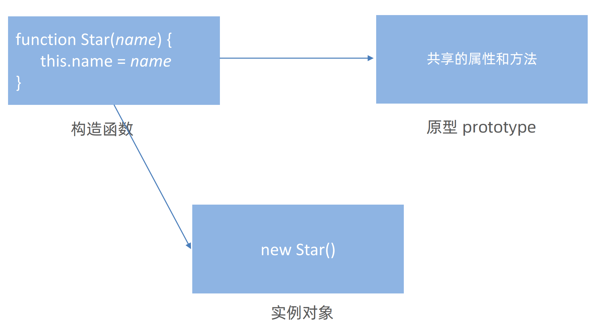
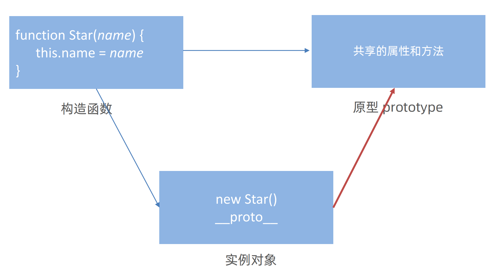
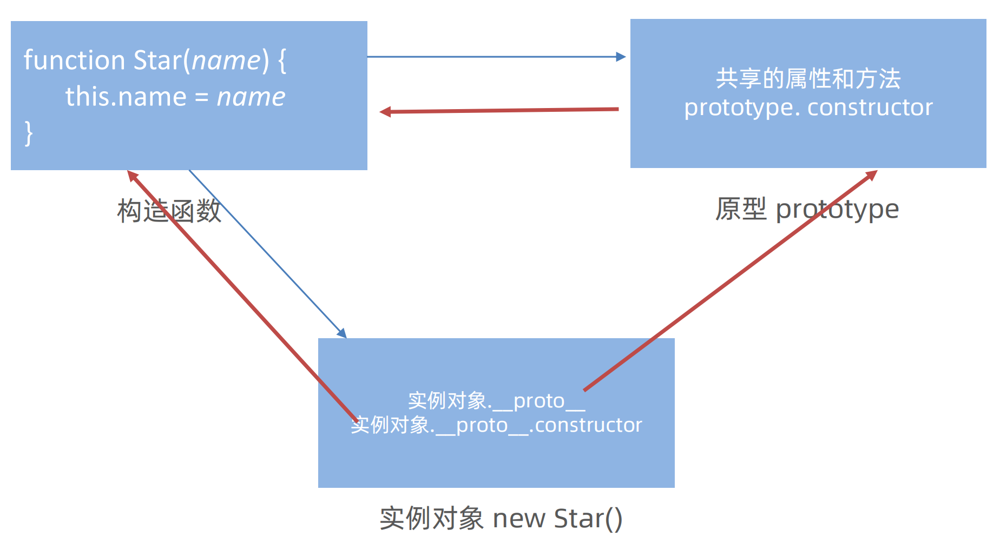

## JavaScript中\==与\===有什么区别？

在 JavaScript 里，== 和 === 都是用于比较两个值的运算符，它们之间的最主要区别是 是否进行类型转换

**类型转换**

-   **==（相等运算符）**：在进行比较时，会先尝试进行**类型转换**，然后再比较值是否相等。这种比较方式也被称作 “宽松相等”。

```js
console.log(5 == '5'); // true
console.log(true == 1); // true
console.log(null == undefined); // true，null 和 undefined 在使用 == 比较时被视为相等
```

-   **===（严格相等运算符）**：在比较时，不会进行类型转换，只有当两个值的类型和值都相等时，才会返回 true。这种比较方式也被称作 “严格相等”。

```js
console.log(5 === '5'); // false
console.log(true === 1); // false
console.log(null === undefined); // false，类型不同，null 是对象类型，undefined 是 undefined 类型
```

**性能**

从性能方面考虑，\=== 通常会比 \== 更快，这是因为 \== 需要进行类型转换的操作，而 \=== 无需进行类型转换

>   不过在现在JavaScript引擎中，这种性能差异微乎其微了已经

**可预测性**

\=== 的性能更加可预测。因为他不进行类型转换，所以不会出现一些令人困惑的结果。例如：

```js
console.log(0 == false) // true
console.log(0 === false) // false

console.log(null == undefined) // true
console.log(null === undefined) // false
```

在上面的例子中，很明显由于类型转换的原因，=== 运算符造成了一些反直觉的结果

注意！！！NaN的特殊情况（他是唯一一个 NaN不等价于NaN的，类似于MySQL中的null不等于null）

```js
console.log(NaN == NaN) // false
console.log(NaN === NaN) // false
```

**总结**

在开发中，推荐使用 \===，这可以避免很多潜在的bug


## 不会冒泡的事件有哪些？

## mouseEnter 和 mouseOver 有什么区别？


## 为什么需要将es6转换为es5

将 ES6（ECMAScript 2015）代码转换为 ES5 代码主要出于兼容性、性能优化、规避潜在问题等多方面的考虑

**浏览器兼容性**

-   旧版浏览器支持有限：ES6 引入了许多新的语法和特性，如箭头函数、模板字符串、解构赋值、Promise 对象等。然而，一些旧版本的浏览器（如 IE）对这些新特性的支持非常有限甚至完全不支持。如果直接在项目中使用 ES6 代码，这些旧浏览器在解析和执行代码时会出现错误，导致页面无法正常显示或功能无法正常使用。

-   用户群体广泛：在实际的互联网环境中，仍然有一部分用户在使用旧版本的浏览器。为了确保这部分用户也能正常访问网站或使用应用程序，就需要将 ES6 代码转换为 ES5 代码，以保证代码在各种浏览器环境下都能兼容运行。


**Node.js 版本兼容性**

-   旧版 Node.js 不支持新特性：在 Node.js 环境中，不同版本对 ES6 特性的支持程度也有所不同。
-   一些较旧的 Node.js 版本可能无法完全支持 ES6 的所有特性。如果项目需要在这些旧版本的 Node.js 上运行，就需要将 ES6 代码转换为 ES5 代码，以确保代码的兼容性和稳定性。

**代码性能和体积优化**

-   避免不必要的 polyfill：虽然可以使用 polyfill 来在旧环境中模拟 ES6 的新特性，但这会增加代码的体积。将 ES6 转换为 ES5 可以避免引入不必要的 polyfill，从而减小代码包的大小，提高页面的加载速度。

-   优化代码执行效率：某些 ES6 特性在转换为 ES5 后可能会有更好的性能表现。例如，ES6 的 class 语法在转换为 ES5 的构造函数和原型链实现后，可能会在某些旧浏览器或 Node.js 环境中执行得更快。
    

**团队协作和代码维护**

-   降低学习成本：团队中的成员可能对 ES6 的掌握程度不同。将代码统一转换为 ES5 可以降低新成员的学习成本，使他们更容易理解和维护代码。
-   避免兼容性问题带来的调试困难：如果代码中混合使用了 ES6 和 ES5 代码，可能会在不同环境中出现一些难以调试的兼容性问题。将代码统一转换为 ES5 可以减少这种不确定性，提高代码的可维护性。

**总结**

-   将 ES6 代码转换为 ES5 代码是为了确保代码在不同的浏览器和 Node.js 环境中都能正常运行，同时优化代码性能和体积，方便团队协作和代码维护。
-   在实际开发中，通常会使用 **Babel** 等工具来完成 ES6 到 ES5 的转换。


## js原型链

https://juejin.cn/post/7315846848459604005


## 对象原型(\__proto__)
构造函数可以创建实例对象，构造函数还有一个原型对象，一些公共的属性或者方法放到这个原型对象身上
但是 为啥实例对象可以访问原型对象里面的属性和方法呢？



**对象都会有一个属性 \__proto__ **指向构造函数的 prototype 原型对象，之所以我们对象可以使用构造函数 prototype  

原型对象的属性和方法，就是因为对象有 __proto__ 原型的存在



-   \__proto__ 是JS非标准属性
    -   所以部分浏览器中对象原型并非使用 \__proto__ 表示
-   [[prototype]] 和\__proto__意义相同 
-   \__proto__ 用来表明当前实例对象指向哪个原型对象prototype
    -   注意！！！ \__proto__ 是只读的
-   \__proto__对象原型里面也有一个 constructor属性，**指向创建该实例对象的构造函数**

