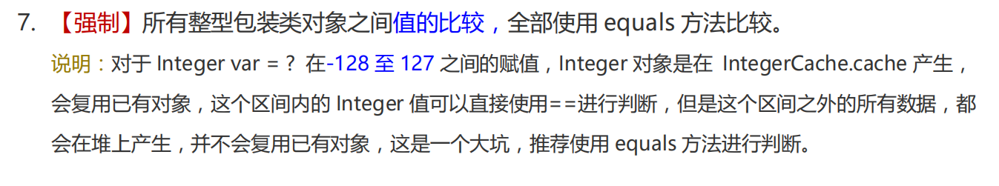

## 静态（类）变量和实例变量的区别？


## 静态（类）方法和实例方法的区别？


## 什么是Java的迭代器？


## compare与


## 怎么判断一个链条是不是环形链表？


## 什么是接口？


## 什么是抽象类？


## 接口和抽象类有什么区别？


## Java中的参数传递是按值还是按引用？


## 可变类与不可变类？


## 什么是Java中的不可变类？


## Java中Exception和Error有什么区别？

`Error` 和 `Exception` 都是`Throwable` 类的子类

在Java中，只有继承了Throwable类的实例，才可以被throws抛出或catch捕获

总的来说，`Error`  通常表示系统级的错误，是不可恢复的，程序无法处理它们 ；`Exception` 表示程序运行时可以被捕获和处理的异常

`Exception` 可以分为 **编译时异常（Checked Exceptions）**和**运行时异常（Unchecked Exceptions）**

-   编译时异常（Checked Exceptions）：必须在编译时**显式处理**的异常，必须通过 **try-catch 捕获**异常或通过 **throws 声明**
    -   常见类型：`IOException`、`SQLException`、`ClassNotFoundException`
-   运行时异常（Unchecked Exceptions）：不必在编译时显式处理的异常。
    -   常见类型：`NullPointerException`、`ArrayIndexOutOfBoundsException`、`IllegalArgumentException`、`ArithmeticException` 、`ClassCastException`

`Error`类： 表示严重的系统级错误或资源耗尽等问题    表示严重的错误，通常是由于系统级问题导致的，例如`OutOfMemoryError`、`StackOverflowError`等。

-   特点：通常是由 JVM 抛出，表示程序无法继续执行
-   程序员通常不需要捕获或处理 Error，因为它们通常是不可恢复的。
-   常见类型：`OutOfMemoryError`、`StackOverflowError`、`NoClassDefFoundError`等


## 常见的Error？

最常见的就是 `VirtualMachineError`，它有两个经典的子类：`StackOverflowError`、`OutOfMemoryError`

```java
public class ErrorTest {

    @Test
    public void testStackOverError() {
        recursion();  // StackOverflowError（栈内存溢出）
    }

    // 没有出口的递归
    public void recursion() {
        recursion();
    }

    
    @Test
    public void testOutOfMemoryError01() {
        // OutOfMemoryError
        // 方式一  
        int[] arr = new int[Integer.MAX_VALUE];
    }

    @Test
    public void testOutOfMemoryError02() {
        // 方式一
        StringBuilder s = new StringBuilder();
        while (true) {
            s.append("hello");
        }
    }
}
```


## Java运行时异常和编译时异常的区别是什么？

>   首先明确
>
>   ​	运行时异常 == 非受检异常 
>
>   ​	非运行异常 == 受检异常 == 编译时异常

在 Java 中，异常分为两大类：受检异常（Checked Exceptions） 和 非受检异常（Unchecked Exceptions）
-   **受检异常（Checked Exception）**：这些异常在**编译时必须被捕获或声明抛出，否则编译器会报错**。例如`IOException`、`SQLException`等。
-   **非受检异常（Unchecked Exception）**：这些异常不需要在编译时捕获或声明抛出，编译器不会强制要求处理它们。通常是由于编程错误导致的，例如`NullPointerException`、`ArrayIndexOutOfBoundsException`等。

**受检异常（Checked Exception）**

受检异常是指那些在**编译阶段**就必须处理的异常。编译器会强制要求程序员处理这些异常，否则代码无法通过编译。

特点

-   必须处理：如果方法中抛出了编译时异常，调用者**必须通过 try-catch 块捕获异常或通过 throws 关键字声明**该方法可能抛出此异常。
-   常见类型：`IOException`、`SQLException`、`ClassNotFoundException` 、`FileNotFoundException`等。

**非受检异常（Unchecked Exception）**

非受检异常是指那些在**运行时**才发生的异常，编译器不会强制要求程序员处理这些异常。它们**通常是由于程序中的逻辑错误引起的**。

特点

-   无需处理：编译器不要求必须捕获或声明这些异常，但可以选择性地处理。

-   常见类型：`NullPointerException`、`ArrayIndexOutOfBoundsException`、`IllegalArgumentException`、`ArithmeticException` 、`ClassCastException`等。
-   继承自 RuntimeException：所有运行时异常都是 RuntimeException 类及其子类的实例。

| 特性       | 受检异常（Checked Exceptions）                    | 非受检异常（Unchecked Exceptions）                           |
| ---------- | ------------------------------------------------- | ------------------------------------------------------------ |
| 别名       | 编译时异常、非运行时异常                          | 运行时异常                                                   |
| 定义       | 必须在编译时处理的异常                            | 运行时才发生的异常                                           |
| 编译器要求 | 必须捕获或声明                                    | 不需要捕获或声明                                             |
| 常见类型   | IOException, SQLException, ClassNotFoundException | NullPointerException, ArrayIndexOutOfBoundsException, IllegalArgumentException |
| 继承自     | Exception 类及其子类                              | RuntimeException 类及其子类                                  |
| 使用场景   | 外部环境导致的异常，如文件读写、网络连接等        | 程序逻辑错误，如空指针、数组越界、类转换异常等               |
| 处理方式   | 使用 try-catch 或 throws                          | 可以选择性地使用 try-catch                                   |


## 常见的编译时异常（非运行时异常）Checked Exceptions？

编译时异常（受检异常）是指那些在**编译阶段**就必须处理的异常。编译器会强制要求程序员处理这些异常，否则代码无法通过编译。

调用者**必须通过 try-catch 块捕获异常或通过 throws 关键字声明**该方法可能抛出此异常。

常见类型：`IOException`、`SQLException`、`ClassNotFoundException` 、`FileNotFoundException`等。

`ParseException`

```java
public static void main(String[] args) throws ParseException {
    String data = " 2020-04-10 14:25:25";
    SimpleDateFormat simpleDateFormat = new SimpleDateFormat("yyyy-MM-dd HH:mm:ss");
    Date d = simpleDateFormat.parse(data);  // 抛出编译时异常
    System.out.println(d);
}
```

`InterruptedException`

```java
@Test
public void test1() {
    try {
        Thread.sleep(1000);  // InterruptedException
    } catch (InterruptedException e) {
        e.printStackTrace();
    }
}
```

`ClassNotFoundException`

```java
@Test
public void test2() {
    try {
        Class.forName("java.lang.String");  // ClassNotFoundException
    } catch (ClassNotFoundException e) {
        e.printStackTrace();
    }
}
```

`FileNotFoundException`

```java
@Test
    public void test3() {
        try {
            // FileNotFoundException
            FileInputStream fis = new FileInputStream("hello.txt");
        } catch (FileNotFoundException e) {
            e.printStackTrace();
        }
    }
```

`SQLException`

```java
@Test
public void test4() {
    try {
        DriverManager.getConnection("...");  // SQLException
    } catch (SQLException throwables) {
        throwables.printStackTrace();
    }
}
```

`IOException`

```java
@Test
public void test5() {
    try {
        FileInputStream fis = new FileInputStream("hello.txt");  // FileNotFoundException
        fis.read();  // IOException
    } catch (IOException e) {
        e.printStackTrace();
    }
}
```


## 常见的运行时异常（非受检异常）UnChecked Exceptions？

非受检异常是指那些在**运行时**才发生的异常，编译器不会强制要求程序员处理这些异常。它们**通常是由于程序中的逻辑错误引起的**。

特点

-   无需处理：编译器不要求必须捕获或声明这些异常，但可以选择性地处理。

-   常见类型：`NullPointerException`、`ArrayIndexOutOfBoundsException`、`IllegalArgumentException`、`ArithmeticException` 、`ClassCastException`等。

`ArrayIndexOutOfBoundsException`

```java
    @Test
    public void test1() {
        int[] arr = {1, 2, 3};
        System.out.println(arr[3]);  // ArrayIndexOutOfBoundsException 数组角标越界异常
        // 在开发中，数组的越界异常是不能出现的，一旦出现了，就必须要修改我们编写的代码
    }
```

`NullPointerException`

```java
@Test
public void test2() {
    String srt = null;
    System.out.println(srt.equals("hello"));  // NullPointerException 空指针异常
}
```

`ClassCastException`

```java
@Test
public void test3() {
    Object n = 15;
    String str = (String) n;  // ClassCastException
}
```

`NumberFormatException`

```java
@Test
public void test4() {
    String s = "12ab";
    Integer.parseInt(s);  // NumberFormatException
}
```

`InputMismatchException`

```java
@Test
public void test5() {
    Scanner sc = new Scanner(System.in);
    System.out.print("请输入一个整数:");
    int n = sc.nextInt();// 我们输入一个非整数，让程序报错 InputMismatchException
    sc.close();
}
```

`ArithmeticException`算术异常

```java
@Test
public void test6() {
    System.out.println(10 / 0);  // ArithmeticException
}
```


## throw和throws的区别？

-   throws使用于方法声明（方法签名）处，指明将产生的异常向上一层抛出（抛给方法调用者）。
-   trhow使用于方法内部，后面紧跟着的是异常类对象，表示手动抛出指定的异常类对象。
    -   例如：`throw new Exception("输入的id非法");`
-   throws是用来处理异常对象的
-   throw是用来产生异常对象的


## 异常处理时需要注意哪些？

异常处理时需要注意以下六点：

**（1）尽量不要捕获类似于Exception这样的通用异常，而应该捕获特定的异常**

**（2）不要”吞“了异常**

如果我们捕获了异常，却不把异常抛出，也没有写入到日志里，那么会发生什么情况？

线上除了bug莫名其妙的任何的信息，你都不知道哪里出错，出错的原因是什么，这会导致一个简单的bug难以排查。

还有就是如果你的项目中使用了spring的声明式事务，那么事务也不会回滚。

还有些人，喜欢在使用了catch之后用`e.printStackTrace`，在开发中，通常是不推荐这种做法的，一般情况下这样子做没有问题，这个方法输出的是一个标准错误流。

比如在分布式系统中，发生异常但找不到stackTrace。

所以最好是输入到日志中，定义自己公司的格式，将详细的信息输入到日志系统中，适合清晰高效的排查错误。

**（3）不要延迟处理异常**

比如你有一个方法，参数是name，函数内部调了别的好几个方法，其实你的name传递的是null值，但是你没有在进入这个方法或一开始就处理这个情况，而是在你调用了好几个别的方法后爆出了这个空指针。

**（4）只在需要try-catch的地方try-catch，try-catch的范围能小则小**

只在需要try-catch的地方使用，不要滥用，因为try-catch中的代码会影响JVM对代码的优化，例如重排序。

**（5）不要通过异常来控制程序流程**

一些可以使用if/else的条件语句来判断的，例如null值等，就不要使用异常，异常肯定是比一些条件语句低效的，有CPU分支预测的优化等。

而且每次实例化一个异常都会对栈进行快照，相对而言这是一个比较重的操作，如果数量过多开销就不能被忽略了

**（6）不要在finally代码块中处理返回值或直接return**

在finally中处理返回值或直接return会发生很诡异的事情，比如覆盖了try中的return，或者屏蔽了异常


## try-catch-finally都是干啥的？try中有return时的执行流程？

`try`：用来捕获异常
`catch`：用于处理try中捕获的异常
`finally`：无论是否捕获或处理异常，fianlly块中的代码都会被执行。

**基本结构**

```java
try {
	// 可能产生异常的代码
} catch (异常类型1 e) {s
     //当产生异常类型1 型异常时的处置措施
} catch (异常类型2 e) {
     //当产生异常类型2 型异常时的处置措施
} finally{
	//无论是否发生异常，都无条件执行的语句
}
```

**语法规则**

-   try必须有
-   finally可以无
-   try后面必须跟catch 或者 finally 其中之一
-   try后面可以有0个或者多个catch，只能有0个或者1个finally。
-   若try后面没有catch，则必须有一个finally
-   只要try里面出现异常，无论try里是否含return，出现异常下面的程序都不会再执行了

**使用细节**

-   将可能出现异常的代码声明在try语句中，一旦代码发现异常，就会自动生成对应的异常类对象，并将此对象抛出
-   针对try语句抛出的异常类对象，使用catch语句进行匹配。
    -   一旦匹配上，就进入catch语句块进行处理（即捕获）， 一旦处理结束，代码就可继续往下执行。
    -   如果匹配不上，那么JVM 将会终止当前方法的执行，并把异常对象“抛”给调用者。如果调用者不处理，程序就挂了。
-   如果声明了多个catch结构，不同的异常类型在不存在子父类关系的情况下，谁声明在上面，谁声明在下面都可以
    -   如果多个异常类型满足子父类关系，则必须将子类声明在父类结构的上面。否则，报错。
-   catch中异常处理的方式：
    -   1）自己编写输出的语句
    -   2） printStackTrace()：打印异常的详细信息。
    -   3）getMessage()：获取发生异常的原因
-   try中声明的变量，作用域只在try结构内部局部有效
-   try-catch结构是可以嵌套使用的


**情况1：try{} catch(){}finally{} return;**

```java
try{
    
} catch () {
    
} finally {
    
}
return;
```

程序按顺序执行。

**情况2：try{ return; }catch(){} finally{} return;**

```java
try{
    return;
} catch () {
    
} finally {
    
}
return;
```

程序执行try块中return之前（包括return语句中的表达式运算）代码；再执行finally块，最后执行try中return;

finally块之后的语句return，因为程序在try中已经return所以不再执行。

**情况3：try{ } catch(){return;} finally{} return;**

```java
try{
    
} catch () {
    return;
} finally {
    
}
return;
```

程序先执行try，如果遇到异常执行catch块， 有异常：则执行catch中return之前（包括return语句中的表达式运算）代码，再执行finally语句中全部代码，最后执行catch块中return

finally块之后的语句return不再执行。

无异常：执行完try再finally再return

**情况4：try{ return; }catch(){} finally{return;}**

```java
try{
   	return;
} catch () {
    
} finally {
    return;
}
```

程序执行try块中return之前（包括return语句中的表达式运算）代码；再执行finally块，因为finally块中有return所以**提前退出**。

**！！！因此，开发中，禁止在finally块在使用return，因为它会覆盖try块中正常的reuturn**

**情况5：try{} catch(){return;}finally{return;}**

```java
try{
   	
} catch () {
    return;
} finally {
    return;
}
```

程序执行catch块中return之前（包括return语句中的表达式运算）代码；再执行finally块，因为finally块中有return所以**提前退出**。

**情况6：try{ return;}catch(){return;} finally{return;}**

```java
try{
   return;
} catch () {
    return;
} finally {
    return;
}
```

程序执行try块中return之前（包括return语句中的表达式运算）代码；有异常：执行catch块中return之前（包括return语句中的表达式运算）代码；则再执行finally块，因为finally块中有return所以提前退出。无异常：则再执行finally块，因为finally块中有return所以提前退出。

**结论：**

​    任何执行try 或者catch中的return语句之前，都会先执行finally语句，如果finally存在的话。如果finally中有return语句，那么程序就return了，所以finally中的return是一定会被return的

**！！！因此，开发中，禁止在finally块在使用return，因为它会覆盖try块中正常的reuturn**


## finally块一定会执行吗？

正常情况下，任何执行try 或者 catch 中的return语句之前，都会先执行finally语句，因此我们通常会将资源释放操作、业务日志的对应等操作放在finally块中。

但是，在以下两种情况下不会执行

1、程序还没有进入到try语句块就因为异常导致程序终止，这个问题主要是开发者在编写代码的时候，异常捕获的范围不够

2、极端情况下，在 try 或者 catch 语句块中执行了System.exit(0)语句，导致JVM直接退出， finally块不会执行


## Java中final、finally、finalize的区别？

**final**：用于修饰类、方法、变量，主要用来涉及不可变类、确保类的安全性、优化性能（编译器优化）

-   类：被final修饰的类不能被继承
-   方法：被final修饰的方法不能被重写
-   变量：被final修饰的变量不可重新赋值，常用于常量

**finally**：与`try-catch`结合使用，用于异常处理，确保某些代码总是会执行，如关闭资源、锁释放等

**finalize**：是Object类在的方法，用于对象被垃圾回收之前的清理操作，但由于不确定性，不推荐依赖finalize方法进行重要的清理工作，因为JVM不保证finalize()会被及时执行

>   **JDK9**之后，finalize()方法已被标记为**废弃**，因为Java提供了更好的替代方案（如实现`AutoCloseable`接口的资源可以使用`try-with-resources`语句自动关闭，该语句是一个语法糖）


扩展

**finally的注意事项**

不推荐在`finally`中使用`return`，这样会覆盖`try`中使用`return`，容易引发难以发现的问题

**finalize()方法的替代方案**

当JVM检测到对象不可达时，会标记对象，标记后调用finalize()方法进行清理（如果有重写了该方法），之后才会真正的回收对象

**但JVM并不承诺一定会等待finalize()方法运行结束**，因此可能会造成内存泄露或性能问题，所以在开发中，尽量避免使用finalize()方法进行清理操作

Java7引入了`try-with-resources`，他比依赖finalize() 更加安全有效，能够自动关闭实现`AutoCloseable`接口的资源。

或者可以依赖对象的生命管理机制（如spring的`DisposableBean`）来实现更精细化的资源回收


## 什么是内部类？与普通的区别？有什么用？


## JDK8的新特性？

### Java8新增了哪些新特性？

-   接口的默认方法和静态方法
    -   默认方法：接口中可以定义默认方法，子类可以选择性地重写这些方法。
    -   静态方法：接口中可以定义静态方法，可以直接通过接口调用。
-   新的日期和时间API：java8引入了`java.time`包，提供了更丰富的日期和时间处理功能。
-   Option类：Option类用于表示可能为null的值，避免空指针异常。
-   函数式接口：函数式接口是只有一个抽象方法的接口，可以用`@FunctionalInterface`注解标记。函数式接口的变量可以采用Lambda表达式进行赋值。
-   Lambda表达式：Lambda表达式允许你将函数作为参数传递。
-   方法引用：方法引用允许你直接引用已有的方法或构造器，而无需显式地创建Lambda表达式。
-   移除PermGen空间：Java8移除了PermGen（永久代）空间，取而代之的是Metaspace（元空间）

### 接口中的默认方法和静态方法

在jdk8之前，interface之中可以定义变量和方法，**变量必须是`public`、`static`、`final`的**，**方法必须是`public`、`abstract`的**，由于这些修饰符都是默认的，所以在书写的时候可以省略不写。

-   接口定义方法：public  abstract —— 需要子类实现

-   接口定义变量：public、static、final （记住，接口中的变量必须初始化）

在JDK 1.8开始 支持使用`static`和`default` 修饰 可以写方法体，不需要子类重写（可以选择性的重写）。

```java
public interface MyInterface {
    // public final static int age=18;
    int age = 18;  // 接口中的变量 必须初始化

    //public abstract void doSomething(String input);
    void doSomething(String input);  // 接口中的抽象方法 不必声明方法体

    /**
     * 默认方法 可以写方法体
     */
    default void getDefaultOrder() {
        System.out.println("我是默认方法 我可以写方法体");
    }

    /**
     * 静态方法 可以写方法体
     */
    static void getStaticOrder() {
        System.out.println("我是静态的方法 可以写方法体");
    }
}


public class MyInterfaceImpl implements MyInterface{

    // 接口中的抽象方法 必须重写
    @Override
    public void doSomething(String input) {

    }

    // 默认方法可以重写，但没必要
    @Override
    public void getDefaultOrder() {

    }
}
```


### Option


### HashMap底层数据结构的改变


### 日期类


### Lambda

Java中使用Lambda表达式（Lambda expression）是为了**简化匿名内部类的代码形式**

Lambda表达式**适用于单接口匿名类**(**接口中只有一个抽象方法的匿名内部类**)

以下是Lambda表达式简化匿名内部类的格式

```java
(匿名内部类被重写方法的形参列表) -> {
    被重写方法的方法体（Lambda体）
}

lambda形参列表 -> lambda体
 
// -> 是语法形式，无实际意义
```

注意：

​	Lamdba表达式只能简化**函数式接口的匿名内部类**的写法形式（换句话说，Lambda是实现函数式接口的一种语法糖）

**函数式接口**（jdk8新特性）

-   必须是接口
-   接口中只有一个抽象方法（接口中可以有多个static方法、default方法，但只能有一个抽象方法）
-   一般可以加上**@FunctionalInterface**注解，来声明这是函数式接口

>   Lambda表达式基本作用？
>
>   -   简化函数式接口的匿名内部类的写法
>
>   Lambda表达式使用要注意什么？
>
>   -   必须是接口的单接口匿名内部类
>
>   Lambda表达式该何时使用？
>
>   -   需要作为接口的实现类对象时使用
>
>   Lambda表达式的好处
>
>   -   Lambda是一个匿名函数，我们可以把Lambda表达式理解为是一段可以传递的代码（即，**Lambda表达式可以被用作参数传递或返回值**），它可以写出更简洁、更灵活的代码，同时使代码风格更加紧凑，**使Java语言表达能力得到了提升**
>
>   **Lambda表达式的本质：**
>
>   -   一方面，Lambda表达式作为接口的实现类对象。
>   -   另一方面，Lambda表达式是一个匿名函数


### 函数式接口

**什么是函数式接口**

-   **接口中只声明一个抽象方法**（Single Abstract Method，简称 SAM）的接口，称为函数式接口。
    -   当然该接口可以包含其他非抽象方法（例如，可以有static方法、default方法）。 
-   你**可以通过 Lambda 表达式来创建该接口的对象**。（若 Lambda 表达式抛出一个受检异常(即非运行时异常)，那么该异常需要在目标接口的抽象方法上进行声明）。  
-   我们**可以在一个接口上使用 `@FunctionalInterface` 注解**，这样做**可以检查它是否是一个函数式接口**。同时 javadoc 也会包含一条声明，说明这个接口是一个函数式接口。  
-   在 `java.util.function` 包下定义了 Java 8 的丰富的函数式接口

**对函数式接口的理解**

-   Java 从诞生日起就是一直倡导**一切皆对象**，在 Java 里面面向对象(OOP)编程是一切。但是随着 python、scala 等语言的兴起和新技术的挑战，Java 不得不做出调整以便支持更加广泛的技术要求，即 Java 不但可以支持 OOP 还可以支持 OOF（面向函数编程）
    -   Java8 引入了 Lambda 表达式之后，Java 也开始支持函数式编程。
    -   Lambda 表达式不是 Java 最早使用的。目前 C++，C#，Python，Scala 等
        均支持 Lambda 表达式。
-   面向对象的思想：
    -   做一件事情，找一个能解决这个事情的对象，调用对象的方法，完成事情。
-   函数式编程思想：
    -   只要能获取到结果，谁去做的，怎么做的都不重要，重视的是结果，不重视过程。
-   在函数式编程语言当中，函数被当做一等公民对待。在将函数作为一等公民的编程语言中，Lambda 表达式的类型是函数。但是在 Java8 中，有所不同。在 Java8 中，Lambda 表达式是对象，而不是函数，它们必须依附于一类特别的对象类型——函数式接口。
-   简单的说，**在 Java8 中，Lambda 表达式就是一个函数式接口的实例。**这就是 Lambda表达式和函数式接口的关系。也就是说，**只要一个对象是函数式接口的实例，那么该对象就可以用 Lambda 表达式来表示。**

**核心函数式接口**

| 称谓       | 函数式接口      | 抽象方法                | 抽象方法特点          |
| ---------- | --------------- | ----------------------- | --------------------- |
| 任务型接口 | Runable         | void run()              | 无参无返回值          |
| 消费型接口 | Consumer\<T>    | void accept(T t)        | 有参无返回值          |
| 供给型接口 | Supplier\<T>    | T get()                 | 无参有返回值          |
| 函数型接口 | Function\<T, R> | R apply(T t)            | 有参有返回值          |
| 判断型接口 | Predicate\<T>   | boolean test(T t)       | 有参有返回值，boolean |
| 比较型接口 | Comparator\<T>  | int compare(T t1, T t2) | 有参有返回值，int     |


### 方法引用

方法引用是 Java 8 引入的一种简洁语法，用于直接引用已有方法或构造函数，而无需显式地使用 Lambda 表达式。它使得代码更加简洁和易读。

简单来说：

-   方法引用，可以看做是基于Lambda表达式的进一步刻画。
-   当需要提供一个函数式接口的实例时，我们可以使用lambda表达式提供此实例。
-   **当满足一定的条件的情况下，我们还可以使用方法引用或构造器引用替换lambda表达式**

方法引用的本质：

​	**方法引用作为了函数式接口的实例。** ===> 体现了 ”万物皆对象“


方法引用主要有以下几类：

-   静态方法引用
    -   引用类的静态方法。
    -   格式：ClassName::staticMethodName

-   实例方法引用
    -   引用某个对象的实例方法。
    -   格式：objectReference::instanceMethodName

-   特定类型的任意对象的实例方法引用（类::实例方法）
    -   引用某个类型的所有实例共有的方法（即该类型所有对象都可以调用的方法）。
    -   格式：ClassName::instanceMethodName
-   构造器引用
    -   引用类的构造方法来创建新对象。
    -   格式：ClassName::new


**静态方法引用**

**要求**

-   函数式接口中的**抽象方法a与其内部实现时调用的对象的某个静态方法b的形参列表和返回值类型都相同（一致）**
-   此时，可以**考虑使用方法b对方法a的替换、覆盖**。此替换或覆盖即为**方法引用**

**注意**

-   此方法b是静态（static修饰）方法，需要类调用

**使用场景**

-   如果某个Lambda表达式里只是调用一个静态方法，并且前后参数的形式一致，就可以使用静态方法引用

```java
public class MethodRefTest {

    /**
     * 类 :: 静态方法（静态方法引用）
     * Comparator中的 int compare(T o1, T o2)
     * Integer中的 int compare(int x, int y)
     */
    @Test
    public void test1() {
        // 1.匿名内部类
        Comparator<Integer> com1 = new Comparator<Integer>() {
            @Override
            public int compare(Integer o1, Integer o2) {
                return Integer.compare(o1, o2);
            }
        };
        System.out.println(com1.compare(12, 21));

        System.out.println("--------------");
        // 2.Lambda表达式简化
        Comparator<Integer> com2 = (o1, o2) -> Integer.compare(o1, o2);
        System.out.println(com2.compare(12, 21))
        ;
        System.out.println("--------------");
        // 3.方法引用简化
        Comparator<Integer> com3 = Integer::compare;  // 类::静态方法
        System.out.println(com3.compare(34, 34));
    }

    /**
     * Function中的 R apply(T t)
     * Math在的 long round(double a)
     */
    @Test
    public void test2() {
        // 1.匿名内部类
        Function<Double, Long> fun1 = new Function<Double, Long>() {
            @Override
            public Long apply(Double aDouble) {
                return Math.round(aDouble);
            }
        };
        System.out.println(fun1.apply(2.0));

        System.out.println("--------------");
        // 2.Lambda表达式
        Function<Double, Long> fun2 = (aDouble) -> Math.round(aDouble);

        System.out.println("--------------");
        // 3.方法引用
        // Function的抽象方法apply与Math类的静态方法round的形参列表与返回值类型一致
        // 因此使用round方法替换apply
        Function<Double, Long> fun3 = Math::round;  // 类::静态方法
    }
}
```


**实例方法引用**

**要求**

-   函数式接口中的**抽象方法a与其内部实现时调用的对象的某个方法b的形参列表和返回值类型都相同（一致）**
-   此时，可以**考虑使用方法b对方法a的替换、覆盖**。此替换或覆盖即为**方法引用**

**注意**

-   此方法b是非静态（不含static修饰）方法，需要对象调用

**使用场景**

如果某个Lambda表达式只是想调用一个实例方法，并且前后参数的形式一致，就可以使用实例方法引用

```java
public class MethodRefTest {

    /**
     * 对象 :: 实例方法（实例方法引用）
     */
    @Test
    public void test1() {
        // 1.匿名内部类
        Consumer<String> con = new Consumer<String>() {
            @Override
            public void accept(String s) {
                System.out.println(s);
            }
        };
        con.accept("hello world");

        System.out.println("--------------");
        // 2.Lambda表达式
        Consumer<String> con2 = s -> System.out.println(s);
        con2.accept("hello world");

        System.out.println("--------------");
        // 3.方法引用
        Consumer<String> con3 = System.out::println;  // 对象名::实例方法
        con3.accept("hello world");
    }

    /**
     * Supplier中的get方法
     * Employee中的String getName方法
     */
    @Test
    public void test2() {
        Employee emp = new Employee(1001, "马化腾", 34, 6000.38);
        // 1.匿名内部类
        Supplier<String> sup1 = new Supplier<String>() {
            @Override
            public String get() {
                return emp.getName();
            }
        };
        System.out.println(sup1.get());

        System.out.println("--------------");
        // 2.Lambda表达式
        Supplier<String> sup2 = ()->emp.getName();
        System.out.println(sup2.get());

        System.out.println("--------------");
        // 3.方法引用
        // Supplier的抽象方法get与emp对象的getName方法的形参列表与返回值类型一致
        // 因此使用getName方法替换get
        Supplier<String> sup3 = emp::getName;
        System.out.println(sup3.get());
    }
}
```


**类 :: 实例方法** （难点）

**要求**

-   函数式接口中的**抽象方法a与其内部实现时调用的对象的某个方法b的形参列表和返回值类型都相同（一致）**
-   同时，抽象方法a中有n个参数，方法b有n-1个参数，且**抽象方法a**的**第一个参数作为方法b的调用者**，且**抽象方法a的后n-1个参数与方法b的n-1个参数的类型相同（一致）**。
-   则此时，可以**考虑使用方法b对方法a的替换、覆盖**。此替换或覆盖即为**方法引用**

**注意**

-   此**方法b是非静态（不含static修饰）方法**，需要对象调用，但**形式上，写成对象a所属的类来调用**

**使用场景**

-   如果某个Lambda表达式里只是想调用一个实例方法，并且前面参数列表的**第一个参数作为方法的主调**，**后面所有的参数都是作为改实例方法的入参**，则就可以使用特定类型的方法引用。

```java
public class MethodRefTest3 {

    /**
     * 类 :: 实例方法（难点）
     *      todo 本质上依然是对象来调用实例方法
     * Comparator中的int compare(T o1, T o2)
     * String中的int t1.compareTo(t2)
     */
    @Test
    public void test1() {
        // 1.匿名内部类
        Comparator<String> com1 = new Comparator<String>() {
            @Override
            public int compare(String o1, String o2) {
                return o1.compareTo(o2);
            }
        };
        System.out.println(com1.compare("abc","abd"));
        System.out.println("--------------");

        // 2.Lambda表达式
        Comparator<String> com2 = (o1,o2)->o1.compareTo(o2);
        System.out.println(com2.compare("abc","abd"));
        System.out.println("--------------");

        // 3.方法引用
        Comparator<String> com3 = String::compareTo;  // 类（特定类型）::实例方法
        System.out.println(com3.compare("abc","abd"));
    }

    /**
     * BiPredicate中的boolean test(T t, U u)
     * String中的boolean s1.equals(s2)
     */
    @Test
    public void test2() {
        // 1.匿名内部类
        BiPredicate<String,String> biPre1 = new BiPredicate<String, String>() {
            @Override
            public boolean test(String s1, String s2) {
                return s1.equals(s2);
            }
        };
        System.out.println("--------------");

        // 2.Lambda表达式
        BiPredicate<String,String> biPre2 = (S1,S2)->S1.equals(S2);
        System.out.println("--------------");

        // 3.方法引用
        // BiPredicate的抽象方法test与String类的实例方法equals的形参列表与返回值类型一致
        // 且抽象方法test第一个参数作为实例方法equals的调用者
        // 因此使用equals方法替换test
        BiPredicate<String,String> biPre3 = String::equals;
        System.out.println(biPre3.test("abc","abd"));
    }


    /**
     * Function中的R apply(T t)
     * Employee中的String getName方法
     */
    @Test
    public void test3() {
        Employee emp = new Employee(1001, "马化腾", 34, 6000.38);
        // 1.匿名内部类
        Function<Employee,String> fun1 = new Function<Employee, String>() {
            @Override
            public String apply(Employee employee) {
                return employee.getName();
            }
        };
        System.out.println(fun1.apply(emp));
        System.out.println("--------------");

        // 2.Lambda表达式
        Function<Employee,String> fun2 = employee-> employee.getName();
        System.out.println("--------------");

        // 3.方法引用
        // Function的抽象方法apply与Employee类的实例方法getName的形参列表与返回值类型一致
        // 且抽象方法apply第一个参数作为实例方法getName的调用者
        // 因此使用getName方法替换apply
        Function<Employee,String> fun3 = Employee::getName;
        System.out.println(fun3.apply(emp));
    }
}
```


**构造器引用**

当 Lambda 表达式是创建一个对象，并且满足 Lambda 表达式形参，正好是给创建这个对象的构造器的实参列表，就可以使用构造器引用

**说明**

-   调用了类名对应的类中的某一个确定的构造器
-   **具体调用的是类中的哪一个构造器这取决于函数式接口的抽象方法的形参列表**

**使用场景**

-   如果某个Lambda表达式里只是在创建对象，并且前后参数情况一致，就可以使用构造器引用。

```java
public class ConstructorRefTest {
    /**
     * 构造器引用
     * Supplier中的T get()
     */
    @Test
    public void test1(){
        // 1.匿名内部类
        Supplier<Employee> sup1 = new Supplier<Employee>() {
            @Override
            public Employee get() {
                return new Employee();
            }
        };
        System.out.println(sup1.get());
        System.out.println("--------------");

        // 2.构造器引用
        Supplier<Employee> sup2 = Employee::new;   // 调用的是Employee类中空参的构造器
        System.out.println(sup2.get());
    }

    /**
     * Function中的R apply(T t)
     */
    @Test
    public void test2(){
        // 1.匿名内部类
        Function<Integer,Employee> fun1 = new Function<Integer, Employee>() {
            @Override
            public Employee apply(Integer id) {
                return new Employee(id);
            }
        };
        System.out.println(fun1.apply(18));
        System.out.println("--------------");

        // 2.构造器引用
        Function<Integer,Employee> fun2 = Employee::new;  // 调用的是Employee类中参数是Integer/int类型的构造器
        System.out.println(fun2.apply(18));
    }

    /**
     * BiFunction中的R apply(T t, U u);
     */
    @Test
    public void test3(){
        // 1.匿名内部类
        BiFunction<Integer,String,Employee> fun1 = new BiFunction<Integer, String, Employee>() {
            @Override
            public Employee apply(Integer id, String name) {
                return new Employee(id,name);
            }
        };
        System.out.println(fun1.apply(18,"kk"));
        System.out.println("--------------");

        // 2.构造器引用
        BiFunction<Integer,String,Employee> fun2 = Employee::new;  // 调用的是Employee类中参数是Integer/int、String类型的构造器
        System.out.println(fun2.apply(18,"kk"));
    }
}
```

-   当 Lambda 表达式是创建一个数组对象，并且满足 Lambda 表达式形参，正好是给创建这个数组对象的长度，就可以**数组构造引用**

```java
/**
     * 数组引用
     * Function中的R apply(T t)
     */
    @Test
    public void test1(){
        // 1.匿名内部类
       Function<Integer,Employee[]> fun1 = new Function<Integer, Employee[]>() {
           @Override
           public Employee[] apply(Integer length) {
               return new Employee[length];
           }
       };
        System.out.println(fun1.apply(10));
        System.out.println("--------------");

        // 2.数组引用
        Function<Integer,Employee[]> fun2 = Employee[]::new;
        System.out.println(fun2.apply(10));

    }
```


### Stream

**Stream流是什么？**

Stream流是Java8引入的一个强大功能，用于处理数据集合（如集合、数组）。Stream提供了一种高效且易于使用的处理数据的方式，支持顺序和并行处理。Stream不存储数据，而是通过管道操作（如过滤、映射、规约等）对数据进行处理。

Stream的主要特点

-   **懒加载**：Stream的许多操作都是懒加载的，这意味着它们不会立即执行，而是在终止操作（如collect、forEach等）时才会执行。
-   **链式调用**：Stream支持链式调用，可以将多个操作串联起来，形成一个流水线。
-   **函数式编程**：Stream支持函数式编程风格，可以使用Lambda表达式和方法引用来简化代码。
-   **并行处理**：Stream可以很容易地转换为并行流，利用多核处理器进行并行处理，提高性能。


**Stream 和 Collection 集合的区别**

**Collection 是一种静态的内存数据结构， 讲的是数据，而 Stream 是有关计算的，讲的是计算。**前者是主要面向内存，存储在内存中，后者主要是面向 CPU，通过 CPU 实现计算

流表面上看来去和集合很类似，都可以让我们转换和获取数据。但是他们之间存在着显著的差距：

-   **Stream 流并不存储数据。**这些元素可能存储在底层的集合中，或者是按需生成的。
-   **Stream 流操作不会修改其数据源。**例如，filter方法不会从流中移除元素，**而是会生成一个新的流**，其中不包含过滤掉的元素。
-   **流的操作是尽可能的惰性执行的。**这意味着直至需要其结果时，操作才会执行（即 一旦执行终止操作，就执行中间操作链，并产生结果。）。例如，如果我们只想查找前5个长单词而不是所以长单词，那么filter方法就会在匹配第5个单词后停止过滤。由此，我们甚至可以操作无限流。
-   Stream 流一旦执行了终止操作，就不能调用其他中间操作或终止操作了


**操作流的典型流程**

1.  **创建一个流** 一个数据源（如：集合、数组），获取一个流

2.  **中间操作**（指定将初始流转换为其他流，可能包含很多步骤，即中间操作的方法 

    返回值仍然是 Stream 类型的对象。因此中间操作可以是个**操作链**，可对数据源 

    的数据进行 n 次处理，但是在终结操作前，并不会真正执行）

3.  **终止操作**。（这个操作会强制执行之前的惰性操作，之后这个流就不能再用了）


**Stream流分为哪几类？怎么创建？**

​	Stream流在Java8中主要分为两类：顺序流（Sequential Stream）和并行流（Perallel Stream）。这两类流的主要区别在于处理数据的方式和性能表现。

**顺序流（Sequential Stream）**

顺序流按顺序处理数据，每次只处理一个元素。单线程执行。适用于数据量较小或对顺序有要求的场景。代码容易理解和调式

创建方式：

-   使用`Collection`接口的stream()方法

-   使用`Arrays`类的stream()方法

-   使用`Stream`类的静态方法of()、iterate()、generate()等

**并行流（Perallel Stream）**

并行流可以同时处理多个元素，利用多核处理器的并行计算能力。多线程执行。适用于数据量较大且对顺序无严格要求的场景。性能提升明显，但可能会增加代码复杂性和调式难度。

创建方式：

-   使用`Collection`接口的parallerStream()方法

-   使用`Stream`类的parallel()方法将顺序流转化为并行流


## Stream流中的map和flatMap方法的区别？

map方法不会影响流中元素的个数，但是流中元素的类型、元素值可能发生变化。它的原理是按照统一的规则将现在的流中每一个元素改造为另一个对象。

map方法会影响流中元素的个数，同时流中元素的类型、元素值可能发生变化。它的原理是按照某个规则将现在的流中每一个元素计算为一个新的Stream，然后最后将所有Stream合并为一个大的Stream

`map` 方法

-   **作用**：将每个元素通过给定的函数进行转换，并生成一个新的流。
-   **返回值**：返回一个与原始流大小相同的新流，其中每个元素都是经过转换后的结果。
-   **适用场景**：当你需要对每个元素进行一对一的转换时使用

```java
List<String> words = Arrays.asList("hello", "world");

List<Integer> wordLengths = words.stream()
    .map(String::length)
    .collect(Collectors.toList());

System.out.println(wordLengths); // 输出: [5, 5]
```

`flatMap` 方法

-   **作用**：将每个元素通过给定的函数进行转换，并将结果流展平（flatten）为一个单一的流。
-   **返回值**：返回一个包含所有转换后元素的新流，可能会比原始流更长或更短，具体取决于转换函数的输出。
-   **适用场景**：当你需要对每个元素进行一对多的转换，或者将嵌套的流展平为一个单一的流时使用。

```java
List<List<Integer>> nestedLists = Arrays.asList(
    Arrays.asList(1, 2),
    Arrays.asList(3, 4)
);

List<Integer> flatList = nestedLists.stream()
    .flatMap(List::stream)
    .collect(Collectors.toList());

System.out.println(flatList); // 输出: [1, 2, 3, 4]
```

**关键区别**

| 特性         | `map`                    | `flatMap`                            |
| :----------- | :----------------------- | :----------------------------------- |
| **转换方式** | 一对一转换               | 一对多转换或展平嵌套流               |
| **返回结果** | 每个元素转换为一个新元素 | 每个元素转换为多个元素或展平为单一流 |
| **流的结构** | 维持原有的流结构         | 展平嵌套的流结构                     |


## Stream中map、peek、forEach方法的区别？

`map`

-   **作用**：将每个元素通过给定的函数进行转换，并生成一个新的流。
-   **返回值**：返回一个与原始流大小相同的新流，其中每个元素都是经过转换后的结果。
-   **适用场景**：当你需要对每个元素进行一对一的转换时使用。
-   **是否终止操作**：不是终止操作（中间操作），可以链式调用其他流操作。

```java
List<String> words = Arrays.asList("hello", "world");

List<Integer> wordLengths = words.stream()
    .map(String::length)
    .collect(Collectors.toList());

System.out.println(wordLengths); // 输出: [5, 5]
```

`peek`

-   **作用**：用于调试目的，在不改变流中元素的情况下对每个元素执行操作（如打印日志）。
-   **返回值**：返回包含相同元素的新流，流的结构保持不变。
-   **适用场景**：主要用于调试，查看流中元素的状态，而不影响后续操作。
-   **是否终止操作**：不是终止操作（中间操作），可以链式调用其他流操作。

```java
List<String> words = Arrays.asList("hello", "world");

List<String> result = words.stream()
    .peek(System.out::println) // 打印每个元素
    .map(String::toUpperCase)
    .collect(Collectors.toList());

System.out.println(result); // 输出: [HELLO, WORLD]
```

`forEach`

-   **作用**：对流中的每个元素执行给定的操作。
-   **返回值**：无返回值（`void`），操作完成后流结束。
-   **适用场景**：当你需要对每个元素执行某些副作用操作（如打印、更新状态等）时使用。
-   **是否终止操作**：是终止操作（终端操作），执行后流结束，不能再链式调用其他流操作。

```java
List<String> words = Arrays.asList("hello", "world");

words.stream()
    .forEach(System.out::println); // 输出: hello world

// 注意：forEach之后不能再调用其他流操作
```

**关键区别**

| 特性             | `map`                    | `peek`                   | `forEach`                            |
| :--------------- | :----------------------- | :----------------------- | :----------------------------------- |
| **作用**         | 转换元素                 | 调试/查看元素            | 执行副作用操作                       |
| **返回值**       | 新流（转换后的元素）     | 新流（原样元素）         | 无返回值（`void`）                   |
| **是否终止操作** | 不是终止操作（中间操作） | 不是终止操作（中间操作） | 是终止操作（终端操作）               |
| **适用场景**     | 元素转换                 | 调试、日志记录           | 执行副作用操作（如打印、更新状态等） |

**使用注意事项**

-   **性能考虑**：`peek` 主要用于调试，不应在生产代码中滥用，因为它可能会引入不必要的性能开销。
-   **副作用**：`forEach` 适用于有副作用的操作（如打印、更新状态等），但它会终止流，因此不能与其他流操作链式调用。
-   **不可变性**：`map` 和 `peek` 都是中间操作，不会改变原始流的内容，而是返回新的流，这使得流操作更加安全和可预测。

**总结**

-   **map**：用于转换流中的元素，生成新流。
-   **peek**：用于调试或查看流中元素的状态，不影响流的结构。
-   **forEach**：用于对每个元素执行副作用操作，终止流


## Java中包装类与基础类型的区别？


## 什么是自动装箱和拆箱？


## int和Interger装箱是怎么实现的？


## Integer的构造器在Java8后有变动？

```java
public Integer(int value) {
    this.value = value;
} // 从jdk9开始，此构造器被标记为 @Deprecated ，而推荐使用valueOf方法
```


## Integer类型的数值比较？

在 Java 中，Integer 是一个包装类（wrapper class），用于将基本数据类型 int 封装为对象。由于 Integer 是引用类型，因此在进行数值比较时需要注意一些细节，尤其是自动装箱（autoboxing）和缓存机制的影响

先看一个例子：

```java
Integer a = Integer.valueOf(600);
Integer b = Integer.valueOf(600);
int c = 600;
System.out.println(a == b); 			// false
System.out.println(a.equals(b)); 		// true，因为Integer重写了equals方法
System.out.println(a == c); 			// true，==运算符，对于基本类型，比较的是值


Integer x = Integer.valueOf(99);
Integer y = Integer.valueOf(99);
System.out.println(x == y); 			// true，因为存在缓存机制
System.out.println(x.equals(y)); 		// true
```

**基本数值比较**

1）使用 == 比较 Integer 对象

-   == 比较的是引用：当使用 == 比较两个 Integer 对象时
    -   对于引用类型，== 实际上比较的是它们的引用（即内存地址），而不是它们封装的数值。

例如：即使两个 Integer 对象封装相同的数值，如果它们是不同的对象实例，== 会返回 false。

```java
Integer a = new Integer(100);
Integer b = new Integer(100);
System.out.println(a == b); // 输出: false
```

2）使用 .equals() 方法

-   .equals() 比较的是值（前提是需要equals方法被正确的重写）：Integer 类重写了 Object 类的 equals() 方法，确保它比较的是两个 Integer 对象封装的数值，而不是引用。
-   为了确保正确性，应该使用 equals() 方法来比较 Integer 对象的值。

```java
Integer a = new Integer(100);
Integer b = new Integer(100);
System.out.println(a.equals(b)); // 输出: true
```

小结

​	**推荐使用equals方法来比较两个Integer对象**

**自动装箱与缓存机制**

Java 为了优化性能，在 -128 到 127 之间的 Integer 对象会被缓存（通过 Integer.valueOf() 实现）。

这意味着在这个范围内的 Integer 对象可能会共享同一个实例，因此使用 == 比较时可能会得到 true 的结果。

```java
Integer x = 100; // 自动装箱
Integer y = 100; // 自动装箱
System.out.println(x == y); // 输出: true (因为 100 在缓存范围内，所以指向同一个引用)

Integer m = 150; // 自动装箱
Integer n = 150; // 自动装箱
System.out.println(m == n); // 输出: false (因为 150 不在缓存范围内)
```

**总结**

​	为了避免因自动装箱和缓存机制导致的意外行为，==始终使用 .equals() 方法 来比较 Integer 对象的值==。

**阿里规约**




## 什么是Java中的Integer缓存池？

Java的Integer缓存池是为了提升性能和节省内存。根据实战发现大部分的数据操作都集中在值比较小的范围，因此缓存这些对象可以减少内存分配和垃圾回收的负担，提升性能。

**原理**：

-   Java中自动装箱时，对于`-128` 到 `127` 直接的 `int` 类型，会直接返回一个已缓存的`Integer`对象，而不是创建新的对象。（**通过 Integer.valueOf() 实现**）
-   实现原理是int类型在自动装箱时会调用`Integer.valueOf()`，进而用到了IntegerCache
-   IntegerCache中的数据是在static静态块中通过遍历的方式生成的

**缓存池的使用场景**

-   **自动装箱**：当基本类型int转换为包装类Integer时，若数值在缓存范围内，返回缓存对象
-   **值比较**：由于相同范围内的整数使用同一个缓存对象，使用`==`可以正确比较它们的引用，而不需要使用`equals`。但是超过缓存池范围内的Integer对象，`==`比较的是对象引用，而不是数值。要比较数值，应使用`equals`方法
    -   因此，**阿里规约强制包装类之间的比较应使用`equals`方法**


**扩展**

在Java8及之后，可以通过JVM参数`-xx:AutoBoxCacheMax=size`来调整缓存池上限

```java
java --xx:AutoBoxCacheMax=500 // 表示将缓存池扩展到 -128到500
```

其他包装类的缓存机制

-   Long、Short、Byte包装类的缓存池范围是 -128到127
-   Flaot 和 Double 没有缓存池，因为是小数，太多了
-   Character缓存池范围是`\u0000`到`\u007F`（即0到127，代表ASCII字符集）
-   Boolean只有两个缓存值，true和false


## hashCode和equal方法是什么？

equals方法用于比较两个对象是否相等，hashCode方法用于返回对象的哈希值，这两个方法必须一起重写，而且选择的属性必须一致，因为：

hashCode方法必须遵循：

（1）如果进行equals比较时所用的信息没有被修改，那么同一个对象多次调用hashCode方法时，必须结果一致

（2）如果两个对象equals为true，那么它们的hashCode值也必须相同

（3）如果两个对象equals为false，那么它们的hashCode值相同或不同都可以。当然不同可以提升哈希表的性能

另外，equals方法必须遵循：

（1）自反性：x不为null，那么x.equals(x)必须为true

（2）对称性：x、y不为null，那么x.equals(y)与y.equals(x)结果必须相同

（3）传递性：x、y、z不为null，如果x.equals(y)为true，y.equals(z)为true，那么x.equals(z)结果必须一致

（4）一致性：x、y不为null，且x和y用于equals比较的属性值也没有修改，那么多次调用x.equals(y)结果必须一致

（5）如果x不为null，x.eqauls(null)必须返回false

>   问：两个对象的equals方法相等，hashCode方法也会相等吗？
>
>   答：对
>
>   问：两个对象的hashCode方法相等，equals方法也会相等吗？
>
>   答：不对
>
>   问：为什么重写equals就要重写hashCode？
>
>   答：因为hashCode必须遵循上述3条常规协定，这些规定是为`HashMap`、`HashSet`等基于哈希的集合类型提供正确行为的基础。如果不遵守这个约定，对象在使用这些集合类型时可能会表现出不可预测的行为


## 重写 hashCode() 方法的基本原则？

-   在程序运行时，同一个对象多次调用 hashCode() 方法应该返回相同的值。 
-   当两个对象的 equals() 方法比较返回 true 时，这两个对象的 hashCode() 方法的返回值也应相等。 
-   对象中用作 equals() 方法比较的 Field，都应该用来计算 hashCode 值。

## 重写 equals()方法的基本原则？

-   重写 equals 方法的时候一般都需要同时复写 hashCode 方法。通常参与计算hashCode 的对象的属性也应该参与到 equals()中进行计算。 
-   推荐：开发中直接调用 Eclipse/IDEA 里的快捷键自动重写 equals()和 hashCode()方法即可。 

为什么用 Eclipse/IDEA 复写 hashCode 方法，有 31 这个数字？ 

首先，选择系数的时候要选择尽量大的系数。因为如果计算出来的 hash 地址越大，所谓的“冲突”就越少，查找起来效率也会提高。（减少冲突） 

其次，31 只占用 5bits,相乘造成数据溢出的概率较小。 

再次，31 可以 由 i*31== (i<<5)-1 来表示,现在很多虚拟机里面都有做相关优化。（提高算法效率） 

最后，31 是一个素数，素数作用就是如果我用一个数字来乘以这个素数，那么最终出来的结果只能被素数本身和被乘数还有 1 来整除！(减少冲突) 


## 为什么重写equals时也需要重写hashCode？


## equal 与 == 的区别？

-   == 运算符
    -   基本数据类型：比较两个值是否相等。
    -   引用类型（对象）：比较两个引用是否指向同一个对象（即内存地址是否相同）。

-   equals() 方法
    -   **默认**行为：对于所有对象，默认实现是继承自 Object 类的 equals() 方法，它**实际上与 == 相同**，即**比较的是引用**。
    -   **重写后**的行为：许多类（如 String、Integer 等）重写了 equals() 方法以提供更有意义的比较逻辑。例如，String 的 equals() 比较的是字符串**内容**是否相同，而不是引用。

**注意事项**

-   **自动装箱和缓存**：对于基本类型的包装类（如 Integer），当数值在 -128 到 127 之间时，Java会进行缓存，因此在这个范围内使用 == 比较可能会得到 true，但这不是推荐的做法。

```java
Integer i1 = 100;
Integer i2 = 100;
System.out.println(i1 == i2); // true (因为缓存)
```

-   **null 检查**：使用 equals() 时需要注意避免 NullPointerException。可以使用 Objects.equals() 来安全地比较可能为 null 的对象。

总结：

​	== 用于比较基本数据类型或引用是否相同，而 equals() 用于比较对象的内容是否相同（前提是该方法被正确重写）

**equal 与 == 的区别**

|          | ==                                                       | equals                                                 |
| -------- | -------------------------------------------------------- | ------------------------------------------------------ |
| 比较范围 | 可以比较基本类型、引用类型                               | 只能比较引用类型                                       |
| 比较规则 | 基本类型：比较数据值<br>引用类型：比较引用值（内存地址） | 默认：与 == 一致<br>重写后：比较内容（具体看实现方法） |

示例

```java
public class Main {
    public static void main(String[] args) {
        String s1 = new String("abc");
        String s2 = new String("abc");
        System.out.println(s1 == s2);      // false
        System.out.println(s1.equals(s2)); // true 因为String类重写了equals
        Set<String> set1 = new HashSet<>();
        Collections.addAll(set1, s1, s2); 
        System.out.println(set1.size());   // 1 因为String重写了hashCode，内容一致hash值也一致
        System.out.println("===================");

        Person p1 = new Person("abc");
        Person p2 = new Person("abc");
        System.out.println(p1 == p2);     // false
        System.out.println(p1.equals(p2));// false 因为Person类没有重写equals，实际使用的是Object中的equals方法，比较的是引用
        Set<Person> set2 = new HashSet<>();
        Collections.addAll(set2, p1, p2);
        System.out.println(set2.size());  // 2 因为Person类没有重写hashCode，实际使用的是Object中的hashCode方法 
    }
}

// ！！！注意，此类没有重写hashCode和equals方法
class Person {
    private Integer id;
    private String personName;

    public Person(String personName) {
        this.personName = personName;
    }

    // getter、setter
} 
```


## Java中方法参数传值还是传引用？

>   Java语言总是按值传递的。参考：Java核心技术 4.5方法参数

先总结一下

-   基本数据类型参数的传值：传递数据值

-   引用类型参数的传值：传递地址值

在Java中，参数传递机制可以概括为**传值调用（Pass by Value）**，但其具体表现因传递的是基本数据类型还是引用数据类型而有所不同。

-   **基本数据类型**

当传递基本数据类型（如 int, float, char 等）时，方法接收的是该值的一份拷贝。因此，在方法内部对参数的修改不会影响到原始变量。

概述：传递的是数据值的拷贝

-   **引用数据类型**

对于引用数据类型（如对象、数组等），**传递的是引用的拷贝**（即内存地址的拷贝）。这意味着方法内部和外部共享**同一个对象实例**，因此如果在方法内改变对象的状态（例如修改对象的属性），这种改变会影响到原始对象。

然而，如果在方法内部重新给这个引用赋值（指向一个新的对象），这并不会影响到原始对象，因为这只是改变了该引用拷贝所指向的位置。

```java
public static void main(String[] args) {
    StringBuilder sb = new StringBuilder("Hello");
    reassignReference(sb);
    System.out.println(sb.toString()); // 输出"Hello"
}

public static void reassignReference(StringBuilder str) {
    str = new StringBuilder("World");
}
```

所以，Java中的参数传递是传值调用，但对于引用数据类型，传递的是引用的值（即内存地址），这使得方法可以操作原始对象的内容，但不能更改原始引用本身指向的对象。


demo

```java
public static void changeValue1(int age) {
    age = 10;
}
public static void changeValue2(Person person) {
    person.setPersonName("xxx");
}
public static void changeValue3(String str) {
    str = "xxx";
}

public static void main(String[] args) {
    int age = 20;
    changeValue1(age);
    System.out.println(age); // 20 因为基本类型，传值拷贝，方法内部对参数的修改不会影响到原始变量

    Person person = new Person("abc");
    changeValue2(person);
    System.out.println(person.getPersonName()); // xxx 引用类型，传递引用拷贝，方法内改变对象的状态，会影响到原始对象。

    String str = "abc";
    changeValue3(str);
    System.out.println(str); // abc 因为方法内部重新给这个引用赋值（指向一个新的对象），这并不会影响到原始对象，因为这只是改变了该引用拷贝所指向的位置
}

class Person {
    private Integer id;
    private String personName;

    public Person(String personName) {
        this.personName = personName;
    }

    // getter、setter
} 
```


## for循环与foreach循环的区别？

语法结构

-   for循环：需要初始化计数器、设置终止条件以及定义计数器的增量

-   foreach循环：语法更简洁，直接遍历数组或集合中的元素，无需关心索引

作用于使用场景

-   普通for循环，可以用于所有需要重复执行某些语句的场景。也可以用于遍历数组于支持索引访问的List集合。
-   增强for循环，只能用于遍历数组与Collection集合

使用区别

-   如果使用普通for遍历数组，需要指定下标值，可以修改数组的元素
-   如果使用增强for遍历数组，不需要指定下标，但无法修改数组的元素，可能会抛出`ConcurrentModificationException`异常

增强for循环只是一种语法糖

-   增强for循环遍历数组时，编译器仍然会将对应代码转化为普通for循环
-   增强for循环遍历Collection集合时，编译器会将对应代码转化为Iterator迭代器遍历集合的代码


## 为什么是动态代理？


## JDK动态代理与CGLib动态代理的区别？


## 什么是Java中的注解？


## 什么是Java的反射？

Java 反射（Reflection） 是一种强大的机制，允许程序在运行时动态地获取类的信息，并且可以操作类的字段、方法和构造函数。通过反射，程序可以在运行时检查或“内省”类的能力，甚至可以在运行时修改类的行为。

反射的**主要功能**包括：

-   获取类信息：可以获取类的名称、父类、实现的接口等。

-   创建对象实例：可以在运行时创建类的实例，而不需要在编译时知道具体的类名。

-   访问和修改字段：可以读取或修改类的私有字段。

-   调用方法：可以调用类的方法，即使这些方法是私有的。

-   获取和设置构造函数：可以调用类的构造函数来创建对象。

Java反射机制提供的功能：

-   在运行时判断任意一个对象所属的类
-   在运行时构造任意一个类的对象
-   在运行时判断任意一个类所具有的成员变量和方法
-   在运行时获取泛型信息
-   在运行时调用任意一个对象的成员变量和方法
-   在运行时处理注解
-   生成动态代理

**应用场景**

-   框架开发：许多框架（如 Spring、Hibernate）大量使用反射来实现依赖注入、动态代理等功能。
-   动态加载类：可以在运行时根据配置文件或其他条件动态加载类，而不需要在编译时确定具体的类名。
-   调试工具：反射可以用于编写调试工具，动态查看和修改对象的状态。
-   序列化和反序列化：反射可以用于实现自定义的序列化和反序列化逻辑。
-   测试工具：单元测试框架（如 JUnit）使用反射来动态调用测试方法。

**反射相关的主要API**

-   **java.lang.Class**：代表一个类

-   java.lang.reflect.Method：代表类的方法 

-   java.lang.reflect.Field：代表类的成员变量

-   java.lang.reflect.Constructor：代表类的构造器 

-   ....

**反射的优缺点**

**优点：**

-   提高了Java程序的灵活性和扩展性，**降低了耦合性**，提高**自适应**能力
-   允许程序创建和控制任何类的对象，无需提前**硬编码**目标类

**缺点：**

-   反射的**性能较低**。
    -   反射机制主要应用在对灵活性和扩展性要求很高的系统框架上
-   反射会**模糊程序内部逻辑，可读性较差**。

反射在平时的开发中，使用并不多。主要是在框架的底层使用（例如：Spring）

**反射的源头 Class**	

要想解剖一个类，必须先要获取到该类的 Class 对象。而剖析一个类或用反射解决具体的问题就是使用相关 API: 

-   java.lang.Class 
-   java.lang.reflect.* 

 所以，Class 对象是反射的根源。 

​	在 Java 中，`Class` 类是一个特殊的类，用于表示其他类的元数据。它提供了一种在运行时获取和操作类的方法和属性的机制。**每个类在Java虚拟机中都有一个对应的Class对象**，可以通过该对象获取类的信息。

**理解Class类**

以Java类的加载为说明：

​	针对编写好的 .java 源文件，使用 javac.exe 进行编译，生成一个或多个 .class 字节码文件。接着，使用 java.exe 命令对指定的 .class 文件进行解释执行。在这个过程中，我们需要将  .class 字节码文件加载（使用类加载器）到内存中（存放到方法区）。**加载到内存中的  .class 文件对应的结构即为 Class的一个实例。**


## Java反射机制如何获取Class类的实例，Class类有哪些常用方法？

**获取Class类的实例的四种方式**

-   类型名.class
-   Java对象.getClass()
-   Class.forName("类型全名称")
-   ClassLoader类加载对象.loadClass("类型全名称")

**方式 1：类型名.class**

​	**要求编译期间已知类型前提**：若已知具体的类，**通过类的 class 属性（静态属性）获取**，**该方法最为安全可靠，程序性能最高** 

```java
Class clazz = String.class; 	// 类调用静态属性
```

**方式 2：Java对象.getClass()**

```java
Class clazz = "hello".getClass(); // 对象.getClass()，因为在方法定义在Object在，任意内都可以使方法
```

 **方式 3：Class.forName("类型全名称")**

​	**可以获取编译期间未知的类型** 

**前提：已知一个类的全类名**，且该类在类路径下，可通过 Class 类的静态方法forName()获取，可能抛出 `ClassNotFoundException`

```java
Class clazz = Class.forName("java.lang.String"); // Class的静态方法，forName(String className) 推荐使用
```

**方式 4：ClassLoader类加载对象.loadClass("类型全名称")**

​	**使用类的加载器方式**（其实我们知道了类的全限名，完成可以使用第三种方式）

前提：可以**用系统类加载对象或自定义加载器对象加载指定路径下的类型** 

例如：

```java
ClassLoader cl = this.getClass().getClassLoader(); 
Class clazz4 = cl.loadClass("类的全类名")
```


**哪些类型可以有 Class 对象**

Class的实例都可以指向哪些结构呢？

简言之，所有 Java 类型！ 

（1）class：外部类，成员(成员内部类，静态内部类)，局部内部类，匿名内部类

（2）interface：接口 

（3）[]：数组 

（4）enum：枚举 

（5）annotation： 注解@interface

（6）primitive type：基本数据类型

（7）void


**Class类的常用方法**

（1）获取类信息

-   getName()  获取类的完全限定名
-    getSimpleName()  获取类的简单名称
-   getPackage()  获取类所在的包
-   isInterface()  判断该类是否是一个接口
-   isEnum()  判断该类是否是一个枚举
-   isAnnotation()  判断该类是否是一个注解  

（2）获取构造器

-   getConstructor(Class<?>... parameterTypes)  获取类的某个构造器：只能拿public修饰的某个构造器对象
-   getConstructors()  获取类的所有构造方法，只能获取public修饰的构造器  
-   getDeclaredConstructor(Class<?>... parameterTypes)  获取某个构造器：只要你敢写，就能拿到，无所谓权限是否可及（包括私有）
-   getDeclaredConstructors()  获取全部的构造器：只要你敢写，无所谓权限是否可及

-   setAccessible(boolean flag) 暴力反射(反射会破坏封装性)

（3）获取方法

-   getMethod(String name, Class<?>... parameterTypes)  获取类中的某个成员方法，只能获取public修饰的
-   getMethods()  获取类中的所有成员方法，只能获取public修饰的 
-    getDeclaredMethod(String name, Class<?>... parameterTypes)  获取类中某个成员方法
-   getDeclaredMethods()  获取类声明的所有方法

（4）获取字段

-   getField(String name)  获取类的某个成员变量，只能获取public修饰的
-   getFields() 获取类的所有成员变量，只能获取public修饰的
-   获取类的某个成员变量 getDeclaredField(String name)
-   getDeclaredFields()  获取类声明的所有字段

（5）创建实例

-   newInstance()  创建类的实例
    -   注意：要想对象创建成功，需满足以下条件
        -   1、要求运行时类中必须提供空参构造器
        -   2、要求提供的空参构造器的权限要足够，否则报错 IllegalAccessException
    -   从JDK9开始，此方法被标记为 `@Deprecated(since="9") `已过时   
    -   JDK9之后，我们会使用 Constructor 类的 newInstance方法 创建类的实例

-   Constructor\<T>.newInstance(Object... initargs)  使用指定的构造器创建一个实例

（6）获取父类和接口

-   getSuperclass()  获取类的父类
-   getInterfaces()  获取类实现的接口

（7）获取注解

-   getAnnotation(Class\<T> annotationClass)  获取该类上的指定注解
-   getAnnotations()  获取该类上的所有注解
-   getDeclaredAnnotation(Class\<T> annotationClass)  获取该类上的指定注解（包括私有）
-   getDeclaredAnnotations()  获取该类上的所有注解


## Java反射机制可以访问父类的私有方法吗？

可以，但是需要进行一个额外的操作来绕过Java的访问限制控制。步骤如下：

-   1、获取父类的 Class 对象
-   2、使用 getDeclaredMethod 方法获取私有方法
-   3、使用 setAccessible 方法解除访问限制（暴力反射）

-   4、使用 invoke 方法调用父类私有方法


## Java反射有没有性能影响|反射到底慢在哪里？

Java反射会对性能产生影响，主要体现在以下方面

1、初始化开销

-   类加载：使用反射时，如果类还没有被加载到JVM中，反射会触发类的加载过程。类加载本身就是一个相对耗时的操作，因为它涉及到类文件的读取、解析和验证

-   对象创建：通过反射创建对象时，需要查找和解析类的构造器，这比直接使用 new 关键字创建对象要慢

2、方法调用开销

-   动态绑定：反射调用方法时，需要在运行时动态查找和绑定方法，这比编译时静态绑定的方法调用慢得多。每次调用反射方法时，都需要进行方法查找和权限检查

-   缓存机制：虽然现代JVM对反射方法调用进行了优化，例如缓存方法查找结果，但仍然无法完全消除性能差距

3、安全检查

-   访问控制：使用 setAccessible方法来访问私有成员时，JVM需要进行额外的安全检查，以确保这种操作是允许的，这些安全检查会增加额外的开销

4、字符串操作

-   方法和字段名称：反射通常需要使用字符串来指定方法和字段名称，这会导致额外的字符串处理和比较操作。

5、内存开销

-   元数据：反射操作需要维护大量的元数据信息，这些信息会占用额外的内存


## Java为什么要引入模块化？（JDK9）

Java模块化是指Java9及其之后引入的一种新的组织和管理代码的方式，旨在解决传统Java应用的类路径问题和依赖管理问题。

好处：

-   更好的封装：模块化系统提供了强封装机制，只有显式导出的包才能被其他模块访问，提高了代码的安全性和可维护性
-   清晰的依赖管理：模块描述符（module-info.java）明确声明了模块的依赖关系，避免了类路径污染和依赖冲突问题
-   更好的性能：模块化系统可以优化类加载过程，减少不必要的类加载，提高应用的启动速度和运行效率
-   更好的可维护性：模块化系统鼓励将diamond组织成独立的模块，每个模块负责一个特定的功能。提高了代码的可维护性和可测试性


## 什么是Java中的SPI（service provide interface）机制？


## Java中深拷贝和浅拷贝的区别？


## 简述Java的类加载过程？
