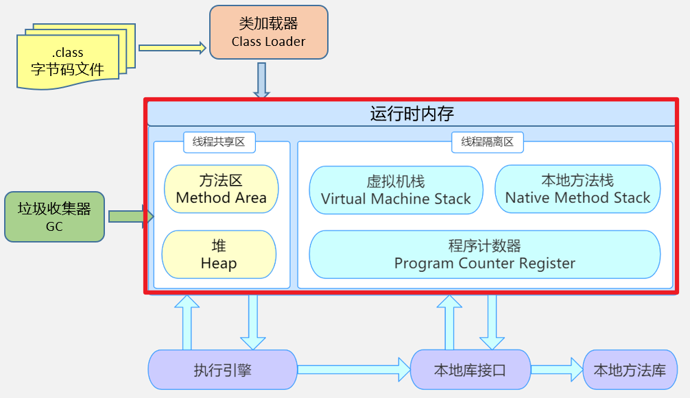

# Java-多线程基础

## 1 相关概念

### 1.1 程序、进程、线程

**程序（program）**：为完成特定任务，用某种语言编写的一组指令的集合。即指一段静态的代码，静态对象。

**进程（process）：**程序的一次执行过程，或是正在内存中运行的应用程序。如：运行中的 QQ，运行中的网易音乐播放器。

-   每个进程都有一个独立的内存空间，系统运行一个程序即是一个进程从创建、运行到消亡的过程。（生命周期）

-   程序是静态的，进程是动态的

-   **进程作为操作系统调度和分配资源的最小单位**（亦是系统运行程序的基本单位），系统在运行时会为每个进程分配不同的内存区域。

-    现代的操作系统，大都是支持多进程的，支持同时运行多个程序。比如：现在我们上课一边使用编辑器，一边使用录屏软件，同时还开着画图板，dos 窗口等软件。

​    
**线程（thread）：**进程可进一步细化为线程，是程序内部的一条执行路径。一个进程中至少有一个线程。

-   一个进程同一时间若并行执行多个线程，就是支持多线程的。
-   **线程作为 CPU 调度和执行的最小单位。**
-   **一个进程中的多个线程共享相同的内存单元**，它们从同一个堆中分配对象，可以访问相同的变量和对象。这就使得线程间通信更简便、高效。但多个线程操作共享的系统资源可能就会带来安全的隐患。
-   与进程相比，线程更加”轻量级“，创建、撤销一个线程比启动新进程的开销小得多。

下图中，红框的蓝色区域为线程独享，黄色区域为线程共享。



注意：

-   不同的进程之间是不共享内存的。
-   进程之间的数据交换和通信的成本很高。

### 1.2 线程调度

**分时调度**

所有**线程轮流**使用cpu的使用权，并且平均分配每个线程的使用时间

**抢占式调度**

让**优先级高**的线程以**较大的概率**优先使用 CPU。如果线程的优先级相同，那么会随机选择一个(线程随机性)，**Java使用的为抢占式调度。**

### 1.3 多线程程序的优点

以单核CPU为例，只使用单个线程先后完成多个任务（调用多个方法），肯定比用多个线程来完成用的时间更短，为何仍需多线程呢？

**多线程程序优点：**

-   提高应用程序的响应。对图形化界面更有意义，可增强用户体验。
-   提高计算机系统CPU的利用率
-   改善程序结构。将既长又复杂的进程分为多个线程，独立运行，利于理解和修改

### 1.4 并发与并行

**并发（concurrency）**：指**两个或多个事件在同一个时间段内发生**。即在一段时间内，有多条指令在单个CPU上快速轮换、交替执行，使得在宏观上具有多个进程同时执行的效果。（微观上分时交替执行，宏观上同时进行）    

比如：

​	小渣有五个女朋友，在某一天的上午7点到12点需要与五个女朋友约会，在7-8点他与女友A约会，8-9点他与女友B约会，9-10点他与女友C约会，10-11点他与女友D约会，11-12点他与女友E约会，他在一上午与5个女朋友约会了，在宏观上他就是在8-12点这段时间内与五个女朋友一起约会了。

**并行（parallel）**：指两个或多个事件在同一时刻发生（同时发生）。指在同一时刻，有多条指令在多个CPU上同时执行。

比如：

​	小渣有五个女朋友，在某一天的上午7点到12点需要与五个女朋友约会，意思就是在7-12点这段时间（假设这是一个时刻）内要与五个女朋友一起约会，这就叫并行。（但是这在现实生活中肯定是不肯的，除非有五个小渣）

## 2 创建和启动线程

### 2.1 概述

Java语言的JVM允许程序运行多个线程，使用java.lang.Thread类代表**线程**，所有的线程对象都必须是Thread类或其子类的实例。

**Thread类的特性**

-   每个线程都是通过某个特定Thread对象的run()方法来完成操作的，因此把**run()方法体称为线程执行体**。
-   通过该Thread对象的**start()方法来启动这个线程**，而非直接调用run()（如果使用Thread方法直接调用run方法，相当于main线程在执行该方法）
-   要想实现多线程，必须在主线程中创建新的线程对象

在学习线程的创建方式之前需要明白：下面的方式都只是创建线程的方式，==本质上线程的创建方式只有一种，那就是Thread.start()==

### 2.2 方式1：继承Thread类

Java通过继承Thread类来**创建**并**启动多线程**的步骤如下：

1.  定义**Thread类的子类**，并**重写**该类的**run()方法**，该run()方法的方法体就代表了线程需要完成的任务
2.  创建Thread子类的实例，即创建了线程对象
3.  调用线程对象的**start()方法**来**启动该线程**

不过这种创建线程的方式已经不推荐使用了，应该要将并行的任务与运行机制解耦合。

**基本格式如下**

```java
// 自定义Thread类

public class MyThread extends Thread{

    // 指定线程名称的有参构造器
    public MyThread(String name) {
        super(name);  //调用父类的String参数的构造方法，指定线程的名称
    }

    /**
     * 重写run方法，完成该线程执行的逻辑
     */
    @Override
    public void run(){
        
    }
}

// 测试类
public class TestMyThread {
    public static void main(String[] args) {
        //创建自定义线程对象
        Thread t1 = new Thread("子线程2");  // 使用有参构造器指定线程名称
        Thread t2 = new Thread();  // 不指定线程名称，则使用Thread类提供的默认名称

        //开启子线程
        t1.start();
        t2.start();

        // 主方法执行的逻辑

    }
}

```

注意：

-   如果自己手动调用run()方法，那么就只是普通方法，没有启动多线程模式。
-   run()方法由JVM调用，什么时候调用，执行的过程控制都有操作系统的CPU调度决定。
-   想要启动多线程，必须调用start方法。
-   **一个线程对象只能调用一次start()方法**启动线程，如果重复调用了，则将抛出以上的异常“IllegalThreadStateException”。

演示

使用多线程打印1-100以内的偶数

```java
public class EvenNumberDemo {
    public static void main(String[] args) {
        EvenNumberThread evenNumberThread = new EvenNumberThread();
        evenNumberThread.start();  // 启动子线程

        // 主方法的逻辑
        for (int i = 1; i < 100; i++) {
            if (i % 2 == 0) {
                System.out.println(Thread.currentThread().getName() + ":" + i);
            }
        }
    }
}

// 为了方便，我们直接在这里定义一个类
class EvenNumberThread extends Thread {
    @Override
    public void run() {
        for (int i = 1; i < 100; i++) {  // 遍历1-100内的偶数
            if (i % 2 == 0) {
                System.out.println(Thread.currentThread().getName() + ":" + i);
            }
        }
    }
}

```


### 2.3 方式2：实现Runnable接口

**Java有单继承的限制，当我们无法继承Thread类时**，那么该如何做呢？在核心类库中提供了Runnable接口，我们**可以实现Runnable接口，重写run()方法**，然后再通过Thread类的对象代理启动和执行我们的线程体run()方法

步骤如下：

1.  定义Runnable接口的实现类，并**重写该接口的run()方法**，该run()方法的方法体同样是该线程的线程执行体。
2.  **创建Runnable**实现类的**实例**，并以此**实例作为Thread的target参数来创建Thread对象**，该Thread对象才是真正的线程对象。
3.  调用线程对象的start()方法，启动线程。调用Runnable接口实现类的run方法。

基本格式如下：

```java
public class MyRunnable implements Runnable {
    
    /**
     * 重写run方法，完成该线程执行的逻辑
     */
    @Override
    public void run() {

    }
}

// 测试类
public class TestMyRunnable {
    public static void main(String[] args) {
        //创建自定义类对象 线程任务对象
        MyRunnable mr = new MyRunnable();
        //创建线程对象
        Thread thread = new Thread(mr);
        // 启动线程
        thread.start();

        // 主方法的逻辑
    }
}
```

注意：

-   通过实现Runnable接口，使得该类有了多线程类的特征。所有的分线程要执行的代码都在run方法里面。
-   在启动的多线程的时候，需要先通过Thread类的构造方法Thread(Runnable target) 构造出对象，然后调用Thread对象的start()方法来运行多线程代码。
-   实际上，**所有的多线程代码都是通过运行Thread的start()方法来运行**的。因此，不管是继承Thread类还是实现 Runnable接口来实现多线程，最终还是通过Thread的对象的API来控制线程的，熟悉Thread类的API是进行多线程编程的基础。
-   说明：Runnable对象仅仅作为Thread对象的target，Runnable实现类里包含的run()方法仅作为线程执行体。 而实际的线程对象依然是Thread实例，只是该Thread线程负责执行其target的run()方法。

演示

使用多线程打印1-100以内的奇数

```java

public class OddNumberDemo {
    public static void main(String[] args) {
        //创建自定义类对象 线程任务对象
        OddNumberRunnable oddNumberRunnable = new OddNumberRunnable();
        //创建线程对象,并启动线程
        new Thread(oddNumberRunnable).start();

        // 主方法的逻辑
        for (int i = 0; i < 100; i++) {  // 打印1-100以内的奇数
            if (i % 2 == 1) {
                System.out.println(Thread.currentThread().getName() + ":" + i);
            }
        }
    }
}

class OddNumberRunnable implements Runnable {

    @Override
    public void run() {
        for (int i = 0; i < 100; i++) {  // 打印1-100以内的奇数
            if (i % 2 == 1) {
                System.out.println(Thread.currentThread().getName() + ":" + i);
            }
        }
    }
}

```


### 2.4 方法变形

**由于Runnable是一个函数式接口，可以用lambda表达式建立实例**

```java
@FunctionalInterface
public interface Runnable {
  
    public abstract void run();
}
```

使用匿名内部类对象来实现线程的创建和启动

```java
// 匿名类
new Thread(new Runnable() {
            @Override
            public void run() {
                for (int i = 0; i < 100; i++) {
                    if (i % 2 == 1) {  // 遍历100以内的奇数
                        System.out.println(Thread.currentThread().getName() + ":" + i);

                    }
                }
            }
},"匿名内部类线程").start();

// lambda
new Thread(()->{  for (int i = 0; i < 100; i++) {
            if (i % 2 == 1) {  // 遍历100以内的奇数
                System.out.println(Thread.currentThread().getName() + ":" + i);

            }
        }},"老六线程").start();
```

### 2.5 两种创建方式的对比

**联系**

Thread 类实际上也是实现了 Runnable 接口的类。即：

```java
public class Thread implements Runnable 
```

**区别** 

-   继承 Thread：线程代码存放 Thread 子类 run 方法中。 

-   实现 Runnable：线程代码存在接口的子类的 run 方法。 


**实现 Runnable 接口比继承 Thread 类所具有的优势** 

-   避免了单继承的局限性 

-   多个线程可以共享同一个接口实现类的对象，非常适合多个相同线程来处理同一份资源。 

-   增加程序的健壮性，实现解耦操作，代码可以被多个线程共享，代码和线程独立。 

**警告**

**不要调用Thread类或Runnable对象的run方法。**因为直接调用run方法，只会执行同一个线程中的任务，而不会启动新线程。（正确的做法是调用start方法，让它帮我们去调用run方法）

## 3 Thread类的常用结构

Java的`Thread`类是用于**创建和管理线程的类**。它是Java多线程编程的核心类之一


除了这些方法，`Thread`类还提供了一些静态方法和常量，用于获取当前线程、设置线程优先级等。

通过创建`Thread`类的子类，并重写`run()`方法，可以定义线程的执行逻辑。然后，通过调用`start()`方法，可以启动线程并开始执行。

Java的多线程编程可以实现并发执行，提高程序的性能和响应能力。但同时也需要注意线程安全性和同步问题，以避免出现竞态条件和数据不一致的情况。

### 3.1 构造器

```java
public Thread()		//分配一个新的线程对象。（构造一个新线程，用于调用给定目标的run()方法）
    
public Thread(String name) )	// 分配一个指定名字的新的线程对象。
    
public Thread(Runnable target)	// 指定创建线程的目标对象，它实现了Runnable接口中的run方法
    							 （构造一个新线程，用于调用给定目标的run方法）
    							 
public Thread(Runnable target, String name)  // 分配一个带有指定目标的线程对象并指定名称
```

### 3.2 常用方法1

`Thread`类提供了一些方法来控制线程的行为

```java
public void run()	// 此线程要执行的任务逻辑在此处定义代码，需要在子类中重写（调用关联Runnable的run方法）
    
public synchronized void start()	// 导致此线程开始执行; Java 虚拟机调用此线程的 run 方法。
    								（启动线程，引发调用run方法（新线程并发运行））			
    
public static native Thread currentThread()  // 返回对当前正在执行的线程对象的引用。在Thread子类就是this，通常用于主线程和Runnable实现类
    
public final String getName()  // 获取当前线程名称
    
public final synchronized void setName(String name)  // 设置该线程名称
    
public static native void sleep(long millis)	// 使当前正在执行的线程以指定的毫秒数暂停（暂时停止执行
    
// 暂停当前线程，让其他线程有机会执行    
public static native void yield()	// yield 只是让当前线程暂停一下，让系统的线程调度器重新调度一次，希望优先级与当前线程相同或更高的其他线程能够获得执行机会，但是这个不能保证，完全有可能的情况是，当某个线程调用了 yield 方法暂停之后，线程调度器又将其调度出来重新执行。
（导致当前线程处于让步状态。如果有其他的可运行线程具有至少与此线程同样高的优先级，那么这些线程接下来会被调度）
 
```

### 3.3 常用方法2

```java
public final native boolean isAlive()  // 判断线程是否还活着
    
public final void join()	// 等待该线程终止（等待终止指定的线程）
    
public final synchronized void join(long millis)  // 等待指定的线程死亡或经过指定的毫秒数
    
public final synchronized void join(long millis, int nanos)
    
// @since 1.5
public State getState()  // 得到这一线程的状态
    
    
// 以下三个方法已过时
    
public final void stop()  // 已过时，不建议使用。强行结束一个线程的执行，直接进入死亡状态。run()即刻停止，可能会导致一些清理性的工作得不到完成，如文件，数据库等的关闭。同时，会立即释放该线程所持有的所有的锁，导致数据得不到同步的处理，出现数据不一致的问题。
    
// 二者必须成对出现，否则非常容易发生死锁。
public final void suspend() // 会导致线程暂停，但不会释放任何锁资源，导致其它线程都无法访问被它占用的锁，直到调用 resume()
public final void resume()  // 恢复线程。该方法仅用于调用suspend()之后调用
```

### 3.4 常用方法3（线程优先级）

`Thread`类还提供了一些静态方法和常量，用于获取当前线程、设置线程优先级等

在Java中，每个线程都有一定的优先级。默认情况下，每个线程都会继承父线程的优先级。

可以使用setPriority方法提高或降低任何一个线程的优先级。

可以将线程优先级设置为 MIN_PRIORITY（Thread类中定义为1）  与 MAX_PRIORITY（Thread类中定义为10） 之间

**同优先级线程组成先进先出队列**（先到先服务），使用**分时调度策略**。**优先级高的线程采用抢占式策略，获得较多的执行机会**。每个线程默认的优先级都与创建它的父线程具有相同的优先级

```java
// Thread 类的三个优先级常量：
/**
* The minimum priority that a thread can have.
*/
public final static int MIN_PRIORITY = 1;  // 最低优先级

/**
* The default priority that is assigned to a thread.
*/
public final static int NORM_PRIORITY = 5;  // 普通优先级，默认情况下 main 线程具有普通优先级

/**
* The maximum priority that a thread can have.
*/
public final static int MAX_PRIORITY = 10;  // 最高优先级


public final int getPriority()   // 返回线程优先级
public final void setPriority(int newPriority)   // 改变线程的优先级，范围在[1,10]之间

```

警告：

​	如果有几个高优先级的线程没有进入非活动状态，低优先级的线程可能永远也不能执行。每当调度器决定运行一个新线程时，首先会在具有高优先级的线程中进行选择，这样会使得低优先级的线程完全饿死。

### 3.5 中断线程

当线程的run方法执行方法体最后一条语句后，并经由执行return语句放回时，或者出现了在方法中没有捕获的异常时，线程将终止。在Java的早期版本，还有stop方法（已被弃用），其他线程可以调用它终止线程。

如果线程被阻塞，就无法检查中断状态。这时产生`InterruptedException`异常。

中断一个线程不过是引发它的注意。被中断的线程可以绝对如何响应中断。

```java
public void interrupt()  // 向线程发送中断请求（中断线程的执行）。线程中断状态会被设置为true。如果目前线程被一个sleep阻塞，则抛出InterruptedException异常

public boolean isInterrupted()  // 实例方法，检验是否有线程被中断（不会改变中断状态）

public static boolean interrupted()  // 静态方法，检查当前线程是否被中断（该方法会清除线程中断状态，即中断状态重置为true）
```

### 3.6 守护线程

有一种线程，**它是在后台运行的，它的唯一用途就是为其他线程提供服务的**，这种线程被称为“守护线程”。JVM 的垃圾回收线程就是典型的守护线程。 守护线程有个特点，就是如果**所有非守护线程都死亡，那么守护线程自动死 亡。**（因为如果虚拟机中只剩下守护线程，那就没必要继续运行程序了。）形象理解：*兔死狗烹*，*鸟尽弓藏*

守护线程有时被初学者错误的使用，他们不打算考虑关机（shutdown）动作。但是，这是很危险的。守护线程一个永远不去访问固有资源，如文件、数据库，因为它会在任何时候甚至在一个操作的中间发生中断。

```java
// 将指定线程设置为守护线程
public final void setDaemon(boolean on)  
// 必须在线程启动start()之前设置，否则会报 IllegalThreadStateException 异常。
    
// 判断线程是否是守护线程
public final boolean isDaemon()
```

### 3.7 未捕获异常处理器

线程的run方法不能抛出任何受检异常（编译时异常），但是非受检异常会导致线程终止。这种情况下，线程就死亡了。

不需要任何catch子句来处理可以被传播的异常。相反，就是在线程死亡之前，异常被传递到一个用于未捕获异常的处理器。

该处理器必须实现Thread.UncaughtExceptionHandler 接口的类。该接口只有一个方法，如下

```java
 @FunctionalInterface
    public interface UncaughtExceptionHandler {
      
        void uncaughtException(Thread t, Throwable e);
    }
```

可以用setUncaughtExceptionHandler方法为任何线程安装一个处理器。也可以用Thread的静态方法setDefaultUncaughtExceptionHandler 为所有线程安装一个默认的处理器。替换处理器可以使用日志API发送未捕获的报告到日志文件。

如果不安装默认的处理器，默认的处理器为空。但是，如果不为独立的线程安装处理器，此时的处理器就是该线程的ThreadGroup对象

### 3.8 Thread类使用注意事项

使用Java的`Thread`类时，有一些注意事项需要注意：

-   **避免直接调用`Thread`类的`run()`方法**：`run()`方法定义了线程的执行逻辑，但直接调用`run()`方法只会在当前线程中执行，而不会创建新的线程。正确的做法是通过调用`start()`方法来启动线程，使其在新的线程中执行。
-   **线程安全性**：多个线程同时访问共享资源时可能会导致数据不一致或竞态条件。确保在访问共享资源时进行适当的同步操作，如使用`synchronized`关键字或`Lock`接口来保护临界区。
-   **线程的生命周期管理**：了解线程的生命周期，包括新建、就绪、运行、阻塞和终止等状态。合理地管理线程的状态转换，避免线程的无效等待或过早终止。
-   **线程间的通信**：多个线程之间可能需要进行通信和协调。可以使用`wait()`、`notify()`和`notifyAll()`等方法来实现线程间的等待和唤醒操作。
-   **线程优先级**：线程的优先级可以通过`setPriority()`方法进行设置，但并不保证高优先级的线程一定会先执行。优先级仅仅是给调度器一个提示，实际的调度顺序由操作系统决定。
-   **异常处理**：在线程的`run()`方法中，需要适当地处理可能抛出的异常。可以使用`try-catch`语句来捕获异常，并根据需要进行处理或记录。
-   **线程池的使用**：对于频繁创建和销毁线程的场景，可以考虑使用线程池来管理线程。线程池可以提高线程的复用性和效率。
-   **注意资源的释放**：在线程执行完毕后，需要确保释放占用的资源，如关闭文件、释放锁等。可以使用`finally`块来确保资源的释放。

以上是一些使用`Thread`类时的注意事项，合理地使用线程可以提高程序的性能和响应能力，但也需要注意线程安全性和同步问题，以避免出现潜在的问题。


## 4 多线程的生命周期

Java语言使用Thread类及其子类的对象来表示线程，在它的一个完整的生命周期中通常要经过以下几种状态：

### 4.1 jdk1.5之前的五种状态

线程的生命周期有五种状态：新建（New）、就绪（Runnable）、运行 （Running）、阻塞（Blocked）、死亡（Dead）。CPU 需要在多条线程之间切换，于是线程状态会多次在运行、阻塞、就绪之间切换。

```java
								(这是一种临时状态)
				    |------------阻塞<---------------|
	   sleep()时间到 |							      | sleep()
       join线程结束	 |							     | join()
	   获得同步锁	 |								| 等待同步锁							
notify()\notifyAll()|								| wait()							
	   resume()		v								| suspend()      
		                   获得cpu执行权              |                    (线程的最终状态)
新建 =============> 就绪 <=========================> 运行 ====================>死亡
      start() 			失去cpu执行权（时间片用完）			run()正常结束
						   yield()							出现未处理的Error\Exception
						   						            stop()
                        
                        
// 1.新建
当一个 Thread 类或其子类的对象被声明并创建时，新生的线程对象处于新建状态。此时它和其他 Java 对象一样，仅仅由 JVM 为其分配了内存，并初始化了实例变量的值。此时的线程对象并没有任何线程的动态特征，程序也不会执行它的线程体 run()。
// 2.就绪
但是当线程对象调用了 start()方法之后，就不一样了，线程就从新建状态转为就绪状态。JVM 会为其创建方法调用栈和程序计数器，当然，处于这个状态中的线程并没有开始运行，只是表示已具备了运行的条件，随时可以被调度。至于什么时候被调度，取决于 JVM 里线程调度器的调度。
注意：
	程序只能对新建状态的线程调用 start()，并且只能调用一次，如果对非新建状态的线程，如已启动的线程或已死亡的线程调用 start()都会报错 IllegalThreadStateException 异常。
// 3.运行
如果处于就绪状态的线程获得了CPU资源时，开始执行 run()方法的线程体代码，则该线程处于运行状态。如果计算机只有一个 CPU 核心，在任何时刻只有一个线程处于运行状态，如果计算机有多个核心，将会有多个线程并行 
(Parallel)执行。
当然，美好的时光总是短暂的，而且 CPU 讲究雨露均沾。对于抢占式策略的系统而言，系统会给每个可执行的线程一个小时间片来处理任务，当该时间用完，系统会剥夺该线程所占用的资源，让其回到就绪状态等待下一次被调度。
此时其他线程将获得执行机会，而在选择下一个线程时，系统会适当考虑线程的优先级。
// 4.阻塞
当在运行过程中的线程遇到如下情况时，会让出CPU并临时中止自己的执行，进入阻塞状态：
• 线程调用了 sleep()方法，主动放弃所占用的 CPU 资源；
• 线程试图获取一个同步监视器，但该同步监视器正被其他线程持有；
• 线程执行过程中，同步监视器调用了 wait()，让它等待某个通知（notify）；
• 线程执行过程中，同步监视器调用了 wait(time)
• 线程执行过程中，遇到了其他线程对象的加塞（join）；
• 线程被调用 suspend 方法被挂起（已过时，因为容易发生死锁）；
当前正在执行的线程被阻塞后，其他线程就有机会执行了。针对如上情况，当发生如下情况时会解除阻塞，让该线程重新进入就绪状态，等待线程调度器再次调度它：
• 线程的 sleep()时间到；
• 线程成功获得了同步监视器；
• 线程等到了通知(notify)；
• 线程 wait 的时间到了
• 加塞的线程结束了；
• 被挂起的线程又被调用了 resume 恢复方法（已过时，因为容易发生死锁）；
// 5.死亡
线程会以以下三种方式之一结束，结束后的线程就处于死亡状态：
• run()方法执行完成，线程正常结束
• 线程执行过程中抛出了一个未捕获的异常（Exception）或错误（Error）
• 直接调用该线程的 stop()来结束该线程（已过时）

```

### 4.2 jdk1.5及其之后的6种状态

在jdk1.5及之后线程有如下6种状态：

-   **NEW（新建）**:该线程还没开始执行

-   **Runnable（可运行）**：一旦调用start方法，线程将处于Runnable状态，一个可运行的线程可能正在运行也可能还未运行，这取决于操作系统给线程提供运行的时间。

一旦一个线程开始运行，它不必始终保持运行。（因为操作系统的时间片轮转机制，目的是让其他线程获得运行的机会）线程调度的细节依赖于操作系统提供的服务。抢占式调度系统给每一个可运行的线程一个时间片来执行任务。时间片完，操作系统将剥夺线程的运行权

注意：**任何给定时刻，一个可运行的线程可能正在运行也可能没有运行**（这就是为什么将这个状态称为可运行而不是运行）

-   **Blocked（被阻塞）**

    当线程处于被阻塞或等待状态时，它暂不活动。他不允许任何代码且消耗最少的资源。

-   **Waiting（等待）**

-   **Timed waiting（计时等待）**

-   **Terminated（被终止）**线程被终止有如下两种原因：
    -   因为**run方法正常退出**而自然死亡
    -   因为一个没有捕获的**异常终止了run方法**而意外死亡

特点强调，可以调用线程的**stop()方法（已过时）**杀死这个线程，但是该方法会抛出ThreadDeath错误对象，由此杀死线程。部分源码如下：

```java
@Deprecated
public final void stop() {
	SecurityManager security = System.getSecurityManager();
	if (security != null) {
		checkAccess();
		if (this != Thread.currentThread()) {
			security.checkPermission(SecurityConstants.STOP_THREAD_PERMISSION);
		}
	}
	// A zero status value corresponds to "NEW", it can't change to
	// not-NEW because we hold the lock.
	if (threadStatus != 0) {
		resume(); // Wake up thread if it was suspended; no-op otherwise
	}

	// The VM can handle all thread states
	stop0(new ThreadDeath());
}

public class ThreadDeath extends Error {
    private static final long serialVersionUID = -4417128565033088268L;
}

```

可调用如下方法确定当前线程的状态

```java
public State getState()		// 得到线程的当前状态 	
    						// NEW,RUNNABLE,BLOCKED,WAITING,TIMED_WAITING,TERMINATED;
```

在`java.lang.Thread.State` 的枚举类中这样定义：

```java
    public enum State {
        /**
             * Thread state for a thread which has not yet started.
                线程状态为尚未启动的线程。
             */
        NEW,  // NEW（新建）：线程刚被创建，但是并未启动。还没调用 start 方法。

        /**
             * Thread state for a runnable thread.  A thread in the runnable
             * state is executing in the Java virtual machine but it may
             * be waiting for other resources from the operating system
             * such as processor.
                线程状态,用于可运行的线程。可运行的线程
                状态在Java虚拟机中执行,但可能
                正在等待操作系统的其他资源
                如处理器。
             */
        RUNNABLE,  // RUNNABLE（可运行）：这里没有区分就绪和运行状态。因为对于 Java 对象来说，只能标记为可运行，至于什么时候运行，不是 JVM 来控制的了，是 OS 来进行调度的，而且时间非常短暂，因此对于 Java 对象的状态来说，无法区分

        // 重点说明，根据 Thread.State 的定义，阻塞状态分为三种：BLOCKED、WAITING、TIMED_WAITING
        BLOCKED,  // BLOCKED（锁阻塞）：在 API 中的介绍为：一个正在阻塞、等待一个监视器锁（锁对象）的线程处于这一状态。只有获得锁对象的线程才能有执行机会。

        WAITING,  // WAITING（无限等待）：在 API 中介绍为：一个正在无限期等待另一个线程执行一个特别的（唤醒）动作的线程处于这一状态。
        // 当前线程执行过程中遇到遇到 Object 类的 wait，Thread 类的join，LockSupport 类的 park 方法，并且在调用这些方法时，没有指定时间，那么当前线程会进入 WAITING 状态，直到被唤醒。
        // 通过 Object 类的 wait 进入 WAITING 状态的要有 Object 的notify/notifyAll 唤醒；
        // 通过 Condition 的 await 进入 WAITING 状态的要有Condition 的 signal 方法唤醒；
        // 通过 LockSupport 类的 park 方法进入 WAITING 状态的要有LockSupport类的 unpark 方法唤醒
        // 通过 Thread 类的 join 进入 WAITING 状态，只有调用join方法的线程对象结束才能让当前线程恢复

        TIMED_WAITING,  // TIMED_WAITING（计时等待）：在 API 中的介绍为：一个正在限时等待另一个线程执行一个（唤醒）动作的线程处于这一状态。
        // 当前线程执行过程中遇到 Thread 类的 sleep 或 join，Object 类的 wait，LockSupport 类的 park 方法，并且在调用这些方法时，设置了时间，那么当前线程会进入 TIMED_WAITING，直到时间到，或被中断

        /**
             * Thread state for a terminated thread.
             * The thread has completed execution.
             */
        TERMINATED;  //  Teminated（被终止）：表明此线程已经结束生命周期，终止运行。
    }
```

  说明：

​	当从 WAITING 或 TIMED_WAITING 恢复到 Runnable 状态时，如果发现当前线程没有得到监视器锁，那么会立刻转入 BLOCKED 状态

```java
                             TIMED_WAITING（计时等待）
						 时间到  |     ^ sleep()
					  interrupt |	  | 带有超时值的Object的wait
								|     | 带有超时值的Thread的join
								|     | LockSupport.parkNanos
								|     | LockSupport.parkUntil
								|     |
								|     |        run()\main()正常结束 
				start()			V	  |        异常结束								
NEW(新建) ==================> RUNNABLE(可运行) ==================> RUNNABLE(死亡)
							^ |      ^|--------------------
                           	| |      |----------------|   |
                            | |                       |   |
		     获得监视器锁对象  | | synchornized          |   |
                            | | Lock                  |	  | 不带有超时值的Object的wait
                            | |                       |   | 不带有超时值的Thread的join
							| |   notify()\notifyAll()|   | Condition的await
                            | |   join的线程结束        |   | LockSupport.park
                            | |   Condition的signal    |   |
                            | | LockSupport的unpark等许可|	 |
                            V |   interrupt          	|   |       
                     	BLOCKED(锁阻塞）	           	  |   | 
                                 					     |   |
                                 					     |   |
	                                                     |   |
                                 					     |   V
													WAITING(无限等待)
														

```


## 5 线程安全及其解决方式

​	当我们使用多个线程访问**同一资源**（可以是同一个变量、同一个文件、同一条记录等）的时候，若多个线程只有读操作，那么不会发生线程安全问题。但是如果多个线程中对资源有读和写的操作，就容易出现线程安全问题

### 5.1 访问同一资源和线程安全问题

例如：

​	火车站要卖票，我们模拟火车站的卖票过程。因为疫情期间，本次列车的座位共100个（即，只能出售100张火车票）。我们来模拟车站的售票窗口，实现多个窗口同时售票的过程。注意：不能出现错票、重票。 

#### 5.1.1 局部变量不能共享

```java
public class SaleTicketDemo {
    public static void main(String[] args) {
        Thread window1 = new Window("窗口1");
        Thread window2 = new Window("窗口2");
        Thread window3 = new Window("窗口3");

        window1.start();
        window2.start();
        window3.start();
    }
}

class Window extends Thread {
    public Window() {
    }

    public Window(String name) {
        super(name);
    }

    @Override
    public void run() {
        int ticket = 100;
        try {
            Thread.sleep(50);
        } catch (InterruptedException e) {
            e.printStackTrace();
        }
        while (ticket > 0) {
            System.out.println(Thread.currentThread().getName() + "--卖出一张票,剩余票数:" + ticket--);
        }
    }
}
```

结果：发现卖出 300 张票。 

问题：**局部变量是每次调用方法都是独立的**，那么每个线程的 run()的 ticket 是 独立的，不是共享数据

#### 5.1.2 实例变量不能共享

```java
public class SaleTicketDemo {
    public static void main(String[] args) {
        Thread window1 = new Window("窗口1");
        Thread window2 = new Window("窗口2");
        Thread window3 = new Window("窗口3");

        window1.start();
        window2.start();
        window3.start();
    }
}

class Window extends Thread {
    public Window() {
    }

    public Window(String name) {
        super(name);
    }

    private int ticket = 100;

    @Override
    public void run() {
        try {
            Thread.sleep(50);
        } catch (InterruptedException e) {
            e.printStackTrace();
        }
        while (ticket > 0) {
            System.out.println(Thread.currentThread().getName() + "--卖出一张票,剩余票数:" + ticket--);
        }
    }
}
```

结果：发现卖出 300 张票。 

问题：**不同的实例对象的实例变量是独立的。** 

#### 5.1.3 静态变量是共享的

```java
public class SaleTicketDemo {
    public static void main(String[] args) {
        Thread window1 = new Window("窗口1");
        Thread window2 = new Window("窗口2");
        Thread window3 = new Window("窗口3");

        window1.start();
        window2.start();
        window3.start();
    }
}

class Window extends Thread {
    public Window() {
    }

    public Window(String name) {
        super(name);
    }

    static int ticket = 100;

    @Override
    public void run() {
        try {
            Thread.sleep(50);
        } catch (InterruptedException e) {
            e.printStackTrace();
        }
        while (ticket > 0) {
            System.out.println(Thread.currentThread().getName() + "--卖出一张票,剩余票数:" + ticket--);
            ;
        }
    }
}
```

结果：发现卖出接近100 张票。 

问题：但是有重复票或负数票出现。 

出现原因：线程安全问题

#### 5.1.4 同一个对象的实例变量共享

```java
public class SaleTicketDemo {
    public static void main(String[] args) {
        TicketSaleRunnable ticketSaleRunnable = new TicketSaleRunnable();
        Thread t1 = new Thread(ticketSaleRunnable, "窗口1");
        Thread t2 = new Thread(ticketSaleRunnable, "窗口2");
        Thread t3 = new Thread(ticketSaleRunnable, "窗口3");

        t1.start();
        t2.start();
        t3.start();
    }
}

class TicketSaleRunnable implements Runnable {
    private int ticket = 100;

    @Override
    public void run() {
        try {
            Thread.sleep(50);  // 加入这个，让线程安全问题暴露得更明显
        } catch (InterruptedException e) {
            e.printStackTrace();
        }
        while (ticket > 0) {
            System.out.println(Thread.currentThread().getName() + "--卖出一张票,剩余票数:" + ticket--);

        }
    }
}
```

结果：发现卖出近 100 张票。 

问题：但是有重复票或负数票问题。 

原因：线程安全问题

#### 5.1.5 抽取资源类，共享同一个资源对象 

```java
// 1.编写资源类
class Ticket {
    private int ticket = 100;

    public void sale() {
        if (ticket > 0) {
            try {
                Thread.sleep(10);  //加入这个，使得问题暴露的更明显
            } catch (InterruptedException e) {
                e.printStackTrace();
            }
            System.out.println(Thread.currentThread().getName() + "卖出一张票，票号:" + ticket);
            ticket--;
        } else {
            throw new RuntimeException("没有票了");
        }
    }

    public int getTicket() {
        return this.ticket;
    }
}

public class SaleTicketDemo2 {
    public static void main(String[] args) {
        // 2.创建资源对象
        Ticket ticket = new Ticket();
        // 3.启动多个线程操作资源类的对象
        Thread t1 = new Thread("窗口1") {
            @Override
            public void run() {
                while (true) {
                    ticket.sale();
                }
            }
        };
        Thread t2 = new Thread("窗口2") {
            @Override
            public void run() {
                while (true) {
                    ticket.sale();
                }
            }
        };
        Thread t3 = new Thread(new Runnable() {
            @Override
            public void run() {
                while (true) {
                    ticket.sale();
                }
            }
        }, "窗口3");
        t1.start();
        t2.start();
        t3.start();
    }
}
```

结果：发现卖出近 100 张票。 

问题：但是有重复票或负数票问题。 

原因：线程安全问题

### 5.2 同步机制解决线程安全问题

要解决上述多线程并发访问一个资源的安全性问题:也就是解决重复票与不存在票问题，Java 中提供了**同步机制 (synchronized)来解决**

根据案例简述： 

窗口 1 线程进入操作的时候，窗口 2 和窗口 3 线程只能在外等着，窗口 1 操作结束，窗口 1 和窗口 2 和窗口 3 才有机会进入代码去执行。也就是说在某个线程修改共享资源的时候，其他线程不能修改该资源，等待修改完毕同步之后， 才能去抢夺 CPU 资源，完成对应的操作，保证了数据的同步性，解决了线程不安全的现象。 

**为了保证每个线程都能正常执行原子操作，Java 引入了线程同步机制**。

注意:

​	在任何时候**,最多允许一个线程拥有同步锁**，谁拿到锁就进入代码块，其他的线程只能在外等着(BLOCKED)。

#### 5.2.1 同步机制解决线程安全问题原理

同步机制的原理，其实就相当于给某段代码加“锁”，任何线程想要执行这段代码，都要先获得“锁”，我们称它为同步锁。因为 Java 对象在堆中的数据分为分为对象头、实例变量、空白的填充。而对象头中包含： 

-   Mark Word：记录了和当前对象有关的 GC、锁标记等信息。

-   指向类的指针：每一个对象需要记录它是由哪个类创建出来的。 


-   数组长度（只有数组对象才有） 


哪个线程获得了“同步锁”对象之后，”同步锁“对象就会记录这个线程的 ID，这样其他线程就只能等待了，除非这个线程”释放“了锁对象，其他线程才能重新获得/占用”同步锁“对象

#### 5.2.2 同步代码块和同步方法

**同步代码块**：`synchronized` 关键字可以用于某个区块前面，表示只对这个区块的资源实行互斥访问。

基本格式：

```JAVA
synchronized(同步锁){
	// 需要同步操作的代码
}
```

**同步方法：**`synchronized` 关键字直接修饰方法，表示同一时刻只有一个线程能进入这个方法，其他线程在外面等着。 

基本格式：

```JAVA
public synchronized void method(){
	// 可能会产生线程安全问题的代码
}
```

#### 5.2.3 同步锁机制

在《Thinking in Java》中，是这么说的：对于并发工作，你需要某种方式来防止两个任务访问相同的资源（其实就是共享资源竞争）。 防止这种冲突的方法就是当资源被一个任务使用时，在其上加锁。第一个访问某项资源的任务必须锁定这项资源，使其他任务在其被解锁之前，就无法访问它了，而在其被解锁之时，另一个任务就可以锁定并使用它了。

#### 5.2.4 synchronized的锁是什么

**同步锁对象可以是任意类型**，但是必须保证竞争“同一个共享资源”的多个线程必须使用同一个“同步锁对象”。 

**对于同步代码块**来说，同步锁对象是由程序员手动指定的（很多时候也是指定为 **this 或类名.class**）

但是**对于同步方法**来说，同步锁对象只能是默认的： 

-   **静态方法：当前类的 Class 对象（类名.class）** 
-   **非静态方法：this** 

#### 5.2.5 同步操作的思考顺序

1、如何找问题，即代码是否存在线程安全？（非常重要） 

（1）明确哪些代码是多线程运行的代码 

（2）明确多个线程是否有共享数据 

（3）明确多线程运行代码中是否有多条语句操作共享数据 

2、如何解决呢？（非常重要） 对多条操作共享数据的语句，只能让一个线程都执行完，在执行过程中，其他线程

不可以参与执行。 即所有操作共享数据的这些语句都要放在同步范围中 

3、切记： 

范围太小：不能解决安全问题 

范围太大：因为一旦某个线程抢到锁，其他线程就只能等待，所以范围太大，效率会降低，不能合理利用 CPU 资源

演示：

示例一：静态方法加锁

```java
public class SaleTicketDemo3 {
    public static void main(String[] args) {
        TicketSaleThread t1 = new TicketSaleThread();
        TicketSaleThread t2 = new TicketSaleThread();
        TicketSaleThread t3 = new TicketSaleThread();
        t1.setName("窗口 1");
        t2.setName("窗口 2");
        t3.setName("窗口 3");
        t1.start();
        t2.start();
        t3.start();
    }
}

class TicketSaleThread extends Thread {
    private static int ticket = 100;

    @Override
    public void run() {  // 直接锁这里，肯定不行，会导致，只有一个窗口卖票
        while (ticket > 0) {
            saleOneTicket();
        }
    }

    public synchronized static void saleOneTicket() {  // 锁对象是 TicketSaleThread 类的 Class 对象，而一个类的 Class 对象在内存中肯定只有一个
        if (ticket > 0) {  // 不加条件，相当于条件判断没有进入锁管控，线程安全问题就没有解决
            System.out.println(Thread.currentThread().getName() + "卖出一张票，票号:" + ticket);
            ticket--;
        }
    }
}
```

示例二：**非静态方法加锁**

```java
public class SaleTicketDemo4 {
    public static void main(String[] args) {
        TicketSaleRunnable tr = new TicketSaleRunnable();
        Thread t1 = new Thread(tr, "窗口一");
        Thread t2 = new Thread(tr, "窗口二");
        Thread t3 = new Thread(tr, "窗口三");
        t1.start();
        t2.start();
        t3.start();
    }
}

class TicketSaleRunnable implements Runnable {
    private int ticket = 100;

    public void run() {  // 直接锁这里，肯定不行，会导致，只有一个窗口卖票
        while (ticket > 0) {
            saleOneTicket();
        }
    }

    public synchronized void saleOneTicket() {  // 锁对象是 this，这里就是TicketSaleRunnable 对象，因为上面 3 个线程使用同一个 TicketSaleRunnable 对象，所以可以
        if (ticket > 0) {  // 不加条件，相当于条件判断没有进入锁管控，线程安全问题就没有解决
            System.out.println(Thread.currentThread().getName() + "卖出一张票，票号:" + ticket);
            ticket--;
        }
    }
}
```

示例三：同步代码块

```java

public class SaleTicketDemo5 {
    public static void main(String[] args) {
        //2、创建资源对象
        Ticket ticket = new Ticket();
        //3、启动多个线程操作资源类的对象
        Thread t1 = new Thread("窗口一") {
            public void run() {  // 不能给 run()直接加锁，因为 t1,t2,t3 的三个 run 方法分别属于三个 Thread 类对象，
                // run 方法是非静态方法，那么锁对象默认选 this，那么锁对象根本不是同一个
                while (true) {
                    synchronized (ticket) {
                        ticket.sale();
                    }
                }
            }
        };
        Thread t2 = new Thread("窗口二") {
            public void run() {
                while (true) {
                    synchronized (ticket) {
                        ticket.sale();
                    }
                }
            }
        };
        Thread t3 = new Thread(new Runnable() {
            public void run() {
                while (true) {
                    synchronized (ticket) {
                        ticket.sale();
                    }
                }
            }
        }, "窗口三");
        t1.start();
        t2.start();
        t3.start();
    }
}
//1、编写资源类
class Ticket {
    private int ticket = 1000;
    public void sale() {//也可以直接给这个方法加锁，锁对象是 this，这里就是 Ticket 对象
        if (ticket > 0) {
            System.out.println(Thread.currentThread().getName() + "卖出一张票，票号:" + ticket);
            ticket--;
        } else {
            throw new RuntimeException("没有票了");
        }
    }
    public int getTicket() {
        return ticket;
    }
}
```


## 6 再谈同步

### 6.1 单例设计模式的线程安全问题

#### **6.1.1 饿汉式没有线程安全问题**  

饿汉式：在类初始化时就直接创建单例对象，而类初始化过程是没有线程安全问题的

形式一：

```java
package com.atguigu.single.hungry;
public class HungrySingle {
 private static HungrySingle INSTANCE = new HungrySingle(); //对象是否声明为 final 都可以
 
 private HungrySingle(){}
 
 public static HungrySingle getInstance(){
 return INSTANCE;
 }
}
```

形式二： 

```java
/*
public class HungryOne{
 public static final HungryOne INSTANCE = new HungryOne();
 private HungryOne(){}
}*/
public enum HungryOne{
    INSTANCE
}
```

测试类：

```java

public class HungrySingleTest {
    static HungrySingle hs1 = null;
    static HungrySingle hs2 = null;
    // 演示存在的线程安全问题
    public static void main(String[] args) {
        Thread t1 = new Thread() {
            @Override
            public void run() {
                hs1 = HungrySingle.getInstance();
            }
        };
        Thread t2 = new Thread() {
            @Override
            public void run() {
                hs2 = HungrySingle.getInstance();
            }
        };
        t1.start();
        t2.start();
        try {
            t1.join();
        } catch (InterruptedException e) {
            e.printStackTrace();
        }
        try {
            t2.join();
        } catch (InterruptedException e) {
            e.printStackTrace();
        }
        System.out.println(hs1);
        System.out.println(hs2);
        System.out.println(hs1 == hs2);  //true
    }
}
```

#### 6.1.2 懒汉式线程安全问题

懒汉式：延迟创建对象，第一次调用 getInstance 方法再创建对象

形式一：

```java
public class LazyOne {
    private static LazyOne instance;
    private LazyOne(){}
    //方式 1：
    public static synchronized LazyOne getInstance1(){
        if(instance == null){
            instance = new LazyOne();
        }
        return instance;
    }
    //方式 2：
    public static LazyOne getInstance2(){
        synchronized(LazyOne.class) {
            if (instance == null) {
                instance = new LazyOne();
            }
            return instance;
        }
    }
    //方式 3：
    public static LazyOne getInstance3(){
        if(instance == null){
            synchronized (LazyOne.class) {
                try {
                    Thread.sleep(10);  // 加这个代码，暴露问题
                } catch (InterruptedException e) {
                    e.printStackTrace();
                }
                if(instance == null){
                    instance = new LazyOne();
                }
            }
        }
        return instance;
    }
    /*
 	注意：上述方式 3 中，有指令重排问题
 	mem = allocate(); 为单例对象分配内存空间
 	instance = mem; instance 引用现在非空，但还未初始化
 	ctorSingleton(instance); 为单例对象通过 instance 调用构造器
 	从 JDK2 开始，分配空间、初始化、调用构造器会在线程的工作存储区一次性完成，然后复制到主存储区。是需要 
 volatile 关键字，避免指令重排。
 */

}
```

形式二：使用内部类

```java
public class LazySingle {
    private LazySingle(){}

    public static LazySingle getInstance(){
        return Inner.INSTANCE;
    }

    private static class Inner{
        static final LazySingle INSTANCE = new LazySingle();
    }
}
```

内部类只有在外部类被调用才加载，产生 INSTANCE 实例；又不用加锁。 

此模式具有之前两个模式的优点，同时屏蔽了它们的缺点，是最好的单例模式。 

此时的内部类，使用 enum 进行定义，也是可以的。 

测试类

```java
public class TestLazy {
    @Test
    public void test01(){
        LazyOne s1 = LazyOne.getInstance();
        LazyOne s2 = LazyOne.getInstance();
        System.out.println(s1);
        System.out.println(s2);
        System.out.println(s1 == s2);
    }
    // 把 s1 和 s2 声明在外面，是想要在线程的匿名内部类中为 s1 和 s2 赋值
    LazyOne s1;
    LazyOne s2;
    @Test
    public void test02(){
        Thread t1 = new Thread(){
            public void run(){
                s1 = LazyOne.getInstance();
            }
        };
        Thread t2 = new Thread(){
            public void run(){
                s2 = LazyOne.getInstance();
            }
        };
        t1.start();
        t2.start();
        try {
            t1.join();
            t2.join();
        } catch (InterruptedException e) {
            e.printStackTrace();
        }
        System.out.println(s1);
        System.out.println(s2);
        System.out.println(s1 == s2);
    }
    LazySingle obj1;
    LazySingle obj2;
    @Test
    public void test03(){
        Thread t1 = new Thread(){
            public void run(){
                obj1 = LazySingle.getInstance();
            }
        };
        Thread t2 = new Thread(){
            public void run(){
                obj2 = LazySingle.getInstance();
            }
        };
        t1.start();
        t2.start();
        try {
            t1.join();
            t2.join();
        } catch (InterruptedException e) {
            e.printStackTrace();
        }
        System.out.println(obj1);
        System.out.println(obj2);
        System.out.println(obj1 == obj2);
    }
}
```

### 6.2 死锁

死锁发生在两个或多个线程互相等待对方释放资源的情况下。当线程A持有资源1并等待资源2，而线程B持有资源2并等待资源1时，就会发生死锁。

一旦出现死锁，整个程序既不会发生异常，也不会给出任何提示，只是所有线程处于阻塞状态，无法继续。 

死锁产生的主要原因：

-   **互斥条件**：资源只能被一个线程占用，如果一个线程已经占用了资源，其他线程就无法访问该资源。
-   **请求与保持条件**：线程在持有资源的同时又请求其他资源，而这些资源被其他线程占用，导致线程之间相互等待。
-   **不可剥夺条件**：已经分配给线程的资源不能被其他线程强制性地剥夺，只能由持有资源的线程主动释放。
-   **循环等待条件**：存在一个资源的循环链，每个线程都在等待下一个线程所持有的资源。

当以上四个条件同时满足时，就可能产生死锁。

死锁破除的解决思路：

-   针对条件 1：互斥条件基本上无法被破坏。因为线程需要通过互斥解决安全问题。 

-   针对条件 2：可以考虑一次性申请所有所需的资源，这样就不存在等待的问题。 

-   针对条件 3：占用部分资源的线程在进一步申请其他资源时，如果申请不到，就主动释放掉已经占用的资源。 

-   针对条件 4：可以将资源改为线性顺序。申请资源时，先申请序号较小的，这样避免循环等待问题。

举例 1

```java
public class DeadLockTest {
    public static void main(String[] args) {
        StringBuilder s1 = new StringBuilder();
        StringBuilder s2 = new StringBuilder();
        new Thread() {
            public void run() {
                synchronized (s1) {
                    s1.append("a");
                    s2.append("1");
                    try {
                        Thread.sleep(10);
                    } catch (InterruptedException e) {
                        e.printStackTrace();
                    }
                    synchronized (s2) {
                        s1.append("b");
                        s2.append("2");
                        System.out.println(s1);
                        System.out.println(s2);
                    }
                }
            }
        }.start();
        new Thread() {
            public void run() {
                synchronized (s2) {
                    s1.append("c");
                    s2.append("3");
                    try {
                        Thread.sleep(10);
                    } catch (InterruptedException e) {
                        e.printStackTrace();
                    }
                    synchronized (s1) {
                        s1.append("d");
                        s2.append("4");
                        System.out.println(s1);
                        System.out.println(s2);
                    }
                }
            }
        }.start();
    }
}
```

举例 2：

```java

class A {
    public synchronized void foo(B b) {
        System.out.println("当前线程名: " + Thread.currentThread().get
                           Name()
                           + " 进入了 A 实例的 foo 方法"); // ①
        try {
            Thread.sleep(200);
        } catch (InterruptedException ex) {
            ex.printStackTrace();
        }
        System.out.println("当前线程名: " + Thread.currentThread().get
                           Name()
                           + " 企图调用 B 实例的 last 方法"); // ③
        b.last();
    }
    public synchronized void last() {
        System.out.println("进入了 A 类的 last 方法内部");
    }
}
class B {
    public synchronized void bar(A a) {
        System.out.println("当前线程名: " + Thread.currentThread().get
                           Name()
                           + " 进入了 B 实例的 bar 方法"); // ②
        try {
            Thread.sleep(200);
        } catch (InterruptedException ex) {
            ex.printStackTrace();
        }
        System.out.println("当前线程名: " + Thread.currentThread().get
                           Name()
                           + " 企图调用 A 实例的 last 方法"); // ④
        a.last();
    }
    public synchronized void last() {
        System.out.println("进入了 B 类的 last 方法内部");
    }
}
public class DeadLock implements Runnable {
    A a = new A();
    B b = new B();
    public void init() {
        Thread.currentThread().setName("主线程");
        // 调用 a 对象的 foo 方法
        a.foo(b);
        System.out.println("进入了主线程之后");
    }
    public void run() {
        Thread.currentThread().setName("副线程");
        // 调用 b 对象的 bar 方法
        b.bar(a);
        System.out.println("进入了副线程之后");
    }
    public static void main(String[] args) {
        DeadLock dl = new DeadLock();
        new Thread(dl).start();
        dl.init();
    }
}

```

举例 3：

```java

public class TestDeadLock {
    public static void main(String[] args) {
        Object g = new Object();
        Object m = new Object();
        Owner s = new Owner(g,m);
        Customer c = new Customer(g,m);
        new Thread(s).start();
        new Thread(c).start();
    }
}
class Owner implements Runnable{
    private Object goods;
    private Object money;
    public Owner(Object goods, Object money) {
        super();
        this.goods = goods;
        this.money = money;
    }
    @Override
    public void run() {
        synchronized (goods) {
            System.out.println("先给钱");
            synchronized (money) {
                System.out.println("发货");
            }
        }
    }
}
class Customer implements Runnable{
    private Object goods;
    private Object money;
    public Customer(Object goods, Object money) {
        super();
        this.goods = goods;
        this.money = money;
    }
    @Override
    public void run() {
        synchronized (money) {
            System.out.println("先发货");
            synchronized (goods) {
                System.out.println("再给钱");
            }
        }
    }
}
```


### 6.3 JDK5.0新特性 Lock（锁）

-   JDK5.0 的新增功能，保证线程的安全。与采用 synchronized 相比，Lock 可提供多种锁方案，更灵活、更强大。Lock 通过显式定义同步锁对象来实现同步。同步锁使用Lock 对象充当。 
-   `java.util.concurrent.locks.Lock` 接口是控制多个线程对共享资源进行访问的工具。锁提供了对共享资源的独占访问，每次只能有一个线程对 Lock 对象加锁，线程开始访问共享资源之前应先获得 Lock 对象。 
-   在实现线程安全的控制中，比较常用的是 *ReentrantLock*，可以显式加锁、释放锁。
    -   ReentrantLock 类实现了 Lock 接口，它拥有与 synchronized 相同的并发性和内存语义，但是添加了类似锁投票、定时锁等候和可中断锁等候的一些特性。此外，它还提供了在激烈争用情况下更佳的性能。 

-   Lock 锁也称同步锁，加锁与释放锁方法，如下： 
    -   public void lock() :加同步锁。 
    -   public void unlock() :释放同步锁。

**代码结构:**

```java
class A{
    //1. 创建 Lock 的实例，必须确保多个线程共享同一个 Lock 实例
    private final ReentrantLock lock = new ReenTrantLock();
    public void m(){
        //2. 调动 lock()，实现需共享的代码的锁定
        lock.lock();
        try{
            //保证线程安全的代码;
        }
        finally{
            //3. 调用 unlock()，释放共享代码的锁定
            lock.unlock(); 
        }
    }
}
```

注意：

​	如果同步代码有异常，要将 unlock()写入 finally 语句块

**举例：**

```java
import java.util.concurrent.locks.ReentrantLock;
class Window implements Runnable{
    int ticket = 100;
    //1. 创建 Lock 的实例，必须确保多个线程共享同一个 Lock 实例
    private final ReentrantLock lock = new ReentrantLock();
    public void run(){
        while(true){
            try{
                //2. 调动 lock()，实现需共享的代码的锁定
                lock.lock();
                if(ticket > 0){
                    try {
                        Thread.sleep(10);
                    } catch (InterruptedException e) {
                        e.printStackTrace();
                    }
                    System.out.println(ticket--);
                }else{
                    break;
                }
            }finally{
                //3. 调用 unlock()，释放共享代码的锁定
                lock.unlock();
            }
        }
    }
}
public class ThreadLock {
    public static void main(String[] args) {
        Window t = new Window();
        Thread t1 = new Thread(t);
        Thread t2 = new Thread(t);
        t1.start();
        t2.start();
    }
}
```

**synchronized 与 Lock 的对比** 

-   Lock 是显式锁（手动开启和关闭锁，别忘记关闭锁），synchronized 是隐式锁，出了 作用域、遇到异常等自动解锁 

-   Lock 只有代码块锁，synchronized 有代码块锁和方法锁 

-   使用 Lock 锁，JVM 将花费较少的时间来调度线程，性能更好。并且具有更好的扩展性 

-   （提供更多的子类），更体现面向对象。 

-   Lock 锁可以对读不加锁，对写加锁，synchronized 不可以 

-   Lock 锁可以有多种获取锁的方式，可以从 sleep 的线程中抢到锁， synchronized 不可以 


说明：

​	开发建议中处理线程安全问题优先使用顺序为：

​		Lock ----> 同步代码块 ----> 同步方法


## 7 线程的通信

### 7.1 线程间的通信

**为什么要处理线程间通信：** 

当我们需要多个线程来共同完成一件任务，并且我们希望他们有规律的执行，那么多线程之间需要一些通信机制，可以协调它们的工作，以此实现多线程共同操作一份数据。 

比如：线程 A 用来生产包子的，线程 B 用来吃包子的，包子可以理解为同一资源，线程 A 与线程 B 处理的动作，一个是生产，一个是消费，此时 B 线程必须 等到 A 线程完成后才能执行，那么线程 A 与线程 B 之间就需要线程通信，即—— **等待唤醒机制。**

### 7.2 等待唤醒机制

这是多个线程间的一种协作机制。谈到线程我们经常想到的是线程间的竞争（**race**），比如去争夺锁，但这并不是故事的全部，线程间也会有协作机制。 

在一个线程满足某个条件时，就进入等待状态（*wait() / wait(time)*）， 等待其他线程执行完他们的指定代码过后再将其唤醒（*notify()*）;或可以指定 wait 的时间，等时间到了自动唤醒；在有多个线程进行等待时，如果需要，可 以使用 *notifyAll()*来唤醒所有的等待线程。wait/notify 就是线程间的一种协作机制。

-   wait：线程不再活动，不再参与调度，进入 *wait set* 中，因此不会浪费 CPU 资源，也不会去竞争锁了，这时的线程状态是 WAITING 或 TIMED_WAITING。它还要等着别的线程执行一个*特别的动作*，也即“*通知（**notify**）*”或者等待时间 到，在这个对象上等待的线程从 wait set 中释放出来，重新进入到调度队列 （*ready queue*）中 

-   notify：则选取所通知对象的 wait set 中的一个线程释放； 

-   notifyAll：则释放所通知对象的 wait set 上的全部线程。 


注意： 

被通知的线程被唤醒后也不一定能立即恢复执行，因为它当初中断的地方是在同步块内，而此刻它已经不持有锁，所以它需要再次尝试去获取锁（很可能面临其它线程的竞争），成功后才能在当初调用 wait 方法之后的地方恢复执行。 

总结如下： 

-   如果能获取锁，线程就从 WAITING 状态变成 RUNNABLE（可运行）状态； 


-   否则，线程就从 WAITING 状态又变成 BLOCKED（等待锁） 状态 


### 7.3 举例

例题：使用两个线程打印 1-100。线程 1, 线程 2 交替打印

```java
class Communication implements Runnable {
    int i = 1;
    public void run() {
        while (true) {
            synchronized (this) {
                notify();
                if (i <= 100) {
                    System.out.println(Thread.currentThread().getName
                                       () + ":" + i++);
                } else
                    break;
                try {
                    wait();
                } catch (InterruptedException e) {
                    e.printStackTrace();
                }
            }
        }
    }
}
```

### 7.4 调用wait和notify需要注意的细节

-   wait 方法与 notify 方法必须要由同一个锁对象调用。因为：对应的锁对象可以通过 notify 唤醒使用同一个锁对象调用的 wait 方法后的线程。 


-   wait 方法与 notify 方法是属于 Object 类的方法的。因为：锁对象可以是任意对 象，而任意对象的所属类都是继承了 Object 类的。 


-   wait 方法与 notify 方法必须要在同步代码块或者是同步函数中使用。因为：必须要通过锁对象调用这 2 个方法。否则会报 java.lang.IllegalMonitorStateException 异常。


### 7.5 生产者和消费者问题

等待唤醒机制可以解决经典的“生产者与消费者”的问题。生产者与消费者问题 （英语：Producer-consumer problem），也称有限缓冲问题（英语：Bounded-buffer problem），是一个多线程同步问题的经典案例。该问题描述了两个（多个）*共享固定大小缓冲区的线程*——即所谓的“生产者”和“消费者”——在实际运行时会发生的问题。 

生产者的主要作用是生成一定量的数据放到缓冲区中，然后重复此过程。与此同时，消费者也在缓冲区消耗这些数据。**该问题的关键就是要保证生产者不会在缓冲区满时加入数据，消费者也不会在缓冲区中空时消耗数据。**

**举例：**

生产者(Productor)将产品交给店员(Clerk)，而消费者(Customer)从店员处取走产品，店员一次只能持有固定数量的产品(比如:20），如果生产者试图生产更多的产品，店员会叫生产者停一下，如果店中有空位放产品了再通知生产者继续生产；如果店中没有产品了，店员会告诉消费者等一下，如果店中有产品了再通 知消费者来取走产品。 

>   类似的场景，比如厨师和服务员等。 

**生产者与消费者问题中其实隐含了两个问题：** 

-   线程安全问题：因为生产者与消费者共享数据缓冲区，产生安全问题。不过这个问题可以使用同步解决。 


-   线程的协调工作问题： 
    -   要解决该问题，就必须让生产者线程在缓冲区满时等待(wait)，暂停进入阻塞状态，等到下次消费者消耗了缓冲区中的数据的时候，通知(notify)正在等待的线程恢复到就绪状态，重新开始往缓冲区添加数据。同样，也可以让消费者线程在缓冲区空时进入等待(wait)，暂停进入阻塞状态，等到生产者往缓冲区添加数据之后，再通知(notify)正在等待的线程恢复到就绪状态。通过这样的通信机制来解决此类问题。 

**代码实现**

```java
public class ConsumerProducerTest {
    public static void main(String[] args) {
        Clerk clerk = new Clerk();
        Producer p1 = new Producer(clerk);
        Consumer c1 = new Consumer(clerk);
        Consumer c2 = new Consumer(clerk);
        p1.setName("生产者 1");
        c1.setName("消费者 1");
        c2.setName("消费者 2");
        p1.start();
        c1.start();
        c2.start();
    }
}
//生产者
class Producer extends Thread{
    private Clerk clerk;
    public Producer(Clerk clerk){
        this.clerk = clerk;
    }
    @Override
    public void run() {
        System.out.println("=========生产者开始生产产品========");
        while(true){
            try {
                Thread.sleep(40);
            } catch (InterruptedException e) {
                e.printStackTrace();
            }
            //要求 clerk 去增加产品
            clerk.addProduct();
        }
    }
}
//消费者
class Consumer extends Thread{
    private Clerk clerk;
    public Consumer(Clerk clerk){
        this.clerk = clerk;
    }
    @Override
    public void run() {
        System.out.println("=========消费者开始消费产品========");
        while(true){
            try {
                Thread.sleep(90);
            } catch (InterruptedException e) {
                e.printStackTrace();
            }
            //要求 clerk 去减少产品
            clerk.minusProduct();
        }
    }
}
//资源类
class Clerk {
    private int productNum = 0;//产品数量
    private static final int MAX_PRODUCT = 20;
    private static final int MIN_PRODUCT = 1;
    //增加产品
    public synchronized void addProduct() {
        if(productNum < MAX_PRODUCT){
            productNum++;
            System.out.println(Thread.currentThread().getName() +
                               "生产了第" + productNum + "个产品");
            //唤醒消费者
            this.notifyAll();
        }else{
            try {
                this.wait();
            } catch (InterruptedException e) {
                e.printStackTrace();
            }
        }
    }
    //减少产品
    public synchronized void minusProduct() {
        if(productNum >= MIN_PRODUCT){
            System.out.println(Thread.currentThread().getName() +
                               "消费了第" + productNum + "个产品");
            productNum--;
            //唤醒生产者
            this.notifyAll();
        }else{
            try {
                this.wait();
            } catch (InterruptedException e) {
                e.printStackTrace();
            }
        }
    }
}
```


### 7.6 面试题：区分sleep和wait

sleep()方法与wait()方法的区别？

```java
public static native void sleep(long millis) throws InterruptedException
```

```java
public final void wait() throws InterruptedException 
```

**相同点：**

​	**一旦执行**，当前线程都会**进入阻塞状态**

​	sleep()方法和wait()都会抛出 InterruptedException异常，需要进行抛出或捕获

**不同点：**

方法所属的类

-   sleep():Thread 中定义
-   wait():Object 中定义

声明的位置：

-   wait()	声明在Object类中，可以在任何对象中调用
-   sleep()	声明在Thread类中，是静态方法，只能在线程中调用

使用的场景不同：

-   wait()	**只能使用在同步代码块或同步方法中**，否则抛出IllegalMonitorStateException异常
    -   wait() 方法必须在循环中使用，以防止虚假唤醒（spurious wakeup）
-   sleep()	可以在**任何需要使用的场景中使用**

使用在同步代码块或同步方法中：

-   wait()	一旦执行，**会释放同步监视器**
-   sleep()	一旦执行，会让出CPU的执行权，**但不会释放同步监视器**

结束阻塞的方式：

​	wait()	到达指定时间自动结束阻塞 或 通过被 notify/notifyall 唤醒，结束阻塞

​	sleep()	到达指定时间自动结束阻塞


### 7.7 是否释放锁的操作

任何线程进入同步代码块、同步方法之前，必须先获得对同步监视器的锁定， 那么何时会释放对同步监视器的锁定呢?

#### 7.7.1 释放锁的操作

-   当前线程的同步方法、同步代码块执行结束。 

-   当前线程在同步代码块、同步方法中遇到 break、return 终止了该代码块、该方法的继续执行。 

-   当前线程在同步代码块、同步方法中出现了未处理的 Error 或 Exception，导致当前线程异常结束。 

-   当前线程在同步代码块、同步方法中执行了锁对象的 wait()方法，当前线程被挂起，并释放锁


#### 7.7.2 不会释放锁的操作

-   线程执行同步代码块或同步方法时，程序调用 Thread.sleep()、Thread.yield()方法暂停当前线程的执行。 

-   线程执行同步代码块时，其他线程调用了该线程的 suspend()方法将该该线程挂起，该线程不会释放锁（同步监视器）。 
    -   应尽量避免使用 suspend()和 resume()这样的过时来控制线程


## 8 JDK5.0增加的线程创建方式

### 8.1 新增方式一：实现Callable接口

-   与使用 Runnable 相比， Callable 功能更强大些 
    -   相比 run()方法，**可以有返回值** 
    -   call()方法**可以抛出异常**
    -   **支持泛型的返回值**（需要借助 FutureTask 类，获取返回结果） 
-   Future 接口
    -   可以对具体 Runnable、Callable 任务的执行结果进行取消、查询是否完成、获取结果等。 
    -   FutureTask 是 Futrue 接口的唯一的实现类 
    -   FutureTask 同时实现了 Runnable, Future 接口。它既可以作为 Runnable 被线程执行，又可以作为 Future 得到 Callable 的返回值 
-   缺点：在获取分线程执行结果的时候（即调用get方法），当前线程（或是主线程）受阻塞，效率较低。 

```java
package java.util.concurrent;

@FunctionalInterface
public interface Callable<V> {
  
    V call() throws Exception;
}
```

例如：

```java
import java.util.concurrent.Callable;
import java.util.concurrent.ExecutionException;
import java.util.concurrent.FutureTask;

// jdk5.0新增的创建线程的方式：实现Callable

// 1.创建一个类实现 Callable
class NumThread implements Callable {
    // 2.实现 call 方法，将此线程要执行的操作声明在方法内
    @Override
    public Object call() throws Exception {
         // 执行任务逻辑，返回结果
        int sum = 0;
        for (int i = 1; i <= 100; i++) {
            if (i % 2 == 0) {
                System.out.println(i);
                sum += i;
            }
        }
        return sum;
    }
}

public class CallableTest {
    public static void main(String[] args) {
        // 3.创建Callable接口的实现类对象
        NumThread numThread = new NumThread();

        // 4.将此Callable接口的实现类对象作为参数传递到FutureTask构造器中，创建FutureTask的对象
        FutureTask futureTask = new FutureTask(numThread);

        // 5.将FutureTask的对象作为参数传递到Thread类的构造器中，创建THread对象，并调用start()
        Thread t1 = new Thread(futureTask);
        t1.start();

        try {
            // 6.获取Callable中的返回值（执行任务逻辑，返回结果）
            // get()返回值即为FutureTask构造器参数Callable实现类重写的call()的返回值
            Object sum = futureTask.get();  // todo get方法自然会有阻塞，等待t1执行完以后，再取返回值
            System.out.println("sum this is " + sum);
        } catch (InterruptedException e) {
            e.printStackTrace();
        } catch (ExecutionException e) {
            e.printStackTrace();
        }
    }
}
```


### 8.2 新增方式二：使用线程池

**现有问题：** 

​	如果并发的线程数量很多，并且每个线程都是执行一个时间很短的任务就结束了，这样频繁创建线程就会大大降低系统的效率，因为频繁创建线程和销毁线程需要时间。 

​	那么有没有一种办法使得线程可以复用，即执行完一个任务，并不被销毁，而是可以继续执行其他的任务？ 

**思路：**提前创建好多个线程，放入线程池中，使用时直接获取，使用完放回池中。可以避免频繁创建销毁、实现重复利用。类似生活中的公共交通工具

**使用线程池的好处：** 

-   提高响应速度（减少了创建新线程的时间） 
-   降低资源消耗（重复利用线程池中线程，不需要每次都创建） 
-   便于线程管理 
    -   corePoolSize：核心池的大小  
    -   maximumPoolSize：最大线程数 
    -   keepAliveTime：线程没有任务时最多保持多长时间后会终止 

​	在 Java 中，可以使用 `java.util.concurrent` 包中的 `ExecutorService` 接口和 `ThreadPoolExecutor` 类来创建和管理线程池。

线程池核心思想：==用固定的线程去执行不定量的task==

#### 8.2.1 使用线程池的一般步骤

-   1）**创建线程池对象**：可以使用 `Executors` 类的静态方法来创建线程池对象

```java
// 例如，可以使用 Executors.newFixedThreadPool(int nThreads) 方法创建一个固定大小的线程池。
ExecutorService executor = Executors.newFixedThreadPool(5);
```

-   2）**提交任务给线程池**：使用 `execute(Runnable command)` 方法或 `submit(Callable<T> task)` 方法将任务提交给线程池。
    -   `execute` 方法用于提交不需要返回结果的任务，而 `submit` 方法用于提交需要返回结果的任务。

```java
executor.execute(new MyRunnable());
executor.submit(new MyCallable());
```

-   3）**定义任务**：任务可以是实现了 `Runnable` 接口的类或实现了 `Callable` 接口的类。`Runnable` 接口的 `run` 方法定义了任务的执行逻辑，`Callable` 接口的 `call` 方法也定义了任务的执行逻辑，并且可以返回一个结果。

```java
class MyRunnable implements Runnable {
    public void run() {
        // 任务的执行逻辑
    }
}

class MyCallable implements Callable<Integer> {
    public Integer call() {
        // 任务的执行逻辑，并返回一个结果
        return 42;
    }
}
```

-   4）**关闭线程池**：在不再需要线程池时，应该调用 `shutdown()` 方法来关闭线程池。这将停止接受新的任务，并等待已提交的任务完成。

```java
executor.shutdown();
```

​	以上是使用线程池的基本步骤。您还可以根据需要设置线程池的参数，如线程池大小、任务队列类型等。可以通过 `ThreadPoolExecutor` 类的构造函数或 `ExecutorService` 接口的其他方法来进行配置。

#### 8.2.2 线程池相关 API 

​	JDK5.0 之前，我们必须手动自定义线程池。**从 JDK5.0 开始，Java 内置线程池相关的API**。在 java.util.concurrent 包下提供了线程池相关 API：`ExecutorService` 和 `Executors`。 

-   ExecutorService：真正的线程池接口。常见子类 **ThreadPoolExecutor** 
    -   void execute(Runnable command)：执行任务/命令，没有返回值，一般用来执行 Runnable 
    -   `<T> Future<T> submit(Callable<T> task)`：执行任务，有返回值，一般又来执行 Callable 
    -   void shutdown() ：关闭连接池 

-    Executors：一个**线程池的工厂类**，通过此类的**静态工厂方法**可以创建多种类型的线程池对象。 
    -   Executors.newCachedThreadPool()：创建一个可根据需要创建新线程的线程池
    -   Executors.newFixedThreadPool(int nThreads)：创建一个可重用固定线程数的线程池 
    -   Executors.newSingleThreadExecutor() ：创建一个只有一个线程的线程池 
    -   Executors.newScheduledThreadPool(int corePoolSize)：创建一个线程池，它可安排在给定延迟后运行命令或者定期地执行。 

下面是java.util.concurrent包下 ThreadPoolExecutor 类中参数最多的一个构造器

```java
public ThreadPoolExecutor(int corePoolSize,
                              int maximumPoolSize,
                              long keepAliveTime,
                              TimeUnit unit,
                              BlockingQueue<Runnable> workQueue,
                              ThreadFactory threadFactory,
                              RejectedExecutionHandler handler)
    	

// corePoolSize：线程池的核心线程数。在没有任务执行时，线程池会保持这些核心线程的数量。
// 即使这些线程处于空闲状态，它们也不会被销毁。当有新的任务提交时，线程池会优先使用核心线程来执行任务。

// maximumPoolSize：线程池的最大线程数。线程池中允许创建的最大线程数，包括核心线程和非核心线程。
// 当任务提交的数量超过核心线程数，并且任务队列已满时，线程池会创建新的非核心线程来执行任务，直到达到最大线程数。

// keepAliveTime：非核心线程的空闲时间。当线程池中的线程数量超过核心线程数时，空闲的非核心线程会在指定的时间内保持存活状态。如果在这段时间内没有新的任务提交，这些线程将被销毁。

// unit：空闲时间的时间单位。指定 keepAliveTime 参数的时间单位，例如 TimeUnit.SECONDS 表示秒。

// workQueue：任务队列。用于存储待执行的任务的阻塞队列。当线程池中的线程都在执行任务时，新的任务会被放入任务队列中等待执行。

// threadFactory：线程工厂。用于创建新线程的工厂对象。可以自定义线程的创建逻辑，例如设置线程的名称、优先级等。
- SynchronousQueue：直接提交队列
- ArrayBlockingQueue：有界队列，可以指定容量
- LinkedBlockingQueue：无界队列
- PriorityBlockingQueue：优先任务队列，可以根据任务的优先级顺序执行
- DelayQueue：延迟任务

// handler：拒绝策略。当线程池已经达到最大线程数，并且任务队列已满时，新的任务无法提交时，会触发拒绝策略来处理这些被拒绝的任务。
// 可以使用预定义的拒绝策略，如 ThreadPoolExecutor.AbortPolicy、ThreadPoolExecutor.DiscardPolicy、ThreadPoolExecutor.DiscardOldestPolicy 或自定义的拒绝策略。 
```

#### 8.2.3 通过 ThreadPoolExecutor类的构造器使用线程池(推荐)

例一：

```java
import java.util.concurrent.*;

// 线程池：JDK5.0增加的线程创建方式
// 使用 execute()方法提交线程任务，无返回值
public class ThreadPoolDemo1 {
    public static void main(String[] args) {
        /**
         public ThreadPoolExecutor(int corePoolSize,    核心线程数量
         int maximumPoolSize,   最大线程池数量
         long keepAliveTime,    非核心线程的空闲时间
         TimeUnit unit,         空闲时间单位
         BlockingQueue<Runnable> workQueue, 任务队列
         ThreadFactory threadFactory,   线程工厂
         RejectedExecutionHandler handler  拒绝策略
         )
         */
        // todo 1.创建线程池对象
        ExecutorService pool = new ThreadPoolExecutor(3, 5, 6,
                TimeUnit.SECONDS, new ArrayBlockingQueue<>(5),
                Executors.defaultThreadFactory(), new ThreadPoolExecutor.AbortPolicy());

        // todo 2.将任务给线程池处理，通过 execute()方法提交
        Runnable target = new MyRunnable();
        pool.execute(target);
        pool.execute(target);
        pool.execute(target);

        // 放入任务队列
        pool.execute(target);
        pool.execute(target);
        pool.execute(target);
        pool.execute(target);
        pool.execute(target);

        // 开始创建临时线程
        pool.execute(target);
        pool.execute(target);

        // 不创建，拒绝策略被触发！！
        pool.execute(target);  // 抛出异常  RejectedExecutionException

        // todo 4.关闭线程池
        //pool.shutdownNow();  // 立即关闭，即使任务没有执行完，会丢失任务
        pool.shutdown();  // 会等待任务执行完毕后才完毕（可以使用）
    }
}
```

```java
// todo 3.定义任务
public class MyRunnable implements Runnable {
    @Override
    public void run() {
        for (int i = 0; i < 2; i++) {
            System.out.println(Thread.currentThread().getName() + "输出了：HelloWorld ==>" + i);
        }
        try {
            System.out.println("本任务与线程"+ Thread.currentThread().getName()+ "进行绑定，线程进入休眠");
            Thread.sleep(500000);
        } catch (InterruptedException e) {
            e.printStackTrace();
        }
    }
}
```

例二：

```java
import java.util.concurrent.*;

// 使用 submit()方法提交线程任务，有返回值
public class ThreadPoolDemo2 {
    public static void main(String[] args) throws Exception {
        // todo 1.创建线程池对象
        ExecutorService pool = new ThreadPoolExecutor(3,5,6,
                TimeUnit.SECONDS, new ArrayBlockingQueue<>(5),
                Executors.defaultThreadFactory(),new ThreadPoolExecutor.AbortPolicy());

        // todo 2.给任务给线程池处理，通过 submit()方法，有返回值
        Future<String> f1 = pool.submit(new MyCallable(100));
        Future<String> f2 = pool.submit(new MyCallable(200));
        Future<String> f3 = pool.submit(new MyCallable(300));
        Future<String> f4 = pool.submit(new MyCallable(400));
        Future<String> f5 = pool.submit(new MyCallable(500));

        // todo 4.获取返回值
        System.out.println(f1.get());
        System.out.println(f2.get());
        System.out.println(f3.get());
        System.out.println(f4.get());
        System.out.println(f5.get());

        // todo 5.关闭线程池
        pool.shutdown();
    }
}
```

```java
// todo 3.定义任务
// 1.定义一个任务类实现Callable接口 (应该声明线程任务完成后结果的数据类型)
public class MyCallable implements Callable<String> {

    private int n;

    public MyCallable(int n) {
        this.n = n;
    }
    // 2.重写call方法（任务方法），封装要做的事情
    @Override
    public String call() throws Exception {
        int sum = 0;
        for (int i = 1; i <= n; i++) {
            sum += i;
        }
        return Thread.currentThread().getName() + "执行1 ~ " + n + "结果是：" + sum;
    }
}
```

####  8.2.3 通过 Executors 工厂类使用线程池（阿里规约曰禁止使用）

例如：

```java
import java.util.concurrent.ExecutorService;
import java.util.concurrent.Executors;

// 使用 Executors静态工厂方法创建线程池对象
public class ThreadPoolTest {
    public static void main(String[] args) {
        // todo 1.获取一个指定线程数量的线程池
        ExecutorService threadPool = Executors.newFixedThreadPool(5);

        // todo 2.提交任务给线程池，并且使用匿名内部类的方式定义任务
        threadPool.execute(() -> {
            int sum = 0;
            for (int i = 1; i <= 100; i++) {
                if (i % 2 == 0) {
                    sum += i;
                }
            }
            System.out.println("sum this is " + sum);
        });
        threadPool.execute(() -> System.out.println("hello world"));
        threadPool.execute(() -> System.out.println("hello world"));
        threadPool.execute(() -> System.out.println("hello world"));
        threadPool.execute(() -> System.out.println("hello world"));

        // todo 4.关闭线程池
        threadPool.shutdown();
    }
}
```