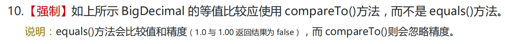
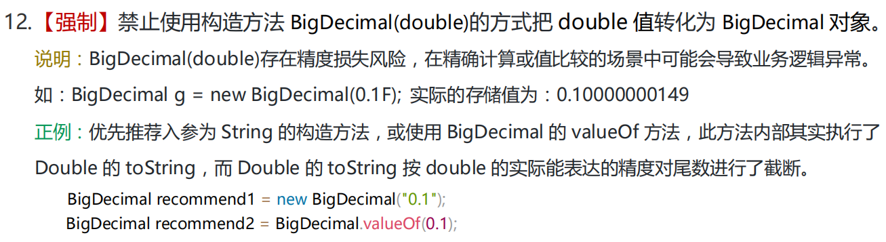

# 什么是BigDecimal？何时使用？

Java中`java.math`包中提供的API类BigDecimal，用来对超过16位有效位的数进行精确的运算。

双精度浮点型变量**double可以处理16位有效数**，但实际应用中，可能需要对更大或更小的数进行运算和处理。

一般情况下，对于哪些不需要准确计算精度的数字，可以直接使用Float和Double处理，但是**Double.valueOf()**

**和Float.valueOf()会丢失精度**。所以开发中，如果需要精确计算的结果，则必须使用BigDecimal类来操作。

BigDecimal所创建的是对象，因此不能使用传统的 + - * / 等算术运算符直接对其对象进行数学运算。

 

**何时使用 BigDecimal？**

 **1、需要高精度计算的场景**

金融计算：在涉及货币、税率、利息等计算时，精度要求非常高，任何微小的误差都可能导致严重的后果。例如：

```java
BigDecimal price = new BigDecimal("19.99");
BigDecimal taxRate = new BigDecimal("0.07");
BigDecimal tax = price.multiply(taxRate); // 精确计算税额
```

科学计算：在需要高精度的科学或工程计算中，BigDecimal 可以确保结果的准确性。

**2、避免浮点数精度问题**

浮点数（float 和 double）在存储和计算时可能会出现精度丢失的问题。例如：

```java
double a = 0.1;
double b = 0.2;
System.out.println(a + b); // 输出: 0.30000000000000004
```

**3、需要控制舍入行为**

在某些场景下，需要对结果进行精确的舍入操作（如四舍五入、向上取整、向下取整等）。BigDecimal 提供了灵活的舍入模式，可以通过 setScale() 方法实现。

```java
BigDecimal value = new BigDecimal("10.567");
BigDecimal rounded = value.setScale(2, RoundingMode.HALF_UP); // 四舍五入保留两位小数
System.out.println(rounded); // 输出: 10.57
```

**4、处理大范围数值**

BigDecimal 支持任意精度的数值表示，可以处理超出 long 或 double 范围的数值。例如：

```java
BigDecimal bigValue = new BigDecimal("123456789012345678901234567890");
System.out.println(bigValue); // 输出: 123456789012345678901234567890
```


**开发经验**

-   Java实体类中使用BigDecimal，对应SQL中应该使用DECIMAL

-   创建BigDecimal对象时，优先推荐入参为String类型的构造器 或 使用valueOf方法

-   BigDecimal的等值比较应该使用compareTo方法，而不是equals方法
-   BigDecimal对象进行除法操作时，注意指定精度
-   当不想输出科学计数法时，使用toPlainString方法

**阿里规约**




