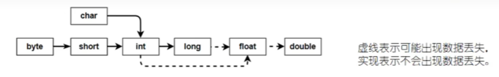

# 如何理解自动类型提升？

自动类型提升是指当我们在**计算时**，将`取值范围小的类型`自动提升为`取值范围大的类型`。自动类型提升规则如图所示：



（1）当把存储范围**小**的值（字面量、变量值、表达式计算的结果值）赋值给存储范围**大**的变量时

（2）当存储范围小的数据类型与存储范围大的数据类型一起**混合**运算时，会按照大的类型运算

（3）当**btye、short、char**数据类型进行**算术**或**位**运算时，按照**int**类型处理

>   问：自动类型提升就一定是安全的吗？
>
>   答：不是，也可能存在精度丢失

```java
int i = 'A'; // char自动升级为int
double j = 19; // int自动升级为double
System.out.println(i); // 65
System.out.println(i); // 19.0

int a = 1;
char b = 'A';
long c = 1L;
flaot d = 1.0F;
System.out.println(a + b + c + d); // 升级为float  68.0
```