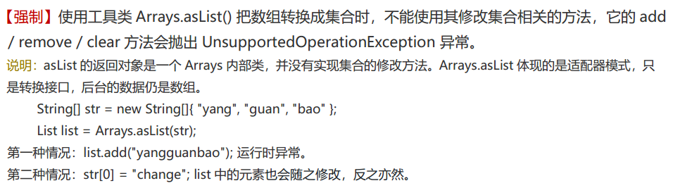

# Arrays.asList() 方法把数组转换成集合

**说明：**

​	使用Arrays.asList() 方法把数组转换成集合后，**该集合不能添加、删除元素**

**原因：**

​	Arrays.ArrayList类继承自**AbstractList**，实现了List接口。它**重写了add()、remove()**等修改List结构的方法，并将它们**直接抛出UnsupportedOperationException异常**，从而禁止了对List结构的修改。具体来说，Arrays.asList()方法返回的是Arrays类中的一个私有静态内部类ArrayList，它继承自AbstractList类，实现了List接口。

## **源码**

```java
public class Arrays {

    public static <T> List<T> asList(T... a) {
        return new ArrayList<>(a);
    }

    /**
     * @serial include 注意这是个内部类，并不是java.util包下的ArrayList
     */
    private static class ArrayList<E> extends AbstractList<E>
        implements RandomAccess, java.io.Serializable
    {

    }

}
```

## **阿里手册**



## **最佳实践**

-   如果使用了`Arrays.asList()`的话，最好不要使用其集合的操作方法

-   如果非要用，可以在外面包一层ArrayList

    -   ```java
        List<Integer> list = new ArrayList<>(Arrays.asList(1,2));
        ```
