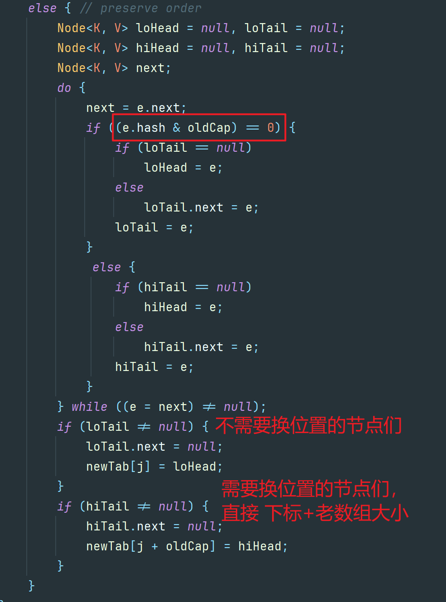

# JDK8对HashMap进行了哪些改动，除了红黑树？

## 口语化

主要包括以下几个方面：

-   hash函数的优化（扰动函数）
-   扩容rehash的优化
-   头插法改为尾插法
-   插入和扩容时机的变更

## 1、**hash函数的优化**

### JDK1.7的实现

```java
static int hash(int h) {
    // This function ensures that hashCodes that differ only by
    // constant multiples at each bit position have a bounded
    // number of collisions (approximately 8 at default load factor).
    h ^= (h >>> 20) ^ (h >>> 12);
    return h ^ (h >>> 7) ^ (h >>> 4);
}
```

### JDK1.8的实现

```java
static final int hash(Object key) {
    int h;
    return (key == null) ? 0 : (h = key.hashCode()) ^ (h >>> 16);
}
```

具体而言就是 1.7 的操作太多了，经历了四次异或，所以 1.8 优化了下，它将 key 的哈希码的高 16 位和低 16 位进行了异或，得到的 hash 值同时拥有了高位和低位的特性，使得哈希码的分布更均匀，不容易冲突。

这也是 JDK 开发者根据速度、实用性、哈希质量所做的权衡来做的实现：

```java
// 源码327、328行
There is a tradeoff between speed, utility, and quality of bit-spreading.
```

## 2、**扩容rehash的优化**

**扩容过程**

1、扩容的时候，默认会创建一个新数组，大小为老数组的2倍

2、`HashMap` 会**重新计算每个元素的哈希值**，并根据新的数组长度重新定位其索引位置

​	由于数组长度翻倍，哈希值的位运算结果可能会改变，导致元素在新数组中的位置与旧数组不同。（**JDK1.7及之前是这样子的**）

3、以我们正常人的思维来看，每一个元素都是重新hash一个个搬迁到新数组中的。

JDK1.8开始做了优化，**关键点就在于数据的长度是2的幂次方，且扩容时为原来的2倍。**

举例：

​	因为数组的长度是2的幂次方，所以假设数组长度为16（二进制为01000），那么新数组的长度就为32（二进制为10000），它们之间的差别就在于高位多了1。

补充：`HashMap` 中是以key的hash值来定位到key存放在数组中的索引位置的（`(数组长度-1) & hash`）

```java
16-1=15 二进制为001111
32-1=31 二进制为011111
```

所以重点就在key的hash值从右往左数第五位是否是1：

​	如果是1说明需要搬迁到新位置，且新位置的下标就是 原下标+16（原数组大小）

​	如果是0说明吃不到新数组长度的高位，那就还是在原来的位置，不需要迁移。

所以，我们刚好拿老数组的长度（010000）来判断高位是否是 1，这里只有两种情况，要么是 1 要么是 0 。



从上面的源码可以看到，链表的数据是一次性计算完，然后一堆搬运的，因为扩容时候，节点的下标变化只会是原位置，或者原位置+老数组长度，不会有第三种选择。

上面的位操作，包括为什么是原下标+老数组长度等，如果你不理解的话，可以举几个数带进去算一算，就能理解了。

**总结**

​	**JDK1.8 的扩容不需要每个节点重新计算 hash 值**，而是通过和老数组长度的 & 计算是否为 0，来判断新下标的位置。

:::tip 补充
**为什么 HashMap 的长度一定要是 2 的 n 次幂？**

​	原因就在于数组下标的计算，由于下标的计算公式用的是 `i = (n - 1) & hash`，即位运算，一般我们能想到的是 %（取余）计算，但相比于位运算而言，效率比较低，所以推荐用位运算，而要满足上面这个公式，n 的大小就必须是 2 的 n 次幂。

​	即：<strong>当 数组长度 等于 2 的 n 次幂时，a % b 操作等于 a & ( 数组长度 - 1 )</strong>
:::

## 3、**头插法改为尾插法**

1.7 是头插法，头插法的好处就是插入的时候不需要遍历链表，直接替换成头结点，但是缺点是扩容的时候会逆序，而逆序在多线程操作下可能会出现环，然后就死循环了。

然后 1.8 是尾插法，每次都从尾部插入的话，扩容后链表的顺序还是和之前一致，所以不可能出现多线程扩容成环的情况。

:::info
补充：**改成尾插法之后 HashMap 就不会死循环了吗**

好像还是会，这次是红黑树的问题 ，我在网上看到这篇文章，有兴趣的可以深入了解下：https://blog.csdn.net/qq_33330687/article/details/101479385
:::

## 4、**插入和扩容时机的变更**

1.7 是先判断 put 的键值对是新增还是替换，如果是替换则直接替换，如果是新增会判断当前元素数量是否大于等于阈值，如果超过阈值且命中数组索引的位置已经有元素了，那么就进行扩容。

```java
if ((size >= threshold) && (null != table[bucketIndex])) {
    resize(2 * table.length);
    hash = (null != key) ? hash(key) : 0;
    bucketIndex = indexFor(hash, table.length);
}
createEntry(...)
```

所以 **1.7 是先扩容，然后再插入**。

而 **1.8 则是先插入**，然后再判断 size 是否大于阈值，若大于则**扩容**。

就这么个差别，至于为什么，我也不知道
