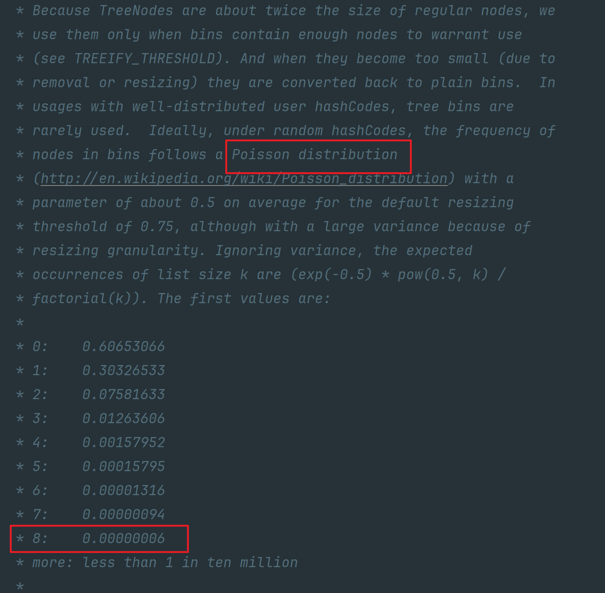

# 为什么JDK8对HashMap进行了红黑树改动？

主要是避免 hash 冲突导致链表的长度过长，这样 get方法的时间复杂度严格来说就不是 O(1) 了，因为可能需要遍历链表来查找命中的键值对。

**为什么定义链表长度为 8 且数组大小大于等于 64 才转红黑树？不要链表直接用红黑树不就得了吗？**

```java
// 源码中是这么解释的
Because TreeNodes are about twice the size of regular nodes
因为 TreeNodes 的大小大约是常规节点的两倍

// 即 因为红黑树节点的大小是普通节点大小的两倍，所以为了节省内存空间不会直接只用红黑树，只有当节点到达一定数量才会转成红黑树，这里定义的是 8。
```

**为什么是 8 呢？这个其实 HashMap 注释上也有说的，和泊松分布有关系**



简单翻译下就是在默认阈值是 0.75 的情况下，冲突节点长度为 8 的概率为 0.00000006，也就概率比较小（毕竟红黑树耗内存，且链表长度短点时遍历的还是很快的）。

这就是基于时间和空间的平衡了，红黑树占用内存大，所以节点少就不用红黑树，如果万一真的冲突很多，就用红黑树，选个参数为 8 的大小，就是为了平衡时间和空间的问题。

**为什么节点小于等于 6 要从红黑树转成链表？**

链表树化的节点是 8，除此之外，当树节点数小于等于 6 时候，又会从红黑树转为链表。

这个操作是为了平衡时间和空间，节点太少链表遍历也很快，没必要成红黑树，变成链表节约内存。

**为什么定了 6 而不是小于等于 8 就变？**

是因为要留个缓冲余地，避免反复横跳。举个例子，一个节点反复添加，从 8 变成 9 ，链表变红黑树，又删了，从 9 变成 8，又从红黑树变链表，再添加，又从链表变红黑树？

所以余一点，毕竟树化和反树化都是有开销的。
