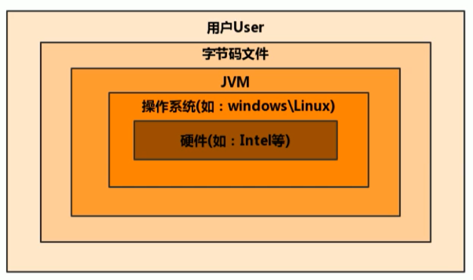
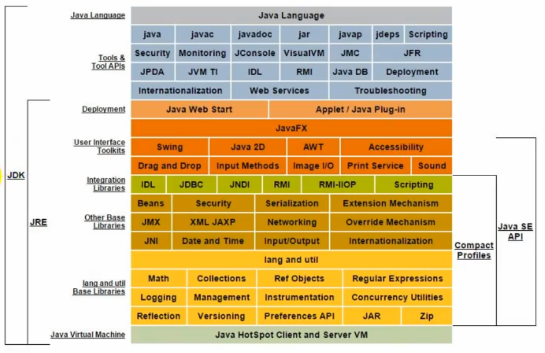

# 什么是虚拟机

## 虚拟机

所谓虚拟机（Virtual Machine），就是一台虚拟的计算机。它是一款软件，用来执行一系列虚拟计算机指令。大体上，虚拟机可以分为系统虚拟机和程序虚拟机。

- 大名鼎鼎的 Visual Box，VMware 就属于系统虚拟机，它们**完全是对物理计算机的仿真**，提供了一个可运行完整操作系统的软件平台。
- 程序虚拟机的典型代表就是 Java 虚拟机，它**专门为执行单个计算机程序而设计**，在 Java 虚拟机中执行的指令我们称为 Java 字节码指令。

无论是系统虚拟机还是程序虚拟机，在上面运行的软件都被限制于虚拟机提供的资源中。

## Java 虚拟机

Java 虚拟机是一台执行 Java 字节码的虚拟计算机，它拥有独立的运行机制，其运行的 Java 字节码也未必由 Java 语言编译而成。

JVM 平台的各种语言可以共享 Java 虚拟机带来的跨平台性、优秀的垃圾回器，以及可靠的即时编译器。

**Java 技术的核心就是 Java 虚拟机**（JVM，Java Virtual Machine），因为所有的 Java 程序都运行在 Java 虚拟机内部。

**作用**

- Java 虚拟机就是二进制字节码的运行环境，负责装载字节码到其内部，解释/编译为对应平台上的机器指令执行。每一条 Java 指令，Java 虚拟机规范中都有详细定义，如怎么取操作数，怎么处理操作数，处理结果放在哪里。

**特点**

- 一次编译，到处运行
- 自动内存管理
- 自动垃圾回收功能
- JVM 的位置

**JVM的位置**

> JVM 是运行在操作系统之上的，它与硬件没有直接的交互

