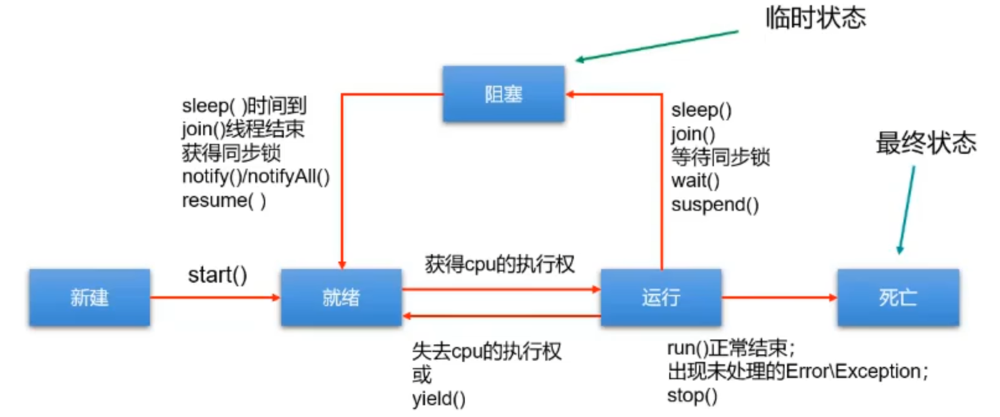

# JDK1.5之前线程的五种状态

线程的生命周期有五种状态：新建（New）、就绪（Runnable）、运行 （Running）、阻塞（Blocked）、死亡（Dead）。CPU 需要在多条线程之间切换，于是线程状态会多次在运行、阻塞、就绪之间切换。

-   **新建（New）**

当一个 Thread 类或其子类的对象被声明并创建时，新生的线程对象处于新建状态。

此时它和其他 Java 对象一样，仅仅由 JVM 为其分配了内存，并初始化了实例变量的值。

此时的线程对象并**没有任何线程的动态特征**，程序也不会执行它的线程体 run()。

-   **就绪（Runnable）**

但是当线程对象调用了 **start()**方法之后，就不一样了，线程就从新建状态转为**就绪状态**。JVM 会为其创建方法调用栈和程序计数器，当然，处于这个状态中的线程并没有开始运行，只是表示已**具备了运行的条件**，随时可以被调度。至于什么时候被调度，取决于 JVM 里线程调度器的调度。

>   注意：
>
>   ​	程序只能对新建状态（NEW）的线程调用 start()，并且只能调用一次，如果对非新建状态的线程，如已启动的线程或已死亡的线程调用 start()都会报错 `IllegalThreadStateException` 异常。

-   **运行 （Running）**

如果处于就绪状态的线程获得了**CPU资源**时，开始执行 run()方法的线程体代码，则该线程处于运行状态。如果计算机只有一个 CPU 核心，在任何时刻只有一个线程处于运行状态，如果计算机有多个核心，将会有多个线程并行 
(Parallel)执行。

当然，美好的时光总是短暂的，而且 CPU 讲究雨露均沾。对于**抢占式策略**的系统而言，系统会给每个可执行的线程一个小时间片来处理任务，当该时间用完，系统会剥夺该线程所占用的资源，让其回到就绪状态等待下一次被调度。

此时其他线程将获得执行机会，而在选择下一个线程时，系统会适当考虑线程的优先级。

-   **阻塞（Blocked）**

当在运行过程中的线程遇到如下情况时，会让出CPU并临时中止自己的执行，进入阻塞状态：

1.  线程调用了 **sleep()**方法，主动放弃所占用的 CPU 资源；
2.  线程试图获取一个同步监视器，但该同步监视器正被其他线程持有；
3.  线程执行过程中，同步监视器调用了 wait()，让它等待某个通知（notify）；
4.  线程执行过程中，同步监视器调用了 wait(time)
5.  线程执行过程中，遇到了其他线程对象的加塞（join）；
6.  线程被调用 suspend 方法被挂起（已过时，因为容易发生死锁）；

当前正在执行的线程被阻塞后，其他线程就有机会执行了。针对如上情况，当发生如下情况时会解除阻塞，让该线程重新进入就绪状态，等待线程调度器再次调度它：

1.  线程的 sleep()时间到；
2.  线程成功获得了同步监视器；
3.  线程等到了通知(notify)；
4.  线程 wait 的时间到了
5.  加塞的线程结束了；
6.  被挂起的线程又被调用了 resume 恢复方法（已过时，因为容易发生死锁）；

-   **死亡（Dead）**

线程会以以下三种方式之一结束，结束后的线程就处于死亡状态：

1.  run()方法执行完成，线程正常结束
2.  线程执行过程中抛出了一个未捕获的异常（Exception）或错误（Error）
3.  直接调用该线程的 stop()来结束该线程（已过时）