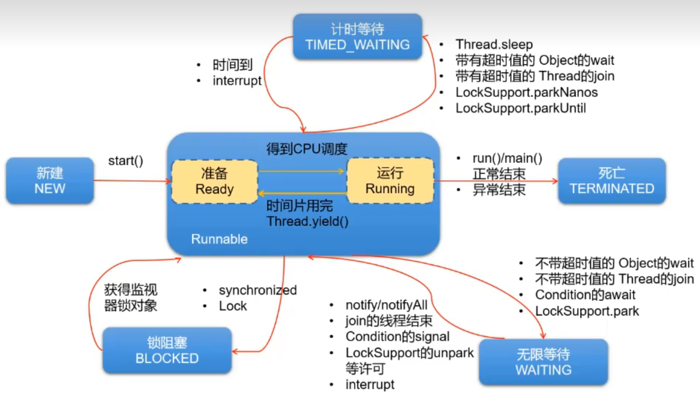

# JDK1.5之后线程的五种状态



在jdk1.5及之后线程有如下6种状态：

-   **NEW（新建）**

该线程还没开始执行

-   **Runnable（可运行）**

一旦调用**start()**方法，线程将处于**Runnable状态**，一个可运行的线程可能正在运行也可能还未运行，这取决于操作系统给线程提供运行的时间。

一旦一个线程开始运行，它不必始终保持运行。（因为操作系统的时间片轮转机制，目的是让其他线程获得运行的机会）线程调度的细节依赖于操作系统提供的服务。抢占式调度系统给每一个可运行的线程一个时间片来执行任务。时间片完，操作系统将剥夺线程的运行权

>   注意：
>
>   ​	**任何给定时刻，一个可运行的线程可能正在运行也可能没有运行**（这就是为什么将这个状态称为可运行而不是运行）

-   **Blocked（被阻塞）**

    当线程处于被阻塞或等待状态时，它暂不活动。他不允许任何代码且消耗最少的资源。

-   **Waiting（等待）**

-   **Timed waiting（计时等待）**

-   **Terminated（被终止）**线程被终止有如下两种原因：

    -   因为**run方法正常退出**而自然死亡
    -   因为一个没有捕获的**异常终止了run方法**而意外死亡

>   说明：
>
>   ​	当从 WAITING 或 TIMED_WAITING 恢复到 Runnable 状态时，如果发现当前线程没有得到监视器锁，那么会立刻转入 BLOCKED 状态

特点强调，可以调用线程的**stop()方法（已过时）**杀死这个线程，但是该方法会抛出ThreadDeath错误对象，由此杀死线程。部分源码如下：

```java
@Deprecated
public final void stop() {
	SecurityManager security = System.getSecurityManager();
	if (security != null) {
		checkAccess();
		if (this != Thread.currentThread()) {
			security.checkPermission(SecurityConstants.STOP_THREAD_PERMISSION);
		}
	}
	// A zero status value corresponds to "NEW", it can't change to
	// not-NEW because we hold the lock.
	if (threadStatus != 0) {
		resume(); // Wake up thread if it was suspended; no-op otherwise
	}

	// The VM can handle all thread states
	stop0(new ThreadDeath());
}

public class ThreadDeath extends Error {
    private static final long serialVersionUID = -4417128565033088268L;
}
```

可调用如下方法确定当前线程的状态

```java
public State getState()		// 得到线程的当前状态 	
    						// NEW,RUNNABLE,BLOCKED,WAITING,TIMED_WAITING,TERMINATED;
```

在`java.lang.Thread.State` 的枚举类中这样定义：

```java
public enum State {
    /**
         * Thread state for a thread which has not yet started.
         	线程状态为尚未启动的线程。
         */
    NEW,  // NEW（新建）：线程刚被创建，但是并未启动。还没调用 start 方法。

    /**
     线程状态,用于可运行的线程。可运行的线程状态在Java虚拟机中执行,但可能正在等待操作系统的其他资源
	 如处理器。
    */
    RUNNABLE,  // RUNNABLE（可运行）：这里没有区分就绪和运行状态。因为对于 Java 对象来说，只能标记为可运行，至于什么时候运行，不是 JVM 来控制的了，是 OS 来进行调度的，而且时间非常短暂，因此对于 Java 对象的状态来说，无法区分

    // 重点说明，根据 Thread.State 的定义，阻塞状态分为三种：BLOCKED、WAITING、TIMED_WAITING
    BLOCKED,  // BLOCKED（锁阻塞）：在 API 中的介绍为：一个正在阻塞、等待一个监视器锁（锁对象）的线程处于这一状态。只有获得锁对象的线程才能有执行机会。

    WAITING,  // WAITING（无限等待）：在 API 中介绍为：一个正在无限期等待另一个线程执行一个特别的（唤醒）动作的线程处于这一状态。
    // 当前线程执行过程中遇到遇到 Object 类的 wait，Thread 类的join，LockSupport 类的 park 方法，并且在调用这些方法时，没有指定时间，那么当前线程会进入 WAITING 状态，直到被唤醒。
    // 通过 Object 类的 wait 进入 WAITING 状态的要有 Object 的notify/notifyAll 唤醒；
    // 通过 Condition 的 await 进入 WAITING 状态的要有Condition 的 signal 方法唤醒；
    // 通过 LockSupport 类的 park 方法进入 WAITING 状态的要有LockSupport类的 unpark 方法唤醒
    // 通过 Thread 类的 join 进入 WAITING 状态，只有调用join方法的线程对象结束才能让当前线程恢复

    TIMED_WAITING,  // TIMED_WAITING（计时等待）：在 API 中的介绍为：一个正在限时等待另一个线程执行一个（唤醒）动作的线程处于这一状态。
    // 当前线程执行过程中遇到 Thread 类的 sleep 或 join，Object 类的 wait，LockSupport 类的 park 方法，并且在调用这些方法时，设置了时间，那么当前线程会进入 TIMED_WAITING，直到时间到，或被中断

    TERMINATED;  //  Teminated（被终止）：表明此线程已经结束生命周期，终止运行。
}
```


