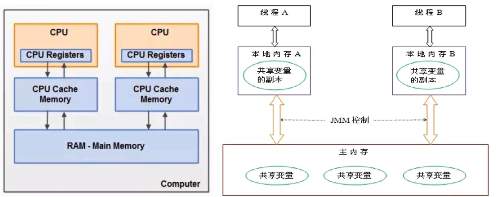
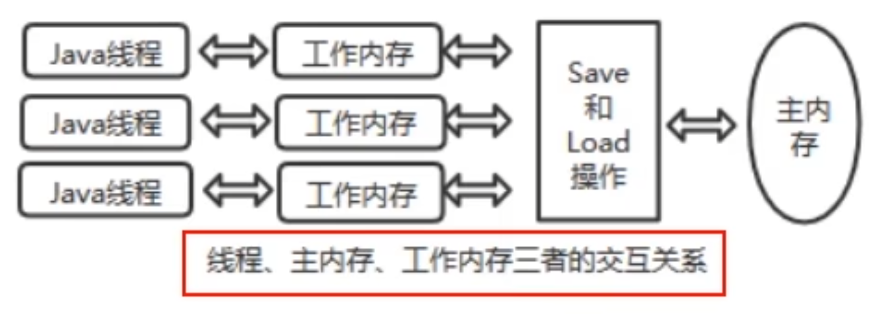

# JMM规范下，三大特性？ 

JMM的核心目标是确保多线程环境下的原子性、可见性和有序性，从而避免硬件和编译器优化带来的不一致问题

-   **可见性**：确保一个线程对变量的修改，能及时被其他线程看到。
    -   关键字`volatile`就是用来保证可见性的，它强制线程每次读写时都直接从主内存中获取最新值
-   **有序性**：指线程执行操作的顺序。JMM允许某些指令重排以提高性能，但会保证线程会的操作顺序不会被破坏，并通过`happens-before`关系保证跨线程的有序性。
-   **原子性**：是指操作不可分割，线程不会在执行过程中被中断。
    -   例如，`synchronized`关键字能确保方法或代码块的原子性
    -   JMM 保证了基本数据类型的读/写操作的原子性，但对于复合操作（如 i++）则不保证

**可见性**

是指**当一个线程修改了某一个共享变量的值，其他线程能够立刻知道该变更**

JMM规定了所有的变量都存储在**主内存**中

系统主内存**共享变量**数据修改被写入的时机是不确定的，**多线程并发下很可能出现“脏读”**，所有每个线程都有自己的**工作内存（本地内存）**。

线程自己的工作内存中保存了该线程使用到的变量的**主内存副本拷贝**，线程对变量的所有操作（读写、赋值等）都必须在自己的工作内存中进行，而不能够直接读写主内存中的变量。

不同线程之间也无法直接访问对方工作内存中的变量，线程间变量值的传递均需要通过主内存来完成。

>   线程脏读
>
>   
>
>   假设主内存中有变量x，初始值为0
>
>   线程A要将x + 1，先将 x = 0 拷贝到自己的工作内存中，然后进行更新x值
>
>   线程A将更新后的x值回刷到主内存的时间是不固定的
>
>   刚好在线程A没有回刷x到主内存时，线程B同时从主内存中读取x，此时x = 0，和线程A执行一样的操作
>
>   最后，期盼的结果 x = 2，就会变为 x = 1
>
>   因此Java引入了`volatile`关键字用来保证可见性的，它强制线程每次读写时都直接从主内存中获取最新值

**原子性**

指操作不可分割，线程不会在执行过程中被中断。即在多线程环境下，操作不能被其他线程干扰

**有序性**

对于一个线程的执行代码而言，我们总是习惯性的认为代码的执行总是从上到下，有序执行的。

但为了提升性能，编译器和处理器通常会对执行序列进行**重新排序**。

Java规范规定JVM线程内部维持**顺序语义化**，即只要程序的最终结果与它顺序化执行的结果相等，那么指令的执行顺序可以与代码顺序不一致，这个过程叫指令的重排序。

优缺点：

JVM能根据处理器特性（CPU多级缓存系统、多核处理器等）适当的对机器指令进行重排序，使机器指令能更符合CPU的执行特性，最大限度的发挥机器性能。

但是，指令重排**可以保证串行语义一致**，但没有义务保证多线程间的语义也一致（即可能产生“脏读”等）。

简单来说，两个以上不相干的代码在执行的时候，有可能先执行的不是第一条，**不见得是从上到下顺序执行，执行顺序会被优化。**

单线程环境里面，确保程序最终执行结果和代码顺序执行的结果一致。

处理器在进行重排序时**必须要考虑**指令之间的**数据依赖性**。

多线程环境中线程交替执行，由于编译器优化重排的存在，两个线程中使用的变量能否保持一致性是无法确定的，结果也是无法预测的。