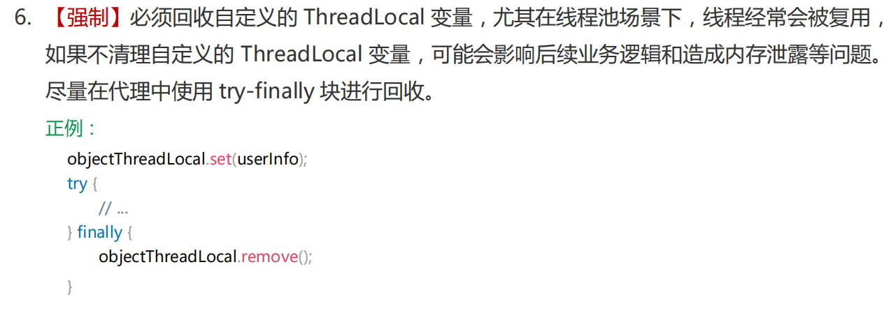

# **ThreadLocal的内存泄漏问题**？

ThreadLocal的内存泄漏问题主要源于ThreadLocalMap中使用的弱引用（WeakReference）机制和线程生命周期管理不当。

**内存泄漏的根本原因**：`ThreadLocalMap` 中的值是强引用，如果线程未结束且未调用 `remove()`，这些值将无法被垃圾回收。

**解决方法**：及时调用 `remove()` 方法清理 `ThreadLocal` 的值，特别是在线程池等场景下要特别注意

**ThreadLocal 的内部实现**

-   每个线程都有一个 `ThreadLocalMap`，用于存储该线程的 `ThreadLocal` 变量。
-   `ThreadLocalMap` 的键是 `ThreadLocal` 对象的弱引用（`WeakReference`），而值是线程本地变量的强引用。

**内存泄漏原因**

1）**弱引用的局限性**

-   ThreadLocalMap使用Entry类来存储键值对，其中键是ThreadLocal对象的弱引用（`WeakReference<ThreadLocal<?>>`），值是实际存储的数据。

-   当 `ThreadLocal` 对象被回收时，`ThreadLocalMap` 中的键会变成 `null`，但值仍然存在（因为值是强引用）。
-   如果线程没有结束，`ThreadLocalMap` 中的值无法被垃圾回收，从而导致内存泄漏。

2）**线程生命周期**：

在一些长生命周期的线程（如线程池中的线程）中，如果不显式地清除ThreadLocal变量，ThreadLocalMap中的值对象会一直存在，导致内存泄漏。

3）**线程池的特殊场景**

-   在使用线程池（如 `ExecutorService`）时，线程会被复用而不是销毁。
-   如果某个线程中创建了一个 `ThreadLocal`，但没有显式调用 `remove()` 方法清除其值，那么即使 `ThreadLocal` 对象本身被回收，`ThreadLocalMap` 中的值仍然会占用内存，直到线程结束或手动清理。

**阿里规约**

