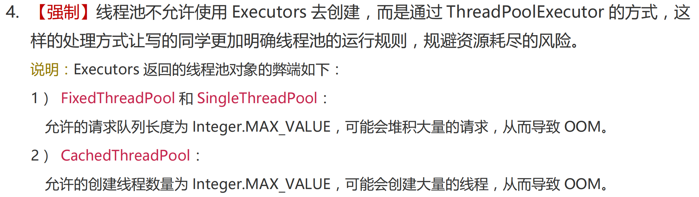

# 为什么不建议使用Executors来创建线程池？（阿里规约）

`Executors`：一个**线程池的工厂类**，通过此类的**静态工厂方法**可以创建多种类型的线程池对象。 

Executors提供了4个常用方法来创建内置的线程池

## 1、**newFixedThreadPool**

Executors.newFixedThreadPool(int nThreads)：创建一个可重用**固定线程数**的线程池 

```java
public static ExecutorService newFixedThreadPool(int nThreads) {
    return new ThreadPoolExecutor(nThreads, nThreads,
                                  0L, TimeUnit.MILLISECONDS,
                                  new LinkedBlockingQueue<Runnable>());
}
```

发现创建的队列为LinkedBlockingQueue，是一个无界阻塞队列，如果使用改线程池执行任务，如果任务过多就会不断的添加到队列中，任务越多占用的内存就越多，最终可能耗尽内存，导致OOM

## 2、**SingleThreadExecutor**

Executors.newSingleThreadExecutor() ：创建一个只有**一个线程**的线程池 

```java
public static ExecutorService newSingleThreadExecutor() {
    return new FinalizableDelegatedExecutorService
        (new ThreadPoolExecutor(1, 1,
                                0L, TimeUnit.MILLISECONDS,
                                new LinkedBlockingQueue<Runnable>()));
}
```

发现创建的队列为LinkedBlockingQueue，是一个无界阻塞队列，如果使用改线程池执行任务，如果任务过多就会不断的添加到队列中，任务越多占用的内存就越多，最终可能耗尽内存，导致OOM

## 3、**CachedThreadPool**

Executors.newCachedThreadPool()：创建一个可根据需要创建新线程的线程池

```java
public static ExecutorService newCachedThreadPool() {
    return new ThreadPoolExecutor(0, Integer.MAX_VALUE,
                                  60L, TimeUnit.SECONDS,
                                  new SynchronousQueue<Runnable>());
}
```

它的特点是线程数不受限制，可以根据需要创建新线程。虽然这对于短时间的任务非常有用，但如果任务执行时间较长或任务量较大，可能会导致大量线程堆积，从而消耗过多系统资源，最终导致OOM

## 4、**ScheduledThreadPool**

Executors.newScheduledThreadPool(int corePoolSize)：创建一个线程池，它可安排在给定延迟后运行命令或者定期地执行。 

```java
public ScheduledThreadPoolExecutor(int corePoolSize) {
    super(corePoolSize, Integer.MAX_VALUE, 0, NANOSECONDS,
          new DelayedWorkQueue());
}
```

## **阿里规约**


