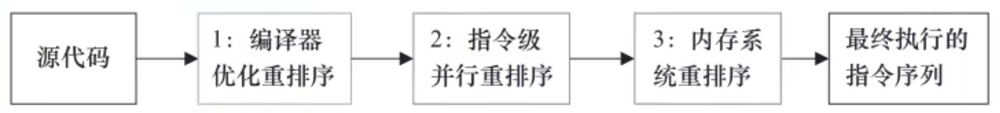

# 什么是Java中的指令重排？

重排序是指编译器和处理器为了优化程序性能而对指令序列进行重新排序的一种技术，旨在提高程序执行效率。它允许编译器和处理器在不改变程序最终结果的前提下，重新排列指令的执行顺序。指令重排可以利用处理器的并行执行能力和优化内存访问，以提高程序的性能。

**重排序的几个考虑因素**

-   存在**数据依赖**关系，禁止重排序
-   重排序后指令绝不不能改变原有**串行语义**！！！


**为什么需要指令重排？**

-   **提高指令级并行性**：现代处理器具有多条流水线，可以同时执行多条指令。通过重排指令，可以更好地利用这些流水线，提高指令级并行性。

-   **减少等待时间**：某些指令可能会因为数据依赖或内存访问延迟而等待。通过重排指令，可以将这些等待时间隐藏在其他指令的执行过程中，从而提高整体执行效率。


**指令重排的类型**



-   **编译器重排**：编译器在生成目标代码时，在不改变单线程串行语义的前提下，可以重新调整指令的执行顺序。这种重排通常基于**数据流**分析和**依赖关系**分析。
-   **处理器重排**：现代处理器使用指令级并行技术将多条指令重叠执行，若不存在数据依赖，处理器可以改变语句对应机制指令的执行顺序，以提高执行效率。这种重排利用了处理器的乱序执行（Out-of-Order Execution）能力。
-   **内存系统重排**：由于处理器使用缓存和读/写缓冲区，这使得加载和存储操作看上去可能是乱序执行的。


**指令重排 Demo**

假设有以下两条指令：

```java
int a = 1; // 指令1
int b = 2; // 指令2
```

在没有数据依赖的情况下，编译器或处理器可以将这两条指令的顺序互换，而不会影响程序的最终结果：

```java
int b = 2; // 指令2
int a = 1; // 指令1
```

指令重排：

在单线程环境里面，可以确保程序最终执行结果和代码顺序执行的结果一致。因为处理器在进行重排序时**必须要考虑**指令之间的**数据依赖性**。

而上面的代码很明显不存在依赖。


**指令重排对多线程编程的影响**

在多线程环境中，指令重排可能会导致意想不到的结果，尤其是在没有适当的同步机制时。考虑以下示例：

```java
// 线程1
x = 1; // 指令1
y = 2; // 指令2

// 线程2
if (y == 2) {
    // 期望x == 1
}
```

在单线程环境中，我们可以合理地认为，如果y的值是2，那么x的值应该是1。然而，由于指令重排，可能会出现以下情况：

```java
// 线程1
y = 2; // 指令2
x = 1; // 指令1

// 线程2
if (y == 2) {
    // 可能x != 1
}
```

在这种情况下，线程2可能会在y被设置为2之后，但在x被设置为1之前执行，从而导致不一致的状态。


**如何防止指令重排**

为了防止指令重排导致的多线程问题，可以使用以下方法：

-   **volatile关键字**：在Java中，使用volatile关键字可以禁止特定类型的指令重排。声明为volatile的变量在被写入时会立即被刷新到主内存，在被读取时会从主内存中读取，确保变量的可见性和有序性。

-   **同步机制**：使用同步块（synchronized）或显式锁（如ReentrantLock）可以确保在同步块内的指令按预期顺序执行，防止指令重排。

-   **内存屏障**：在底层，内存屏障（Memory Barrier）或内存栅栏（Memory Fence）是一种指令，用于防止特定类型的指令重排。如Java的 Unsafe 类提供了对内存屏障的支持

