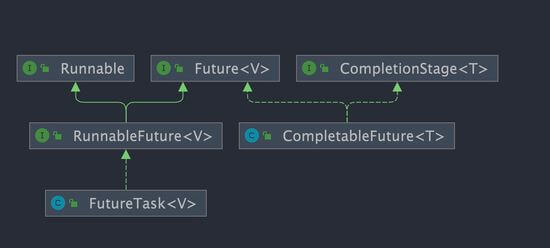

# 什么是Java的CompletableFuture？

`CompletableFuture` 是 Java 8 引入的一个类，位于 `java.util.concurrent` 包中。它是对 `Future` 接口的增强版本，提供了更强大的**异步编程**能力，并支持函数式编程风格。

通过 `CompletableFuture`，可以更方便地处理异步任务的结果、组合多个异步任务以及管理任务之间的依赖关系。



`CompletableFuture` 同时实现了 `Future` 和 `CompletionStage` 接口

`CompletionStage` 接口描述了一个异步计算的阶段。很多计算可以分成多个阶段或步骤，此时可以通过它将所有步骤组合起来，形成异步计算的流水线。

`CompletionStage` 接口中的方法比较多，`CompletableFuture` 的函数式能力就是这个接口赋予的


## 基本概念

CompletableFuture能提供的基本能力

- **异步执行**：`CompletableFuture` 支持异步任务的创建和执行。
- **链式调用**：可以通过链式调用的方式处理任务结果，避免了回调地狱（Callback Hell）。
- **组合任务**：可以将多个异步任务组合在一起，形成复杂的任务流。


## 创建异步任务

:::warning
不建议通过 new 创建CompletableFuture
:::

CompletableFuture的四大静态方法：（用于创建 异步任务）

- 无返回值
    - `CompletableFuture<Void> runAsync(Runnable runnable)`
    - `CompletableFuture<Void> runAsync(Runnable runnable, Executor executor)`

- 有返回值
    - `CompletableFuture<U> supplyAsync(Supplier<U> supplier)`
    - `CompletableFuture<U> supplyAsync(Supplier<U> supplier, Executor executor)`

:::tip
executor参数说明：
- 若没有指明，则使用ForkJoinPool.commonPool()作为线程池执行异步代码
- 建议给出，达到线程池隔离的目的
- 如果使用默认线程池commonPool，当main线程结束时，线程池会 立刻 关闭，导致异步任务无法执行
- 因此
  - 1.需要保证main线程在 所有异步任务之后 结束
  - 2.或者使用自定义线程池
:::

```java
CompletableFuture<Void> future1 = CompletableFuture.runAsync(() -> {
    System.out.println("Running async task without result");
});

CompletableFuture<String> future2 = CompletableFuture.supplyAsync(() -> {
    return "Hello, CompletableFuture!";
});
```


## 处理任务结果

- thenApply(Function<? super T, ? extends U> fn)：对任务结果进行转换。
    - 对计算结果进行处理（计算结果存在依赖关系，这两个线程串行化）
    - 异常相关：由于存在依赖关系（当前出错，就不会进行下一步操作了），当前步骤有异常的话就会立即叫停
- thenAccept(Consumer<? super T> action)：对任务结果进行消费，但不产生新的结果
    - 对计算结果进行消费（接收任务的处理结果，并消费处理，无返回结果）
- thenRun(Runnable action)：在任务完成后执行一个无参数的操作，即不需要使用上一个任务的结果

> `then*`：在上一个异步任务执行完，然后执行本任务，复用上一个任务的线程，无需创建新的线程
>
> `then*Async`：默认会利用ForkJoinPool.commonPool来执行任务

| 方法       | 示例                                                |
| ---------- | --------------------------------------------------- |
| thenRun    | 任务A执行完毕执行B，并且B不需要A的结果              |
| thenAccept | 任务A执行完毕执行B，B需要A的结果，但是任务B无返回值 |
| thenApply  | 任务A执行完毕执行B，B需要A的结果，同时任务B有返回值 |

示例：

```java
System.out.println(CompletableFuture.supplyAsync(() -> "result-A")
                   .thenRun(() -> {
					}).join()
); // join 获取的结果为null

System.out.println(CompletableFuture.supplyAsync(() -> "result-A").thenAccept((r) -> {
    System.out.println(r); // result-A
}).join()); // join 获取的结果为null，因为thenAccept无返回值

System.out.println(CompletableFuture.supplyAsync(() -> "result-A").thenApply((r) -> {
    return r + "-result-B";
}).join());  // join 获取的结果为result-A-result-B
```

## 异常处理

- exceptionally：处理任务中的异常。
- handle：无论是否发生异常，都会执行。

```java
CompletableFuture<String> future = CompletableFuture.supplyAsync(() -> {
    throw new RuntimeException("Error occurred!");
}).exceptionally(ex -> {
    return "Recovered from exception: " + ex.getMessage();
});

future.thenAccept(System.out::println); // 输出恢复后的结果
```

## 组合多个任务

- thenCombine：合并两个任务的结果。（两个任务执行完毕后才会触发的回调）
- thenAcceptBoth：对两个任务的结果进行消费。
- applyToEither：选择第一个完成的任务的结果（对计算速度进行选用）
- thenCompose：按顺序执行两个并行任务（将任务A的结果作为任务B的输入，串行执行两个任务）

```java
CompletableFuture<String> future1 = CompletableFuture.supplyAsync(() -> "Hello");
CompletableFuture<String> future2 = CompletableFuture.supplyAsync(() -> "World");

CompletableFuture<String> combinedFuture = future1.thenCombine(future2, (result1, result2) -> result1 + " " + result2);

combinedFuture.thenAccept(System.out::println); // 输出 "Hello World"
```

## 等待所有任务完成

- allOf：等待所有任务完成。
- anyOf：等待任意一个任务完成。

```java
CompletableFuture<Void> allFutures = CompletableFuture.allOf(
    CompletableFuture.runAsync(() -> System.out.println("Task 1")),
    CompletableFuture.runAsync(() -> System.out.println("Task 2")),
    CompletableFuture.runAsync(() -> System.out.println("Task 3"))
);

allFutures.join(); // 等待所有任务完成
```

## 阻塞操作

- get()：阻塞等待结果
- get(long timeout, TimeUnit unit)   超时等待结果
- join()：阻塞等待结果
- getNow(T valueIfAbsent)            立即获取结果（不阻塞），如果任务未完成（未获取到结果），则返回valueIfAbsent

```java
String result = CompletableFuture.supplyAsync(() -> "Result").join();
System.out.println(result); // 输出 "Result"
```


## 与Future的区别

`Future`是JDK5引入的接口，提供了基本的异步处理功能，它的一个重要实现类是`FutureTask`，主要用于异步执行任务并获取任务的结果。但它的局限性在于只能通过get()方法阻塞的获取结果，无法链式调用，也缺少异常处理机制。

`Future`的优缺点

- 优点：future+线程池 异步多线程任务配合，显著提高程序的执行效率
- 缺点：
    - get()阻塞
    - isDone()轮询，耗费无谓的CPU资源

CompletableFuture是`Future`的增强版，提供了非阻塞的结果处理、任务组合和异常处理，使得异步编程变得更加灵活强大


## 扩展

### 一个任务需要依赖另外两个任务执行完之后再执行，怎么设计？

这种任务编排场景非常适合通过`CompletableFuture`实现。这里假设要实现 T3 在 T2 和 T1 执行完后执行。

示例：

CompletableFuture.allOf

```java
// 定义两个异步任务
CompletableFuture<String> task1 = CompletableFuture.supplyAsync(() -> {
    System.out.println("Task 1 is running...");
    return "Result from Task 1";
});

CompletableFuture<String> task2 = CompletableFuture.supplyAsync(() -> {
    System.out.println("Task 2 is running...");
    return "Result from Task 2";
});

// 等待 task1 和 task2 都完成后执行后续任务
CompletableFuture<Void> allTasks = CompletableFuture.allOf(task1, task2);

// 后续任务
allTasks.thenRun(() -> {
    System.out.println("Both Task 1 and Task 2 are completed.");
    try {
        // 获取 task1 和 task2 的结果
        String result1 = task1.get();
        String result2 = task2.get();
        System.out.println("Task 1 Result: " + result1);
        System.out.println("Task 2 Result: " + result2);
    } catch (Exception e) {
        e.printStackTrace();
    }
});
```

`thenCombine` ：合并两个任务的结果

```java
// 定义两个异步任务
CompletableFuture<String> task1 = CompletableFuture.supplyAsync(() -> {
    System.out.println("Task 1 is running...");
    return "Hello";
});

CompletableFuture<String> task2 = CompletableFuture.supplyAsync(() -> {
    System.out.println("Task 2 is running...");
    return "World";
});

// 后续任务依赖 task1 和 task2 的结果
CompletableFuture<String> combinedTask = task1.thenCombine(task2, (result1, result2) -> {
    return result1 + " " + result2;
});

// 输出最终结果
combinedTask.thenAccept(result -> {
    System.out.println("Combined Result: " + result); // 输出 "Hello World"
});
```

### 在使用 CompletableFuture 的时候为什么要自定义线程池？

`CompletableFuture` 默认使用全局共享的 `ForkJoinPool.commonPool()` 作为执行器，所有未指定执行器的异步任务都会使用该线程池。这意味着应用程序、多个库或框架（如 Spring、第三方库）若都依赖 `CompletableFuture`，默认情况下它们都会共享同一个线程池。

虽然 `ForkJoinPool` 效率很高，但当同时提交大量任务时，可能会导致资源竞争和线程饥饿，进而影响系统性能。

为避免这些问题，建议为 `CompletableFuture` 提供自定义线程池，带来以下优势：

- 隔离性：为不同任务分配独立的线程池，避免全局线程池资源争夺。
- 资源控制：根据任务特性调整线程池大小和队列类型，优化性能表现。
- 异常处理：通过自定义 `ThreadFactory` 更好地处理线程中的异常情况

