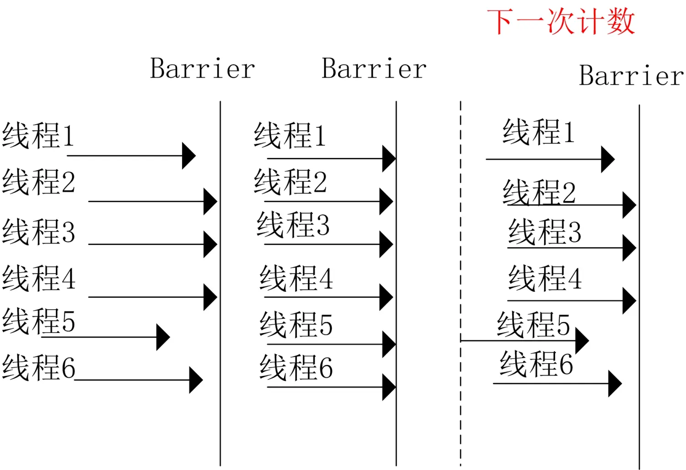

# 什么是Java的CyclicBarrier？

`CyclicBarrier`是 Java 提供的另一种同步辅助工具类，位于`java.util.concurrent` ，用于协调多个线程在某个特定点上同步。与CountDownLatch不同，CyclicBarrier可以被重复使用。

## 基本概念

`CyclicBarrier`允许一组线程相互等待，直到所有线程都到达某个公共的屏障点（barrier）。当所有线程都到达屏障点时，屏障就会被打开，所有线程继续执行。

它的设计目的是解决多线程并发任务中需要同步的场景，确保所有参与的线程都在特定的点上完成执行，然后一起继续后续的任务。

- **屏障（Barrier）**：一个线程在调用 `await()` 方法时会被阻塞，直到所有参与的线程都到达屏障点。屏障点可以是一个特定的任务步骤。
- **线程数量**：CyclicBarrier 需要的线程数量是预设的，当所有线程都到达屏障时，屏障被释放，所有线程可以继续执行。
- **重用性**：CyclicBarrier 可以被重用，允许在多个阶段中同步线程。例如，在每个阶段的同步点上都可以使用 CyclicBarrier。



## 常用方法

构造器

```java
public CyclicBarrier(int parties) 
public CyclicBarrier(int parties, Runnable barrierAction) // 初始化一个 CyclicBarrier 对象，并指定一个 Runnable 回调，在所有线程到达屏障后执行
```

- `parties`：需要等待的线程数量。
- `barrierAction``：一个可选的Runnable，在所有线程到达屏障点后执行

常用方法

- `int await() throws InterruptedException, BrokenBarrierException`：使当前线程等待，直到所有线程都到达屏障点。
- `int await(long timeout, TimeUnit unit) throws InterruptedException, BrokenBarrierException, TimeoutException`：使当前线程等待，直到所有线程都到达屏障点，或者等待时间超过指定的时间。
- `boolean isBroken()`：检查屏障是否已经被破坏。
- `void reset()`：重置屏障到初始状态

## 演示

### 多个线程起点同步

```java
public class CyclicBarrierDemo {
    //指定必须有6个运动员到达才行
    private static CyclicBarrier barrier = new CyclicBarrier(6, () -> {
        System.out.println("所有运动员入场，裁判员一声令下！！！！！");
    });
    public static void main(String[] args) {
        System.out.println("运动员准备进场，全场欢呼............");

        ExecutorService service = Executors.newFixedThreadPool(6);
        for (int i = 0; i < 6; i++) {
            service.execute(() -> {
                try {
                    System.out.println(Thread.currentThread().getName() + " 运动员，进场");
                    barrier.await();
                    System.out.println(Thread.currentThread().getName() + "  运动员出发");
                } catch (InterruptedException e) {
                    e.printStackTrace();
                } catch (BrokenBarrierException e) {
                    e.printStackTrace();
                }
            });
        }
    }

}
```

说明：当6个运动员（线程）都到达了指定的临界点（barrier）时候，才能继续往下执行，否则，则会阻塞等待在调用`await()`处

[示例来源](https://github.com/NHKNHKNHK/Java-concurrency/blob/master/25.%E5%A4%A7%E7%99%BD%E8%AF%9D%E8%AF%B4java%E5%B9%B6%E5%8F%91%E5%B7%A5%E5%85%B7%E7%B1%BB-CountDownLatch%EF%BC%8CCyclicBarrier/%E5%A4%A7%E7%99%BD%E8%AF%9D%E8%AF%B4java%E5%B9%B6%E5%8F%91%E5%B7%A5%E5%85%B7%E7%B1%BB-CountDownLatch%EF%BC%8CCyclicBarrier.md)

### 控制t1、t2、t3顺序执行

```java
public class Main {
    public static void main(String[] args) throws BrokenBarrierException, InterruptedException {
        CyclicBarrier barrier1 = new CyclicBarrier(2);

        Thread t1 = new Thread(() -> {
            System.out.println("Thread 1 is running");
            try {
                barrier1.await();
            } catch (InterruptedException | BrokenBarrierException e) {
                throw new RuntimeException(e);
            }
        });
        Thread t2 = new Thread(() -> {
            System.out.println("Thread 2 is running");
            try {
                barrier1.await();
            } catch (InterruptedException | BrokenBarrierException e) {
                throw new RuntimeException(e);
            }
        });
        Thread t3 = new Thread(() -> {
            System.out.println("Thread 3 is running");
            try {
                barrier1.await();
            } catch (InterruptedException | BrokenBarrierException e) {
                throw new RuntimeException(e);
            }
        });

        t1.start();
        // 等待t1线程执行完毕
        barrier1.await();

        t2.start();
        // 等待t2线程执行完毕
        barrier1.await();

        t3.start();
        // 等待t3线程执行完毕
        barrier1.await();
    }
}
```

> 查看更多控制线程执行顺序的方法：[怎么让3个线程按顺序执行？](./怎么让3个线程按顺序执行？.md)
