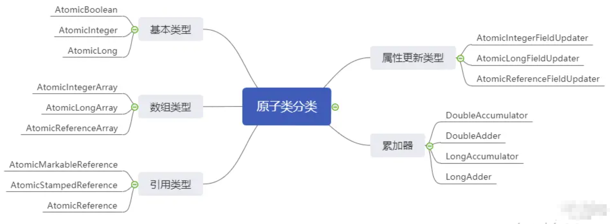
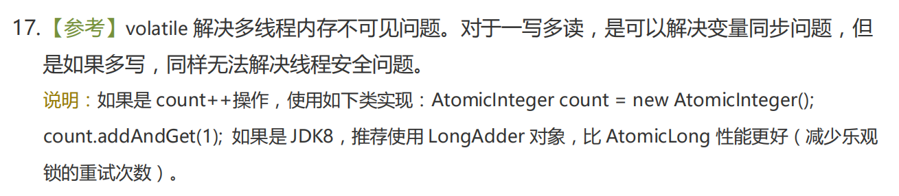

# 说说Java中的原子类？

Java中的原子类是通过硬件提供的原子操作指令（如CAS）来确保操作的原子性，从而避免线程竞争问题。

常用的原子类有如下几种：

1）**AtomicInteger**：用于操作整数的原子类，提供了原子性的自增、自减、加法等操作

2）**AtomicLong**：类似于`AtomicInteger`，但用于操作`long`型数据

3）**AtomicBoolean**：用于操作布尔值的原子类，提供了原子性的布尔值比较和设置操作

4）**AtomicReference**：用于操作对象引用的原子类，支持对引用对象的原子更新。例如：包括user对象，实现原子更新

5）**AtomicStampedReference**：在`AtomicReference`的基础上，增加了时间戳或版本号（邮戳）的比较，避免了ABA问题

6）**AtomicIntegerArray**、**AtomicLongArray**：分别是`AtomicInteger`和`AtomicLong`的数组版本，提供了对数组中各个元素的原子操作。




**基本类型**

可以简单的理解为通过基本类型原子类：AtomicInteger、AtomicBoolean、AtomicLong，就可以实现线程安全地、原子地更新这几个基本类型

```java
// AtomicInteger常用方法
public final int get() // 获取当前的值
public final int getAndSet(int newValue) // 获取当前的值，并设置新值
public final int getAndIncrement() // 获取当前的值，并自增
public final int getAndDecrement() // 获取当前的值，并自减
public final int getAndAdd(int delta) // 获取当前的值，并加上预期值
public final boolean compareAndSet(int expect, int update) // 如果当前值等于预期值，则更新当前值为输入值（update）
```

**数组类型**

数组类型原子类：AtomicIntegerArray、AtomicLongArray、AtomicReferenceArray，可以简单的理解为可以原子性地更新数组内的每个元素。

**引用类型**

引用类型原子类：AtomicReference、AtomicStampedReference、AtomicMarkableReference，就是对象引用的原子性更新。

区别在于：

-   AtomicStampedReference、AtomicMarkableReference 可以避免CAS的ABA问题
-   AtomicStampedReference是通过版本号（邮戳）stamp来避免的，侧重于解决修改过几次
-   AtomicMarkableReference 是通过一个布尔值mark来避免的，侧重于解决是否修改过

**属性更新类型**

对象的属性修改原子类：AtomicIntegerFieldUpdater、AtomicLongFieldUpdater、AtomicReferenceFieldUpda

-   AtomicIntegerFieldUpdater 原子更新对象中int类型字段的值
-   AtomicLongFieldUpdater 原子更新对象中long类型字段的值
-   AtomicReferenceFieldUpdater 原子更新引用类型字段的值

它们的目的都是：**以一种线程安全的方式操作非线程安全对象内的某些字段**

使用它们的前提：

-   更新对象中字段需要使用public volatile修饰
-   需要使用静态方法newUpdater()创建一个更新容器，并且需要设置想要更新的类和字段

**累加器**

以上4种类型都是用于更新数据，而累加器顾名思义是用来累加数据的。

累加器（JDK8）：DoubleAccumulator、DoubleAdder、LongAccumulator、LongAdder

首先，AtomicLong也能实现累加，但LongAdder更加的专业，并发度更高，它通过分个cells来减少线程的竞争，提高了并发度。阿里巴巴也推荐使用LongAdder来实现累加逻辑。

**阿里规约**



```java
// LongAdder常用方法
public void add(long x) // 将当前值加上x
public void increment() // 将当前值加1
public void decrement() // 将当前值减1
public long sum() // 返回当前值。注意;在没有并发更新的情况下，sum会返回一个精确值。在存在并发情况下，sum不保证返回精确值
public void reset() // 将当前值重置为0。可用于替代重新new一个LongAddr，但此方法只可用于没有并发情况下
public long sumThenReset() // 返回当前值，并将当前值重置为0
```

>   可以理解为如果用AtomicLong实现累加是一个本子，然后20个人要在本子上累加技术。
>
>   而LongAddr分了10个本子，20个人可以那这10个本子计数，然后最后的结果再由10个本子上的数相加即可。
>
>   还可以理解为Spark中的累加器。（如果你没学过Spark，那就别看了）
>
>   累加器支持在所有不同节点之间进行累加计算(比如计数或者求和)。此时的节点可以类比为我们的本子，本子多了，并发度自然就高了

**LongAccumulator与LongAdder的区别**

LongAccumulator提供的功能比LongAdder丰富，LongAdder只能创建一个初始值为0的累加器（且只能用于加减），而LongAccumulator可以自定义函数的逻辑。
