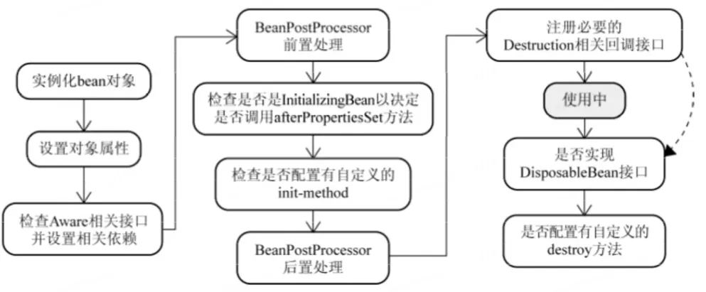

# Bean的作用范围（域）和生命周期？:star:

## 口语化

**Bean 的作用范围**

所谓作用域，其实就是说这个东西哪个范围内可以被使用。如我们定义类的成员变量的时候使用的public、private等这些也是作用域的概念。

Spring的Bean的作用域，描述的就是这个Bean在哪个范围内可以被使用。不同的作用域决定了了 Bean 的创建、管理和销毁的方式。

Bean 的作用范围（域）主要有以下几种：

- **singleton**：默认的作用域，整个应用中只有一个实例。
- **prototype**：每次请求都会创建一个新的实例。
- request：每个 HTTP 请求创建一个新的实例（仅限 Web 应用）。
- session：每个 HTTP 会话创建一个新的实例（仅限 Web 应用）。
- application：每个 ServletContext 创建一个新的实例（仅限 Web 应用）。
- globalSession：用于 Portlet 应用中的全局会话（较少使用）。

一般来说，常用的是 **singleton** 和 **prototype**。singleton 是单例的，当 Bean 是无状态的时候，singleton 是最好的选择。如果 Bean 涉及共享数据或有状态信息，singleton 可能不够安全，这时应该使用 prototype 来确保每个请求都有独立的实例。

我们在代码中，可以在定义一个Bean的时候，通过`@Scope`注解来指定他的作用域：

```java
@Service
@Scope("prototype")
public class HollisTestService{
    
}
```

**Bean 的生命周期**

Bean 的生命周期是指bean从创建到销毁的过程，总体上分为4大步，**实例化、属性赋值、初始化、销毁**：

- 1、**实例化**：Spring 容器根据配置创建 Bean 实例。
  - 通过反射去推断构造器进行实例化
  - 实例工厂、静态工厂
- 2、**属性设置**：为 Bean 设置属性值，包括依赖注入。
  - 解析自动装配（DI的体现）
  - 循环依赖（Spring底层已经处理了）
- 3、**初始化**：调用初始化方法（如果有），例如通过 **init-method** 属性指定的方法，或者实现 **InitializingBean** 接口的 **afterPropertiesSet** 方法。
  - 调用xxxAware相关接口回调
  - 调用初始化生命周期回调（三种）
  - 如果bean实现了AOP，还会创建动态代理
- 4、**可用**：Bean 已经完全初始化，可以被应用程序使用。
- 5、**销毁**：当容器关闭时，调用销毁方法（如果有），例如通过 **destroy-method** 属性指定的方法，或者实现 **DisposableBean** 接口的 **destroy** 方法。
  - 调用初始化生命周期回调

## Bean的作用范围（Scope）

### singleton

- 在整个应用程序上下文中，只有一个Bean实例，所有对该Bean的引用都指向同一个实例
- 这个实例在容器启动时创建，并且在整个上下文生命周期中一直存在。
- 默认情况下，所有的Spring Beans都是单例的（**默认作用范围**）
- 适用于**无状态**的Bean。

```xml
<bean id="myBean" class="com.example.MyBean" scope="singleton"/>
```

### prototype

- 每次请求该Bean时都会创建一个新的实例。这种模式适合那些需要为每个客户端请求创建新对象的情况。
- 适用于有状态的Bean。

```xml
<bean id="myBean" class="com.example.MyBean" scope="prototype"/>
```

### Request

- 在Web环境中，为每一个HTTP**请求**创建一个新的Bean实例。
  - 仅适用于Web应用
- 这个Bean的生命周期与一个HTTP请求的生命周期相同。

```xml
<bean id="myBean" class="com.example.MyBean" scope="request"/>
```

### Session

- 在Web环境中，为每一个用户**会话**创建一个新的Bean实例。
  - 仅适用于Web应用
- 这个Bean的生命周期与用户的会话生命周期相同。

```xml
<bean id="myBean" class="com.example.MyBean" scope="session"/>
```

### globalSession

- 类似于Session作用域，每个全局HTTP会话都会创建一个新的实例
  - 但是用于portlet环境。
- 在portlet环境中，全局会话可以在portlet之间共享。

```xml
<bean id="myBean" class="com.example.MyBean" scope="globalSession"/>
```

### application

- 每个ServletContext会创建一个新的实例，适用于Web应用

```xml
<bean id="myBean" class="com.example.MyBean" scope="application"/>
```

### 扩展：Websocket（了解）

- 仅在 Web 应用程序中有效。
- 在 Websocket 的生命周期内，只创建一个 Bean 实例。
- 适用于websocket级别的共享数据。

## Bean的生命周期（Lifecycle）

Bean的生命周期是指从Bean实例从被创建开始，直到它被销毁为止的整个过程。

Spring允许开发者通过不同的方法来控制这个过程



### 1、实例化（Instantiation）

- Spring通过**反射**机制创建Bean的实例，但此时还没有进行任何的依赖注入（属性设置）

> 补充：Bean通过构造器、静态工厂方法或者实例工厂方法被创建出来。

### 2、属性设置|赋值（Property Population）

- 在Bean实例化之后，Spring容器会设置Bean的属性值
- 会解析自动装配（DI的体现）。即 如果Bean有@Autowrited、@Value等注解设置的属性，这一步将进行相关依赖的注入
- 会处理循环依赖问题

### 3、初始化（Initialization）

**调用Aware接口的回调方法**

- 如果Bean实现了`BeanNameAware`、`BeanFactoryAware`、`ApplicationContextAware`等接口，Spring将回调这些接口的方法，把相关信息传递给Bean。

这里列举一下这些Aware接口：

1）BeanNameAware——invokeAwareMethods

2）BeanClassLoaderAware——setBeanClassLoader

3）BeanFactoryAware——setBeanFactory

**BeanPostProcess 前置处理**

- 在依赖注入和Aware回调之后，Spring容器会调用所有`BeanPostProcessor`的postProcessBeforeInitialization（前置处理方法），对Bean进行进一步的处理

Bean实例化并且其属性被设置后，可以调用**初始化方法**进行额外的设置。

- 初始化方法，也叫**生命周期回调**（如果有的话就调用）
    - 通过`@PostConstruct`注解指定的方法
    - 通过实现`InitializingBean`接口的`afterPropertiesSet()`方法
    - 通过`<bean>`标签的`init-method`属性来指定的方法 或 通过 `@Bean`注解的`initMethod`属性指定的方法

- 如果bean实现了AOP，还会创建动态代理

**BeanPostProcess 后置处理**

- 初始化完成以后，Spring容器会调用所有`BeanPostProcessor`的postProcessAfterInitialization（后置处理方法），对Bean进行进一步的处理

### 4、Bean的使用（Usage）

经过上述一系列的处理后，Bean处于就绪状态，可以被应用程序使用

### 5、销毁（Destruction）

- 当Spring容器关闭时
- 销毁方法，也叫**生命周期回调**（如果有的话就调用）
    - 通过`@PreDestroy`注解指定的方法
    - 通过实现`DisposableBean`接口的`destroy()`方法
    - 通过`<bean>`标签的`destroy-method`属性指定的销毁方法 或 通过 `@Bean`注解的`destoryMethod`属性指定的方法

### 6、容器销毁

- 最后，Spring容器关闭，Bean生命周期结束

## 生命周期回调接口和注解

如下是比较常用的生命周期回调接口

**InitializingBean接口**

方法：afterPropertiesSet()

```java
public class MyBean implements InitializingBean {
    @Override
    public void afterPropertiesSet() throws Exception {
        // 初始化逻辑
    }
}
```

**DisposableBean接口**

方法：destroy()

```java
public class MyBean implements DisposableBean {
    @Override
    public void destroy() throws Exception {
        // 销毁逻辑
    }
}
```

**@PostConstruct注解**

用于标注初始化方法。

```java
public class MyBean {
    @PostConstruct
    public void init() {
        // 初始化逻辑
    }
}
```

**@PreDestroy注解**

用于标注销毁方法。

```java
public class MyBean {
    @PreDestroy
    public void cleanup() {
        // 销毁逻辑
    }
}
```

## 扩展与拔高

### 作用域与循环依赖

Spring在解决循环依赖时，只解决了单例作用域的，别的作用域没有解决。

具体查看：[Spring循环依赖问题是什么？](./Spring循环依赖问题是什么？.md)

### 自定义作用域

除了Spring官方提供的这些作用域以外，我们还可以自定义我们自己的作用域，Spring提供了这方面的支持。

要自定义一个 Spring 的作用域，需要实现 `org.springframework.beans.factory.config.Scope` 接口。这个接口要求实现几个关键方法来管理 Bean 的生命周期。

```java
public interface Scope {

    Object get(String name, ObjectFactory<?> objectFactory);

    @Nullable
    Object remove(String name);

    void registerDestructionCallback(String name, Runnable callback);

    @Nullable
    Object resolveContextualObject(String key);

    @Nullable
    String getConversationId();
}
```

1）实现自定义作用域的类，实现 `Scope` 接口

```java
import org.springframework.beans.factory.ObjectFactory;
import org.springframework.beans.factory.config.Scope;

public class MyCustomScope implements Scope {

    @Override
    public Object get(String name, ObjectFactory<?> objectFactory) {
        // 实现获取 Bean 的逻辑
        return objectFactory.getObject();
    }

    @Override
    public Object remove(String name) {
        // 实现移除 Bean 的逻辑
        return null;
    }

    @Override
    public void registerDestructionCallback(String name, Runnable callback) {
        // 注册 Bean 销毁时的回调
    }

    @Override
    public Object resolveContextualObject(String key) {
        // 用于解析相关上下文数据
        return null;
    }

    @Override
    public String getConversationId() {
        // 返回当前会话的 ID
        return null;
    }
}
```

2）在Spring配置类中注册自定义作用域

我们需要 Spring 配置中注册这个自定义的作用域。这可以通过 `ConfigurableBeanFactory.registerScope` 方法实现。

```java
import org.springframework.beans.factory.config.ConfigurableBeanFactory;
import org.springframework.context.annotation.Bean;
import org.springframework.context.annotation.Configuration;

@Configuration
public class AppConfig {

    @Bean
    public MyCustomScope myCustomScope(ConfigurableBeanFactory beanFactory) {
        MyCustomScope scope = new MyCustomScope();
        beanFactory.registerScope("myCustomScope", scope);
        return scope;
    }
}
```

3）使用自定义作用域

在 Bean 定义中使用自定义的作用域的名称。Spring 容器将会根据你的自定义逻辑来创建和管理这些 Bean。

```java
@Component
@Scope("myCustomScope")
public class MyScopedBean {
    // ...
}
```

### Bean的生命周期（源码级分析）

一个Spring的Bean从出生到销毁的全过程就是他的整个生命周期

整个生命周期可以大致分为3个大的阶段，分别是：创建、使用、销毁。

还可以进一步分为5个小的阶段：实例化、初始化、注册Destruction回调、Bean的正常使用以及Bean的销毁。

:::info

有人把**设置属性值**这一步单独拿出来了（包括我在上面也是这么分析的），主要是因为在源码中`doCreateBean`是先调了`populateBean`进行属性值的设置，然后再调`initializeBean`进行各种前置&后置处理。但是其实属性的设置其实就是初始化的一部分。要不然初始化啥呢？

有人也把**注册Destruction回调**放到销毁这一步了（包括我在上面也是这么分析的），其实是不对的，其实他不算初始化的一步，也不应该算作销毁的一个过程，他虽然和销毁有关，但是他是在创建的这个生命周期中做的。

:::

生命周期具体到代码方面，可以参考以下这个更加详细的过程介绍，我把具体实现的代码位置列出来了

1. **实例化Bean**：
    - Spring容器首先创建Bean实例。
    - 在`AbstractAutowireCapableBeanFactory`类中的`createBeanInstance`方法中实现
2. **设置属性值**：
    - Spring容器注入必要的属性到Bean中。
    - 在`AbstractAutowireCapableBeanFactory`的`populateBean`方法中处理
3. **检查Aware**：
    - 如果Bean实现了BeanNameAware、BeanClassLoaderAware等这些Aware接口，Spring容器会调用它们。
    - 在`AbstractAutowireCapableBeanFactory`的`initializeBean`方法中调用
4. **调用BeanPostProcessor的前置处理方法**：
    - 在Bean初始化之前，允许自定义的BeanPostProcessor对Bean实例进行处理，如修改Bean的状态。BeanPostProcessor的postProcessBeforeInitialization方法会在此时被调用。
    - 由`AbstractAutowireCapableBeanFactory`的`applyBeanPostProcessorsBeforeInitialization`方法执行。
5. **调用InitializingBean的afterPropertiesSet方法**：
    - 提供一个机会，在所有Bean属性设置完成后进行初始化操作。如果Bean实现了InitializingBean接口，afterPropertiesSet方法会被调用。
    - 在`AbstractAutowireCapableBeanFactory`的`invokeInitMethods`方法中调用。
6. **调用自定义init-method方法**：
    - 提供一种配置方式，在XML配置中指定Bean的初始化方法。如果Bean在配置文件中定义了初始化方法，那么该方法会被调用。
    - 在`AbstractAutowireCapableBeanFactory`的`invokeInitMethods`方法中调用。
7. **调用BeanPostProcessor的后置处理方法**：
    - 在Bean初始化之后，再次允许BeanPostProcessor对Bean进行处理。BeanPostProcessor的postProcessAfterInitialization方法会在此时被调用。
    - 由`AbstractAutowireCapableBeanFactory`的`applyBeanPostProcessorsAfterInitialization`方法执行
8. **注册Destruction回调**：
    - 如果Bean实现了DisposableBean接口或在Bean定义中指定了自定义的销毁方法，Spring容器会为这些Bean注册一个销毁回调，确保在容器关闭时能够正确地清理资源。
    - 在`AbstractAutowireCapableBeanFactory`类中的`registerDisposableBeanIfNecessary`方法中实现
9. **Bean准备就绪**：
    - 此时，Bean已完全初始化，可以开始处理应用程序的请求了。
10. **调用DisposableBean的destroy方法**：
     - 当容器关闭时，如果Bean实现了DisposableBean接口，destroy方法会被调用。
     - 在`DisposableBeanAdapter`的`destroy`方法中实现
11. **调用自定义的destory-method**
     - 如果Bean在配置文件中定义了销毁方法，那么该方法会被调用。
     - 在`DisposableBeanAdapter`的`destroy`方法中实现

可以看到，整个Bean的创建的过程都依赖于`AbstractAutowireCapableBeanFactory`这个类，而销毁主要依赖`DisposableBeanAdapter`这个类。

`AbstractAutowireCapableBeanFactory` 的入口处，`doCreateBean`的核心代码如下，其中包含了实例化、设置属性值、初始化Bean以及注册销毁回调的几个核心方法。

```java
protected Object doCreateBean(final String beanName, final RootBeanDefinition mbd, final Object[] args)
			throws BeanCreationException {

		// 实例化bean
		BeanWrapper instanceWrapper = null;
		if (instanceWrapper == null) {
			instanceWrapper = createBeanInstance(beanName, mbd, args);
		}

        // ...

		Object exposedObject = bean;
		try {
            //设置属性值
			populateBean(beanName, mbd, instanceWrapper);
			if (exposedObject != null) {
                //初始化Bean
				exposedObject = initializeBean(beanName, exposedObject, mbd);
			}
		}
		
    	// ...

		// 注册Bean的销毁回调
		try {
			registerDisposableBeanIfNecessary(beanName, bean, mbd);
		}

		return exposedObject;
	}
```

而`DisposableBeanAdapter`的`destroy`方法中核心内容如下：

```java
@Override
public void destroy() {
    if (this.invokeDisposableBean) {
            // ...
            ((DisposableBean) bean).destroy();
        }
        // ...
    }

    if (this.destroyMethod != null) {
        invokeCustomDestroyMethod(this.destroyMethod);
    }
    else if (this.destroyMethodName != null) {
        Method methodToCall = determineDestroyMethod();
        if (methodToCall != null) {
            invokeCustomDestroyMethod(methodToCall);
        }
    }
}
```
