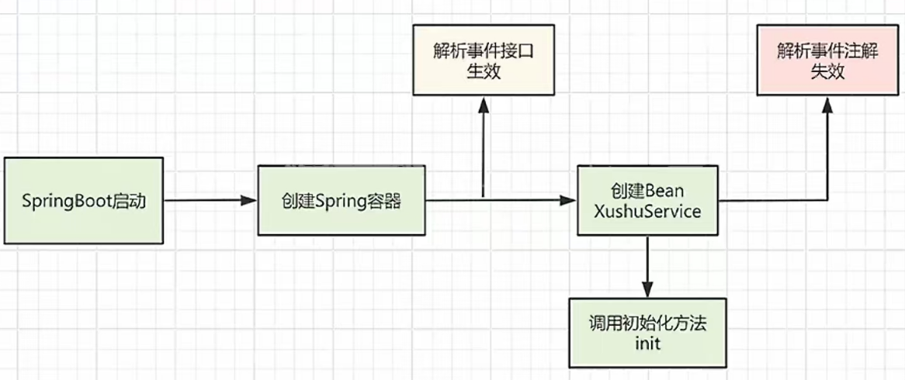

# Spring事件监听什么情况下会失效？

## 1、**监听器未被Spring容器管理**

若监听器类未添加`@Component`、`@Service`等注解，或未被组件扫描路径覆盖，则无法注册到Spring容器，导致事件监听失效‌

## 2、**事件未通过ApplicationContext发布**

手动调用监听方法（onApplicationEvent），而非通过`ApplicationContext.publishEvent()`发布事件，导致事件未被Spring事件机制处理‌

```java
MyEvent event = new MyEvent();
myListener.onApplicationEvent(event); // 手动调用监视器类中的方法, 事件未广播
```

## 3、**监听器方法定义不符合要求**

‌**方法签名错误**‌：使用`@EventListener`注解的方法，参数列表中未正确声明事件类型参数。

‌**访问权限限制**‌：监听方法为`private`或`final`，导致AOP代理无法拦截调用（部分Spring版本可能不限制）‌

```java
@EventListener
public void handleEvent(String event) { ... } // String不是事件类型
```

## 4、异步事件未配置执行器

若使用`@Async`标记异步监听器，但未配置`TaskExecutor`，导致异步任务无法执行‌

解决方案：

在配置类添加`@EnableAsync`，定义线程池

```java
@Bean
public TaskExecutor taskExecutor() {
    return new ThreadPoolTaskExecutor();
}
```

## 5、事务边界与事件监听冲突

使用`@TransactionalEventListener`监听事务事件时，若事件发布不在事务上下文中（如未添加`@Transactional`），则监听器不会触发‌

## 6、**事件类型不匹配**

监听器注册的事件类型是父类，而实际发布的是子类事件，或监听器通过泛型限定事件类型但未正确匹配‌

## 7、**监听器注册时机问题**

例如

定了一个Clear事件（Clear无任何含义，我的网名）

```java
@Getter
public class ClearEvent extends ApplicationEvent {

    private String name;

    public ClearEvent(String name) {
        super(name);
        this.name = name;
    }
}
```

定义一个service，用于发布事件

```java
@Service
public class ClearService {

    @Resource
    ApplicationEventPublisher applicationEventPublisher;

    @PostConstruct
    public void init() {
        applicationEventPublisher.publishEvent(new ClearEvent("程序员clear"));
    }
}
```

定义一个监听器，注意需要被spring容器所管控

```java
@Component
public class ClearEventListener  {

    @EventListener
    public void onApplicationEvent(ClearEvent clearEvent) {
        System.out.println("拿到事件执行一些操作");
    }
}
```

## 结论

以上这种情况下，事件机制会失效。

看完下面这种图片你大概率就懂了



因为解析事件注解的时机在bean初始化之前，然而在`@PostConstruct`注解声明的方法中进行了事件发布，而 `@EventListener`注解声明的监听器方法在此时还没生效，也就是事件监听还没有创建，所以监听器监听不到消息。

因此，**除了通过 @EventListener注解定义监视器外，spring还提供了通过实现ApplicationListener接口定义监听器**

如下，这种方式创建的监听器生效时机就在@PostConstruct注解声明的方法之前了

```java
@Component
public class ClearEventListener implements ApplicationListener<ClearEvent> {

    @Override
    @EventListener
    public void onApplicationEvent(ClearEvent clearEvent) {
        System.out.println("拿到事件执行一些操作");
    }
}
```
