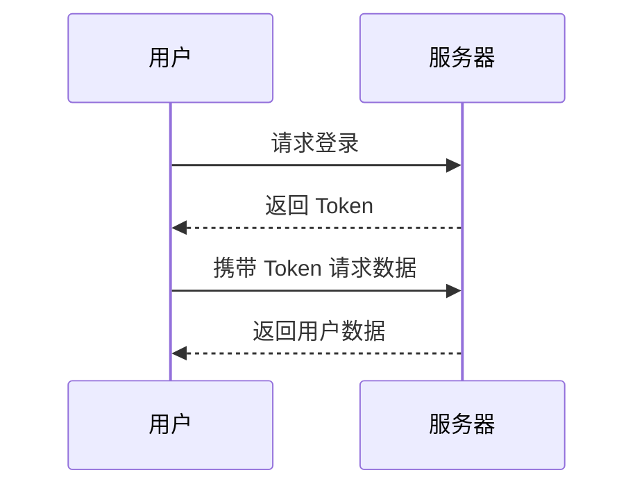
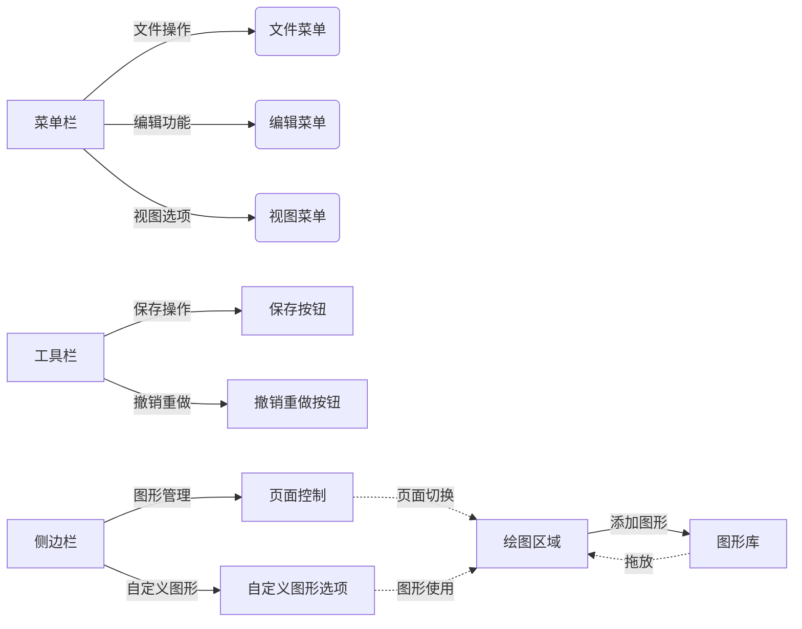

# 导读

脑图

```markmap
# 前端面试
## HTML
- 语义化标签
- SEO 优化
## CSS
- Flex 布局
- Grid 布局
## JavaScript
- 闭包
- 事件循环
```


流程图



## drawio



### 引入的方式

```
<!-- 基础用法 -->


<!-- 带参数的进阶用法 -->
{edit=_blank transparent=true nav=true}

```

{edit=_blank transparent=true nav=true}