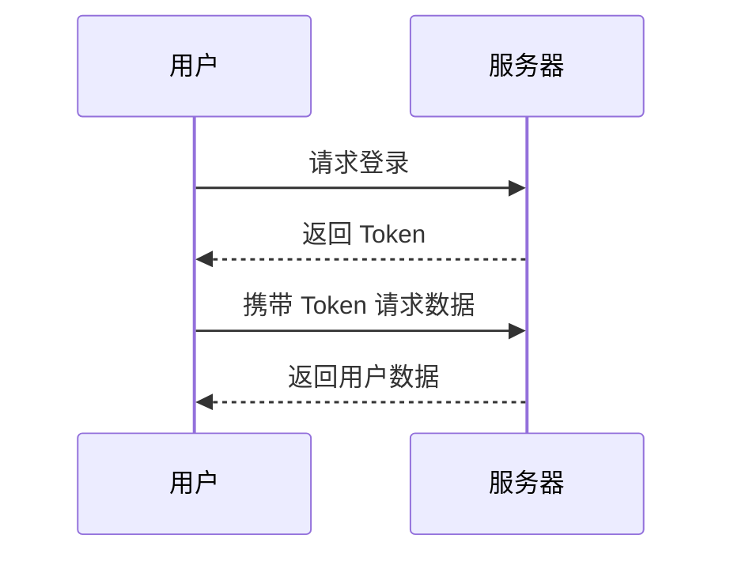

# 导读

脑图

```markmap
# 前端面试
## HTML
- 语义化标签
- SEO 优化
## CSS
- Flex 布局
- Grid 布局
## JavaScript
- 闭包
- 事件循环
```


流程图


```mermaid
sequenceDiagram
    participant U as 用户
    participant S as 服务器
    U->>S: 请求登录
    S-->>U: 返回 Token
    U->>S: 携带 Token 请求数据
    S-->>U: 返回用户数据
```
