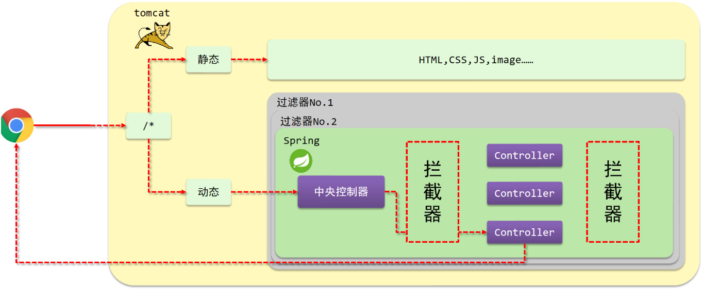

# SpringMVC中的拦截器是什么？

## **口语化**

在 Spring MVC 中，拦截器（Interceptor）是一种用于**对 HTTP 请求进行预处理和后处理的机制**。拦截器可以在请求到达控制器之前、控制器处理请求之后以及视图渲染之前执行特定的逻辑。它们类似于 Servlet 中的过滤器（Filter），但提供了更细粒度的控制和更强大的功能。

## 请求流程

在了解拦截器的概念之前，我们先看一张图:

(1)浏览器发送一个请求会先到Tomcat的web服务器

(2)Tomcat服务器接收到请求以后，会去判断请求的是静态资源还是动态资源

(3)如果是静态资源，会直接到Tomcat的项目部署目录下去直接访问

(4)如果是动态资源，就需要交给项目的后台代码进行处理

(5)在找到具体的方法之前，我们可以去配置过滤器(可以配置多个)，按照顺序进行执行

(6)然后进入到到中央处理器(SpringMVC中的内容)，SpringMVC会根据配置的规则进行拦截

(7)如果满足规则，则进行处理，找到其对应的controller类中的方法进行执行,完成后返回结果

(8)如果不满足规则，则不进行处理

(9)这个时候，如果我们需要在每个Controller方法执行的前后添加业务，具体该如何来实现?

这个就是拦截器要做的事。

-   拦截器（Interceptor）是一种动态拦截方法调用的机制，在SpringMVC中动态拦截控制器方法的执行
-   作用:
    -   在指定的方法调用前后执行预先设定的代码
    -   阻止原始方法的执行
    -   总结：**拦截器就是用来做增强**

---

看完以后，大家会发现

-   拦截器和过滤器在作用和执行顺序上也很相似

所以这个时候，就有一个问题需要思考:**拦截器和过滤器之间的区别**是什么?

-   归属不同：**Filter属于Servlet技术，Interceptor属于SpringMVC技术**
-   拦截内容不同：**Filter对所有访问进行增强，Interceptor仅针对SpringMVC的访问进行增强**

## **拦截器的主要用途**

-   **请求日志记录**：记录每个请求的详细信息，如请求 URL、请求参数、处理时间等。

-   **权限验证**：在请求到达控制器之前检查用户是否有权限访问特定的资源。

- **性能监控**：测量请求的处理时间，帮助优化性能。

-   **通用处理**：在请求处理之前或之后执行一些通用的逻辑，如设置公共属性、国际化处理等

## **拦截器的生命周期方法**

Spring MVC 的拦截器通过实现 `HandlerInterceptor` 接口来定义。这个接口包含三个主要方法：

-   **`preHandle`**：在请求处理之前执行。返回 `true` 表示继续处理请求，返回 `false` 表示中止请求。

-   **`postHandle`**：在请求处理之后、视图渲染之前执行。可以修改视图模型数据。

-   **`afterCompletion`**：在整个请求完成之后（包括视图渲染之后）执行。**通常用于资源清理**

