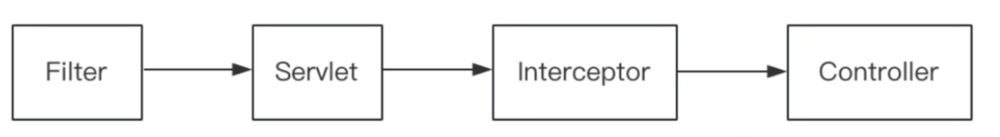

# 拦截器和过滤器的区别？

**运行顺序不同**：过滤器是在Servlet容器接受到请求之后，但是在Servlet被调用之前运行的，而拦截器是Servlet被调用之后，但是在请求被发送到Controller之前执行的

**配置方式不同**：过滤器是在`web.xml`中进行配置的，而拦截器可以通过Spring配置文件中配置或通过`WebMvcConfigurer`的实现类中重写`addInterceptors`方法进行配置

**归属不同**：Filter属于Servlet容器，Interceptor属于SpringMVC

**拦截内容不同**：Filter对所有访问进行增强，Interceptor仅针对SpringMVC的访问进行增强

**操作能力不同**：过滤器只能对request和response进行操作，而拦截器除了可以对request和response进行操作以外，还可以对SpringMVC生态下组件的handler、ModdelAndView、Exception进行操作

**实现原理不同**：过滤器和拦截器底层实现不同。过滤器是基于函数回调的，拦截器是基于Java的反射机制)（动态代理）实现的。一般自定义的过滤器中都会实现一个`doFilter()`方法，这个方法有一个`FilterChain`参数，而实际上它是一个回调接口。

