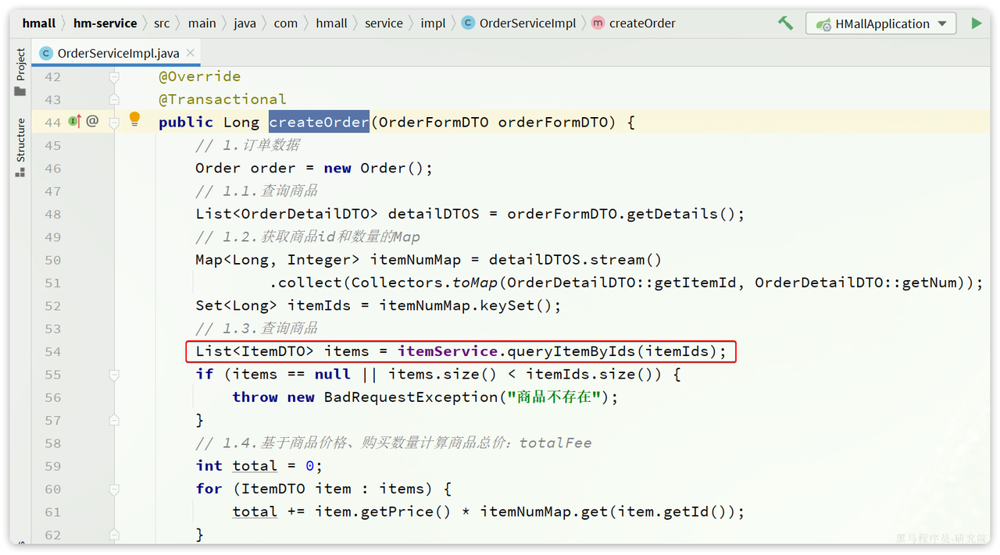

# OpenFeign最佳实践？

以黑马商城举例

将来我们要把与下单有关的业务抽取为一个独立微服务:`trade-service`，不过我们先来看一下`hm-service`中原本与下单有关的业务逻辑。

入口在`com.hmall.controller.OrderController`的`createOrder`方法，然后调用了`IOrderService`中的`createOrder`方法。

由于下单时前端提交了商品id，为了计算订单总价，需要查询商品信息：

也就是说，如果拆分了交易微服务（`trade-service`），它也需要远程调用`item-service`中的根据id批量查询商品功能。这个需求与`cart-service`中是一样的。

因此，我们就需要在`trade-service`中再次定义`ItemClient`接口，这不是重复编码吗？ 有什么办法能加避免重复编码呢？

## **思路分析**

相信大家都能想到，避免重复编码的办法就是**抽取**。不过这里有两种抽取思路：

-   思路1：抽取到微服务之外的公共module
-   思路2：每个微服务自己抽取一个module

如图：

方案1抽取更加简单，工程结构也比较清晰，但缺点是整个项目耦合度偏高。（适用于聚合模块）

方案2抽取相对麻烦，工程结构相对更复杂，但服务之间耦合度降低。（适用于每个模块都是独立的project。但是比较合理，因为开发这个微服务的开发者必然对这个服务比较熟悉，由他开写rpc也自然是最合适的）

## **总结**

OpenFeign使用的**最佳实践方式**是什么？

-   由服务提供者编写独立module，将FeignClient及DTO抽取

其实这里有两种方案。

-   一：在每个微服务都是独立的project前提下，服务提供者编写独立module（子module），将FeignClient及DTO抽取在这个module中，其他微服务需要发起远程调用时，引入这个module
    -   优点：耦合度较低。服务提供者对服务比较熟悉，编写出来的代码不容易出bug
    -   缺点：相对麻烦，工程结构相对更复杂
-   二：在使用maven聚合模块的前提下，抽取出一个公共module，将所有FeignClient及DTO抽取在这个module中
    -   优点：抽取更加简单，工程结构也比较清晰
    -   缺点：整个项目耦合度偏高

将FeignClient抽取为独立module，SpringBootApplication启动类扫描不到时，无法注入Bean

解决方案如下：

