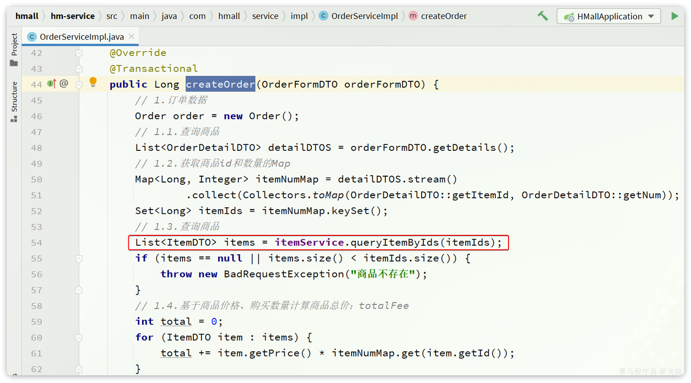
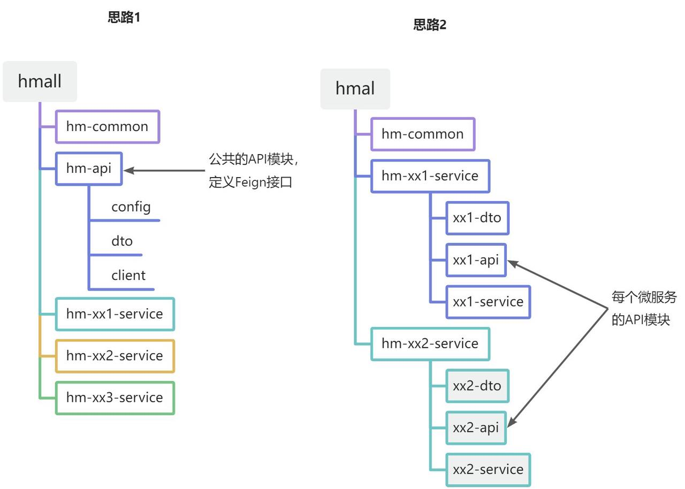

#


## Eureka的自我保护模式是什么？


## Eureka的高可用是怎么实现的？


## SpringCloud是如何实现服务注册的？


## Eureka和Zookeeper的区别？


## Consul是什么？


## Eureka、Zookeeper、Consul的区别？


## Eureka、Zookeeper、Nacos的区别？

| 特性     | Eureka                         | Zookeeper                       | Nacos                              |
| -------- | ------------------------------ | ------------------------------- | ---------------------------------- |
| 开发公司 | Netflix                        | Apache基金会                    | 阿里巴巴                           |
| CAP      | AP（可用性、分区容忍性）       | CP（一致性、分区容忍性）        | 既支持**CP**、也支持**AP**         |
| 功能     | 服务注册与发现                 | 分布式协调、配置管理、分布式锁  | 服务注册与发现、配置管理、服务管理 |
| 定位     | 适用于构建基于HTTP的微服务架构 | 通用的分布式协调服务框架        | 适用于微服务和云原生应用           |
| 访问协议 | HTTP                           | TCP                             | HTTP 或 DNS                        |
| 自我保护 | 支持                           | -                               | 支持                               |
| 数据存储 | 内嵌数据库、多个实例组成集群   | ACID特性的分布式文件系统ZAB协议 | 内嵌数据库、MySQL等                |
| 健康检查 | Client Base                    | Keep Alive                      | TCP/HTTP/MySQL/Client Base         |
| 特点     | 简单易用、自我保护机制         | 高性能、强一致性                | 动态配置管理、流量管理、灰度发布等 |


## Eureka、Zookeeper、Nacos注册中心的区别？


## Nacos的服务注册表结构是什么样的？


## Nacos中的Namespace是什么？如何使用它来组织和管理微服务？


## 为什么需要负载均衡？


## 在SpringCloud中怎么使用服务的负载均衡？


## 负载均衡的实现方式有哪些？


## 负载均衡有什么策略？


## Ribbon和Nginx的区别？


## Http和RPC的区别？

Http和RPC是两种常见的通信协议。

Http接口：


## Ribbon和Feign调用服务的区别是什么？


## 什么是Feign（Spring Cloud Netflix Feign）？


## 什么是OpenFeign？

OpenFeign由Spring官方推出的一个**声明式**的**HTTP客户端**库，用于简化微服务架构中的服务间通信。它是Spring Cloud生态系统的一部分，旨在提供一种简洁的方式来定义HTTP客户端接口，使得调用远程服务就像调用本地方法一样简单。

**主要特点**

1.  **声明式接口定义**：
    -   开发者只需定义一个接口，并使用注解来描述HTTP请求的细节，如URL、HTTP方法、请求参数等。OpenFeign会自动生成客户端来执行这些请求（动态代理的方式）。
2.  **支持Spring MVC注解**：
    -   OpenFeign不仅支持Feign原有的注解，还支持JAX-RS注解、**Spring MVC注解**，使得定义HTTP客户端更加直观和便捷。
3.  **易于集成Spring Cloud生态系统**：
    -   OpenFeign可以与Spring Cloud的其他组件**无缝集成**，例如Eureka（服务注册中心）、Ribbon（客户端负载均衡器）、loadbalancer（客户端负载均衡器）等，从而实现自动化的负载均衡和服务发现。
4.  **可插拔的编码器和解码器**：
    -   OpenFeign支持多种编码器和解码器，可以通过配置来选择合适的编码器和解码器，以满足不同的数据传输需求
    -   如：如Jackson、Gson、JAXB等
5.  **错误处理**：
    -   OpenFeign可以结合Hystrix或其他容错组件来处理网络故障、超时等问题，增强了系统的健壮性。

**工作原理**

-   当应用程序调用Feign客户端接口时，Feign会在运行时动态地生成一个代理对象。
-   代理对象通过注解来获取远程服务的信息，然后将远程调用转化为HTTP请求，发送给远程服务。
-   远程服务处理请求后，将结果返回给Feign客户端，Feign客户端再将结果转换成Java对象返回给调用者

**应用场景**

-   Feign主要用于微服务架构中，通过HTTP协议调用其他服务的RESTful API。
-   它简化了对RESTful API的调用，使得开发者可以更加专注于业务逻辑的实现，而不是HTTP请求的发送和接收。

**优势**

-   **简化客户端开发**：通过声明式的方式定义HTTP客户端，减少了手写HTTP请求代码的工作量。
-   **提高代码可读性**：使用注解定义接口，使得代码更加清晰易懂。
-   **易于维护**：由于OpenFeign支持服务发现和负载均衡，所以当后端服务发生变更时，客户端代码几乎不需要改动。
-   **强大的社区支持**：作为Spring Cloud的一部分，OpenFeign有着强大的社区支持和丰富的文档资源。

**不足**：

-   Feign的性能相对较差，因为它是基于HTTP协议实现的，每次远程调用都需要建立TCP连接，开销比较大。相比之下，基于RPC协议的远程调用框架（如Dubbo）性能更好

**使用方式**

1.  在项目的pom.xml文件中添加`spring-cloud-starter-feign`依赖。
2.  在启动类上添加@SpringBootApplication和@EnableFeignClients注解，以开启Feign的功能。
3.  创建一个接口并设置@FeignClient注解，使用Feign的注解来定义远程调用的方法。
4.  在需要使用远程服务的地方，注入创建的接口实例，并直接调用其方法。Feign会自动将方法调用转换为HTTP请求，并发送到指定的服务地址

>   补充：
>
>   ​	Fegin是在客户端（消费者端）进行接口的声明，例如微服务a需要调用微服务b中的接口，就在a中进行接口声明

**总结**

​	OpenFeign是一个高效、易用的**声明式服务调用**和**负载均衡**的客户端工具，它通过声明式接口和丰富的注解支持，简化了HTTP客户端的编写，降低了开发难度。

​	可以理解为OpenFeign是Feign（Netflix）的二次封装， 它具有Feign的所有功能，并进行了扩能（例如支持SpringMVC注解），它的出现其实是为了替代停更的Feign（Netflix）

​	在微服务架构中，OpenFeign是调用RESTful API的优选工具之一。


## 如何配置OpenFeign？

配置 OpenFeign主要涉及以下几个方面：基础配置、自定义配置、日志配置、超时配置、编码器和解码器配置、错误处理配置等。

**1、基础配置**

-   1）添加依赖

```xml
<dependency>
    <groupId>org.springframework.cloud</groupId>
    <artifactId>spring-cloud-starter-openfeign</artifactId>
</dependency>
```

-   2）启用 Feign 客户端

在主应用程序类上添加 `@EnableFeignClients` 注解，启用 Feign 客户端功能：

```java
import org.springframework.boot.SpringApplication;
import org.springframework.boot.autoconfigure.SpringBootApplication;
import org.springframework.cloud.openfeign.EnableFeignClients;

@SpringBootApplication
@EnableFeignClients
public class MyApplication {

    public static void main(String[] args) {
        SpringApplication.run(MyApplication.class, args);
    }
}
```

### 自定义配置

OpenFeign除了基本的服务远程调用和负载均衡以为，还支持请求和响应数据的压缩、日志增强、超时控制等

#### 编码器和解码器

可以自定义编码器和解码器，来处理请求和响应的序列化和反序列化。

-   **编码器（Encoder）**：编码器负责将Java对象转换为可以在HTTP请求中发送的数据格式。例如，如果你有一个Java对象需要作为请求体发送给远程服务，编码器会将这个对象序列化为JSON或其他格式的数据，然后将其设置为HTTP请求的请求体。
-   **解码器（Decoder）**：解码器则负责将HTTP响应体中的数据转换回Java对象。当远程服务返回一个HTTP响应时，解码器会读取响应体中的数据，并将其反序列化为相应的Java对象

```java
import feign.codec.Encoder;
import feign.codec.Decoder;
import feign.jackson.JacksonEncoder;
import feign.jackson.JacksonDecoder;
import org.springframework.context.annotation.Bean;
import org.springframework.context.annotation.Configuration;

@Configuration
public class FeignConfig {

    @Bean
    public Encoder feignEncoder() {
        return new JacksonEncoder();
    }

    @Bean
    public Decoder feignDecoder() {
        return new JacksonDecoder();
    }
}
```

在 Feign 客户端接口上引用这个配置：

```java
@FeignClient(name = "remote-service", configuration = FeignConfig.class)
public interface RemoteServiceClient {
    // 方法定义
}
```

#### 请求压缩和响应压缩

OpenFeign支持对请求和响应进行gzip压缩，以减少通信过程中的性能损耗

```yaml
feign:
  compression:
    request:
      enabled: true  # 默认不开启
      mime-types: text/html,application/xml,application/json  # 设置压缩的数据类型
      min-request-size: 2048  # 设置触发压缩的下限值，默认2048
    response:
      enabled: true  # 默认不开启
```

#### 日志增强

OpenFeign提供日志打印功能，可用通过配置调整日志级别，方便开发是了解请求的细节

Feign为每个FeigenClient提供了一个feign.Logger实例，通过它可用对OpenFeign服务绑定接口的调用情况进行监控

```yaml
logging:
  level:
    com.clear: DEBUG	# 知道FeignClient所在包的日志级别
```

>   补充：
>
>   ​	OpenFeign的日志配置可用单独对某个FeignClient设置（局部配置），也可以为对所有FeignClient统一设置（全局配置）
>
>   ​	配置可以基于配置文件配置，也可以基于Bean配置，上述示例就是基于配置文件

#### 超时配置

OpenFeign客户端的默认超时时间为1s，如果服务端处理请求超过1s就会报错。为了避免这种情况，你可以配置 Feign 客户端的连接和读取超时。

```yaml
feign:
  client:
    config:
      default:	# 设置默认的超时时间
        connectTimeout: 2000
        readTimeout: 2000
      微服务名称:	# 设置具体微服务响应超时时间
        connectTimeout: 5000
        readTimeout: 5000
```

####  错误处理

可以自定义错误处理器来处理 Feign 调用中的错误。

```java
import feign.Response;
import feign.codec.ErrorDecoder;
import org.springframework.context.annotation.Bean;
import org.springframework.context.annotation.Configuration;

@Configuration
public class FeignErrorConfig {

    @Bean
    public ErrorDecoder errorDecoder() {
        return new CustomErrorDecoder();
    }

    public class CustomErrorDecoder implements ErrorDecoder {
        @Override
        public Exception decode(String methodKey, Response response) {
            // 自定义错误处理逻辑
            return new RuntimeException("Feign Error: " + response.status());
        }
    }
}
```

在 FeignClient接口上引用这个配置：

```java
@FeignClient(name = "remote-service", configuration = FeignErrorConfig.class)
public interface RemoteServiceClient {
    // 方法定义
}
```

### 高级配置

#### 负载均衡

Feign 可以与 Ribbon 集成，提供客户端负载均衡功能。默认情况下，Feign 会使用 Ribbon 进行负载均衡。可以通过配置 Ribbon 来定制负载均衡策略。

```yaml
ribbon:
  eureka:
    enabled: true
  MaxAutoRetries: 1
  MaxAutoRetriesNextServer: 1
  OkToRetryOnAllOperations: true
  ServerListRefreshInterval: 2000
```

>   补充：
>
>   ​	新版的OpenFeign 支持的是loadbalancer

#### 断路器

Feign 可以与 Hystrix 集成，实现断路器模式。可以通过配置 Hystrix 来定制断路器行为。

```yaml
feign:
  hystrix:
    enabled: true

hystrix:
  command:
    default:
      execution:
        isolation:
          thread:
            timeoutInMilliseconds: 1000
```


## Feign和OpenFeign的区别？

**发展历程**

-   Feign最初是Netflix公司开发的一款声明式HTTP客户端，后来随着Netflix套件的逐渐停止维护，Spring Cloud团队推出了OpenFeign作为替代方案。
-   OpenFeign是在Feign的基础上进行了改进和发展，更好地适应了Spring Cloud生态系统的需求。

OpenFeign 和 Feign 是两种用于微服务架构中服务间通信的工具，它们都提供了**声明式的HTTP客户端**，使得调用HTTP服务像调用本地方法一样简单。

**相同点**

-   Feign和OpenFeign都是Spring Cloud下远程服务调用和负载均衡的组件
-   Feign和OpenFeign作用一致，都是用来实现服务的远程调用的和负载均衡的
-   Feign和OpenFeign都对Ribbon进行了集成，都是利用Ribbon维护了一个可用的服务清单列表，然后通过Ribbon实现了客户端的负载均衡
    -   新版的OpenFeign不再支持Ribbon，而是使用**Loadbalance**
-   Feign和OpenFeign都是在服务者的消费者端定义服务来绑定接口的，也就是说在客户端来定义接口绑定服务，并且是通过注解的方式来进行配置的

**不同点**

-   **依赖包**：
    -   **Feign**：使用的是 `spring-cloud-starter-feign` 依赖包。
    -   **OpenFeign**：使用的是 `spring-cloud-starter-openfeign` 依赖包。

-   **支持的注解不同**：
    -   **Feign**：Feign通过注解来定义接口，支持Feign自身的注解和JAX-RS的注解，但是不支持Spring MVC的注解。
    -   **OpenFeign**：OpenFeign不仅支持Feign原有的注解，还支持JAX-RS、Spring MVC的注解，如`@RequestMapping`、`@GetMapping`、`@PostMapping`等，使得定义接口更加灵活和方便。

-   **@FeignClient**注解：
    -   **Feign**：使用`@FeignClient`注解定义一个Feign客户端，但是它不能解析Spring MVC注解下的接口。
    -   **OpenFeign**：同样使用`@FeignClient`注解，但它可以解析Spring MVC注解下的接口，并通过**动态代理**的方式**产生实现类**，实现类中做负载均衡并调用其他服务。

**特性**：

-   相对于Feign而言，OpenFeign提供了更多高级特性和灵活性，例如支持更丰富的配置选项、更好的集成Spring Boot生态等。

总结

-   如果你正在使用Spring Cloud，并且希望在定义Feign客户端时能够使用Spring MVC的注解，那么OpenFeign是一个更好的选择。
-   如果你的项目已经使用了Feign，并且没有计划迁移到Spring MVC的注解，那么继续使用Feign也是可行的。

总的来说，OpenFeign是对Feign的一种增强版本，它提供了更多的功能和更好的兼容性，特别是对于那些希望在微服务架构中充分利用Spring MVC特性的开发者来说。


## Feign和Dubbo的区别？rpc vs http,为什么rpc快？


## Feign是如何实现负载均衡的？


## 为什么Feign第一次调用耗时很长？


## 为什么OpenFeign第一次调用耗时很长？

OpenFeign第一次调用耗时较长的原因主要包括以下几个方面（抛开业务代码和前端网络通信过程中的缓存初始化来看，单独就OpenFeign本身来说有以下几个方面）：

-   **初始化时间**：Feign在第一次调用时需要进行一系列的初始化工作，这包括**加载配置**信息、创建代理对象、**初始化HTTP客户端**、**解析注解**等。这些初始化步骤都需要消耗一定的时间。

-   **服务发现与负载均衡**：如果Feign客户端配置了与Eureka、Nacos等服务发现组件集成，那么在第一次调用时，Feign需要通过**服务发现**组件**获取**目标服务的具体**实例**信息。这一过程中涉及到的服务发现请求和负载均衡决策也会增加调用时间。
    -   OpenFeign默认使用Ribbon实现客户端的负载均衡，但是它是第一次调用时才会去创建和目标服务相关的一个客户端连接。同时创建Ribbon客户端的时候，需要从注册中心去获取服务的实例列表（也是第一次调用时完成）

-   **线程池初始化**：Feign在进行远程调用时通常会使用线程池来管理线程。如果线程池尚未初始化或需要调整大小，这也可能导致额外的开销。
    -   Ribbon：Ribbon通常是使用连接池来管理各个服务实例的一个连接，连接池的初始化和预热也需要消耗一点的时间

-   **类加载与代理生成**：Feign使用Java的动态代理机制来生成客户端代码，这意味着在第一次调用时需要加载并生成相关的代理类，这也是造成首次调用耗时的一个因素。


**解决方案**

尽量避免第一次调用时来进行初始化配置，具体来说有两种方法

-   **提前初始化**：可以在应用程序启动时，通过配置或编程手段预先触发Feign客户端的初始化，使得这些初始化操作在服务真正开始处理请求之前就已经完成

    -   Ribbon：通过`ribbon.eager-load.enabled=ture` 来开启**饥饿加载模式**，这样就可以在程序启动的时候初始化所有需要的一些客户端连接

-   **服务发现预热**：可以尝试在启动时预热服务发现客户端，使其提前准备好目标服务的信息。

    -   Ribbon：在应用启动以后，主动发起一次预热请求，从而去提前初始化Ribbon客户端以及OpenFeign相关配置初始化

    

## OpenFeign的拦截器是做什么的？

Feign的拦截器主要用于在**请求发送**到远程服务**之前**或**之后**执行一些额外的逻辑。这些逻辑可以包括但不限于：

-   **添加请求头**：可以在请求发送之前添加必要的请求头
    -    比如添加认证信息（如OAuth Token）、用户代理、跟踪ID等。

-   **修改请求参数**：

-   -   可以在请求发送之前修改请求参数，例如对参数进行加密或签名。

-   **修改请求体**：根据业务需求修改请求体的内容。

-   **处理响应**：

-   -   可以在接收到响应之后对响应进行处理，例如检查响应状态码、解析响应体等

-   **日志记录**：记录请求和响应的信息，便于调试和监控。
-   **错误处理**：处理请求过程中的异常情况。
-   **性能监控**：收集请求的耗时等性能指标。

通过使用拦截器，可以灵活地扩展Feign客户端的功能，而无需修改其核心逻辑。这有助于保持代码的整洁，并使功能更容易维护。


**实现 Feign 拦截器**

Feign中提供的一个拦截器接口：`feign.RequestInterceptor`

```java
public interface RequestInterceptor {

    /**
     * Called for every request. 
     * Add data using methods on the supplied {@link RequestTemplate}.
     */
    void apply(RequestTemplate template);
}
```

我们只需要实现这个接口，然后实现apply方法，利用RequestTemplate类来添加请求头

示例：

```java
import feign.RequestInterceptor;
import feign.RequestTemplate;
import org.springframework.context.annotation.Bean;
import org.springframework.context.annotation.Configuration;

@Configuration
public class FeignConfig {

    @Bean
    public RequestInterceptor requestInterceptor() {
        return new RequestInterceptor() {
            @Override
            public void apply(RequestTemplate template) {
                // 添加请求头
                template.header("Authorization", "Bearer " + getAccessToken());

                // 记录请求日志
                System.out.println("Request: " + template.request());
            }

            private String getAccessToken() {
                // 获取访问令牌的逻辑
                return "your-access-token";
            }
        };
    }
}
```

**使用 Feign 拦截器**

要使用自定义的 Feign 拦截器，只需要在 FeignClient配置中引用这个配置类即可。例如：

```java
import org.springframework.cloud.openfeign.FeignClient;
import org.springframework.web.bind.annotation.GetMapping;
import org.springframework.web.bind.annotation.RequestParam;

@FeignClient(name = "example-client", url = "https://api.example.com", configuration = FeignConfig.class)
public interface ExampleClient {

    @GetMapping("/data")
    String getData(@RequestParam("param") String param);
}
```


## OpenFeign最佳实践？

以黑马商城举例

将来我们要把与下单有关的业务抽取为一个独立微服务:`trade-service`，不过我们先来看一下`hm-service`中原本与下单有关的业务逻辑。

入口在`com.hmall.controller.OrderController`的`createOrder`方法，然后调用了`IOrderService`中的`createOrder`方法。

由于下单时前端提交了商品id，为了计算订单总价，需要查询商品信息：



也就是说，如果拆分了交易微服务（`trade-service`），它也需要远程调用`item-service`中的根据id批量查询商品功能。这个需求与`cart-service`中是一样的。

因此，我们就需要在`trade-service`中再次定义`ItemClient`接口，这不是重复编码吗？ 有什么办法能加避免重复编码呢？

**思路分析**

相信大家都能想到，避免重复编码的办法就是**抽取**。不过这里有两种抽取思路：

-   思路1：抽取到微服务之外的公共module
-   思路2：每个微服务自己抽取一个module

如图：



方案1抽取更加简单，工程结构也比较清晰，但缺点是整个项目耦合度偏高。（适用于聚合模块）

方案2抽取相对麻烦，工程结构相对更复杂，但服务之间耦合度降低。（适用于每个模块都是独立的project。但是比较合理，因为开发这个微服务的开发者必然对这个服务比较熟悉，由他开写rpc也自然是最合适的）


**总结**

OpenFeign使用的<font color="red">**最佳实践方式**</font>是什么？

-   由服务提供者编写独立module，将FeignClient及DTO抽取

其实这里有两种方案。

-   一：在每个微服务都是独立的project前提下，服务提供者编写独立module（子module），将FeignClient及DTO抽取在这个module中，其他微服务需要发起远程调用时，引入这个module
    -   优点：耦合度较低。服务提供者对服务比较熟悉，编写出来的代码不容易出bug
    -   缺点：相对麻烦，工程结构相对更复杂
-   二：在使用maven聚合模块的前提下，抽取出一个公共module，将所有FeignClient及DTO抽取在这个module中
    -   优点：抽取更加简单，工程结构也比较清晰
    -   缺点：整个项目耦合度偏高

将FeignClient抽取为独立module，SpringBootApplication启动类扫描不到时，无法注入Bean

解决方案如下：


## RPC层为什么建议防腐？


## 不用OpenFeign还能怎么调用微服务？

-   **HttpURLConnection**

`HttpURLConnection`是 Java 标准库中的类，用于发送 HTTP 请求和接收响应。虽然它比较底层，但适合简单的 HTTP 请求。

```java
import java.io.BufferedReader;
import java.io.InputStreamReader;
import java.net.HttpURLConnection;
import java.net.URL;

public class HttpUrlConnectionExample {

    public static void main(String[] args) {
        try {
            URL url = new URL("https://api.example.com/data?param=value");
            HttpURLConnection connection = (HttpURLConnection) url.openConnection();
            connection.setRequestMethod("GET");

            int responseCode = connection.getResponseCode();
            if (responseCode == HttpURLConnection.HTTP_OK) {
                BufferedReader in = new BufferedReader(new InputStreamReader(connection.getInputStream()));
                String inputLine;
                StringBuilder response = new StringBuilder();

                while ((inputLine = in.readLine()) != null) {
                    response.append(inputLine);
                }
                in.close();

                System.out.println(response.toString());
            } else {
                System.out.println("GET request not worked");
            }
        } catch (Exception e) {
            e.printStackTrace();
        }
    }
}
```

-    **Apache HttpClient**

Apache HttpClient 是一个功能强大的 HTTP 客户端库，提供了更高级的功能和更好的可扩展性

```java
import org.apache.http.HttpEntity;
import org.apache.http.HttpResponse;
import org.apache.http.client.methods.HttpGet;
import org.apache.http.impl.client.CloseableHttpClient;
import org.apache.http.impl.client.HttpClients;
import org.apache.http.util.EntityUtils;

public class ApacheHttpClientExample {

    public static void main(String[] args) {
        try (CloseableHttpClient httpClient = HttpClients.createDefault()) {
            HttpGet request = new HttpGet("https://api.example.com/data?param=value");
            HttpResponse response = httpClient.execute(request);

            HttpEntity entity = response.getEntity();
            if (entity != null) {
                String result = EntityUtils.toString(entity);
                System.out.println(result);
            }
        } catch (Exception e) {
            e.printStackTrace();
        }
    }
}
```

-   **OkHttp**

OkHttp 是一个现代化的 HTTP 客户端，提供了高效的异步和同步请求处理。

```java
import okhttp3.OkHttpClient;
import okhttp3.Request;
import okhttp3.Response;

public class OkHttpExample {

    public static void main(String[] args) {
        OkHttpClient client = new OkHttpClient();

        Request request = new Request.Builder()
                .url("https://api.example.com/data?param=value")
                .build();

        try (Response response = client.newCall(request).execute()) {
            if (response.isSuccessful()) {
                System.out.println(response.body().string());
            } else {
                System.out.println("GET request not worked");
            }
        } catch (Exception e) {
            e.printStackTrace();
        }
    }
}
```

-   **Spring RestTemplate**

`RestTemplate`是 Spring 提供的用于访问 RESTful 服务的同步客户端。

```java
import org.springframework.http.ResponseEntity;
import org.springframework.web.client.RestTemplate;

public class RestTemplateExample {

    public static void main(String[] args) {
        RestTemplate restTemplate = new RestTemplate();
        String url = "https://api.example.com/data?param=value";

        ResponseEntity<String> response = restTemplate.getForEntity(url, String.class);
        if (response.getStatusCode().is2xxSuccessful()) {
            System.out.println(response.getBody());
        } else {
            System.out.println("GET request not worked");
        }
    }
}
```

- **Spring WebClient**（Reactive响应式）

`WebClient`是 Spring WebFlux 提供的非阻塞式客户端，适用于需要异步处理的场景。

```java
import org.springframework.web.reactive.function.client.WebClient;
import reactor.core.publisher.Mono;

public class WebClientExample {

    public static void main(String[] args) {
        WebClient webClient = WebClient.create("https://api.example.com");

        Mono<String> response = webClient.get()
                .uri("/data?param=value")
                .retrieve()
                .bodyToMono(String.class);

        response.subscribe(System.out::println);
    }
}
```


## 什么是断路器？为什么需要断路器？


## 什么是Hystrix？


## 微服务雪崩是什么？


## 什么是服务降级？


## 什么是服务熔断？


## 什么是服务限流？


## 什么是降级熔断？为什么需要熔断降级？


## 熔断降级有哪些方案？


## Hystrix是怎么实现服务容错的？


## 什么是Sentinel？


## Sentinel中的两个核心概念？


资源、规则


## Sentinel的应用场景？


## Sentinel中如何定义一个资源？


## Sentinel的熔断策略有哪些？

## Sentinel的熔断规则如何定义？

控制台定义、代码定义


## Sentinel的熔断降级状态有哪些？


## Sentinel是怎么实现限流的？


## Sentinel如何实现热点参数降流？


## Sentinel与Hystrix的区别？


## Sentinel是怎么实现集群限流的？


## 什么是服务网络？


## 什么是灰度发布、金丝雀部署以及蓝绿部署？


## 说说什么是API网关？它有什么作用？

。


## 什么是微服务网关？为什么需要服务网关？


## SpringCloud可以选择哪些API网关？


## 什么是SpringCloud Zuul？


## 什么是SpringCloud Gateway？


## SpringCloud Gateway的工作流程？


## SpringCloud Gateway路由如何配置？

静态路由、动态路由


## SpringCloud Gateway过滤器如何实现？

。


## 说说SpringCloud Gateway核心概念？


## SpringCloud Gateway如何整合Sentinel？

。


## SpringCloud Gateway如何处理跨域请求？


## 你的项目为什么使用SpringCloud Gateway作为网关？


## SpringCloud Gateway与Zuul的区别？


## SpringCloud Gateway与Dubbo的区别？


## 什么是令牌桶算法？工作原理是什么？使用它有什么优点和注意事项？


# Dubbo篇

## Dubbo的负载均衡是如何实现的？服务端挂了怎么避免被调用到？

