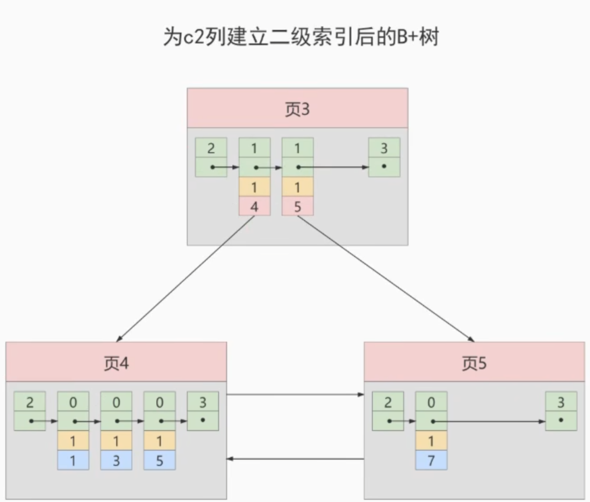
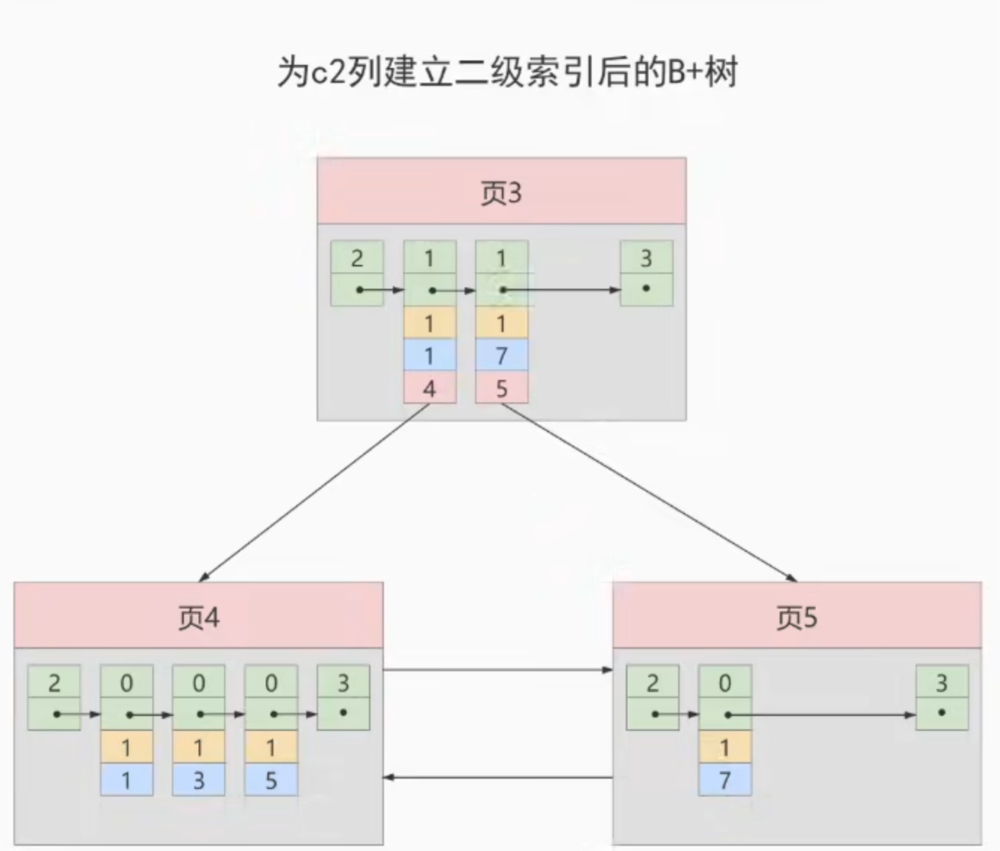

# InnoDB的B+树索引的注意事项

## 根页面位置万年不动

B+树的形成过程：

1、每当为某个表创建一个B+树索引（聚簇索引不需要手动创建，默认就有）的时候，都会为这个索引创建一个`根节点`页面。最开始表中没有数据的时候，每个B+树的索引对应的`根节点`中既没有用户记录，也没有目录项记录

2、随后向表中插入用户记录，先把用户记录存储到这个`根节点`中

3、当根节点中的可用`空间用完时`继续插入记录，此时就会将根节点中的所有记录复制到一个新分配的页，比如`页a`中，然后对这个新页进行`页分裂`的操作，得到另一个新页，比如`页b`。这时新插入的记录根据键值（也就是聚簇索引中的主键值，二级索引中对应的索引列的值）的大小就会被分配到`页a`或者`页b`中，而`根节点`便升级到存储目录项记录的页

特别注意：

一个B+树索引的根节点自诞生之日起，便不会再移动。这样只要我们对某个表建立一个索引，那么它的根节点的页号便会被记录到某个地方，然后凡是InnoDB存储引擎需要用到这个索引的时候，就会去这个固定地方获取根节点的页号，从而来访问这个B+树索引。

## 内节点中目录项记录的唯一性

我们直到B+树索引的内节点（也就是非叶子节点，即目录项记录所在的页）中目录项记录的内容是`索引列 + 页号`的搭配，但是这个搭配对于二级索引来说有点不是太严谨！

例如，表字段数据如下：

| c1 | c2 | c3 |
| --- | --- | --- |
| 1 | 1 | 'u' |
| 3 | 1 | 'd' |
| 5 | 1 | 'y' |
| 7 | 1 | 'a' |

如果二级索引中目录项记录的内容是`索引列 + 页号`的搭配的话，那么为`c2`列建立索引后的B+树应该长这样：

如果我们想插入一行新记录`(9, 1, 'c')`，那么在修改这个为c2列建立的二级索引对应的B+树时便会遇到一些大麻烦：

由于`页3`中存储的目录项记录是由`c2列 + 页号`的值构成的，`页3`中的两条目录项记录对应的c2列都是`1`，而我们`插入的新记录的`c2列的值也是`1`，那么我们这条新记录是应该被插入到`页4`中呢，还是应该被插入到`页5`中？

这就懵逼了

所以为了让新插入的记录能找到自己在哪个页里，我们需要**保证在B+树的同一层内节点的目录项记录除页号这个字段以外是唯一的**。所以对于二级索引的内节点的目录项记录的内容实际上是由三个部分的值构成的：

- 索引列的值
- 主键值
- 页号

也就是我们把`主键值`也添加到二级索引内节点的目录项记录了，这样就能保证B+树每一层节点中各条目录项记录除页号这个字段以外的值是唯一的，所以我们为c2列建立索引后的B+树实际上应该长这样：

这样我们再插入记录`(9, 1, 'c')`时，由于`页3`中存储的目录项记录是由`c2列 + 主键 + 页号`的值构成的，可以先把新记录的`c2`列的值和`页3`中各目录项记录的`c2`列的值做比较，如果`c2`列的值相等，那么再比较主键值，以外B+树同一层中不同目录项记录的`c2列 + 主键`的值肯定是不一样的，所以最后肯定能定位唯一的一条目录项记录，从而能找到新记录应该被插入的页。

在这个例子中最后确定新记录应该被插入到`页5`中。

## 一个页面最少存储2条记录

一个B+树只需要很少的层级就可以轻松存储数亿条记录，查询速度相当不错！

这是因为B+树本质上就是一个大的多层级目录，每经过一个目录时都会过滤掉许多无效的子目录，直到最后访问到存储真实数据的目录。

那如果一个大的目录中只存放一个子目录是个啥效果呢？

那么目录层级就会非常非常多，而且最后的哪个存放真实数据的目录只能存放一条记录。废了半天劲只能存放一条真实的用户记录，这显然是不合理的。

所以InnoDB的一个数据页至少可以存放2条记录