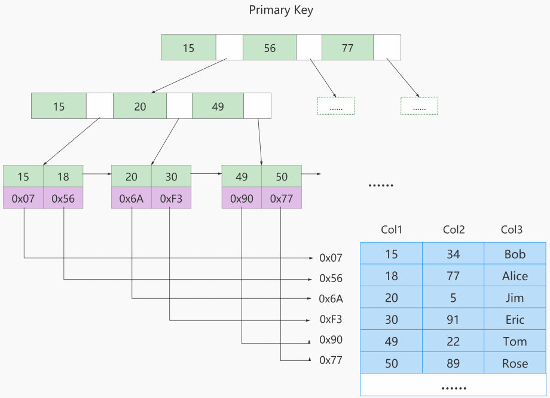
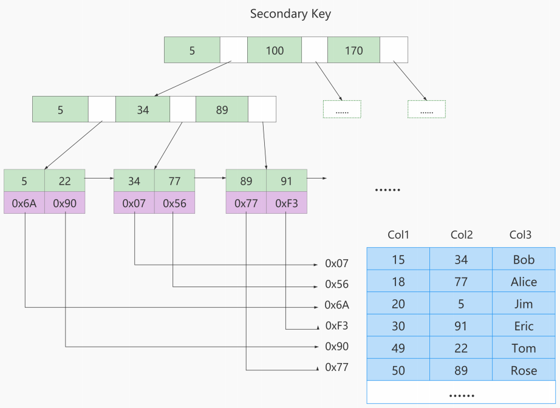

# MyIASM中的索引方案

**B树索引适用存储引擎如表所示：**

| 索引/存储引擎 | MyISAM | InnoDB | Memory |
| ------------ | ------ | ------ | ------ |
| B-Tree索引    | 支持   | 支持   | 支持   |

> 说明：在MySQL官方文档中，所说的B-Tree就是我们理解的B+Tree

即使多个存储引擎支持同一种类型的索引，但是他们的实现原理也是不同的。

Innodb和MyISAM默认的索引是B-tree索引；而Memory默认的索引是Hash索引。

MyISAM引擎使用`B+Tree`作为索引结构，叶子节点的data域存放的是`数据记录的地址`。

## MyISAM索引的原理

我们知道`InnoDB中索引即数据`，也就是聚簇索引的那棵B+树的叶子节点中已经把所有完整的用户记录都包含了，而 `MyISAM` 的索引方案虽然也使用树形结构，但是却将`索引和数据分开存储`：

- 将表中的记录`按照记录的插入顺序`单独存储在一个文件中，称之为`数据文件`。这个文件并不划分为若干个数据页，有多少记录就往这个文件中塞多少记录就成了。
  - 由于在插入数据的时候并`没有刻意按照主键大小排序`，所以我们并不能在这些数据上使用二分法进行查找。
- 使用`MyISAM`存储引擎的表会把索引信息另外存储到一个称为`索引文件`的另一个文件中。MyISAM 会单独为表的主键创建一个索引，只不过在索引的叶子节点中存储的不是完整的用户记录，而是`主键值 + 数据记录偏移地址`的组合。

> 这里的索引类似于InnoDB中的非聚簇索引，只不过非聚簇索引中叶子节点存储的是`主键的值 + 索引值`

下图是 MyISAM 索引的原理图：

这里假设表一共有三列，假设我们以 Col1 为主键，上图是一个 MyISAM 表的主索引（Primary key）示意。可以看出**MyISAM 的索引文件仅仅保存数据记录的地址**。

在 MyISAM 中，主键索引和二级索引（Secondary key）在结构上没有任何区别，只是主键索引要求 key 是唯一的，而二级索引的 key 可以重复。

如果我们在 Col2 上建立一个二级索引，则此索引的结构如下图所示：

同样也是一颗B+Tree，data域保存数据记录的值。

因此，MyISAM中索引检索的算法为：

- 首先按照B+Tree搜索算法搜索索引
- 如果该key存在，则取出其data域的值，然后以`data域的值为地址`，读取相应数据记录。

## MyISAM与InnoDB对比

**MyISAM的索引方式都是“非聚簇”的，与InnoDB包含1个聚簇索引是不同的。**

**小结两种引擎中索引的区别：**

- ① 在InnoDB存储引擎中，我们只需要根据主键值对`聚簇索引`进行一次查找就能找到对应的记录，而在`MyISAM`中却需要进行一次`回表`操作，意味着MyISAM中建立的索引相当于全部都是`二级索引`。

- ② InnoDB的数据文件本身就是索引文件，而MyISAM索引文件和数据文件是`分离的`，索引文件仅保存数据记录的地址。

- ③ InnoDB的非聚簇索引data域存储相应记录`主键的值`，而MyISAM索引记录的是`地址`。换句话说，InnoDB的所有非聚簇索引都引用主键作为data域。

- ④ MyISAM的回表操作是十分`快速`的，因为是拿着地址偏移量直接到文件中取数据的，反观InnoDB是通过获取主键之后再去聚簇索引里找记录，虽然说也不慢，但还是比不上直接用地址去访问。

- ⑤ InnoDB要求表`必须有主键`（`MyISAM可以没有`）。如果没有显式指定，则MySQL系统会自动选择一个可以非空且唯一标识数据记录的列作为主键。如果不存在这种列，则MySQL自动为InnoDB表生成一个隐含字段作为主键，这个字段长度为6个字节，类型为长整型。

## 小结

了解不同存储引擎的索引实现方式对于正确使用和优化索引都非常有帮助。比如：

- 举例 1：知道了 InnoDB 的索引实现后，就很容易明白`为什么不建议使用过长的字段作为主键`，因为所有二级索引都引用主键索引，过长的主键索引会令二级索引变得过大。

- 举例 2：用非单调的字段作为主键在 InnoDB 中不是个好主意，因为 InnoDB 数据文件本身是一棵 B+Tree，非单调的主键会造成在插入新记录时，数据文件为了维持 B+Tree 的特性而频繁的分裂调整，十分低效，而使用`自增字段作为主键则是一个很好的选择`。
