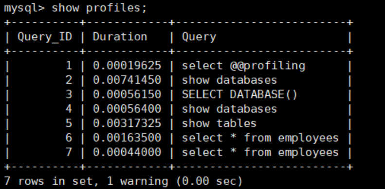
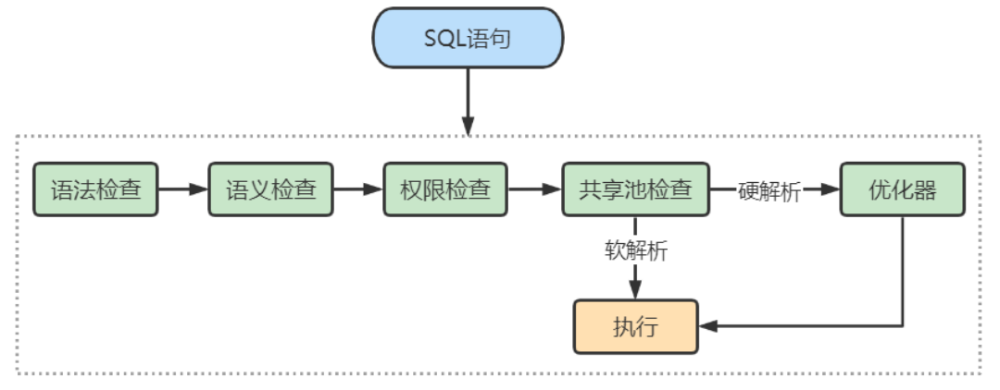
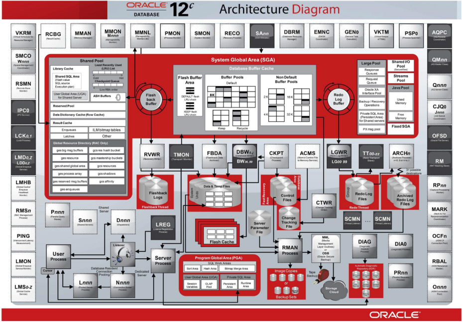
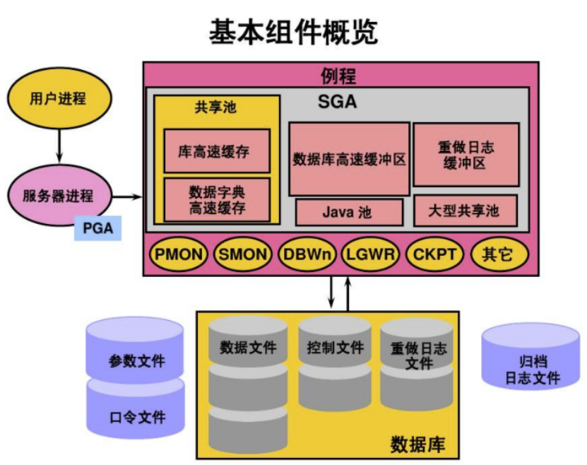

# MySQL中的SQL执行过程？


## MySQL的查询流程

### 1、查询缓存

**1、查询缓存**：Server如果在查询缓存中发现了这条SQL语句，就直接将结果返回给客户端；如果没有，就进入解析器阶段。

```sql
-- query_cache_type -- 通过设置这个变量来开启缓存，1开启 2关闭（默认）

show status like '%Qcache%'; -- 查询缓存命中
```

但是查询缓存的效率往往不高，所以MySQL8.0之后就移除了这个功能。

:::details 大多数情况查询缓存就是个鸡肋，为什么呢？

```sql
SELECT employee_id,last_name FROM employees WHERE employee_id = 101;
```

查询缓存是提前把查询结果缓存起来，这样下次不需要执行就可以直接拿到结果。需要说明的是，在 MySQL 中的查询缓存，不是缓存查询计划，而是查询对应的结果。这就意味着查询匹配的`鲁棒性大大降低`，只有`相同的查询操作才会命中查询缓存`。两个查询请求在任何字符上的不同（例如：空格、注释、大小写），都会导致缓存不会命中。因此 MySQL 的查询缓存命中率不高。

同时，如果查询请求中包含某些系统函数、用户自定义变量和函数、一些系统表，如 mysql、information_schema、performance_schema 数据库中的表，那这个请求就不会被缓存。以某些系统函数举例，可能同样的函数的两次调用会产生不一样的结果，比如函数 `NOW`，每次调用都会产生最新的当前时间，如果在一个查询请求中调用了这个函数，那即使查询请求的文本信息都一样，那不同时间的两次查询也应该得到不同的结果，如果在第一次查询时就缓存了，那第二次查询的时候直接使用第一次查询的结果就是错误的！

此外，既然是缓存，那就有它`缓存失效的时候`。MySQL 的缓存系统会监测涉及到的每张表，只要该表的结构或者数据被修改，如对该表使用了 `INSERT`、`UPDATE`、`DELETE`、`TRUNCATE TABLE`、`ALTER TABLE`、`DROP TABLE` 或 `DROP DATABASE` 语句，那使用该表的所有高速缓存查询都将变为无效并从高速缓存中删除！对于更新压力大的数据库来说，查询缓存的命中率会非常低。

:::

### 2、解析器

**2、解析器**：在解析器中对SQL语句进行语法分析、语义分析。

SQL语句的分析分为**词法分析**与**语法分析**。

分析器首先会做“**词法分析**“，你输入的是由多个字符串和空格组成的一条 SQL 语句，MySQL 需要识别出里面的字符串分别是什么，代表什么。 MySQL 从你输入的"select"这个关键字识别出来，这是一个查询语句。它也要把字符串“T”识别成“表名 T”，把字符串“ID”识别成“列 ID”。

接着做”**语法分析**“。根据词法分析的结果，语法分析器（比如：Bison）会根据语法规则，判断你输入的这个SQL语句是否**满足MySQL语法**。

如果你输入的SQL语句不对，就会收到一个`You have an error in Your SQL syntax`的错误提醒。

如果SQL语句正确，则会生成一个语法树。

### 3、执行器

**3、优化器**：在优化器中会确定SQL语句的执行路径，比如是根据`全表检索`，还是根据`索引检索`等。

经过了解析器，MySQL就知道你要做什么了。在开始执行之前，还要经过优化器的处理。**一条查询可以有很多种执行方式，最后都返回相同的结果。优化器的作用就是找到这其中最好的执行计划。**

比如：优化器是在表里面有多个索引的时候，决定使用哪个索引；或者在一个语句有多表连接（join）的时候，决定各个表的连接顺序，还有表达式简化、子查询转为连接、外连接转为内连接等。

举例：如下语句是执行两个表的join：

```sql
SELECT * FROM test1 JOIN test2 USING (id)
WHERE test1.name = 'zhangwei' AND test2.name = 'mysql高级';
```

- 方案 1：可以先从表 test1 里面取出 name='zhangwei'的记录的 ID 值，再根据 ID 值关联到表 test2，再判断 test2 里面 name的值是否等于 'mysql高级'。
- 方案 2：可以先从表 test2 里面取出 name='mysql高级' 的记录的 ID 值，再根据 ID 值关联到 test1，再判断 test1 里面 name的值是否等于 zhangwei。

这两种执行方法的逻辑结果是一样的，但是执行的效率会有不同，而优化器的作用就是决定选择使用哪一个方案。优化器阶段完成后，这个语句的执行方案就确定下来了，然后进入执行器阶段。


如果你还有一些疑问，比如优化器是怎么选择索引的，有没有可能选择错等。后面讲到索引我们再谈


在查询优化器中，可以分为**逻辑查询**优化阶段和**物理查询**优化阶段。

- 逻辑查询优化就是通过改变SQL语句的内容来使得SQL查询更高效，同时为物理查询优化提供更多的候选执行计划。通常采用的方式是对SQL语句进行`等价变换`，对查询进行`重写`，而查询重写的数据基础就是关系代数。对条件表达式进行等价谓词重写、条件简化，对视图进行重写，对子查询进行优化，对连接语义进行了外连接消除、嵌套连接消除等。
- 物理查询优化是基于关系代数进行的查询重写，而关系代数的每一步都对应物理计算，这些物理计算往往存在多种算法，因此需要计算各种物理路径的代价，从而选择代价最小的作为执行计划。在这个阶段里，对于单表和多表连接的操作，需要高效地`使用索引`，提升查询效率

### 4、执行器

截止到现在，还没有真正的读写真实的表，仅仅只是产出了一个执行计划，于是就进行了**执行器阶段。**

在执行之前需要判断用户是否`具备权限`。如果没有，就会返回权限错误。如果具备，就执行SQL查询并返回结果。

在MySQL8.0以下版本，如果设置了查询缓存，就会将结果进行缓存。

如果有权限，就打开表继续执行。打开表的时候，执行器就会根据表的引擎定义，调用存储引擎`API`对表进行读写。存储引擎`API`只是抽象接口，下面还有个`存储引擎层`，具体实现还是要看表选择的存储引擎。

比如：表test中，ID字段没有索引，那么执行器的执行流程是这样的：

- 1、调用InnoDB引擎接口取这个表的第一行，判断ID值是否为1，提供不是则跳过，如果是则将这行存在结果集中
- 2、调用引擎接口取这个表第二行，重复相同的判断逻辑，直到取到这个表的最后一行

执行器将上述遍历过程中所有满足条件的行组成的记录集作为结果集返回给客户端。


至此，SQL语句就执行完成了。对于有索引的表，执行的逻辑也差不多。

### 总结

SQL语句在MySQL中的执行流程是：`SQL语句 ==> 查询缓存 ==> 解析器 ==> 优化器 ==> 执行器`


## MySQL8中SQL执行原理

前面的结构图很复杂，我们需要抓取最核心的部分：SQL的执行原理。

不同的 DBMS 的 SQL 的执行原理是相通的，只是在不同的软件中，各有各的实现路径。

既然一条 SQL 语句会经历不同的模块，那我们就来看下，在不同的模块中，SQL 执行所使用的资源（时间）是怎样的。

如何在 MySQL 中对一条 SQL 语句的执行时间进行分析。

### 1、确认 profiling 是否开启

了解查询语句底层执行的过程：`select @@profiling;` 或者 `show variables like '%profiling%'` 查看是否开启计划。

开启它可以让 MySQL 收集在 SQL 执行时所使用的资源情况，命令如下：

```sql
mysql> select @@profiling;

mysql> show variables like 'profiling';
```

`profiling=0` 代表关闭，我们需要把 profiling 打开，即设置为 1：

```sql
mysql> set profiling=1;
```

### 2、多次执行相同SQL查询

然后我们执行一个 SQL 查询（说明：你可以执行任何一个 SQL 查询）：

```sql
mysql> select * from employees;
```

### 3、查看profiles

查看当前会话所产生的所有 profiles：

```sql
mysql> show profiles; # 显示最近的几次查询
```



### 4、查看profile

显示执行计划，查看程序的执行步骤：

```sql
mysql> show profile;
```


当然你也可以查询指定的 Query ID，比如：

```sql
mysql> show profile for query 7;
```

查询 SQL 的执行时间结果和上面是一样的。

此外，还可以查询更丰富的内容：

```sql
mysql> show profile cpu,block io for query 6;
```


:::tip

profile 与 profiles 都是MySQL中的提供的性能分析工具

具体查看：[性能分析工具的使用——查看SQL执行成本：SHOW PROFILE](./性能分析工具的使用#show-profile)

:::

## MySQL5.7中SQL执行原理

上述操作在MySQL5.7中测试，发现前后两次相同的sql语句，执行的查询过程仍然是相同的。

那这就很奇怪了，我们都知道，MySQL5.7中有查询缓存，但是为什么没有生效呢？

其实，在MySQL5.7中，查询缓存的默认状态是关闭的。

这里我们需要 `显式开启查询缓存模式`。在MySQL5.7中如下设置：

### 1、配置文件中开启查询缓存

在 /etc/my.cnf 中新增一行：

```sql
query_cache_type=1
```

### 2、重启mysql服务

```shell
systemctl restart mysqld
```

### 3、开启查询执行计划

由于重启过服务，需要重新执行如下指令，开启profiling。

```sql
mysql> set profiling=1;
```

### 4、执行语句两次

```sql
mysql> select * from locations;

mysql> select * from locations;
```

### 5、查看profiles


### 6、查看profile

显示执行计划，查看程序的执行步骤：

```sql
mysql> show profile for query 1;
```


```sql
mysql> show profile for query 2;
```


结论不言而喻。执行编号2时，比执行编号1时少了很多信息，从截图中可以看出查询语句直接从缓存中获取数据。


## 扩展

### Oracle中的SQL执行流程

Oracle 中采用了 `共享池` 来判断 SQL 语句是否存在缓存和执行计划，通过这一步骤我们可以知道应该采用硬解析还是软解析。

我们先来看下 SQL 在 Oracle 中的执行过程：



从上面这张图中可以看出，SQL 语句在 Oracle 中经历了以下的几个步骤。

- **2、语法检查**：检查 SQL 拼写是否正确，如果不正确，Oracle 会报语法错误。
- **2、语义检查**：检查 SQL 中的访问对象是否存在。比如我们在写 SELECT 语句的时候，列名写错了，系统
就会提示错误。语法检查和语义检查的作用是保证 SQL 语句没有错误。
- **3、权限检查**：看用户是否具备访问该数据的权限。
- **4、共享池检查**：共享池（Shared Pool）是一块内存池，**最主要的作用是缓存SQL语句和该语句的执行计
划**。Oracle 通过检查共享池是否存在 SQL 语句的执行计划，来判断进行软解析，还是硬解析。

那软解析和硬解析又该怎么理解呢？

在共享池中，Oracle 首先对 SQL 语句进行 `Hash运算` ，然后根据 Hash值在库缓存（Library Cache）中
查找，如果 `存在 SQL 语句的执行计划` ，就直接拿来执行，直接进入“执行器”的环节，这就是`软解析`。

如果没有找到 SQL 语句和执行计划，Oracle 就需要创建解析树进行解析，生成执行计划，进入“优化器”
这个步骤，这就是`硬解析`。

- **5、优化器**：优化器中就是要进行硬解析，也就是决定怎么做，比如创建解析树，生成执行计划。
- **6、执行器**：当有了解析树和执行计划之后，就知道了 SQL 该怎么被执行，这样就可以在执行器中执行语句了。

共享池是 Oracle 中的术语，包括了库缓存，数据字典缓冲区等。我们上面已经提到了库缓存区，它主要缓存 SQL 语句和执行计划。而 `数据字典缓冲区` 存储的是 Oracle 中的对象定义，比如表、视图、索引等对象。当对 SQL 语句进行解析的时候，如果需要相关的数据，会从数据字典缓冲区中提取。

`库缓存` 这一个步骤，决定了 SQL 语句是否需要进行硬解析。为了提升 SQL 的执行效率，我们应该尽量避免硬解析，因为在 SQL 的执行过程中，创建解析树，生成执行计划是很消耗资源的。

你可能会问，如何避免硬解析，尽量使用软解析呢？在 Oracle 中，`绑定变量`是它的一大特色。绑定变量就是在 SQL 语句中使用变量，通过不同的变量取值来改变 SQL 的执行结果。这样做的好处是能 `提升软解析的可能性`，不足之处在于可能会导致生成的执行计划不够优化，因此是否需要绑定变量还需要视情况
而定。

:::tip
共享池检查就类似于MySQL中的查询缓存
:::

举个例子，我们可以使用下面的查询语句：

```sql
SQL> select * from player where player_id = 10001;
```

你也可以使用绑定变量，如：

```sql
SQL> select * from player where player_id = :player_id;
```

这两个查询语句的效率在 Oracle 中是完全不同的。如果你在查询 player_id = 10001 之后，还会查询10002、10003 之类的数据，那么每一次查询都会创建一个新的查询解析。而第二种方式使用了绑定变量，那么在第一次查询之后，在共享池中就会存在这类查询的执行计划，也就是软解析。

因此，**我们可以通过使用绑定变量来减少硬解析，减少 Oracle 的解析工作量**。但是这种方式也有缺点，使用动态 SQL 的方式，因为参数不同，会导致 SQL 的执行效率不同，同时 SQL 优化也会比较困难。

#### Oracle的架构图



简图：



#### 小结

Oracle 和 MySQL 在进行 SQL 的查询上面有软件实现层面的差异。Oracle 提出了共享池的概念，通过共享池来判断是进行软解析，还是硬解析。
