# MySQL事务日志

事务有4种特性：原子性、一致性、隔离性和持久性。那么事务的四种特性到底是基于什么机制实现呢？

- 事务的隔离性由`锁机制`实现。
- 而事务的原子性、一致性和持久性由事务的 redo 日志和undo 日志来保证。
  - REDO LOG 称为`重做日志`，提供再写入操作，恢复提交事务修改的页操作，用来保证事务的持久性。
  - UNDO LOG 称为`回滚日志`，回滚行记录到某个特定版本，用来保证事务的原子性、一致性。

有的 DBA 或许会认为 UNDO 是 REDO 的逆过程，其实不然。REDO 和 UNDO 都可以视为是一种`恢复操作`，但是：

- redo log：是存储引擎层 (innodb) 生成的日志，记录的是 `物理级别` 上的页修改操作，比如页号 xxx、偏移量 yyy 写入了 'zzz' 数据。主要为了保证数据的可靠性；
- undo log：是存储引擎层 (innodb) 生成的日志，记录的是`逻辑操作`日志，比如对某一行数据进行了 INSERT 语句操作，那么 undo log 就记录一条与之相反的 DELETE 操作。主要用于`事务的回滚`(undo log 记录的是每个修改操作的`逆操作`) 和`一致性非锁定读`(undo log 回滚行记录到某种特定的版本 ---**MVCC**，即多版本并发控制)。

## redo日志

InnoDB 存储引擎是以`页为单位`来管理存储空间的。在真正访问页面之前，需要把在`磁盘`上的页缓存到内存中的`Buffer Pool`之后才可以访问。所有的变更都必须`先更新缓冲池`中的数据，然后缓冲池中的`脏页`会以一定的频率被刷入磁盘（`checkPoint 机制`），通过缓冲池来优化 CPU 和磁盘之间的鸿沟，这样就可以保证整体的性能不会下降太快。

### 为什么需要redo日志

一方面，缓冲池可以帮助我们消除CPU和磁盘之间的鸿沟，checkpoint机制可以保证数据的最终落盘，然而由于checkpoint`并不是每次变更的时候就触发`的，而是master线程隔一段时间去处理的。所以最坏的情况就是事务提交后，刚写完缓冲池，数据库宕机了，那么这段数据就是丢失的，无法恢复。

另一方面，事务包含`持久性`的特性，就是说对于一个已经提交的事务，在事务提交后即使系统发生了崩溃，这个事务对数据库中所做的更改也不能丢失。

**那么如何保证这个持久性呢？**

`一个简单的做法`：在事务提交完成之前把该事务所修改的所有页面都刷新到磁盘，但是这个简单粗暴的做法有些问题

- **修改量与刷新磁盘工作量严重不成比例**
  - 有时候我们仅仅修改了某个页面中的一个字节，但是我们知道在 InnoDB 中是以页为单位来进行磁盘 IO 的，也就是说我们在该事务提交时不得不将一个完整的页面从内存中刷新到磁盘，我们又知道一个页面默认是 16KB 大小，只修改一个字节就要刷新 16KB 的数据到磁盘上显然是太小题大做了。
  - 比如：我们只是想修改某一个员工的薪资，却要修改一个数据页
- **随机 IO 刷新较慢**
  - 一个事务可能包含很多语句，即使是一条语句也可能修改许多页面，假如该事务修改的这些页面可能并不相邻，这就意味着在将某个事务修改的 Buffer Pool 中的页面**刷新到磁盘**时，需要进行很多的**随机 IO**，随机 IO 比顺序 IO 要慢，尤其对于传统的机械硬盘来说。 
  - 比如：我们想修改某一批员工的薪资，员工信息可能保存在若干个数据页中，就要去修改多个数据页

`另一个解决的思路`：我们只是想让已经提交了的事务对数据库中数据所做的修改永久生效，即使后来系统崩溃，在重启后也能把这种修改恢复出来。所以我们其实没有必要在每次事务提交时就把该事务在内存中修改过的全部页面刷新到磁盘，只需要把`修改`了哪些东西`记录一下`就好。比如，某个事务将系统表空间中`第10号`页面中偏移量为`100`处的那个字节的值`1`改成`2`。我们只需要记录一下：将第0号表空间的10号页面的偏移量为100处的值更新为 2 。

InnoDB 引擎的事务采用了 WAL 技术（`Write-Ahead Logging`），这种技术的思想就是`先写日志`，再写磁盘，只有日志写入成功，才算事务提交成功，这里的日志就是 redo log。当发生宕机且数据未刷到磁盘的时候，可以通过 redo log 来恢复，保证 ACID 中的 D，这就是 redo log 的作用。

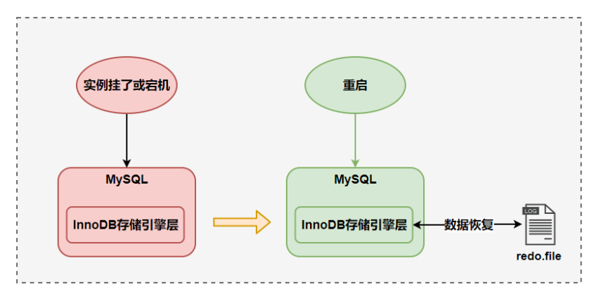


### redo日志的好处、特点

**好处**

- **redo日志降低了刷盘频率**
- **redo日志占用的空间非常小**

存储表空间 ID、页号、偏移量以及需要更新的值，所需的存储空间是很小的，刷盘快。

**特点**

- **redo日志是顺序写入磁盘的**

在执行事务的过程中，每执行一条语句，就可能产生若干条 redo 日志，这些日志是按照`产生的顺序写入磁盘的`，也就是使用顺序 IO，效率比随机 IO 快。

- **事务执行过程中，redo log不断记录**

>   这里先简单说一下redo log 与 bin log 的区别：
>
>   - redo log 是`存储引擎层`产生的，而 bin log 是`数据库层`产生的。
>   - 假设一个事务，对表做 10 万行的记录插入，在这个过程中，一直不断的往 redo log 顺序记录，而 bin log 不会记录，直到这个事务提交，才会一次写入到 bin log 文件中。


### redo的组成

Redo log可以简单分为以下两个部分：

- `重做日志的缓冲 (redo log buffer) `，保存在内存中，是易失的。

在服务器启动时就向操作系统申请了一大片称之为 redo log buffer 的`连续内存`空间，翻译成中文就是 redo 日志缓冲区。这片内存空间被划分成若干个连续的`redo log block`。一个 redo log block 占用`512 字节`大小。


**参数设置：innodb_log_buffer_size：**

redo log buffer 大小，默认`16M`，最大值是4096M，最小值为1M。

```sql
mysql> show variables like '%innodb_log_buffer_size%';
+------------------------+----------+
| Variable_name          | Value    |
+------------------------+----------+
| innodb_log_buffer_size | 16777216 |
+------------------------+----------+
```

- `重做日志文件 (redo log file)`，保存在硬盘中，是持久的。

redo日志文件默认存储在MySQL的数据目录（`/var/lib/mysql/`）中，其中的 `ib_logfile0` 和 `ib_logfile1` 即为 REDO 日志。


### redo的整体流程

以一个更新的事务为例，redo log流转过程，如下图所示：


第1步：先将原始数据从磁盘中读入内存中来，修改数据的内存拷贝 

第2步：生成一条重做日志并写入redo log buffer，记录的是数据被修改后的值 

第3步：当事务commit时，将redo log buffer中的内容刷新到 redo log file，对 redo log file采用追加写的方式 

第4步：定期将内存中修改的数据刷新到磁盘中

> 体会：
>
> Write-Ahead Log(预先日志持久化)：在持久化一个数据页之前，先将内存中相应的日志页持久化。


了解了redo的整体流程之后，我们特别关系`redo log buffer -> redo log file`的数据流转过程，只是数据真正刷盘，才能保证数据不丢。下面就来看一下redo log buffer的刷盘过程

### redo log的刷盘策略

redo log的写入并不是直接写入磁盘的，InnoDB引擎会在写redo log的时候先写redo log buffer，之后以`一定的频率`刷入到真正的 redo log file 中。

那么**这里的一定频率怎么看待呢？**这就是我们要说的刷盘策略。

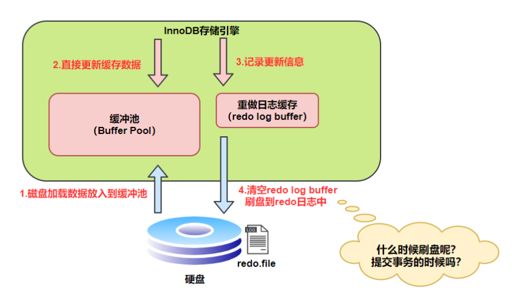

特别注意！！！redo log buffer刷盘到redo log file的过程并不是真正的刷到磁盘中去，只是刷入到`文件系统缓存`（page cache）中去（这是现代操作系统为了提高文件写入效率做的一个优化），真正的写入会交给系统自己来决定（比如page cache足够大了）。

那么对于InnoDB来说就存在一个问题，如果交给系统来同步，同样如果系统宕机，那么数据也丢失了（虽然整个系统宕机的概率还是比较小的）。

针对这种情况，InnoDB给出`innodb_flush_log_at_trx_commit`参数，该参数控制 commit提交事务时，如何将 redo log buffer 中的日志刷新到 redo log file 中。它支持三种策略：

- `设置为0`：表示每次事务提交时不进行刷盘操作。（系统默认master thread每隔1s进行一次重做日志的同步）
- `设置为1`：表示每次事务提交时都将进行同步，刷盘操作（`默认值`） 
- `设置为2`：表示每次事务提交时都只把 redo log buffer 内容写入 page cache，不进行同步。由os自己决定什么时候同步到磁盘文件。

```sql
mysql> show variables like 'innodb_flush_log_at_trx_commit';
+--------------------------------+-------+
| Variable_name                  | Value |
+--------------------------------+-------+
| innodb_flush_log_at_trx_commit | 1     |
+--------------------------------+-------+
```

另外，InnoDB 存储引擎有一个后台线程，每隔 `1 秒`，就会把 `redo log buffer` 中的内容写到文件系统缓存（`page cache`），然后调用刷盘操作。如下：

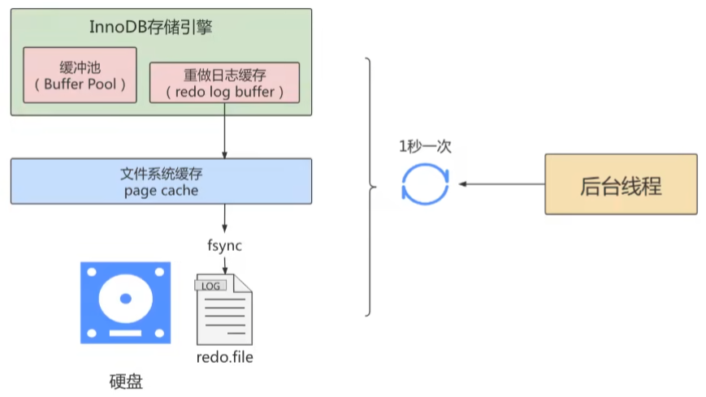

也就是说，一个没有提交的事务的`redo log`记录，也可能会刷盘。因为在事务执行过程中，redo log记录是会写入到`redo log buffer`中的，这些redo log记录会被`后台线程`刷盘。

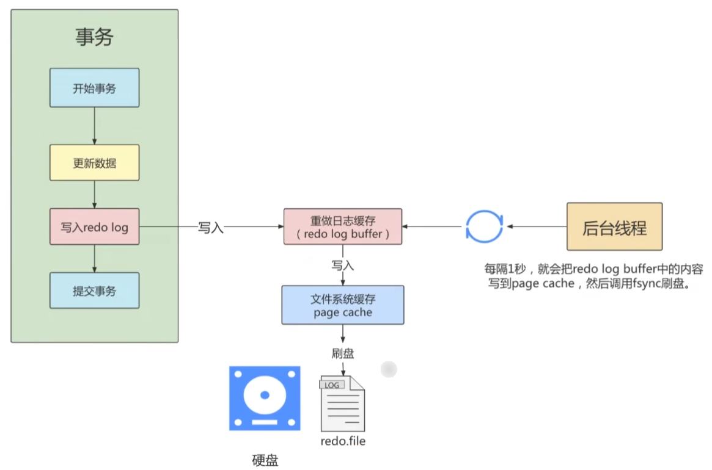

除了后台线程每秒 `1 次` 的轮询操作，还有一种情况，当 `redo log buffer` 占用的空间即将达到 `innodb_log_buffer_size`（这个参数默认是 16M）的一半的时候，后台线程会主动刷盘。


### 不同刷盘策略演示

#### **流程图**

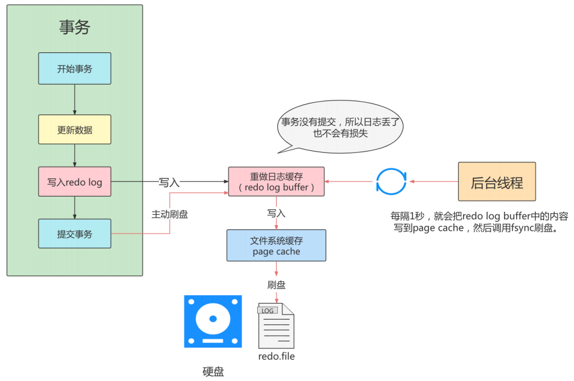

`innodb_flush_log_at_trx_commit=1`

- 为 1 时，只要事务提交成功，redo log 记录就一定在硬盘里，不会有任何数据丢失。
- 如果事务执行期间 MySQL 挂了或宕机，这部分日志丢了，但是事务并没有提交，所以日志丢了也不会有损失。可以保证 ACID 的 D，数据绝对不会丢失，但是效率最差的。
- 建议使用默认值，虽然操作系统宕机的概率理论小于数据库宕机的概率，但是一般既然使用了事务，那么数据的安全相对来说更重要些。

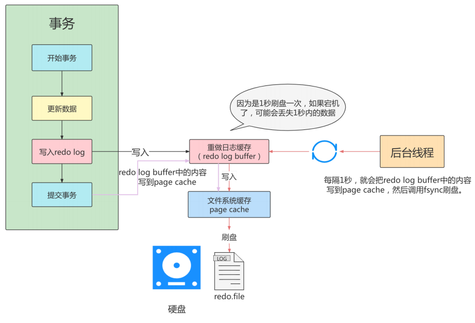

`innodb_flush_log_at_trx_commit=2`

- 为 2 时，只要事务提交成功，redo log buffer 中的内容只写入文件系统缓存（page cache）。
- 如果仅仅只是 MySQL 挂了不会有任何数据丢失，但是操作系统宕机可能会有 1 秒数据的丢失，这种情况下无法满足 ACID 中的 D。但是数值 2 肯定是效率最高的。

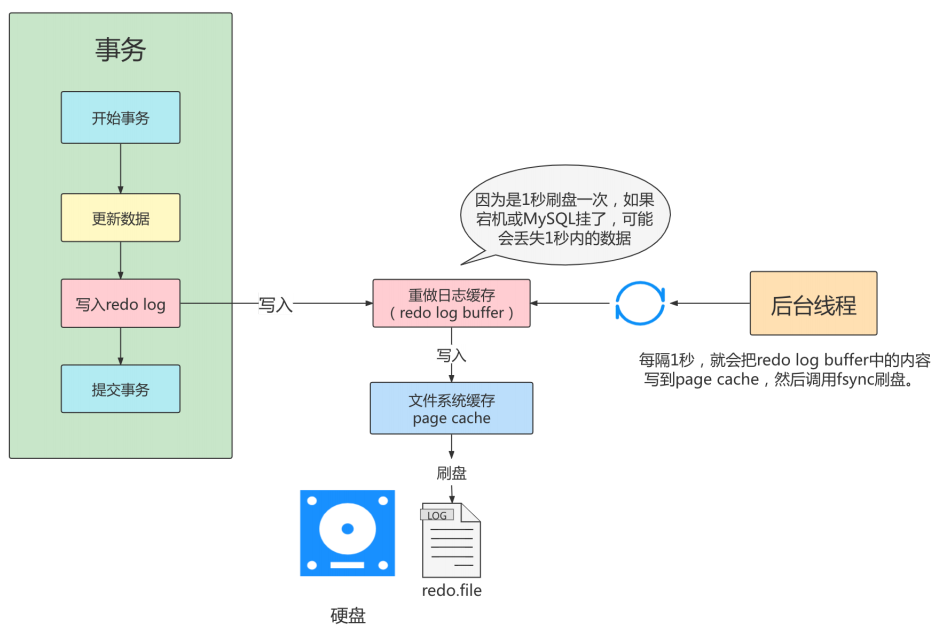

`innodb_flush_log_at_trx_commit=0`

- 为 0 时，master thread 中每 1 秒进行一次重做日志的 fsync 操作，因此实例 crash 最多丢失 1 秒钟内的事务。（master thread 是负责将缓冲池中的数据异步刷新到磁盘，保证数据的一致性）
- 数值 0 的话，是一种折中的做法，它的 IO 效率理论是高于 1 的，低于 2 的，这种策略也有丢失数据的风险，也无法保证 D。

#### 举例

比较 `innodb_flush_log_at_trx_commit` 设置不同值对事务的影响。

1、创建表

```sql
CREATE TABLE test_load(a INT,b CHAR(80))ENGINE=INNODB;
```

2、创建存储过程，用于向 test_load 中添加数据

```sql
DELIMITER //
CREATE PROCEDURE p_load(COUNT INT UNSIGNED)
BEGIN
    DECLARE s INT UNSIGNED DEFAULT 1;
    DECLARE c CHAR(80) DEFAULT REPEAT('a',80);
    WHILE s<=COUNT DO
    INSERT INTO test_load SELECT NULL,c;
    COMMIT;
    SET s=s+1;
    END WHILE;
END
//DELIMITER;
```

存储过程代码中，每插入一条数据就进行一次显式的 COMMIT 操作。

在默认的设置下，即参数 `innodb_flush_log_at_trx_commit` 为 1 的情况下，InnoDB 存储引擎会将重做日志缓冲中的日志写入文件，并调用一次 fsync 操作。

执行命令 CALL p_load（30000），向表中插入 3 万行的记录，并执行 3 万次的 fsync 操作。在默认情况下所需的时间：

```sql
mysql>CALL p_load(30000);
Query OK,0 rows affected(1 min 23 sec)
```

`1 min 23 sec`的时间显然是不能接受的。而造成时间比较长的原因就在于 fsync 操作所需的时间。

下面修改参数 `innodb_flush_log_at_trx_commit`，分别设置为 0、2：

```sql
TRUNCATE TABLE test_load

-- 设置并查看：innodb_flush_log_at_trx_commit
set GLOBAL innodb_flush_log_at_trx_commit = 1;

SHOW VARIABLES LIKE 'innodb_flush_log_at_trx_commit';


-- 调用存储过程
CALL p_load (30000);  
```

最终执行时间如下表格：

| innodb_flush_log_at_trx_commit | 执行所用的时间 |
| ------------------------------ | -------------- |
| 0                              | 38.709 秒      |
| 1                              | 1 分 23 秒     |
| 2                              | 46.016 秒      |

而针对上述存储过程，为了提高事务的提交性能，应该在将 3 万行记录插入表后进行一次的 COMMIT 操作，而不是每插入一条记录后进行一次 COMMIT 操作。这样做的好处是可以使事务方法在 rollback 时回滚到事务最开始的确定状态。

> 需要说明的是，虽然用户可以通过设置参数 innodb_flush_log_at_trx_commit 为 0 或 2 来提高事务提交的性能，但需清楚，这种设置方法丧失了事务的 ACID 特性。


### 写入redo log buffer过程

#### 补充概念：Mini-Transaction

MySQL 把对底层页面中的一次原子访问的过程称之为一个 `Mini-Transaction`，简称 `mtr`，比如，向某个索引对应的 B+树中插入一条记录的过程就是一个 `Mini-Transaction`。一个所谓的 mtr 可以包含一组 redo 日志，在进行崩溃恢复时这一组 redo 日志作为一个不可分割的整体。

> 因为插入一条记录，可能会涉及到页分裂，所以一个 mtr 可以包含多个 redo 日志。也就是一组 redo 日志

一个事务可以包含若干条语句，每一条语句其实是由若干个`mtr`组成，每一个`mtr`又可以包含若干条redo日志，画个图表示它们的关系就是这样：

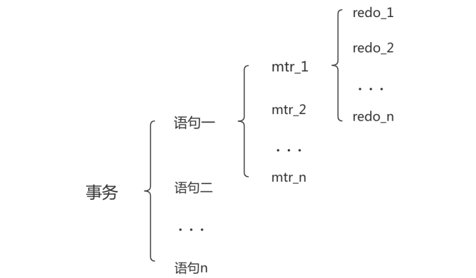

#### 日志写入log buffer

向 `log buffer` 中写入 redo 日志的过程是顺序的，也就是先往前边的 block 中写，当该 block 的空闲空间用完之后再往下一个 block 中写。当我们想往 log buffer 中写入 redo 日志时，第一个遇到的问题就是应该写在哪个 `block` 的哪个偏移量处，所以 InnoDB 的设计者特意提供了一个称之为 `buf_free` 的全局变量，该变量指明后续写入的 redo 日志应该写入到 log buffer 中的哪个位置，如图所示：


一个 mtr 执行过程中可能产生若干条 redo 日志，`这些 redo 日志是一个不可分割的组`，所以其实并不是每生成一条 redo 日志，就将其插入到 log buffer 中，而是每个 mtr 运行过程中产生的日志先暂时存到一个地方，当该 mtr 结束的时候，将过程中产生的一组 redo 日志再全部复制到 log buffer 中。我们现在假设有两个名为 `T1`、`T2` 的事务，每个事务都包含 2 个 mtr，我们给这几个 mtr 命名一下：

- 事务 `T1` 的两个 `mtr` 分别称为 `mtr_T1_1` 和 `mtr_T1_2`。
- 事务 `T2` 的两个 `mtr` 分别称为 `mtr_T2_1` 和 `mtr_T2_2`。

每个 mtr 都会产生一组 redo 日志，用示意图来描述一下这些 mtr 产生的日志情况：

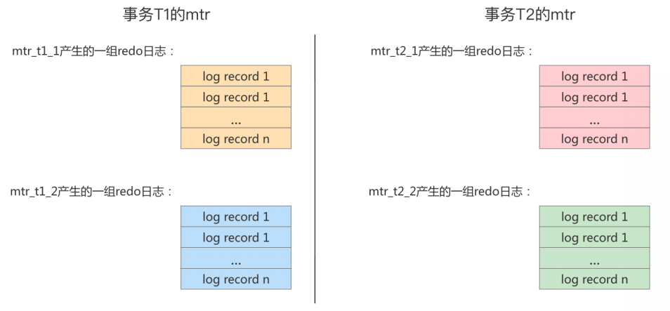

不同的事务可能是`并发`执行的，所以`事务T1`、`事务T2`之间的`mtr`可能是`交替执行`的。

每当一个 mtr 执行完成时，伴随该 mtr 生成的一组 redo 日志就需要被复制到 log buffer 中，也就是说不同事务的 mtr 可能是交替写入 log buffer 的，我们画个示意图（为了美观，我们把一个 mtr 中产生的所有的 redo 日志当作一个整体来画）：

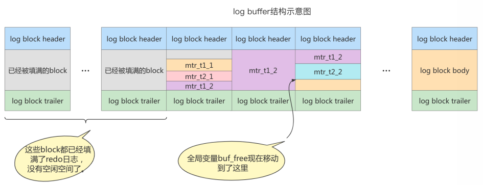

有的 mtr 产生的 redo 日志量非常大，比如 mtr_t1_2 产生的 redo 日志占用空间比较大，占用了 3 个 block 来存储。

#### redo log block的结构图

一个 redo log block 是由`日志头`、`日志体`、`日志尾`组成。日志头占用 12 字节，日志尾占用 8 字节，所以一个 block 真正能存储的数据就是 512-12-8=492 字节。

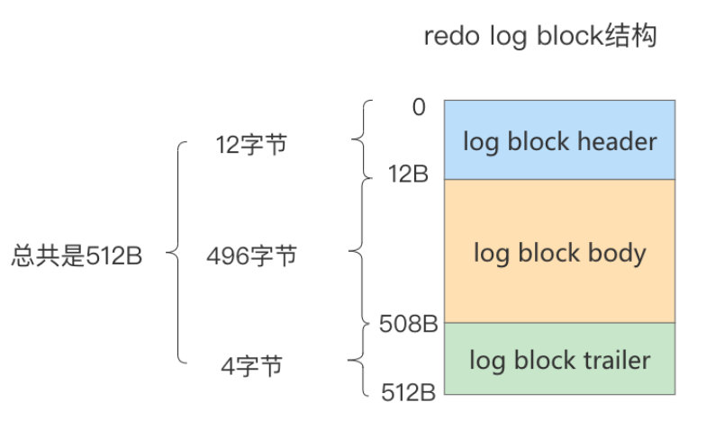

:::tip

**为什么一个 block 设计成 512 字节？**

这个和磁盘的扇区有关，机械磁盘默认的扇区就是 512 字节，如果你要写入的数据大于 512 字节，那么要写入的扇区肯定不止一个，这时就要涉及到盘片的转动，找到下一个扇区。

假设现在需要写入两个扇区 A 和 B，如果扇区 A 写入成功，而扇区 B 写入失败，那么就会出现`非原子性`的写入，而如果每次只写入和扇区的大小一样的 512 字节，那么每次的写入都是原子性的。

:::

真正的 redo 日志都是存储到占用 `496` 字节大小的 `log block body` 中，图中的 `log block header`和 `log block trailer` 存储的是一些管理信息。我们来看看这些所谓的`管理信息`都有什么。如下图：

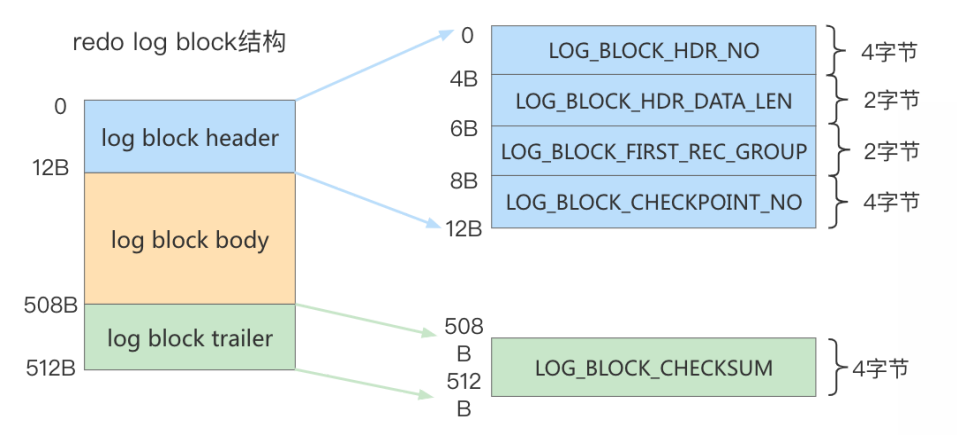

`log block header` 中的属性如下：

- `LOG_BLOCK_HDR_NO`：log buffer 是由 log block 组成，在内部 log buffer 就好似一个数组，因此 LOG_BLOCK_HDR_NO 用来标记这个数组中的位置。其是递增并且循环使用的，占用 4 个字节，但是由于第一位用来判断是否是 flush bit，所以最大的值为 2G。
- `LOG_BLOCK_HDR_DATA_LEN`：表示 block 中已经使用了多少字节，初始值为 12（因为 `log block body` 从第 12 个字节处开始）。随着往 block 中写入的 redo 日志越来越多，本属性值也跟着增长。如果 `log block body` 已经被全部写满，那么本属性的值被设置为 512。
- `LOG_BLOCK_FIRST_REC_GROUP`：一条 redo 日志也可以称之为一条 redo 日志记录（redo log record），一个 mtr 会生产多条 redo 日志记录，这些 redo 日志记录被称之为一个 redo 日志记录组（redo log record group）。LOG_BLOCK_FIRST_REC_GROUP 就代表该 block 中第一个 mtr 生成的 redo 日志记录组的偏移量（其实也就是这个 block 里第一个 mtr 生成的第一条 redo 日志的偏移量）。如果该值的大小和 LOG_BLOCK_HDR_DATA_LEN 相同，则表示当前 log block 不包含新的日志。
- `LOG_BLOCK_CHECKPOINT_NO`：占用 4 字节，表示该 log block 最后被写入时的 `checkpoint`。

`log block trailer`中的属性如下：

- `LOG_BLOCK_CHECKSUM`：表示 block 的校验值，用于正确性校验（其值和 LOG_BLOCK_HDR_NO 相同）

### redo log file

#### 相关参数设置

- `innodb_log_group_home_dir`：指定 redo log 文件组所在的路径，默认值为`./`，表示在数据库的数据目录下。MySQL的默认数据目录（`var/lib/mysql`）下默认有两个名为`ib_logfile0`和`ib_logfile1`的文件，**log buffer中的日志默认情况下就是刷新到这两个磁盘文件中**。此redo日志文件位置还可以修改。

- `innodb_log_files_in_group`：指明redo log file的个数，命名方式如：ib_logfile0，ib_logfile1... ib_logfilen。默认2个，最大100个。

```sql
mysql> show variables like 'innodb_log_files_in_group';
+---------------------------+-------+
| Variable_name             | Value |
+---------------------------+-------+
| innodb_log_files_in_group | 2     |
+---------------------------+-------+


#ib_logfile0
#ib_logfile1
```

- `innodb_flush_log_at_trx_commit`：控制 redo log 刷新到磁盘的策略，默认为`1`。 
- `innodb_log_file_size`：单个 redo log 文件设置大小，默认值为 `48M` 。最大值为512G，注意最大值指的是整个 redo log 系列文件之和，即（innodb_log_files_in_group * innodb_log_file_size ）不能大于最大值512G。

```sql
mysql> show variables like 'innodb_log_file_size';
+----------------------+-----------+
| Variable_name        | Value     |
+----------------------+-----------+
| innodb_log_file_size | 50331648  |
+----------------------+-----------+
```

我们可以根据业务修改其大小，以便容纳较大的事务。编辑 my.cnf 文件并重启数据库生效，如下所示：

```shell
# my.cnf

innodb_log_file_size=200M
```

> 在数据库实例更新比较频繁的情况下，我们可以适当加大redo log **组数** 和 **大小**。但也不推荐 redo log设置过大，在MySQL崩溃恢复时会重新执行redo log中的记录。

#### 日志文件组

从上边的描述中可以看到，磁盘上的 `redo` 日志文件不只一个，而是以一个`日志文件组`的形式出现的。这些文件以 `ib_logfile [数字]`（数字可以是 `0`、`1`、`2`…）的形式进行命名，每个的 redo 日志文件大小都是一样的。

在将 redo 日志写入日志文件组时，是从 `ib_logfile0` 开始写，如果 `ib_logfile0` 写满了，就接着 `ib_logfile1` 写。同理，`ib_logfile1` 写满了就去写 `ib_logfile2`，依此类推。如果写到最后一个文件该咋办？那就重新转到 `ib_logfile0` 继续写，所以整个过程如下图所示：


总共的 redo 日志文件大小其实就是：`innodb_log_file_size × innodb_log_files_in_group`。

采用循环使用的方式向 redo 日志文件组里写数据的话，会导致后写入的 redo 日志覆盖掉前边写的 redo 日志？当然！所以 InnoDB 的设计者提出了 **checkpoint** 的概念。

### checkpoint

在整个日志文件组中还有两个重要的属性，分别是 **write pos**、**checkpoint**

- `write pos` 是当前记录的位置，一边写一边后移
- `checkpoint` 是当前要擦除的位置，也是往后推移

每次刷盘 redo log 记录到日志文件组中，write pos 位置就会后移更新。每次 MySQL 加载日志文件组恢复数据时，会清空加载过的 redo log 记录，并把 checkpoint 后移更新。write pos 和 checkpoint 之间的还空着的部分可以用来写入新的 redo log 记录。

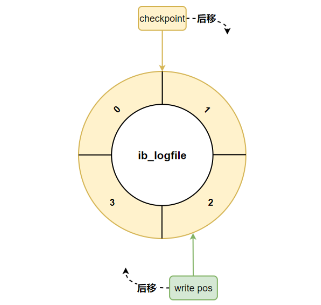

如果 write pos 追上 checkpoint，表示**日志文件组**满了，这时候不能再写入新的 redo log 记录，MySQL 得停下来，清空一些记录，把 checkpoint 推进一下。

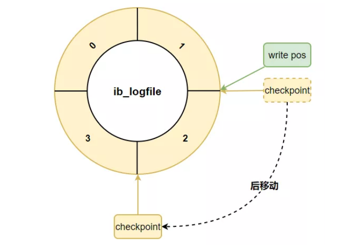

### redo log小结

相信大家都知道 redo log 的作用和它的刷盘时机、存储形式：

**InnoDB 的更新操作采用的是 Write Ahead Log (预先日志持久化) 策略，即先写日志，再写入磁盘。**


