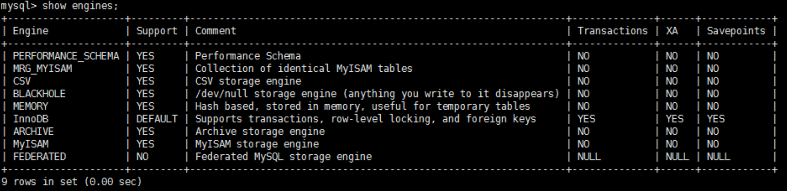
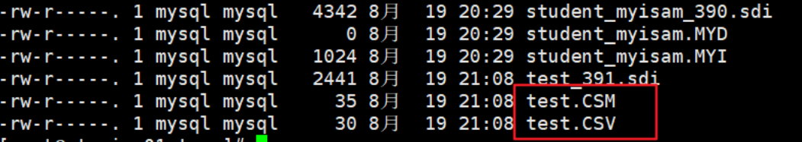

# MySQL存储引擎

为了管理方便，人们把`连接管理`、`查询缓存`、`语法解析`、`查询优化`这些并不涉及真实数据存储的功能划分为 `MySQL server` 的功能，把真实存取数据的功能划分为`存储引擎`的功能。所以在 `MySQL server` 完成了查询优化后，只需按照生成的`执行计划`调用底层存储引擎提供的 API，获取到数据后返回给客户端就好了。

MySQL 中提到了存储引擎的概念。简而言之，`存储引擎就是指表的类型`。

其实存储引擎以前叫做`表处理器`，后来改名为`存储引擎`，它的功能就是接收上层传下来的指令，然后对表中的数据进行提取或写入操作。

## 查看存储引擎

```sql
show engines;
# 或
show engines\G
```



## 设置系统默认的存储引擎

- 查看默认的存储引擎：

```sql
show variables like '%storage_engine%'; 
#或
SELECT @@default_storage_engine;
```

- 修改默认的存储引擎

如果在创建表的语句中没有显式指定表的存储引擎的话，那就会默认使用`InnoDB`作为表的存储引擎。

```sql
SET DEFAULT_STORAGE_ENGINE=MyISAM;
```

或者修改`my.cnf`文件：

```ini
default-storage-engine=MyISAM 
```

```shell
# 重启服务 
systemctl restart mysqld.service
```

## 设置表的存储引擎

存储引擎是负责对表中的数据进行提取和写入工作的，我们可以为`不同的表设置不同的存储引擎`，也就是说不同的表可以有不同的物理存储结构，不同的提取和写入方式。

### 创建表时指定存储引擎

```sql
CREATE TABLE 表名(
    建表语句; 
) ENGINE = 存储引擎名称;
```

### 修改表的存储引擎

```sql
ALTER TABLE 表名 ENGINE = 存储引擎名称;
```

## 引擎介绍

### InnoDB引擎：具备外键支持功能的事务存储引擎

- MySQL从3.23.34a开始就包含InnoDB存储引擎。`>=5.5之后，默认采用InnoDB引擎`。
- InnoDB是MySQL的`默认事务型引擎`，它被设计用来处理大量的短期(short-lived)事务。可以确保事务的完整提交(Commit)和回滚(Rollback)。
- 除了增加和查询外，还需要更新、删除操作，那么，应优先选择InnoDB存储引擎。
- **除非有非常特别的原因需要使用其他的 存储引擎，否则应该优先考虑InnoDB引擎。**
- 数据文件结构：
  - `表名.frm` 存储表结构（MySQL8.0时，合并在表名.ibd中）
  - `表名.ibd` 存储数据和索引
- InnoDB是`为处理巨大数据量的最大性能设计`。
  - 在以前的版本中，字典数据以元数据文件、非事务表等来存储。现在这些元数据文件被删除了。比如：`.frm`，`.par`，`.trn`，`.isl`，`.db.opt`等都在MySQL8.0中不存在了。

缺点：

- 对比MyISAM的存储引擎，`InnoDB写的处理效率差一些`，并且会占用更多的磁盘空间以保存数据和索引。
- MyISAM只缓存索引，不缓存真实数据；InnoDB不仅缓存索引还要缓存真实数据，`对内存要求较高`，而且内存大小对性能有决定性的影响。

:::details 对内存要求较高的原因

在InnoDB引擎中，数据和索引是存放在一起的，也就是我们常说的“索引即数据”

加载索引到内存中的时候，数据也会被加载到内存中，所以InnoDB对内存的要求较高。

而MyISAM引擎中，索引和数据是分开的，索引只缓存索引，不缓存真实数据。所以对内存的要求较低。

:::

### MyISAM引擎：主要的非事务处理存储引擎

- `5.5之前默认的存储引擎`
- MyISAM提供了大量的特性，包括全文索引、压缩、空间函数(GIS)等，但MyISAM`不支持事务、行级锁、外键`，有一个毫无疑问的缺陷就是`崩溃后无法安全恢复`。  
- 优势是访问的`速度快`，对事务完整性没有要求或者以SELECT、INSERT为主的应用
- 针对数据统计有额外的常数存储。故而 `count(*)` 的查询效率很高
- 数据文件结构：
  - 表名.frm 存储表结构
  - 表名.MYD 存储数据 (MYData)
  - 表名.MYI 存储索引 (MYIndex)
- 应用场景：只读应用或者以读为主的业务

### Archive引擎：用于数据存档

- `archive` 是`归档`的意思，仅仅支持`插入`和`查询`两种功能（行被插入后不能再修改）。
- 在 MySQL5.5 以后`支持索引`功能。
- 拥有很好的压缩机制，使用 `zlib压缩库`，在记录请求的时候实时的进行压缩，经常被用来作为仓库使用。
- 创建 ARCHIVE 表时，存储引擎会创建名称以表名开头的文件。数据文件的扩展名为 `.ARZ`。
根据英文的测试结论来看，同样数据量下，`Archive表比MyISAM表要小大约 75%，比支持事务处理的InnoDB表小大约 83%`。
- ARCHIVE 存储引擎采用了`行级锁`。该 ARCHIVE 引擎支持 `AUTO_INCREMENT` 列属性。AUTO_INCREMENT列可以具有唯一索引或非唯一索引。尝试在任何其他列上创建索引会导致错误。
- Archive 表`适合日志和数据采集（档案）`类应用；**适合存储大量的独立的作为历史记录的数据**。拥有`很高的插入速度`，但是对查询的支持较差。

下表展示了Archive 存储引擎的功能：

| 特征 | 支持 |
| :---- | :---- |
| B树索引 |  不支持 |
| `备份/时间点恢复`（在服务器中实现，而不是在存储引擎中）| 支持 |
| 集群数据库支持 | 不支持 |
| 聚集索引 | 不支持 |
| `压缩数据` | 支持 |
| 数据缓存 | 不支持 |
| 加密数据（加密功能在服务器中实现） | 支持 |
| 外键支持 |  不支持|
| 全文检索索引 | 不支持 |
| 地理空间数据类型支持 | 支持 |
| 地理空间索引支持 | 不支持 |
| 哈希索引 |  不支持 |
| 索引缓存 |  不支持 |
| `锁粒度`  | 行锁 |
| MVCC | 不支持 |
| 存储限制 | 没有任何限制 |
| 交易 | 不支持 |
| `更新数据字典的统计信息` | 支持 |

### Blackhole引擎：丢弃写操作，读操作会返回空内容*

- Blackhole 引擎没有实现任何存储机制，它会`丢弃所有插入的数据`，不做任何保存。
- 但服务器会记录 Blackhole 表的日志，所以可以用于复制数据到备库，或者简单地记录到日志。但这种应用方式会碰到很多问题，因此并不推荐。

### CSV引擎：存储数据时，以逗号分隔各个数据项

- CSV引擎可以将`普通的CSV文件作为 MySQL 的表来处理`，但不支持索引。
- CSV引擎可以作为一种`数据交换的机制`，非常有用。（在开发中，常见的数据交换格式有：JSON、XML）
- CSV存储的数据直接可以在操作系统里，用文本编辑器，或者 excel 读取。
- 对于数据的快速导入、导出是有明显优势的。

创建 CSV 表时，服务器会创建一个纯文本数据文件，其名称以表名开头并带有 `.CSV` 扩展名。当你将数据存储到表

:::warning 注意
使用CSV引擎时，建表的时候，每个字段必须不能为空（需要指定`NOT NULL`）
:::

使用案例如下

```sql
mysql> CREATE TABLE test (i INT NOT NULL, c CHAR(10) NOT NULL) ENGINE = CSV;
Query OK, 0 rows affected (0.06 sec)

mysql> INSERT INTO test VALUES(1,'record one'),(2,'record two');
Query OK, 2 rows affected (0.05 sec)
Records: 2 Duplicates: 0 Warnings: 0

mysql> SELECT * FROM test;
+---+------------+
| i | c |
+---+------------+
| 1 | record one |
| 2 | record two |
+---+------------+
2 rows in set (0.00 sec)
```

创建CSV表还会创建相应的 `元文件` ，用于 `存储表的状态` 和 `表中存在的行数` 。此文件的名称与表的名称相同，后缀为 `CSM` 。如图所示



如果检查 `test.CSV` 通过执行上述语句创建的数据库目录中的文件，其内容使用Notepad++打开如下：

```
"1","record one"
"2","record two"
```

这种格式可以被 Microsoft Excel 等电子表格应用程序读取，甚至写入

### Memory引擎：置于内存的表

**概述**：

Memory 采用的逻辑介质是`内存`，`响应速度很快`，但是当 mysqld 守护进程崩溃的时候`数据会丢失`。另外，要求存储的数据是数据长度不变的格式，比如，Blob 和 Text 类型的数据不可用（长度不固定的）。

**主要特征**：

- Memory 同时支持`哈希（HASH）索引`和`B+树索引`。
  - 哈希索引相等的比较快，但是对于范围的比较慢很多。
  - `默认使用哈希（HASH）索引`，其速度要比使用 B 型树（BTREE）索引快。
  - 如果希望使用 B 树索引，可以在创建索引时选择使用。
- Memory 表至少比 MyISAM 表要`快一个数量级`。
- MEMORY `表的大小是受到限制的`。表的大小主要取决于两个参数，分别是`max_rows`和`max_heap_table_size`。
  - 其中，max_rows可以在创建表时指定；
  - max_heap_table_size的大小默认为 16MB，可以按需要进行扩大。
- 数据文件与索引文件分开存储。
  - 每个基于 MEMORY 存储引擎的表实际对应一个磁盘文件，该文件的文件名与表名相同，类型为`frm类型`，该文件中只存储表的结构，而其`数据文件都是存储在内存中的`。
  - 这样有利于数据的快速处理，提供整个表的处理效率。
- 缺点：其数据易丢失，生命周期短。基于这个缺陷，选择 MEMORY 存储引擎时需要特别小心。

**使用 Memory 存储引擎的场景**：

- `目标数据比较小`，而且非常`频繁的进行访问`，在内存中存放数据，如果太大的数据会造成`内存溢出`。可以通过参数`max_heap_table_size`控制 Memory 表的大小，限制 Memory 表的最大的大小。
- 如果`数据是临时的`，而且`必须立即可用得到`，那么就可以放在内存中。
- 存储在 Memory 表中的数据如果突然间`丢失的话也没有太大的关系`。

### Federated引擎：访问远程表

Federated 引擎是访问其他 MySQL 服务器的一个`代理`，尽管该引擎看起来提供了一种很好的`跨服务器的灵活性`，但也经常带来问题，因此`默认是禁用`的。

### Merge引擎：管理多个MyISAM表构成的表集合

了解即可

### NDB引擎：MySQL集群专用存储引擎

也叫做 NDB Cluster 存储引擎，主要用于 `MySQL Cluster 分布式集群` 环境，类似于 Oracle 的 RAC 集群。

## 引擎对比

> [MySQL的存储引擎有哪些？有什么区别？](./MySQL的存储引擎有哪些？有什么区别？.md)

## InnoDB和MyISAM如何选择

> [MySQL中InnoDB和MyISAM的如何选择？](./MySQL中InnoDB和MyISAM的如何选择？)

## 扩展

### 阿里巴巴、淘宝使用哪个存储引擎

- **Percona** 为 MySQL 数据库服务器进行了改进，在功能和性能上较 MySQL 有很显著的提升。
- 该版本提升了在高负载情况下的 InnoDB 的性能、为 DBA 提供一些非常有用的性能诊断工具；另外有更多的参数和命令来控制服务器行为。
- 该公司新建了一款存储引擎叫 `Xtradb` 完全可以替代 `Innodb` ，并且在性能和并发上做得更好
- 阿里巴巴大部分mysql数据库其实使用的percona的原型加以修改。

### InnoDB表的优势

InnoDB存储引擎在实际应用中拥有诸多优势，比如操作便利、提高了数据库的性能、维护成本低等。如果由于硬件或软件的原因导致服务器崩溃，那么在重启服务器之后不需要进行额外的操作。InnoDB崩溃恢复功能自动将之前提交的内容定型，然后撤销没有提交的进程，重启之后继续从崩溃点开始执行。

InnoDB存储引擎在主内存中维护缓冲池，高频率使用的数据将在内存中直接被处理。这种缓存方式应用于多种信息，加速了处理进程。

在专用服务器上，物理内存中高达80%的部分被应用于缓冲池。如果需要将数据插入不同的表中，可以设置外键加强数据的完整性。更新或者删除数据，关联数据将会被自动更新或删除。如果试图将数据插入从表，但在主表中没有对应的数据，插入的数据将被自动移除。如果磁盘或内存中的数据出现崩溃，在使用脏数据之前，校验和机制会发出警告。当每个表的主键都设置合理时，与这些列有关的操作会被自动优化。插入、更新和删除操作通过做改变缓冲自动机制进行优化。 `InnoDB不仅支持当前读写，也会缓冲改变的数据到数据流磁盘`。

InnoDB的性能优势不只存在于长时运行查询的大型表。在同一列多次被查询时，自适应哈希索引会提高查询的速度。使用InnoDB可以压缩表和相关的索引，可以`在不影响性能和可用性的情况下创建或删除索引`。对于大型文本和BLOB数据，使用动态行形式，这种存储布局更高效。通过查询INFORMATION_SCHEMA库中的表可以监控存储引擎的内部工作。在同一个语句中，InnoDB表可以与其他存储引擎表混用。即使有些操作系统限制文件大小为2GB，InnoDB仍然可以处理。 `当处理大数据量时，InnoDB兼顾CPU，以达到最大性能`。

### InnoDB 和 ACID 模型

ACID 模型是一系列数据库设计规则，这些规则着重强调可靠性，而可靠性对于商业数据和任务关键型应用非常重要。MySQL 包含类似 InnoDB 存储引擎的组件，与 ACID 模型紧密相连，这样出现意外时，数据不会崩溃，结果不会失真。如果依赖 ACID 模型，可以不使用一致性检查和崩溃恢复机制。如果拥有额外的软件保护，极可靠的硬件或者应用可以容忍一小部分的数据丢失和不一致，可以将 MySQL 设置调整为只依赖部分 ACID 特性，以达到更高的性能。下面讲解 InnoDB 存储引擎与 ACID 模型相同作用的四个方面。

**1、原子方面** ACID 的原子方面主要涉及 InnoDB 事务，与 MySQL 相关的特性主要包括：

- 自动提交设置。
- COMMIT 语句。
- ROLLBACK 语句。
- 操作 INFORMATION_SCHEMA 库中的表数据。

**2、一致性方面** ACID 模型的一致性主要涉及保护数据不崩溃的内部 InnoDB 处理过程，与 MySQL 相关的特性主要包括：

- InnoDB 双写缓存。
- InnoDB 崩溃恢复。

**3、隔离方面** 隔离是应用于事务的级别，与 MySQL 相关的特性主要包括：

- 自动提交设置。
- SET ISOLATION LEVEL 语句。
- InnoDB 锁的低级别信息。

**4、耐久性方面** ACID 模型的耐久性主要涉及与硬件配置相互影响的 MySQL 软件特性。由于硬件复杂多样化，耐久性方面没有具体的规则可循。与 MySQL 相关的特性有：

- InnoDB 双写缓存，通过innodb_doublewrite配置项配置。
- 配置项innodb_flush_log_at_trx_commit。
- 配置项sync_binlog。
- 配置项innodb_file_per_table。
- 存储设备的写入缓存。
- 存储设备的备用电池缓存。
- 运行 MySQL 的操作系统。
- 持续的电力供应。
- 备份策略。
- 对分布式或托管的应用，最主要的在于硬件设备的地点以及网络情况。

### InnoDB架构

**1、缓冲池**：缓冲池是主内存中的一部分空间，用来缓存已使用的表和索引数据。缓冲池使得经常被使用的数据能够直接在内存中获得，从而提高速度。

**2、更改缓存**：更改缓存是一个特殊的数据结构，当受影响的索引页不在缓存中时，更改缓存会缓存辅助索引页的更改。索引页被其他读取操作时会加载到缓存池，缓存的更改内容就会被合并。不同于集群索引，辅助索引并非独一无二的。当系统大部分闲置时，清除操作会定期运行，将更新的索引页刷入磁盘。更新缓存合并期间，可能会大大降低查询的性能。在内存中，更新缓存占用一部分 InnoDB 缓冲池。在磁盘中，更新缓存是系统表空间的一部分。更新缓存的数据类型由innodb_change_buffering配置项管理。

**3、自适应哈希索引**：自适应哈希索引将负载和足够的内存结合起来，使得 InnoDB 像内存数据库一样运行，不需要降低事务上的性能或可靠性。这个特性通过innodb_adaptive_hash_index选项配置，或者通过--skip-innodb_adaptive_hash_index命令行在服务启动时关闭。

**4、重做日志缓存**：重做日志缓存存放要放入重做日志的数据。重做日志缓存大小通过innodb_log_buffer_size配置项配置。重做日志缓存会定期地将日志文件刷入磁盘。大型的重做日志缓存使得大型事务能够正常运行而不需要写入磁盘。

**5、系统表空间**：系统表空间包括 InnoDB 数据字典、双写缓存、更新缓存和撤销日志，同时也包括表和索引数据。多表共享，系统表空间被视为共享表空间。

**6、双写缓存**：双写缓存位于系统表空间中，用于写入从缓存池刷新的数据页。只有在刷新并写入双写缓存后，InnoDB 才会将数据页写入合适的位置。

**7、撤销日志**：撤销日志是一系列与事务相关的撤销记录的集合，包含如何撤销事务最近的更改。如果其他事务要查询原始数据，可以从撤销日志记录中追溯未更改的数据。撤销日志存在于撤销日志片段中，这些片段包含于回滚片段中。

**8、每个表一个文件的表空间**：每个表一个文件的表空间是指每个单独的表空间创建在自身的数据文件中，而不是系统表空间中。这个功能通过innodb_file_per_table配置项开启。每个表空间由一个单独的.ibd数据文件代表，该文件默认被创建在数据库目录中。

**9、通用表空间**：使用CREATE TABLESPACE语法创建共享的 InnoDB 表空间。通用表空间可以创建在 MySQL 数据目录之外，能够管理多个表并支持所有行格式的表。

**10、撤销表空间**：撤销表空间由一个或多个包含撤销日志的文件组成。撤销表空间的数量由innodb_undo_tablespaces配置项配置。

**11、临时表空间**：用户创建的临时表空间和基于磁盘的内部临时表都创建于临时表空间。innodb_temp_data_file_path配置项定义了相关的路径、名称、大小和属性。如果该值为空，默认会在innodb_data_home_dir变量指定的目录下创建一个自动扩展的数据文件。

**12、重做日志**：重做日志是基于磁盘的数据结构，在崩溃恢复期间使用，用来纠正数据。正常操作期间，重做日志会将请求数据进行编码，这些请求会改变 InnoDB 表数据。遇到意外崩溃后，未完成的更改会自动在初始化期间重新进行。

