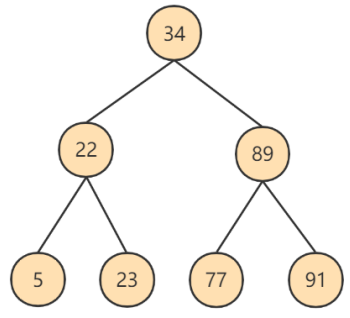
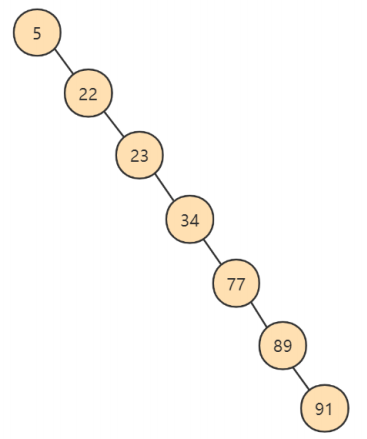
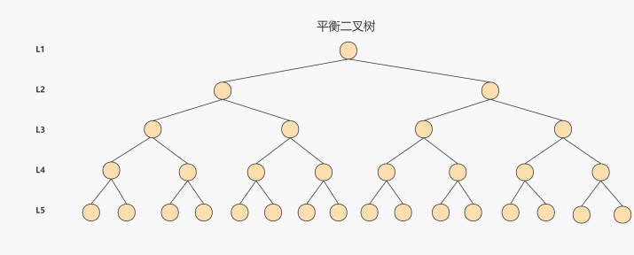
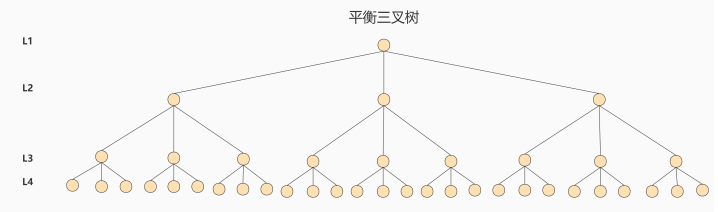

# MySQL数据结构选择的合理性

从 MySQL 的角度来看，磁盘 IO 是一个必须考虑的现实问题。如果能让索引的数据结构尽量减少硬盘的 I/O 操作，查询所消耗的时间就会越小。可以说，**磁盘的 I/O 操作次数对索引的使用效率至关重要**。

索引操作本质上是查找操作，一般而言索引非常大，尤其是在关系型数据库中，当数据量较大时，索引的大小可能达到几个 G 甚至更多。为了减少索引在内存的占用，**数据库索引是存储在外部磁盘上的**。当我们利用索引查询时，不可能把整个索引全部加载到内存，只能逐一加载，因此 MySQL 衡量查询效率的标准就是磁盘 IO 次数。

## 全表遍历

此方式效率极低，此处不做过多说明。

## Hash 结构

Hash（散列函数）是一种确定性算法，可大幅提升数据检索效率。它通过 MD5、SHA1、SHA2、SHA3 等确定性算法将输入转换为输出，相同输入永远得到相同输出，输入若有微小偏差，输出通常不同。

**加速查找速度的数据结构分类**，常见有以下两类：

| 类别 | 示例 | 时间复杂度（查询 / 插入 / 修改 / 删除） |
| --- | --- | --- |
|树结构 | 平衡二叉搜索树 | O(log₂N) |
| 哈希结构 | HashMap | O(1) |

采用 Hash 进行检索效率非常高，基本上一次检索就可以找到数据，而 B+ 树需要自顶向下依次查找，多次访问节点才能找到数据，中间需要多次 I/O 操作，`从效率来说 Hash 比 B+ 树更快`

**Hash 结构效率高，那为什么索引结构要设计成树型呢？**

- 原因 1：Hash索引仅能满足（=）（<>）和 IN 查询（等值、精确查询）。如果进行`范围查询`，哈希型的索引，时间复杂度会退化为 `O(n)`；而树型的 “有序” 特性，依然能够保持 `O(log₂N)` 的高效率。
- 原因 2：Hash索引还有一个缺陷，数据的存储是没有顺序的，在 ORDER BY 的情况下，使用 Hash索引还需要对数据重新排序。
- 原因 3：对于联合索引的情况，Hash值是将联合索引键合并后一起来计算的，无法对单独的一个键或者几个索引键进行查询。
- 原因 4：对于等值查询来说，通常 Hash索引的效率更高，不过也存在一种情况，就是`索引列的重复值如果很多，效率就会降低`。这是因为遇到 Hash 冲突时，需要遍历桶中的行指针来进行比较，找到查询的关键字，非常耗时。所以，Hash 索引通常不会用到重复值多的列上，比如列为性别、年龄的情况等。

**Hash 索引适用存储引擎如表所示**：

|索引 / 存储引擎 | MyISAM | InnoDB | Memory |
| --- | --- | --- | --- |
| HASH 索引 | 不支持 | 不支持 | 支持 |

**Hash 索引的适用性**：

Hash索引存在很多限制，相比之下在数据库中 B+树索引的使用面会更广，不过也有一些场景采用 Hash 索引效率更高，比如在键值对（Key-Value）数据库中，`Redis 存储的核心就是 Hash 表`。

MySQL中的 Memory存储引擎支持 Hash存储，如果我们需要用到临时表，就可以选择Memory存储引擎，把某个字段设置为Hash索引，比如字符串类型的字段，进行 Hash 计算之后长度可以缩短到几个字节。当字段的重复度低，而且经常需要进行`等值查询`的时候，采用 Hash 索引是个不错的选择。

另外，InnoDB 本身不支持 Hash 索引，但是提供[`自适应 Hash 索引（Adaptive Hash Index）`](./什么是自适应hash索引？.md)。

**什么情况下才会使用自适应 Hash 索引呢？**

如果某个数据经常被访问，当满足一定条件的时候，就会将这个数据页的地址存放到 Hash 表中。这样下次查询的时候，就可以直接找到这个页面的所在位置。这样 B + 树也具备了 Hash 索引的优点。

## 二叉搜索树

如果我们利用二叉树作为索引结构，那么磁盘的 IO 次数和索引树的高度是相关的。

**二叉搜索树的特点**：

- 一个节点只能有两个子节点，也就是一个节点度不能超过 2
- 左子节点 <本节点；右子节点>= 本节点，比我大的向右，比我小的向左

**查找规则**

我们先来看下最基础的二叉搜索树（Binary Search Tree），搜索某个节点和插入节点的规则一样，我们假设搜索插入的数值为 key：

- 如果 key 大于根节点，则在右子树中进行查找；
- 如果 key 小于根节点，则在左子树中进行查找；
- 如果 key 等于根节点，也就是找到了这个节点，返回根节点即可。

举个例子，我们对数列（34，22，89，5，23，77，91）创造出来的二分查找树如下图所示：

但是存在特殊的情况，就是有时候二叉树的深度非常大，比如我们给出的数据顺序是(5,22,23,34,77,89,91)，构造出来的二叉查找树如下所示：

上面第二棵树也属于二分查找树，但是性能上已经退化成了一条链表，查找数据的时间复杂度变成了`O(n)`。你能看出来第一个树的深度是 3，也就是说最多只需 3 次比较，就可以找到节点，而第二个树的深度是 7，最多需要 7 次比较才能找到节点。

为了提高查询效率，就需要`减少磁盘IO数`。为了减少磁盘IO的次数，就需要尽量`降低树的高度`，需要把原来 “瘦高” 的树结构变的 “矮胖”，树的每层的分叉越多越好。

## AVL 树

为了解决上面二叉查找树退化成链表的问题，人们提出了`平衡二叉搜索树（Balanced Binary Tree）`，又称为 AVL 树（有别于 AVL 算法），它在二叉搜索树的基础上增加了约束，具有以下性质：

**它是一棵空树或它的左右两个子树的高度差的绝对值不超过 1，并且左右两个子树都是一棵平衡二叉树。**

:::warning 扩展
这里说一下，常见的平衡二叉树有很多种，包括了`平衡二叉搜索树`、`红黑树`、`数堆`、`伸展树`。

平衡二叉搜索树是最早提出来的自平衡二叉搜索树，当我们提到平衡二叉树时一般指的就是平衡二叉搜索树。

事实上，第一棵树就属于平衡二叉搜索树，搜索时间复杂度就是 `O(log₂n)`。
:::

数据查询的时间主要依赖于磁盘 I/O 的次数，如果我们采用二叉树的形式，即使通过平衡二叉搜索树进行了改进，树的深度也是 O(log₂n)，当 n 比较大时，深度也是比较高的，比如下图的情况：

每访问一次节点就需要进行一次磁盘 I/O 操作，对于上面的树来说，我们需要进行 5 次 I/O 操作。虽然平衡二叉树的效率高，但是树的深度也同样高，这就意味着磁盘 I/O 操作次数多，会影响整体数据查询的效率。
针对同样的数据，如果我们把二叉树改成 `M 叉树`（M>2）呢？当 M=3 时，同样的 31 个节点可以由下面的三叉树来进行存储：

你能看到此时树的高度降低了，当数据量N大的时候，以及树的分叉数M大的时候，M叉树的高度会远小于二叉树的高度（M>2）。所以，我们需要把树从 “瘦高” 变 “矮胖”。

## B-Tree

## B+Tree

B+Tree与B-Tree相比，主要有以下区别：
- 所有的数据都存储在叶子节点
- 叶子节点形成一个**单向链表**
- 非叶子节点仅仅起到索引数据的作用，具体的数据都是存储在叶子节点中

MySQL对经典的B+Tree进行了优化。在原B+Tree的基础上，增加了指向相邻叶子节点的链表指针，就形成了带有顺序访问指针的B+Tree，提高了区间访问的性能。（也就是所谓的**双向链表**）

## R-Tree

todo: 待补充

