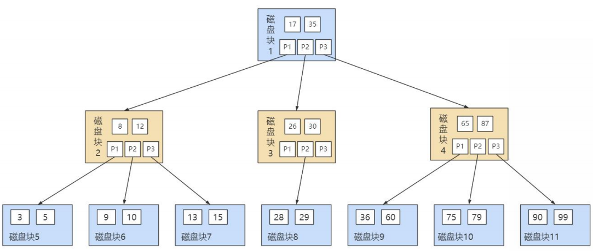

# MySQL数据结构选择的合理性

从 MySQL 的角度来看，磁盘 IO 是一个必须考虑的现实问题。如果能让索引的数据结构尽量减少硬盘的 I/O 操作，查询所消耗的时间就会越小。可以说`磁盘的 I/O 操作次数`对索引的使用效率至关重要。

索引操作本质上是查找操作，一般而言索引非常大，尤其是在关系型数据库中，当数据量较大时，索引的大小可能达到几个 G 甚至更多。为了减少索引在内存的占用，**数据库索引是存储在外部磁盘上的**。当我们利用索引查询时，不可能把整个索引全部加载到内存，只能`逐一加载`，因此 MySQL 衡量查询效率的标准就是磁盘 IO 次数。

## 全表遍历

此方式效率极低，此处不做过多说明。

## Hash 结构

Hash（散列函数）是一种确定性算法，可大幅提升数据检索效率。它通过 MD5、SHA1、SHA2、SHA3 等确定性算法将输入转换为输出，**相同输入永远得到相同输出**，假设输入内容有微小偏差，在输出中通常会有不同的结果。

举例：如果你想要验证两个文件是否相同，那么你不需要把两份文件直接拿来比对，只需要让对方把 Hash 函数计算得到的结果告诉你即可，然后在本地同样对文件进行 Hash 函数的运算，最后通过比较这两个 Hash 函数的结果是否相同，就可以知道这两个文件是否相同。

---

**加速查找速度的数据结构分类**，常见有以下两类：

| 类别 | 示例 | 时间复杂度（查询 / 插入 / 修改 / 删除） |
| --- | --- | --- |
|树结构 | 平衡二叉搜索树 | O(log₂N) |
| 哈希结构 | HashMap | O(1) |

采用 Hash 进行检索效率非常高，基本上一次检索就可以找到数据，而 B+ 树需要自顶向下依次查找，多次访问节点才能找到数据，中间需要多次 I/O 操作，`从效率来说 Hash 比 B+ 树更快`

**Hash 结构效率高，那为什么索引结构要设计成树型呢？**

- **原因 1**：Hash索引仅能满足等值、精确查询（=、<>和IN查询）。如果进行`范围查询`（between、>、< ...），哈希型的索引，时间复杂度会退化为 `O(n)`；而树型的 “有序” 特性，依然能够保持 `O(log₂N)` 的高效率。
- **原因 2**：Hash索引还有一个缺陷，数据的存储是`没有顺序`的，在 ORDER BY 的情况下，Hash索引无法利用索引完成排序操作，还需要对数据重新排序。
- **原因 3**：对于联合索引的情况，Hash值是将联合索引键合并后一起来计算的，无法对单独的一个键或者几个索引键进行查询。
- **原因 4**：对于等值查询来说，通常 Hash索引的效率更高，不过也存在一种情况，就是`索引列的重复值如果很多，效率就会降低`。这是因为遇到 Hash 冲突时，需要遍历桶中的行指针来进行比较，找到查询的关键字，非常耗时。所以，Hash 索引通常不会用到重复值多的列上，比如列为性别、年龄的情况等。

**Hash 索引适用存储引擎如表所示**：

|索引 / 存储引擎 | MyISAM | InnoDB | Memory |
| --- | --- | --- | --- |
| HASH 索引 | 不支持 | 不支持 | **支持** |

**Hash 索引的适用性**：

Hash索引存在很多限制，相比之下在数据库中 B+树索引的使用面会更广，不过也有一些场景采用 Hash 索引效率更高，比如在键值对（Key-Value）数据库中，`Redis 存储的核心就是 Hash 表`。

MySQL中的 Memory存储引擎支持 Hash存储，如果我们需要用到临时表，就可以选择Memory存储引擎，把某个字段设置为Hash索引，比如字符串类型的字段，进行 Hash 计算之后长度可以缩短到几个字节。当字段的重复度低，而且经常需要进行`等值查询`的时候，采用 Hash 索引是个不错的选择。

另外，InnoDB 本身不支持 Hash 索引，但是提供[`自适应 Hash 索引（Adaptive Hash Index）`](./什么是自适应Hash索引.md)。

那么**什么情况下才会使用自适应 Hash 索引呢？**

如果某个数据经常被访问，当满足一定条件的时候，就会将这个数据页的地址存放到 Hash 表中。这样下次查询的时候，就可以直接找到这个页面的所在位置。这样 B+树也具备了 Hash索引的优点。

## 二叉搜索树

如果我们利用二叉树作为索引结构，那么磁盘的 IO 次数和索引树的高度是相关的。

**二叉搜索树的特点**：

- 一个节点只能有两个子节点，也就是一个节点度不能超过 2
- 左子节点 < 本节点；右子节点 >= 本节点，比我大的向右，比我小的向左

**查找规则**：

我们先来看下最基础的二叉搜索树（Binary Search Tree），搜索某个节点和插入节点的规则一样，我们假设搜索插入的数值为 key：

- 如果 key 大于根节点，则在右子树中进行查找；
- 如果 key 小于根节点，则在左子树中进行查找；
- 如果 key 等于根节点，也就是找到了这个节点，返回根节点即可。

举个例子，我们对数列（34，22，89，5，23，77，91）创造出来的二分查找树如下图所示：

但是存在特殊的情况，就是有时候二叉树的深度非常大，比如我们给出的数据顺序是(5,22,23,34,77,89,91)，构造出来的二叉查找树如下所示：

上面第二棵树也属于二分查找树，但是性能上已经退化成了一条链表，查找数据的时间复杂度变成了`O(n)`。你能看出来第一个树的深度是 3，也就是说最多只需 3 次比较，就可以找到节点，而第二个树的深度是 7，最多需要 7 次比较才能找到节点。

为了提高查询效率，就需要`减少磁盘IO数`。为了减少磁盘IO的次数，就需要尽量`降低树的高度`，需要把原来 “瘦高” 的树结构变的 “矮胖”，树的每层的分叉越多越好。

## AVL 树

为了解决上面二叉查找树退化成链表的问题，人们提出了`平衡二叉搜索树（Balanced Binary Tree）`，又称为 AVL 树（有别于 AVL 算法），它在二叉搜索树的基础上增加了约束，具有以下性质：

**它是一棵空树或它的左右两个子树的高度差的绝对值不超过 1，并且左右两个子树都是一棵平衡二叉树。**

:::warning 扩展
这里说一下，常见的平衡二叉树有很多种，包括了`平衡二叉搜索树`、`红黑树`、`数堆`、`伸展树`。

平衡二叉搜索树是最早提出来的自平衡二叉搜索树，当我们提到平衡二叉树时一般指的就是平衡二叉搜索树。

事实上，第一棵树就属于平衡二叉搜索树，搜索时间复杂度就是 `O(log₂n)`。
:::

数据查询的时间主要依赖于磁盘 I/O 的次数，如果我们采用二叉树的形式，即使通过平衡二叉搜索树进行了改进，树的深度也是 O(log₂n)，当 n 比较大时，深度也是比较高的，比如下图的情况：

`每访问一次节点就需要进行一次磁盘 I/O 操作`，对于上面的树来说，我们需要进行 5 次 I/O 操作。虽然平衡二叉树的效率高，但是树的深度也同样高，这就意味着磁盘 I/O 操作次数多，会影响整体数据查询的效率。

针对同样的数据，如果我们把二叉树改成 `M 叉树`（M>2）呢？

当 M=3 时，同样的 31 个节点可以由下面的三叉树来进行存储：

你能看到此时树的高度降低了，当数据量N大的时候，以及树的分叉数M大的时候，M叉树的高度会远小于二叉树的高度（M>2）。所以，我们需要把`树从 “瘦高” 变 “矮胖”`。

## B-Tree

B-tree 的英文名称是 Balance Tree，也称为`多路平衡搜索树`，缩写为 B-Tree（注意横杠表示两个单词相连，并非减号）。它的高度比平衡二叉树小得多。

B 树的结构如下图所示：

B 树作为多路平衡查找树，它的每一个节点最多可以包括 M 个子节点，`M 称为 B 树的阶`。每个磁盘块中包括了关键字和子节点的指针。如果一个磁盘块中包括了 x 个关键字，那么指针数就是 x+1。对于一个 100 阶的 B 树来说，如果有 3 层的话最多可以存储约 100 万的索引数据。对于大量的索引数据来说，采用 B 树的结构是非常适合的，因为树的高度要远小于二叉树的高度。

一个 M 阶的 B 树（M>2）有以下的特性：

1. 根节点的儿子数的范围是 [2,M]。

2. 每个中间节点包含 k-1 个关键字和 k 个孩子，孩子的数量 = 关键字的数量 +1，k 的取值范围为[ceil(M/2), M]。

3. 叶子节点包括 k-1 个关键字（叶子节点没有孩子），k 的取值范围为 [ceil(M/2), M]。

4. 假设中间节点节点的关键字为：Key[1], Key[2], …, Key[k-1]，且关键字按照升序排序，即 Key[i] < Key[i+1]。此时 k-1 个关键字相当于划分了 k 个范围，也就是对应着 k 个指针，即为：P[1], P[2], …,P[k]，其中 P[1] 指向关键字小于 Key[1] 的子树，P[i] 指向关键字属于 (Key[i-1], Key[i]) 的子树，P[k]指向关键字大于 Key[k-1] 的子树。

5. 所有叶子节点位于同一层。

上面那张图所表示的 B 树就是一棵 3 阶的 B 树。我们可以看下磁盘块 2，里面的关键字为（8，12），它有 3 个孩子 (3，5)，(9，10) 和 (13，15)，你能看到 (3，5) 小于 8，(9，10) 在 8 和 12 之间，而 (13，15)大于 12，刚好符合刚才我们给出的特征。

然后我们来看下如何用 B 树进行查找。假设我们想要`查找的关键字是 9`，那么步骤可以分为以下几步：

1. 我们与根节点的关键字 （17，35）进行比较，9 小于 17 那么得到指针 P1；

2. 按照指针 P1 找到磁盘块 2，关键字为（8，12），因为 9 在 8 和 12 之间，所以我们得到指针 P2；

3. 按照指针 P2 找到磁盘块 6，关键字为（9，10），然后我们找到了关键字 9。

你能看出来在 B 树的搜索过程中，我们比较的次数并不少，但如果把数据读取出来然后在内存中进行比较，这个时间就是可以忽略不计的。而读取磁盘块本身需要进行 I/O 操作，消耗的时间比在内存中进行比较所需要的时间要多，是数据查找用时的重要因素。`B 树相比于平衡二叉树来说磁盘 I/O 操作要少`，在数据查询中比平衡二叉树效率要高。所以`只要树的高度足够低，IO次数足够少，就可以提高查询性能`。

**小结**

- B 树在插入和删除节点的时候如果导致树不平衡，就通过自动调整节点的位置来保持树的自平衡。
- 关键字集合分布在整棵树中，即叶子节点和非叶子节点都存放数据。搜索有可能在非叶子节点结束
- 其搜索性能等价于在关键字全集内做一次二分查找。

## R-Tree

R-Tree 在 MySQL 很少使用，仅支持 `geometry 数据类型` ，支持该类型的存储引擎只有 myisam、bdb、innodb、ndb、archive 几种。

举个 R 树在现实领域中能够解决的例子：查找 20 英里以内所有的餐厅。如果没有 R 树你会怎么解决？一般情况下我们会把餐厅的坐标 (x,y) 分为两个字段存放在数据库中，一个字段记录经度，另一个字段记录纬度。这样的话我们就需要遍历所有的餐厅获取其位置信息，然后计算是否满足要求。如果一个地区有 100 家餐厅的话，我们就要进行 100 次位置计算操作了，如果应用到谷歌、百度地图这种超大数据库中，这种方法便必定不可行了。R 树就很好的 **解决了这种高维空间搜索问题** 。它把 B 树的思想很好的扩展到了多维空间，采用了 B 树分割空间的思想，并在添加、删除操作时采用合并、分解结点的方法，保证树的平衡性。

因此，R 树就是一棵用来 **存储高维数据的平衡树** 。相对于 B-Tree，R-Tree 的优势在于范围查找。

| 索引 / 存储引擎 | MyISAM | InnoDB | Memory |
| --------------- | ------ | ------ | ------ |
| R-Tree 索引     | 支持   | 支持   | 不支持 |

## 小结

使用索引可以帮助我们从海量的数据中快速定位想要查找的数据，不过索引也存在一些不足，比如占用存储空间、降低数据库写操作的性能等，如果有多个索引还会增加索引选择的时间。当我们使用索引时，需要平衡索引的利（提升查询效率）和弊（维护索引所需的代价）。

在实际工作中，我们还需要基于需求和数据本身的分布情况来确定是否使用索引，尽管**索引不是万能的**，但**数据量大的时候不使用索引是不可想象的**，毕竟索引的本质，是帮助我们提升数据检索的效率。

## B+Tree

B+树也是一种多路搜索树，`基于B树做出了改进`，主流的 DBMS 都支持B+树的索引方式，比如 MySQL。相比于 B-Tree，`B+Tree 适合文件索引系统`。

**B+树B树的差异：**

1. 有 k 个孩子的节点就有 k 个关键字。也就是孩子数量 = 关键字数，而 B 树中，孩子数量 = 关键字数+1。

2. 非叶子节点的关键字也会同时存在在子节点中，并且是在子节点中所有关键字的最大（或最小）。

3. 非叶子节点仅用于索引，不保存数据记录，跟记录有关的信息都放在叶子节点中。而 B 树中， `非叶子节点既保存索引，也保存数据记录`。

4. 所有关键字都在叶子节点出现，叶子节点构成一个有序链表，而且叶子节点本身按照关键字的大小从小到大顺序链接。

> B 树和 B+ 树都可以作为索引的数据结构，在 MySQL 中采用的是 B+ 树。
>
> 但B树和B+树各有自己的应用场景，不能说B+树完全比B树好，反之亦然。

:::warning 扩展

B+Tree与B-Tree相比，主要有以下区别：

- 所有的数据都存储在叶子节点
- 叶子节点形成一个**单向链表**
- 非叶子节点仅仅起到索引数据的作用，具体的数据都是存储在叶子节点中

MySQL对经典的B+Tree进行了优化。在原B+Tree的基础上，增加了指向相邻叶子节点的链表指针，就形成了带有顺序访问指针的B+Tree，提高了区间访问的性能。（也就是所谓的**双向链表**）

:::

## 扩展

### 为了减少IO，索引树会一次性加载吗？

- 1、数据库索引是存储在磁盘上的，如果数据量很大，必然导致索引的大小也会很大，超过几个G。

- 2、当我们利用索引查询时候，是不可能将全部几个G的索引都加载进内存的，我们能做的只能是：逐一加载每一个磁盘页，因为磁盘页对应着索引树的节点。

### B+树的存储能力如何？为何说一般查找行记录，最多只需1~3次磁盘IO

InnoDB存储引擎中页的大小为`16KB`，一般表的主键类型为INT(占用4个字节)或BIGINT(占用8个字节)，指针类型也一般为4或8个字节，也就是说一个页（B+Tree中的一个节点）中大概存储 `16KB/(8B+8B)=1K` 个键值，因为是估算，为了方便计算，这里的K取值为10^3。

也就是说一个深度为3的B+Tree索引可以维护 `10^3 * 10^3 * 10^3 = 10亿`条记录。（这里假定一个数据页也存储10^3条行记录数据了）

实际情况中每个节点可能不能填充满，因此在数据库中，`B+Tree的高度一般都在2~4层`。MySQL的InnoDB存储引擎在设计时是将根节点常驻内存的，也就是说查找某一键值的行记录时最多只需要1~3次磁盘I/O操作

### 为什么说B+树比B-树更适合实际应用中操作系统的文件索引和数据库索引？

- 1、**B+树的磁盘读写代价更低**

B+树的内部结点并没有指向关键字具体信息的指针。因此其内部结点相对于B树更小。如果把所有同一内部结点的关键字存放在同一盘块中，那么盘块所能容纳的关键字数量也越多。一次性读入内存中的需要查找的关键字也就越多。相对来说IO读写次数也就降低了。

- 2、**B+树的查询效率更加稳定**

由于非终结点并不是最终指向文件内容的节点，而只是叶子结点中关键字的索引。所有任何关键字的查找必须走一条从根结点到叶子结点的路。所有关键字查询的路径长度相同，导致每一个数据的查询效率相当。

### Hash索引与B+树索引的区别

- 1、Hash索引`不能进行范围查询`，而B+树可以。这是因为Hash索引指向的数据是无序的，而B+树的叶子节点是个有序的链表。

- 2、Hash索引`不支持联合索引的最左侧原则`（即联合索引的部分索引无法使用），而B+树可以。对于联合索引来说，Hash索引在计算Hash值的时候是将索引键合并后再一起计算Hash值，所以不会针对每个索引单独计算Hash值。因此如果用到联合索引的一个或者几个索引时，联合索引无法被利用。

- 3、Hash索引`不支持 ORDER BY 排序`，因为Hash索引指向的数据是无序的，因此无法起到排序优化的作用，而B+树索引数据是有序的，可以起到对该字段ORDER BY 排序优化的作用。同理，我们也无法用Hash索引进行`模糊查询`，而B+树使用LIKE进行模糊查询的时候，LIKE后面后模糊查询（比如%结尾）的话就可以起到优化作用。

- 4、`InnoDB不支持哈希索引`

