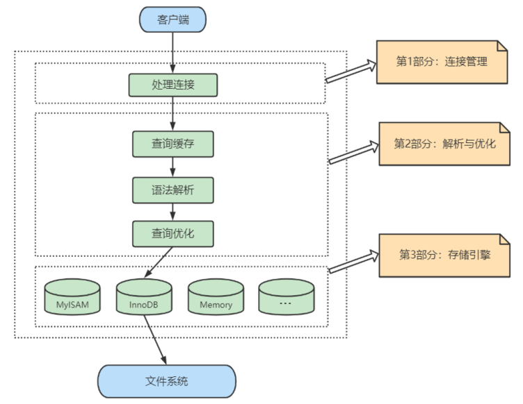
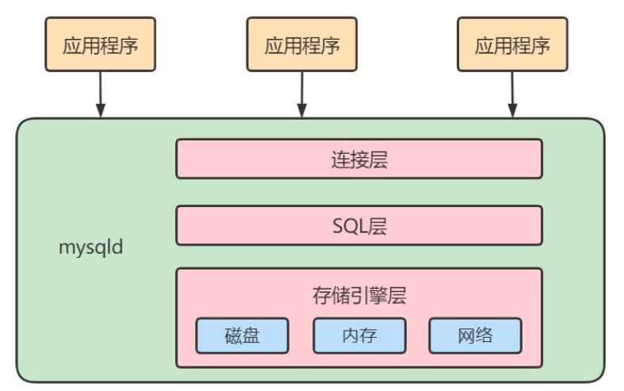

# MySQL逻辑架构

## 服务器处理客户端请求

首先MySQL是经典的C/S架构，即`Client/Server架构`，服务端程序使用的是`mysqld`。

不论客户端进程和服务器进程是采用哪种方式进行通信，最后实现的效果都是：**客户端进程向服务器进程发送一段文本（SQL 语句），服务器进程处理后再向客户端进程发送一段文本（处理结果）**。

那服务器进程对客户端进程发送的请求做了什么处理，才能产生最后的处理结果呢？这里以查询请求为例展示：



下面再具体展开：


一切的起因都是下面这张图，它非常的经典，他很好的展示了MySQL的逻辑架构。

但也正是因为它非常经典，所以是很久之前的架构图了，所以对于MySQL8.0来说，这张图不是很好的描述。比如MySQL8.0删除了**查询缓存**

现在我们大致的了解一下图片中的各个部分：

- Connectors，连接器，MySQL服务器之外的客户端程序（与具体编程语言相关）
- Management Serveices & Utilities：基础服务组件，不必多说
- Connection Pool：连接池，提供了多个由于客户端与服务端交互的线程
- SQL Interface：SQL接口，负责接受SQL指令，返回执行结果
- Parser：解析器，负责将SQL语句进行语法分析、语义分析，最终生成语法树
- Optimizer：优化器，负责将SQL语句进行优化，生成**执行计划**。例如，是否使用索引，多表连接顺序、外连接转内连接等
- Caches & Buffers：查询缓存组件，比如查询缓存，将查询结果以key-value的形式缓存起来，下次查询相同的结果可以直接返回。不过MySQL8.0已经移除了查询缓存，因为命中率很低
- Pluggable Storage Engines：插件式的存储引擎，主要负责与底层文件稀土交互，完成数据的存储和提取。
- File System：文件系统
- Files & Logs：日志文件

接下来简单了解一下一条SQL语句的执行流程：

- 1、客户端与服务器建立连接，发送一个SQL请求
- 2、线程池会为其分配一个线程，用于执行SQL语句
- 3、SQL语句会进入到SQL Interface
- 4、紧接着，会查询缓存，如果命中就直接返回结果
- 5、如果没有命中，则会进入到解析器进行语法分析、语义分析，生成语法树。如果SQL语句有误，此时就会返回错误
- 6、正常来说，解析器处理过后，SQL就可以正常进行查询了。但是MySQL还进行了优化，即走到优化器，生成执行计划（因为你写的SQL可能很烂，MySQL可能会进行优化；能否使用上索引也是在这一步确定的）
- 7、调用存储引擎提供的API在文件系统中找到对应的数据
- 8、在文件系统中查询到数据
- 9、将查询到的数据缓存到查询缓存中，以key-value的格式缓存起来（k为SQL语句，v为查询结果），下次查询时，会先从缓存中查
- 10、SQL Interface返回查询结果给客户端

## Connectors

Connectors，指的是不同语言中与 SQL 的交互。MySQL 首先是一个网络程序，在 TCP 之上定义了自己的应用层协议。所以要使用 MySQL，我们可以编写代码，跟 MySQL Server `建立 TCP 连接`，之后按照其定义好的协议进行交互。或者比较方便的办法是调用 SDK，比如 Native C API、JDBC、PHP 等各语言 MySQL Connector，或者通过 ODBC。但通过 SDK 来访问 MySQL，本质上还是在 TCP 连接上通过 MySQL 协议跟 MySQL 进行交互。

---

接下来的 MySQL Server 结构可以分为如下的三层：

## 第1层：连接层

系统（客户端）访问`MySQL`服务器前，做的第一件事就是建立`TCP`连接。

经过三次握手建立连接成功后，`MySQL`服务器对`TCP`传输过来的账号密码做身份认证、权限获取。

- **用户名或密码不对，会收到一个`Access denied for user`错误，客户端程序结束执行**
- **用户名密码认证通过，会从权限表查出账号拥有的权限与连接关联，之后的权限判断逻辑，都将依赖于此时读到的权限**

:::info 思考
**一个系统只会个MySQL服务器建立一个连接吗？只能有一个系统和MySQL服务器建立连接吗？**

当然不是，多个系统都可以和MySQL服务器建立连接，每个系统建立的连接肯定不止一个。所以，为了解决TCP无限创建与TCP频繁创建和销毁带来的资源耗尽、性能下降问题。MySQL服务器里有`TCP连接池`限制的连接数，采用`长连接模式`复用TCP连接，来解决上述问题
:::

`TCP`连接收到请求后，必须要分配给一个线程专门与这个客户端的交互。所以还会有个线程池，去走后面的流程。每一个连接从线程池中获取线程，省去了创建和销毁线程的开销。

:::tip
以上内容都收纳到了MySQL的**连接管理**组件中

所以**连接管理**的职责是负责认证、管理连接、获取权限信息
:::

## 第2层：服务层

第二层架构主要完成大多数的核心服务功能，如 SQL 接口，并完成`缓存的查询`，SQL 的分析和优化及部分内置函数的执行。所有跨存储引擎的功能也在这一层实现，如过程、函数等。

在该层，服务器会`解析查询`并创建相应的内部`解析树`，并对其完成相应的`优化`：如确定查询表的顺序，是否利用索引等，最后生成相应的执行操作。

如果是 SELECT 语句，服务器还会`查询内部的缓存`。如果缓存空间足够大，这样在解决大量读操作的环境中能够很好的提升系统的性能。

- **SQL Interface: SQL接口**

  - 接收用户的SQL命令，并且返回用户需要查询的结果。比如SELECT ... FROM就是调用SQL Interface
  - MySQL支持DML（数据操作语言）、DDL（数据定义语言）、存储过程、视图、触发器、自定义函数等多种SQL语言接口

- **Parser: 解析器**

  - 在解析器中对 SQL 语句进行语法分析、语义分析。将SQL语句分解成数据结构，并将这个结构传递到后续步骤，以后SQL语句的传递和处理就是基于这个结构的。如果在分解构成中遇到错误，那么就说明这个SQL语句是不合理的。
  - 在SQL命令传递到解析器的时候会被解析器验证和解析，并为其创建`语法树`，并根据数据字典丰富查询语法树，会`验证该客户端是否具有执行该查询的权限`。创建好语法树后，MySQL还会对SQL查询进行语法上的优化，进行查询重写。

- **Optimizer: 查询优化器**

  - SQL语句在语法解析之后、查询之前会使用查询优化器确定 SQL 语句的执行路径，生成一个`执行计划`。
  - 这个执行计划表明应该`使用哪些索引`进行查询（全表检索还是使用索引检索），表之间的连接顺序如何，最后会按照执行计划中的步骤调用存储引擎提供的方法来真正的执行查询，并将查询结果返回给用户。
  - 它使用“`选取-投影-连接`”策略进行查询。例如：

  ```sql
  SELECT id,name FROM student WHERE gender = '女';
  ```

  这个SELECT查询先根据WHERE语句进行`选取`，而不是将表全部查询出来以后再进行gender过滤。 这个SELECT查询先根据id和name进行属性`投影`，而不是将属性全部取出以后再进行过滤，将这两个查询条件`连接`起来生成最终查询结果。

- **Caches & Buffers： 查询缓存组件**

  - MySQL内部维持着一些Cache和Buffer，比如Query Cache用来缓存一条SELECT语句的执行结果，如果能够在其中找到对应的查询结果，那么就不必再进行查询解析、优化和执行的整个过程了，直接将结果反馈给客户端。
  - 这个缓存机制是由一系列小缓存组成的。比如表缓存，记录缓存，key缓存，权限缓存等 。
  - 这个查询缓存可以在`不同客户端之间共享`。
  - 从MySQL 5.7.20开始，不推荐使用查询缓存，并在`MySQL 8.0中删除`。

## 第3层：引擎层

和其它数据库相比，MySQL 有点与众不同，它的架构可以在多种不同场景中应用并发挥良好作用，主要体现在存储引擎的架构上，`插件式的存储引擎`架构将查询处理和其它的系统任务以及数据的存储提取相分离。这种架构可以根据业务的需求和实际需要选择合适的存储引擎。同时开源的 MySQL 还允许`开发人员设置自己的存储引擎`。

这种高效的模块化架构为那些希望专门针对特定应用程序需求（例如数据仓库、事务处理或高可用性情况）的人提供了巨大的好处，同时享受使用一组独立于任何接口和服务的优势存储引擎。

插件式存储引擎层（ Storage Engines），**真正的负责了MySQL中数据的存储和提取，对物理服务器级别维护的底层数据执行操作**，服务层通过API与存储引擎进行通信。

## 小结

为了方便记忆，我们可以简化如下：



简化为三层结构：

1. 连接层：客户端和服务器端建立连接，客户端发送 SQL 至服务器端；
2. SQL 层（服务层）：对 SQL 语句进行查询处理；与数据库文件的存储方式无关；
3. 存储引擎层：与数据库文件打交道，负责数据的存储和读取。

