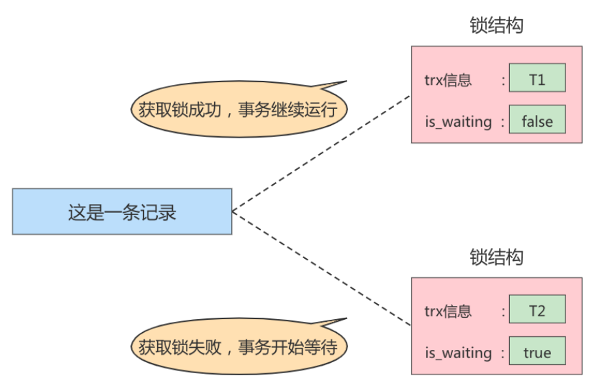
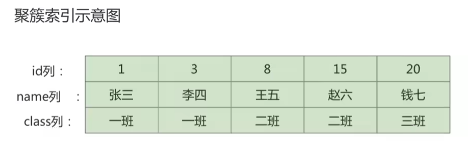
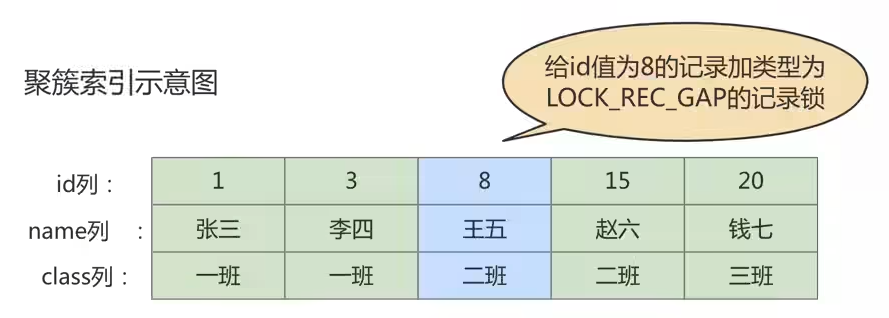

# MySQL锁

> 在[MySQL事务日志](./MySQL事务日志.md)中，我们介绍了undo log、redo log，通过undo log、redo log解决了MySQL事务的四大特性中的`原子性`、`一致性`、`持久性`中的，其中`隔离性`是并发事务操作的基石，需要通过`锁`机制来实现。

## 锁的概述

- 通用层面

`锁`是计算机协调多个进程或线程`并发访问某一资源`的机制。在程序开发中会存在多线程同步的问题，当多个线程并发访问某个数据的时候，尤其是针对一些敏感的数据（比如订单、金额等），我们就需要保证这个数据在任何时刻`最多只有一个线程`在访问，保证数据的`完整性`和`一致性`。在开发过程中加锁是为了保证数据的一致性，这个思想在数据库领域中同样很重要。

- 数据库层面

在数据库中，除传统的计算资源（如CPU、RAM、I/O等）的争用以外，数据也是一种供许多用户共享的资源。为保证数据的一致性，需要对`并发操作进行控制`，因此产生了`锁`。

同时`锁机制`也为实现MySQL的各个隔离级别提供了保证。 `锁冲突` 也是影响数据库`并发访问性能`的一个重要因素。所以锁对数据库而言显得尤其重要，也更加复杂。

## MySQL并发事务访问相同记录

并发事务访问相同记录的情况大致可以分为三种情况：

### 读-读情况

`读-读`情况，即并发事务相继`读取相同的记录`。读取操作本身不会对记录有任何影响，并不会引起什么问题，所以允许这种情况的发生。

### 写-写情况

`写-写`情况，即并发事务相继对相同的记录做出改动。

在这种情况下会发生`脏写`的问题，任何一种隔离级别都不允许这种问题的发生。所以在多个未提交事务相继对一条记录做改动时，需要让它们`排队执行`，这个排队的过程其实是通过`锁`来实现的。

这个所谓的锁其实是一个`内存中的结构`，在事务执行前本来是没有锁的，也就是说一开始是没有`锁结构`和记录进行关联的，如图所示：


当一个事务想对这条记录做改动时，首先会看看内存中有没有与这条记录关联的`锁结构`，当没有的时候就会在内存中生成一个锁结构与之关联。

比如，事务`T1`要对这条记录做改动，就需要生成一个锁结构与之关联：


在锁结构里有很多信息，为了简化理解，只把两个比较重要的属性拿了出来：
- `trx信息`：代表这个锁结构是哪个事务生成的。
- `is_waiting`：代表当前事务是否在等待。

> 更详细的锁结构信息，会在下文中详细介绍：[锁的内存结构](#锁的内存结构)

当事务`T1`改动了这条记录后，就生成了一个锁结构与该记录关联，因为之前没有别的事务为这条记录加锁，所以`is_waiting`属性是`false`，我们把这个场景就称之为 `获取锁成功` 或 `加锁成功`，然后就可以继续执行接下来的操作了。

如果在事务`T1`提交之前，另一个事务事务`T2`也想对该记录做改动，那么会先看看有没有锁结构与这条记录关联，发现有一个锁结构与之关联后，然后也生成了一个锁结构与这条记录关联，不过锁结构的`is_waiting`属性值为`true`，表示当前事务需要等待，我们把这个场景就称之为`获取锁失败` 或 `加锁失败`，图示：



在事务`T1`提交之后，就会把该事务生成的`锁结构释放`掉，然后看看还有没有别的事务在等待获取锁，发现了`事务T2`还在等待获取锁，所以把事务T2对应的锁结构的`is_waiting`属性设置为`false`，然后把该事务对应的线程唤醒，让它继续执行，此时`事务T2`就算获取到锁了。效果图就是这样：


---

这里小结一下以上几种加锁情况：

- 不加锁

意思就是不需要在内存中生成对应的锁结构，可以直接执行操作。

- 获取锁成功 或 加锁成功

意思就是在内存中生成了对应的锁结构，而且锁结构的`is_waiting`属性值为`false`，也就是事务可以继续执行操作。

- 获取锁失败 或 加锁失败 或 没有获取到锁

意思就是在内存中生成了对应的锁结构，不过锁结构的`is_waiting`属性值为`true`，也就是事务需要等待，不可以继续执行操作。

:::tip

MySQL的所有事务隔离级别都默认解决了`脏写`的问题。我们在【[SQL中的四种隔离级别](./事务基础.md#sql-isolation-level)】中已经详细介绍了。

:::

### 读-写或写-读情况

`读-写`或`写-读`，即一个事务进行读取操作，另一个进行改动操作。这种情况下可能发生`脏读`、`不可重复读`、`幻读`的问题。

:::tip

各个数据库厂商对 SQL标准 的支持都可能不一样。比如 MySQL 在`REPEATABLE READ`隔离级别上就已经解决了大部分`幻读`问题。

我们在【[MySQL支持的四种隔离级别](./事务基础.md#mysql-isolation-level)】已经具体介绍了，这里不再赘述！

:::

### 并发问题的解决方案

怎么解决`脏读`、`不可重复读`、`幻读`这些问题呢？其实有两种可选的解决方案：

- 方案一：读操作利用多版本并发控制（`MVCC`），写操作进行`加锁`。

所谓的`MVCC`，就是生成一个`ReadView`，通过ReadView找到符合条件的记录版本（历史版本由`undo日志`构建）。查询语句只能`读`到在生成ReadView之前`已提交事务所做的更改`，在生成ReadView之前未提交的事务或者之后才开启的事务所做的更改是看不到的。而`写操作`肯定针对的是`最新版本的记录`，读记录的历史版本和改动记录的最新版本本身并不冲突，也就是采用MVCC时，`读-写`操作并不冲突。

::: warning 扩展——**MVCC如何解决幻读问题**？

普通的SELECT语句在READ COMMITTED和REPEATABLE READ隔离级别下会使用到MVCC读取记录。

- 在`READ COMMITTED`隔离级别下，一个事务在执行过程中每次执行SELECT操作时都会生成一个ReadView，ReadView的存在本身就保证了`事务不可以读取到未提交的事务所做的更改`，也就是避免了脏读现象；
- 在`REPEATABLE READ`隔离级别下，一个事务在执行过程中只有`第一次执行SELECT操作`才会生成一个ReadView，之后的SELECT操作都`复用`这ReadView，这样也就避免了不可重复读和**幻读**的问题。

:::

- 方案二：读、写操作都采用`加锁`的方式。

如果我们的一些业务场景不允许读取记录的旧版本，而是每次都必须去`读取记录的最新版本`。比如，在银行存款的事务中，你需要先把账户的余额读出来，然后将其加上本次存款的数额，最后再写到数据库中。在将账户余额读取出来后，就不想让别的事务再访问该余额，直到本次存款事务执行完成，其他事务才可以访问账户的余额。这样在读取记录的时候就需要对其进行`加锁`操作，这样也就意味着`读-写`操作也像`写-写`操作那样`排队`执行。

---

`脏读`的产生是因为当前事务读取了另一个未提交事务写的一条记录，如果另一个事务在写记录的时候就给这条记录加锁，那么当前事务就无法继续读取该记录了，所以也就不会有脏读问题的产生了。

`不可重复读`的产生是因为当前事务先读取一条记录，另外一个事务对该记录做了改动之后并提交之后，当前事务再次读取时会获得不同的值，如果在当前事务读取记录时就给该记录加锁，那么另一个事务就无法修改该记录，自然也不会发生不可重复读了。

`幻读`问题的产生是因为当前事务读取了一个范围的记录，然后另外的事务向该范围内插入了新记录，当前事务再次读取该范围的记录时发现了新插入的新记录。采用加锁的方式解决幻读问题就有一些麻烦，因为当前事务在第一次读取记录时幻影记录并不存在，所以读取的时候加锁就有点尴尬（因为你并不知道给谁加锁）。

---

- 小结对比发现：

  - 采用`MVCC`方式的话，`读-写`操作彼此并不冲突，`性能更高`。
  - 采用`加锁`方式的话，`读-写`操作彼此需要`排队执行`，影响性能。

一般情况下我们当然愿意采用`MVCC`来解决`读-写`操作并发执行的问题，但是业务在某些特殊情况下，要求必须采用`加锁`的方式执行。

## 锁的不同角度分类

```markmap
# MySQL锁家族

## 对数据的操作类型划分
- 共享锁/读锁
- 排他锁/写锁

## 锁粒度划分
### 表级锁
- 表级S锁/X锁
- 意向锁
- 自增锁
- MDL锁
### 行级锁
- 记录锁（Record Locks）
- 间隙锁（Gap Locks）
- 临键锁（Next-Key Locks）
- 插入意向锁（IS/IX）
### 页级锁

## 对待锁的态度划分
- 悲观锁
- 乐观锁

## 加锁方式
- 隐式锁
- 显式锁

## 其他
- 全局锁
- 死锁
```

### 从数据操作的类型划分：读锁、写锁

对于数据库中并发事务的**读 - 读**情况并不会引起什么问题。

对于**写 - 写**、**读 - 写**或**写 - 读**这些情况可能会引起一些问题，需要使用**MVCC**或者**加锁**的方式来解决它们。

在使用**加锁**的方式解决问题时，由于既要允许**读 - 读**情况不受影响，又要使**写 - 写**、**读 - 写**或**写 - 读**情况中的操作相互阻塞，所以 MySQL 实现一个由两种类型的锁组成的锁系统来解决。这两种类型的锁通常被称为**共享锁（Shared Lock，S Lock）和排他锁（Exclusive Lock，X Lock）**，也叫**读锁（readlock）和写锁（write lock）**。

- `读锁`：也称为`共享锁`、英文用`S`表示。针对同一份数据，多个事务的读操作可以同时进行而不会互相影响，相互不阻塞的。
- `写锁`：也称为`排他锁`、英文用`X`表示。当前写操作没有完成前，它会阻断其他写锁和读锁。这样就能确保在给定的时间里，只有一个事务能执行写入，并防止其他用户读取正在写入的同一资源。

>  **需要注意的是，对于 InnoDB 引擎来说，读锁和写锁可以加在表上，也可以加在行上。**

---

**举例（行级读写锁）**：

如果一个事务 T1 已经获得了某个行 r 的读锁，那么此时另外的一个事务 T2 是可以去获得这个行 r 的**读锁**的，因为读取操作并没有改变行 r 的数据；但是，如果某个事务 T3 想获得行 r 的**写锁**，则它必须等待事务 T1、T2 释放掉行 r 上的读锁才行。

**总结**：这里的兼容是指对同一张表或记录的锁的兼容性情况。

|      | X 锁   | S 锁     |
| ---- | ------ | -------- |
| X 锁 | 不兼容 | 不兼容   |
| S 锁 | 不兼容 | **兼容** |

#### 1. 锁定读

在采用`加锁`方式解决`脏读`、`不可重复读`、`幻读`这些问题时，读取一条记录时需要获取该记录的`S锁`，其实是不严谨的，有时候需要在读取记录时就获取记录的`X锁`，来禁止别的事务读写该记录，为此MySQL提出了两种比较特殊的`SELECT`语句格式：

- 对读取的记录加`S锁`：

```sql
SELECT ... LOCK IN SHARE MODE;
# 或
SELECT ... FOR SHARE; #(8.0新增语法)
```

:::details 具体说明

在普通的`SELECT`语句后边加`LOCK IN SHARE MODE`，如果当前事务执行了该语句，那么它会为读取到的记录加`S`锁，这样允许别的事务继续获取这些记录的`S`锁（比方说别的事务也使用`SELECT ... LOCK IN SHARE MODE`语句来读取这些记录），但是不能获取这些记录的`X`锁（比如使用`SELECT ... FOR UPDATE`语句来读取这些记录，或者直接修改这些记录）。如果别的事务想要获取这些记录的`X`锁，那么它们会阻塞，直到当前事务提交之后将这些记录上的`S`锁释放掉。

:::

- 对读取的记录加`X锁`：

```sql
SELECT ... FOR UPDATE;
```

:::details 具体说明

在普通的`SELECT`语句后边加`FOR UPDATE`，如果当前事务执行了该语句，那么它会为读取到的记录加`X`锁，这样既不允许别的事务获取这些记录的`S`锁（比方说别的事务使用`SELECT ... LOCK IN SHARE MODE`语句来读取这些记录），也不允许获取这些记录的`X`锁（比如使用`SELECT ... FOR UPDATE`语句来读取这些记录，或者直接修改这些记录）。如果别的事务想要获取这些记录的`S`锁或者`X`锁，那么它们会阻塞，直到当前事务提交之后将这些记录上的`X`锁释放掉。

:::

**MySQL8.0新特性：**

在5.7及之前的版本，`SELECT ... FOR UPDATE`，如果获取不到锁，会一直等待，直到`innodb_lock_wait_timeout`超时。

在8.0版本中，`SELECT ... FOR UPDATE`, `SELECT ... FOR SHARE` 添加`NOWAIT`、`SKIP LOCKED`语法，跳过锁等待，或者跳过锁定。

- NOWAIT：如果查询的行已经加锁，会立即报错返回
- SKIP LOCKED：如果查询的行已经加锁，只返回结果中不包含被锁定的行

> **说明：**
>
> 如果查询的行已经加锁，使用`NOWAIT`、`SKIP LOCKED`都会立即返回，不阻塞等待，区别在于：
>
> - 使用`NOWAIT`会报错，例如：
>
> ```sql
> ERROR 3572 (HY000): Statement aborted because lock(s) could not be acquired immediately and NOWAIT is set.
> ```
>
> - 使用`SKIP LOCKED`不会报错，他会返回表中没有锁定的行的记录

#### 2. 写操作

我们开发中常用的写操作无非就是`DELETE`、`UPDATE`、`INSERT`这三种：

- `DELETE`：对一条记录做DELETE操作的过程其实是先在`B+树`中定位到这条记录的位置，然后获取这条记录的`X锁`，再执行`delete mark`操作。我们也可以把这个定位待修改记录在`B+树`中的位置的过程可以看成是一个获取`X锁`的`锁定读`，
- `UPDATE`：在对一条记录做UPDATE操作时分为三种情况：
  - 情况1：未修改该记录的键值，并且被更新的列占用的存储空间在修改前后未发生变化。则先在`B+树`中定位到这条记录的位置，然后再获取一下记录的`X锁`，最后在原记录的位置进行修改操作。我们也可以把这个位位待修改记录在`B+树`中的位置的过程可以看成是一个获取`X锁`的`锁定读`。
  - 情况2：未修改该记录的键值，并且至少有一个被更新的列占用的存储空间在修改前后发生变化。则先在`B+树`中定位到这条记录的位置，然后获取一下记录的`X锁`，将该记录彻底删除掉（就是把记录彻底移入**垃圾链表**），最后再插入一条新记录。这个定位待修改记录在`B+树`中的位置的过程可以看成是一个获取`X锁`的`锁定读`， 新插入的记录由`INSERT`操作提供的`隐式锁`进行保护。
  - 情况3：修改该记录的键值，则相当于在原记录上做`DELECT`操作之后再来一次`INSERT`操作。加锁操作就需要按照`DELECT`和`INSERT`的规则进行了。
- `INSERT`：一般情况下，新插入一条记录的操作并不加锁，通过一种称之为`隐式锁`的结构来保护这条新插入的记录在本事务提交前不被别的事务访问。

### 从数据操作的粒度划分：表级锁、页级锁、行锁

为了尽可能提高数据库的并发度，每次锁定的数据范围越小越好，理论上每次只锁定当前操作的数据的方案会得到最大的并发度，但是管理锁是很**耗资源**的事情（涉及获取、检查、释放锁等动作）。因此数据库系统需要在**高并发响应**和**系统性能**两方面进行平衡，这样就产生了 “*`锁粒度（Lock granularity）`” 的概念。

对一条记录加锁影响的也只是这条记录而已，我们就说这个锁的粒度比较细；其实一个事务也可以在**表级别**进行加锁，自然就被称之为**表级锁**或者**表锁**，对一个表加锁影响整个表中的记录，我们就说这个锁的粒度比较粗。锁的粒度主要分为表级锁、页级锁和行锁。

#### 1. 表锁（Table Lock）

该锁会锁定整张表，它是MySQL中最基本的锁策略，并`不依赖于存储引擎`（不管你是 MySQL 的什么存储引擎，对于表锁的策略都是一样的），并且表锁是`开销最少`的策略（因为粒度比较大）。由于表级锁一次会将整个表锁定，所以可以很好的`避免死锁`的问题。当然，锁的粒度大所带来最大的负面影响就是出现锁资源争用的概率也会最高，导致`并发率大打折扣`。

##### ① 表级别的S锁、X锁

在对某个表执行SELECT、INSERT、DELETE、UPDATE语句时，InnoDB存储引擎是不会为这个表添加表级别的`S锁`或者`X锁`的。

在对某个表执行一些诸如`ALTER TABLE`、`DROP TABLE`这类的`DDL`语句时，其他事务对这个表并发执行诸如SELECT、INSERT、DELETE、UPDATE的语句会发生阻塞。

同理，某个事务中对某个表执行SELECT、INSERT、DELETE、UPDATE语句时，在其他会话中对这个表执行`DDL`语句也会发生阻塞。这个过程其实是通过在`server层`使用一种称之为`元数据锁`（英文名：`Metadata Locks`，简称`MDL`）结构来实现的。

一般情况下，不会使用InnoDB存储引擎提供的表级别的`S锁`和`X锁`。只会在一些特殊情况下，比方说`崩溃恢复`过程中用到。比如，在系统变量`autocommit=0，innodb_table_locks = 1`时，`手动`获取InnoDB存储引擎提供的表t 的`S锁`或者`X锁`可以这么写：

- `LOCK TABLES t READ`：InnoDB存储引擎会对表`t`加表级别的`S锁`。
- `LOCK TABLES t WRITE`：InnoDB存储引擎会对表`t`加表级别的`X锁`。

不过尽量避免在使用 InnoDB 存储引擎的表上使用`LOCK TABLES`这样的手动锁表语句，它们并不会提供什么额外的保护，只是会降低并发能力而已。

因为InnoDB还是实现了更细粒度的**行锁**，关于 InnoDB 表级别的`S`锁和`X`锁大家了解一下就可以了。

---

MySQL 的表级锁有两种模式：（以 MyISAM 表进行操作的演示）

- 表共享读锁（Table Read Lock）
- 表独占写锁（Table Write Lock）

---

**举例**：下面我们演示 MyISAM 引擎下的表锁。

**步骤 1：数据准备（创建表并添加数据）**

```sql
CREATE TABLE mylock(
  id INT NOT NULL PRIMARY KEY auto_increment,
  NAME VARCHAR(20)
)ENGINE myisam;  # 存储引擎使用 InnoDB也可以，只是不建议

#插入一条数据
INSERT INTO mylock(NAME) VALUES('a');
```

**步骤 2：查看表上加过的锁**

```sql
SHOW OPEN TABLES; #主要关注In_use字段的值

或者

SHOW OPEN TABLES where In_use > 0;
```

```sql
mysql> SHOW OPEN TABLES;
+--------------------+---------------------------+--------+-------------+
| Database           | Table                     | In_use | Name_locked |
+--------------------+---------------------------+--------+-------------+
| mysql              | column_statistics         | 0      | 0           |
| test               | mylock                    | 0      | 0           |
| mysql              | table_stats               | 0      | 0           |
| mysql              | check_constraints         | 0      | 0           |
| mysql              | view_table_usage          | 0      | 0           |
| mysql              | tables_priv               | 0      | 0           |
| mysql              | column_type_elements      | 0      | 0           |
| mysql              | foreign_key_column_usage  | 0      | 0           |
| mysql              | time_zone_name            | 0      | 0           |

...

+--------------------+---------------------------+--------+-------------+
```

```sql
mysql> SHOW OPEN TABLES where In_use > 0;
0 row in set (0.01 sec)
```

上面的结果表明，当前数据库中没有被锁定的表。

**步骤 3：手动增加表锁命令**

```sql
LOCK TABLES t READ; #存储引擎会对表t加表级别的共享锁。共享锁也叫读锁或 S 锁（Share的缩写）
LOCK TABLES t WRITE; #存储引擎会对表t加表级别的排他锁。排它锁也叫独占锁、写锁或 X 锁（是eXclusive的缩写）
```

```sql
mysql> lock tables mylock write;
Query OK, 0 rows affected (0.00 sec)

mysql> SHOW OPEN TABLES where In_use > 0;
+---------------+-------+--------+-------------+
| Database      | Table | In_use | Name_locked |
+---------------+-------+--------+-------------+
| test          | mylock| 1      | 0           |
+---------------+-------+--------+-------------+
1 row in set (0.01 sec)
```

**步骤 4：释放表锁**

```sql
UNLOCK TABLES; #使用此命令解锁当前加锁的表
```

```sql
mysql> unlock tables;
Query OK, 0 rows affected (0.01 sec)

#可以看到已经没有In_use>0的数据了
mysql> SHOW OPEN TABLES where In_use > 0;
1 row in set (0.01 sec)
```

**步骤 5：加读锁**

我们为`mylock`表加读锁（**读阻塞写**），观察阻塞的情况，流程如下：

| session_1                                                    | session_2                                                    |
| ------------------------------------------------------------ | ------------------------------------------------------------ |
| 获得表 mylock 的S锁<br>lock table mylock read;               | 连接终端                                                     |
| session_1可以查询该表记录<br>select * from mylock;           | session_2也可以查询该表记录<br/>select * from mylock;        |
| session_1不能查询其他没有被锁定的表<br>例如：select * from user; -- 报错 `Table 'user' was not locked with LOCK TABLES` | session_2可以查询或更新未锁定的表<br/>如：insert into user(id,name,age,sex) values (1,"张三",19,"male"); |
| session_1中**插入**或者**更新**锁定的表都会提示错误<br>插入报错：`Table 'mylock' was locked with a READ lock and can't be updated`<br>更新报错：`Table 'mylock' was locked with a READ lock and can't be updated` | session_2插入或者更新锁定表会一直**阻塞等待**获得锁<br>例如： insert into mylock(name) values('e'); -- 阻塞等待 |
| 释放锁<br>unlock tables;                                     | session_2 获得锁，阻塞的语句执行，插入操作完成               |

**步骤 6：加写锁**

为`mylock`表加写锁，观察阻塞的情况，流程如下：

| session_1                                                    | session_2                                                    |
| ------------------------------------------------------------ | ------------------------------------------------------------ |
| 获得表 mylock 的X锁<br>lock table mylock write;              | 待**session_1**开启X锁后，再连接终端                         |
| session_1对锁定表的查询 + 更新 + 插入操作都可以执行<br>例如：<br>select * from mylock;<br>update mylock set name='a2' where id=1;<br>insert into mylock(name) values('f'); | session_2对锁定表的查询**阻塞等待**<br>select * from mylock ; |
| 释放锁<br>unlock tables;                                     | session_2 获得锁，阻塞的语句执行，查询操作完成               |

>   需要说明的是，在锁表前，如果 session_2 有数据缓存，锁表以后，在锁住的表不发生改变的情况下 session_2可以读出缓存数据，一旦数据发生改变，缓存将失效，操作将被阻塞。(MySQL8 没有缓存)

**总结**：

- MyISAM在执行查询语句（SELECT）前，会给涉及的所有表加读锁，在执行增删改操作前，会给涉及的表加写锁。
- `InnoDB`存储引擎是不会为这个表添加表级别的`读锁`或者`写锁`的。因为存在更细粒度的锁，并发性能更好。

| 锁类型 | 自己可读 | 自己可写 | <font style="color: red;">自己可操作其他表</font> | 他人可读     | 他人可写     |
| ------ | -------- | -------- | ------------------------------------------------- | ------------ | ------------ |
| 读锁   | 是       | 否       | 否                                                | 是           | 否，阻塞等待 |
| 写锁   | 是       | 是       | 否                                                | 否，阻塞等待 | 否，阻塞等待 |


##### ② 意向锁 （intention lock）

InnoDB 支持`多粒度锁（multiple granularity locking）`，它允许`行级锁`与`表级锁`共存，而**意向锁**就是其中的一种`表锁`。

1、意向锁的存在是为了`协调行锁和表锁的关系`，支持多粒度（表锁与行锁）的锁并存。

2、意向锁是一种`不与行级锁冲突的表级锁`，这一点非常重要。

3、它存在的意义，表明“某个事务正在某些行持有了锁或该事务准备去持有锁”

意向锁分为两种：

- **意向共享锁**（intention shared lock, IS）：事务有意向对表中的某些行加**共享锁**（S锁）

```mysql
-- 事务要获取某些行的 S 锁，必须先获得表的 IS 锁。 
SELECT column FROM table ... LOCK IN SHARE MODE;
```

- **意向排他锁**（intention exclusive lock, IX）：事务有意向对表中的某些行加**排他锁**（X锁）

```mysql
-- 事务要获取某些行的 X 锁，必须先获得表的 IX 锁。 
SELECT column FROM table ... FOR UPDATE;
```

即：意向锁是由存储引擎`自己维护的`，**用户无法手动操作意向锁**，在为数据行加共享 / 排他锁之前，InooDB 会先获取该数据行`所在数据表的对应意向锁`。

###### 1. 意向锁要解决的问题

现在有两个事务，分别是T1和T2，其中T2试图在该表级别上应用共享或排它锁：

- 如果没有意向锁存在，那么T2就需要去检查各个页或行是否存在锁；

- 如果存在意向锁，那么此时就会受到由T1控制的`表级别意向锁的阻塞`。T2在锁定该表前不必检查各个页或行锁，而**只需检查表上的意向锁**。

简单来说就是给更大一级级别的空间示意里面是否已经上过锁。

>   个人理解：就有点像我们不进入房间，在房间门口就知道房间里有人了；在数据库层面上，就是不进行遍历就知道已经表中已经存在锁了（可能不太准确，理解大致意思即可）

在数据表的场景中，**如果我们给某一行数据加上了排它锁，数据库会`自动`给更大一级的空间，比如数据页或数据表加上意向锁，告诉其他人这个数据页或数据表已经有人上过排它锁了**，这样当其他人想要获取数据表排它锁的时候，只需要了解是否有人已经获取了这个数据表的意向排它锁即可。

- 如果事务想要获取数据表中某些记录的`共享锁`，就需要在数据表上自动添加`意向共享锁`
- 如果事务想要获取数据表中某些记录的`排它锁`，就需要在数据表上自动添加`意向排他锁`

这时，意向锁会告诉其他事务已经有人锁定了表中的某些记录。

---

**举例**：创建表`teacher`，插入 6 条数据，事务的隔离级别默认为`Repeatable-Read`，如下所示：

```sql
CREATE TABLE `teacher` (
  `id` int NOT NULL,
  `name` varchar(255) NOT NULL,
  PRIMARY KEY (`id`)
) ENGINE=InnoDB DEFAULT CHARSET=utf8mb4 COLLATE=utf8mb4_0900_ai_ci;

INSERT INTO `teacher` VALUES
    ('1', 'zhangsan'),
    ('2', 'lisi'),
    ('3', 'wangwu'),
    ('4', 'zhaoliu'),
    ('5', 'qianqi'),
    ('6', 'ninghongkang');
```

**注意，此时事务隔离级别为RR，可以通过`SELECT @@transaction_isolation;`查看**

假设事务 A 获取了某一行的排他锁，并未提交，语句如下所示。

```sql
begin;
SELECT * FROM teacher WHERE id = 6 FOR UPDATE;
```

事务 B 想要获取`teacher`表的表读锁，语句如下。

```sql
begin;
LOCK TABLES teacher READ;
```

因为共享锁与排他锁互斥，所以事务 B 在试图对`teacher`表加共享锁的时候，必须保证两个条件：

- (1) 当前没有其他事务持有`teacher`表的排他锁
- (2) 当前没有其他事务持有`teacher`表中任意一行的排他锁。

为了检测是否满足第二个条件，事务 B 必须在确保`teacher`表不存在任何排他锁的前提下，去**检测表中的每一行是否存在排他锁**。很明显这是一个效率很差的做法。

但是有了意向锁之后，情况就不一样了。

**意向锁是怎么解决这个问题的呢？**

首先，我们需要知道意向锁之间的兼容互斥性，如下所示：

|                  | 意向共享锁（IS） | 意向排他锁（IX） |
| ---------------- | ---------------- | ---------------- |
| 意向共享锁（IS） | 兼容             | 兼容             |
| 意向排他锁（IX） | 兼容             | 兼容             |

即<font style="color: red">意向锁之间是互相兼容的</font>，虽然意向锁和自家兄弟互相兼容，但是它会与普通的排他 / 共享锁互斥，如下所示：

|             | 意向共享锁（IS） | 意向排他锁（IX） |
| ----------- | ---------------- | ---------------- |
| 共享锁（S） | 兼容             | 互斥             |
| 排他锁（X） | 互斥             | 互斥             |

注意这里的排他 / 共享锁指的都是表锁，意向锁不会与行级的共享 / 排他锁互斥。

:::warning 思考

**为什么IX之间是兼容的呢？**

如果事务t1对id=5加X锁（表自动添加IX锁），事务t2对id=6加IX锁（表自动添加IX锁），假设IX之间不兼容，那么事务t2就会阻塞等待了，那这种情况我们给行加锁和表锁有什么区别呢？这显然不合理

我们在下文也详细的进行了阐述：[意向锁的并发性](#intention-lock-concurrency)

:::

回到刚才`teacher`表的例子。

事务 A 获取了某一行的排他锁，并未提交：

```sql
BEGIN;
SELECT * FROM teacher WHERE id = 6 FOR UPDATE;
```

此时`teacher`表存在两把锁：

- 1、`teacher`表上的意向排他锁
- 2、`id`为 6 的数据行上的排他锁

事务 B 想要获取`teacher`表的共享锁

```sql
BEGIN;
LOCK TABLES teacher READ;
```

此时事务 B **只需要**检测事务 A 持有`teacher`表的意向排他锁，就可以得知事务 A 必然持有该表中某些数据行的排他锁，那么事务 B 对`teacher`表的加锁请求就会被排斥（阻塞），而无需去检测表中的每一行数据是否存在排他锁。

###### 2. 意向锁的并发性 {#intention-lock-concurrency}

意向锁不会与行级的共享 / 排他锁互斥！正因为如此，意向锁并不会影响到多个事务对不同数据行加排他锁时的并发性。（不然我们直接用普通的表锁就行了）

我们扩展一下上面`teacher`表的例子来概括一下意向锁的作用（一条数据从被锁定到被释放的过程中，可能存在多种不同锁，但是这里我们只着重表现意向锁）。

事务 A 先获取了某一行的排他锁，并未提交：

```sql
BEGIN;
SELECT * FROM teacher WHERE id = 6 FOR UPDATE;
```

事务 A 获取了`teacher`表上的意向排他锁。事务 A 获取了`id`为 6 的数据行上的排他锁。之后事务 B 想要获取`teacher`表的共享锁。

```sql
BEGIN;
LOCK TABLES teacher READ;
```

事务 B 检测到事务 A 持有`teacher`表的意向排他锁。事务 B 对`teacher`表的加锁请求被阻塞（排斥）。最后事务 C 也想获取`teacher`表中某一行的排他锁

```sql
BEGIN;
SELECT * FROM teacher WHERE id = 5 FOR UPDATE;
```

事务 C 申请`teacher`表的意向排他锁。事务 C 检测到事务 A 持有`teacher`表的意向排他锁。因为意向锁之间并不互斥，所以事务 C 获取到了`teacher`表的意向排他锁。因为`id`为 5 的数据行上不存在任何排他锁，最终事务 C 成功获取到了该数据行上的排他锁。

---

**小结**：

1. InnoDB 支持**多粒度锁**，特定场景下，行级锁可以与表级锁共存。
2. 意向锁之间互不排斥，但除了`IS`与`S`兼容外，意向锁会与**共享锁 / 排他锁**互斥。
3. `IX`、`IS`是表级锁，不会和行级的`X`、`S`锁发生冲突。只会和表级的`X`、`S`发生冲突。
4. 意向锁在保证并发性的前提下，实现了**行锁和表锁共存**且满足**事务隔离性**的要求。
5. 最重要的一点是，**意向锁是一个表级锁，不需要我们人为干预，由数据库自动加上意向锁，事务结束或回滚后会自动释放**。

##### ③ 自增锁（AUTO-INC锁）

在使用 MySQL 过程中，我们可以为表的某个列添加`AUTO_INCREMENT`属性。举例：

```sql
CREATE TABLE `teacher` (
  `id` int NOT NULL AUTO_INCREMENT,
  `name` varchar(255) NOT NULL,
  PRIMARY KEY (`id`)
) ENGINE=InnoDB DEFAULT CHARSET=utf8mb4 COLLATE=utf8mb4_0900_ai_ci;
```

由于这个表的`id`字段声明了`AUTO_INCREMENT`，意味着在书写插入语句时不需要为其赋值，SQL 语句修改如下所示。

```sql
INSERT INTO `teacher` (name) VALUES ('zhangsan'), ('lisi');
```

上边的插入语句并没有为`id`列显式赋值，所以系统会自动为它赋上递增的值，结果如下所示：

```sql
mysql> select * from teacher;
+----+----------+
| id | name     |
+----+----------+
| 1  | zhangsan |
| 2  | lisi     |
+----+----------+
2 rows in set (0.00 sec)
```

---

现在我们看到的上面插入数据只是一种简单的插入模式，所有插入数据的方式总共分为三类：

- `Simple inserts`
- `Bulk inserts`
- `Mixed-mode inserts`  

**1. “Simple inserts” （简单插入）**

可以`预先确定要插入的行数`（当语句被初始处理时）的语句。包括没有嵌套子查询的单行和多行`INSERT...VALUES()`和`REPLACE`语句。

**2. “Bulk inserts” （批量插入）**

`事先不知道要插入的行数`（和所需自动递增值的数量）的语句。比如`INSERT ... SELECT`，`REPLACE ... SELECT`和`LOAD DATA`语句，但不包括纯INSERT。 InnoDB在每处理一行，为AUTO_INCREMENT列分配一个新值。

**3. “Mixed-mode inserts” （混合模式插入）**

这些是“Simple inserts”语句但是指定部分新行的自动递增值。例如`INSERT INTO teacher (id,name) VALUES (1,'a'), (NULL,'b'), (5,'c'), (NULL,'d');`只是指定了部分id的值。另一种类型的“混合模式插入”是`INSERT ... ON DUPLICATE KEY UPDATE`。

---

对于上面数据插入的案例，MySQL采用了`自增锁`的方式来实现，**AUTO-INT锁是当向使用含有AUTO_INCREMENT列的表中插入数据时需要获取的一种特殊的表级锁**，在执行插入语句时就在表级别加一个AUTO-INT锁，然后为每条待插入记录的AUTO_INCREMENT修饰的列分配递增的值，在该语句执行结束后，再把AUTO-INT锁释放掉。

**一个事务在持有AUTO-INC锁的过程中，其他事务的插入语句都要被阻塞**，可以保证一个语句中分配的递增值是连续的。也正因为此，其并发性显然并不高，**当我们向一个有AUTO_INCREMENT关键字的主键插入值的时候，每条语句都要对这个表锁进行竞争**，这样的并发潜力其实是很低下的，所以innodb通过`innodb_autoinc_lock_mode`的不同取值来提供不同的锁定机制，来显著提高SQL语句的可伸缩性和性能。

innodb_autoinc_lock_mode有三种取值，分别对应与不同锁定模式：

- `（1）innodb_autoinc_lock_mode = 0(“传统”锁定模式)`

在此锁定模式下，所有类型的insert语句都会获得一个特殊的表级AUTO-INC锁，用于插入具有AUTO_INCREMENT列的表。这种模式其实就如我们上面的例子，即每当执行insert的时候，都会得到一个表级锁(AUTO-INC锁)，使得语句中生成的auto_increment为顺序，且在binlog中重放的时候，可以保证master与slave中数据的auto_increment是相同的。因为是表级锁，当在同一时间多个事务中执行insert的时候，对于AUTO-INC锁的争夺会`限制并发`能力。

- `（2）innodb_autoinc_lock_mode = 1(“连续”锁定模式)`

>  在 MySQL 8.0 之前，连续锁定模式是`默认`的。

在这个模式下，“bulk inserts”仍然使用AUTO-INC表级锁，并保持到语句结束。这适用于所有INSERT ... SELECT，REPLACE ... SELECT和LOAD DATA语句。同一时刻只有一个语句可以持有AUTO-INC锁。

对于“Simple inserts”（要插入的行数事先已知），则通过在`mutex（轻量锁）`的控制下获得所需数量的自动递增值来避免表级AUTO-INC锁， 它只在分配过程的持续时间内保持，而不是直到语句完成。不使用表级AUTO-INC锁，除非AUTO-INC锁由另一个事务保持。如果另一个事务保持AUTO-INC锁，则“Simple inserts”等待AUTO-INC锁，如同它是一个“bulk inserts”。

- `（3）innodb_autoinc_lock_mode = 2(“交错”锁定模式)`

>  从 MySQL 8.0 开始，交错锁模式是`默认`设置。

在这种锁定模式下，所有类INSERT语句都不会使用表级AUTO-INC锁，并且可以同时执行多个语句。这是最快和最可拓展的锁定模式，但是当使用基于语句的复制或恢复方案时，**从二进制日志重播SQL语句时，这是不安全的。**

在此锁定模式下，自动递增值`保证`在所有并发执行的所有类型的insert语句中是`唯一`且`单调递增`的。但是，由于多个语句可以同时生成数字（即，跨语句交叉编号），**为任何给定语句插入的行生成的值可能不是连续的。**

##### ④ 元数据锁（MDL锁）

MySQL5.5引入了meta data lock，简称MDL锁，属于表锁范畴。MDL 的作用是，保证读写的正确性。比如，如果一个查询正在遍历一个表中的数据，而执行期间另一个线程对这个`表结构做变更`，增加了一列，那么查询线程拿到的结果跟表结构对不上，肯定是不行的。

因此，**当对一个表做增删改查操作的时候，加MDL读锁；当要对表做结构变更操作的时候，加MDL写锁。**

---

**举例**：

**会话 A**：从表中查询数据

```sql
mysql> begin;
Query OK, 0 rows affected (0.00 sec)
mysql> select count(1) from teacher; -- 注意此时未提交事务
+----------+
| count(1) |
+----------+
| 2        |
+----------+
1 row in set (7.46 sec)
```

**会话 B：修改表结构，增加新列**

```sql
mysql> begin;
Query OK, 0 rows affected (0.00 sec)
mysql> alter table teacher add age int not null; -- 阻塞等待
```

**会话 C：查看当前 MySQL 的进程**

```sql
mysql> show processlist;
+----+-----------------+-----------+-------+---------+------+---------------------------------+----------------------------------+
| Id | User            | Host      | db    | Command | Time | State                           | Info                             |
+----+-----------------+-----------+-------+---------+------+---------------------------------+----------------------------------+
| 5  | event_scheduler | localhost | NULL  | Daemon  | 8205 | Waiting on empty queue          | NULL                             |
| 8  | root            | localhost | test  | Sleep   | 46   |                                 | NULL                             |
| 9  | root            | localhost | test  | Query   | 24   | Waiting for table metadata lock | alter table teacher add age int  |
| 13 | root            | localhost | NULL  | Query   | 0    | init                            | show processlist                 |
+----+-----------------+-----------+-------+---------+------+---------------------------------+----------------------------------+
4 rows in set (0.00 sec)
```

通过会话 C 可以看出会话 B 被阻塞，这是由于会话 A 拿到了`teacher`表的**元数据读锁**，会话 B 想申请`teacher`表的**元数据写锁**，由于读写锁互斥，会话 B 需要等待会话 A 释放元数据锁才能执行。

**元数据锁可能带来的问题**

| Session A                      | Session B                          | Session C                |
| ------------------------------ | ---------------------------------- | ------------------------ |
| `begin;select * from teacher;` |                                    |                          |
|                                | `alter table teacher add age int;` |                          |
|                                |                                    | `select * from teacher;` |

我们可以看到 session A 会对表`teacher`加一个 **MDL读锁**，之后 session B 要加 **MDL写锁**会被`blocked`，因为 session A 的 MDL 读锁还没有释放，而 session C 要在表 `teacher` 上新申请 MDL 读锁的请求也会被 session B 阻塞。

前面我们说了，**所有对表的增删改查操作都需要先申请 MDL读锁**，就都被阻塞，等于这个表现在完全不可读写了。

#### 2. InnoDB中的行锁

行锁（Row Lock）也称为记录锁，顾名思义，就是锁住某一行（某条记录row）。需要注意的是，MySQL服务器层并没有实现行锁机制，**行级锁只在存储引擎层实现。**

**优点：**锁定力度小，发生`锁冲突概率低`，可以实现的`并发度高`

**缺点：**对于`锁的开销比较大`，加锁会比较慢，容易出现`死锁`情况

InnoDB与MyISAM的最大不同有两点：一是支持事务；二是采用了行级锁。

---

::: details 数据准备

首先我们创建表如下：

```sql
CREATE TABLE student (
  id INT,
  name VARCHAR(20),
  class varchar(10),
  PRIMARY KEY (id)
) Engine=InnoDB CHARSET=utf8;
```

接着，向这个表里插入几条记录：

```sql
mysql> INSERT INTO student VALUES
(1, '张三', '一班'),
(3, '李四', '一班'),
(8, '王五', '二班'),
(15, '赵六', '二班'),
(20, '钱七', '三班');

mysql> SELECT * FROM student;
+----+--------+--------+
| id | name   | class  |
+----+--------+--------+
| 1  | 张三   | 一班   |
| 3  | 李四   | 一班   |
| 8  | 王五   | 二班   |
| 15 | 赵六   | 二班   |
| 20 | 钱七   | 三班   |
+----+--------+--------+
5 rows in set (0.01 sec)
```

:::

student表中的聚簇索引的简图如下：



> 说明：
>
> - 我们这里把 B+树的索引结构做了一个超级简化，只把索引中的记录给拿了出来，用于分析行锁，下面看看都有哪些常用的行锁类型。

##### ① 记录锁（Record Locks）

记录锁也就是仅仅把一条记录锁上，官方的类型名称为：`LOCK_REC_NOT_GAP`。

比如我们把`id`值为 8 的那条记录加一个记录锁的示意图如图所示。仅仅是锁住了`id`值为 8 的记录，对周围的数据没有影响。

---

**举例：**



| Session1                                                     | Session2                                                     |
| ------------------------------------------------------------ | ------------------------------------------------------------ |
| set autocommit=0;                                            | set autocommit=0;                                            |
| update student set name="张三 1" where id=1;<br>更新id=1的记录，但不提交事务 | update student set name="李四 1" where id=3;<br>更新id=3的记录正常执行<br>但更新id=1的记录，Session2 被阻塞阻塞等待 |
| commit;                                                      | 解除阻塞，更新正常进行                                       |

记录锁是有S锁和X锁之分的，称之为`S型记录锁`和`X型记录锁`。

- 当一个事务获取了一条记录的S型记录锁后，其他事务也可以继续获取该记录的S型记录锁，但不可以继续获取X型记录锁；
- 当一个事务获取了一条记录的X型记录锁后，其他事务既不可以继续获取该记录的S型记录锁，也不可以继续获取X型记录锁。


