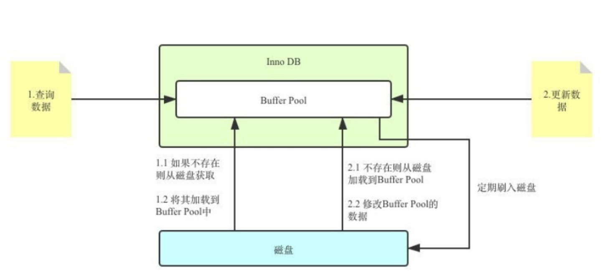

# 什么是buffer pool

MySQL的数据是存储在磁盘上面的（Memory引擎除外），但是如果每次数据的查询和修改都直接和磁盘交互的话，性能是很差的。

于是，为了提升读写性能，Innodb引擎就引入了一个中间层，就是buffer pool。

buffer是在内存上的一块连续空间，他主要的用途就是用来缓存数据页的，每个数据页的大小默认是16KB

:::tip

页是Innodb做数据存储的单元，无论是在磁盘，还是buffe pool中，都是按照页读取的，这也是一种“预读”的思想。

:::

## 查询数据

有了buffer pool之后，当我们想要做数据查询的时候，InnoDB会首先检查Buffer Pool中是否存在该数据

- 如果存在，数据就可以直接从内存中（buffer pool）获取，避免了频繁的磁盘读取，从而提高查询性能
- 如果不存在再去磁盘中进行读取，磁盘中如果找到了的数据，则会把该数据所在的页直接复制一份到buffer pool中，并返回给客户端，后续的话再次读取就可以从buffer pool中就近读取了



## 修改数据

当需要修改的时候也一样，需要先在buffer pool中做修改，然后再把他写入到磁盘中。

但是因为buffer pool是基于内存的，所以空间不可能无限大，他的默认大小是`128M`，当然这个大小也不是完全固定的，我们可以调整，可以通过修改MySQL配置文件中的`innodb_buffer_pool_size`参数来调整Buffer Pool的大小

比如改为256MB，方法如下：

```sql
set global innodb_buffer_pool_size = 268435456;
```

或者

```ini
[server] 
innodb_buffer_pool_size = 268435456
```

## 读写过程

> [buffer pool的读写流程](./bufferpool的读写流程.md)
