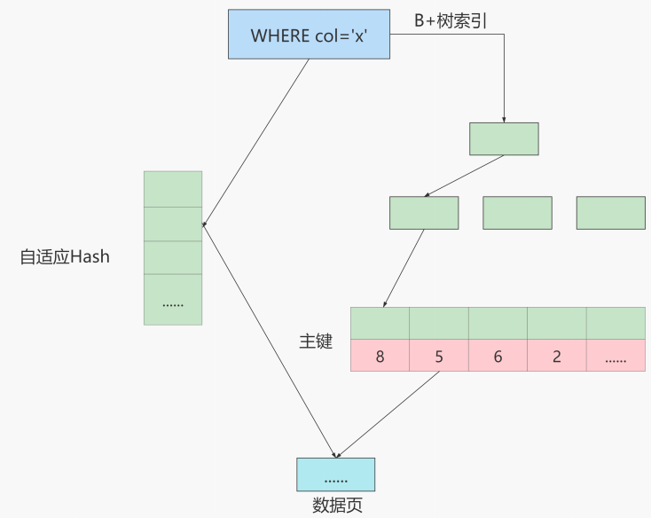

# 什么是自适应Hash索引

## 口语化

自适应哈希索引是Innodb引擎的一个特殊功能，当它注意到某些索引值被使用的非常频繁时，会在内存中基于B-Tree之上再创建一个哈希索引，这就让B-Tree索引也具有哈希索引的一些优点，比如快速哈希查找。这是一个完全自动的内部行为，用户无法控制或配置

需要注意的是，InnoDB 本身不支持 Hash 索引，但是提供**自适应 Hash 索引**。

## 什么情况下才会使用自适应 Hash 索引呢？

如果某个数据经常被访问，当满足一定条件的时候，就会将这个数据页的地址存放到 Hash 表中。这样下次查询的时候，就可以直接找到这个页面的所在位置。这样 B + 树也具备了 Hash 索引的优点。



采用自适应 Hash 索引目的是方便根据 SQL 的查询条件加速定位到叶子节点，特别是当 B+ 树比较深的时候，通过自适应 Hash 索引可以明显提高数据的检索效率。

我们可以通过 `innodb_adaptive_hash_index` 变量来查看是否开启了自适应 Hash，比如：

```sql
mysql> show variables like '%adaptive_hash_index';
```
