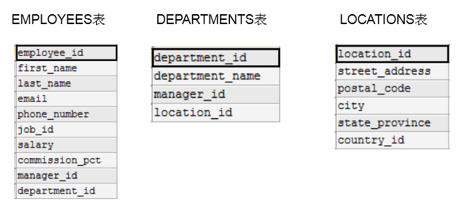
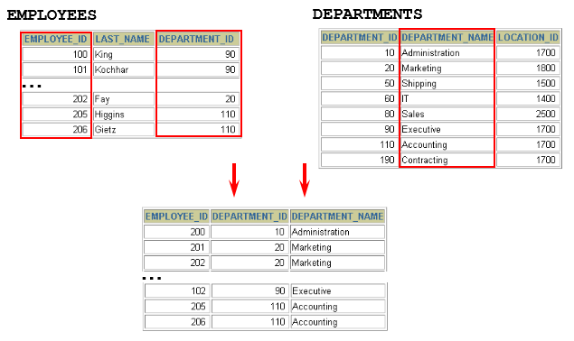
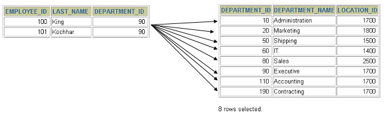
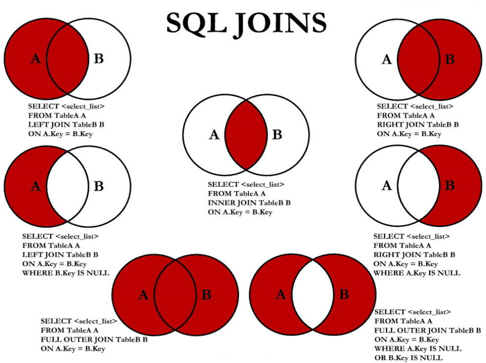

# 多表查询

`多表查询`，也称为`关联查询`，指两个或更多个表一起完成查询操作。

多表查询的前提条件：这些一起查询的表之间是有关系的（如：一对一、一对多），它们之间一定是有关联字段，这个关联字段可能建立了外键，也可能没有建立外键。比如：员工表和部门表，这两个表依靠“部门编号”进行关联。

## 一个案例引发的多表连接

### 案例说明

示例：查询员工的姓名及其部门名称



从多个表中获取数据：



```sql
SELECT last_name, department_name FROM employees, departments;
```



查询结果：

```sql
+-----------+----------------------+
| last_name | department_name      |
+-----------+----------------------+
| King      | Administration       |
| King      | Marketing            |
| King      | Purchasing           |
| King      | Human Resources      |
| King      | Shipping             |
| King      | IT                   |
| King      | Public Relations     |
| King      | Sales                |
| King      | Executive            |
| King      | Finance              |
| King      | Accounting           |
| King      | Treasury             |
...
| Gietz     | IT Support           |
| Gietz     | NOC                  |
| Gietz     | IT Helpdesk          |
| Gietz     | Government Sales     |
| Gietz     | Retail Sales         |
| Gietz     | Recruiting           |
| Gietz     | Payroll              |
+-----------+----------------------+
2889 rows in set (0.01 sec)
```

**思考**：为什么是2889条记录呢？

**分析错误情况：**

```sql
SELECT COUNT(employee_id) FROM employees;
#输出107行

SELECT COUNT(department_id)FROM departments;
#输出27行

SELECT 107*27 FROM dual;
```

我们把上述多表查询中出现的问题称为：笛卡尔积的错误。

> 需要说明的是，笛卡尔积本身不是错误，它是一种数学运算。只是恰到我们这里产生了笛卡尔积现象。出现这种现在的原因是因为我们的多表连接缺少连接条件

### 笛卡尔积（或交叉连接）的理解

笛卡尔乘积是一个数学运算。假设我有两个集合 X 和 Y，那么 X 和 Y 的笛卡尔积就是 X 和 Y 的所有可能组合，也就是第一个对象来自于 X，第二个对象来自于 Y 的所有可能。组合的个数即为两个集合中元素个数的乘积数。


SQL92中，笛卡尔积也称为`交叉连接`（ `CROSS JOIN`）

在 SQL99 中也是使用 CROSS JOIN表示交叉连接。它的作用就是可以把任意表进行连接，即使这两张表不相关。

在MySQL中如下情况会出现笛卡尔积：

```sql
#查询员工姓名和所在部门名称
SELECT last_name,department_name FROM employees,departments;

SELECT last_name,department_name FROM employees CROSS JOIN departments;

SELECT last_name,department_name FROM employees INNER JOIN departments;

SELECT last_name,department_name FROM employees JOIN departments;
```

### 案例分析与问题解决

- **笛卡尔积的错误会在下面条件下产生**：

  - 省略多个表的连接条件（或关联条件）
  - 连接条件（或关联条件）无效
  - 所有表中的所有行互相连接

- 为了避免笛卡尔积， 可以**在 WHERE 加入有效的连接条件。**

- 加入连接条件后，查询语法：

  ```sql
  SELECT table1.column, table2.column
  FROM table1, table2
  WHERE table1.column1 = table2.column2;  #连接条件
  ```

  - **在 WHERE子句中写入连接条件。**

- **如果查询语句中出现了在多个表都存在的字段，则必须指明此字段所在的表（即在列名之前加上表名前缀）**

上面示例的正确写法如下：

```sql
# 查询员工的姓名及其部门名称
SELECT last_name, department_name
FROM employees, departments
WHERE employees.department_id = departments.department_id;
```

:::warning 建议

从SQL优化的角度，建议多表查询时，每个字段都指明其所在的表。

:::

## 多表查询分类

### 分类1：等值连接 vs 非等值连接

> [多表查询分类——按连接条件类型划分](./多表查询分类.md#按连接条件类型划分)

#### 扩展

##### 区分重复的列名

- **多个表中有相同列时，必须在列名之前加上表名前缀。**
- 在不同表中具有相同列名的列可以用`表名`加以区分。

```sql
SELECT employees.last_name, departments.department_name,employees.department_id
FROM employees, departments
WHERE employees.department_id = departments.department_id;
```

##### 表的别名

- 使用别名可以简化查询。
- 列名前使用表名前缀可以提高查询效率。

```sql
SELECT e.employee_id, e.last_name, e.department_id,
      d.department_id, d.location_id
FROM employees e , departments d
WHERE  e.department_id = d.department_id;
```

:::warning

需要注意的是，如果我们使用了表的别名，在查询字段中、过滤条件中就只能使用别名进行代替，不能使用原有的表名，否则就会报错。

:::

###### 阿里规约

<span style="color: var(--alibaba-qiangzhi-text-color);">【强制】</span>对于数据库中表记录的查询和变更，只要涉及多个表，都需要在列名前加表的别名（或 表名）进行限定。

<span style="color: var(--alibaba-shuoming-text-color);">说明：</span>对多表进行查询记录、更新记录、删除记录时，如果对操作列没有限定表的别名（或表名），并且操作列在多个表中存在时，就会抛异常。

<span style="color: var(--alibaba-zhengli-text-color)">正例：</span>select t1.name from table_first as t1 , table_second as t2 where t1.id=t2.id;

<span style="color: var(--alibaba-fanli-text-color)">反例：</span>在某业务中，由于多表关联查询语句没有加表的别名（或表名）的限制，正常运行两年后，最近在 某个表中增加一个同名字段，在预发布环境做数据库变更后，线上查询语句出现出 1052 异常：Column  'name' in field list is ambiguous。

##### 连接多个表

- 连接 n个表,至少需要n-1个连接条件。比如，连接三个表，至少需要两个连接条件。

### 分类2：自连接 vs 非自连接

> [多表查询分类——按连接表的关系划分](./多表查询分类.md#按连接表的关系划分)

### 分类3：内连接 vs 外连接

> [多表查询分类——按连接表的关系划分](./多表查询分类.md#按结果集包含范围划分)

#### SQL92：使用(+)创建连接

- 在 SQL92 中采用 `(+)` 代表从表所在的位置。即左或右外连接中，`(+)` 表示哪个是`从表`。

- Oracle 对 SQL92 支持较好，而 MySQL 则不支持 SQL92 的外连接。

```sql
#左外连接
SELECT last_name,department_name
FROM employees ,departments
WHERE employees.department_id = departments.department_id(+);

#右外连接
SELECT last_name,department_name
FROM employees ,departments
WHERE employees.department_id(+) = departments.department_id;
```

- 而且在 SQL92 中，只有左外连接和右外连接，没有满（或全）外连接。

## SQL99语法实现多表查询

### 基本语法

- 使用JOIN...ON子句创建连接的语法结构：

```sql
SELECT table1.column, table2.column,table3.column
FROM table1
    JOIN table2 ON table1 和 table2 的连接条件
        JOIN table3 ON table2 和 table3 的连接条件
```

它的嵌套逻辑类似我们使用的 FOR 循环：

```sql
for t1 in table1:
    for t2 in table2:
        if condition1:
            for t3 in table3:
              if condition2:
                  output t1 + t2 + t3
```

SQL99 采用的这种嵌套结构非常清爽、层次性更强、可读性更强，即使再多的表进行连接也都清晰可见。如果你采用 SQL92，可读性就会大打折扣。

- 语法说明：
  - **可以使用 `ON` 子句指定额外的连接条件**。
  - 这个连接条件是与其它条件分开的。
  - **`ON`子句使语句具有更高的易读性**。
  - 关键字 `JOIN`、`INNER JOIN`、`CROSS JOIN`的含义是一样的，都表示内连接

### 内连接(INNER JOIN)的实现

- 语法：

```sql
SELECT 字段列表
FROM A表 INNER JOIN B表
ON 关联条件
WHERE 等其他子句;
```

示例1：

```sql
SELECT e.employee_id, e.last_name, e.department_id, 
       d.department_id, d.location_id
FROM employees e JOIN departments d
ON (e.department_id = d.department_id);
```

示例2：

```sql
SELECT employee_id, city, department_name
FROM employees e
JOIN departments d
ON d.department_id = e.department_id 
JOIN locations l
ON d.location_id = l.location_id;
```

### 外连接(OUTER JOIN)的实现

#### 左外连接(LEFT OUTER JOIN)

- 语法：

```sql
#实现查询结果是A
SELECT 字段列表
FROM A表 LEFT JOIN B表
ON 关联条件
WHERE 等其他子句;
```

- 举例：

```sql
SELECT e.last_name, e.department_id, d.department_name
FROM employees e
LEFT OUTER JOIN departments d
ON (e.department_id = d.department_id);
```

#### 右外连接(RIGHT OUTER JOIN)

- 语法：

```sql
#实现查询结果是B
SELECT 字段列表
FROM A表 RIGHT JOIN B表
ON 关联条件
WHERE 等其他子句;
```

- 举例：

```sql
SELECT e.last_name, e.department_id, d.department_name
FROM employees e
RIGHT OUTER JOIN departments d
ON (e.department_id = d.department_id) ;
```

> 需要注意的是，`LEFT JOIN` 和 `RIGHT JOIN` 只存在于 SQL99 及以后的标准中，在 SQL92 中不存在，只能用 `(+)` 表示。

#### 满外连接(FULL OUTER JOIN)

- 满外连接的结果 = 左右表匹配的数据 + 左表没有匹配到的数据 + 右表没有匹配到的数据。
- SQL99是支持满外连接的。使用`FULL JOIN` 或 `FULL OUTER JOIN`来实现。
- 需要注意的是，MySQL不支持FULL JOIN，但是可以用 LEFT JOIN `UNION` RIGHT join代替。

## UNION的使用

**合并查询结果**

利用UNION关键字，可以给出多条SELECT语句，并将它们的结果组合成单个结果集。合并时，两个表对应的列数和数据类型必须相同，并且相互对应。各个SELECT语句之间使用`UNION`或`UNION ALL`关键字分隔。

语法格式：

```sql
SELECT column,... FROM table1
UNION [ALL]
SELECT column,... FROM table2
```

**UNION操作符**

UNION 操作符返回两个查询的结果集的并集，去除重复记录。

**UNION ALL操作符**

UNION ALL操作符返回两个查询的结果集的并集。对于两个结果集的重复部分，不去重。

:::warning 注意

执行UNION ALL语句时所需要的资源比UNION语句少。如果明确知道合并数据后的结果数据不存在重复数据，或者不需要去除重复的数据，则尽量使用UNION ALL语句，以提高数据查询的效率。

:::

---

举例1：查询部门编号>90或邮箱包含a的员工信息

```sql
#方式1
SELECT * FROM employees WHERE email LIKE '%a%' OR department_id>90;
```

```sql
#方式2
SELECT * FROM employees  WHERE email LIKE '%a%'
UNION
SELECT * FROM employees  WHERE department_id>90;
```

举例2：查询中国用户中男性的信息以及美国用户中年男性的用户信息

```sql
SELECT id,cname FROM t_chinamale WHERE csex='男'
UNION ALL
SELECT id,tname FROM t_usmale WHERE tGender='male';
```

## 7种SQL JOINS的实现



```sql
#中图：内连接 A∩B
SELECT employee_id,last_name,department_name
FROM employees e JOIN departments d
ON e.`department_id` = d.`department_id`;
```

```sql
#左上图：左外连接
SELECT employee_id,last_name,department_name
FROM employees e LEFT JOIN departments d
ON e.`department_id` = d.`department_id`;
```

```sql
#右上图：右外连接
SELECT employee_id,last_name,department_name
FROM employees e RIGHT JOIN departments d
ON e.`department_id` = d.`department_id`;
```

```sql
#左中图：A - A∩B
SELECT employee_id,last_name,department_name
FROM employees e LEFT JOIN departments d
ON e.`department_id` = d.`department_id`
WHERE d.`department_id` IS NULL
```

```sql
#右中图：B-A∩B
SELECT employee_id,last_name,department_name
FROM employees e RIGHT JOIN departments d
ON e.`department_id` = d.`department_id`
WHERE e.`department_id` IS NULL
```

```sql
#左下图：满外连接
# 左中图 + 右上图  A∪B
SELECT employee_id,last_name,department_name
FROM employees e LEFT JOIN departments d
ON e.`department_id` = d.`department_id`
WHERE d.`department_id` IS NULL
UNION ALL  #没有去重操作，效率高
SELECT employee_id,last_name,department_name
FROM employees e RIGHT JOIN departments d
ON e.`department_id` = d.`department_id`;
```

```sql
#右下图
#左中图 + 右中图  A ∪B- A∩B 或者 (A -  A∩B) ∪ (B - A∩B)
SELECT employee_id,last_name,department_name
FROM employees e LEFT JOIN departments d
ON e.`department_id` = d.`department_id`
WHERE d.`department_id` IS NULL
UNION ALL
SELECT employee_id,last_name,department_name
FROM employees e RIGHT JOIN departments d
ON e.`department_id` = d.`department_id`
WHERE e.`department_id` IS NULL
```

### 语法格式小结

- 左中图

```sql
#实现 A -  A∩B
select 字段列表
from A表 left join B表
on 关联条件
where 从表关联字段 is null and 等其他子句;
```

- 右中图

```sql
#实现 B -  A∩B
select 字段列表
from A表 right join B表
on 关联条件
where 从表关联字段 is null and 等其他子句;
```

- 左下图

```sql
#实现查询结果是A∪B
#用左外的A，union 右外的B
select 字段列表
from A表 left join B表
on 关联条件
where 等其他子句

union 

select 字段列表
from A表 right join B表
on 关联条件
where 等其他子句;
```

- 右下图

```sql
#实现A∪B -  A∩B  或   (A -  A∩B) ∪ (B - A∩B)
#使用左外的 (A -  A∩B)  union 右外的 (B - A∩B)
select 字段列表
from A表 left join B表
on 关联条件
where 从表关联字段 is null and 等其他子句

union

select 字段列表
from A表 right join B表
on 关联条件
where 从表关联字段 is null and 等其他子句
```

## SQL99语法新特性

### 自然连接（NATURAL JOIN）

SQL99 在 SQL92 的基础上提供了一些特殊语法，比如 `NATURAL JOIN` 用来表示自然连接。我们可以把自然连接理解为 SQL92 中的等值连接。它会帮你自动查询两张连接表中`所有相同的字段`，然后进行`等值连接`。

在SQL92标准中：

```sql
SELECT employee_id,last_name,department_name
FROM employees e JOIN departments d
ON e.`department_id` = d.`department_id`
AND e.`manager_id` = d.`manager_id`;
```

在 SQL99 中你可以写成：

```sql
SELECT employee_id,last_name,department_name
FROM employees e NATURAL JOIN departments d;
```

:::tip

在开发中，这种语法比较鸡肋，一般无用，了解即可。

真实开发中，我们使用的都是逻辑关联，且关联字段一般不会同名。如：role表的id 和 user_role表的role_id就是一组连接条件。

:::

### USING连接

当我们进行连接的时候，SQL99还支持使用 USING 指定数据表里的`同名字段`进行等值连接。但是只能配合JOIN一起使用。比如：

```sql
SELECT employee_id,last_name,department_name
FROM employees e JOIN departments d
USING (department_id);
```

你能看出与自然连接 NATURAL JOIN 不同的是，USING 指定了具体的相同的字段名称，你需要在 USING 的括号 () 中填入要指定的同名字段。同时使用 `JOIN...USING` 可以简化 JOIN ON 的等值连接。它与下面的 SQL 查询结果是相同的：

```sql
SELECT employee_id,last_name,department_name
FROM employees e ,departments d
WHERE e.department_id = d.department_id;
```

:::tip

这种语法也是比较鸡肋的，了解即可。理由不再赘述

:::

## 总结

表连接的约束条件可以有三种方式：WHERE, ON, USING

- `WHERE`：适用于所有关联查询

- `ON`：只能和JOIN一起使用，只能写关联条件。虽然关联条件可以并到WHERE中和其他条件一起写，但分开写可读性更好。

- `USING`：只能和JOIN一起使用，而且要求**两个**关联字段在关联表中名称一致，而且只能表示关联字段值相等

```sql
#关联条件
#把关联条件写在where后面
SELECT last_name,department_name 
FROM employees,departments 
WHERE employees.department_id = departments.department_id;

#把关联条件写在on后面，只能和JOIN一起使用
SELECT last_name,department_name 
FROM employees INNER JOIN departments 
ON employees.department_id = departments.department_id;

SELECT last_name,department_name 
FROM employees CROSS JOIN departments 
ON employees.department_id = departments.department_id;

SELECT last_name,department_name  
FROM employees JOIN departments 
ON employees.department_id = departments.department_id;

#把关联字段写在using()中，只能和JOIN一起使用
#而且两个表中的关联字段必须名称相同，而且只能表示=
#查询员工姓名与基本工资
SELECT last_name,job_title
FROM employees INNER JOIN jobs USING(job_id);

#n张表关联，需要n-1个关联条件
#查询员工姓名，基本工资，部门名称
SELECT last_name,job_title,department_name FROM employees,departments,jobs 
WHERE employees.department_id = departments.department_id 
AND employees.job_id = jobs.job_id;

SELECT last_name,job_title,department_name 
FROM employees INNER JOIN departments INNER JOIN jobs 
ON employees.department_id = departments.department_id 
AND employees.job_id = jobs.job_id;
```

### 阿里规约

我们要`控制连接表的数量`。多表连接就相当于嵌套 for 循环一样，非常消耗资源，会让 SQL 查询性能下降得很严重，因此不要连接不必要的表。在许多 DBMS 中，也都会有最大连接表的限制。

<span style="color: var(--alibaba-qiangzhi-text-color);">【强制】</span>超过三个表禁止 join。需要 join 的字段，数据类型保持绝对一致；多表关联查询时， 保证被关联的字段需要有索引。

<span style="color: var(--alibaba-shuoming-text-color);">说明：</span>即使双表 join 也要注意表索引、SQL 性能。

## 扩展

### ON 和 WHERE 的区别

- 在多表连接时，SQL 会根据连接条件生成一张新的临时表。`ON` 就是连接条件，它`决定临时表的生成`
- `WHERE` 是在临时表生成以后，再对临时表中的数据进行`过滤`，生成最终的结果集，这个时候已经没有 JOIN-ON 了

所以，我们在书写SQL时一般会先根据 ON 生成一张临时表，然后再根据 WHERE 对临时表进行筛选

### 常用的 SQL 标准有哪些（了解）

我们需要了解的是，SQL 存在不同版本的标准规范，因为不同规范下的表连接操作是有区别的。

SQL 有两个主要的标准，分别是 `SQL92` 和 `SQL99`。92 和 99 代表了标准提出的时间，SQL92 就是 92 年提出的标准规范。当然除了 SQL92 和 SQL99 以外，还存在 SQL-86、SQL-89、SQL:2003、SQL:2008、SQL:2011 和 SQL:2016 等其他的标准。

这么多标准，到底该学习哪个呢？

**实际上最重要的 SQL 标准就是 SQL92 和 SQL99**。

- 一般来说 SQL92 的形式更简单，但是写的 SQL 语句会比较长，可读性较差。
- 而 SQL99 相比于 SQL92 来说，语法更加复杂，但可读性更强。

我们从这两个标准发布的页数也能看出，SQL92 的标准有 500 页，而 SQL99 标准超过了 1000 页。实际上从 SQL99 之后，很少有人能掌握所有内容，因为确实太多了。就好比我们使用 Windows、Linux 和 Office 的时候，很少有人能掌握全部内容一样。我们只需要掌握一些核心的功能，满足日常工作的需求即可。

**SQL92 和 SQL99 是经典的 SQL 标准，也分别叫做 SQL-2 和 SQL-3 标准**。也正是在这两个标准发布之后，SQL 影响力越来越大，甚至超越了数据库领域。现如今 SQL 已经不仅仅是数据库领域的主流语言，还是信息领域中信息处理的主流语言。在图形检索、图像检索以及语音检索中都能看到 SQL 语言的使用。