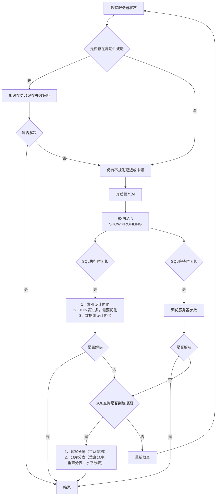

# 性能分析工具的使用

在数据库调优中，我们的目标就是`响应时间更快，吞吐量更大`。利用宏观的监控工具和微观的日志分析可以帮我们快速找到调优的思路和方式。

## 数据库服务器的优化步骤

当我们遇到数据库调优问题的时候，该如何思考呢？这里把思考的流程整理成下面这张图。

:::details 查看



:::

## 查看系统性能参数

在 MySQL 中，可以使用 `SHOW STATUS` 语句查询一些 MySQL 数据库服务器的`性能参数`、`执行频率`。

SHOW STATUS 语句语法：

```sql
SHOW [GLOBAL|SESSION] STATUS LIKE '参数';
```

**一些常用性能参数如下：**

- `Connections`：连接 MySQL 服务器的次数。
- `Uptime`：MySQL 服务器的上线时间。
- `Slow_queries`：慢查询的次数。
- `Innodb_rows_read`：Select 查询返回的行数。
- `Innodb_rows_inserted`：执行 INSERT 操作插入的行数。
- `Innodb_rows_updated`：执行 UPDATE 操作更新的行数。
- `Innodb_rows_deleted`：执行 DELETE 操作删除的行数。
- `Com_select`：查询操作的次数。
- `Com_insert`：插入操作的次数。对于批量插入的 INSERT 操作，只累加一次。
- `Com_update`：更新操作的次数。
- `Com_delete`：删除操作的次数。

示例：

```sql
-- 查询MySQL服务器的连接次数
SHOW STATUS LIKE 'Connections';

-- 查询MySQL服务器的上线时间
SHOW STATUS LIKE 'Uptime';

-- 查询MySQL服务器的慢查询次数
SHOW STATUS LIKE 'Slow_queries';
-- 慢查询次数可以结合慢查询日志找出慢查询语句，然后针对慢查询语句进行 表结构优化 和 查询语句优化
```

## 统计SQL的查询成本：last_query_cost

> last_query_cost以翻译的角度来看，就是最后一次查询的成本。实际上它的作用也确实如此

一条 SQL 查询语句在执行前需确定查询执行计划，若存在多种执行计划，MySQL 会计算每个执行计划的成本，选择**成本最小**的作为最终执行计划。

这里需要强调的的是，**最小成本并不一定意味着执行时间最短**，他仅仅指的是页的读取次数最少。

如果我们要查看某条 SQL 语句的查询成本，  可以在执行完这条SQL语句之后，通过查看当前会话中的`last_query_cost`变量值获取当前查询的成本。它通常也是我们`评价一个查询执行效率`的常用指标。这个查询成本对应的是`SQL 语句需要读取的页的数量`。

:::tip

**last_query_cost使用场景**：对于比较开销非常有用，尤其是有多种查询方式可选时

:::

:::details 数据准备

数据依然使用的是 [索引设计原则](./索引设计原则.md) 中的`student`表，此表有100w条数据。

此处不再赘述。

:::

如果我们想要查询 id=900001 的记录，然后看下查询成本，我们可以直接在聚簇索引上进行查找:

```sql
SELECT student_id, class_id, name, create_time FROM student_info WHERE id = 900001;
```

运行结果（1 条记录，运行时间为 0.042s）。然后再看下查询优化器的成本，实际上我们只需要检索一个页即可:

```sql
mysql> SHOW STATUS LIKE 'last_query_cost';
+-----------------+----------+
| Variable_name   | Value    |
+-----------------+----------+
| Last_query_cost | 1.000000 |
+-----------------+----------+
```

如果我们想要查询 id 在 900001 到 9000100 之间的学生记录呢？

```sql
SELECT student_id, class_id, NAME, create_time FROM student_info WHERE id BETWEEN 900001 AND 900100;
```

运行结果（100 条记录，运行时间为 0.046s）。然后再看下查询优化器的成本，这时我们大概需要进行 20 个页的查询。

```sql
mysql> SHOW STATUS LIKE 'last_query_cost';
+-----------------+-----------+
| Variable_name   | Value     |
+-----------------+-----------+
| Last_query_cost | 21.134453 |
+-----------------+-----------+
```

可以看到页的数量是刚才的 20 倍，但是查询的效率并没有明显的变化，实际上这两个 SQL 查询的时间两个 SQL 查询时间基本一致。

原因是采用顺序读取方式将页面一次性加载到缓冲池（buffer bool）中再查找，尽管**last_query_cost（页数量）增加不少**，但通过缓冲池机制，查询时间未明显增加。

> SQL 查询是一个动态的过程，从页加载的角度来看，我们可以得到以下两点结论：
>
> 1. `位置决定效率`。如果页就在数据库`缓冲池`中，那么效率是最高的，否则还需要从`内存`或者`磁盘`中进行读取，当然针对单个页的读取来说，如果页存在于内存中，会比在磁盘中读取效率高很多。
> 2. `批量决定效率`。如果我们从磁盘中对单一页进行随机读，那么效率是很低的（差不多10ms），而采用顺序读取的方式，批量对页进行读取，平均一页的读取效率就会提升很多，甚至要快于单个页面在内存中的随机读取。
>
> 所以说，遇到I/O并不用担心，方法找对了，效率还是很高的。我们首先要考虑数据存放的位置，如果是经常使用的数据就要尽量放到`缓冲池`中，其次我们可以充分利用磁盘的吞吐能力，一次性批量读取数据，这样单个页的读取效率也就得到了提升。

## 慢查询日志（slow query log）：定位执行慢的SQL {#slow-query-log}

MySQL的慢查询日志，是用来记录在MySQL中`响应时间超过阈值`的SQL语句的。具体来说就是指运行时间超过`long_query_time`的值的SQL，则会被记录到慢查询日志中。

`long_query_time`的默认值为`10`，意思是运行10秒以上（不含10秒）的语句，认为是超出了我们的最大忍耐时间值，我们也就认为是慢查询语句。

:::warning

默认情况下，MySQL数据库`没有开启慢查询日志`，需要我们手动来设置这个参数。

`如果不是调优需要的话，一般不建议启动该参数`，因为开启慢查询日志会或多或少带来一定的性能影响。

:::

### 开启慢查询日志参数

1. 开启slow_query_log

```sql
set global slow_query_log='ON';
```

查看下慢查询日志是否开启，以及慢查询日志文件的位置：

```sql
show variables like `%slow_query_log%`;
```

2. 修改long_query_time阈值

```sql
show variables like '%long_query_time%';
```

示例：

```sql
#测试发现：
#  设置global的方式对当前session的long_query_time失效。
#  对新连接的客户端有效。所以可以一并 执行下述语句 

-- 设置全局的long_query_time
mysql> set global long_query_time = 1; 
mysql> show global variables like '%long_query_time%'; 

-- 设置当前session的long_query_time
mysql> set long_query_time=1; 
mysql> show variables like '%long_query_time%';
```

:::details 补充——配置文件中一并设置参数（永久配置）

如下的方式相较与前面的命令行方式，可以看作是永久配置的方式

修改`my.cnf`配置文件，在[mysqld]下添加如下内容，并重启MySQL服务器：

```shell
[mysqld]
slow_query_log=ON # 开启慢查询日志
slow_query_log_file='/var/lib/mysql/test-slow.log' # 慢查询日志的文件夹和文件名信息
long_query_time=3 # 慢查询阈值，单位为秒。超出3秒的SQL语句，就会记录到慢查询日志中
log_output=FILE
```

如果不指定存储路径，慢查询日志将默认存储在MySQL数据库的数据目录下。

如果不指定文件名，默认文件名为`hostname-slow.log`。

:::

### 查看慢查询数目

查询当前系统中有多少条慢查询记录：

```sql
SHOW GLOBAL STATUS LIKE '%Slow_queries%';
```

#### 扩展：min_examined_row_limit

**`long_query_time`值并不能够完全决定一个查询是否是慢查询，并写入到慢查询日志中。**

除了`long_query_time`变量，控制慢查询日志的还有一个系统变量：`min_examined_row_limit`。这个变量的意思是，查询`扫描过的最少记录数`。这个变量和查询执行时间，共同组成了判别一个查询是否是慢查询的条件。

如果查询扫描过的记录数大于等于这个变量的值，并且查询执行时间超过 `long_query_time` 的值，那么，这个查询就被记录到慢查询日志中；反之，则不被记录到慢查询日志中。

```sql
mysql> show variables like 'min%';
+--------------------------+-------+
| Variable_name            | Value |
+--------------------------+-------+
| min_examined_row_limit   | 0     |
+--------------------------+-------+
1 row in set, 1 warning (0.00 sec)
```

这个值默认是`0`，与 `long_query_time=10` 合在一起，表示只要查询的执行时间超过 10 秒钟，哪怕一个记录也没有扫描过，都要被记录到慢查询日志中。

你也可以根据需要，通过修改 “my.ini” 文件，来修改查询时长，或者通过 SET 指令，用 SQL 语句修改 `min_examined_row_limit` 的值。

---

**举例1**：默认 min_examined_row_limit=0，long_query_time=10 秒

- 只要 SQL 执行时间超过 10 秒，无论扫描多少行记录，都会被记录到慢查询日志

**举例2**：min_examined_row_limit=100，long_query_time=5 秒

- 某查询扫描了 80 行，执行时间 6 秒 → 因扫描行数不足 100，不会被记录到慢查询日志中
- 某查询扫描了 120 行，执行时间 4 秒 → 因执行时间未超过 5 秒，不会被记录到慢查询日志中
- 某查询扫描了 150 行，执行时间 6 秒 → 同时满足两个条件，会被记录到慢查询日志

### 慢查询日志分析工具：mysqldumpslow

在生成环境中，如果要手工分析日志，查看、分析SQL，显然是个体力活。MySQL也想到了这一点，因此它提供了 mysqldumpslow 这个日志分析工具。

在终端中执行如下命令，查看帮助信息：

```shell
mysqldumpslow --help
```

结果如下：

```shell
Usage: mysqldumpslow [ OPTS... ] [ LOGS... ]
Parse and summarize the MySQL slow query log. Options are
  --verbose    verbose
  --debug      debug
  --help       write this text to standard output
  -v           verbose
  -d           debug
  -s ORDER     what to sort by (al, at, ar, c, l, r, t), 'at' is default
                al: average lock time
                ar: average rows sent
                at: average query time
                c: count
                l: lock time
                r: rows sent
                t: query time
  -r           reverse the sort order (largest last instead of first)
  -t NUM       just show the top n queries
  -a           don't abstract all numbers to N and strings to 'S'
  -n NUM       abstract numbers with at least n digits within names
  -g PATTERN   grep: only consider stmts that include this string
  -h HOSTNAME  hostname of db server for *-slow.log filename (can be wildcard),
                default is '*', i.e. match all
  -i NAME      name of server instance (if using mysql.server startup script)
  -l           don't subtract lock time from total time
```

mysqldumpslow 命令的具体参数如下：

- `-a`: 不将数字抽象成N，字符串抽象成S。而是直接显示数字和字符串本身。
- `s`（表示以何种方式排序）：
  - `c`: 访问次数
  - `l`: 锁定时间
  - `r`: 返回记录
  - `t`: **查询时间**
  - `al`: 平均锁定时间
  - `ar`: 平均返回记录
  - `at`: 平均查询时间（默认方式）
  - `ac`: 平均查询次数
- `t`: **返回前多少条数据**
- `-g`: 后跟随正则匹配模式，大小写不敏感。

举例：按查询时间排序，查看前五条 SQL 语句

```shell
mysqldumpslow -s t -t 5 /var/lib/mysql/test-slow.log
```

执行结果示例：

```shell
Reading mysql slow query log from /var/lib/mysql/test-slow.log
Count: 1  Time=2.39s (2s)  Lock=0.00s (0s)  Rows=13.0 (13), root[root]@localhost
  SELECT * FROM student WHERE name = 'S';

Count: 1  Time=2.08s (2s)  Lock=0.00s (0s)  Rows=2.0 (2), root[root]@localhost
  SELECT * FROM student WHERE name = 'N';

Died at /usr/bin/mysqldumpslow line 162, <> chunk 2.
```

**查询到慢查询SQL语句之后，我们可以考虑使用explain 分析慢查询SQL语句的执行计划，进而优化SQL语句。**

**工作常用命令**:

```shell
# 得到返回记录最多的前 10 个 SQL
mysqldumpslow -s r -t 10 /var/lib/mysql/test-slow.log

# 得到访问次数最多的前 10 个 SQL
mysqldumpslow -s c -t 10 /var/lib/mysql/test-slow.log

# 得到按时间排序的前 10 条含左连接的查询语句：
mysqldumpslow -s t -t 10 -g "left join" /var/lib/mysql/test-slow.log

# 另外建议在使用这些命令时结合 | 和 more 使用 ，否则有可能出现爆屏情况
mysqldumpslow -s r -t 10 /var/lib/mysql/test-slow.log | more
```

### 关闭慢查询日志

**方式1：永久性方式**

```ini
[mysqld] 
slow_query_log=OFF

#或 注释掉

[mysqld] 
#slow_query_log =OFF
```

注意，修改配置文件后，需要重启数据库服务才能生效。

**方式2：临时性方式**

停止MySQL慢查询日志功能

```sql
SET GLOBAL slow_query_log=off;
```

### 删除（重新生成）慢查询日志

要删除慢查询日志，直接删除慢查询日志文件即可。

执行以下SHOW语句，可以查看慢查询日志文件所在的路径：

```sql
SHOW VARIABLES LIKE 'slow_query_log%';
-- 或
SHOW VARIABLES LIKE 'slow_query_log_file';
```

如果需要重新生成慢查询日志文件，可以执行`mysqladmin flush-logs `命令：

```shell
mysqladmin -uroot -p flush-logs slow
```

:::warning 注意

慢查询日志都是使用`mysqladmin flush-logs`命令来删除重建的。

使用时，如果旧的还需要慢查询日志，请手动保存，因为该命令会覆盖掉旧的慢查询日志。

:::

## 查看SQL执行成本：SHOW PROFILE {#show-profile}

`SHOW PROFILE` 是 MySQL 提供的可以用来分析当前会话中 SQL 都做了什么、执行的资源消耗情况的工具，可用于 sql 调优的测量。默认情况下处于**关闭**状态，并保存最近 15 次的运行结果。

我们可以在会话级别开启这个功能：

```sql
show variables like 'profiling';

# 开启
set profiling = 'ON';

# 查看
show profiles; -- 查看所有查询的成本（最近15次）

show profile; -- 查看最后一次查询的成本

show profile for query 2; -- 查看具体的某一次查询的成本

show profile cpu,block io for query 2;
```

**show profile 的常用查询参数**：

- `ALL`：显示所有的开销信息。
- `BLOCK IO`：显示块 IO 开销。
- `CONTEXT SWITCHES`：上下文切换开销。
- `CPU`：显示 CPU 开销信息。
- `IPC`：显示发送和接收开销信息。
- `MEMORY`：显示内存开销信息。
- `PAGE FAULTS`：显示页面错误开销信息。
- `SOURCE`：显示和 Source_function，Source_file，Source_line 相关的开销信息。
- `SWAPS`：显示交换次数开销信息。

:::warning

**日常开发中需要注意的一些结论**：

- `converting HEAP to MyISAM`：查询结果太大，内存不够，数据往磁盘上搬了。
- `Creating tmp table`：创建临时表。先拷贝数据到临时表，用完后再删除临时表。
- `Copying to tmp table on disk`：把内存中临时表复制到磁盘上，警惕！
- `locked`：锁

如果在 show profile 诊断结果中出现了以上 4 条结果中的任何一条，则 sql 语句需要优化。

:::

:::danger

SHOW PROFILE 命令将被弃用，我们可以从 information_schema 中的 profiling 数据表进行查看。

:::

## 分析查询语句：EXPLAIN

**定位了查询慢的 SQL 之后，我们就可以使用 `EXPLAIN` 或 `DESCRIBE` 工具做针对性的分析查询语句。** 

DESCRIBE 语句的使用方法与 EXPLAIN 语句是一样的，并且分析结果也是一样的。

MySQL 中有专门负责优化 SELECT 语句的优化器模块，主要功能：通过计算分析系统中收集到的统计信息，为客户端请求的 Query 提供它认为最优的`执行计划`（他认为最优的数据检索方式，但不见得是 DBA 认为是最优的，这部分最耗费时间）。

这个执行计划展示了接下来具体执行查询的方式，比如多表连接的顺序是什么，对于每个表采用什么访问方法来具体执行查询等等。MySQL 为我们提供了 `EXPLAIN` 语句来帮助我们查看某个查询语句的具体执行计划，如果能看懂 `EXPLAIN` 语句的各个输出项，可以有针对性的提升我们查询语句的性能。

**思考：EXPLAIN能做什么？**

- 表的读取顺序
- 数据读取操作的操作类型
- 哪些索引可以使用
- 哪些索引被实际使用
- 表之间的引用
- 每张表有多少行被优化器查询

**官网介绍**

https://dev.mysql.com/doc/refman/5.7/en/explain-output.html

https://dev.mysql.com/doc/refman/8.0/en/explain-output.html

**版本情况**

- MySQL 5.6.3 以前只能 `EXPLAIN SELECT`；MYSQL 5.6.3 以后就可以 `EXPLAIN SELECT，UPDATE，DELETE`
- 在 5.7 以前的版本中
  - 想要显示 `partitions` 需要使用 `explain partitions` 命令
  - 想要显示 `filtered` 需要使用 `explain extended` 命令。  
- 在 5.7 版本后，默认 explain 直接显示 partitions 和 filtered 中的信息。

:::warning 注意

需要注意的是，执行 EXPLAIN 时并没有真正的执行该后面的语句，因此可以安全的查看执行计划。仅仅只是生成了执行计划

例如：

```sql
-- 只是查看执行计划，并没有真正的去查询数据
EXPLAIN SELECT * FROM student_info;

-- 只是查看执行计划，并没有真正的去删除数据
EXPLAIN DELETE FROM student_info WHERE id = 1;

-- 只是查看执行计划，并没有真正的去更新数据
EXPLAIN UPDATE student_info SET name = 'S' WHERE id = 1;
```

:::

:::warning 误区

有些人可以会认为EXPLAIN 只能查看 SELECT 的执行计划，其实 EXPLAIN 可以用来分析 UPDATE、DELETE、INSERT、REPLACE 等语句的执行计划。但我们在日常工作中，更多的是分析 SELECT 语句的执行计划。

:::

### 基本语法

EXPLAIN 或 DESCRIBE 语句的语法形式如下：

```sql
EXPLAIN SELECT select_options 

-- 或者

DESCRIBE SELECT select_options
```

如果我们想看看某个查询的执行计划的话，可以在具体的查询语句前边加一个 EXPLAIN，就像这样：

```sql
mysql> EXPLAIN SELECT 1;
+----+-------------+-------+------------+------+---------------+------+---------+------+------+----------+-------------+
| id | select_type | table | partitions | type | possible_keys | key  | key_len | ref  | rows | filtered | Extra       |
+----+-------------+-------+------------+------+---------------+------+---------+------+------+----------+-------------+
| 1  | SIMPLE      | NULL  | NULL       | NULL | NULL          | NULL | NULL    | NULL | NULL | NULL     | No tables used |
+----+-------------+-------+------------+------+---------------+------+---------+------+------+----------+-------------+
1 row in set, 1 warning (0.01 sec)
```

输出的上述信息就是所谓的执行计划。

在这个执行计划的辅助下，我们需要知道应该怎样改进自己的查询语句以使查询执行起来更高效。其实除了以 SELECT 开头的查询语句，其余的 DELETE、INSERT、REPLACE 以及 UPDATE 语句等都可以加上 EXPLAIN，用来查看这些语句的执行计划，只是平时我们对 SELECT 语句更感兴趣。

EXPLAIN 语句输出的各个列的作用如下：

| 列名            | 描述                                                     |
| --------------- | -------------------------------------------------------- |
| `id`            | 在一个大的查询语句中每个SELECT关键字都对应一个`唯一的id` |
| `select_type`   | SELECT关键字对应的那个查询的类型                         |
| `table`         | 表名                                                     |
| `partitions`    | 匹配的分区信息                                           |
| `type`          | 针对单表的访问方法                                       |
| `possible_keys` | 可能用到的索引                                           |
| `key`           | 实际上使用的索引                                         |
| `key_len`       | 实际使用到的索引长度                                     |
| `ref`           | 当使用索引列等值查询时，与索引列进行等值匹配的对象信息   |
| `rows`          | 预估的需要读取的记录条数                                 |
| `filtered`      | 某个表经过搜索条件过滤后剩余记录条数的百分比             |
| `Extra`         | 一些额外的信息                                           |

### EXPLAIN各列作用

:::details 数据准备

1. 创建表

```sql
CREATE TABLE s1 (
  id INT AUTO_INCREMENT,
  key1 VARCHAR(100),
  key2 INT,
  key3 VARCHAR(100),
  key_part1 VARCHAR(100),
  key_part2 VARCHAR(100),
  key_part3 VARCHAR(100),
  common_field VARCHAR(100),
  PRIMARY KEY (id),
  INDEX idx_key1 (key1),
  UNIQUE INDEX idx_key2 (key2),
  INDEX idx_key3 (key3),
  INDEX idx_key_part(key_part1, key_part2, key_part3)
) ENGINE=INNODB CHARSET=utf8;

CREATE TABLE s2 (
  id INT AUTO_INCREMENT,
  key1 VARCHAR(100),
  key2 INT,
  key3 VARCHAR(100),
  key_part1 VARCHAR(100),
  key_part2 VARCHAR(100),
  key_part3 VARCHAR(100),
  common_field VARCHAR(100),
  PRIMARY KEY (id),
  INDEX idx_key1 (key1),
  UNIQUE INDEX idx_key2 (key2),
  INDEX idx_key3 (key3),
  INDEX idx_key_part(key_part1, key_part2, key_part3)
) ENGINE=INNODB CHARSET=utf8;
```

2. 设置参数 log_bin_trust_function_creators

创建函数，例如触发器，需开启如下命令：允许创建函数设置：

```sql
set global log_bin_trust_function_creators=1;  # 不加global只是当前窗口有效。
```

3. 创建函数

```sql
DELIMITER //
CREATE FUNCTION rand_string( n INT)
RETURNS VARCHAR(255) #该函数返回一个字符串
BEGIN
  DECLARE chars_str VARCHAR(100) DEFAULT
  'abcdefghijklmnopqrstuvwxyzABCDEFGHIJKLMNOPQRSTUVWXYZ';
  DECLARE return_str VARCHAR(255) DEFAULT '';
  DECLARE i INT DEFAULT 0;
  WHILE i < n DO
    SET return_str = CONCAT(return_str,SUBSTRING(chars_str,FLOOR(1+(RAND()*52)),1));
    SET i = i + 1;
  END WHILE;
  RETURN return_str;
END //
DELIMITER ;
```

4. 创建存储过程

创建往 s1 表中插入数据的存储过程：

```sql
DELIMITER //
CREATE PROCEDURE insert_s1 (IN min_num INT (10),IN max_num INT (10))
BEGIN
  DECLARE i INT DEFAULT 0;
  SET autocommit = 0;
  REPEAT
    SET i = i + 1;
    INSERT INTO s1 VALUES(
    (min_num + i),
    rand_string(30),
    (min_num + 30 + i + 5),
    rand_string(6),
    rand_string(10),
    rand_string(5),
    rand_string(10),
    rand_string(100));
    UNTIL i = max_num
    END REPEAT;
    COMMIT;
END //
DELIMITER ;
```

创建往 s2 表中插入数据的存储过程：

```sql
DELIMITER //
CREATE PROCEDURE insert_s2 (IN min_num INT (10),IN max_num INT (10))
BEGIN
  DECLARE i INT DEFAULT 0;
  SET autocommit = 0;
  REPEAT
  SET i = i + 1;
  INSERT INTO s2 VALUES(
    (min_num + i),
    rand_string(6),
    (min_num + 30 + i + 5),
    rand_string(6),
    rand_string(10),
    rand_string(5),
    rand_string(10),
    rand_string(100));
  UNTIL i = max_num
  END REPEAT;
  COMMIT;
END //
DELIMITER ;
```

5. 调用存储过程

s1 表数据的添加：加入 1 万条记录:

```sql
CALL insert_s1(10001,10000);
```

s2 表数据的添加：加入 1 万条记录:

```sql
CALL insert_s2(10001,10000);
```

:::

#### table

不论我们的查询语句有多复杂，包含了多少个表 ，到最后也是需要对每个表进行`单表访问`的，所以MySQL规定**EXPLAIN语句输出的每条记录都对应着某个单表的访问方法**，该条记录的`table`列代表着该表的表名（有时不是真实的表名字，可能是简称）。

每条记录都有对应的表名，除了正常的表名外，也可能是以下列出的值：

- `<unionM,N>`：本行引用了 id 为 M 和 N 的行的 UNION 结果；
- `<derivedN>`：本行引用了 id 为 N 的表所产生的的派生表结果。派生表有可能产生自 FROM 语句中的子查询。
- `<subqueryN>`：本行引用了 id 为 N 的表所产生的的物化子查询结果。type（重要）

```sql
# table: 表名
# 查询的每一行记录都对应着一个单表
EXPLAIN SELECT * FROM s1;

#s1: 驱动表 s2: 被驱动表
EXPLAIN SELECT * FROM s1 INNER JOIN s2;
```

#### id

在一个大的查询语句中每个 SELECT 关键字都对应一个`唯一的 id`

- 如果id相同，从上往下依次执行
- id不同，id值越大的执行优先级越高

> 需要注意的是，如果行引用其他行的并集结果，则id值可以为NULL

我们写的查询语句一般都以 `SELECT` 关键字开头，比如：

```sql
-- 比较简单的查询语句里只有一个 SELECT 关键字
SELECT * FROM s1 WHERE key1 = 'a';

-- 稍微复杂一点的连接查询中也只有一个 SELECT 关键字
SELECT * FROM s1 INNER JOIN s2
ON s1.key1 = s2.key1
WHERE s1.common_field = 'a';
```

```sql
mysql> EXPLAIN SELECT * FROM s1 WHERE key1 = 'a';
+----+-------------+-------+------------+------+---------------+----------+---------+-------+------+----------+------+
| id | select_type | table | partitions | type | possible_keys | key      | key_len | ref   | rows | filtered | Extra |
+----+-------------+-------+------------+------+---------------+----------+---------+-------+------+----------+------+
| 1  | SIMPLE      | s1    | NULL       | ref  | idx_key1      | idx_key1 | 303     | const | 8    | 100.00   | NULL  |
+----+-------------+-------+------------+------+---------------+----------+---------+-------+------+----------+-------+
1 row in set, 1 warning (0.03 sec)
```

```sql
mysql> EXPLAIN SELECT * FROM s1 INNER JOIN s2;
+----+-------------+-------+------------+------+---------------+------+---------+------+-------+----------+---------------------------------------+
| id | select_type | table | partitions | type | possible_keys | key  | key_len | ref  | rows  | filtered | Extra                                 |
+----+-------------+-------+------------+------+---------------+------+---------+------+-------+----------+---------------------------------------+
| 1  | SIMPLE      | s1    | NULL       | ALL  | NULL          | NULL | NULL    | NULL | 9688  | 100.00   | NULL                                  |
| 1  | SIMPLE      | s2    | NULL       | ALL  | NULL          | NULL | NULL    | NULL | 9954  | 100.00   | Using join buffer (Block Nested Loop) |
+----+-------------+-------+------------+------+---------------+------+---------+------+-------+----------+---------------------------------------+
2 rows in set, 1 warning (0.01 sec)
```

```sql
mysql> EXPLAIN SELECT * FROM s1 WHERE key1 IN (SELECT key1 FROM s2) OR key3 = 'a';
+----+-------------+-------+------------+-------+---------------+----------+---------+------+-------+----------+-------------+
| id | select_type | table | partitions | type  | possible_keys | key      | key_len | ref  | rows  | filtered | Extra       |
+----+-------------+-------+------------+-------+---------------+----------+---------+------+-------+----------+-------------+
| 1  | PRIMARY     | s1    | NULL       | ALL   | idx_key3      | NULL     | NULL    | NULL | 9688  | 100.00   | Using where |
| 2  | SUBQUERY    | s2    | NULL       | index | idx_key1      | idx_key1 | 303     | NULL | 9954  | 100.00   | Using index |
+----+-------------+-------+------------+-------+---------------+----------+---------+------+-------+----------+-------------+
2 rows in set, 1 warning (0.02 sec)
```

```sql
mysql> EXPLAIN SELECT * FROM s1 WHERE key1 IN (SELECT key2 FROM s2 WHERE common_field = 'a');
+----+-------------+-------+------------+------+---------------+----------+---------+---------------------+------+----------+-------------------------------+
| id | select_type | table | partitions | type | possible_keys | key      | key_len | ref                 | rows | filtered | Extra                         |
+----+-------------+-------+------------+------+---------------+----------+---------+---------------------+------+----------+-------------------------------+
| 1  | SIMPLE      | s2    | NULL       | ALL  | idx_key3      | NULL     | NULL    | NULL                | 9954 | 10.00    | Using where; Start temporary  |
| 1  | SIMPLE      | s1    | NULL       | ref  | idx_key1      | idx_key1 | 303     | xiaohaizi.s2.key3   | 1    | 100.00   | End temporary                 |
+----+-------------+-------+------------+------+---------------+----------+---------+---------------------+------+----------+-------------------------------+
2 rows in set, 1 warning (0.00 sec)
```

说明：

- 查询优化器可能对涉及了子查询的查询语句进行重写，转变为【多表查询】，因此id相同。
- 具体可以使用`SHOW WARNINGS`查看查询重写详情。

```sql
mysql> EXPLAIN SELECT * FROM s1 UNION SELECT * FROM s2;
+------+---------------+------------+------------+------+---------------+------+---------+------+-------+----------+-----------------+
| id   | select_type   | table      | partitions | type | possible_keys | key  | key_len | ref  | rows  | filtered | Extra           |
+------+---------------+------------+------------+------+---------------+------+---------+------+-------+----------+-----------------+
| 1    | PRIMARY       | s1         | NULL       | ALL  | NULL          | NULL | NULL    | NULL | 9688  | 100.00   | NULL            |
| 2    | UNION         | s2         | NULL       | ALL  | NULL          | NULL | NULL    | NULL | 9954  | 100.00   | NULL            |
| NULL | UNION RESULT  | <union1,2> | NULL       | ALL  | NULL          | NULL | NULL    | NULL | NULL  | NULL     | Using temporary |
+------+---------------+------------+------------+------+---------------+------+---------+------+-------+----------+-----------------+
3 rows in set, 1 warning (0.00 sec)
```

说明：

- UNION去重，可以看到第三行id为null，table为`<union1,2>`，表示这是一个临时表，用于去重。
- 因为它不是SELECT语句，所以id为null

```sql
mysql> EXPLAIN SELECT * FROM s1 UNION ALL SELECT * FROM s2;
+----+-------------+-------+------------+------+---------------+------+---------+------+-------+----------+------+
| id | select_type | table | partitions | type | possible_keys | key  | key_len | ref  | rows  | filtered | Extra |
+----+-------------+-------+------------+------+---------------+------+---------+------+-------+----------+------+
| 1  | PRIMARY     | s1    | NULL       | ALL  | NULL          | NULL | NULL    | NULL | 9688  | 100.00   | NULL  |
| 2  | UNION       | s2    | NULL       | ALL  | NULL          | NULL | NULL    | NULL | 9954  | 100.00   | NULL  |
+----+-------------+-------+------------+------+---------------+------+---------+------+-------+----------+-------+
2 rows in set, 1 warning (0.00 sec)
```

说明：

- UNION ALL不去重，不需要临时表，所以没有第三行

---

**总结**：

- **id如果相同，可以认为是一组，从上往下顺序执行**
- **在所有组中，id值越大，优先级越高，越先执行**
- **关注点：id号每个号码，表示一趟独立的查询，所以一个sql的查询趟数越少越好**

#### select_type

select_type表示查询的类型，主要用于区分简单查询、联合查询、子查询等复杂的查询，常见的值有：

- `SIMPLE`：简单查询，不包含 UNION 或者子查询。
- `PRIMARY`：查询中如果包含子查询或其他部分，外层的 SELECT 将被标记为 PRIMARY。
- `SUBQUERY`：子查询中的第一个 SELECT。
- `UNION`：在 UNION 语句中，UNION 之后出现的 SELECT。
- `DERIVED`：在 FROM 中出现的子查询将被标记为 DERIVED。UNION RESULT：UNION 查询的结果。

一条大的查询语句里边可以包含若干个 SELECT 关键字，**每个 SELECT 关键字代表着一个小的查询语句**。

而每个 SELECT 关键字的 FROM 子句中都可以包含若干张表（这些表用来做连接查询），**每一张表都对应着执行计划输出中的一条记录**，对于在同一个 SELECT 关键字中的表来说，它们的 id 值是相同的。

MySQL 为每一个 SELECT 关键字代表的小查询都定义了一个称之为 `select_type` 的属性，意思是我们只要知道了某个小查询的 select_type 属性，就知道了这个 小查询在整个大查询中扮演了一个什么角色。

我们看一下 select_type 都能取哪些值，请看官方文档：

| 名称                     | 描述                                                                                                      |
| ------------------------ | --------------------------------------------------------------------------------------------------------- |
| **SIMPLE**               | Simple SELECT (not using UNION or subqueries)                                                             |
| **PRIMARY**              | Outermost SELECT                                                                                          |
| **UNION**                | Second or later SELECT statement in a UNION                                                               |
| **UNION RESULT**         | Result of a UNION                                                                                         |
| SUBQUERY                 | First SELECT in subquery                                                                                  |
| DEPENDENT SUBQUERY       | First SELECT in subquery, dependent on outer query                                                        |
| DEPENDENT UNION          | Second or later SELECT statement in a UNION, dependent on outer query                                     |
| **DERIVED**              | Derived table                                                                                             |
| MATERIALIZED             | Materialized subquery                                                                                     |
| UNCACHEABLE SUBQUERY     | A subquery for which the result cannot be cached and must be re-evaluated for each row of the outer query |
| UNCACHEABLE UNION        | The second or later select in a UNION that belongs to an uncacheable subquery (see UNCACHEABLE SUBQUERY)  |

具体分析如下：

##### `SIMPLE`

简单的SELECT语句都是`SIMPLE`类型，连接查询也算是`SIMPLE`类型。不包含子查询和 UNION 的查询。

```sql
-- 最简单的SELECT
mysql> EXPLAIN SELECT * FROM s1;

+----+-------------+-------+------------+------+---------------+------+---------+------+-------+----------+------+
| id | select_type | table | partitions | type | possible_keys | key  | key_len | ref  | rows  | filtered | Extra |
+----+-------------+-------+------------+------+---------------+------+---------+------+-------+----------+------+
| 1  | SIMPLE      | s1    | NULL       | ALL  | NULL          | NULL | NULL    | NULL | 9688  | 100.00   | NULL  |
+----+-------------+-------+------------+------+---------------+------+---------+------+-------+----------+------+
1 row in set, 1 warning (0.00 sec)

-- 连接查询也算是 SIMPLE 类型
mysql> EXPLAIN SELECT * FROM s1 INNER JOIN s2;

+----+-------------+-------+------------+------+---------------+------+---------+------+-------+----------+---------------------------------------+
| id | select_type | table | partitions | type | possible_keys | key  | key_len | ref  | rows  | filtered | Extra                                 |
+----+-------------+-------+------------+------+---------------+------+---------+------+-------+----------+---------------------------------------+
| 1  | SIMPLE      | s1    | NULL       | ALL  | NULL          | NULL | NULL    | NULL | 9688  | 100.00   | NULL                                  |
| 1  | SIMPLE      | s2    | NULL       | ALL  | NULL          | NULL | NULL    | NULL | 9954  | 100.00   | Using join buffer (Block Nested Loop) |
+----+-------------+-------+------------+------+---------------+------+---------+------+-------+----------+---------------------------------------+
2 rows in set, 1 warning (0.01 sec)
```

##### `PRIMARY`

对于包含UNION、UNION ALL 或者子查询的大SELECT语句来说，它是由几个小查询组成的，其中

- 最外层或最左侧的那个查询的`select_type`就是 `PRIMARY`
- 其余的小查询的`select_type`值就是`UNION`

- MySQL选择使用临时表来完成UNION查询的去重工作，针对该临时表的查询的`select_type`就是`UNION RESULT`

```sql
mysql> EXPLAIN SELECT * FROM s1 UNION SELECT * FROM s2;
+------+---------------+------------+------------+------+---------------+------+---------+------+-------+----------+-----------------+
| id   | select_type   | table      | partitions | type | possible_keys | key  | key_len | ref  | rows  | filtered | Extra           |
+------+---------------+------------+------------+------+---------------+------+---------+------+-------+----------+-----------------+
| 1    | PRIMARY       | s1         | NULL       | ALL  | NULL          | NULL | NULL    | NULL | 9688  | 100.00   | NULL            |
| 2    | UNION         | s2         | NULL       | ALL  | NULL          | NULL | NULL    | NULL | 9954  | 100.00   | NULL            |
| NULL | UNION RESULT  | <union1,2> | NULL       | ALL  | NULL          | NULL | NULL    | NULL | NULL  | NULL     | Using temporary |
+------+---------------+------------+------------+------+---------------+------+---------+------+-------+----------+-----------------+
3 rows in set, 1 warning (0.00 sec)
```

##### `UNION`

同上

##### `UNION RESULT`

同上

##### `SUBQUERY`

如果包含子查询的查询语句不能够转为对应的`semi-join`（多表连接）的形式，并且该子查询是**不相关子查询**

那么该子查询的第一个SELECT关键字代表的那个查询的`select_type`就是`SUBQUERY`

```sql
mysql> EXPLAIN SELECT * FROM s1 WHERE key1 IN (SELECT key1 FROM s2) OR key3 = 'a';

+----+-------------+-------+------------+-------+---------------+----------+---------+------+-------+----------+-------------+
| id | select_type | table | partitions | type  | possible_keys | key      | key_len | ref  | rows  | filtered | Extra       |
+----+-------------+-------+------------+-------+---------------+----------+---------+------+-------+----------+-------------+
| 1  | PRIMARY     | s1    | NULL       | ALL   | idx_key3      | NULL     | NULL    | NULL | 9688  | 100.00   | Using where |
| 2  | SUBQUERY    | s2    | NULL       | index | idx_key1      | idx_key1 | 303     | NULL | 9954  | 100.00   | Using index |
+----+-------------+-------+------------+-------+---------------+----------+---------+------+-------+----------+-------------+
2 rows in set, 1 warning (0.00 sec)
```

##### `DEPENDENT SUBQUERY`

如果包含子查询的查询语句不能够转为对应的`semi-join`（多表连接）的形式，并且该子查询是**相关子查询**

那么该子查询的第一个SELECT关键字代表的那个查询的`select_type`就是`DEPENDENT SUBQUERY`

```sql
mysql> EXPLAIN SELECT * FROM s1 WHERE key1 IN (SELECT key1 FROM s2 WHERE s1.key2 = s2.key2) OR key3 = 'a';

+----+-------------------+-------+------------+------+------------------+----------+---------+---------------------+------+----------+-------------+
| id | select_type       | table | partitions | type | possible_keys    | key      | key_len | ref                 | rows | filtered | Extra       |
+----+-------------------+-------+------------+------+------------------+----------+---------+---------------------+------+----------+-------------+
| 1  | PRIMARY           | s1    | NULL       | ALL  | idx_key3         | NULL     | NULL    | NULL                | 9688 | 100.00   | Using where |
| 2  | DEPENDENT SUBQUERY| s2    | NULL       | ref  | idx_key2,idx_key1 | idx_key2 | 5       | xiaohaizi.s1.key2   | 1    | 10.00    | Using where |
+----+-------------------+-------+------------+------+------------------+----------+---------+---------------------+------+----------+-------------+
2 rows in set, 2 warnings (0.00 sec)
```

:::warning
需要注意的是，`select_type`为`DEPENDENT SUBQUERY`的查询可能被执行多次
:::

##### `DEPENDENT UNION`

在包含UNION或者UNION ALL的大查询中，如果各个小查询都依赖于外层查询的话，那除了最左边的那个小查询之外，其余的小查询的`select_type`的值就是`DEPENDENT UNION`。

我们下面的查询中，似乎并不是各个小查询都依赖于外层查询。这是因为IN查询，在大多数情况下，优化器会将其转换为Exists查询，所以就变成了相关子查询。

```sql
mysql> EXPLAIN SELECT * FROM s1 WHERE key1 IN (SELECT key1 FROM s2 WHERE key1 = 'a' UNION SELECT key1 FROM s1 WHERE key1 = 'b');

+----+-------------------+------------+------------+------+---------------+----------+---------+-------+------+----------+-------------------------------+
| id | select_type       | table      | partitions | type | possible_keys | key      | key_len | ref   | rows | filtered | Extra                         |
+----+-------------------+------------+------------+------+---------------+----------+---------+-------+------+----------+-------------------------------+
| 1  | PRIMARY           | s1         | NULL       | ALL  | NULL          | NULL     | NULL    | NULL  | 9688 | 100.00   | Using where                   |
| 2  | DEPENDENT SUBQUERY| s2         | NULL       | ref  | idx_key1      | idx_key1 | 303     | const | 12   | 100.00   | Using where; Using index      |
| 3  | DEPENDENT UNION   | s1         | NULL       | ref  | idx_key1      | idx_key1 | 303     | const | 8    | 100.00   | Using where; Using index      |
| NULL| UNION RESULT      | <union2,3> | NULL       | ALL  | NULL          | NULL     | NULL    | NULL  | NULL | NULL     | Using temporary               |
+----+-------------------+------------+------------+------+---------------+----------+---------+-------+------+----------+-------------------------------+
4 rows in set, 1 warning (0.03 sec)
```

##### `DERIVED`

对于包含派生表的查询，该派生表对应的子查询的`select_type`就是`DERIVED`

以下面这个查询为例，说人话就是将`SELECT key1, count(*) as c FROM s1 GROUP BY key1`的查询结果作为一个表固定下来，这就是所谓的派生表

```sql
mysql> EXPLAIN SELECT * FROM (SELECT key1, count(*) as c FROM s1 GROUP BY key1) AS derived_s1 where c > 1;

+----+-------------+------------+------------+------+---------------+----------+---------+------+-------+----------+-------------+
| id | select_type | table      | partitions | type | possible_keys | key      | key_len | ref  | rows  | filtered | Extra       |
+----+-------------+------------+------------+------+---------------+----------+---------+------+-------+----------+-------------+
| 1  | PRIMARY     | <derived2> | NULL       | ALL  | NULL          | NULL     | NULL    | NULL | 9688  | 33.33   | Using where |
| 2  | DERIVED     | s1         | NULL       | index| idx_key1      | idx_key1 | 303     | NULL | 9688  | 100.00  | Using index |
+----+-------------+------------+------------+------+---------------+----------+---------+------+-------+----------+-------------+
2 rows in set, 1 warning (0.00 sec)
```

##### `MATERIALIZED`

当查询优化器在执行包含子查询的语句时，选择将子查询物化之后与外层查询进行连接查询时，该子查询对应的`select_type`属性就是`MATERIALIZED`

以下面这个查询为例，说人话就是将`SELECT key1 FROM s2`子查询的结果转换为了一张物化表

```sql
mysql> EXPLAIN SELECT * FROM s1 WHERE key1 IN (SELECT key1 FROM s2); # 子查询转换为了物化表
+----+----------------+------------+------------+-------+---------------+----------+---------+---------------------+------+----------+-------------+
| id | select_type    | table      | partitions | type  | possible_keys | key      | key_len | ref                 | rows | filtered | Extra       |
+----+----------------+------------+------------+-------+---------------+----------+---------+---------------------+------+----------+-------------+
| 1  | SIMPLE         | s1         | NULL       | ALL   | idx_key1      | NULL     | NULL    | NULL                | 9688 | 100.00   | Using where |
| 1  | SIMPLE         | <subquery2>| NULL       | eq_ref| <auto_key>    | <auto_key>| 303     | xiaohaizi.s1.key1   | 1    | 100.00   | NULL        |
| 2  | MATERIALIZED   | s2         | NULL       | index | idx_key1      | idx_key1 | 303     | NULL                | 9954 | 100.00   | Using index |
+----+----------------+------------+------------+-------+---------------+----------+---------+---------------------+------+----------+-------------+
3 rows in set, 1 warning (0.01 sec)
```

##### `UNCACHEABLE SUBQUERY`

不常用

##### `UNCACHEABLE UNION`

不常用

#### partitions

代表分区表中的命中情况，非分区表，该项为 NULL。一般情况下我们的查询语句的执行计划的 partitions 列的值都是 NULL。

官网：https://dev.mysql.com/doc/refman/5.7/en/alter-table-partition-operations.html

如果想详细了解，可以如下方式测试。创建分区表：

```sql
-- 创建分区表
-- 按照 id 分区，id<100 p0 分区，其他 p1 分区
CREATE TABLE user_partitions (
  id INT auto_increment,
  NAME VARCHAR (12),
  PRIMARY KEY (id)
) PARTITION BY RANGE (id)(
  PARTITION p0 VALUES less than (100),
  PARTITION p1 VALUES less than MAXVALUE
);
```

如下，查询 id > 200（200>100，p1 分区）的记录，查看执行计划，partitions 是 p1，符合我们的分区规则：

```sql
mysql> desc select * from user_partitions where id>200;
+----+-------------+------------------+------------+-------+---------------+---------+---------+------+------+----------+-------------+
| id | select_type | table            | partitions | type  | possible_keys | key     | key_len | ref  | rows | filtered | Extra       |
+----+-------------+------------------+------------+-------+---------------+---------+---------+------+------+----------+-------------+
| 1  | SIMPLE      | user_partitions  | p1         | range | PRIMARY       | PRIMARY | 4       | NULL | 1    | 100.00   | Using where |
+----+-------------+------------------+------------+-------+---------------+---------+---------+------+------+----------+-------------+
1 row in set, 1 warning (0.01 sec)
```

#### type :star:

执行计划的一条记录就代表着 MySQL 对某个表的`执行查询时的访问方法`，又称 “访问类型”，其中的type列就表明了这个访问方法是啥，是较为重要的一个指标，它描述了查询是如何执行的。

比如，看到type列的值是ref，表明 MySQL 即将使用ref访问方法来执行对s1表的查询。

完整的访问方法如下（越靠前的越优）：

`system` > `const` > `eq_ref` > `ref` > `fulltext` > `ref_or_null` > `index_merge` > `unique_subquery` > `index_subquery` > `range` > `index` > `ALL`。

虽然访问方法很多，但是我们最希望的往往就是靠前的几个

我们详细解释一下：

##### `system`

当**表中只有一条记录**并且该表使用的存储引擎的统计数据是精确的，比如 MyISAM、Memory，那么对该表的访问方法就是`system`。

比方说我们新建一个 MyISAM 表，并为其插入一条记录：

```sql
mysql> CREATE TABLE t(i int) Engine=MyISAM;
Query OK, 0 rows affected (0.05 sec)

mysql> INSERT INTO t VALUES(1);
Query OK, 1 row affected (0.01 sec)
```

然后我们看一下查询这个表的执行计划：

```sql
mysql> EXPLAIN SELECT * FROM t;
+----+-------------+-------+------------+--------+---------------+------+---------+------+------+----------+-------+
| id | select_type | table | partitions | type   | possible_keys | key  | key_len | ref  | rows | filtered | Extra |
+----+-------------+-------+------------+--------+---------------+------+---------+------+------+----------+-------+
| 1  | SIMPLE      | t     | NULL       | system | NULL          | NULL | NULL    | NULL | 1    | 100.00   | NULL  |
+----+-------------+-------+------------+--------+---------------+------+---------+------+------+----------+-------+
1 row in set, 1 warning (0.00 sec)
```

可以看到type列的值为`system`

:::info 扩展，如果把表的存储引擎换成InnoDB，type列的值为什么？

如果表的存储引擎不是MyISAM或者Memory，而是InnoDB的话，即使表中只有一条记录，执行计划也不会显示为`system`。

比方说我们新建一个 InnoDB 表，并为其插入一条记录：

```sql
mysql> CREATE TABLE tt(i int) Engine=InnoDB;
Query OK, 0 rows affected (0.05 sec)

mysql> INSERT INTO tt VALUES(1);
Query OK, 1 row affected (0.01 sec)

mysql> EXPLAIN SELECT * FROM tt;
+----+-------------+-------+------------+--------+---------------+------+---------+------+------+----------+-------+
| id | select_type | table | partitions | type   | possible_keys | key  | key_len | ref  | rows | filtered | Extra |
+----+-------------+-------+------------+--------+---------------+------+---------+------+------+----------+-------+
| 1  | SIMPLE      | tt    | NULL       | ALL    | NULL          | NULL | NULL    | NULL | 1    | 100.00   | NULL  |
+----+-------------+-------+------------+--------+---------------+------+---------+------+------+----------+-------+
1 row in set, 1 warning (0.00 sec)
```

:::

##### `const`

当我们根据`主键`或者`唯一二级索引列`与常数进行等值匹配时（即表中最多只有一行匹配的记录，一次查询就可以找到
），对单表的访问方法就是`const`

```sql
mysql> EXPLAIN SELECT * FROM s1 WHERE id = 10005;
+----+-------------+-------+------------+--------+---------------+---------+---------+------+------+----------+-------+
| id | select_type | table | partitions | type   | possible_keys | key     | key_len | ref  | rows | filtered | Extra |
+----+-------------+-------+------------+--------+---------------+---------+---------+------+------+----------+-------+
| 1  | SIMPLE      | s1    | NULL       | const  | NULL          | PRIMARY | 4       | NULL | 1    | 100.00   | NULL  |
+----+-------------+-------+------------+--------+---------------+---------+---------+------+------+----------+-------+
1 row in set, 1 warning (0.00 sec)
```

:::tip

访问方法`system`可以看作是`const`的一种特例

:::

##### `eq_ref`

在连接查询时，如果被驱动表是通过`主键`或者`唯一二级索引列`等值匹配的方式进行访问的（如果该主键或者唯一二级索引是联合索引的话，所有的索引列都必须进行等值比较），则对该被驱动表的访问方法就是`eq_ref`

换句话说就是在连接查询时，驱动表中的行在被驱动表中只有一行记录与之匹配，那么对该被驱动表的访问方法就是`eq_ref`。这也是除了`system`和`const`以外最好的join方式

```sql
mysql> EXPLAIN SELECT * FROM s1 INNER JOIN s2 ON s1.id = s2.id;
+----+-------------+-------+------------+--------+---------------+---------+---------+--------------+-------+----------+-------+
| id | select_type | table | partitions | type   | possible_keys | key     | key_len | ref          | rows  | filtered | Extra |
+----+-------------+-------+------------+--------+---------------+---------+---------+--------------+-------+----------+-------+
| 1  | SIMPLE      | s2    | NULL       | ALL    | PRIMARY       | NULL    | NULL    | NULL         | 9688  | 100.00   | NULL  |
| 1  | SIMPLE      | s1    | NULL       | eq_ref | PRIMARY       | PRIMARY | 4       | temp.s2.id   | 1     | 100.00   | NULL  |
+----+-------------+-------+------------+--------+---------------+---------+---------+--------------+-------+----------+-------+
2 rows in set, 1 warning (0.01 sec)
```

从执行计划的结果中可以看出，MySQL 打算将 s2 作为驱动表，s1 作为被驱动表，重点关注 s1 的访问方法是`eq_ref`，表明在访问 s1 表的时候可以`通过主键的等值匹配`来进行访问。

> 驱动表与被驱动表存在一个原则：小表做驱动，大表做被驱动。
>
> 在内连接中，驱动表与被驱动表的选择可以由查询优化器决定，具体请查看：[关联查询优化-内连接](./索引优化与查询优化.md#inner-join)

##### `ref`

当通过普通的二级索引列与常量进行等值匹配时来查询某个表，查询结果可能有多行记录，那么对该表的访问方法就可能是`ref`

```sql
mysql> EXPLAIN SELECT * FROM s1 WHERE key1 = 'a';
+----+-------------+-------+------------+------+---------------+----------+---------+-------+------+----------+-------+
| id | select_type | table | partitions | type | possible_keys | key      | key_len | ref   | rows | filtered | Extra |
+----+-------------+-------+------------+------+---------------+----------+---------+-------+------+----------+-------+
| 1  | SIMPLE      | s1    | NULL       | ref  | idx_key1      | idx_key1 | 303     | const | 8    | 100.00   | NULL  |
+----+-------------+-------+------------+------+---------------+----------+---------+-------+------+----------+-------+
1 row in set, 1 warning (0.04 sec)
```

##### `fulltext`

全文索引

##### `ref_or_null`

当对普通二级索引进行等值匹配查询，该索引列的值也可以是`NULL`值时，那么对该表的访问方法就可能是`ref_or_null`

```sql
mysql> EXPLAIN SELECT * FROM s1 WHERE key1 = 'a' OR key1 IS NULL;
+----+-------------+-------+------------+-------------+---------------+----------+---------+-------+------+----------+-----------------------+
| id | select_type | table | partitions | type        | possible_keys | key      | key_len | ref   | rows | filtered | Extra                 |
+----+-------------+-------+------------+-------------+---------------+----------+---------+-------+------+----------+-----------------------+
| 1  | SIMPLE      | s1    | NULL       | ref_of_null | idx_key1      | idx_key1 | 303     | const | 9    | 100.00   | Using index condition |
+----+-------------+-------+------------+-------------+---------------+----------+---------+-------+------+----------+-----------------------+
1 row in set, 1 warning (0.04 sec)
```

##### `index_merge`

当查询条件使用了多个索引时，表示开启了 Index Merge 优化，此时执行计划中的 key 列列出了使用到的索引

**一般情况下对于某个表的查询，只能使用一个索引**。

但，单表访问方法时在某些场景下可以使用`Intersection`、`Union`、`Sort-Union`这三种**索引合并**的方式来执行查询，那么对该表的访问方法就是`index_merge`

```sql
mysql> EXPLAIN SELECT * FROM s1 WHERE key1 = 'a' OR key3 = 'a';
+----+-------------+-------+------------+-------------+-------------------+-------------------+---------+------+-------+----------+---------------------------------------------+
| id | select_type | table | partitions | type        | possible_keys     | key               | key_len | ref  | rows  | filtered | Extra                                       |
+----+-------------+-------+------------+-------------+-------------------+-------------------+---------+------+-------+----------+---------------------------------------------+
| 1  | SIMPLE      | s1    | NULL       | index_merge | idx_key1,idx_key3 | idx_key1,idx_key3 | 303,303 | NULL | 14    | 100.00   | Using union(idx_key1,idx_key3); Using where |
+----+-------------+-------+------------+-------------+-------------------+-------------------+---------+------+-------+----------+---------------------------------------------+
1 row in set, 1 warning (0.04 sec)
```

从执行计划的type列的值是`index_merge`就可以看出，MySQL 打算使用索引合并的方式来执行对s1表的查询。

> 具体查看：[什么是索引合并](./什么是索引合并.md)

##### `unique_subquery`

类似于两表连接中被驱动表的`eq_ref`访问方法

`unique_subquery`是针对在一些包含`IN`子查询的查询语句中，如果查询优化器决定将`IN子查询转换为EXISTS子查询`，而且子查询可以使用到主键进行等值匹配的话，那么该子查询执行计划的type列的值就是`unique_subquery`

```sql
mysql> EXPLAIN SELECT * FROM s1 WHERE key2 IN (SELECT id FROM s2 where s1.key1 = s2.key1) OR key3 = 'a';
+----+--------------------+-------+------------+-----------------+------------------+---------+---------+--------+-------+----------+-------------+
| id | select_type        | table | partitions | type            | possible_keys    | key     | key_len | ref    | rows  | filtered | Extra       |
+----+--------------------+-------+------------+-----------------+------------------+---------+---------+--------+-------+----------+-------------+
| 1  | PRIMARY            | s1    | NULL       | ALL             | idx_key3         | NULL    | NULL    | NULL   | 9688  | 100.00   | Using where |
| 1  | DEPENDENT SUBQUERY | s2    | NULL       | unique_subquery | PRIMARY,idx_key1 | PRIMARY | 4       | func   | 1     | 10.00    | Using where |
+----+--------------------+-------+------------+-----------------+------------------+---------+---------+--------+-------+----------+-------------+
2 rows in set, 2 warnings (0.00 sec)
```

可以看到执行计划的第二条记录的type列的值是`unique_subquery`，说明在执行子查询时会使用到id列的索引

##### `index_subquery`

`index_subquery`与`unique_subquery`类似，只不过访问子查询中的表时使用的是普通索引

```sql
mysql> EXPLAIN SELECT * FROM s1 WHERE common_field IN (SELECT key3 FROM s2 where s1.key1 = s2.key1) OR key3 = 'a';
+----+--------------------+-------+------------+----------------+-------------------+----------+---------+--------+-------+----------+-------------+
| id | select_type        | table | partitions | type           | possible_keys     | key      | key_len | ref    | rows  | filtered | Extra       |
+----+--------------------+-------+------------+----------------+-------------------+----------+---------+--------+-------+----------+-------------+
| 1  | PRIMARY            | s1    | NULL       | ALL            | idx_key3          | NULL     | NULL    | NULL   | 9688  | 100.00   | Using where |
| 1  | DEPENDENT SUBQUERY | s2    | NULL       | index_subquery | idx_key1,idx_key3 | idx_key3 | 303     | func   | 1     | 10.00    | Using where |
+----+--------------------+-------+------------+----------------+-------------------+----------+---------+--------+-------+----------+-------------+
2 rows in set, 2 warnings (0.01 sec)
```

##### `range`

如果使用索引列获取某些范围区间的记录，那么就可能使用到`range`访问方法

```sql
mysql> EXPLAIN SELECT * FROM s1 WHERE key1 IN ('a', 'b', 'c');
+----+-------------+-------+------------+-------+---------------+----------+---------+------+------+----------+-----------------------+
| id | select_type | table | partitions | type  | possible_keys | key      | key_len | ref  | rows | filtered | Extra                 |
+----+-------------+-------+------------+-------+---------------+----------+---------+------+------+----------+-----------------------+
| 1  | SIMPLE      | s1    | NULL       | range | idx_key1      | idx_key1 | 303     | NULL | 27   | 100.00   | Using index condition |
+----+-------------+-------+------------+-------+---------------+----------+---------+------+------+----------+-----------------------+
1 row in set, 1 warning (0.01 sec)

--或者：

mysql> EXPLAIN SELECT * FROM s1 WHERE key1 > 'a' AND key1 < 'b';
+----+-------------+-------+------------+-------+---------------+----------+---------+------+------+----------+-----------------------+
| id | select_type | table | partitions | type  | possible_keys | key      | key_len | ref  | rows | filtered | Extra                 |
+----+-------------+-------+------------+-------+---------------+----------+---------+------+------+----------+-----------------------+
| 1  | SIMPLE      | s1    | NULL       | range | idx_key1      | idx_key1 | 303     | NULL | 294  | 100.00   | Using index condition |
+----+-------------+-------+------------+-------+---------------+----------+---------+------+------+----------+-----------------------+

1 row in set, 1 warning (0.00 sec)
```

##### `index`

当我们可以使用**索引覆盖**，但需要**扫描全部的索引记录**时，那么对该表的访问方法就是`index`

```sql
mysql> EXPLAIN SELECT key_part2 FROM s1 WHERE key_part3 = 'a';
+----+-------------+-------+------------+-------+---------------+--------------+---------+------+------+----------+---------------------------+
| id | select_type | table | partitions | type  | possible_keys | key          | key_len | ref  | rows | filtered | Extra                     |
+----+-------------+-------+------------+-------+---------------+--------------+---------+------+------+----------+---------------------------+
| 1  | SIMPLE      | s1    | NULL       | index | NULL          | idx_key_part | 903     | NULL | 9688 | 100.00   | Using where; Using index  |
+----+-------------+-------+------------+-------+---------------+--------------+---------+------+------+----------+---------------------------+
1 row in set, 1 warning (0.00 sec)
```

上述查询语句中的查询列只有`key_part2`一个列，而且查询条件中也只有`key_part3`一个列，这两个列又恰好包含在`idx_key_part`索引中。

但是查询条件`key_part3`不能直接使用该索引进行`ref`或`range`方式的访问，只能扫描整个`idx_key_part`索引的记录，所以执行计划的type列的值就是`index`

> 再次强调，对于使用InnoDB存储引擎的表来说，二级索引的B+树中只包含索引列和主键列的值，而聚簇索引的B+树中包含完整的用户记录以及一些隐藏列，所以扫描二级索引的代价比直接全表扫描，也就是扫描聚簇索引的代价更低一些。

:::tip

`index`与`ALL`的区别：

- index访问方法：表示查询**遍历了整棵索引树**，与 ALL 类似，只不过扫描的是索引，而索引一般在内存中，速度更快。

- 而all 访问方法：表示全表扫描

:::

:::

##### `ALL`

全表扫描

```sql
mysql> EXPLAIN SELECT * FROM s1;
+----+-------------+-------+------------+------+---------------+------+---------+------+------+----------+-------+
| id | select_type | table | partitions | type | possible_keys | key  | key_len | ref  | rows | filtered | Extra |
+----+-------------+-------+------------+------+---------------+------+---------+------+------+----------+-------+
| 1  | SIMPLE      | s1    | NULL       | ALL  | NULL          | NULL | NULL    | NULL | 9688 | 100.00   | NULL  |
+----+-------------+-------+------------+------+---------------+------+---------+------+------+----------+-------+
1 row in set, 1 warning (0.00 sec)
```

##### **小结**

**结果值从最好到最坏依次是：**

- **system > const > eq_ref > ref** > fulltext > ref_or_null > index_merge > unique_subquery > index_subquery > **range > index > ALL**

###### **阿里规约**

<span style="color: var(--alibaba-tuijian-text-color)">【推荐】</span>SQL 性能优化的目标：至少要达到 range 级别，要求是 ref 级别，如果可以是 consts最好。

<span style="color: var(--alibaba-shuoming-text-color)">说明：</span>

1） consts 单表中最多只有一个匹配行（主键或者唯一索引），在优化阶段即可读取到数据。

2） ref 指的是使用普通的索引（normal index）。

3） range 对索引进行范围检索。

<span style="color: var(--alibaba-fanli-text-color)">反例：</span>explain 表的结果，type=index，索引物理文件全扫描，速度非常慢，这个 index 级别比较 range
还低，与全表扫描是小巫见大巫。

#### possible_keys和key

`possible_keys`列表示在某个查询语句中，对某个表执行`单表查询时可能用到的索引`有哪些。一般查询涉及到的字段上若存在索引，则该索引将被列出，但不一定被查询使用。

`key`列表示`实际用到的索引`有哪些，如果为 NULL，则没有使用索引。

```sql
mysql> EXPLAIN SELECT * FROM s1 WHERE key1 > 'z' AND key3 = 'a';
+----+-------------+-------+------------+------+-------------------+----------+---------+-------+------+----------+-------------+
| id | select_type | table | partitions | type | possible_keys     | key      | key_len | ref   | rows | filtered | Extra       |
+----+-------------+-------+------------+------+-------------------+----------+---------+-------+------+----------+-------------+
| 1  | PRIMARY     | s1    | NULL       | ref  | idx_key1,idx_key3 | idx_key3 | 303     | const | 6    | 2.75     | Using where |
+----+-------------+-------+------------+------+-------------------+----------+---------+-------+------+----------+-------------+
1 rows in set, 1 warnings (0.01 sec)
```

上述执行计划的possible_keys列的值是idx_key1,idx_key3，表示该查询可能使用到idx_key1,idx_key3两个索引，然后key列的值是idx_key3，表示经过查询优化器计算使用不同索引的成本后，最后决定使用idx_key3来执行查询比较划算

:::warning 误区

- 查询优化器计算得到的执行成本并不一定是时间最短的

- `possible_keys`中出现的索引并不是越多越好，如果出现太多了，评估执行成本的时间也会更长，显然不是很好的

- `possible_keys`与`key`并不是包含的关系，有时候可能会出现`possible_keys`为`NULL`，但是`key`不为`NULL`
  - 开发tip：当`possible_keys`为`NULL`的情况出现时，我们一般需要检查 WHERE 语句中所使用的的列，看是否可以通过给这些列中某个或多个添加索引的方法来提高查询性能。

:::

#### key_len :star:

实际使用的索引的长度（即：字节数）。该列的值，作用是帮我们评估是否充分利用上了索引，值越大越好（相对于自身而言）

key_len的值主要针对联合索引来说，才有一定的参考意义。

假设存在一个联合索引(a, b, c)，它的索引长度为12字节，那么：

- 如果某个查询只用到了a字段，那么key_len的值就是4字节
- 如果某个查询只用到了a和b字段，那么key_len的值就是8字节
- 如果某个查询只用到了a,b,c字段，那么key_len的值就是12字节

```sql
-- 联合索引 idx_key_part(key_part1, key_part2, key_part3)
mysql> EXPLAIN SELECT * FROM s1 WHERE key_part1 = 'a';
+----+-------------+-------+------------+------+---------------+--------------+---------+-------+------+----------+------+
| id | select_type | table | partitions | type | possible_keys | key          | key_len | ref   | rows | filtered | Extra |
+----+-------------+-------+------------+------+---------------+--------------+---------+-------+------+----------+------+
| 1  | SIMPLE      | s1    | NULL       | ref  | idx_key_part  | idx_key_part | 303     | const | 12   | 100.00   | NULL  |
+----+-------------+-------+------------+------+---------------+--------------+---------+-------+------+----------+------+
1 row in set, 1 warning (0.00 sec)
```

在上述查询中，查询条件`key_part1 = 'a'`，只需要用到联合索引的前缀部分（即：key_part1），所以key_len的值就是303字节。

```sql
mysql> EXPLAIN SELECT * FROM s1 WHERE key_part1 = 'a' AND key_part2 = 'b';
+----+-------------+-------+------------+------+---------------+--------------+---------+-------------+------+----------+------+
| id | select_type | table | partitions | type | possible_keys | key          | key_len | ref         | rows | filtered | Extra |
+----+-------------+-------+------------+------+---------------+--------------+---------+-------------+------+----------+------+
| 1  | SIMPLE      | s1    | NULL       | ref  | idx_key_part  | idx_key_part | 606     | const,const | 1    | 100.00   | NULL  |
+----+-------------+-------+------------+------+---------------+--------------+---------+-------------+------+----------+------+
1 row in set, 1 warning (0.01 sec)
```

在上述查询中，查询条件`key_part1 = 'a' AND key_part2 = 'b'`，需要用到联合索引的前缀部分（即：key_part1和key_part2），所以key_len的值就是606字节。

**key_len的长度计算公式**：

```
varchar(10)变长字段且允许NULL = 10 * (character set：utf8=3,gbk=2,latin1=1)+1(NULL)+2(变长字段) 

varchar(10)变长字段且不允许NULL = 10 * (character set：utf8=3,gbk=2,latin1=1)+2(变长字段)

char(10)固定字段且允许NULL = 10 * (character set：utf8=3,gbk=2,latin1=1)+1(NULL) 

char(10)固定字段且不允许NULL = 10 * (character set：utf8=3,gbk=2,latin1=1)
```

#### ref

当使用索引列等值查询时，与索引列进行等值匹配的对象信息

```sql
mysql> EXPLAIN SELECT * FROM s1 WHERE key1 = 'a';
+----+-------------+-------+------------+------+---------------+----------+---------+-------+------+----------+------+
| id | select_type | table | partitions | type | possible_keys | key      | key_len | ref   | rows | filtered | Extra |
+----+-------------+-------+------------+------+---------------+----------+---------+-------+------+----------+------+
| 1  | SIMPLE      | s1    | NULL       | ref  | idx_key1      | idx_key1 | 303     | const | 8    | 100.00   | NULL  |
+----+-------------+-------+------------+------+---------------+----------+---------+-------+------+----------+------+
1 row in set, 1 warning (0.01 sec)
```

```sql
mysql> EXPLAIN SELECT * FROM s1 INNER JOIN s2 ON s1.id = s2.id;
+----+-------------+-------+------------+--------+---------------+---------+---------+--------------+-------+----------+-------+
| id | select_type | table | partitions | type   | possible_keys | key     | key_len | ref          | rows  | filtered | Extra |
+----+-------------+-------+------------+--------+---------------+---------+---------+--------------+-------+----------+-------+
| 1  | SIMPLE      | s1    | NULL       | ALL    | PRIMARY       | NULL    | NULL    | NULL         | 9688  | 100.00   | NULL  |
| 1  | SIMPLE      | s2    | NULL       | eq_ref | PRIMARY       | PRIMARY | 4       | temp.s1.id   | 1     | 100.00   | NULL  |
+----+-------------+-------+------------+--------+---------------+---------+---------+--------------+-------+----------+-------+
2 rows in set, 1 warning (0.01 sec)
```

```sql
mysql> EXPLAIN SELECT * FROM s1 INNER JOIN s2 ON s2.key1 = UPPER(s1.key1);
+----+-------------+-------+------------+------+---------------+----------+---------+------+-------+----------+------------------------------+
| id | select_type | table | partitions | type | possible_keys | key      | key_len | ref  | rows  | filtered | Extra                        |
+----+-------------+-------+------------+------+---------------+----------+---------+------+-------+----------+------------------------------+
| 1  | SIMPLE      | s1    | NULL       | ALL  | NULL          | NULL     | NULL    | NULL | 9688  | 100.00   | NULL                         |
| 1  | SIMPLE      | s2    | NULL       | ref  | idx_key1      | idx_key1 | 303     | func | 1     | 100.00   | Using index condition        |
+----+-------------+-------+------------+------+---------------+----------+---------+------+-------+----------+------------------------------+
2 rows in set, 1 warning (0.00 sec)
```

#### rows :star:

预估的需要读取的记录条数。

值越小越好。因为值越小，意味着这些记录更有可能在同一页中，页也少了，IO的开销也变小。

```sql
mysql> EXPLAIN SELECT * FROM s1 WHERE key1 > 'z';
+----+-------------+-------+------------+-------+---------------+----------+---------+------+------+----------+------------------------------+
| id | select_type | table | partitions | type  | possible_keys | key      | key_len | ref  | rows | filtered | Extra                        |
+----+-------------+-------+------------+-------+---------------+----------+---------+------+------+----------+------------------------------+
| 1  | SIMPLE      | s1    | NULL       | range | idx_key1      | idx_key1 | 303     | NULL | 266  | 100.00   | Using index condition        |
+----+-------------+-------+------------+-------+---------------+----------+---------+------+------+----------+------------------------------+
1 row in set, 1 warning (0.00 sec)
```

#### filtered

某个表经过查询条件过滤后剩余记录条数的百分比

如果使用的是索引执行的单表扫描，那么计算时需要估计出满足除使用到对应索引的查询条件外的其他查询条件的记录有多少条。

以下面的查询为例：就是266条记录，但是查询条件是`key1 > 'z'`，所以满足条件的记录只有26条。

```sql
mysql> EXPLAIN SELECT * FROM s1 WHERE key1 > 'z' AND common_field = 'a';
+----+-------------+-------+------------+-------+---------------+----------+---------+------+------+----------+------------------------------------+
| id | select_type | table | partitions | type  | possible_keys | key      | key_len | ref  | rows | filtered | Extra                              |
+----+-------------+-------+------------+-------+---------------+----------+---------+------+------+----------+------------------------------------+
| 1  | SIMPLE      | s1    | NULL       | range | idx_key1      | idx_key1 | 303     | NULL | 266  | 10.00    | Using index condition; Using where |
+----+-------------+-------+------------+-------+---------------+----------+---------+------+------+----------+------------------------------------+
1 row in set, 1 warning (0.00 sec)
```

对于单表查询来说，这个 filtered 列的值没什么意义，我们更关注在连接查询中驱动表对应的执行计划记录的 filtered 值，它决定了被驱动表要执行的次数 (即：rows * filtered)

```sql
mysql> EXPLAIN SELECT * FROM s1 INNER JOIN s2 ON s1.key1 = s2.key1 WHERE s1.common_field = 'a';
+----+-------------+-------+------------+------+---------------+----------+---------+---------------------+-------+----------+-------------+
| id | select_type | table | partitions | type | possible_keys | key      | key_len | ref                 | rows  | filtered | Extra       |
+----+-------------+-------+------------+------+---------------+----------+---------+---------------------+-------+----------+-------------+
| 1  | SIMPLE      | s1    | NULL       | ALL  | idx_key1      | NULL     | NULL    | NULL                | 9688  | 10.00    | Using where |
| 1  | SIMPLE      | s2    | NULL       | ref  | idx_key1      | idx_key1 | 303     | xiaohaizi.s1.key1   | 1     | 100.00   | NULL        |
+----+-------------+-------+------------+------+---------------+----------+---------+---------------------+-------+----------+-------------+
2 rows in set, 1 warning (0.00 sec)
```

从执行计划中可以看出来，查询优化器打算把 s1 当作驱动表，s2 当作被驱动表。我们可以看到驱动表 s1 表的执行计划的 rows 列为 9688，filtered 列为 10.00，这意味着驱动表 s1 的扇出值就是 9688 × 10.00% = 968.8，这说明还要对被驱动表执行大约 968 次查询。

#### Extra :star:

顾名思义，`Extra` 列是用来说明一些额外信息的，包含不适合在其他列中显示但十分重要的额外信息。我们可以通过这些额外信息来`更准确的理解 MySQL 到底将如何执行给定的查询语句`。

MySQL 提供的额外信息有好几十个，下面我们只挑比较重要的额外信息进行说明

##### `No tables used`

当查询语句的**没有FROM子句**时将会提示该额外信息，比如：

```sql
mysql> EXPLAIN SELECT 1;

+----+-------------+-------+------------+------+---------------+------+---------+------+------+----------+----------------+
| id | select_type | table | partitions | type | possible_keys | key  | key_len | ref  | rows | filtered | Extra          |
+----+-------------+-------+------------+------+---------------+------+---------+------+------+----------+----------------+
| 1  | SIMPLE      | NULL  | NULL       | NULL | NULL          | NULL | NULL    | NULL | NULL | NULL     | No tables used |
+----+-------------+-------+------------+------+---------------+------+---------+------+------+----------+----------------+
1 row in set, 1 warning (0.00 sec)
```

##### `Impossible WHERE`

当查询语句的**WHERE子句中的条件无法满足时**（即永远为false），将会提示该额外信息，例如：

```sql
mysql> EXPLAIN SELECT * FROM s1 WHERE 1 != 1;
+----+-------------+-------+------------+------+---------------+------+---------+------+------+----------+------------------+
| id | select_type | table | partitions | type | possible_keys | key  | key_len | ref  | rows | filtered | Extra            |
+----+-------------+-------+------------+------+---------------+------+---------+------+------+----------+------------------+
| 1  | SIMPLE      | NULL  | NULL       | NULL | NULL          | NULL | NULL    | NULL | NULL | NULL     | Impossible WHERE |
+----+-------------+-------+------------+------+---------------+------+---------+------+------+----------+------------------+
1 row in set, 1 warning (0.01 sec)
```

##### `Using where`

当我们使用**全表扫描**来执行对某个表的查询时，并且该语句的**WHERE子句中有针对该表的查询条件**，将会提示该额外信息，例如：

```sql
mysql> EXPLAIN SELECT * FROM s1 WHERE common_field = 'a';
+----+-------------+-------+------------+------+---------------+------+---------+------+-------+----------+-------------+
| id | select_type | table | partitions | type | possible_keys | key  | key_len | ref  | rows  | filtered | Extra       |
+----+-------------+-------+------------+------+---------------+------+---------+------+-------+----------+-------------+
| 1  | SIMPLE      | s1    | NULL       | ALL  | NULL          | NULL | NULL    | NULL | 9688  | 10.00    | Using where |
+----+-------------+-------+------------+------+---------------+------+---------+------+-------+----------+-------------+
1 row in set, 1 warning (0.01 sec)
```

从上述执行计划可以发现，当我们写的SQL语句中有WHERE子句，且WHERE子句中的查询条件没有使用到索引，那么就会走全表扫描，此时就会显示`Using where`。

另外，当WHERE子句中的查询条件除了包含索引字段外，还包含其他字段时，例如下面的SQL语句，`key1`有索引，但`common_field`没有索引，此时仍然显示`Using where`：

```sql
mysql> EXPLAIN SELECT * FROM s1 WHERE key1 = 'a' AND common_field = 'a';
+----+-------------+-------+------------+------+---------------+----------+---------+-------+------+----------+-------------+
| id | select_type | table | partitions | type | possible_keys | key      | key_len | ref   | rows | filtered | Extra       |
+----+-------------+-------+------------+------+---------------+----------+---------+-------+------+----------+-------------+
| 1  | SIMPLE      | s1    | NULL       | ref  | idx_key1      | idx_key1 | 303     | const | 8    | 10.00    | Using where |
+----+-------------+-------+------------+------+---------------+----------+---------+-------+------+----------+-------------+
1 row in set, 1 warning (0.00 sec)
```

##### `No matching min/max row`

当查询列表处有`MIN`或者`MAX`聚合函数，但是并没有符合WHERE子句中的查询条件的记录时，将会提示该额外信息，例如：

```sql
-- 表中不存在key1 = 'abcdefg'，此时会提示该额外信息
mysql> EXPLAIN SELECT MIN(key1) FROM s1 WHERE key1 = 'abcdefg';
+----+-------------+-------+------------+------+---------------+------+---------+------+------+----------+--------------------------+
| id | select_type | table | partitions | type | possible_keys | key  | key_len | ref  | rows | filtered | Extra                    |
+----+-------------+-------+------------+------+---------------+------+---------+------+------+----------+--------------------------+
| 1  | SIMPLE      | NULL  | NULL       | NULL | NULL          | NULL | NULL    | NULL | NULL | NULL     | No matching min/max row  |
+----+-------------+-------+------------+------+---------------+------+---------+------+------+----------+--------------------------+
1 row in set, 1 warning (0.00 sec)
```

##### `Using index`

当我们的查询列表以及查询条件中只包含属于某个索引的列，也就是在**可以使用覆盖索引的情况下**，在Extra列将会提示该额外信息。

比方说下边这个查询中只需要用到idx_key1而不需要回表操作：

```sql
mysql> EXPLAIN SELECT key1 FROM s1 WHERE key1 = 'a';
+----+-------------+-------+------------+------+---------------+----------+---------+-------+------+----------+-------------+
| id | select_type | table | partitions | type | possible_keys | key      | key_len | ref   | rows | filtered | Extra       |
+----+-------------+-------+------------+------+---------------+----------+---------+-------+------+----------+-------------+
| 1  | SIMPLE      | s1    | NULL       | ref  | idx_key1      | idx_key1 | 303     | const | 8    | 100.00   | Using index |
+----+-------------+-------+------------+------+---------------+----------+---------+-------+------+----------+-------------+
1 row in set, 1 warning (0.00 sec)
```

##### `Using index condition` {#using-index-condition}

有些查询条件中虽然出现了索引字段，但却不能使用到索引，此时就会提示该额外信息，例如：

```sql
mysql> EXPLAIN SELECT * FROM s1 WHERE key1 > 'z' AND key1 LIKE '%b';
+----+-------------+-------+------------+-------+---------------+----------+---------+------+------+----------+------------------------------+
| id | select_type | table | partitions | type  | possible_keys | key      | key_len | ref  | rows | filtered | Extra                        |
+----+-------------+-------+------------+-------+---------------+----------+---------+------+------+----------+------------------------------+
| 1  | SIMPLE      | s1    | NULL       | range | idx_key1      | idx_key1 | 303     | NULL | 266  | 100.00   | Using index condition        |
+----+-------------+-------+------------+-------+---------------+----------+---------+------+------+----------+------------------------------+
1 row in set, 1 warning (0.01 sec)
```

:::tip
以我们的理解来看，正常情况下，上述SQL语句应该是：

1、先以`key1`字段在二级索引中查找，取出满足`key1 > 'z'`的一批记录（大概是266条）

2、然后根据每一条记录中的主键值进行回表操作，取出完整的记录。

3、然后再根据`key1 LIKE '%b'`进行过滤，得到最终结果。

如果说这266条记录最终只有3条记录满足`key1 LIKE '%b'`，那么回表的代价是比较大的。

**MySQL也想到了这一点，于是就有了`Using index condition`（[索引下推](./什么是索引下推？.md)）的优化**

---

因此上述SQL语句正确的执行流程应该是：

1、先在二级索引中取出满足`key1 > 'z'`的一批记录（大概是266条）

2、（此时**不着急回表**），紧接着在二级索引中判断每一条记录是否满足`key1 LIKE '%b'`，最终查到了3条记录

3、此时**才回表**取出完整的记录，得到最终结果。

甚至，如果在进行`key1 LIKE '%b'`判断后没有满足的记录，那么就不会进行回表操作。

:::

##### `Using join buffer (Block Nested Loop)`

在连接查询执行过程中，当被驱动表不能有效的利用索引加快访问速度，MySQL 一般会为其分配一块名叫`join buffer`的内存块来加快查询速度，也就是[基于块的嵌套循环算法](./索引优化与查询优化.md#block-nested-loop-join)，例如：

```sql
mysql> EXPLAIN SELECT * FROM s1 INNER JOIN s2 ON s1.common_field = s2.common_field;
+----+-------------+-------+------------+------+---------------+------+---------+------+-------+----------+----------------------------------------------------+
| id | select_type | table | partitions | type | possible_keys | key  | key_len | ref  | rows  | filtered | Extra                                              |
+----+-------------+-------+------------+------+---------------+------+---------+------+-------+----------+----------------------------------------------------+
| 1  | SIMPLE      | s1    | NULL       | ALL  | NULL          | NULL | NULL    | NULL | 9688  | 100.00   | NULL                                               |
| 1  | SIMPLE      | s2    | NULL       | ALL  | NULL          | NULL | NULL    | NULL | 9954  | 10.00    | Using where; Using join buffer (Block Nested Loop) |
+----+-------------+-------+------------+------+---------------+------+---------+------+-------+----------+----------------------------------------------------+
2 rows in set, 1 warning (0.03 sec)
```

##### `Not exists`

当我们使用左（外）连接时，如果WHERE子句中包含要求被驱动表的某个列等于NULL值的查询条件，而且那个列又是不允许存储NULL值的，那么在该表的执行计划的 Extra 列就会提示Not exists额外信息

```sql
mysql> EXPLAIN SELECT * FROM s1 LEFT JOIN s2 ON s1.key1 = s2.key1 WHERE s2.id IS NULL;
+----+-------------+-------+------------+------+---------------+----------+---------+---------------------+-------+----------+-------------------------------+
| id | select_type | table | partitions | type | possible_keys | key      | key_len | ref                 | rows  | filtered | Extra                         |
+----+-------------+-------+------------+------+---------------+----------+---------+---------------------+-------+----------+-------------------------------+
| 1  | SIMPLE      | s1    | NULL       | ALL  | NULL          | NULL     | NULL    | NULL                | 9688  | 100.00   | NULL                          |
| 1  | SIMPLE      | s2    | NULL       | ref  | idx_key1      | idx_key1 | 303     | temp.s1.key1        | 1     | 10.00    | Using where; Not exists       |
+----+-------------+-------+------------+------+---------------+----------+---------+---------------------+-------+----------+-------------------------------+
2 rows in set, 1 warning (0.00 sec)
```

> `Not exists`的意义更多的是提醒你该优化SQL了

`Using intersect(...)、Using union(...)和Using sort_union(...)`

如果执行计划的Extra列出现了`Using intersect(...)`提示，说明准备使用`Intersect`索引合并的方式执行查询，括号中的...表示需要进行索引合并的索引名称；

如果出现了`Using union(...)`提示，说明准备使用`Union`索引合并的方式执行查询；

如果出现了`Using sort_union(...)`提示，说明准备使用`sort-Union`索引合并的方式执行查询。

```sql
mysql> EXPLAIN SELECT * FROM s1 WHERE key1 = 'a' OR key3 = 'a';

| id  | select_type | table | partitions | type        | possible_keys     | key               | key_len | ref  | rows | filtered | Extra                                       |
| --- | ----------- | ----- | ---------- | ----------- | ----------------- | ----------------- | ------- | ---- | ---- | -------- | ------------------------------------------- |
| 1   | SIMPLE      | s1    | NULL       | index_merge | idx_key1,idx_key3 | idx_key1,idx_key3 | 303,303 | NULL | 2    | 100.00   | Using union(idx_key1,idx_key3); Using where |
1 row in set, 1 warning (0.00 sec)
```

##### `Zero limit`

当我们的`LiMIT子句`的参数为`0`的时候，表示压根就不想从表中读取任何记录，此时就会提示该额外信息，例如：

```sql
mysql> EXPLAIN SELECT * FROM s1 LIMIT 0;
+----+-------------+-------+------------+------+---------------+------+---------+------+------+----------+-------------+
| id | select_type | table | partitions | type | possible_keys | key  | key_len | ref  | rows | filtered | Extra       |
+----+-------------+-------+------------+------+---------------+------+---------+------+------+----------+-------------+
| 1  | SIMPLE      | NULL  | NULL       | NULL | NULL          | NULL | NULL    | NULL | NULL | NULL     | Zero limit  |
+----+-------------+-------+------------+------+---------------+------+---------+------+------+----------+-------------+
1 row in set, 1 warning (0.00 sec)
```

##### `Using filesort`

有一些情况下对结果集中的记录进行排序是可以使用到索引的，比如：

```sql
mysql> EXPLAIN SELECT * FROM s1 ORDER BY key1 LIMIT 10;
+----+-------------+-------+------------+-------+---------------+----------+---------+------+------+----------+-------+
| id | select_type | table | partitions | type  | possible_keys | key      | key_len | ref  | rows | filtered | Extra |
+----+-------------+-------+------------+-------+---------------+----------+---------+------+------+----------+-------+
| 1  | SIMPLE      | s1    | NULL       | index | NULL          | idx_key1 | 303     | NULL | 10   | 100.00   | NULL  |
+----+-------------+-------+------------+-------+---------------+----------+---------+------+------+----------+-------+
1 row in set, 1 warning (0.03 sec)
```

上述查询中，可以利用`idx_key1`索引直接取出key1列的10条记录，然后进行回表即可。

但是很多情况下排序操作无法使用到索引，只能在内存中（记录较少的时候）或者磁盘中（记录较多的时候）进行排序，MySQL 把这种在内存中或者磁盘上进行排序的方式统称为**文件排序（filesort）**。

如果某个查询需要使用文件排序的方式执行查询，就会在执行计划的Extra列中显示`Using filesort`提示，例如：

```sql
mysql> EXPLAIN SELECT * FROM s1 ORDER BY common_field LIMIT 10;
+----+-------------+-------+------------+------+---------------+------+---------+------+-------+----------+----------------+
| id | select_type | table | partitions | type | possible_keys | key  | key_len | ref  | rows  | filtered | Extra          |
+----+-------------+-------+------------+------+---------------+------+---------+------+-------+----------+----------------+
| 1  | SIMPLE      | s1    | NULL       | ALL  | NULL          | NULL | NULL    | NULL | 9688  | 100.00   | Using filesort |
+----+-------------+-------+------------+------+---------------+------+---------+------+-------+----------+----------------+
1 row in set, 1 warning (0.00 sec)
```

需要注意的是，如果查询中需要使用`filesort`的方式进行排序的记录非常的多，那么这个过程是非常耗费性能的，我们最好想办法`将使用文件排序的执行方式改为使用索引进行排序`。

##### `Using temporary`

在许多查询的执行过程中，MySQL 可能会借助临时表来完成一些功能，比如去重、排序之类的，比如我们在执行许多包含`DISTINCT`、`GROUP BY`、`UNION`等子句的查询过程中

如果不能有效利用索引来完成查询，MySQL 很有可能寻求通过建立内部的临时表来执行查询。如果查询中使用到了内部的临时表，在执行计划的Extra列将会显示`Using temporary`提示，例如：

```sql
mysql> EXPLAIN SELECT DISTINCT common_field FROM s1;
+----+-------------+-------+------------+------+---------------+------+---------+------+-------+----------+----------------+
| id | select_type | table | partitions | type | possible_keys | key  | key_len | ref  | rows  | filtered | Extra          |
+----+-------------+-------+------------+------+---------------+------+---------+------+-------+----------+----------------+
| 1  | SIMPLE      | s1    | NULL       | ALL  | NULL          | NULL | NULL    | NULL | 9688  | 100.00   | Using temporary |
+----+-------------+-------+------------+------+---------------+------+---------+------+-------+----------+----------------+
1 row in set, 1 warning (0.00 sec)
```

再比如：

```sql
mysql> EXPLAIN SELECT common_field, COUNT(*) AS amount FROM s1 GROUP BY common_field;
+----+-------------+-------+------------+------+---------------+------+---------+------+-------+----------+----------------+
| id | select_type | table | partitions | type | possible_keys | key  | key_len | ref  | rows  | filtered | Extra          |
+----+-------------+-------+------------+------+---------------+------+---------+------+-------+----------+----------------+
| 1  | SIMPLE      | s1    | NULL       | ALL  | NULL          | NULL | NULL    | NULL | 9688  | 100.00   | Using temporary |
+----+-------------+-------+------------+------+---------------+------+---------+------+-------+----------+----------------+
1 row in set, 1 warning (0.00 sec)
```

执行计划中出现`Using temporary`并不是一个好的征兆，因为建立与维护临时表要付出很大成本的，所以我们最好能使用索引来替代掉使用临时表。

比如：扫描指定的索引 `idx_key1` 即可

```sql
mysql> EXPLAIN SELECT key1, COUNT(*) AS amount FROM s1 GROUP BY key1;
+----+-------------+-------+------------+-------+---------------+----------+---------+------+-------+----------+-------------+
| id | select_type | table | partitions | type  | possible_keys | key      | key_len | ref  | rows  | filtered | Extra       |
+----+-------------+-------+------------+-------+---------------+----------+---------+------+-------+----------+-------------+
| 1  | SIMPLE      | s1    | NULL       | index | idx_key1      | idx_key1 | 303     | NULL | 9688  | 100.00   | Using index |
+----+-------------+-------+------------+-------+---------------+----------+---------+------+-------+----------+-------------+
1 row in set, 1 warning (0.00 sec)
```

从 Extra 的Using index的提示里我们可以看出，上述查询只需要扫描idx_key1索引就可以搞定了，不再需要临时表了。

`其它`

其它特殊情况这里省略。

#### 小结

- EXPLAIN 不考虑各种 Cache
- EXPLAIN 不能显示 MySQL 在执行查询时所作的优化工作
- EXPLAIN 不会告诉你关于触发器、存储过程的信息或用户自定义函数对查询的影响情况
- 部分统计信息是估算的，并非精确值

## EXPLAIN的进一步使用

### EXPLAIN四种输出格式

这里谈谈EXPLAIN的输出格式。EXPLAIN可以输出四种格式：`传统格式`，`JSON格式`，`TREE格式`以及`可视化输出`。用户可以根据需要选择适用于自己的格式。

> 严格意义上来讲，EXPLAIN的输出格式一共有三种，分别是：`传统格式`、`JSON格式`和`TREE格式`。可视化输出并不是一种独立的格式，而是MySQL Workbench提供的一种便捷的查看执行计划的方式。

#### 传统格式

上面我们使用EXPLAIN的方式输出的就是传统格式，这种格式是目前最常用的一种。

```sql
mysql> EXPLAIN SELECT * FROM s1 INNER JOIN s2 ON s1.id = s2.id;
+----+-------------+-------+------------+--------+---------------+---------+---------+--------------+-------+----------+-------+
| id | select_type | table | partitions | type   | possible_keys | key     | key_len | ref          | rows  | filtered | Extra |
+----+-------------+-------+------------+--------+---------------+---------+---------+--------------+-------+----------+-------+
| 1  | SIMPLE      | s2    | NULL       | ALL    | PRIMARY       | NULL    | NULL    | NULL         | 9688  | 100.00   | NULL  |
| 1  | SIMPLE      | s1    | NULL       | eq_ref | PRIMARY       | PRIMARY | 4       | temp.s2.id   | 1     | 100.00   | NULL  |
+----+-------------+-------+------------+--------+---------------+---------+---------+--------------+-------+----------+-------+
2 rows in set, 1 warning (0.01 sec)
```

#### JSON格式

区别于传统格式，使用JSON格式输出的执行计划，我们可以看到比较详细的`cost_info`属性。

这种方式也是四种格式里面输出信息最详尽的一种格式，里面包含了执行的成本信息。

JSON格式：在EXPLAIN单词和真正的查询语句中间加上`FORMAT=JSON`。用于查看执行成本`cost_info`

```sql
EXPLAIN FORMAT=JSON SELECT ...
```

**EXPLAIN 的 Column 与 JSON 的对应关系：(来源于 MySQL 5.7 文档)**

| Column        | JSON Name     | Meaning                                        |
| ------------- | ------------- | ---------------------------------------------- |
| id            | select_id     | The SELECT identifier                          |
| select_type   | None          | The SELECT type                                |
| table         | table_name    | The table for the output row                   |
| partitions    | partitions    | The matching partitions                        |
| type          | access_type   | The join type                                  |
| possible_keys | possible_keys | The possible indexes to choose                 |
| key           | key           | The index actually chosen                      |
| key_len       | key_length    | The length of the chosen key                   |
| ref           | ref           | The columns compared to the index              |
| rows          | rows          | Estimate of rows to be examined                |
| filtered      | filtered      | Percentage of rows filtered by table condition |
| Extra         | None          | Additional information                         |

这样我们就可以得到一个 json 格式的执行计划，里面包含该计划花费的成本，比如这样：

```sql
mysql> EXPLAIN FORMAT=JSON SELECT * FROM s1 INNER JOIN s2 ON s1.key1 = s2.key2 WHERE s1.common_field = 'a';
```

先看 s1 表的 "cost_info" 部分：

```json
"cost_info": {
  "read_cost": "1840.84",
  "eval_cost": "193.76",
  "prefix_cost": "2034.60",
  "data_read_per_join": "1M"
}
```

- `read_cost` 是由下边这两部分组成的：
  - `IO` 成本
  - 检测 `rows × (1 - filter)` 条记录的 CPU 成本

:::tip
rows 和 filter 都是我们前边介绍执行计划的输出列，在 JSON 格式的执行计划中，rows 相当于 rows_examined_per_scan，filtered 名称不变。
:::

- `eval_cost` 是这样计算的：检测 `rows × filter` 条记录的成本。
- `prefix_cost` 就是单独查询 `s1` 表的成本，也就是：`read_cost + eval_cost`
- `data_read_per_join` 表示在此次查询中需要读取的数据量

对于 s2 表的 "cost_info" 部分是这样的：

```json
"cost_info": {
  "read_cost": "968.80",
  "eval_cost": "193.76",
  "prefix_cost": "3197.16",
  "data_read_per_join": "1M"
}
```

由于 `s2` 表是被驱动表，所以可能被读取多次，这里的 `read_cost` 和 `eval_cost` 是访问多次 `s2` 表后累加起来的值，大家主要关注里边儿的 `prefix_cost` 的值代表的是整个连接查询预计的成本，也就是单次查询 s1 表和多次查询 s2 表后的成本的和，也就是：`968.80 + 193.76 + 2034.60 = 3197.16`

#### TREE格式

TREE格式是8.0.16版本之后引入的新格式，主要根据查询的`各个部分之间的关系`和`各部分的执行顺序`来描述如何查询。

```sql
mysql> EXPLAIN FORMAT=tree SELECT * FROM s1 INNER JOIN s2 ON s1.key1 = s2.key2 WHERE s1.common_field = 'a'\G
*************************** 1. row ***************************
EXPLAIN: -> Nested loop inner join  (cost=1360.08 rows=990)
    -> Filter: ((s1.common_field = 'a') and (s1.key1 is not null))  (cost=1013.75 rows=990)
        -> Table scan on s1  (cost=1013.75 rows=9895)
    -> Single-row index lookup on s2 using idx_key2 (key2=s1.key1), with index condition: (cast(s1.key1 as double) = cast(s2.key2 as double))  (cost=0.25 rows=1)
1 row in set, 1 warning (0.00 sec)
```

#### 可视化输出

可视化输出，可以通过 MySQL Workbench 可视化查看 MySQL 的执行计划。通过点击 Workbench 的放大镜图标，即可生成可视化的查询计划。

## SHOW WARNINGS的使用

在我们使用`EXPLAIN`语句查看了某个查询的执行计划后，紧接着还可以使用`SHOW WARNINGS`语句查看与这个查询的执行计划有关的一些扩展信息，例如：

```sql
mysql> EXPLAIN SELECT s1.key1, s2.key1 FROM s1 LEFT JOIN s2 ON s1.key1 = s2.key1 WHERE s2.common_field IS NOT NULL;
+----+-------------+-------+------------+------+---------------+----------+---------+------------------------+-------+----------+-------------+
| id | select_type | table | partitions | type | possible_keys | key      | key_len | ref                    | rows  | filtered | Extra       |
+----+-------------+-------+------------+------+---------------+----------+---------+------------------------+-------+----------+-------------+
| 1  | SIMPLE      | s2    | NULL       | ALL  | idx_key1      | NULL     | NULL    | NULL                   | 9954  | 90.00    | Using where |
| 1  | SIMPLE      | s1    | NULL       | ref  | idx_key1      | idx_key1 | 303     | temp.s2.key1           | 1     | 100.00   | Using index |
+----+-------------+-------+------------+------+---------------+----------+---------+------------------------+-------+----------+-------------+
2 rows in set, 1 warning (0.00 sec)
```

```sql
mysql> SHOW WARNINGS\G
*************************** 1. row ***************************
  Level: Note
   Code: 1003
Message: /* select#1 */ select `temp`.`s1`.`key1` AS `key1`,`temp`.`s2`.`key1` AS `key1` from `temp`.`s1` join `temp`.`s2` where ((`temp`.`s1`.`key1` = `temp`.`s2`.`key1`) and (`temp`.`s2`.`common_field` is not null))
1 row in set (0.00 sec)
```

我们可以看到SHOW WARNINGS展示出来的信息有三个字段，分别是 `Level`、`Code`、`Message`。我们取的就是 Code 为 1003 的信息，当 Code 值为 1003 时，Message 字段展示的信息类似于查询优化器将我们的查询语句重写后的语句。

上述的查询语句本来是一个左（外）连接查询，但是有一个`s2.common_field IS NOT NULL`的条件，这就会导致查询优化器把左（外）连接查询优化为内连接查询，从SHOW WARNINGS的 Message 字段也可以看出来，原本的 `LEFT JOIN` 已经变成了 `JOIN`。

:::warning 注意

我们说 Message 字段展示的信息类似于查询优化器将我们的查询语句`重写后的语句`，并不是等价于。也就是说 Message 字段展示的信息并不是标准的查询语句，在很多情况下并不能直接拿到黑框框中运行，它只能作为帮助我们理解 MySQL 将如何执行查询语句的一个参考依据而已。

:::

## 分析优化器执行计划：trace

`OPTIMIZER_TRACE`是 MySQL 5.6 引入的一项跟踪功能，它可以跟踪优化器做出的各种决策（比如访问表的方法、各种开销计算、各种转换等），并将跟踪结果记录到 `INFORMATION_SCHEMA.OPTIMIZER_TRACE` 表中。

此功能默认关闭。开启 trace，并设置格式为 JSON，同时设置 trace 最大能够使用的内存大小，避免解析过程中因为默认内存过小而不能够完整展示。

```sql
# 开启
SET optimizer_trace="enabled=on",end_markers_in_json=on; 
# 设置大小
set optimizer_trace_max_mem_size=1000000;
```

开启后，可分析如下语句：

- SELECT
- INSERT
- REPLACE
- UPDATE
- DELETE
- EXPLAIN
- SET
- DECLARE
- CASE
- IF
- RETURN
- CALL

测试：执行如下 SQL 语句

```sql
select * from student where id < 10;
```

最后，查询 information_schema.optimizer_trace 就可以知道 MySQL 是如何执行 SQL 的：

```sql
select * from information_schema.optimizer_trace\G
```

:::details 查看结果

```json
*************************** 1. row ***************************
// 第 1 部分：查询语句
QUERY: select * from student where id < 10
// 第 2 部分：QUERY 字段对应语句的跟踪信息
TRACE: {
    "steps": [
        {
            "join_preparation": {  //预备工作
                "select#": 1,
                "steps": [
                    {
                        "expanded_query": "/* select#1 */ select `student`.`id` AS `id`, `student`.`stuno` AS `stuno`,`student`.`name` AS `name`,`student`.`age` AS `age`,`student`.`classId` AS `classId` from `student` where (`student`.`id` <10)"
                    }
                ] /* steps */
            } /* join_preparation */
        },
        {
            "join_optimization": { //进行优化
                "select#": 1,
                "steps": [
                    {
                        "condition_processing": { //条件处理
                            "condition": "WHERE",
                            "original_condition": "(`student`.`id` < 10)",
                            "steps": [
                                {
                                    "transformation": "equality_propagation",
                                    "resulting_condition": "(`student`.`id` < 10)"
                                },
                                {
                                    "transformation": "constant_propagation",
                                    "resulting_condition": "(`student`.`id` < 10)"
                                },
                                {
                                    "transformation": "trivial_condition_removal",
                                    "resulting_condition": "(`student`.`id` <10)"
                                }
                            ] /* steps */
                        } /* condition_processing */
                    },
                    {
                        "substitute_generated_columns": { //替换生成的列
                          /* substitute_generated_columns */
                        },
                    },
                    {
                        "table_dependencies": [ //表的依赖关系
                            {
                                "table": "`student`",
                                "row_may_be_null": false,
                                "map_bit": 0,
                                "depends_on_map_bits": [
                                  /* depends_on_map_bits */
                                ]
                            }
                        ] /* table_dependencies */
                    },
                    {
                        "ref_optimizer_key_uses": [ // 使用键
                          /* ref_optimizer_key_uses */
                        ]
                    },
                    {
                        "rows_estimation": [ //行判断
                            {
                                "table": "`student`",
                                "range_analysis": {
                                    "table_scan": {
                                        "rows": 3973767,
                                        "cost": 408558
                                    }, /* table_scan */  // 扫描表
                                    "potential_range_indexes": [ // 潜在的范围索引
                                        {
                                            "index": "PRIMARY",
                                            "usable": true,
                                            "key_parts": [
                                                "id"
                                            ]
                                        }
                                    ], /* potential_range_indexes */
                                    "setup_range_conditions": [ // 设置范围条件
                                      /* setup_range_conditions */
                                    ],
                                    "group_index_range": {
                                        "chosen": false,
                                        "cause": "not_group_by_or_distinct"
                                    }, /* group_index_range */
                                    "skip_scan_range": {
                                        "potential_skip_scan_indexes": [
                                            {
                                                "index": "PRIMARY",
                                                "usable": false,
                                                "cause": "query_references_nonkey_column"
                                            }
                                          ] /* potential_skip_scan_indexes */
                                    }, /* skip_scan_range */
                                    "analyzing_range_alternatives": {
                                        "range_scan_alternatives": [ // 分析范围选项
                                            {
                                                "index": "PRIMARY",
                                                "ranges": [
                                                    "id < 10"
                                                ],
                                                "index_dives_for_eq_ranges": true,
                                                "rowid_ordered": true,
                                                "using_mrr": false,
                                                "index_only": false,
                                                "rows": 9,
                                                "cost": 1.91986,
                                                "chosen": true
                                            }
                                        ], /* range_scan_alternatives */
                                        "analyzing_roworder_intersect": {
                                            "usable": false,
                                            "cause": "too_few_roworder_scans"
                                        } /* analyzing_roworder_intersect */
                                    }, /* analyzing_range_alternatives */
                                    "chosen_range_access_summary": { // 选择范围访问摘要
                                        "range_access_plan": {
                                            "type": "range_scan",
                                            "index": "PRIMARY",
                                            "rows": 9,
                                            "ranges": [
                                                "id < 10"
                                            ] /* ranges */
                                        }, /* range_access_plan */
                                        "rows_for_plan": 9,
                                        "cost_for_plan": 1.91986,
                                        "chosen": true
                                    } /* chosen_range_access_summary */
                                } /* range_analysis */
                            }
                        ] /* rows_estimation */
                    },
                    {
                        "considered_execution_plans": [
                            {
                                "plan_prefix": [
                                ], /* plan_prefix */
                                "table": "student",
                                "best_access_path": {
                                    "considered_access_paths": [ // 最佳访问路径
                                        {
                                            "rows_to_scan": 9,
                                            "access_type": "range",
                                            "range_details": {
                                                "used_index": "PRIMARY"
                                            }, /* range_details */
                                            "resulting_rows": 9,
                                            "cost": 2.81986,
                                            "chosen": true
                                        }
                                    ] /* considered_access_paths */
                                }, /* best_access_path */
                                "condition_filtering_pct": 100, // 行过滤百分比
                                "rows_for_plan": 9,
                                "cost_for_plan": 2.81986,
                                "chosen": true
                            }
                        ] /* considered_execution_plans */
                    },
                    {
                        "attaching_conditions_to_tables": { // 将条件附加到表上
                            "original_condition": "(`student`.`id` < 10)",
                            "attached_conditions_computation": [
                            ], /* attached_conditions_computation */
                            "attached_conditions_summary": [ // 附加条件摘要
                                {
                                    "table": "`student`",
                                    "attached": "(`student`.`id` <10)"
                                }
                            ] /* attached_conditions_summary */
                        } /* attaching_conditions_to_tables */
                    },
                    {
                        "finalizing_table_conditions": [
                            {
                                "table": "student",
                                "original_table_condition": "(`student`.`id` < 10)",
                                "final_table_condition": "(`student`.`id` < 10)"
                            }
                        ] /* finalizing_table_conditions */
                    },
                    {
                        "refine_plan": [ // 精简计划
                            {
                                "table": "student"
                            }
                        ] /* refine_plan */
                    }
                ] /* steps */
            } /* join_preparation */
        },
        {
            "join_execution": { // 执行
                "select#": 1,
                "steps": [
                ] /* steps */
            } /* join_execution */
        }
    ]
}

// 第 3 部分：跟踪信息过长时，被截断的跟踪信息的字节数。
"MISSING_BYTES_BEYOND_MAX_MEM_SIZE": 0, // 丢失的超出最大容量的字节数
// 第 4 部分：执行跟踪语句的用户是否有查看对象的权限。当不具有权限时，该列信息为 1 且 TRACE 字段为空，一般在调用带有 SQL SECURITY DEFINER 的视图或者是存储过程的情况下，会出现此问题
"INSUFFICIENT_PRIVILEGES": 0, // 缺失权限
```

:::

## MySQL监控分析视图-sys schema

关于 MySQL 的性能监控和问题诊断，我们一般都从 performance_schema 中去获取想要的数据，在 MySQL5.7.7 版本中新增 sys schema，它将 performance_schema 和 information_schema 中的数据以更容易理解的方式总结归纳为 “视图”，其目的就是为了`降低查询 performance_schema 的复杂度`，让 DBA 能够快速的定位问题。

下面看看这些库中都有哪些监控表和视图，掌握了这些，在我们开发和运维的过程中就起到了事半功倍的效果。

### Sys schema 视图摘要

- **主机相关**：以host_summary开头，主要汇总了 IO 延迟的信息。
- **Innodb 相关**：以innodb开头，汇总了 innodb buffer 信息和事务等待 innodb 锁的信息。
- **I/O 相关**：以io开头，汇总了等待 I/O、I/O 使用量情况。
- **内存使用情况**：以memory开头，从主机、线程、事件等角度展示内存的使用情况。
- **连接与会话信息**：processlist和session相关视图，总结了会话相关信息。
- **表相关**：以schema_table开头的视图，展示了表的统计信息。
- **索引信息**：统计了索引的使用情况，包含冗余索引和未使用的索引情况。
- **语句相关**：以statement开头，包含执行全表扫描、使用临时表、排序等的语句信息。
- **用户相关**：以user开头的视图，统计了用户使用的文件 I/O、执行语句统计信息。
- **等待事件相关信息**：以wait开头，展示等待事件的延迟情况。

### Sys schema视图使用场景

**索引情况**

```sql
#1. 查询冗余索引 
select * from sys.schema_redundant_indexes;

#2. 查询未使用过的索引 
select * from sys.schema_unused_indexes; 

#3. 查询索引的使用情况 
select index_name,rows_selected,rows_inserted,rows_updated,rows_deleted from sys.schema_index_statistics where table_schema='dbname' ;
```

**表相关**

```sql
# 1. 查询表的访问量 
select table_schema,table_name,sum(io_read_requests+io_write_requests) as io from sys.schema_table_statistics group by table_schema,table_name order by io desc; 

# 2. 查询占用bufferpool较多的表 
select object_schema,object_name,allocated,data
from sys.innodb_buffer_stats_by_table order by allocated limit 10; 

# 3. 查看表的全表扫描情况 
select * from sys.statements_with_full_table_scans where db='dbname';
```

**语句相关**

```sql
#1. 监控SQL执行的频率 
select db,exec_count,query from sys.statement_analysis order by exec_count desc; 

#2. 监控使用了排序的SQL 
select db,exec_count,first_seen,last_seen,query
from sys.statements_with_sorting limit 1; 

#3. 监控使用了临时表或者磁盘临时表的SQL 
select db,exec_count,tmp_tables,tmp_disk_tables,query
from sys.statement_analysis where tmp_tables>0 or tmp_disk_tables >0 order by (tmp_tables+tmp_disk_tables) desc;
```

**IO相关**

```sql
#1. 查看消耗磁盘IO的文件 
select file,avg_read,avg_write,avg_read+avg_write as avg_io
from sys.io_global_by_file_by_bytes order by avg_read limit 10;
```

**Innodb** **相关**

```sql
#1. 行锁阻塞情况 
select * from sys.innodb_lock_waits;
```

:::warning 风险提示

通过 sys 库去查询时，MySQL 会**消耗大量资源**去收集相关信息，严重的可能会导致业务请求被阻塞，从而引起故障。建议生产上不要频繁的去查询 sys 或者 performance_schema、information_schema 来完成监控、巡检等工作。

:::
